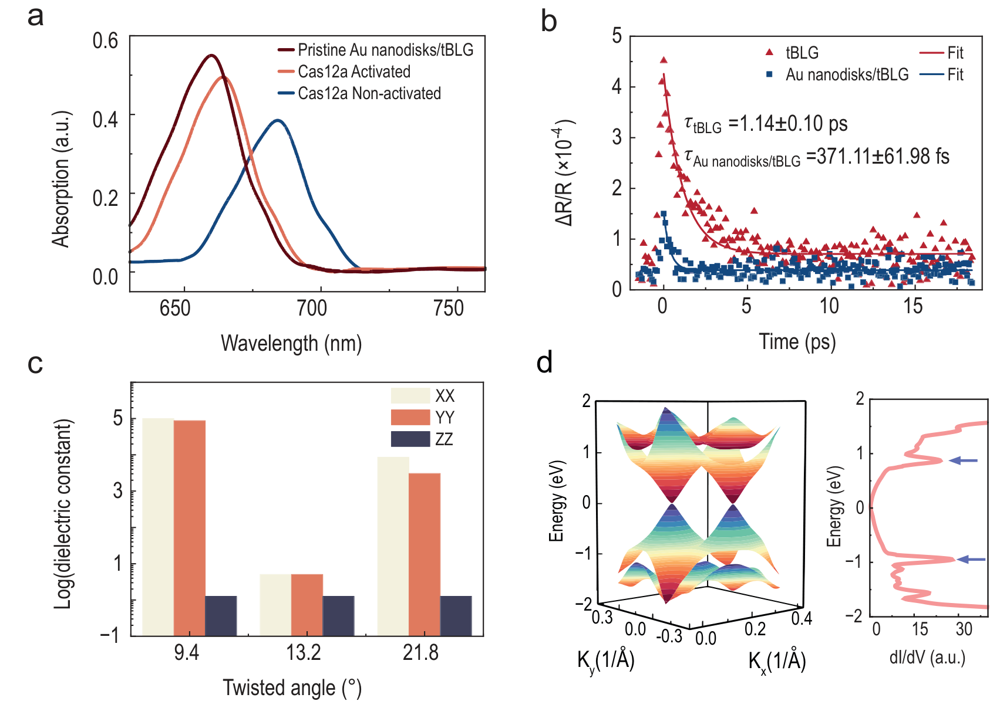
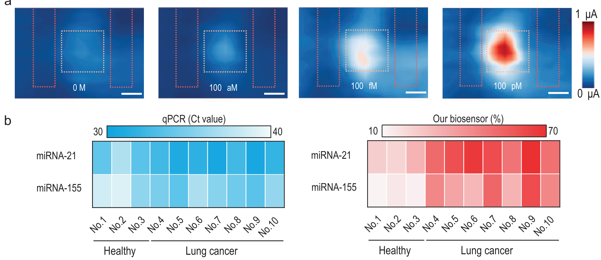

## duUltrasensitiveOptoelectronicBiosensor2025 — 基于扭曲双层石墨烯超晶格的超灵敏光电生物传感器阵列

## 📄 元数据
Bowen Du, Xilin Tian, Zhi Chen, Yanqi Ge, Chuanghu Chen, Haiyan Gao, Zhongyang Liu, Jungchen Tung, Dror Fixler, Songrui Wei, Shi Chen, Han Zhang，2025，National Science Review, 12(10): nwaf357，DOI: 10.1093/nsr/nwaf357
## 💡 一句话
将9.4°扭曲双层石墨烯的范霍夫奇点吸收与金纳米盘等离激元共振精确耦合，并通过DNA折纸-CRISPR-Cas12a系统动态调制局域介电环境，在60 μW低光照下实现了44.63 aM的免扩增核酸检测。
## 🔗 Wiki 双链
  - 概念 [[../concepts/moire-superlattice]]
  - 概念 [[../concepts/2d-materials]]
  - 概念 [[../concepts/density-functional-theory]]
  - 概念 [[../concepts/twistronics|转角电子学]]
  - 概念 [[../concepts/van-hove-singularity|范霍夫奇点]]
  - 概念 [[../concepts/exciton-plasmon-coupling|激子-等离激元耦合]]
  - 概念 [[../concepts/crispr-cas12a|CRISPR-Cas12a]]
  - 概念 [[../concepts/dna-origami|DNA折纸术]]
  - 概念 [[../concepts/dielectric-response|介电响应]]
  - 实体 [[../entities/twisted-bilayer-graphene|扭曲双层石墨烯]]
  - 实体 [[../entities/graphene|石墨烯]]
  - 实体 [[../entities/gold-nanodisks|金纳米盘]]
  - 实体 [[../entities/VASP|VASP]]
  - 图表 [[../figures/electronic-bands]]
  - 图表 [[../figures/experimental-setups]]
  - 图表 [[../figures/electronic-devices]]
  - 图表 [[../figures/heterostructures-stacking]]
  - 图表 [[../figures/heterostructures-stacking|铁弹畴、畴壁、In₂Se₃ 与器件应用 (Domains, Domain Walls, In₂Se₃ & Devices)]]
  - 年度 [[../write/2025-2029|2025]]
  - 概念 [[../concepts/local-dielectric-environment]]、[[../concepts/photoresponsivity]]、[[../concepts/trans-cleavage]]、[[../concepts/surface-plasmon-resonance]]
  - 实体 [[../entities/crispr-cas12a-protein]]、[[../entities/gold-nanoparticles]]、[[../entities/dna-origami-structure]]
  - 相关论文 **duUltrasensitiveOptoelectronicBiosensor2025**
## 📊 关键图表
  - **图1：传感器结构、激子-等离激元耦合原理与CRISPR检测流程**
  -  -> [[../figures/electronic-devices-sensors|传感器与探测器]]
  - **图示描述**：三个子图自上而下展示器件的"全家福"。(a) 从下至上依次为 SiO₂/Si 基底、9.4° tBLG、周期 274 nm、厚 50 nm 的金纳米盘阵列、四面体 DNA 折纸支架及其顶端 AuNP；(b) 将 tBLG 的 VHS 吸收与金纳米盘 LSPR 峰在 660 nm（1.88 eV）处对齐以形成激子-等离激元耦合；(c) 以 FDTD 反射谱说明无靶标时 AuNP 破坏耦合（关态、光电流低），靶标激活 Cas12a 反式切割后 AuNP 释放、耦合恢复（开态、光电流升高）。
  - **关键特征**：莫尔超晶格常数 1.501 nm；VHS 能量间隔 2E_VHS ≈ 1.84 eV，与 660 nm 光子能量 1.88 eV 精确对齐；选择 9.4° 大转角以避免 <5° 小转角常见的制备缺陷；信号开关由 CRISPR-Cas12a 的 ssDNA 反式切割驱动。
  - **结论/意义**：本图给出"转角电子学-等离激元-CRISPR"三层融合的统一器件架构，是全文从物理到生物传感的逻辑起点。
  - **图2：不同转角 tBLG 拉曼、金纳米盘形貌与光电性能**
  -  → [[../figures/experimental-setups|实验装置与测量系统]]
  - **图示描述**：(a) SLG 与 8.5°、9.4°、13.2°、17.5° tBLG 的 633 nm 拉曼光谱及 G 带空间映射；(b) 金纳米盘的 SEM 周期阵列与 AFM 高度轮廓；(c)(d) 对比 SLG、AB-BLG、Au/SLG、tBLG、Au/tBLG 五种结构的光电流-偏压与光电流-入射功率曲线；(e) 多周期 660 nm 光照下的实时开关响应；(f) 0、1、2 V 偏压下的空间分辨光电流成像及线扫描。
  - **关键特征**：9.4° tBLG 的 G 带最强，I_G/I_2D 比 SLG 高约 28.11 倍；金纳米盘周期 274 nm、厚约 50 nm、异质结面积 7 μm × 7 μm；60 μW 低光照下 Au/tBLG 光响应度 14.64 mA/W，是纯 tBLG（2.34 mA/W）的 6.27 倍，EQE 达 27.51%；多周期开关衰减 <5%；2 V 偏压下光电流中心峰高斯分布，FWHM ≈ 1.5 μm，与等离激元限域尺度吻合。
  - **结论/意义**：定量证明 9.4° 转角加金纳米盘的"双共振"设计是低光下光电流增强约 7 倍的直接来源。
  - **图3：吸收光谱蓝移、超快载流子动力学、DFPT 介电各向异性与 DFT/STS 的 VHS 验证**
  -  -> [[../figures/electronic-bands-dos-fermi|态密度与费米面]]
  - **图示描述**：(a) 原始 Au/tBLG、Cas12a 激活后（AuNP 释放）与未激活 AuNP/Au/tBLG 三种状态的吸收光谱对比；(b) 飞秒泵浦-探测测得的纯 tBLG 与 Au/tBLG 差分反射 ΔR/R 单指数衰减；(c) DFPT 计算 9.4°、13.2°、21.8° tBLG 的面内 εXX/εYY 与面外 εZZ 介电常数；(d) DFT 能带结构与 STS 测得的局域态密度（LDOS）对照。
  - **关键特征**：吸收峰在 AuNP 释放后由 684 nm 蓝移至 663 nm（残留 DNA 使激活样品相对原始 660 nm 仍略红移）；Au/tBLG 载流子弛豫时间 τ = 371.11 ± 61.98 fs，比纯 tBLG 的 1.14 ± 0.10 ps 快约 3 倍，同时光响应度反升 6.27 倍；9.4° tBLG 面内 εXX/εYY 比 13.2°、21.8° 高数个数量级，面外 εZZ 在所有转角下均低；STS 在约 1.84 eV 处观测到 LDOS 峰，与 DFT 的 VHS 能量及 660 nm 光子能量 1.88 eV 三重吻合。
  - **结论/意义**：从光谱、超快动力学、介电张量和电子态密度四个角度同时确证激子-等离激元耦合与 VHS 的物理图像。
  - **图4：转角依赖的光响应度、偏压调制与 FDTD 热点**
  -  → [[../figures/heterostructures-stacking|异质结与堆叠]]
  - **图示描述**：(a) 集成相同尺寸金纳米盘的 8.5°、9.4°、13.2°、17.5° 器件归一化光响应度随入射光子能量的变化；(b) 各转角器件响应度随 0–2 V 偏压的变化；(c) 9.4° Au/tBLG 调制深度 ΔM 随偏压的曲线，内嵌 FDTD 光场热点分布；(d) 不同转角纯 tBLG 的调制深度与阈值电压对比。
  - **关键特征**：9.4° 器件响应在约 1.88 eV 处出现尖峰，恰好对应 2E_VHS = 1.84 eV 与 660 nm 光能量；9.4° Au/tBLG 在仅 0.2 V 偏压下即达到 ΔM ≈ 100%；纯 tBLG 中 9.4° 样品阈值电压最低，与 DFPT 给出的最高面内介电常数一致；FDTD 显示热点集中于金纳米盘边缘。调制深度定义 ΔM = (Cp−C)/(Cp+C)。
  - **结论/意义**：把宏观光电性能与"转角-介电常数-等离激元热点"的定量链条对应起来，说明 9.4° 的优势来自物理共振而非工艺偶然。
  - **图5：DNA 折纸组装与 miRNA-21 定量检测性能**
  -  → [[../figures/experimental-setups|实验装置与测量系统]]
  - **图示描述**：(a) 9 条 DNA 单链逐步折叠成四面体 DNA 折纸并经链 9 连接 AuNP 的示意图；(b) L1–L5 泳道的 PAGE 凝胶电泳；(c) 三角形 DNA 折纸的 TEM 图像；(d) AuNP/DNA 折纸/Au 纳米盘/tBLG 探针的 AFM 形貌与高度直方图；(e) 不同靶标浓度下的光电流-偏压曲线；(f) 信号变化率 ΔI% 对靶标浓度负对数的标准曲线。
  - **关键特征**：TEM 下可见清晰三角形折纸结构；AFM 探针高度集中在 18–21 nm，均一性高，是 FDTD 精确建模的基础；浓度梯度 10 aM–100 pM 跨 7 个数量级；信号变化率 ΔI = (I2−I1)/I0 × 100%（I0 基线、I1 AuNP 固定后、I2 反式切割后）；按 IUPAC 3σ 标准、阈值 6.45% 计算 LOD = 44.63 aM；检测时间 <1 小时，可区分单核苷酸错配。
  - **结论/意义**：把 CRISPR-Cas12a 的分子识别直接转译为定量光电信号，将免扩增核酸检测灵敏度推至阿摩尔级。
  - **图6：浓度依赖的空间光电流成像与肺癌临床样本 qPCR 对比**
  -  -> [[../figures/electronic-devices-sensors|传感器与探测器]]
  - **图示描述**：(a) 滴加 0 M、100 aM、100 fM、100 pM 靶标后 AuNP/Au/tBLG 阵列的空间光电流映射，显示浓度依赖的信号恢复；(b) 10 例健康人与肺癌患者血浆样本中 miRNA-21 与 miRNA-155 的热图对比，左为本传感器信号变化率 ΔI%，右为 qPCR 的 Ct 值。
  - **关键特征**：随靶标浓度升高，阵列像元光电流系统性增强，空间分布与等离激元热点区域一致；本传感器在健康/肺癌样本以及两种 miRNA 之间的信号差异度均显著高于 qPCR Ct 值的区分度；与 qPCR 结果高度一致；器件在 PBS 缓冲液和全血中孵育 20 天后仍保持高响应保真度（见补充图 S13）。
  - **结论/意义**：在真实临床血浆样本中验证了平台的特异性、长期稳定性和向精准诊断/POCT 转化的可行性。
## 🔬 项目连接
  - **project-5（SnTe铁电模拟）— weak**：本文使用DFPT计算tBLG的面内/面外介电常数张量（εXX/εYY/εZZ），计算流程（PBE泛函、500 eV截断、DFPT从OUTCAR读取介电张量）与铁电材料介电/声子计算在方法层面有共通之处。但其物理体系（石墨烯莫尔超晶格 vs SnTe铁电）和研究目标（光电传感 vs 铁电极化）差异很大，仅DFPT方法可参考。
  - **project-6（湿度传感器）— weak**：本文是二维材料基光电传感器，展示了利用2D材料介电环境变化进行信号转导的器件架构，以及金纳米结构增强信号的思路。湿度传感同样依赖材料表面介电/电导环境变化，但本文的靶标（核酸）、机制（CRISPR酶切+等离激元耦合）和读出方式（光电流）与湿度传感截然不同，仅"2D材料+介电环境调制+电学读出"的器件概念有形式上的可借鉴性。
  - project-1（双光子）、project-2（Mn多铁）、project-3（机械发光NN）、project-4（TTF分子计算）、project-7（CDW）：无直接项目连接。
## 🔗 项目双链
- 项目 [[../projects/project-5-snte-ferroelectric-sim|项目五：lammps势函数SnTe铁电模拟]]
- 项目 [[../projects/project-6-humidity-sensor|项目六：小花闻的电压湿度传感器]]

## 📝 组织与用词
文章采用"器件设计构建 → 物理机制验证 → 光电性能表征 → 生物传感验证 → 临床转化"的经典递进结构。先建立tBLG/金纳米盘的物理增强层，再叠加DNA折纸-CRISPR生物识别层，层层验证。值得复用的术语：
  - [[../concepts/twistronics|twistronics / 转角电子学]]
  - [[../concepts/van-hove-singularity|van Hove singularity]] (VHS) / 范霍夫奇点
  - moiré superlattice / 莫尔超晶格 [[../concepts/moire-superlattice|莫尔超晶格]]
  - [[../concepts/exciton-plasmon-coupling|exciton–plasmon coupling / 激子-等离激元耦合]]
  - localized surface plasmon resonance (LSPR) / 局域表面等离激元共振
  - trans-cleavage / 反式切割
  - [[../concepts/dna-origami|DNA origami / DNA折纸术]]
  - photoresponsivity / 光响应度
  - modulation depth (ΔM) / 调制深度
  - external quantum efficiency (EQE) / 外量子效率
  - [[../concepts/localized-surface-plasmon-resonance|localized-surface-plasmon-resonance]]
## ✏️ 可写入 Wiki 的要点
  1. 9.4° tBLG的VHS能量间隔2E_VHS ≈ 1.84 eV，与660 nm光子能量（1.88 eV）和[[../entities/gold-nanodisks|金纳米盘]]LSPR峰精确对齐，实现激子-等离激元[[../concepts/strong-coupling|强耦合]]。VHS能量与转角的经验关系为E_vhs = E₀|sin(3θ)|，E₀ = 3.9 eV。
  2. 金纳米盘/tBLG异质结在60 μW低光照下光响应度达14.64 mA/W，是纯tBLG（2.34 mA/W）的6.27倍，EQE 27.51%，光电流密度为纯tBLG的7倍。金纳米盘参数：周期274 nm，厚度 50 nm （Cr/Au 5/45 nm），异质结面积7 μm × 7 μm。
  3. 飞秒泵浦-探测揭示：纯tBLG载流子弛豫时间τ = 1.14 ± 0.10 ps（VHS态局域化载流子），金纳米盘/tBLG缩短至371.11 ± 61.98 fs（快约3倍），同时光响应度反升6.27倍，证明耦合极化激元加速了能量转移而非简单猝灭。Au-SLG仅缩短35.5%（555.62 fs vs SLG 861.44 fs）但光响应度有限，排除了纯等离激元贡献的主导地位。
  4. DFPT计算表明9.4° tBLG面内介电常数εXX/εYY比13.2° 与 21.8° tBLG高数个数量级，面外εZZ在所有转角下均低。这种强[[../concepts/migdal-eliashberg-theory|各向异性]]意味着电场仅通过面内极化有效调制，9.4°的高ε增强了界面电荷屏蔽和电场局域，放大等离激元热点。
  5. STS测量在约1.84 eV处观测到LDOS峰，与DFT计算的VHS能量和660 nm光子能量（1.88 eV）三重吻合，是VHS存在的直接实验证据。拉曼G带在9.4°最强，I_G/I_2D比SLG高约28.11倍。
  6. 9.4°器件在0.2 V偏压下即达到近100%调制深度（ΔM = (Cp−C)/(Cp+C)），阈值电压显著低于其他转角，与其高面内介电常数一致。空间光电流成像呈高斯分布，FWHM约1.5 μm，与等离激元限域尺度吻合。
  7. CRISPR-Cas12a检测机制：无靶标时DNA折纸锚定的AuNP（探针高度18–21 nm）破坏[[../concepts/exciton-plasmon-coupling|激子-等离激元耦合]]，吸收峰红移至684 nm，光电流低（关态）；靶标miRNA-21激活Cas12a反式切割ssDNA连接子，AuNP释放，吸收峰蓝移至663 nm，耦合恢复，光电流升高（开态）。残留DNA链导致峰位比原始660 nm略有红移（663 nm）。
  8. 生物传感性能：LOD = 44.63 aM（IUPAC 3σ标准，阈值6.45%），动态范围10 aM–100 pM跨7个数量级，检测时间<1小时，可区分单核苷酸错配，在PBS和全血中20天保持高响应保真度。信号变化率公式ΔI = (I₂−I₁)/I₀ × 100%（I₀基线、I₁ AuNP固定后、I₂反式切割后）。
  9. 临床验证：10例肺癌患者血浆样本中miRNA-21 与 miRNA-155检测结果与qPCR高度一致，且本传感器信号变化率显著高于qPCR的Ct值区分度，展示了更高的信号对比度。
  10. DFT计算参数：GGA-PBE泛函，平面波截断500 eV，2×2×1 Monkhorst-Pack K网格，15 Å z轴真空层，力收敛0.01 eV/Å，能量收敛10⁻⁵ eV（弛豫）/10⁻⁷ eV（SCF），DFT-D3范德华校正，介电常数由DFPT计算从OUTCAR读取。器件制备采用CVD[[../entities/graphene|石墨烯]]、800 nm飞秒激光切割、EBL（EBPG 5150）图案化。
