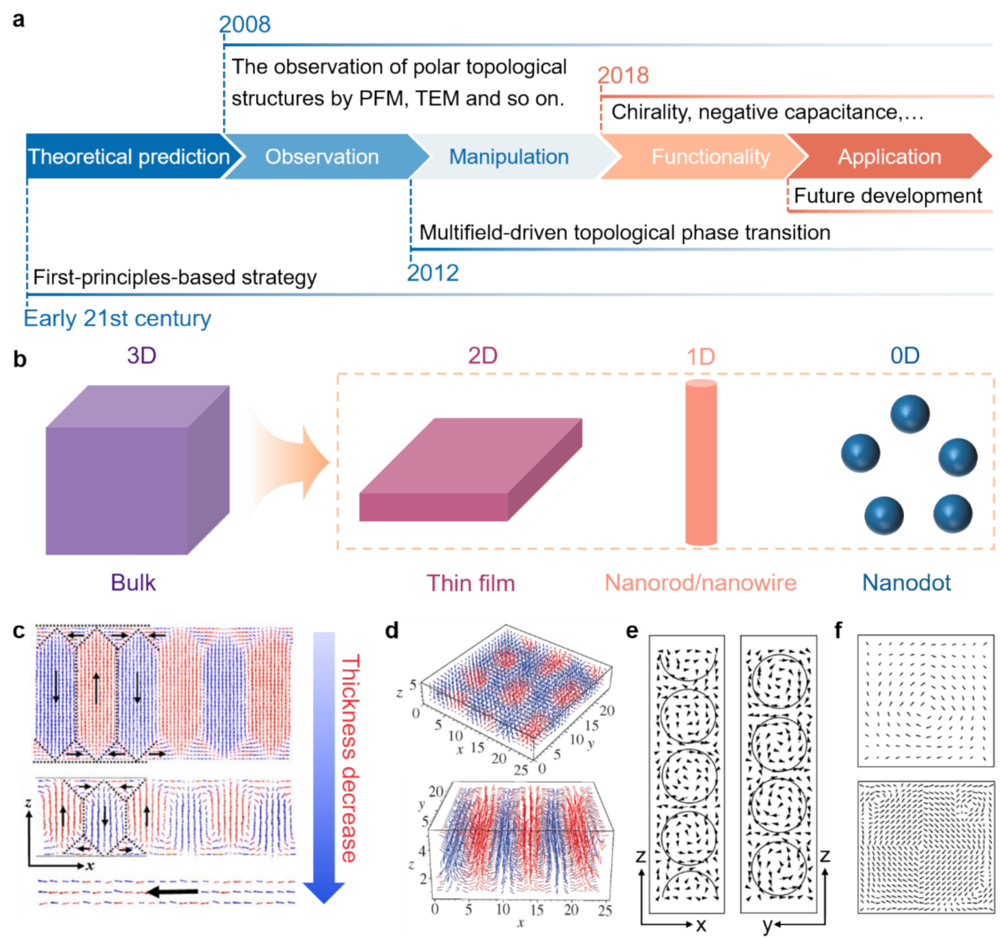
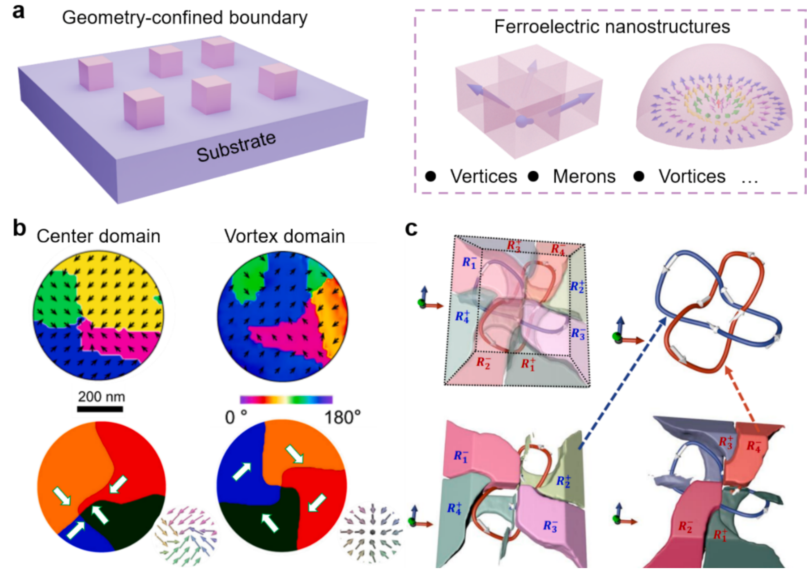
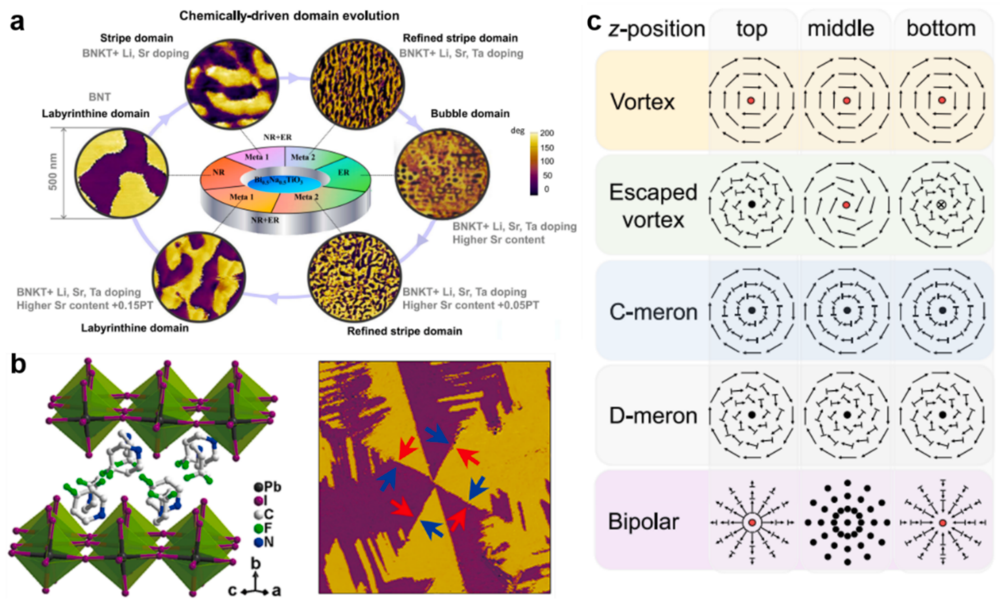
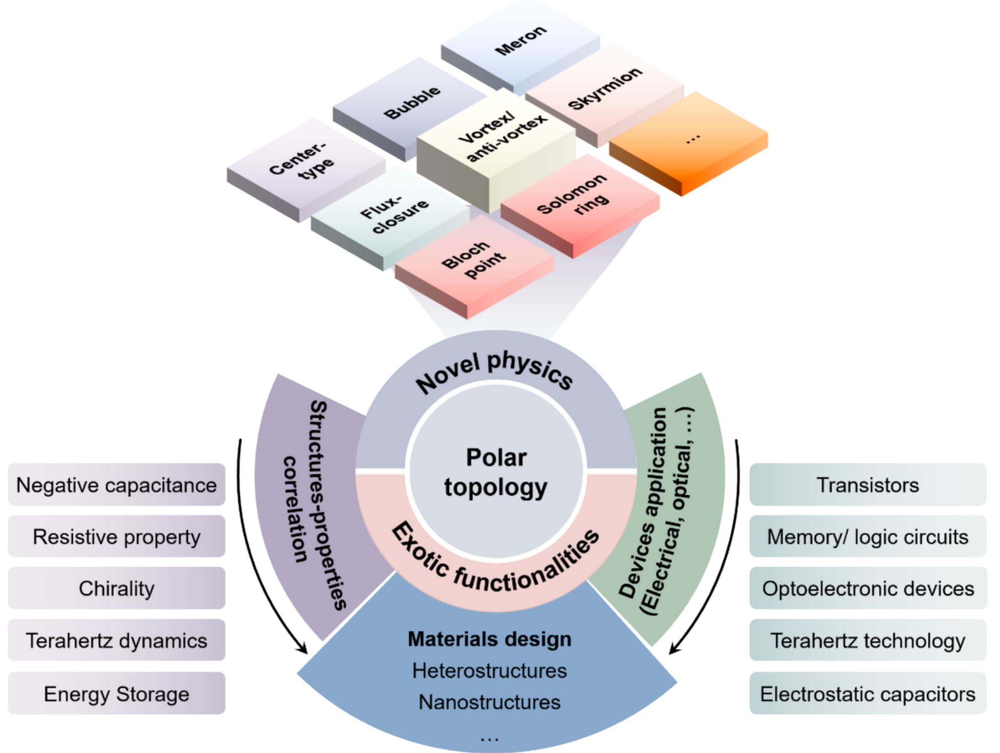

## hanPolarTopologicalMaterials2025 — 极性拓扑材料与器件：前景与挑战

## 📄 元数据
Han, Ma, Wang, Xu, Xu, Huang, Shen, Nan, Ma (通讯)，2025，*Progress in Materials Science* 153, 101489，DOI 10.1016/j.pmatsci.2025.101489（清华大学材料学院、昆明理工、北京理工）。
## 💡 一句话
从体自由能、静电能、弹性能与梯度能竞争的统一能量视角，系统综述铁电体中通量闭合畴、涡旋、斯格明子、半子、所罗门环、布洛赫点等极性拓扑结构的设计原理、多场（电/力/光/热）操控以及电阻开关、负电容、手性、涡旋子等涌现功能，并提出五大器件化挑战。
## 🔗 Wiki 双链
  - 概念 [[../concepts/topological-defects]]、[[../concepts/multiferroicity]]、[[../concepts/magnetoelectric-coupling]]、[[../concepts/strain-engineering]]、[[../concepts/polarization-switching]]、[[../concepts/ferroelasticity]]、[[../concepts/ferroelectric-tunnel-junction]]、[[../concepts/polar-vortex|极性涡旋]]、[[../concepts/polar-skyrmion|极性斯格明子]]、[[../concepts/negative-capacitance|负电容]]、[[../concepts/flexoelectric-effect|挠曲电效应]]、[[../concepts/vortexon|涡旋子]]、[[../concepts/electric-dmi|电DM相互作用]]、[[../concepts/topological-charge|拓扑荷]]、[[../concepts/flux-closure-domain|通量闭合畴]]、[[../concepts/meron|半子]]、[[../concepts/solomon-ring|所罗门环]]、[[../concepts/phase-field-modeling|相场模拟]]、[[../concepts/depolarization-field|退极化场]]、[[../concepts/domain-wall-conduction|畴壁导电]]、[[../concepts/chirality|手性]]、[[../concepts/kosterlitz-thouless-transition|KT相变]]
  - 实体 [[../entities/BiFeO3]]、[[../concepts/domain-wall]]、[[../entities/PbTiO3]]、[[../entities/SrTiO3]]、[[../entities/PZT]]、[[../entities/BaTiO3]]、[[../entities/PVDF-TrFE]]、[[../entities/HfO2]]、[[../entities/SrRuO3]]
  - 图表 [[../figures/domain-walls]]、[[../figures/heterostructures-stacking]]、[[../figures/crystal-structures]]、[[../figures/electronic-devices]]、[[../figures/experimental-setups]]、[[../figures/heterostructures-stacking-polar-cdw|极性金属、拓扑相、CDW与相变]]
  - 年度 [[../write/2025]]
  - 项目 [[../projects/project-2-mn-multiferroics]]、[[../projects/project-5-snte-ferroelectric-sim]]
  - 相关论文 **hanPolarTopologicalMaterials2025**
## 📊 关键图表
  -  -> [[../figures/mathematical-models-formulas|光学、输运与其他解析公式]]
    - **图示描述**：(a) 2003 年 BaTiO₃ 纳米点涡旋预测到 2021 年所罗门环等复杂拓扑发现的时间线；(b) 从三维块体到零维纳米点的降维策略；(c–f) PZT 薄膜厚度依赖的 180° 条带畴→通量闭合畴，以及超薄 PZT 膜、BaTiO₃ 纳米点中由退极化场驱动的气泡畴/涡旋畴相场模拟。
    - **关键特征**：纵轴为薄膜厚度/单位晶胞，PZT 膜减薄使面外 180° 条带畴向通量闭合畴过渡；模拟晶胞如 12×12×12 cells；气泡畴与涡旋畴均由退极化场驱动，是实验证实前的理论预言。
    - **结论/意义**：奠定了"通过尺寸效应与退极化场设计极性拓扑"的思路，是该领域从理论走向实验的起点。
  -  -> [[../figures/domain-walls-structures|畴结构与畴壁]]
    - **图示描述**：以彩色极化箭头定义六类基本极性拓扑：(a) 畴壁、(b) 通量闭合畴、(c) 涡旋、(d) 反涡旋、(e) 半子（刺猬型/涡旋型）、(f) 斯格明子（Néel 型/Bloch 型）。
    - **关键特征**：通量闭合畴中极化矢量首尾相连形成闭合回路；涡旋环绕核心旋转，按核心面外分量分为手性/非手性；反涡旋与涡旋成对出现、拓扑荷相反；半子核心带面外极化；斯格明子核心与外围极化反向、过渡区为面内极化。
    - **结论/意义**：该图是全文的"词典"，统一了各类极性拓扑结构的极化排布和分类术语。
  -  -> [[../figures/domain-walls-structures|畴结构与畴壁]]
    - **图示描述**：(a) 四方相与菱方相无机铁电体的极化变体对比；(b) 有机分子链取向柔性；(c) Bloch 型畴壁中极化在畴壁平面内旋转；(d) 通过调控各向异性平坦化 Landau 自由能势阱、降低极化旋转能垒的核心概念图。
    - **关键特征**：四方相沿 <100>、菱方相沿 <111> 给出有限的极化变体；有机分子链允许更连续的取向；降低各向异性可使 Landau 势阱变浅、可访问极化态数量增加。
    - **结论/意义**：阐明体自由能/各向异性是阻碍极化连续旋转的根源，平坦化 Landau 能垒是设计极性拓扑的第一性策略。
  -  -> [[../figures/experimental-setups|实验装置与测量系统]]
    - **图示描述**：(a) 扫描探针显微镜（SPM）写入装置示意；(b) 正/负偏压下中心发散/会聚电场及面内拖尾场分布；(c,d) BFO 薄膜中由探针电场写入的通量闭合畴与中心型象限畴 PFM 图像。
    - **关键特征**：探针偏压不仅产生垂直电场，其面内拖尾场可驱动极化旋转；BFO 薄膜中可电场写入闭合畴和四象限中心畴；这是外场调控极性拓扑的典型范例。
    - **结论/意义**：证明 SPM 局域电场可作为"笔"在连续膜中可逆写入拓扑畴，为电写拓扑器件提供基础。
  -  -> [[../figures/domain-walls-structures|畴结构与畴壁]]
    - **图示描述**：(a–d) 退极化场作用下畴结构从单畴→条带畴→通量闭合畴→涡旋畴的逐步演化示意（d 为薄膜厚度、ω 为畴尺寸）；(e) La 掺杂 BFO 纳米岛中通过降低缺陷载流子浓度，将带电畴壁顶点畴转变为 71° 中性畴壁涡旋畴；并展示挠曲电场贡献。
    - **关键特征**：随厚度 d 减小/退极化场增强，极化以连续旋转降低静电能；La³⁺ 取代 A 位减少屏蔽电荷，使十字形带电畴壁被中性畴壁替代并自发形成涡旋；挠曲电场在应变梯度处提供额外旋转驱动力。
    - **结论/意义**：把"内在静电能调控"具体化为厚度工程、掺杂调控屏蔽、挠曲电三条路径。
  -  → [[../figures/crystal-structures-xrd-phases|XRD与相变]]
    - **图示描述**：(a) ABO₃ 外延异质结晶格失配示意；(b,c) 张/压应变诱导极化旋转以及各向同性/异性应变对畴结构影响；(d) PTO 基薄膜在不同面内应变 ε_xx 下的拓扑相图；(e,f) 有机聚合物 P(VDF-TrFE) 中面内双轴应变稳定环状拓扑织构。
    - **关键特征**：张应变倾向面内极化、压应变倾向面外极化；双轴各向同性应变与各向异性应变给出不同旋转路径；PTO 基薄膜在合适应变窗口出现涡旋/斯格明子等；P(VDF-TrFE) 在双轴应变下出现环形极性拓扑。
    - **结论/意义**：系统说明弹性能（外延应变）是与静电能并列的第二大设计自由度，且可同时作用于无机与有机铁电体。
  -  → [[../figures/domain-walls-structures|畴结构与畴壁]]
    - **图示描述**：(a) 具有可变静电、弹性等边界条件的铁电/介电异质结示意；(b) DyScO₃ 衬底上 (PTO)n/(STO)n 超晶格随周期 n 变化的畴结构拓扑相图。
    - **关键特征**：PTO 为位移型铁电层、STO 为绝缘介电层并引入强退极化与界面耦合；随 n 减小依次出现 c 畴→通量闭合畴→涡旋→a₁/a₂ 畴；DSO 衬底约 1.2% 拉伸应变下涡旋对阵列周期约 9–10 nm；换衬底可得到斯格明子泡、偶极波、半子晶格、布洛赫点等。
    - **结论/意义**：把异质结周期与衬底选择变成可系统化调谐拓扑相的旋钮，是 PTO/STO 成为模型体系的关键证据。
  -  -> [[../figures/domain-walls-switching-properties|极化翻转与铁电性能]]
    - **图示描述**：(a) 不同几何形状铁电纳米结构在弹性/静电边界约束下的示意；(b) BFO 纳米岛中心畴与涡旋畴的 PFM 矢量图（上）与相场模拟（下）；(c) BFO 纳米晶中由两个缠绕涡旋构成的极性所罗门环相场模拟。
    - **关键特征**：BFO 纳米岛典型横向尺寸 200–600 nm、高度 10–40 nm，R3c 结构有 8 个极化变体；中心畴中大静电能释放导致涡旋状核心，涡旋畴则具导电的中心收敛核心；所罗门环由两个头尾相接、互相缠绕的涡旋组成。
    - **结论/意义**：展示几何受限纳米岛可稳定比薄膜更复杂的拓扑（中心畴、反涡旋、所罗门环），是多铁拓扑研究的主要平台之一。
  -  -> [[../figures/crystal-structures-bulk|体相晶体结构]]
    - **图示描述**：(a) Bi₀.₅Na₀.₅TiO₃ 基陶瓷中由化学组成驱动的畴演化；(b) (4,4-DFPD)₂PbI₄ 薄膜中极性象限畴的晶体结构与侧向 PFM 图像；(c) 向列态（NF）铁电液晶中依赖于展曲/弯曲弹性模量比 K₁₁/K₃₃ 与极化 P₀ 的拓扑相图。
    - **关键特征**：BNT 中成分微调可驱动条带畴到更复杂拓扑；2D 杂化钙钛矿 (4,4-DFPD)₂PbI₄ 中出现象限畴；液晶相图把拓扑类型与 K₁₁/K₃₃、P₀ 直接关联。
    - **结论/意义**：把极性拓扑从外延氧化物拓展到无铅块体陶瓷、2D 杂化钙钛矿与铁电液晶，说明设计原理的普适性。
  -  -> [[../figures/domain-walls-structures|畴结构与畴壁]]
    - **图示描述**：(a) 原子分辨 HAADF-STEM 实时观测 PTO/STO 超晶格在外电场下涡旋→波→单畴（极化向下）的转变；(b) BFO 纳米岛在 SPM 电场下中心畴↔涡旋畴的可逆、非易失性 PFM 图与相场模拟；(c) P(VDF-TrFE) 中极性螺旋在机械/电场下集体旋转；(d) PTO/STO 中亚皮秒光脉冲与加热驱动铁电畴、涡旋、三维超晶相之间转变的相场结果。
    - **关键特征**：STEM 比例尺 2 nm；连续膜中电场诱导相变多为易失，纳米岛中可非易失；机械力通过挠曲电/压电/铁弹翻转有机螺旋；光脉冲可创建三维涡旋超晶相，τ 为弛豫时间；升温还可驱动涡旋→波→c 畴及类 KT 相变。
    - **结论/意义**：系统证明电、力、光、热多场均可操控极性拓扑，为多功能拓扑器件奠定实验基础。
  -  -> [[../figures/domain-walls-structures|畴结构与畴壁]]
    - **图示描述**：(a) c-AFM 测试示意与电流分布图，显示 BFO 纳米岛十字形带电畴壁处的巨大电导；(b) 通过电场控制畴壁通断实现 NOT 等逻辑门；(c) 自支撑 PTO/STO 双层中类斯格明子畴在 ±5 V 下可逆阻变。
    - **关键特征**：中心发散态下"头对头"→"尾对尾"畴壁转变使电导提升约 3 个数量级；±3 V 循环可超 100 次；逻辑门能耗约 3.9 aJ、速度约 20 ns；类斯格明子存储密度 >200 Gbit/in²，3.2 nm 构型理论极限接近 60,000 Gbit/in²；图标尺 50 nm。
    - **结论/意义**：把畴壁/拓扑核的电导各向异性转化为可用的阻变与逻辑功能，是拓扑存储/逻辑器件的代表性证据。
  -  -> [[../figures/crystal-structures-bulk|体相晶体结构]]
    - **图示描述**：(a) 共振软 X 射线衍射（RSXD）利用圆偏振光探测涡旋阵列手性；(b) X 射线圆二色（XCD）mapping 显示不同区域涡旋阵列手性符号相反；(c) "电写-光读"手性光电器件概念；(d) SHG-CD 图中电场在有序 La 掺杂 BFO 纳米岛阵列上写入"T"字形手性图案。
    - **关键特征**：软 X 射线波长 2–3 nm 匹配约 11 nm 涡旋周期；La 掺杂 BFO 纳米岛约 250 nm，其孤立涡旋手性信号可被电场可逆、非易失地擦写；SHG-CD mapping 比例尺 1 μm。
    - **结论/意义**：给出手性可读、可写、可图案化的完整证据链，推动极性拓扑进入手性光电集成与显示领域。
  -  -> [[../figures/heterostructures-stacking|异质结与堆叠]]
    - **图示描述**：(a) CW/CCW 涡旋对集体动力学被建模为弹簧连接的球链，可作横向/纵向振动；(b) THz 泵浦-硬 X 射线探针下 004 超晶格峰与 δ04 卫星峰的傅里叶谱，显示可调涡旋子模式；(c,d) 原子位移涡旋（紫）与静态极化涡旋（品红）在振荡周期内的动态演化，包含手性周期性反转。
    - **关键特征**：涡旋子频率约 0.08–0.3 THz 可调；弹性能决定等效弹簧常数；η 为归一化衍射强度；手性在 CW/CCW 之间动态反转。
    - **结论/意义**：在实验上证实了"涡旋子"这一集体拓扑激发，为 THz 声子工程与超高速数据处理提供新机制。
  -  -> [[../figures/electronic-devices-memory-transistors|存储器与晶体管]]
    - **图示描述**：综述总结图，把极性拓扑材料-器件研究的现状与未来路线图概括为五大方向：CMOS 兼容/无铅材料、跨尺度多场机制表征、单点寻址与阵列化集成、多功能/多铁拓扑耦合、电 DMI 等新物理。
    - **关键特征**：材料上指向 HfO₂ 萤石相、AlN 纤锌矿相、自支撑氧化物膜、有机/液晶；表征上强调跨尺度、多模态、原位；器件上要求孤立寻址、规则阵列、读写速度/功耗/保持/耐久评估；物理上突出电 DMI 与多铁拓扑孤子。
    - **结论/意义**：为领域提供清晰路线图，是论文对后续研究最直接的导向。
## 🔬 项目连接
  - **project-2 Mn多铁 — strong**：本文以大量篇幅讨论BiFeO3（与项目核心多铁材料同族）：BFO纳米岛中的中心畴/涡旋/所罗门环/反涡旋、带电畴壁巨电导、La掺杂调控、以及最新"电场诱导多铁性拓扑孤子"（BFO薄膜中极性拓扑与反铁磁自旋摆线通量闭合的空间共存）。多铁拓扑结构中极化-自旋耦合与磁电器件方向是 project-2 直接可借鉴的物理图像与材料体系；BFO的R3c对称性、八极化变体、铁弹-铁电耦合机制亦可迁移至锰基多铁体。
  - **project-5 SnTe铁电模拟 — strong**：本文系统给出了铁电畴拓扑的GL/相场理论框架——总自由能 F_P=∫(f_bulk+f_elec+f_elas+f_grad)dV 的四项分解、退极化场与应变如何驱动极化连续旋转、拓扑电荷定义、电场/应变场下的拓扑相变序列（涡旋↔波↔单畴、斯格明子↔半子晶格）。这一能量分解和相场方法论可直接用于SnTe铁电畴/拓扑缺陷的模拟设计；负电容、畴壁导电、挠曲电、面内/面外极化竞争等功能物理对SnTe器件模拟亦有直接参考价值。
## 🔗 项目双链
- 项目 [[../projects/project-2-mn-multiferroics|项目二：Mn极化结构铁电材料]]
- 项目 [[../projects/project-5-snte-ferroelectric-sim|项目五：lammps势函数SnTe铁电模拟]]

## 📝 组织与用词
文章按"历史与定义 → 设计原理（体自由能/静电能/弹性能三类能量调控）→ 典型材料（异质结/纳米结构/其他）→ 多场操控（电/力/光/热）→ 功能（电阻/负电容/手性/THz/储能）→ 展望（五大挑战）"递进；核心论证主线是"通过四项自由能竞争克服晶格对极化方向的约束，使极化连续旋转"。值得复用的术语：
  - 极性拓扑结构 (polar topological structure)
  - 拓扑荷/拓扑不变量 ([[../concepts/topological-charge|topological charge]] / invariant)
  - 退极化场 ([[../concepts/depolarization-field|depolarization field]])
  - 通量闭合畴 ([[../concepts/flux-closure-domain|flux-closure domain]])
  - 极性涡旋/斯格明子/半子 ([[../concepts/polar-vortex|polar vortex]] / skyrmion / meron)
  - 相场模拟 ([[../concepts/phase-field-modeling|phase-field simulation]])
  - 挠曲电效应 ([[../concepts/flexoelectric-effect|flexoelectric effect]])
  - 电DM相互作用 ([[../concepts/dzyaloshinskii-moriya-interaction|electric Dzyaloshinskii-Moriya interaction]], eDMI)
  - 涡旋子 ([[../concepts/vortexon|vortexon]])
  - 多铁性拓扑孤子 (multiferroic topological soliton)
  - [[../concepts/multiferroic-topological-soliton|multiferroic-topological-soliton]]
## ✏️ 可写入 Wiki 的要点
  1. 极性拓扑结构的形成由总自由能四项竞争决定：F_P=∫(f_bulk+f_elec+f_elas+f_grad)dV（含时Ginzburg-Landau方程）；调控各能量项相对大小即可克服晶格[[../concepts/migdal-eliashberg-theory|各向异性]]、实现极化连续旋转。
  2. [[../concepts/topological-charge|拓扑荷]]量化公式 N=(1/4π)∬P̂·(∂P̂/∂x × ∂P̂/∂y)dxdy：[[../concepts/flux-closure-domain|通量闭合畴]]/涡旋/涡旋型半子为±0.5，[[../concepts/skyrmion|斯格明子]]/反斯格明子为±1；同拓扑荷态之间可发生拓扑相变（如左旋↔右旋涡旋、中心收敛↔中心发散畴）。
  3. (PTO)n/(STO)n[[../concepts/superlattice|超晶格]]在DyScO3衬底~1.2%拉伸应变下呈现顺时针/逆时针涡旋对阵列（截面间距9–10 nm）；随周期n减小依次为c畴→通量闭合畴→涡旋→a1/a2畴；换衬底可得到斯格明子泡（STO衬底）、偶极波、半子晶格（SmScO3大拉伸应变，拓扑荷0.5）、布洛赫点（SRO夹持PTO膜）。
  4. BiFeO3纳米岛（自组装，200–600 nm，R3c，8个极化变体）中稳定中心收敛/发散畴、双中心畴、涡旋、[[../concepts/antivortex|反涡旋]]乃至[[../concepts/solomon-ring|所罗门环]]（两个缠绕涡旋）；La³⁺掺杂A位减少屏蔽电荷，使十字形带电畴壁转变为71°中性畴壁并自发形成涡旋畴。
  5. 多场操控：电场（SPM/原位STEM）可驱动涡旋→波→单畴（连续膜中多为易失，纳米岛中可非易失）；机械力通过挠曲电/压电/铁弹翻转极化（褶皱STO膜实现非极性→半子/迷宫畴）；亚皮秒光脉冲在PTO/STO中创建三维涡旋超晶相；升温驱动涡旋→波→c畴及类Kosterlitz-Thouless相变、斯格明子→二维四方半子晶格。
  6. 电阻功能：BFO纳米岛十字形带电畴壁在中心发散态下头对头→尾对尾畴壁转变使电导提升三个数量级，±3 V循环>100次；导电畴壁通断可构建NOT/OR/AND逻辑门，能耗~3.9 aJ、速度~20 ns；自支撑PTO20/STO10双层类斯格明子畴可逆阻变，存储密度>200 Gbit/in²，理论极限（3.2 nm构型）接近60,000 Gbit/in²。
  7. [[../concepts/negative-capacitance|负电容]]：稳态负电容首次在PTO/STO涡旋核心和受抑PTO层畴壁处微观观测到，[[../concepts/polar-skyrmion|极性斯格明子]]外围亦有局域负介电常数；源于拓扑核处[[../concepts/metastability|亚稳态]]极化转变（dP/dE<0），为低功耗 steep-switching 晶体管提供物理基础。
  8. 手性与"电写光读"：轴向极化分量+涡度使涡旋/Bloch型斯格明子具手性；RSXD（软X射线波长2–3 nm匹配~11 nm涡旋周期）和SHG-CD可探测；La掺杂BFO纳米岛（~250 nm）中孤立涡旋的手性信号可被电场可逆、非易失地擦除/写入，实现手性光电集成与显示。
  9. [[../concepts/vortexon|涡旋子]]（vortexon）：PTO/STO涡旋阵列在THz泵浦-硬X射线衍射探针下呈现皮秒级集体振荡，涡旋手性在CW/CCW间动态反转，频率0.08–0.3 THz可调，由弹性能调控弹簧常数；为THz声子工程与超高速数据处理提供新机制。
  10. 五大展望挑战：拓展CMOS兼容/无铅材料（HfO2萤石相、AlN纤锌矿相、自支撑氧化物膜、有机/液晶）；发展跨尺度多模态原位表征并厘清力/光/热场机制；实现单点独立寻址、规则阵列化与读写速度/功耗/保持/耐久评估；探索多铁拓扑孤子（BFO中极性+反铁磁拓扑共存）的[[../concepts/magnetoelectric-coupling|磁电耦合]]器件；验证eDMI（[[../concepts/oxygen-octahedra-tilting|氧八面体倾斜]]/[[../entities/HfO2|氧化铪]]氧亚晶格畸变驱动）以稳定室温极性斯格明子晶格等新拓扑态。