## Blessing2026optical — 不同沉积电压下碲化锡(SnTe)薄膜的光学研究

## 📄 元数据
Osolobri B.U., Ojoba C.K., Ikhioya I.L.，2026，Journal of Interdisciplinary Postgraduate Research, 2(1), 57–73，DOI 10.61955/AKGGKS
## 💡 一句话
用电化学沉积法在 FTO 上以 10–13 V 四种电压制备 SnTe 薄膜，发现 11 V 样品具有最窄光学带隙(1.41 eV)和最高光学电导率(2.64×10⁻³ S/cm)，是最有前景的光伏吸收层候选。
## 🔗 Wiki 双链
  - 概念 [[../concepts/topological-defects]]（拓扑晶体绝缘体相关）
  - 概念 [[../concepts/spin-orbit-coupling]]（拓扑绝缘体物理背景）
  - 概念 [[../concepts/topological-crystalline-insulator|拓扑晶体绝缘体]]
  - 概念 [[../concepts/electrochemical-deposition|电化学沉积(ECD)]]
  - 概念 [[../concepts/optical-band-gap|光学带隙]]
  - 概念 [[../concepts/tauc-plot|Tauc图]]
  - 概念 [[../concepts/optical-conductivity|光学电导率]]
  - 概念 [[../concepts/shockley-queisser-limit|Shockley-Queisser极限]]
  - 概念 [[../concepts/refractive-index]]
  - 实体 [[../entities/SnTe]]
  - 实体 [[../entities/FTO|FTO(氟掺杂氧化锡)]]
  - 图表 [[../figures/optical-spectra]]
  - 图表 [[../figures/mathematical-models]]
  - 年度 [[../write/2025-2029|2026]]
  - 项目 [[../projects/project-5-snte-ferroelectric-sim]]
  - 相关论文 [[../../raw/note/Blessing2026optical]]

## 📊 关键图表
  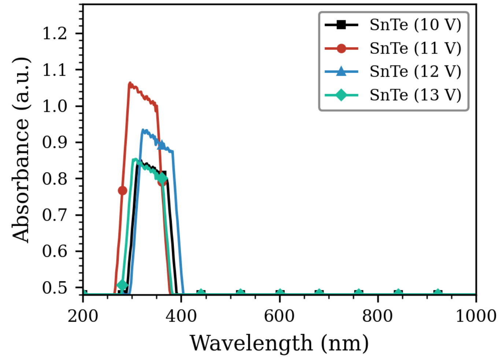 -> [[../figures/optical-spectra|光学光谱]]
  - **图示描述**：横轴为波长 200–1000 nm，纵轴为吸光度 A (a.u.)，四条曲线分别对应 10 V、11 V、12 V、13 V 沉积的 SnTe 薄膜。所有样品均在紫外区出现峰值，随后随波长向可见-近红外延伸而逐渐下降。
  - **关键特征**：11 V 样品在 321 nm 处吸光度最高（A=1.2077 a.u.），12 V 次之（350 nm, A=1.1071 a.u.），10 V（340 nm, A=0.9707 a.u.）与 13 V（330 nm, A=0.9651 a.u.）接近；电压-吸光度呈非单调关系，提示 11 V 附近存在薄膜光密度"甜点"。
  - **结论/意义**：该图是判定 11 V 薄膜最适合做光伏吸收层的第一条证据，紫外强吸收对应带间跃迁主导。

  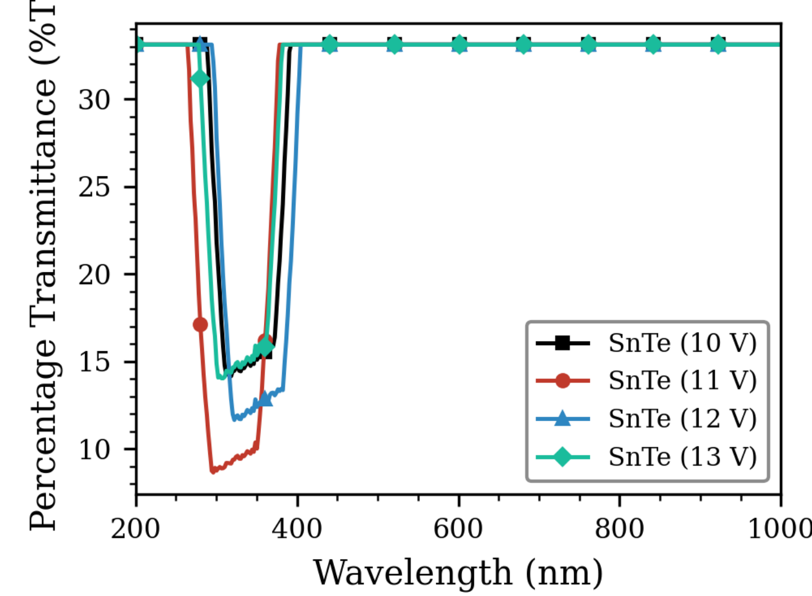 -> [[../figures/vibrational-spectra|振动光谱]]
  - **图示描述**：纵轴为透射率 T (%)，横轴为波长 200–1000 nm，四条曲线同样对应四个沉积电压；整体趋势与吸收光谱相反，紫外区骤降，可见-近红外区回升。
  - **关键特征**：11 V 薄膜在全波段透射率均最低，与图1最高吸光度相互印证；10 V、12 V、13 V 样品在可见-近红外区透射率较高（多数波段 >60%），12 V 样品透射率居前。
  - **结论/意义**：高透射的 10/12/13 V 薄膜被作者划归窗口层或透明光电器件候选，而 11 V 的低透射强化其吸收层定位。

  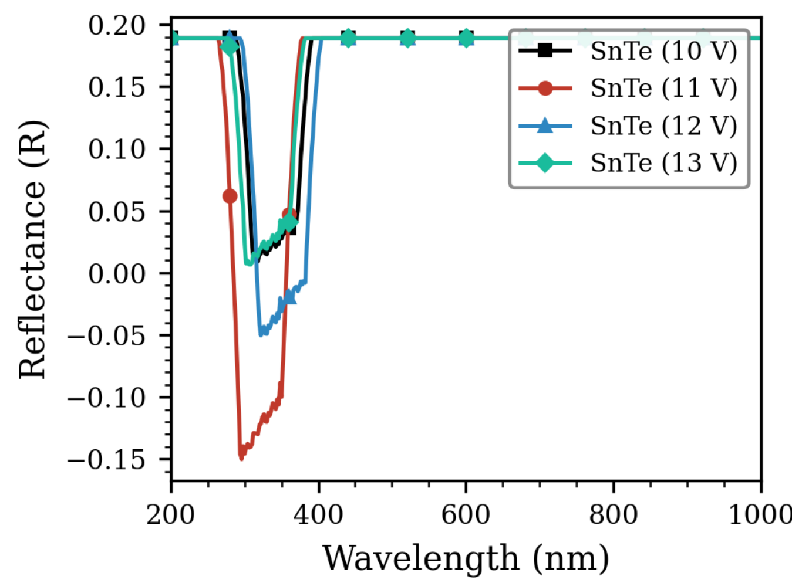 -> [[../figures/vibrational-spectra|振动光谱]]
  - **图示描述**：纵轴为反射率 R (%)，横轴为波长 200–1000 nm，四条曲线在紫外区出现低谷，向可见-近红外逐渐抬升。
  - **关键特征**：全部样品反射率整体偏低（大部分波段 <20%），12 V 薄膜反射率最高，11 V 薄膜反射率最低；与 A+T+R≈1 的能量守恒一致。
  - **结论/意义**：低反射意味着更多入射光进入活性层，对光伏有利；12 V 的"高反射+高透射"组合被建议可作透明导电层或多结电池背反射器。

  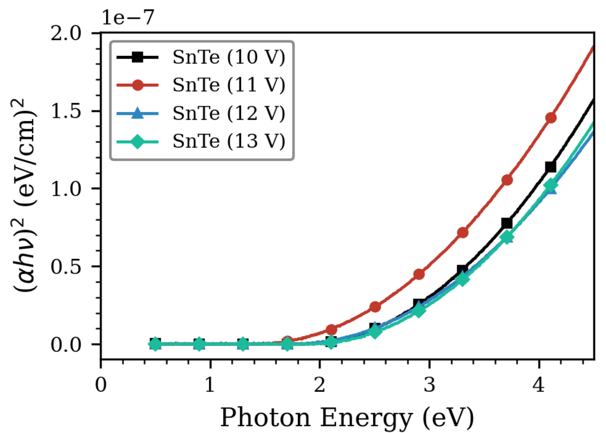 -> [[../figures/vibrational-spectra|振动光谱]]
  - **图示描述**：以 (αhν)² 为纵轴、光子能量 hν (eV) 为横轴的 Tauc 图，四条曲线对应四个电压；将线性段外推至横轴截距即得光学带隙 E_g，假设直接允许跃迁 (n=2)。
  - **关键特征**：外推得到带隙 10 V=1.83 eV、11 V=1.41 eV、12 V=1.75 eV、13 V=1.90 eV；11 V 截距最靠近低能端。
  - **结论/意义**：1.41 eV 接近 Shockley–Queisser 单结电池最优带隙 (~1.4 eV)，是 11 V 薄膜成为吸收层候选的核心定量依据；但作者仅用 n=2 未论证直接带隙归属，为方法学局限。

  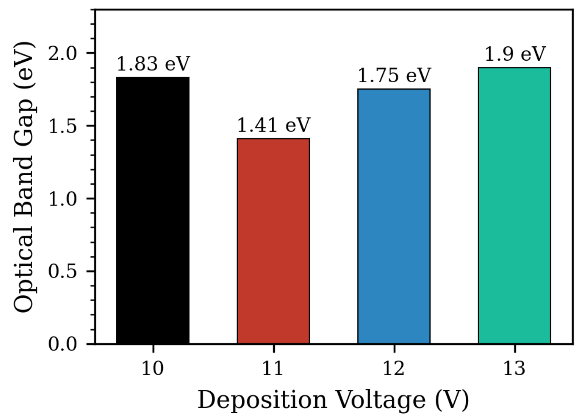 -> [[../figures/electronic-bands-band-structures|能带结构与带隙]]
  - **图示描述**：横轴为沉积电压 (10–13 V)，纵轴为从图4提取的光学带隙 E_g (eV)，四个数据点连成先降后升的 V 形曲线。
  - **关键特征**：带隙从 10 V 的 1.83 eV 急剧下降到 11 V 的 1.41 eV，再回升至 12 V 的 1.75 eV 和 13 V 的 1.90 eV，总可调范围 0.49 eV。
  - **结论/意义**：直观证明沉积电压可显著调控 SnTe 薄膜带隙；作者将 V 形归因于 11 V 处化学计量比与缺陷态最优，高电压侧过电位引入晶格应变与点缺陷使带隙展宽。

  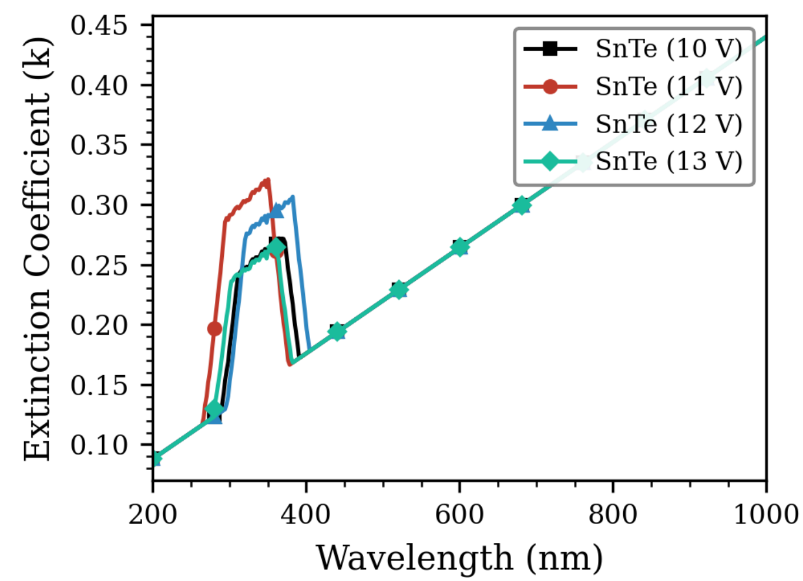 -> [[../figures/optical-spectra|光学光谱]]
  - **图示描述**：纵轴为消光系数 k（无量纲，由 k=αλ/4π 计算），横轴为波长 200–1000 nm，四条曲线对应四个电压；整体紫外高、可见-近红外低。
  - **关键特征**：11 V 样品在最宽波长范围内 k 值最高，与吸光度/吸收系数趋势一致；10/12/13 V 在可见-近红外 k 很小，对应高透明度。
  - **结论/意义**：高 k 意味着光在活性层内被快速衰减，适合吸收层；低 k 则适合光学窗口或透明电极。

  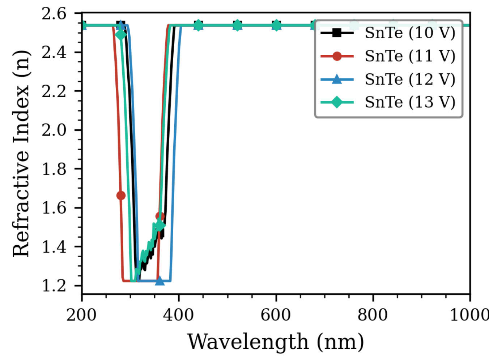 -> [[../figures/optical-spectra|光学光谱]]
  - **图示描述**：纵轴为折射率 n（由反射率经 n=(1+√R)/(1−√R) 推出），横轴为波长 200–1000 nm；四条曲线均呈紫外高、长波低的正常色散。
  - **关键特征**：n 随波长增加而下降，符合 Cauchy/Sellmeier 型介电响应；不同电压下 n 的高低次序被作者解释为薄膜致密度/堆积率差异。
  - **结论/意义**：折射率数据落在已报道 SnTe 薄膜区间内，证明样品物理合理；其电压依赖性为光学涂层/抗反层设计提供参考，但缺少厚度数据使绝对值比较受限。

  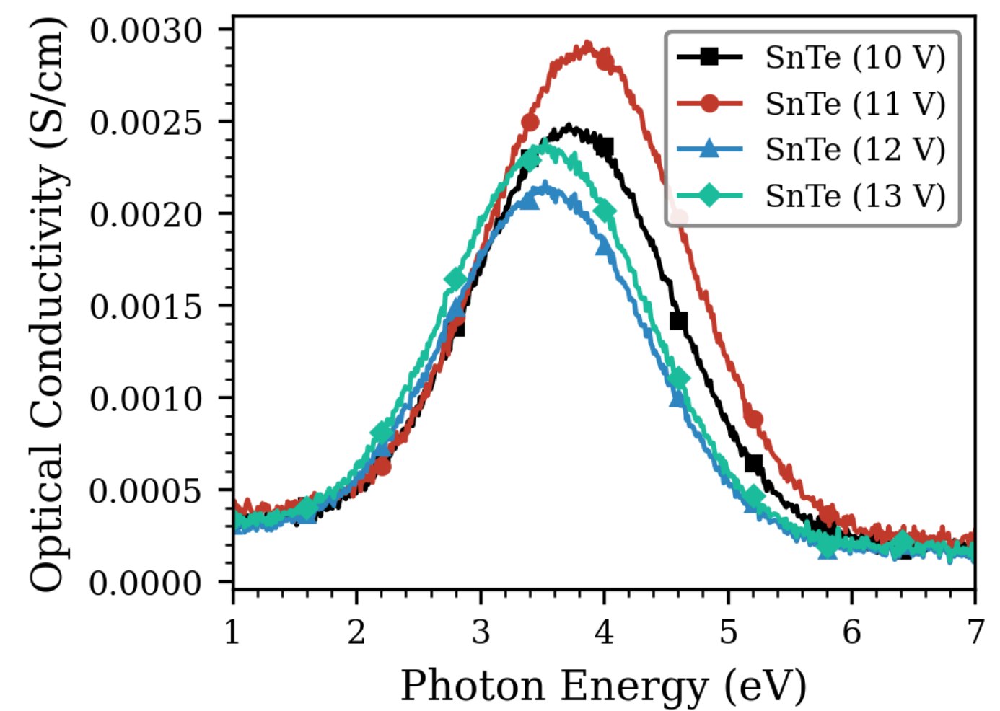 -> [[../figures/vibrational-spectra|振动光谱]]
  - **图示描述**：纵轴为光学电导率 σ (S/cm，由 σ=αhν/4π 计算)，横轴为光子能量 hν (eV)，四条曲线先升后降，出现明显峰值。
  - **关键特征**：四个样品的 σ 峰位分别在 3.74 eV (10 V)、3.86 eV (11 V)、3.54 eV (12 V)、3.54 eV (13 V)；11 V 样品峰值最高，约 2.64×10⁻³ S/cm，12 V 最低。
  - **结论/意义**：σ 直接量化光照下载流子产生与输运能力，11 V 的最高值与最窄带隙、最高吸收共同闭环证明其为最佳吸收层候选。

  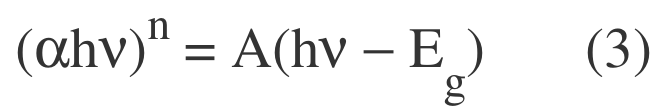 -> [[../figures/mathematical-models-formulas|光学、输运与其他解析公式]]
  - **图示描述**：Tauc 关系式 (αhν)ⁿ = A(hν − E_g)，其中 α 为吸收系数、hν 为光子能量 (eV)、E_g 为光学带隙、A 为常数、n 为跃迁模式指数。
  - **关键特征**：本文取 n=2 对应直接允许跃迁，作图时把 (αhν)² 线性段外推至零得到 E_g；配套关系还有 λ(nm)=1240/E_g(eV)。
  - **结论/意义**：这是从吸收光谱提取图4、图5带隙数据的核心公式；但作者未论证 SnTe 薄膜确为直接带隙，亦未与 n=1/2 的间接跃迁结果对比。

  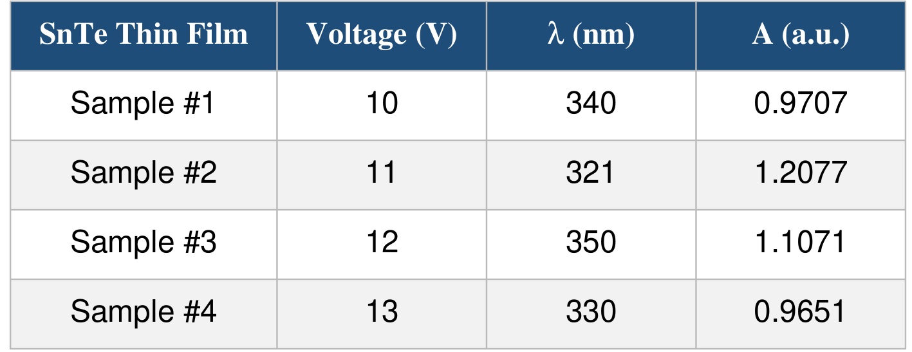 -> [[../figures/vibrational-spectra|振动光谱]]
  - **图示描述**：列出四个电压样品的吸收峰波长 λ (nm) 与峰值吸光度 A (a.u.)，是图1数据的数值化汇总。
  - **关键特征**：10 V→340 nm/0.9707；11 V→321 nm/1.2077（最高）；12 V→350 nm/1.1071；13 V→330 nm/0.9651；峰值波长在 321–350 nm 间小幅漂移。
  - **结论/意义**：以表格形式固定图1关键读数，明确 11 V 吸光度领先，并提示峰位漂移可能来自电压诱导的化学计量比/膜厚变化。

  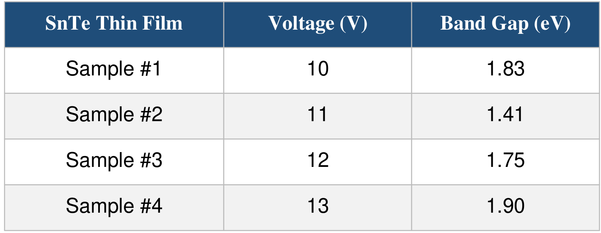 -> [[../figures/electronic-bands-band-structures|能带结构与带隙]]
  - **图示描述**：列出四个电压样品经 Tauc 外推得到的光学带隙 E_g (eV)，是图4、图5数据的数值化汇总。
  - **关键特征**：10 V=1.83 eV、11 V=1.41 eV（最低）、12 V=1.75 eV、13 V=1.90 eV（最高），整体跨度 0.49 eV。
  - **结论/意义**：1.41 eV 贴近 Shockley–Queisser 最优带隙，是判定 11 V 为光伏吸收层候选的关键定量证据；其余三个较宽带隙样品被作者建议用于窗口层或叠层电池。

## 🔬 项目连接
  - **project-5 (SnTe铁电模拟) — strong**：本文核心材料正是 SnTe，提供了可直接参考的实验物性数据。(1) 明确指出 SnTe 为面心立方(岩盐)结构，~100 K 发生立方→菱方铁电相变(引自 Wang et al. 2011)，并提及拓扑晶体绝缘体属性与 Sn 空位导致的本征 p 型导电，这些是铁电模拟的基础结构/电子背景；(2) 给出体相 SnTe 室温带隙文献值 0.18–0.37 eV(Tanwar 2020) 与电化学沉积薄膜光学带隙 1.41–1.90 eV 的显著差异，提示化学计量比、缺陷、厚度对带隙的巨大调制，对模拟中缺陷/应变工程有参考价值；(3) 提供了 SnTe 薄膜吸收系数(~10⁴ cm⁻¹)、折射率、消光系数等光学参数的实验区间，可作为 DFT/计算结果的对照基准。但本文聚焦光伏光学而非铁电机理，故不评 core。
  - 其他项目无直接连接。
## 🔗 项目双链
- 项目 [[../projects/project-5-snte-ferroelectric-sim|项目五：lammps势函数SnTe铁电模拟]]

## 📝 组织与用词
论文按"背景→理论公式→材料方法→结果讨论(八个光学参数逐节)→结论"的标准实验范式组织，单一变量(沉积电压)控制，每个光学参数独立成节并用图表+文字解释，最后将所有参数收敛到"11 V 最优"这一结论。值得复用的术语：
  - 电化学沉积 ([[../concepts/electrochemical-deposition|electrochemical deposition]], ECD)
  - 光学带隙 ([[../concepts/optical-band-gap|optical band gap]])
  - Tauc 图 / Tauc 关系式 ([[../concepts/tauc-plot|Tauc plot]] / Tauc relation)
  - 直接允许跃迁 (direct allowed transition, n=2)
  - 光学电导率 ([[../concepts/optical-conductivity|optical conductivity]])
  - 消光系数 (extinction coefficient)
  - 折射率 ([[../concepts/refractive-index|refractive index]])
  - 窗口层 / 吸收层 ([[../concepts/window-layer|window layer]] / absorber layer)
  - 过电位 ([[../concepts/overpotential|overpotential]])
  - Shockley-Queisser 极限 ([[../concepts/shockley-queisser-limit|Shockley-Queisser limit]])
## ✏️ 可写入 Wiki 的要点
  1. SnTe 为 IV–VI 族化合物，岩盐面心立方结构，[[../concepts/topological-crystalline-insulator|拓扑晶体绝缘体]]，因 Sn 空位而具本征 p 型导电；约 100 K 发生立方→菱方铁电相变。
  2. 体相 SnTe 室温带隙文献值为 0.18–0.37 eV（Tanwar et al. 2020），属窄带隙红外材料；而[[../concepts/electrochemical-deposition|电化学沉积]]薄膜的[[../concepts/optical-band-gap|光学带隙]]可在 1.41–1.90 eV 之间变化，说明薄膜微结构/化学计量比对表观带隙有强烈调制。
  3. 电化学沉积(ECD)工艺：前驱体为 0.366 g 硫酸锡/100 mL 水溶液与 0.150 g 氧化碲/5 mL 浓盐酸再稀释至 100 mL，等体积(20+20 mL)混合为电解液；FTO 为工作电极，碳为对电极，沉积时间固定 10 s，沉积后 150 °C 烘干 30 min。
  4. 四种电压下薄膜峰值吸光度：10 V→0.9707@340 nm，11 V→1.2077@321 nm(最高)，12 V→1.1071@350 nm，13 V→0.9651@330 nm；电压与吸光度呈非单调关系。
  5. 光学带隙：10 V=1.83 eV，11 V=1.41 eV(最低)，12 V=1.75 eV，13 V=1.90 eV，呈 V 形非线性变化；1.41 eV 接近 Shockley-Queisser 单结电池最优带隙(~1.4 eV)。
  6. 11 V 薄膜[[../concepts/optical-conductivity|光学电导率]]峰值约 2.64×10⁻³ S/cm，为四个样品最高；吸收系数在紫外区达 10⁴ cm⁻¹ 量级；这些参数共同指向 11 V 为最优吸收层候选。
  7. 所用理论公式：T=10⁻ᴬ，R=1−(A+T)；(αhν)ⁿ=A(hν−E_g)，n=2 为直接允许跃迁；α=2.303A/d；σ=αhν/(4π)；k=αλ/(4π)；n=(1+√R)/(1−√R)。
  8. 10/12/13 V 薄膜在可见-近红外区高透射、低消光，被作者归类为[[../concepts/window-layer|窗口层]]/透明光电器件候选；12 V 反射率最高，被建议可作透明导电层或多结电池背反射器。
  9. 显著局限：全文未给出任何薄膜厚度数据，而 α、k、σ 均依赖膜厚 d；也无 XRD/SEM/EDS 等结构成分表征，"11 V 更致密、化学计量比更优"仅为推测；四个离散电压点无法排除更优电压存在；无误差棒/重复性统计。
  10. 带隙确定仅用 n=2 直接跃迁 Tauc 外推，未论证 SnTe 薄膜是否确为直接带隙，也未与椭偏仪等方法交叉验证；薄膜 1.41–1.90 eV 与体相 0.18–0.37 eV 的巨大差异未被作者深入讨论。
