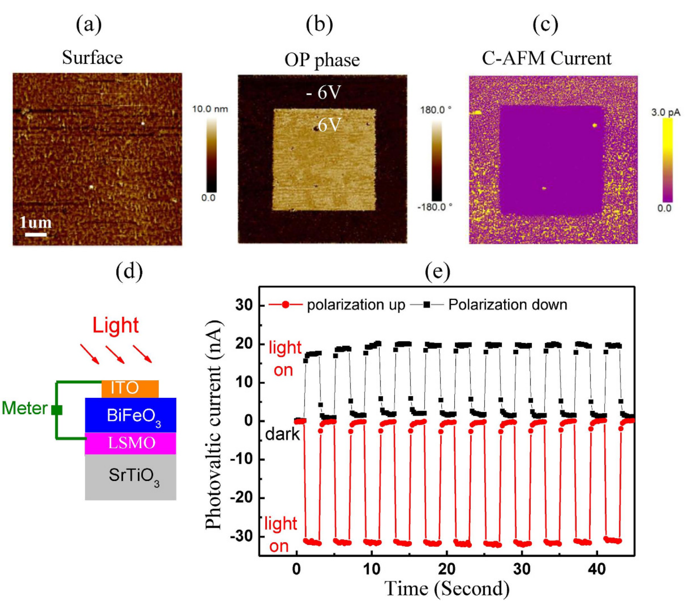

## Chen2016electrical — 70 nm BiFeO3 薄膜铁电极化的电-机械开关

## 📄 元数据
Liufang Chen, Zhihao Cheng, Wenting Xu, Xiangjian Meng, Guoliang Yuan, Junming Liu, Zhiguo Liu，2016，Scientific Reports 6:19092，DOI 10.1038/srep19092
## 💡 一句话
首次在 70 nm 厚 (001) BiFeO3 外延薄膜中用 PFM 针尖机械力（最高 3325 nN，对应 ~1.18 GPa 局域应力）实现 100% 极化翻转，并证明力学翻转与电学翻转共享"成核—分解—重组"的两步（71°+109° 铁弹翻转）畴演化路径，同时展示了低偏压 c-AFM 电流和光伏短路电流两种无损读出方案。

## 🔗 Wiki 双链
  - 概念 [[../concepts/polarization-switching]]
  - 概念 [[../concepts/ferroelasticity]]
  - 概念 [[../concepts/multiferroicity]]
  - 概念 [[../concepts/magnetoelectric-coupling]]
  - 概念 [[../concepts/strain-engineering]]
  - 概念 [[../concepts/flexoelectric-effect|挠曲电效应]]
  - 概念 [[../concepts/ferroelectric-domain|铁电畴]]
  - 概念 [[../concepts/domain-wall-motion|畴壁运动]]
  - 概念 [[../concepts/coercive-field|矫顽场]]
  - 概念 [[../concepts/ferroelectric-photovoltaic-effect|铁电光伏效应]]
  - 概念 [[../concepts/depletion-layer|耗尽层]]
  - 概念 [[../concepts/two-step-switching|两步翻转]]
  - 概念 [[../concepts/domain-wall]]
  - 实体 [[../entities/BiFeO3]]
  - 实体 [[../entities/SrTiO3]]
  - 实体 [[../entities/BaTiO3]]
  - 实体 [[../entities/ITO]]
  - 实体 [[../entities/La0.67Sr0.33MnO3]]
  - 实体 [[../entities/PbZrxTi1-xO3]]
  - 实体 [[../entities/PLD]]
  - 实体 [[../entities/PFM]]
  - 实体 [[../entities/c-AFM]]
  - 图表 [[../figures/domain-walls-structures|畴结构与畴壁]]
  - 图表 [[../figures/electronic-devices]]
  - 图表 [[../figures/experimental-setups|实验测试与测量装置]]
  - 图表 [[../figures/mathematical-models|数学模型与物理公式]]
  - 年度 [[../write/2015-2019]]
  - 项目 [[../projects/project-2-mn-multiferroics]]
  - 项目 [[../projects/project-5-snte-ferroelectric-sim]]
  - 相关论文 [[../../raw/note/Chen2016electrical]]

## 🆕 新概念/实体建议
  - [[../concepts/flexoelectricity|flexoelectricity]]（挠曲电效应）：应变梯度 ∂e/∂z 通过挠曲电张量 f 诱导电场 E_f=(f/ε)(∂e/∂z)，是力学翻转的核心驱动力；建议在 concepts 下新建。
  - [[../concepts/ferroelectric-domain|ferroelectric-domain]]（铁电畴）：BiFeO3 中沿四条体对角线的 8 种极化方向（P1–P4 向上、P−1–P−4 向下），对应 71°/109°/180° 三类畴壁；可作为概念条目。
  - [[../concepts/domain-wall-nucleation|domain-wall-nucleation]]（畴壁成核）：新畴优先在已有畴界处成核，是电学/力学翻转共通的第一步机制。
  - [[../concepts/two-step-switching|two-step-switching]]（两步 180° 翻转）：180° 翻转由 71° 铁弹翻转 + 109° 铁弹翻转分步完成，直接 180° 因势垒过高而动力学不利。
  - [[../concepts/coercive-field|coercive-field]]（矫顽场）：本样品 Ec≈38 kV/mm（Vc≈2.3 V，膜厚 70 nm），是衡量翻转难易的关键参数。
  - [[../concepts/ferroelectric-photovoltaic-effect|ferroelectric-photovoltaic-effect]]（铁电光伏效应）：短路电流方向与极化方向反向绑定（向下极化 Isc≈+20 nA，向上 Isc≈−30 nA），可无损读出。
  - [[../concepts/depletion-layer-readout|depletion-layer-readout]]（耗尽层读出）：p 型 LSMO / n 型 BiFeO3 界面耗尽层宽度随极化方向变化，使 <Vc 的 1 V 漏电流出现倍数差异。
  - 实体 [[../entities/SrTiO3|SrTiO3]]、[[../entities/La0.67Sr0.33MnO3|La0.67Sr0.33MnO3]]（LSMO，p 型氧化物电极/缓冲层）、[[../entities/BaTiO3|BaTiO3]]、[[../entities/PbZrxTi1-xO3|PbZrxTi1-xO3]]（PZT）、[[../entities/ITO|ITO]]：本工作涉及的关键衬底/电极/对比材料。
  - 实体/方法 [[../entities/PLD|PLD]]（脉冲激光沉积；630 °C、16 Pa O2、KrF 248 nm、1 Hz、60 mJ，后退火 630 °C/1000 Pa O2/30 min）、[[../entities/PFM|PFM]]（压电力显微镜，针尖半径 30–35 nm）、[[../entities/c-AFM|c-AFM]]（导电原子力显微镜）。

## 📊 关键图表
  - 图1 BiFeO₃ 薄膜初始畴结构
     -> [[../figures/domain-walls-structures|畴结构与畴壁]]
    - **图示描述**：(a) BiFeO₃ 晶胞沿四条赝立方体对角线的 8 种极化方向示意（P1–P4 向上、P−1–P−4 向下）；(b) 5×5 μm² 范围的 AFM 表面形貌；(c–f) 经 +6 V 极化后，悬臂分别沿 [100] 与 [010] 方向所测的垂直 (OP) 与水平 (IP) PFM 相位图。
    - **关键特征**：表面呈纳米级光滑，是后续针尖施加 1.18 GPa 应力而不产生塑性损伤的前提；6 V 极化后形成以 P2–P3、P3–P4、P4–P1 为主的 μm 级 71° 条纹畴；OP 相位区分向上/向下，两组正交 IP 相位组合可唯一确定 P1–P4 四种面内取向。
    - **结论/意义**：建立了后续电学/力学翻转实验的初始畴基线，并定义了全文使用的 8 态极化记号与 71°/109°/180° 畴壁语言。
  - 图2 电学翻转畴演化
     -> [[../figures/domain-walls-switching-properties|极化翻转与铁电性能]]
    - **图示描述**：对图1蓝色方框内 P1–P2 条纹畴逐级施加 −1.8 V、−2 V、−2.3 V 针尖偏压后，OP/IP PFM 相位图的四列序列；标注 A–F 六个初始单畴区域及其子区域 A2–A4 等。
    - **关键特征**：−1.8 V 时新畴 B2、C2 等优先在原 P1–P2 畴壁处成核，畴界变模糊；−2 V 时 >94% 区域翻转向下，因多路径并发而分解为超出 PFM 分辨率的 nm 畴，在 IP 图中呈棕色（已排除仪器相位偏移）；−2.3 V（>Vc≈2.3 V，对应 Ec≈38 kV/mm）时纳米畴重组为 μm 级 P−3/P−4 畴。
    - **结论/意义**：给出电学翻转"成核—分解—重组"三阶段模板，并以 A2(P1)→A3(P−1)→A4(P−3) 等路径证明 180° 翻转由 71°+109° 两步铁弹翻转完成。
  - 图3 力学翻转的定量演化
     -> [[../figures/domain-walls-switching-properties|极化翻转与铁电性能]]
    - **图示描述**：(a,b) 3325 nN 力扫描前后 1×1 μm² 区域的表面形貌对比；(c–h) 用 30 nm 直径 PFM 针尖依次施加 140、700、1050、1400、1750、3325 nN 力后的 OP 相位图序列。
    - **关键特征**：向下畴面积比随力单调上升 0 → 8.9% → 41.4% → 82.2% → 95.9% → 100%；按接触面积 ~707 nm² 换算，700 nN ≈ 0.25 GPa、3325 nN ≈ 1.18 GPa，最大应力仍低于 BiFeO₃ 塑性损伤阈值；加压前后形貌均光滑，翻转态在大气中保持 2 天不退。
    - **结论/意义**：本文最核心的实证结果，首次把机械力完全翻转铁电极化的厚度从 ~5 nm（BaTiO₃、PZT）推进到 70 nm、矫顽场 ~38 kV/mm 的 BiFeO₃，并以挠曲电场 E_f=(f/ε)(∂e/∂z) 解释驱动力。
  - 图4 力学翻转畴演化细节
     -> [[../figures/domain-walls-switching-properties|极化翻转与铁电性能]]
    - **图示描述**：与图2平行的力学翻转 PFM 序列，对 G、H、I、J、K 五个初始单畴区域依次施加 875 nN、1050 nN、1330 nN 针尖力，给出 OP/IP 相位图。
    - **关键特征**：875 nN 时新畴在 μm 级畴壁处成核；1050 nN 时 μm 畴分解为超出 PFM 分辨率的 nm 畴（IP 棕色区）；1330 nN 时纳米畴重组为 μm 级向下畴，典型路径 G1(P1)→G2(P−2)→G4(P−3) 为 109°+71°，J1(P4)→J2(P−3)→J3(P−2) 同为两步翻转。
    - **结论/意义**：与图2逐阶段并排对照，证明无论驱动力是外电场还是挠曲电内电场，畴演化路径由材料内禀能量景观决定，均为两步铁弹翻转介导的 180° 翻转。
  - 图5 两种无损读出方案
     -> [[../figures/electronic-devices-memory-transistors|存储器与晶体管]]
    - **图示描述**：(a–c) 先用 ±6 V 写入向上/向下极化图案，再以 1 V 偏压（远低于 Vc=2.3 V）做 c-AFM 电流成像；(d) 300 μm 直径 ITO 顶电极、~100 mW/cm² 可见光照射的光伏测量示意；(e) 短路电流 Isc 随光照开关的时间序列。
    - **关键特征**：c-AFM 图中向下极化区电流显著大于向上极化区——p 型 LSMO/n 型 BiFeO₃ 界面耗尽层随极化方向变窄/展宽；光伏 Isc 方向与极化反向绑定，向下极化 Isc≈+20 nA、向上极化 Isc≈−30 nA；11 次光照开关循环无明显衰减。
    - **结论/意义**：验证了"力学写入 + 低偏压电流/光伏短路电流无损读出"的存储范式，读取电场远低于矫顽场，不会扰动所存极化态。

## 🔬 项目连接
  - **project-2（Mn 多铁）**：strong。BiFeO3 是室温单相多铁的原型材料，本文系统展示了其 8 种极化方向、71°/109°/180° 三类畴壁，以及"只有 71°/109° 铁弹翻转（而非 180° 铁电翻转）才能改变易磁化面取向、实现磁电耦合"的物理图像；180° 翻转过程中瞬态磁电耦合的讨论对 Mn 基多铁材料中电写磁读/力写磁读的机理设计有直接参考价值。
  - **project-5（SnTe 铁电模拟）**：medium。本文虽为实验，但提供了铁电极化翻转的普适动力学图像——畴壁优先成核、μm 畴分解为 nm 畴再重组、180° 翻转经两步铁弹中间态完成，以及挠曲电场 E_f=(f/ε)(∂e/∂z) 的应变梯度耦合公式；这些为 SnTe 薄膜/二维铁电的翻转路径、畴壁运动、应变梯度工程模拟提供了可对照的物理图像和临界场/力的量级参考（Ec≈38 kV/mm，等效应力 0.25–1.18 GPa）。
  - project-1（双光子）、project-3（机械发光 NN）、project-4（TTF 分子计算）、project-6（湿度传感器）、project-7（CDW）：无直接项目连接。

## 🔗 项目双链
- 项目 [[../projects/project-2-mn-multiferroics|项目二：Mn极化结构铁电材料]]
- 项目 [[../projects/project-5-snte-ferroelectric-sim|项目五：lammps势函数SnTe铁电模拟]]

## 📝 组织与用词
文章采用"初始畴表征 → 电学翻转对照 → 力学翻转核心实验 → 无损读出方案 → 讨论/方法"的标准实验论文结构，核心论证逻辑是把电学翻转（图2）和力学翻转（图4）逐阶段并排对比，以畴演化形貌的高度相似性证明两者微观机制统一；表1汇总 11 个区域（A–K）的具体翻转路径作为路径级证据。值得在 wiki 叙述中复用的术语：
  - ferroelectric domain / 铁电畴 [[../concepts/ferroelectric-domain|铁电畴]]
  - domain wall / 畴壁 [[../concepts/domain-wall|畴壁]]（71°、109°、180° 三类）
  - ferroelastic switching / 铁弹翻转
  - flexoelectric effect [[../concepts/flexoelectric-effect|flexoelectric effect]] / 挠曲电效应
  - flexoelectric field / 挠曲电场
  - strain gradient / 应变梯度
  - nucleation–decomposition–reorganization / 成核—分解—重组
  - two-step 180° switching / 两步 180° 翻转
  - nondestructive readout / 无损读出
  - morphotropic phase boundary (MPB) / 准同型相界 [[../concepts/morphotropic-phase-boundary|准同型相界]]

## ✏️ 可写入 Wiki 的要点
  1. 70 nm (001) BiFeO3/LSMO//SrTiO3 外延薄膜的极化可被 PFM 针尖机械力完全翻转；完全翻转所需力为 3325 nN（30 nm 直径针尖，接触面积 ~707 nm²，对应 ~1.18 GPa 局域应力），低于 BiFeO3 塑性损伤阈值；起始成核阈值约 700 nN / 0.25 GPa（8.9% 面积翻转）。
  2. 力学翻转的驱动力为[[../concepts/flexoelectric-effect|挠曲电效应]]：针尖下方沿膜厚方向的应变梯度 ∂e/∂z 诱导指向衬底的挠曲电场 E_f=(f/ε)(∂e/∂z)，破坏铁电势对称性，使向上极化失稳而翻转向下；这把机械翻转的厚度纪录从 ~5 nm（BaTiO3、PZT）拓展到 70 nm，且是在[[../concepts/coercive-field|矫顽场]]大得多的 BiFeO3（Ec≈38 kV/mm）中实现。
  3. 电学翻转与力学翻转的畴演化路径高度一致，均遵循三阶段：(i) 新畴在原有畴壁处优先成核；(ii) μm 级畴分解为超出 PFM 分辨率的 nm 级畴（水平 PFM 中呈棕色，而非仪器相位偏移）；(iii) 纳米畴重组为 μm 级反向畴。
  4. 180° [[../concepts/polarization-switching|极化翻转]]几乎不直接发生，而是通过两步铁弹翻转完成：典型路径 P1→P−1（71°）→P−3（109°）或 P1→P−2（109°）→P−3（71°）；71°/109° 翻转同时改变极化方向和晶格畸变方向，是 BiFeO3 中实现[[../concepts/magnetoelectric-coupling|磁电耦合]]的物理基础（180° 纯铁电翻转不改变易磁化面）。
  5. 初始畴为 6 V 极化后的 P2–P3/P3–P4/P4–P1 条纹畴；P1–P2 应变与 P−3–P−4 应变匹配，因此重组后的向下畴倾向占据原 P1/P2 位置。
  6. 无损读出方案一（c-AFM）：1 V 偏压（远低于 Vc=2.3 V）下，向下极化使 p-LSMO/n-BiFeO3 界面[[../concepts/depletion-layer|耗尽层]]变窄、漏电流增大；向上极化耗尽层展宽、电流减小，电流差异可区分两态。
  7. 无损读出方案二（光伏）：300 μm ITO 顶电极、~100 mW/cm² 可见光照射下，短路电流 Isc 方向与极化方向反向绑定——向下极化 Isc≈+20 nA，向上极化 Isc≈−30 nA；11 次光照开关循环无衰减，证明保持性与稳定性。
  8. 样品制备：PLD 在 630 °C、16 Pa O2 下生长 ~70 nm BiFeO3 和 ~70 nm LSMO，KrF 激光 248 nm/1 Hz/60 mJ；630 °C、1000 Pa O2 退火 30 min 以减少[[../concepts/oxygen-vacancy|氧空位]]，再以 5 °C/min 冷却至 300 °C。
  9. 作者指出衬底[[../concepts/epitaxial-strain|外延应变]]和界面内建电场可能对力学翻转阈值/路径有重要贡献；在 LaAlO3 衬底上具有 MPB 的 >50 nm BiFeO3 薄膜中，电场/力还可触发四方—菱方相变，提示力学翻转可与相变耦合产生更大机电响应。
  10. 本研究的局限（批判性）：未通过有限元模拟定量给出针尖下三维应变梯度和 E_f 时空分布，无法精确比较力学等效场与 Ec；缺乏纵向（膜厚方向）分辨证据，表面翻转可能经畴壁向下推进；未测试翻转速度、循环耐久性（仅 2 天保持）和多晶/织构薄膜中的适用性。