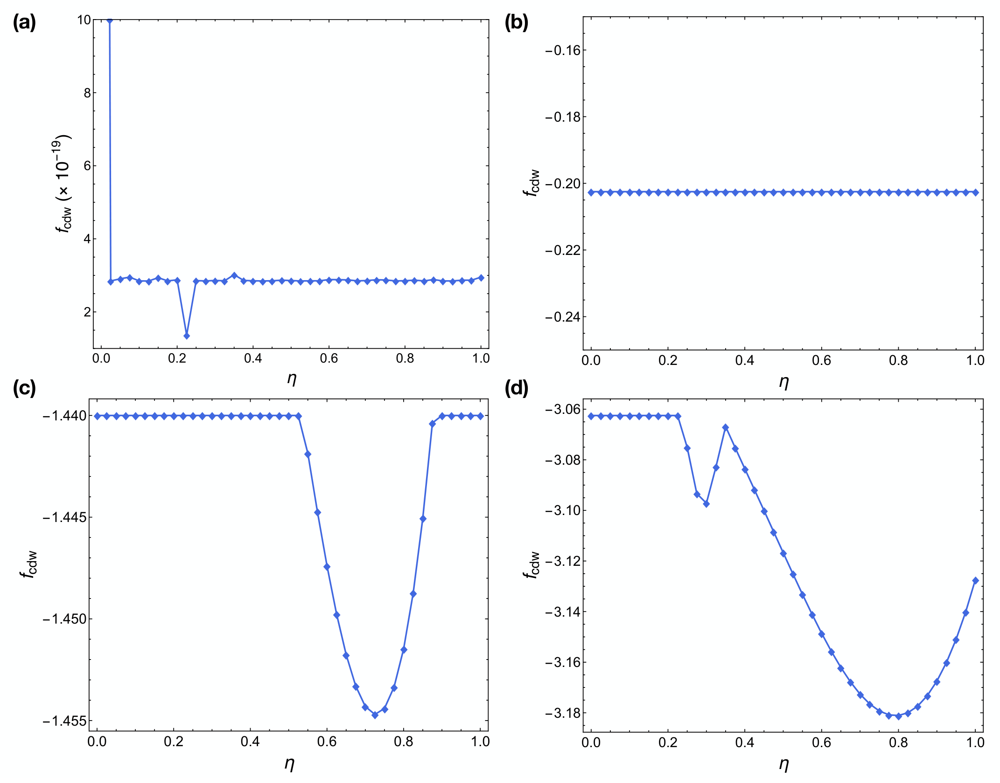
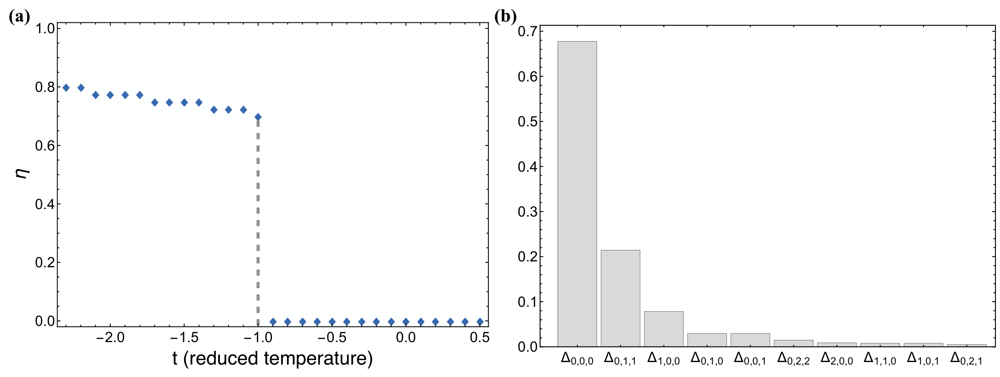
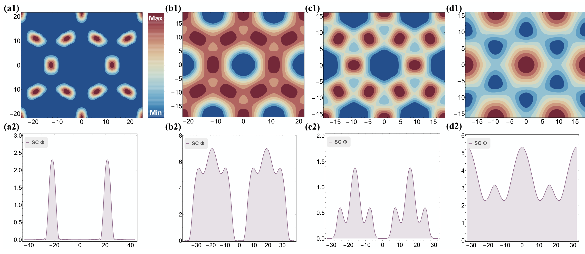

## Chen2019superconductivity — 过渡金属二硫族化物电荷密度波相中由错位相子（discommensuration）驱动的超导电性
## 📄 元数据
Chuan Chen, Lei Su, A. H. Castro Neto, Vitor M. Pereira et al.，2019，Physical Review B 99, 121108，DOI: 10.1103/PhysRevB.99.121108
## 💡 一句话
提出耦合的 McMillan–Ginzburg–Landau 理论，证明在 1T-TiSe₂ 等 TMDs 中，近公度 CDW 相里由错位相子（DC）构成的畴壁网络涨落是超导成核与超导穹顶出现的驱动力，并预言超导沿 DC网络经历 0D→1D→2D 的渗流过程。
## 🔗 Wiki 双链
本文涉及且 wiki 中已存在的条目：
  - 概念 [[../concepts/charge-density-wave]]
  - 概念 [[../concepts/2d-materials]]
  - 概念 [[../concepts/domain-wall]]
  - 实体 [[../entities/TMDs]]
  - 实体 [[../entities/TiSe2]]
  - 实体 [[../entities/2H-TaSe2]]
  - 实体 [[../entities/1T-TaS2]]
  - 实体 [[../entities/2H-NbSe2]]
  - 图表 [[../figures/mathematical-models]]
  - 年度 [[../write/2015-2019]]
  - 项目 [[../projects/project-7-cdw-charge-density-wave]]
  - 相关论文 [[../../raw/note/Chen2019superconductivity]]

## 🆕 新概念/实体建议
  - [[../concepts/discommensuration|discommensuration]]（错位相子/失配畴壁）：C-CDW 中相位跳变 2πν 的局域孤子状畴壁，是本文核心物理对象，值得单独立概念条目。
  - [[../concepts/pair-density-wave|pair-density-wave]]（配对密度波，PDW）：超导序参量空间周期性调制的非均匀超导态，本文预言 DC 网络可外生产生 PDW。
  - [[../concepts/mcmillan-ginzburg-landau-theory|mcmillan-ginzburg-landau-theory]]（McMillan-GL 理论）：处理 C-IC 转变与 CDW-SC 耦合的唯象自由能框架。
  - [[../concepts/superconducting-dome|superconducting-dome]]（超导穹顶）：掺杂-温度相图中超导仅在有限参数窗口出现的穹顶状区域。
  - [[../concepts/little-parks-oscillation|little-parks-oscillation]]：超导网格中临界温度/磁阻随磁通量子周期振荡的现象，本文用以反推 DC 间距。
  - 实体 [[../entities/TiSe2|TiSe2]]（1T-TiSe₂）：本文原型体系，CDW 转变 ~60 K、最优 T_sc ~4 K，目前 wiki/entities 中无此条目。
  - 实体 [[../entities/2H-TaSe2|2H-TaSe2]]、[[../entities/1T-TaS2|1T-TaS2]]、[[../entities/2H-NbSe2|2H-NbSe2]]：补充材料中用于论证普适性的对比 TMD 体系。
## 📊 关键图表
  -  -> [[../figures/crystal-structures-xrd-phases|XRD与相变]]
  - **图示描述**：横轴为锁相能 E（从左到右减小，对应电子掺杂浓度增加），纵轴为约化温度 t ∝ T − T_icdw；相图划分出正常态、公度 C、近公度 NC、非公度 IC 四个区域，叠加在 NC 区之上的是超导穹顶 SC+NC。
  - **关键特征**：绿线 E_c(t) 为 C–IC 边界，斜率陡峭，表明公度相突然消失；红线（a₁=500E，耦合随锁相能线性变化）给出仅在 NC 区出现的超导穹顶，与实验一致；灰线（a₁=500×2.1，与 E 无关）则让 SC 一直延伸到 IC 极限；插图显示 η=|q|/qᴵ 在 t_c 处由 0 跳变到约 1，证实 C–IC 为一级相变。
  - **结论/意义**：在参数全部 ∼1、无精细调节的情况下重现了 TiSe₂ 的 C-NC-IC 转变序列与超导穹顶，并说明 CDW 涨落随掺杂被屏蔽（a₁∝E）是穹顶仅在有限掺杂窗口出现的关键。
  -  -> [[../figures/electronic-bands-cdw-transport|CDW与输运性质]]
  - **图示描述**：在 E=2.2, t=−1.7（图1星号点，靠近 C-CDW 边界）给出 NC 相实空间纹理：(a) 电荷密度调制 δρ(r) 二维彩图，(b,c) 沿白色竖直截线的序参量 ψ_j=φ_j e^{iθ_j} 相位与振幅，(d,e) 同一区域内超导序参量 Φ(r) 的二维分布与线扫。
  - **关键特征**：黄色虚线标出 DC（畴壁）构成叠加于 C-CDW 上的二维 Kagome 超晶格，周期 L=√3a/(ηδ)；相位 θ_j 呈阶梯状周期性滑移 π（对应 ν=1/2 公度条件），振幅 φ_j 在每条 DC 处下降超过 30%；Φ(r) 完全跟随 DC 网络，C 畴内 X1 点 Φ=0，单条 DC 上 X2 点出现峰值，两条 DC 相交的 Kagome 顶点 X3 点 Φ(X3)≈2Φ(X2)。
  - **结论/意义**：直观证明 DC 是超导优先生核的位点，预言了具有配对密度波（PDW）特征的非均匀超导态，其空间周期由 DC 网络而非内禀配对不稳定性决定。
  -  -> [[../figures/mathematical-models-formulas|光学、输运与其他解析公式]]
  - **图示描述**：纯示意图，(a) 以一个 Kagome 单胞展示降温过程中超导序参量的三阶段空间演化；(b) 展示 1D 渗流阶段外加磁场下超流沿 DC 网络循环、涡旋被约束在网格中的图像。
  - **关键特征**：T_s1^cd<T≤T_s0^cd 时 SC 仅在 Kagome 顶点 0D 成核；T_s2^cd<T≤T_s1^cd 时点长大并沿 DC 连成 1D 渗透网络；T<T_s2^cd 时扩展为 2D 全域超导（若 Φ 向 C 区穿透长度小于 L，T_s2^cd 可能为 0）；1D 阶段超流沿连通通道循环、磁通涡旋被 DC 晶格自然钉扎，构成微观超导线网格，从而产生随磁通量子 φ₀=h/2e 周期振荡的 Little–Parks 磁阻效应。
  - **结论/意义**：给出可由温度依赖局域谱学（STM/STS）直接检验的 0D→1D→2D 渗流预言，并把 TiSe₂ 薄膜中的 Little–Parks 振荡归因于 DC 网络定义的超导网格；结合首个磁阻极小 B≈0.13 T 可反推 L≈70 nm、δ≈0.01，与 X 射线和 STM 结果数量级吻合。
  -  -> [[../figures/crystal-structures-xrd-phases|XRD与相变]]
  - **图示描述**：补充材料中的相图或实空间超导序参量纹理图，用于展示耦合强度对 SC 穹顶边界的影响以及不同 (E,t) 点处 Φ(r) 的空间形态（对应补充材料 Fig. S3/S4）。
  - **关键特征**：补充相图显示 SC 自由能中耦合常数 a₁ 控制 T_sc 线在 NC 区的位置（a₁=500 对应正文红线，减小到 a₁=250 时穹顶边界下移，可用于匹配实验 T_cdw/T_sc≈20）；实空间纹理面板分别展示刚低于 T_s0^cd 时在 Kagome 顶点成核的 0D 岛、低于 T_s1^cd 后的 1D 渗透网络、E 减小时因 a₁∝E 被削弱的 SC 振幅，以及 E 无关耦合下在 E=0 均匀 IC 态中扩展到全域的 2D 超导。
  - **结论/意义**：从参数敏感性和实空间形态两方面支撑正文论断——SC 穹顶的位置、形状和维度演化均由 CDW–SC 耦合与 DC 网络几何共同决定，移除 E 依赖则穹顶退化为延伸到 IC 极限的常规超导区。

## 🔬 项目连接
project-7 CDW（电荷密度波）——本文是 CDW 与超导竞争/共存、C-IC 转变、DC 畴壁网络的核心理论文献，直接支撑项目-7；无其他直接项目连接。
## 🔗 项目双链
- 项目 [[../projects/project-7-cdw-charge-density-wave|项目七：CDW电荷密度波]]

## 📝 组织与用词
文章按"实验动机（TiSe₂ 超导穹顶 + STM 看到 DC + Little-Parks 振荡）→ 构建 CDW 的 McMillan GL 自由能（含锁相能 E、梯度项 B、三波耦合 D/M/K）→ 谐波展开数值极小化 → 得到 E-t 相图及 NC 相 Kagome DC 网络 → 引入 SC 自由能并通过 a_s=a₀−a₁Σ|∇ψ_j|²将超导耦合到 CDW 梯度 → 预言非均匀 PDW 态与 0D→1D→2D 渗流 → 用 Little-Parks 周期定量估算 L~70 nm、δ~0.01 与实验吻合"展开。补充材料 S1–S13 系统论证对称性、参数选择、谐波展开收敛性与普适性。值得复用的术语：
  - 错位相子 / 失配畴壁（[[../concepts/discommensuration|discommensuration]], DC）
  - 公度/近公度/非公度（commensurate / near-commensurate / incommensurate, C/NC/IC）
  - 锁相能（lock-in energy, E）
  - 配对密度波（[[../concepts/pair-density-wave|pair-density wave]], PDW）
  - 超导渗流（[[../concepts/superconducting-percolation|superconducting percolation]], 0D→1D→2D）
  - 相位子/振幅子（phason / amplitudon）
  - 谐波展开（harmonic expansion，Nakanishi–Shiba 方法）
  - [[../concepts/little-parks-oscillation|Little–Parks 振荡]]（Little-Parks oscillations）
## ✏️ 可写入 Wiki 的要点
  1. 原型体系 1T-TiSe₂ 在 ~60 K 进入 2×2 公度 CDW（C-CDW），电子掺杂（栅压/Cu 插层）或加压抑制 C-CDW 后，在 C→IC 转变附近出现 T_sc^max≈4 K 的超导穹顶；CDW 关联在超导相中仍持续存在。
  2. CDW 自由能由三非共线复[[../concepts/order-parameter|序参量]] ψ_j=φ_j e^{iθ_j}（j=1,2,3，对应 Q_j^C=G_j/2 三个 C3 对称波矢）描述：f₀ 含 A|ψ_j|²+B|(i∇+q_j^I)ψ_j|²+G|ψ_j|⁴（B 项偏好 IC），f₁ 含 −(E/2)Σ(ψ_j²+c.c.) 锁相项（偏好 C）以及 −3D/2(ψ₁ψ₂ψ₃+c.c.)、−M/2Σ(ψ_j ψ*_{j+1}ψ*_{j+2}+c.c.)、K/2Σ_{i≠j}|ψ_iψ_j|² 三波耦合项。参数取 A=t, K=G=2M=−2D=2, B(q^I)²=1，全部 ~1 无精细调节。
  3. 引入变分参数 η=|q_j|/q^I（η=0 为 C，η=1 为均匀 IC，之间为 NC），通过 Nakanishi–Shiba 谐波展开 ψ_j=Δ_{j;0}+ΣΔ_{j;lmn}e^{iq_{j;lmn}·r}（截断 N=3，共 39 个实变分参数，200 次随机初值极小化）数值求解，得到 E-t 相图：大 E（低掺杂）为 C，小 E（高掺杂）为 IC，中间狭窄 NC 区由 DC 网络构成；C-IC 转变为[[../concepts/first-order-phase-transition|一级相变]]（η 在 t_c 处跳变）。
  4. 近公度相中 DC 形成叠加于 C-CDW 上的二维 Kagome [[../concepts/superlattice|超晶格]]；DC 处相位阶梯跳变 π（TiSe₂ 的公度分数 ν=1/2，一般情形跳变 2πν），振幅下降超过 30%；一维纯相位极限下鞍点方程退化为 sine-Gordon 方程，DC 即其孤子解。DC 网络周期 L=2πν/(ηq^I)=√3 a/(ηδ)，a 为晶格常数。
  5. SC 自由能 F_sc=∫[a_s|Φ|²+b_s|∇Φ|²+c_s|Φ|⁴]dr，关键耦合为 a_s=a₀−a₁Σ_j|∇ψ_j|²：在 C 畴内部 ∇ψ=0，a_s 正（正常）；在 DC 处梯度大，a_s 变负，超导优先成核。a₀∝T−T₀ 捕获涨落增强配对，a₁>0。计算中取 a₀=10t+60、b_s=c_s=1。
  6. 为重现有限掺杂窗口的超导穹顶，令 a₁→a₁E（a₁=500）：掺杂增大→E 减小→CDW 涨落被屏蔽→SC 在 IC 极限被抑制，红线形成穹顶；若 a₁ 与 E 无关（灰线，a₁=500×2.1），SC 将一直延伸到 IC 极限。
  7. 预测的非均匀超导态：Φ(r) 完全跟随 DC 网络，C 畴内 Φ(X₁)=0，单条 DC 上有峰值，两条 DC 相交的 Kagome 顶点处 Φ(X₃)≈2Φ(X₂)。降温分三阶段——T_s1^cd<T≤T_s0^cd 时在顶点 0D 成核；T_s2^cd<T≤T_s1^cd 时沿 DC 连成 1D 渗透网络；T<T_s2^cd 时扩展为 2D 全域超导；若 Φ 向 C 区穿透长度小于 L，则 T_s2^cd 可能为 0，超导最多只通过 1D 网络贯穿。
  8. 该非均匀超导具有配对密度波（PDW）特征，空间周期由 DC 网络而非内禀配对不稳定性决定；在 1D 渗流阶段，磁场下涡旋被 DC 晶格自然钉扎，超流沿 1D 通道循环，构成微观超导线网格，可解释 TiSe₂ 薄膜中的 Little–Parks 磁阻振荡。
  9. 定量估算：取六角网格 f=φ/φ₀=1/4、首个磁阻极小值 B≈0.13 T、TiSe₂ a=0.35 nm、η~1，得 L=√3 a/(ηδ)=[φ₀/(2√3 B)]^{1/2}≈70 nm、δ≈0.01，与 X 射线衍射（穹顶内 δ~5–15%）和 STM（T_sc 以上最优掺杂处 DC 间距数十 nm、DC 内[[../concepts/density-of-states|态密度]]增强）数量级吻合。
  10. 普适性：框架不依赖 TiSe₂  specifics——2H-NbSe₂（小 E、IC-CDW 后超导，T_icdw=33 K, T_sc=7.2 K）、2H-TaSe₂（进入 C-CDW 后不超导）、1T-TaS₂（常压 C-CDW 不超导、加压进入 NC 后出现超导）均符合作者提出的"CDW 公度性与超导反相关"规律；推广到 ν=1/3 等其他公度条件只需改写 f₁ 中的非线性项。模型局限：唯象、未自洽考虑 SC 对 CDW 的反馈、忽略层间耦合与无序（T_cdw~60 K ≫ T_sc~4 K 支持被动背景近似）。
