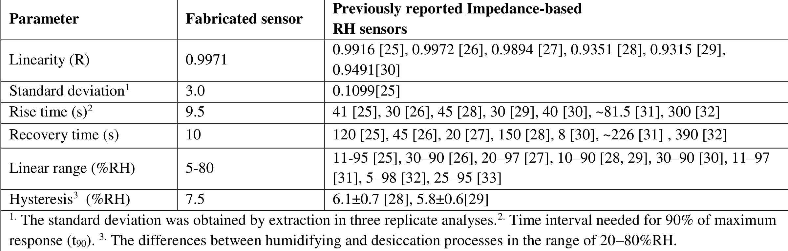

## Doroodmand2017conjugated — 电合成共轭 Salen 聚合物玻碳作为水致变色反射滤光片用于湿度检测

## 📄 元数据
Mohammad Mahdi Doroodmand, Sina Owji，2017，*International Journal of Advanced Engineering Research and Science* (IJAERS) 4(4): 259-272，DOI: 10.22161/ijaers.4.4.41。伊朗设拉子大学理学院化学系。
## 💡 一句话
首次用循环伏安法在玻碳电极上电合成"无金属"共轭 Salen 聚合物薄膜，将其同时作为亲水感湿层和白光反射滤光片，通过相机读取反射光蓝色分量强度，实现 5–80% RH 范围内线性、快速（~9.5 s）、高选择性的光学湿度检测。

## 🔗 Wiki 双链
  - 概念 [[../concepts/conjugated-polymer|共轭聚合物]]
  - 概念 [[../concepts/electropolymerization|电聚合]]
  - 概念 [[../concepts/hydrochromism|水致变色]]
  - 概念 [[../concepts/reflective-filter|反射滤光片]]
  - 概念 [[../concepts/salen-ligand|Salen配体]]
  - 概念 [[../concepts/optical-sensing]]
  - 概念 [[../concepts/refractive-index]]
  - 实体 [[../entities/cyclic-voltammetry]]
  - 实体 [[../entities/Salen|Salen]]
  - 实体 [[../entities/glassy-carbon|玻碳电极]]
  - 实体 [[../entities/KCl]]
  - 图表 [[../figures/experimental-setups]]（图 1 传感腔体光路示意图）
  - 图表 [[../figures/vibrational-spectra]]（图 8B FT-IR 表征共轭结构）
  - 图表 [[../figures/optical-spectra]]（图 9–10 RGB/蓝色分量随 RH 的光学响应）
  - 年度 [[../write/2015-2019|2017]]
  - 项目 [[../projects/project-6-humidity-sensor]]
  - 相关论文 [[../../raw/note/Doroodmand2017conjugated]]

## 📊 关键图表
  - **图1：湿度光学传感器装置示意图**
  -  -> [[../figures/experimental-setups|实验装置与测量系统]]
  - **图示描述**：一个 10×10×15 cm、容积约 1500 mL 的黑色玻璃密闭腔，将镀有共轭 Salen 聚合物薄膜的玻碳电极从一侧插入；另一侧以 10–20° 非镜面夹角布置白光 LED 与数码相机（AGPtek，X800），IR 光源（HG-IR1XYJ-F-1W）紧贴电极用于加热除湿，腔内还集成参考湿度计（Lutron GCH-2018）、温度计、小风扇、N₂ 进气口与超声加湿器。
  - **关键特征**：①玻碳电极同时承担 CV 电合成的工作电极与光学检测的反射镜，是整套设计的核心整合点；②相机/光源相对镜面取 10–20° 偏角，避开镜面反射、采集经聚合物滤光后的漫反射颜色信号；③腔体外壁涂黑并置于暗室，消除杂散光；④每次测试前用 IR 照射约 0.5 min、再以 2 L/min 的 N₂ 吹扫约 1 min，消除水分子残留造成的记忆效应与迟滞。
  - **结论/意义**：该装置以最低廉的白光 LED + 数码相机读出方案实现了"水致变色反射滤光片"机理，是论文区别于传统阻抗/电容式湿度传感器的硬件基础。
  - **表1：本传感器与先前报道的阻抗型湿度传感器性能对比**
  -  -> [[../figures/electronic-devices-sensors|传感器与探测器]]
  - **图示描述**：三列对比表——参数（线性度 R、标准偏差、t₉₀ 上升时间、恢复时间、线性范围、迟滞）、本工作数值、八篇阻抗型 RH 传感器文献（引文 [25]–[33]）的对应数值。
  - **关键特征**：①线性度 R = 0.9971，与最佳对比文献 0.9972 相当；②t₉₀ 上升时间 9.5 s，远快于阻抗型器件的 30–300 s；③恢复时间 10 s，对比文献多在 20–390 s（仅一篇为 8 s）；④线性范围 5–80% RH，与阻抗型常见区间相当，覆盖中低湿主流应用；⑤最大迟滞 7.5% RH，略劣于阻抗型最佳值 5.8–6.1% RH；⑥标准偏差 3.0%。
  - **结论/意义**：定量证明该光学传感器在响应/恢复速度上对阻抗型器件有数量级优势，但迟滞指标提示聚合物吸水-脱附仍有优化空间。
  - **其余图表（raw/figures 中未附图片文件，以下为基于 raw note 的文字描述）**
  - **图2：Salen 电合成的连续循环伏安图（A：0.04 M Salen/丙酮；B：溶剂对比）**
  - **图示描述**：A 为电位窗口 −1.0 至 +2.25 V（vs Ag/AgCl）、扫速 100 mV/s 下连续多圈 CV；B 对比甲醇、乙醇、丙酮、丙醇、DMF、DMSO、环丁砜、乙醚、丁醇、异丁醇等溶剂中的阳极峰。
  - **关键特征**：①首圈在约 +0.70 V 出现强阳极峰，对应初始不导电 Salen 聚合物形成、随即钝化电极；②继续扫描后在 +0.5、+1.25、+1.75 V 出现三个新阳极峰，标志共轭导电聚合物生成；③丙酮中阳极峰电流最高，乙醚/丁醇/异丁醇不分相，故选丙酮。
  - **图3：丙酮/水比例对电合成的影响（CV）**
  - **图示描述**：不同丙酮:水体积比电解液中的连续 CV 曲线。
  - **关键特征**：水的加入降低欧姆电位并提高带电中间体溶解度，使峰电流随水比例先升后降，存在最佳混合比例。
  - **图4：pH 值对电合成的影响（CV）**
  - **图示描述**：用 KOH/HCl 调节 pH 在约 7 至 >13 之间的 CV 系列。
  - **关键特征**：①酸性条件下 Salen 单体分解，无聚合物生成；②pH 越高阳极峰电流越大，最优为强碱性（pH > 13），与 Salen 去质子化及 K⁺ 配位状态有关。
  - **图5：阳离子种类对电合成的影响（CV）**
  - **图示描述**：相同强碱性、相同浓度下 LiOH、NaOH、KOH 作为支持电解质的 CV 对比。
  - **关键特征**：阳极峰电流顺序 K⁺ > Na⁺ > Li⁺，阳离子半径越大越有利于形成高导电性聚合物；二/三价阳离子（Ca²⁺、Ba²⁺、Mg²⁺、Al³⁺）与 Salen 生成不溶沉淀而被排除。
  - **图6：不同阳离子聚合物在 ~40% RH 下的光学照片（A：K⁺，B：Na⁺）**
  - **图示描述**：GC 电极表面 K⁺ 系与 Na⁺ 系 Salen 聚合物薄膜在固定湿度下的彩色照片。
  - **关键特征**：K⁺ 系颜色更鲜艳、信号更强，与图5电化学结果一致，为阳离子半径效应提供直观定性证据。
  - **图7：K⁺ 浓度对电合成的影响（CV）**
  - **图示描述**：KCl 浓度在 0.00–0.05 M 范围内变化时的 CV。
  - **关键特征**：即使 pH 已 >13，额外 K⁺ 仍能增强阳极峰电流，说明 K⁺ 不只调节 pH 还直接参与配位/掺杂；0.05 M 为最优，更高则出现两相盐析。
  - **图8：共轭 Salen 聚合物的三联表征（A：SEM；B：FT-IR；C：XPS）**
  - **图示描述**：A 为薄膜截面/表面 SEM 形貌；B 为单体与聚合物 FT-IR 谱叠加；C 为 C 1s XPS 谱对比。
  - **关键特征**：①SEM 测得膜厚 91±1 nm，纳米级厚度是 ~9.5 s 快速响应的物理基础；②FT-IR 在约 1385 cm⁻¹（苯环 C=C）和 1442 cm⁻¹（脂肪族 C=C）出现新吸收峰；③XPS 中单体 284.8 eV 的 C–C 峰在聚合物中完全消失、281.2 eV 的 C=C 峰显著增强、约 288.3 eV 的 C–N 峰大幅减弱，直接证明 C–C 单键转化为 C=C 双键、形成"分子导线"式共轭骨架。
  - **图9：RGB 三通道强度随 %RH 的动态轨迹**
  - **图示描述**：从 0% RH 升至 93% RH 再回到 0% RH 过程中，相机读出的红、绿、蓝三分量强度随时间的变化曲线。
  - **关键特征**：蓝色分量随湿度单调显著增强，红、绿分量变化不规律或不显著，故选择蓝色通道作为定量信号；反向湿度扫描曲线近似可逆，存在可见迟滞。
  - **图10：蓝色分量强度与 %RH 的校准曲线**
  - **图示描述**：以 %RH 为横轴、蓝色分量强度为纵轴的散点-线性拟合图。
  - **关键特征**：5–80% RH 区间线性关系 R² = 0.9943（R = 0.9971），检测限按 3σ/斜率计为 0.17% RH；>80% RH 进入饱和。
  - **图11：传感器迟滞回线**
  - **图示描述**：在 25% 与 60% RH 之间至少 4 次快速切换循环中，蓝色分量对湿度的吸湿-脱湿曲线。
  - **关键特征**：加湿/除湿两曲线不重合，最大偏差约 7.5% RH；每循环间用 IR 加热（电极表面约 50°C、最长 60 s）清除记忆效应。
  - **图12：重现性与与参考湿度计的对比**
  - **图示描述**：在 20% 与 30% RH 两点多次重复测量的蓝色分量读数（带误差棒），并与商业参考 RH 传感器读数并列。
  - **关键特征**：重复性 RSD = 3.6%（n=3），约 25% RH 下 4 次重复的重现性 RSD ≈ 4.0%；与参考传感器偏差 < 约 2%；15–50°C 温度范围内固定 25% RH 读数无明显温度漂移。
  - **图13：共存气体干扰测试（选择性）**
  - **图示描述**：在 30.0±0.5% RH 背景中分别加入 1000 ppm 的 CO、CO₂、NOₓ、CH₄、Ar、He、VOCs 及 HCl 酸蒸气后，蓝色分量相对纯湿度背景的变化柱状图。
  - **关键特征**：所有干扰气体对应的蓝色分量变化均接近零，证明传感器对水蒸气高度特异，不受常见大气组分与酸蒸气干扰。

## 🔬 项目连接
  - **project-6（小花闻的电压湿度传感器）— strong**：本文是项目文献池中"07_Humidity Specific Mechanisms"分类下的核心机理论文，直接提供：(1) 一种与电学阻抗/电容式完全不同的**光学读数机制**（水致变色反射滤光 + RGB 蓝色分量定量），可作为项目中 Tauc 带隙/介电常数随湿度变化分析的对照物理图像；(2) 具体的感湿性能基准（5–80% RH 线性、LOD 0.17% RH、t₉₀ ~9.5 s、迟滞 7.5% RH、RSD 3.6%）以及表 1 中与阻抗型传感器的系统对比，可直接用于论证本项目器件的性能定位；(3) 聚合物薄膜厚度 91±1 nm 是快速响应的关键，提示项目在二维材料涂层厚度优化上关注扩散时间尺度；(4) K⁺/Na⁺/Li⁺ 阳离子半径效应（K⁺>Na⁺>Li⁺）为项目中掺杂/离子调控感湿灵敏度提供类比；(5) 干扰气体（CO、CO₂、NOₓ、CH₄、VOCs）1000 ppm 无响应的选择性测试方案可复用。注意本文作者 Doroodmand 与项目池中 Owji20212d（Owji 是 Doroodmand 的学生）属同一课题组，思想一脉相承，建议在 wiki 中互相串链。
  - 其他项目（project-1 双光子、project-2 Mn多铁、project-3 机械发光NN、project-4 TTF分子计算、project-5 SnTe铁电、project-7 CDW）：无直接项目连接。

## 🔗 项目双链
- 项目 [[../projects/project-6-humidity-sensor|项目六：小花闻的电压湿度传感器]]

## 📝 组织与用词
文章按"引言（湿度度量单位与现有技术综述）→ 实验（试剂/仪器/Salen 单体合成/电合成/装置/步骤/实际样品）→ 结果与讨论（连续 CV→溶剂→pH/离子强度→阳离子种类浓度→SEM/FT-IR/XPS 表征→亲水性→性能指标→干扰→机理推测）→ 结论"的标准实验论文链条展开。论证策略是先用大量 CV 图系统优化电合成条件（溶剂、pH、阳离子、浓度、层数），再用三种谱学证据闭合"共轭结构形成"的证据链，最后用一组 Figure of Merit 数据与阻抗型传感器的对比表证明性能优势，并用"粗糙石墨基底失效"反证光滑反射镜机制。值得在 wiki 叙述中复用的关键词/术语：
  - Hydrochromic reflective filter / 水致变色反射滤光片
  - Conjugated Salen polymer / 共轭 Salen 聚合物
  - Molecular wire / 分子导线
  - Electropolymerization / 电聚合 [[../concepts/electropolymerization|电聚合]]
  - Cyclic voltammetry (CV) / 循环伏安法
  - Glassy carbon (GC) electrode / 玻碳电极 [[../entities/glassy-carbon|玻碳电极]]
  - Relative humidity (RH) / 相对湿度 [[../concepts/relative-humidity|相对湿度]]
  - Blue component (RGB) / 蓝色分量
  - Hysteresis / 迟滞 [[../concepts/hysteresis|迟滞]]（记忆效应）
  - Figure of merit (FOM) / 性能指标
  - t₉₀ rise/recovery time / 90% 响应/恢复时间

## ✏️ 可写入 Wiki 的要点
  1. **器件原理**：[[../entities/glassy-carbon|玻碳电极]]同时充当 CV 电合成的工作电极与光学检测的反射镜；其上 ~91 nm 厚的共轭 Salen [[../concepts/polymer-phase-separation|聚合物]]薄膜遇水膨胀、[[../concepts/refractive-index|折射率]]改变，对白光 LED 起选择性滤光作用，相机以 10–20° 非镜面角捕捉反射光，Photoshop 提取蓝色分量强度定量 %RH。
  2. **电合成突破**：传统 Salen 聚合物不导电，第一圈 CV 在 +0.70 V（vs Ag/AgCl）出现强阳极峰后电流骤降、电极钝化；本文通过强碱（pH>13，KOH）+ K⁺配位，使连续 CV 在 +0.5、+1.25、+1.75 V 出现三个新阳极峰，首次在无过渡金属条件下得到导电共轭 Salen 聚合物。
  3. **最优合成条件**：丙酮为溶剂（阳极峰电流高于甲醇/乙醇，乙醚/丁醇不分相）、丙酮/水混合、pH>13、0.05 M KCl（>0.05 M 盐析两相）、电位窗口 −1.0 至 +2.25 V、扫速 100 mV/s、连续 10 圈 CV（第 10 层最光滑、颜色变化最大）。
  4. **阳离子半径效应**：阳极峰电流顺序 K⁺ > Na⁺ > Li⁺，二/三价阳离子（Ca²⁺、Ba²⁺、Mg²⁺、Al³⁺）与 Salen 形成不溶沉淀；UV-Vis 测得 K⁺:Salen 配位比约 5.3:1，说明 Salen 对碱金属有大结合容量，是其亲水性来源。
  5. **共轭结构谱学证据**：SEM 膜厚 91±1 nm；FT-IR 在 ~1385 cm⁻¹（苯环 C=C）和 ~1442 cm⁻¹（脂肪族 C=C）出现吸收；XPS C 1s 中单体 284.8 eV 的 C–C 峰在聚合物中完全消失，281.2 eV 的 C=C 峰显著增强，~288.3 eV 的 C–N 峰大幅减弱，证明 C–C 单键转化为 C=C 双键、形成分子导线。
  6. **感湿性能（FOM）**：5–80% RH 范围内蓝色分量与 RH 线性相关（R² = 0.9943，R = 0.9971）；检测限 0.17% RH；响应时间 t₉₀ ≈ 9.5 s、恢复 <10 s；RSD（重复性）3.6%（n=3），重现性 ~4.0%（n=4，25% RH）；最大迟滞 ~7.5% RH；温度 15–50°C 对读数无显著干扰；>80% RH 饱和。
  7. **选择性**：在 30.0±0.5% RH 背景中分别通入 1000 ppm 的 CO、CO₂、NOₓ、CH₄、Ar、He、VOCs 及 HCl 酸蒸气，蓝色分量均无明显变化，证明对水蒸气高度特异。
  8. **迟滞消除与记忆效应**：每次测量前用 IR 光源（HG-IR1XYJ-F-1W）照射电极 ~0.5 min、N₂（99.995%，2 L/min）吹扫 ~1 min 除湿；迟滞测试中 IR 加热使电极表面升至约 50°C，恢复间隔最长 60 s。
  9. **机理判据**：颜色梯度实验（~5% RH/s）中聚合物从橙色连续变到紫色；光滑玻碳 vs 粗糙石墨对照实验中只有光滑基底产生灵敏且均匀的颜色信号，支持"[[../concepts/reflective-filter|反射滤光片]]"而非漫反射/吸收机制；作者将颜色变化归因于吸水导致聚合物体积变化引起的折射率偏移。
  10. **实际样品与对比**：在城市隧道空气、实验室空气、汽车尾气等真实样品中测试可靠；表 1 与当时阻抗型传感器相比，响应时间（9.5 s vs 30–300 s）和恢复时间（10 s vs 20–390 s）数量级领先，但迟滞（7.5% RH）略劣于部分阻抗器件（5.8–6.1% RH）。论文自身局限：未做长期稳定性/抗污染测试、"无金属"说法因残留 K⁺ 存疑、共轭长度缺乏 UV-Vis-NIR 长波吸收证据、仅与阻抗型而非其他光学传感器对比、相机 RGB 读数受白平衡/环境光影响。