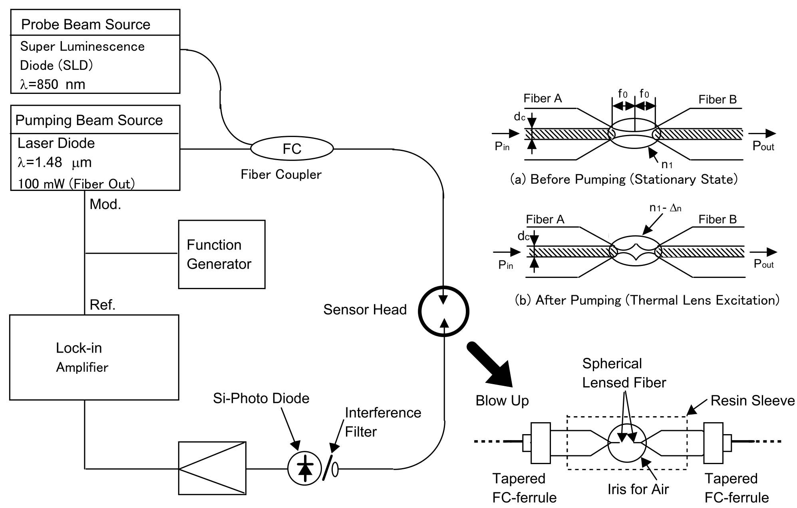
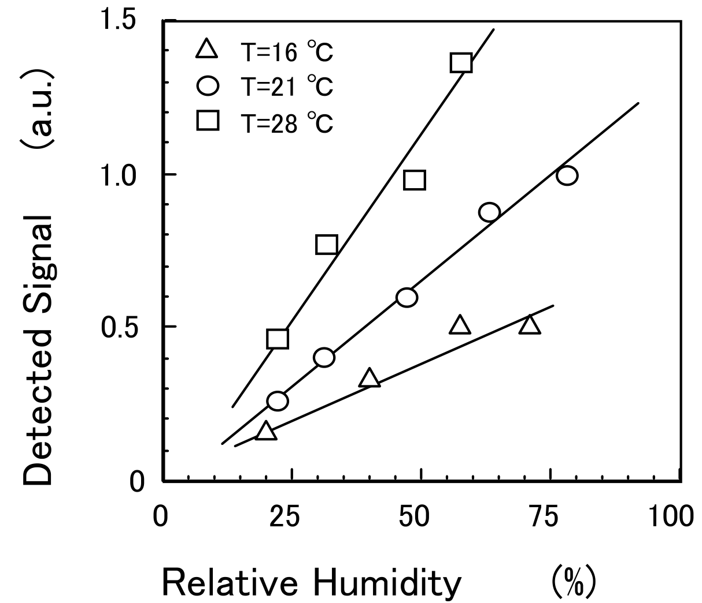
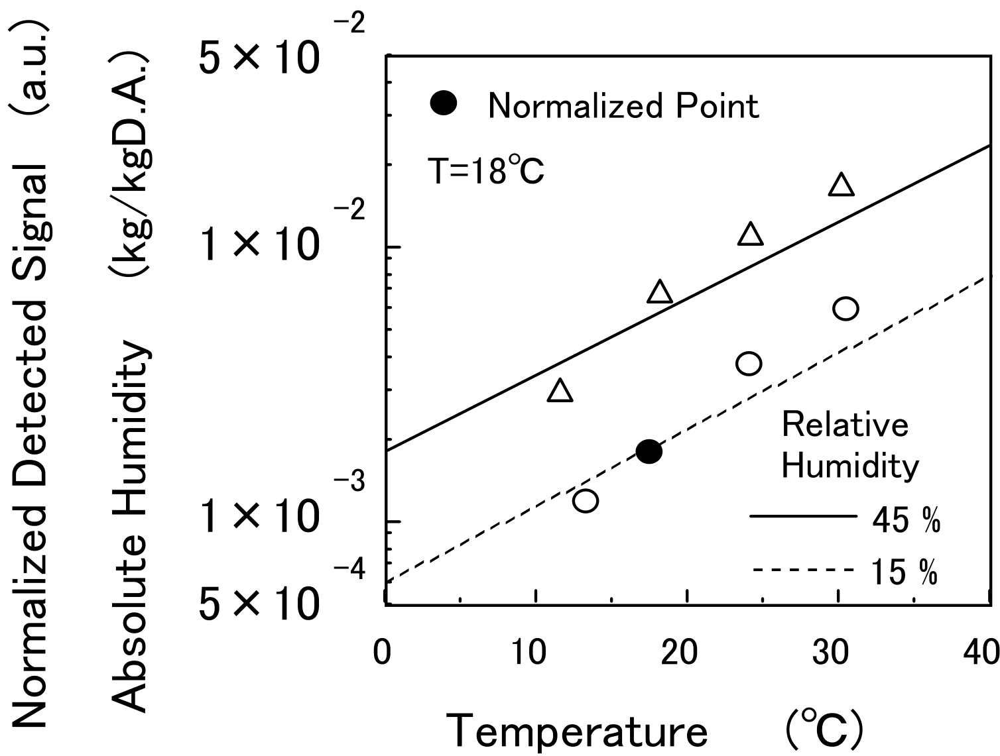

## Yarai2005optical — 基于热透镜检测技术的光纤湿度传感器

## 📄 元数据
Atsushi Yarai, Takuji Nakanishi，2005，IEICE Electronics Express，Vol.2 No.14 pp.417-422，DOI 10.1587/elex.2.417
## 💡 一句话
首次将热透镜（TL）泵浦-探测光谱技术引入光纤湿度传感，用两根端面间距 <50 μm 的球透镜光纤构成微腔传感头，在泵浦功率 <100 mW 下实现了无需对光纤包层做任何化学处理的湿度测量，并证明传感器本质上测量的是绝对湿度。
## 🔗 Wiki 双链
  - 概念 [[../concepts/thermal-lens-effect|热透镜效应]]
  - 概念 [[../concepts/photothermal-effect|光热效应]]
  - 概念 [[../concepts/optical-coupling-efficiency|光耦合效率]]
  - 概念 [[../concepts/relative-humidity|相对湿度]]
  - 概念 [[../concepts/temperature-compensation|温度补偿]]
  - 概念 [[../concepts/lock-in-detection]]
  - 概念 [[../concepts/refractive-index]]
  - 概念 [[../concepts/optical-fiber-sensing]]
  - 概念 [[../concepts/absolute-humidity]]
  - 实体 [[../entities/pump-probe]]
  - 实体 [[../entities/fiber-coupler]]
  - 实体 [[../entities/si-photodiode]]
  - 实体 [[../entities/super-luminescence-diode]]
  - 实体 [[../entities/optical-interference-filter]]
  - 实体 [[../entities/lock-in-amplifier]]
  - 实体 [[../entities/thermo-electric-cooler]]
  - 实体 [[../entities/laser-diode]]
  - 实体 [[../entities/spherical-lensed-fiber]]
  - 图表 [[../figures/experimental-setups]]（图1为传感头与测量系统示意图）
  - 年度 [[../write/2005-2009|2005]]
  - 项目 [[../projects/project-6-humidity-sensor]]
  - 相关论文 [[../../raw/note/Yarai2005optical]]

## 🆕 新概念/实体建议
  - [[../concepts/thermal-lens-effect|thermal-lens-effect]]（概念）：介质吸收高斯泵浦光能量后形成温度/折射率梯度、等效为透镜的光热效应，是本传感器信号来源。
  - [[../concepts/photothermal-effect|photothermal-effect]]（概念）：光吸收转化为热并改变介质光学性质的物理效应，是热透镜、光热偏转等技术的共同基础。
  - [[../entities/pump-probe]]（概念）：泵浦光激发、探测光读取的双光束测量范式。
  - [[../concepts/optical-coupling-efficiency|optical-coupling-efficiency]]（概念）：两光纤端面间光功率传输比例，是本传感方案的直接读出量。
  - [[../concepts/absolute-humidity|absolute-humidity]] / [[../concepts/relative-humidity|relative-humidity]]（概念）：湿度的两种度量，本文关键结论即传感器直接响应绝对水汽密度、相对湿度需温度补偿。
  - [[../concepts/temperature-compensation|temperature-compensation]]（概念）：将绝对湿度读数结合温度换算为相对湿度的必要步骤。
  - [[../entities/spherical-lensed-fiber|spherical-lensed-fiber]]（实体，SLF）：端面加工成半球透镜的光纤，用于在 <50 μm 间隙内聚焦光束、提高耦合灵敏度。
  - [[../entities/lock-in-amplifier|lock-in-amplifier]]（实体/方法）：以固定调制频率（本文 10 Hz）从噪声中提取微弱 TL 信号的相敏检测仪器。
  - [[../entities/super-luminescence-diode|super-luminescence-diode]]（实体，SLD）：850 nm 宽谱低相干探测光源。
  - [[../entities/thermo-electric-cooler|thermo-electric-cooler]]（实体，TEC/帕尔帖元件）：用于局部改变传感头温度以独立调控绝对湿度。
## 📊 关键图表
  -  -> [[../figures/experimental-setups|实验装置与测量系统]]
  - **图示描述**：图1包含(a)(b)两个子图与右侧系统框图，展示由两根端面相对的球透镜光纤（SLF，球面半径 R=10 μm）构成的传感头，以及泵浦激光、探测光、光纤耦合器、干涉滤光片、Si 光电二极管和锁相放大器组成的完整测量链路；(a)为泵浦关断时探测光在两光纤间正常耦合的光路，(b)为泵浦开启后水汽吸收形成热透镜、探测光发散偏离光纤 B 的光路。
  - **关键特征**：两根 SLF 端面间距 <50 μm（实测约 30 μm），预先调整到约 2 倍焦距 f₀ 后固定，中间填充待测空气；标注了干空气折射率 n₁、热透镜引起的折射率变化 Δn（Δn<0，等效凹透镜）、焦距 f₀ 和纤芯直径 d_c；泵浦源为 1.48 μm 多模激光二极管（光纤输出 100 mW，位于水近红外吸收第二峰），探测源为 850 nm SLD（FWHM 40 nm、0.1 mW），PD 前用 852 nm/FWHM 30 nm 干涉滤光片阻挡泵浦光；泵浦光以 f_m=10 Hz 调制，局域温升不超过 10⁻² K，对空气实际无加热。
  - **结论/意义**：该图是全文的机理基石，直观给出"水分子吸收泵浦光 → 局域温升 → 折射率梯度（热透镜）→ SLF 间光耦合效率下降 → 探测光功率被锁相放大器检出"的信号链，并解释了为何无需对光纤包层做化学处理即可获得湿度信号。
  -  -> [[../figures/electronic-devices-sensors|传感器与探测器]]
  - **图示描述**：图2横轴为大气相对湿度 RH（%），纵轴为锁相放大器输出的检测信号幅度（μV/a.u.），在 14、18、22 °C 三个温度下各给出一组数据点及线性拟合线，实验条件为泵浦调制频率 f_m=10 Hz、泵浦功率 100 mW、SLF 球面半径 R=10 μm、端面间距约 30 μm。
  - **关键特征**：三条拟合线均显示信号幅度随 RH 线性增加，证明该 TL 传感器可作为湿度计（hygrometer）使用；温度越高拟合线斜率越大、截距也相应抬升，即在相同 RH 下高温对应更强信号；该斜率差异被归因于温度升高使饱和水汽量增大、相同 RH 对应的绝对水汽密度升高，从而热透镜效应增强。
  - **结论/意义**：图2验证了器件的基本湿度计功能，并通过斜率的温度依赖性提示传感器实际响应的是绝对湿度而非相对湿度，直接引出图3的验证实验与"必须温度补偿"的结论。
  -  -> [[../figures/electronic-devices-sensors|传感器与探测器]]
  - **图示描述**：图3横轴为传感器周围空气温度（°C），纵轴同时表示 1013 hPa、18 °C 基准下估算的绝对湿度（g/m³，以两条实线表示）和归一化检测信号（无量纲，以散点表示）；实验在两个腔室中分别将 18 °C 时的 RH 锁定为 15% 和 45%，用带帕尔帖元件的 TEC 局部改变传感头温度，D.A.（Dry Air）为干空气基线。
  - **关键特征**：在 RH=15% 与 RH=45% 两组条件下，归一化信号散点随温度的变化趋势均与对应绝对湿度理论曲线高度吻合，证明传感器直接测量的是水汽数密度即绝对湿度；散点相对理论线存在一定偏差，作者归因于气流扰动造成传感器周围水汽分布不均，尽管传感头通过小耦合孔与大容积腔室连通以抑制边界湿度扰动；f_m 仍为 10 Hz。
  - **结论/意义**：图3以"固定 RH、改变温度"的实验设计将绝对湿度变量独立出来，为图2中斜率随温度升高的现象给出物理判定——传感器本质上是绝对湿度传感器，因此要获得精确相对湿度必须结合温度测量进行温度补偿。
## 🔬 项目连接
  - **project-6 湿度传感器（core）**：本文正是光纤湿度传感器的机理性实验论文，对 project-6 有直接参考价值：(1) 给出了一种不依赖湿敏涂层、靠水分子本征近红外吸收（1.48 μm 第二吸收峰）工作的全光学湿度检测路线，避免涂层老化；(2) 明确区分了绝对湿度与相对湿度响应，指出必须做温度补偿——这是任何光学湿度计做实际读出时都要处理的核心问题；(3) 提供了 SLF 微腔 + 泵浦-探测 + 锁相放大的具体参数（间隙 ~30 μm、R=10 μm、fm=10 Hz、泵浦100 mW、探测850 nm/0.1 mW、852 nm/30 nm 干涉滤光片），可作为同类光纤传感头设计与信噪比预算的参照；(4) 用 TEC 控温、双湿度腔（15%/45% RH）+ 理论绝对湿度曲线对照的实验方案，可直接借鉴用于评估其他湿度传感器的温度交叉敏感性；(5) 指出气流扰动造成水汽分布不均是主要误差源，对传感器封装与气路设计有提示意义。
  - 其他项目（project-1 双光子、project-2 Mn多铁、project-3 机械发光NN、project-4 TTF分子计算、project-5 SnTe铁电模拟、project-7 CDW）均无直接内容连接。
## 🔗 项目双链
- 项目 [[../projects/project-6-humidity-sensor|项目六：小花闻的电压湿度传感器]]

## 📝 组织与用词
论文遵循“引言指出现有两类方案矛盾 → 传感系统（原理+器件+波长选择）→ 实验结果（RH 线性响应、温度依赖、绝对湿度验证）→ 结论”的标准工程论证结构。核心论证链为：水分子吸收 1.48 μm 泵浦光 → 局域温升 <10⁻² K → 空气折射率形成凹透镜样梯度 Δn → SLF 间耦合效率下降 → 探测光（850 nm）功率被锁相放大器检出 → 信号正比于水汽数密度即绝对湿度。值得在 wiki 叙述中复用的术语：热透镜效应（thermal lens effect）、球透镜光纤（spherical lensed fiber, SLF）、泵浦-探测（pump-probe）、光热效应（photothermal effect）、光耦合效率（optical coupling efficiency）、绝对湿度/相对湿度（absolute/relative humidity）、温度补偿（temperature compensation）、锁相检测（lock-in detection）、调制频率（modulation frequency）、近红外水吸收峰（near-infrared water absorption peak）。
## ✏️ 可写入 Wiki 的要点
  1. 传感头由两根对向装配的球透镜光纤（SLF，球面半径 R=10 μm）构成，端面间距小于 50 μm（实测约 30 μm），预先调整到约 2 倍焦距 f₀ 后固定，中间填充待测空气；传感头整体直径数毫米、长约 20 mm，坚固紧凑。
  2. 泵浦光为 1.48 μm 多模激光二极管（光纤输出 100 mW），位于水的近红外“第二吸收峰”附近（第一峰在 1.92 μm），水吸收谱宽与多模光谱匹配，且该波段大气中其他气体无显著吸收，保证选择性。
  3. 探测光为 850 nm 超辐射发光二极管（SLD，FWHM 40 nm，输出 0.1 mW），经光纤耦合器与泵浦光合束后进入光纤 A；PD 前用 852 nm、FWHM 30 nm 干涉滤光片阻挡泵浦光，仅探测光进入 Si 光电二极管。
  4. 泵浦光以 fm=10 Hz 调制，TL 引起的耦合效率变化成为同频交流信号，经放大后由锁相放大器提取；温升不超过 10⁻² K，对空气实际无加热。
  5. 图2：在 14、18、22°C 三个温度下，检测信号幅度均与[[../concepts/relative-humidity|相对湿度]] RH 成线性关系，证明器件可作湿度计；温度越高斜率越大。
  6. 图3：在 18°C 下分别保持腔室 RH=15% 和 45%，用带帕尔帖元件的 TEC 局部改变传感器周围温度，实测归一化信号随温度变化趋势与 1013 hPa 下估算的绝对湿度理论曲线高度一致，证明传感器本质上测量绝对湿度（水汽密度）。
  7. 关键实践结论：要由该传感器获得精确相对湿度，必须结合温度测量对检测信号做[[../concepts/temperature-compensation|温度补偿]]。
  8. 与已有方案对比：Tm³⁺:YAG 荧光吸收型需 1-3 W 高功率泵浦激光器；塑料[[../concepts/polymer-phase-separation|聚合物]]涂覆光纤/塑料光纤型虽低成本、响应快但传输损耗大、不适合数百米以上远程监测；本方案泵浦 <100 mW、用石英光纤、无需包层处理，兼顾低功耗、长距离与长寿命。
  9. 已观察到的测量误差（图3散点偏离理论线）归因于气流扰动导致传感器周围水汽分布不均匀；传感头通过小耦合孔与大容积腔室连通以抑制边界湿度扰动，但封装/气流仍有优化空间。
  10. 传感原理继承自作者前期的全光纤热透镜仪器与基于 SLF 的热透镜光谱气体传感器工作（参考文献 [6][7][8]），本文是将该技术平台具体应用于湿度测量。
