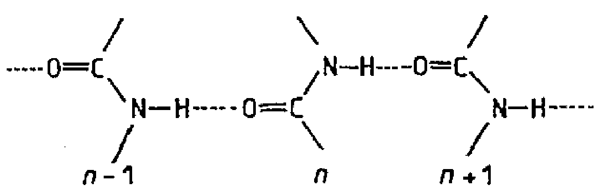
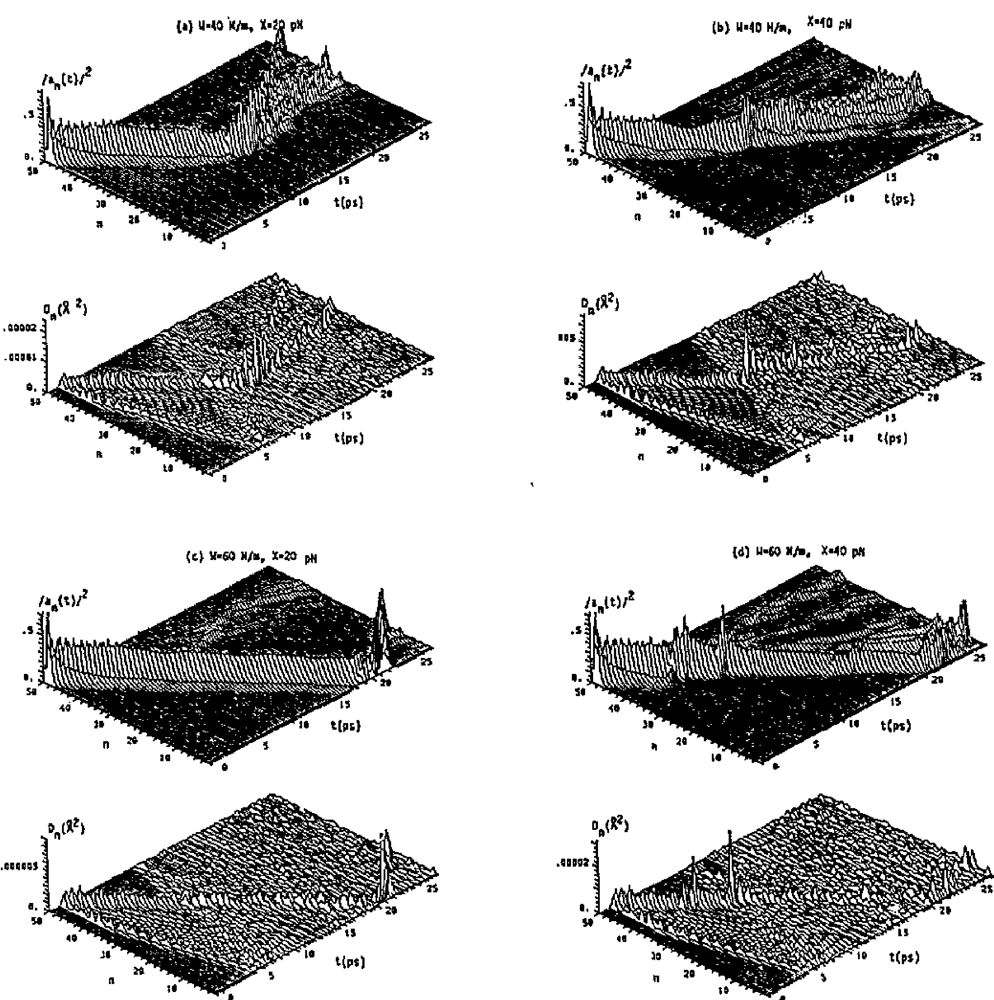
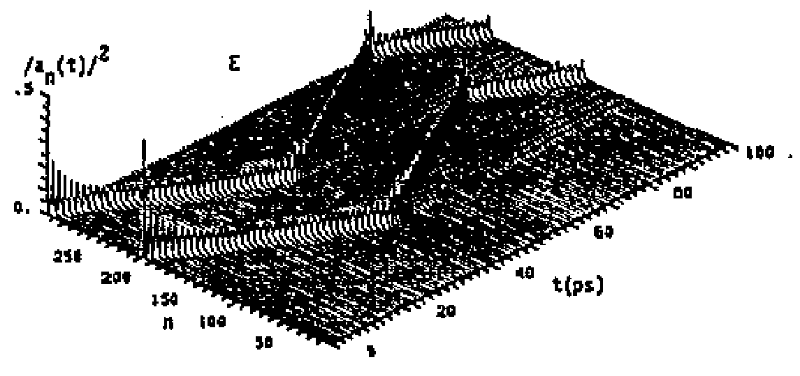
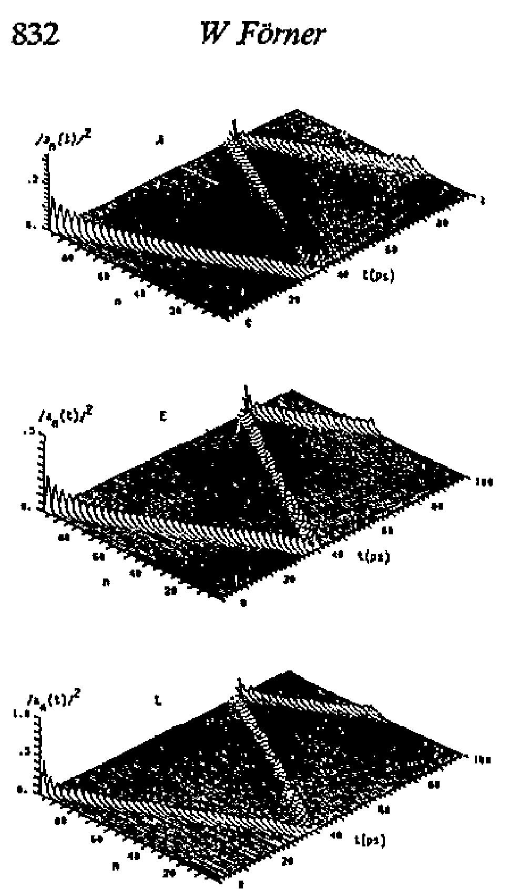
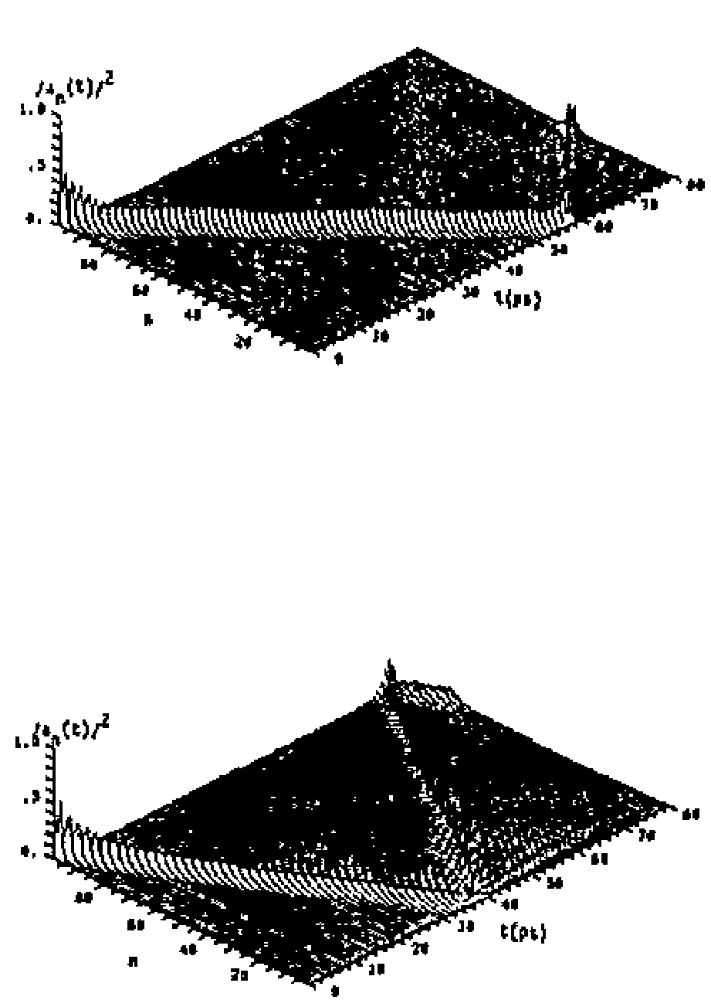
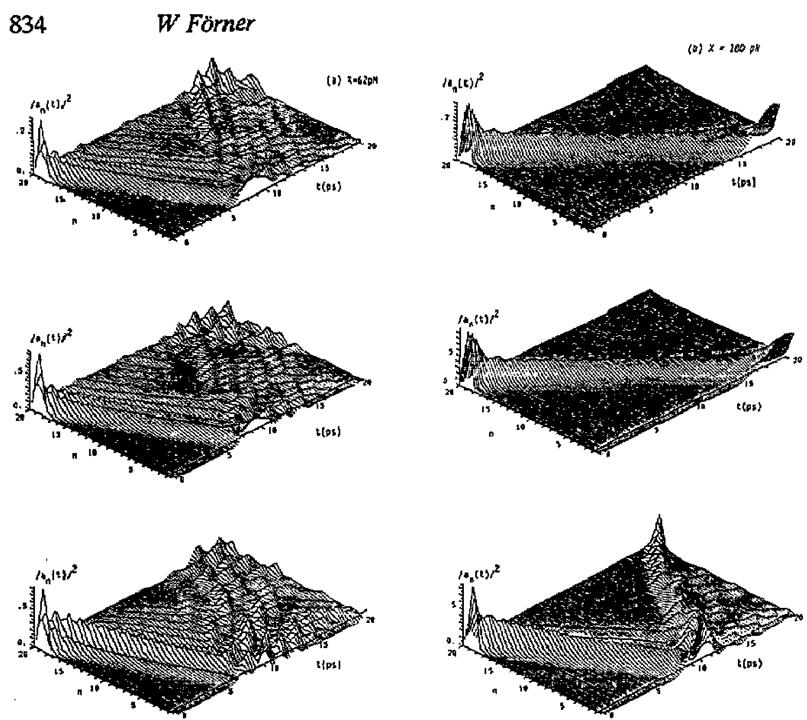
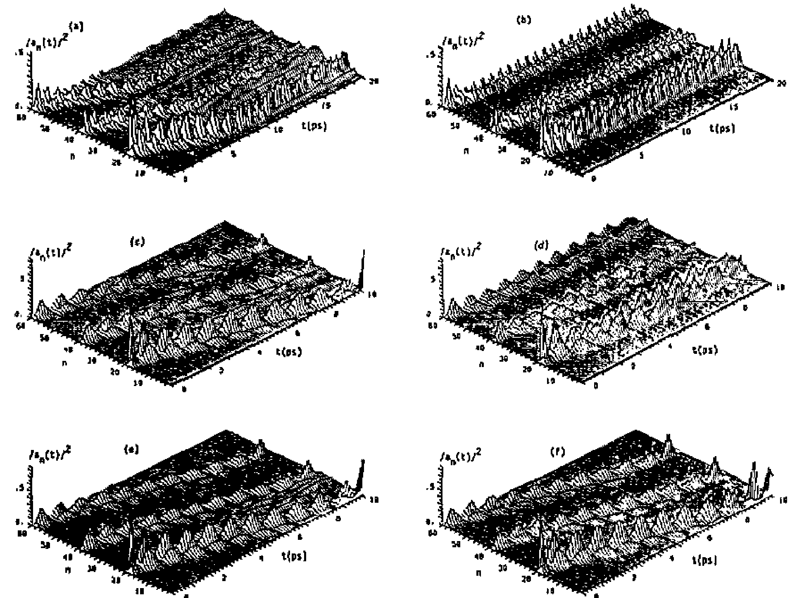
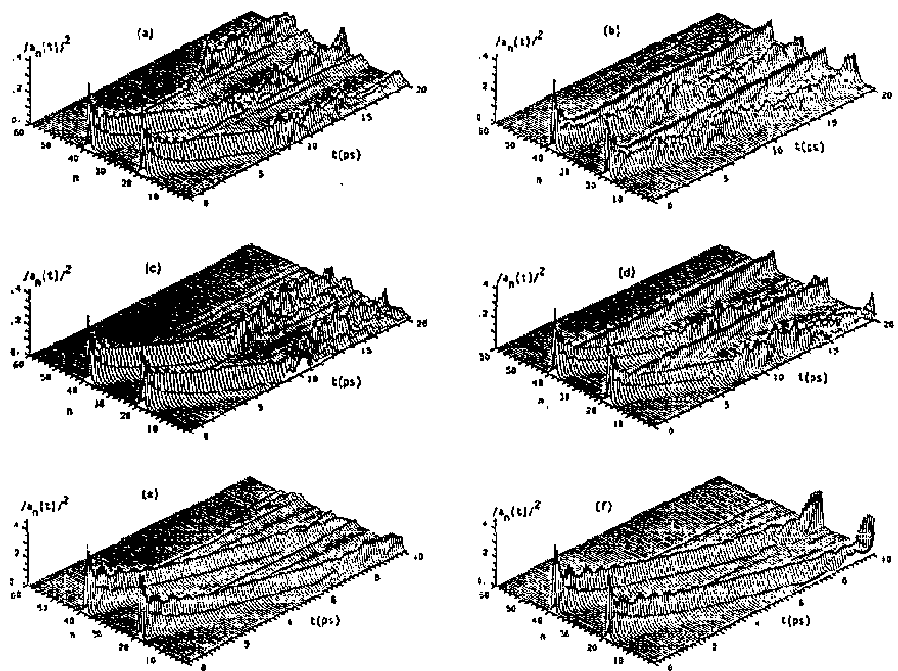
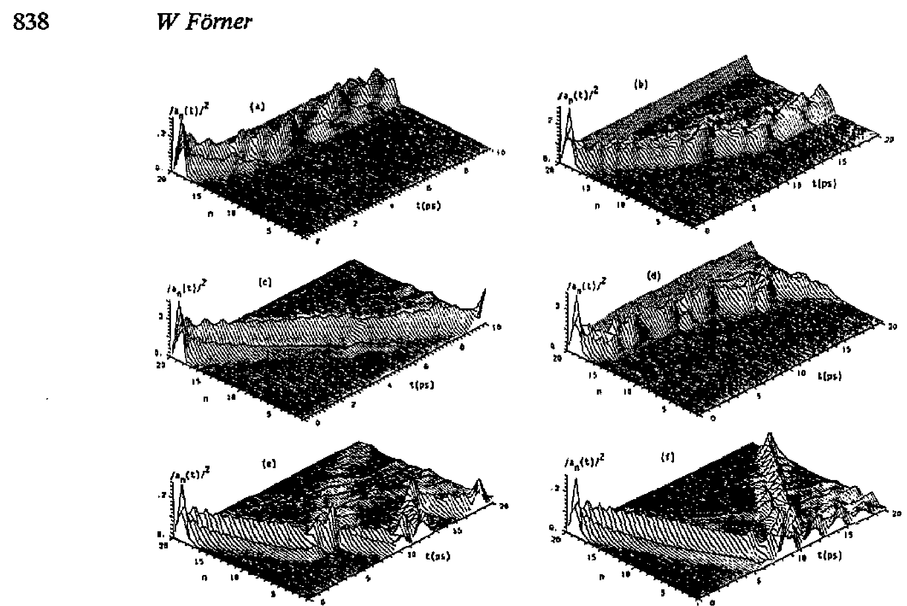

## fornerQuantumTemperatureEffects1993 — 量子与温度对达维多夫孤子动力学的影响：III. 链间耦合

## 📄 元数据
W Forner，1993，*Journal of Physics: Condensed Matter* 5(7): 823–840，DOI: 10.1088/0953-8984/5/7/009
## 💡 一句话
通过数值模拟验证并界定了 Scott "单链以 3 倍质量/3 倍力常数等效三链" 猜想在 |D₂⟩ 与 |D₁⟩ 两种拟设态下的适用范围，并用三链有限温模拟证明：只要氢键力常数 W > 30–40 N/m，达维多夫孤子即可在 300 K 生理温度下稳定存在。
## 🔗 Wiki 双链
  - 概念 [[../concepts/self-trapping]]
  - 概念 [[../concepts/davydov-soliton]]
  - 概念 [[../concepts/interchain-coupling]]
  - 概念 [[../concepts/exciton-phonon-coupling]]
  - 年度 [[../write/1945-1999|1993]]
  - 相关论文 [[../../raw/note/fornerQuantumTemperatureEffects1993]]
  - （本文研究对象为 α-螺旋蛋白质中的达维多夫孤子，与 wiki 现有 2D 材料/多铁/铁电/CDW 等概念实体无直接交集，故不强行双链）

## 🆕 新概念/实体建议
  - [[../concepts/davydov-soliton|davydov-soliton]]（达维多夫孤子）：酰胺-I 振动激发与氢键链声学声子耦合形成的局域化、无损耗传播的能量包，用于解释蛋白质内无耗散能量传输
  - [[../concepts/exciton-phonon-coupling|exciton-phonon-coupling]]（激子-声子耦合）：振子激发引发晶格畸变、畸变反过来局域激发的反馈机制，是孤子/极化子/CDW 等现象的共同物理基础
  - [[../concepts/interchain-coupling|interchain-coupling]]（链间耦合）：平行链间偶极-偶极相互作用（本文 L = 1.54 meV），可通过参数重整化在单链模型中等效
  - [[../concepts/coherent-state-ansatz|coherent-state-ansatz]]（相干态拟设 |D₁⟩）：允许晶格量子涨落的试探波函数，区别于经典晶格近似的 |D₂⟩ 位移振子态
  - [[../concepts/self-trapping|self-trapping]]（自陷）：激发通过畸变自身周围晶格而被局域化的非线性现象
## 📊 关键图表
（笔记未附 Figure 2 参数空间相图；以下图均见 raw/figures）
  -  -> [[../figures/vibrational-spectra|振动光谱]]
    - **图示描述**：α-螺旋蛋白质中一条氢键通道的简化示意图，标出沿链轴排列的位点 n−1、n、n+1，以及氢键弹簧常数 W、位点质量 M、链内偶极耦合 J 和激子-声子耦合 X 四个核心参数。
    - **关键特征**：仅为物理模型示意，无量纲与坐标轴；为后续哈密顿量（式 1，含 ε₀、J、M、W、X 五项）提供空间直观；三链结构中相邻链上的 C=O 振子还通过偶极-偶极项 L = 1.54 meV 耦合。
    - **结论/意义**：定义了全文参数语言，是理解 Scott "3 倍参数"猜想和 W 阈值论断的几何基础。
  -  -> [[../figures/crystal-structures-bulk|体相晶体结构]]
    - **图示描述**：T = 300 K、|D₁⟩ 态、M = 342 mₚ 的 50 格点单链上，四种 (W, X) 组合下酰胺-I 概率 |a_n(t)|²（上半）与平方晶格位移 D_n(t) = [q_{n+1}−q_n]²（下半）随时间的堆叠演化；横轴为格点 n（1–50），时间轴由远及近。
    - **关键特征**：(a) W=40 N/m, X=20 pN 时孤子与声波作用后主体反射、残余激发形成第二个慢速反向孤子；(b) W=40, X=40 时孤子展宽并最终分裂为两个反向传播孤子；(c) W=60, X=20 时孤子完整穿越并同时经受冲击波与端面反射；(d) W=60, X=40 时孤子穿越但与声波作用期间振幅减小。
    - **结论/意义**：动态演示了图 2 相图中"稳定/不稳定"的视觉判据，证明大 W（≥60 N/m 有效）能让孤子在热声子海中存活。
  -  -> [[../figures/mathematical-models-simulations|模拟与数值结果]]
    - **图示描述**：T = 0 K、|D₂⟩ 态、标准参数（W=13 N/m, M=114 mₚ, X=62 pN, J=0.967 meV, L=1.54 meV）下三条耦合链共 60 格点上 |α_n(t)|² 的时空演化，分别对应对称 A 模式、简并 E 模式（a_{n1}=0, a_{n2}=1/√2, a_{n3}=−1/√2）和单链局域激发 L。
    - **关键特征**：A 模式下三条链上各形成一个完全相同、同步移动的局域脉冲；E 模式下孤子仅在两条链上反向传播；局域激发下孤子主要留在原链，仅小部分能量转移到邻链；未观察到 Scott 曾报道的孤子整条跳链现象。
    - **结论/意义**：给出三链零温基准，是后续用单链 3M/3W 复现三链行为的对照对象。
  -  -> [[../figures/mathematical-models-simulations|模拟与数值结果]]
    - **图示描述**：将图 4 中 A、E、L 三种初始激发各取一条代表性链单独绘出的概率演化图，便于跨模式比较孤子形状与速度。
    - **关键特征**：三种激发下孤子的脉宽、振幅和传播形态高度相似；穿越整条 20 格点链所需时间均约为 40 ps；表明初始激发对称性对孤子宏观动力学影响很小。
    - **结论/意义**：为"Scott 3 倍规则不仅适用于 A 模式，也适用于 E 模式和局域激发"提供了直观证据。
  -  -> [[../figures/mathematical-models-simulations|模拟与数值结果]]
    - **图示描述**：|D₂⟩ 态、T = 0 K 下两组单链模拟的概率演化对比：上图采用标准参数 W=13 N/m、M=114 mₚ，下图采用 Scott 建议的 3 倍参数 W=39 N/m、M=342 mₚ。
    - **关键特征**：标准参数单链给出的孤子速度/形态与图 5 三链 A 模式明显不符；3 倍参数单链则在孤子形状、穿越时间（约 40 ps）和晶格位移模式上精确复现三链结果；该一致性对 A、E、L 三种激发均成立。
    - **结论/意义**：数值证实 Scott 猜想在 |D₂⟩ 态下具有普适性——三链动力学可由 M′=3M、W′=3W 的单链计算替代。
  -  -> [[../figures/mathematical-models-simulations|模拟与数值结果]]
    - **图示描述**：T = 0 K、|D₁⟩ 态下对称 A 模式的三链显式模拟与标准参数单链模拟对比；(a) X=62 pN，(b) 取较大值 X=180 pN（因 |D₁⟩ 零温行波孤子阈值 X > 150 pN）。
    - **关键特征**：三链 A 模式与单链（M、W 均不取 3 倍）结果完全重合；X=180 pN 时两者均出现移动孤波；数学根源是相干态振幅方程中链间耦合项含 (b_{n,k,α±1}−b_{n,k,α})=0 而自动消失，D_{nα,nα±1}=1。
    - **结论/意义**：揭示 |D₁⟩ 与 |D₂⟩ 的根本差异——对称 A 模式下三链方程精确退化为标准参数单链方程，不能套用 3 倍因子。
  -  -> [[../figures/mathematical-models-simulations|模拟与数值结果]]
    - **图示描述**：T = 300 K、|D₁⟩ 态、20 格点三链、初始激发位于链 1 位点 19、L=1.5373 meV、时间步 0.25 fs，六幅子图对应不同 (W, X) 组合的概率演化。
    - **关键特征**：(a) W=13, X=35 pN：孤子先形成后被钉扎在链中部；(b) W=13, X=62：激发被钉扎在链端，大量能量转移至未激发链；(c) W=19, X=35：清晰孤波传播，且激发概率在链 1 与链 2/3 之间振荡；(d) W=19, X=62：再次被钉扎；(e) W=40, X=62：出现移动孤子；(f) W=60, X=62：稳定孤子。数值守恒：总能量偏差约 2 peV，范数偏差优于 5 ppb。
    - **结论/意义**：直接给出三链生理温度下的孤子存在窗口——X=62 pN 时阈值 W ≈ 40 N/m，X≈35 pN 时阈值可低至 W≈19 N/m。
  -  -> [[../figures/mathematical-models-computational|计算方法与泛函]]
    - **图示描述**：与图 8 相同温度、模型和参数扫描，但初始激发为对称分布在两条链上的简并 E 模式。
    - **关键特征**：总体趋势与局域激发一致——W=13–19 N/m 多被钉扎，W≥40 N/m 起可观察到孤波形成；孤波往往不能在链端反射后存活，且相当一部分激发始终局域在初始位置；作者将反射失败归因于 20 格点短链的端面效应，更长链中应可持续传播。
    - **结论/意义**：把 W 阈值结论推广到 E 模式，强化"W > 30–40 N/m"判据对非对称激发同样成立。
  -  -> [[../figures/mathematical-models-simulations|模拟与数值结果]]
    - **图示描述**：T = 300 K、|D₁⟩ 态下对称 A 模式的三链模拟，因三条链行为完全相同仅展示其中一条；参数扫描同图 8（W=13、19、40、50、60 N/m，X=35 或 62 pN）。
    - **关键特征**：小 W 时几个格点后即出现强烈钉扎；W=19, X=35 pN 再次形成孤波；W=40 N/m 时反射后孤子在链端附近振荡；W=50 N/m 时孤子在反射后存活但部分激发被捕获；W=60 N/m（未显示）时孤波恢复但反射后运动不规则。
    - **结论/意义**：与图 8、图 9 共同收敛到全文统一结论——无论 |D₂⟩/|D₁⟩、单链/三链、何种激发或温度模型，生理温度下孤子存在的临界氢键力常数均为 W ≈ 30–40 N/m。

## 🔬 项目连接
  - project-7（CDW 电荷密度波）：弱方法/物理图像参考。本文研究的是一维耦合链中激子-声子耦合导致的自陷孤波，与 CDW 中电子-声子耦合、孤子/位错输运、链间耦合导致的二维有序化属于同一类非线性凝聚态物理语言；其"先解耦晶格按玻色-爱因斯坦统计分配 Nk_BT 能量、再嵌入运动方程"的有限温处理，以及对参数空间 (X,W) 扫描判定孤子稳定性的思路，可为一维/准一维 CDW 体系的唯象建模提供类比。但本文不涉及具体 CDW 材料，也不使用 DFT/MLIP 等现代计算流程。
  - project-4（TTF 分子计算）：弱方法参考。TTF 等分子晶体中同样存在分子内振动激发与晶格声子的耦合及链间输运问题；本文对 |D₁⟩ 相干态拟设、多链耦合方程的推导，以及"单链等效多链需做参数重整化"的经验，可为分子链中激子/极化子动力学建模提供形式参考。但本文对象是蛋白质酰胺-I 振动，非 TTF 电荷输运。
  - project-1 / project-2 / project-3 / project-5 / project-6：无直接项目连接（双光子吸收、Mn 基多铁、机械发光神经网络、SnTe 铁电模拟、湿度传感器均与本文的蛋白质孤子模型无机制、材料或方法交集）。
## 🔗 项目双链

## 📝 组织与用词
文章按"模型回顾（§2）→ 单链 300 K 参数扫描（§3）→ 三链零温验证 Scott 猜想（§4）→ 三链 300 K 动力学（§5）→ 结论（§6）"层层递进；先在 |D₂⟩ 框架下确认 Scott 的 3 倍因子对 A/E/局域激发均成立，再揭示 |D₁⟩ 对称 A 模式无需重整化的根本差异，最后以三链有限温模拟将两种拟设态的结论统一到"W > 30–40 N/m"阈值上。值得复用的术语：
  - [[../concepts/davydov-soliton|Davydov soliton — 达维多夫孤子]]
  - amide-I vibration — 酰胺-I 振动（C=O 伸缩）
  - [[../concepts/exciton-phonon-coupling|exciton–phonon coupling — 激子-声子耦合]]（常数 X，单位 pN）
  - [[../concepts/interchain-coupling|interchain coupling — 链间耦合]]（偶极-偶极，L = 1.54 meV）
  - hydrogen-bond spring constant — 氢键弹簧常数（W，单位 N/m）
  - displaced-oscillator / coherent-state ansatz — 位移振子态 / 相干态拟设（|D₂⟩ / |D₁⟩）
  - [[../concepts/self-trapping|self-trapping — 自陷]]
  - pinned vs. travelling solitary wave — 钉扎孤子 vs. 行波孤波
## ✏️ 可写入 Wiki 的要点
  1. Davydov 模型：α-螺旋蛋白质中三条平行氢键链上，酰胺-I 振子（≈0.2 eV，主要为 C=O 伸缩）与声学声子耦合，ATP 水解（≈0.4 eV）释放的能量可形成自陷孤子沿链传输。
  2. 两种拟设态：|D₂⟩ 把晶格作经典位移处理，简单但给出错误声子能、不能复现小极化子极限；|D₁⟩ 用相干声子态允许晶格量子涨落，可正确复现小极化子极限，但 T=0 K 下行波孤子阈值 X > 150 pN，不适配蛋白质参数。
  3. Scott 猜想：三链系统对对称 A 模式（a_{n1}=a_{n2}=a_{n3}）可通过 a_n = a_{nα}/√3 变换为单链方程，等效质量 M' = 3M、等效力常数 W' = 3W；本文数值证明该规则对 |D₂⟩ 态的 E 模式和单链局域激发同样成立。
  4. |D₁⟩ 态的关键差异：对对称 A 模式，链间耦合项因 (b_{n,k,α±1}−b_{n,k,α})=0 自动消失，运动方程精确退化为标准参数（非 3 倍）的单链方程，无需任何参数重整化。
  5. 标准模型参数：链内偶极耦合 J = 0.967 meV，链间耦合 L = 1.54 meV，位点质量 M = 114 m_p，单链等效时取 3M = 342 m_p；常用激子-声子耦合 X = 35 或 62 pN；甲酰胺晶体测得氢键力常数 W = 13 N/m，理论计算值 19 N/m。
  6. 温度引入方法（Davydov 方案）：先解 X=0 的耦合谐振子链，按玻色-爱因斯坦统计把 Nk_BT 能量（半势能、半动能）分配到各简正模，解析得到 t₀ 时刻位移/动量后经相位变换嵌入运动方程；结果不依赖 t₀ 选择，且与 Wang 等人的精确量子蒙特卡罗结果定性一致。
  7. 300 K 三链 |D₁⟩ 模拟核心结论：W = 13–19 N/m 时激发大多被钉扎；W 增至 40–60 N/m 时，局域激发、E 模式、A 模式下均能观察到移动孤波；X ≈ 35 pN 时阈值可低至 W ≈ 19 N/m。
  8. 统一阈值：无论 |D₂⟩ 还是 |D₁⟩、单链还是三链、何种温度模型，生理温度下孤子存在的临界氢键力常数均为 W ≈ 30–40 N/m；甲酰胺晶体的 13 N/m 因氢键分子自由振动而偏小，蛋白质中氢键位点嵌入共价骨架、呼吸受阻，有效 W 应显著更大。
  9. 数值细节：50 单元单链、20 单元三链，时间步 0.15–0.25 fs，四阶 Runge-Kutta，模拟时长约 26 ps；总能量守恒在 ~2 peV 内，范数守恒优于 5 ppb；孤波穿越 50 格点链约需 40 ps。
  10. 未解问题：蛋白质中氢键有效力常数的直接测量/第一性原理计算仍缺失；热平均哈密顿量方法存在统计力学自洽性争议；20–50 格点链的端面反射效应可能使部分孤波看似钉扎；模型未包含溶剂耗散、序列无序和非绝热 ATP 释能过程。
