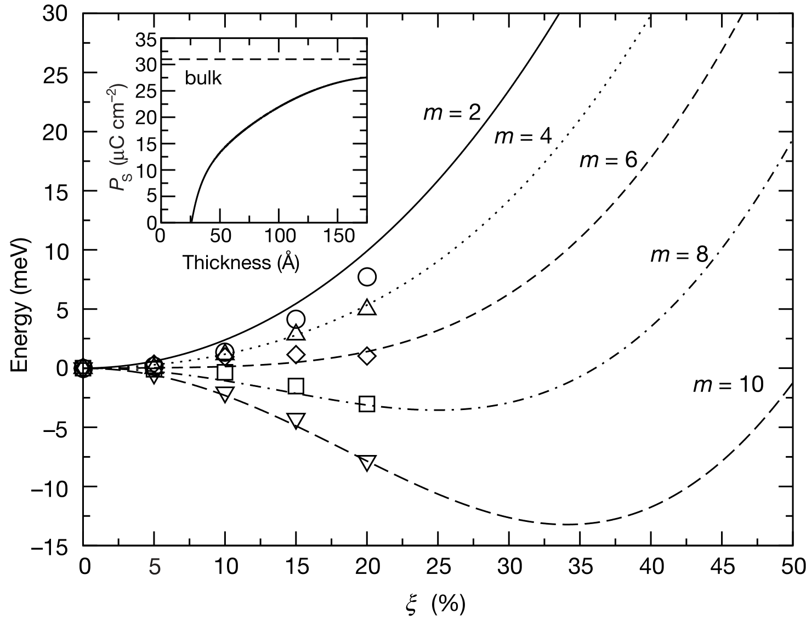

## junqueraCriticalThicknessFerroelectricity2003 — 钙钛矿超薄膜铁电性的临界厚度

## 📄 元数据
Junquera & Ghosez，2003，*Nature* 422, 506–509，DOI 10.1038/nature01501。
## 💡 一句话
用包含真实 SrRuO₃ 电极的第一性原理超胞计算首次证明，短路 BaTiO₃ 铁电薄膜在约 6 个晶胞（~24 Å）以下因电极不完全屏蔽产生的退极化场er 丧失铁电性，确立了铁电器件微缩的静电学极限。

## 🔗 Wiki 双链
  - 概念 [[../concepts/density-functional-theory]]
  - 概念 [[../concepts/berry-phase]]
  - 概念 [[../concepts/strain-engineering]]
  - 概念 [[../concepts/polarization-switching]]
  - 概念 [[../concepts/ferroelectric-tunnel-junction]]
  - 概念 [[../concepts/critical-thickness]]
  - 概念 [[../concepts/depolarization-field]]
  - 概念 [[../concepts/ferroelectricity]]
  - 概念 [[../concepts/screening-length]]
  - 概念 [[../concepts/short-circuit-boundary]]
  - 概念 [[../concepts/soft-mode]]
  - 概念 [[../concepts/spontaneous-polarization]]
  - 实体 [[../entities/SnTe]]
  - 实体 [[../entities/BaTiO3]]
  - 实体 [[../entities/SIESTA]]
  - 实体 [[../entities/SrRuO3]]
  - 实体 [[../entities/SrTiO3]]
  - 图表 [[../figures/mathematical-models]]
  - 年度 [[../write/2000-2004|2003]]
  - 项目 [[../projects/project-5-snte-ferroelectric-sim]]
  - 项目 [[../projects/project-2-mn-multiferroics]]
  - 相关论文 [[../../raw/note/junqueraCriticalThicknessFerroelectricity2003]]

## 📊 关键图表
  -  -> [[../figures/electronic-devices-memory-transistors|存储器与晶体管]]
  - **图示描述**：展示第一性原理计算所模拟的完整铁电电容器结构，包含宏观示意（a）与原子超胞（b）：由上至下依次为 SrRuO₃ 顶电极 / BaTiO₃ 铁电薄膜 / SrRuO₃ 底电极，外延生长于 SrTiO₃ 衬底上，两电极短路连接；原子图标明了 SrO/TiO₂ 界面终端及周期性超胞通式 [SrO-(RuO₂-SrO)ₙ/TiO₂-(BaO-TiO₂)ₘ]（n=5，m=2–10）。
  - **关键特征**：
    - 计算中显式包含金属电极与界面，不同于以往仅研究孤立薄膜、假设 E=0 完美屏蔽的理论工作。
    - 面内晶格常数固定为 SrTiO₃ 体相值，隐式施加约 2% 压应变，该应变将自发极化由 24 μC cm⁻² 放大至 31 μC cm⁻²。
    - 周期性边界条件自然实现电极间短路（等电势），是后续退极化场得以物理引入的前提。
  - **结论/意义**：确立了"真实电极 + 铁电层 + 衬底"的完整器件模型，是本研究区别于前人工作并发现临界厚度的方法学起点。
  -  -> [[../figures/mathematical-models-simulations|模拟与数值结果]]
  - **图示描述**：核心结果图。横轴为沿体相四方软模的归一化位移幅度 y（y=1 对应体相 BaTiO₃ 四方畸变量），纵轴为相对于顺电参考相的能量差；不同曲线对应 BaTiO₃ 厚度 m=2–10 个晶胞，符号为 DFT-LDA 计算结果，实线为静电模型 E=U−P·E_d 的拟合；插图给出自发极化 P_s 随 m 的变化。
  - **关键特征**：
    - m≤4 时曲线呈"U"型，最小值位于 y=0，顺电相稳定，铁电性消失。
    - m≥6 时曲线转为"W"型双阱，y≠0 两侧出现对称能量极小值，标志铁电基态出现；m≈6（~24–26 Å）即临界厚度。
    - 静电模型实线与 DFT 符号高度吻合，证明静电能主导、界面化学键合贡献次要。
    - 插图显示超过临界厚度后 P_s 并不立即达到体相值，而是随 m 增大缓慢恢复，体现退极化场的持续压制。
  - **结论/意义**：直接给出了约 6 个晶胞（~24 Å）的临界厚度，并以静电模型定量复现，从能量曲线上终结了"铁电薄膜无临界尺寸"的争论。
  - ![图3 沿 [001] 方向的宏观电荷密度差与静电势差：界面偶极子与薄膜内部线性电势降（退极化场 E_d）](../../raw/figures/junqueraCriticalThicknessFerroelectricity2003/fig_3_DQ8AHC66.png)
  - **图示描述**：针对 m=6 超胞，沿薄膜生长方向 [001] 的一维机制图。（a）铁电相与顺电相之间的宏观平均总电荷密度（离子+电子）差，对比 y=5% 与 y=15% 两种软模畸变幅度；（b）对应的宏观平均静电势差，BaTiO₃ 内部电势近似线性下降，其斜率即为退极化场 E_d。
  - **关键特征**：
    - （a）在两个金属/铁电界面处出现正负电荷峰，形成两个同号界面偶极子；金属一侧的电荷扰动在第一层 RuO₂ 之外按屏蔽长度指数衰减。
    - （b）每个界面偶极子产生同向电势降 ΔV，为维持短路边界条件（两电极等电势），薄膜内部必然出现反向于极化方向的线性电场，即退极化场 E_d=2ΔV/l。
    - y 越大（极化越强），ΔV 与 E_d 越大；厚度 l 越小，E_d 越强，与图2能量曲线由双阱退化为单阱的行为一致。
  - **结论/意义**：把抽象的"不完全屏蔽 → 退极化场"机制可视化、定量化，解释了图2中临界厚度出现的微观物理根源。
  - 注：raw/figures 下 manifest.json 对图 1 的自动描述误植为冰芯地图（PDF 提取串文），实际图 1 为本论文的电容器超胞示意，以上图注依据论文正文。

## 🔬 项目连接
  - **project-5（SnTe 铁电薄膜模拟，strong）**：本文是铁电薄膜有限尺寸效应的奠基性文献，直接对 SnTe 薄膜/二维 SnTe 铁电模拟有参考价值。(1) 机制可类比——SnTe 无论以传统铁电还是滑动铁电形式存在，置于电极间时同样要面对极化束缚电荷的屏蔽问题，电极屏蔽长度不足必然在薄膜内部产生退极化场，本文给出的 E_d = 2ΔV/l 图像可直接迁移到 SnTe 电容器构型。(2) 计算流程可复用——在周期性超胞中显式包含金属电极、施加短路边界条件、沿软模（或相应极性位移模式）扫描能量曲线判断铁电/顺电基态，是判断 SnTe 是否存在临界厚度的标准范式。(3) 静电模型 E = U − P·E_d 可作为 LAMMPS/MLIP 或 DFT 结果的解析校核工具。(4) 数据可参照——BaTiO₃/SrRuO₃ 体系 ~6 uc (~24 Å) 的临界厚度、应变把 P_s 从 24 增至 31 μC cm⁻² 等定量结果，为 SnTe 体系提供对比基准。(5) 对二维/层状 SnTe，电极屏蔽问题甚至更尖锐（界面范德华间隙、有限态密度），本文的方法论是天然起点。
  - **project-2（Mn 多铁，medium）**：多铁薄膜若要实现磁电耦合，铁电分量必须在纳米尺度保持稳定。本文确立的"真实电极下铁电性有临界厚度、退极化场压制极化"的物理图像，对任何钙钛矿多铁薄膜（包括含 Mn 的体系）的厚度设计、电极选择、畴结构考虑都有方法学参考价值；DFT+Berry 相计算极化、超胞加短路电极的做法也可直接借用。但本文材料本身是 BaTiO₃，与 Mn 多铁无直接材料重合，故判为 medium。
  - 其他项目（project-1 双光子、project-3 机械发光 NN、project-4 TTF 分子计算、project-6 湿度传感器、project-7 CDW）无直接项目连接。

## 🔗 项目双链
- 项目 [[../projects/project-5-snte-ferroelectric-sim|项目五：lammps势函数SnTe铁电模拟]]

## 📝 组织与用词
  - 文章采用"问题—矛盾—模型—结果—机制—影响"的简洁 Nature 论证链。先指出前人在 E=0 假设下预测无临界尺寸，再用包含真实电极的超胞计算给出反例，然后用宏观平均电荷密度与静电势把退极化场可视化，最后用 E = U − P·E_d 解析模型定量复现第一性原理结果，证明静电学主导、界面化学键合贡献次要。并通过漏电流时间尺度（~0.1 s）与极化翻转时间尺度（~10⁻⁹ s）的对比排除了有限电导率对临界厚度结论的干扰。
  - 值得复用的术语：
    - [[../concepts/critical-thickness|critical thickness — 临界厚度]]
    - [[../concepts/depolarization-field]]（去极化场）
    - [[../concepts/screening-length|screening length — 屏蔽长度]]
    - [[../concepts/soft-mode|soft-mode distortion — 软模畸变]]
    - [[../concepts/short-circuit-boundary|short-circuit boundary condition — 短路边界条件]]
    - [[../concepts/interface-dipole|interface dipole — 界面偶极子]]
    - [[../concepts/spontaneous-polarization|spontaneous polarization — 自发极化]]
    - ferroelectric instability — 铁电不稳定性

## ✏️ 可写入 Wiki 的要点
  1. **临界厚度数值**：BaTiO₃ 夹于两个短路 SrRuO₃ 电极之间、外延于 SrTiO₃ 衬底（约 2% 压应变）时，临界厚度约为 m=6 个晶胞，对应 ~24–26 Å；m≤4 顺电相稳定，m≥6 铁电相稳定，m=6 附近为临界点。
  2. **物理机制**：极化 P 在界面产生束缚电荷 σ_pol = P·n̂，金属电极电子因有限屏蔽长度无法完全中和，在两界面形成同号偶极子；为维持短路（电极等势），薄膜内部必然出现反向[[../concepts/depolarization-field|退极化场]] E_d = 2ΔV/l，厚度 l 越小 E_d 越强，最终压制铁电不稳定性。
  3. **静电模型**：E = U − P·E_d，其中 U 为零场内能（用体相软模双阱势近似），P = (1/Ω)Σ Z*_i y_i + χ_∞ E_d；横向有效电荷 Z* 用 Berry 相方法计算，[[../concepts/electronic-susceptibility|电子极化率]] χ_∞ 由超胞技术获得。该模型仅用体相参数即完整复现第一性原理能量曲线，说明静电学主导超薄行为，界面化学键合贡献次要。
  4. **方法学创新**：首次在第一性原理计算中显式构建完整的"金属电极/铁电薄膜/金属电极/衬底"超胞，通式 [SrO-(RuO₂-SrO)_n/TiO₂-(BaO-TiO₂)_m]，n=5、m=2–10，周期性边界条件自然施加短路条件；面内晶格常数固定为 SrTiO₃ 体相值以隐式包含[[../concepts/epitaxial-strain|外延应变]]。
  5. **应变效应量化**：衬底施加的 ~2% 压应变抑制 BaTiO₃ 面内铁电不稳定性，同时通过垂直方向泊松弛豫将计算的自发极化从 24 μC cm⁻² 放大到 31 μC cm⁻²。
  6. **超临界厚度后的残余压制**：即使 m>6，退极化场仍使 P_s 低于体相值，并随 m 增大缓慢趋近体相值（图 2 插图）；这意味着器件在临界厚度以上仍受静电场影响，关联到[[../concepts/coercive-field|矫顽场]]、开关电压、疲劳等性能。
  7. **漏电流时间尺度论证**：典型铁电电容 J < 10⁻⁵ A cm⁻²、σ_pol < 10⁻⁶ C cm⁻² 下，漏电流屏蔽所需时间约 0.1 s，远长于[[../concepts/polarization-switching|极化翻转]]时间 ~10⁻⁹ s，故漏电流不能阻止亚临界厚度薄膜弛豫回顺电态；但长时间尺度上仍可能影响矫顽场与疲劳。
  8. **与前人工作的边界**：Ghosez & Rabe (2000)、Meyer & Vanderbilt (2001) 等在零内场（完美屏蔽）条件下预测无临界尺寸；本工作通过引入真实金属-钙钛矿界面（有限屏蔽长度、界面化学、衬底应变）推翻了该结论。Rao et al. (1997) 虽研究过金属/BaTiO₃ 界面，但未讨论铁电不稳定性。
  9. **计算细节**：SIESTA 代码、[[../concepts/numerical-atomic-orbitals|数值原子轨道基组]]、LDA；SrO/TiO₂ 界面终端（实验上因 Ru 挥发性所致）；先以中心 TiO₂ 层镜面对称约束弛豫得到顺电参考态（原子最大受力 < 40 meV Å⁻¹），再沿体相四方软模位移模式 y 扫描能量；对 m=2 超胞还做了无约束全原子弛豫验证，原子自发回到顺电位置。
  10. **后续启示**：寻找更短屏蔽长度 of 电极材料（金属、导电氧化物乃至二维导体）、界面工程（插层、终端调控）、多畴与畴壁屏蔽、缺陷/[[../concepts/oxygen-vacancy|氧空位]]的电荷补偿，是降低临界厚度与调控超薄[[../concepts/ferroelectricity|铁电性]]能的主要方向；临界厚度以下结构可能作为高介电常数材料 or 出现[[../concepts/ferroelectric-metal|铁电金属]]等新量子态。
