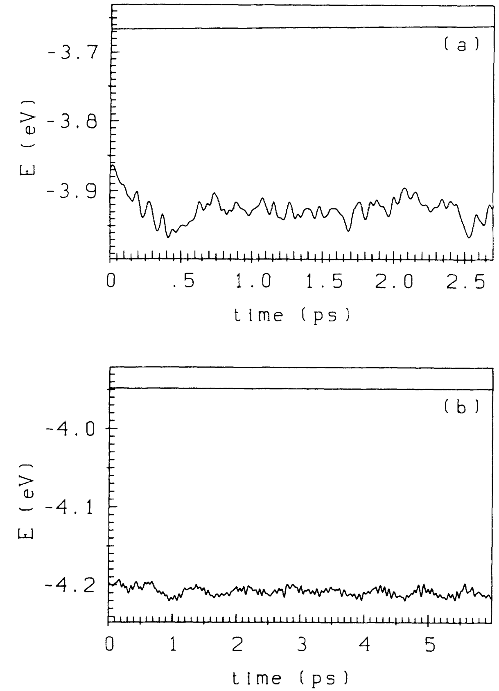
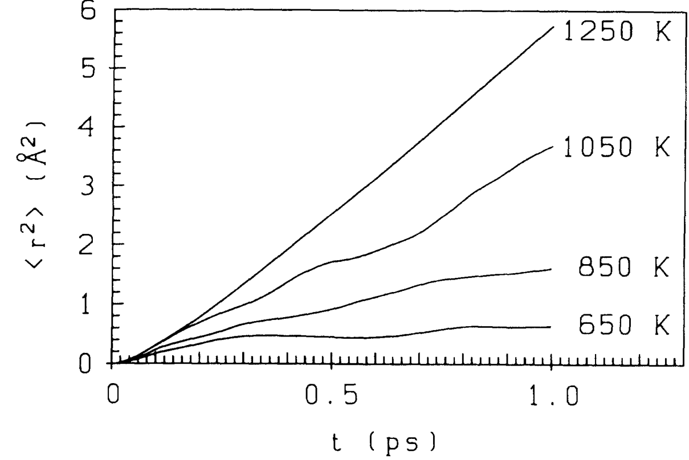
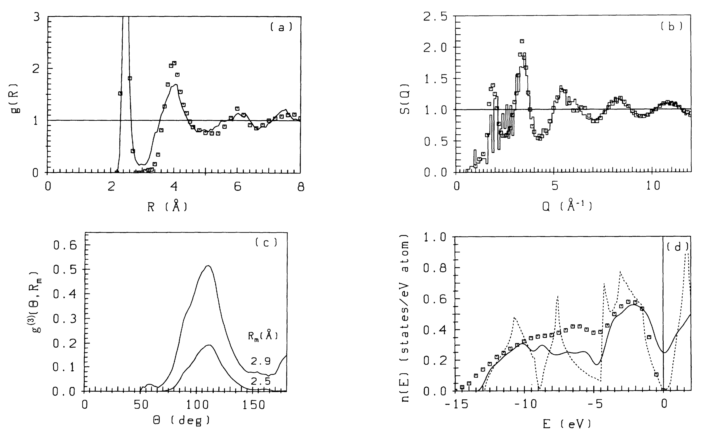
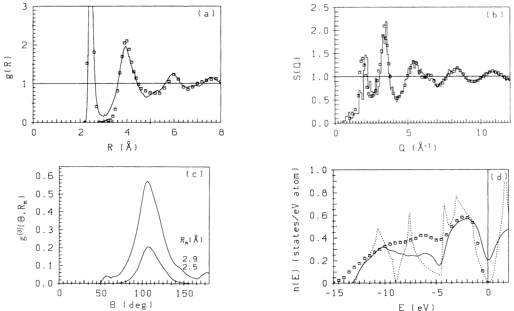
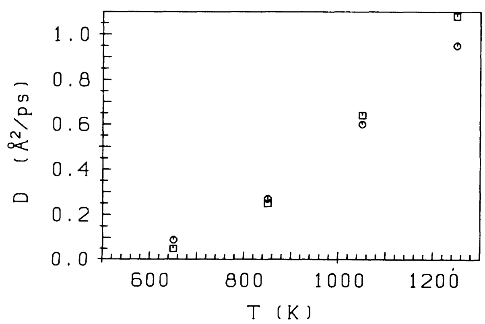
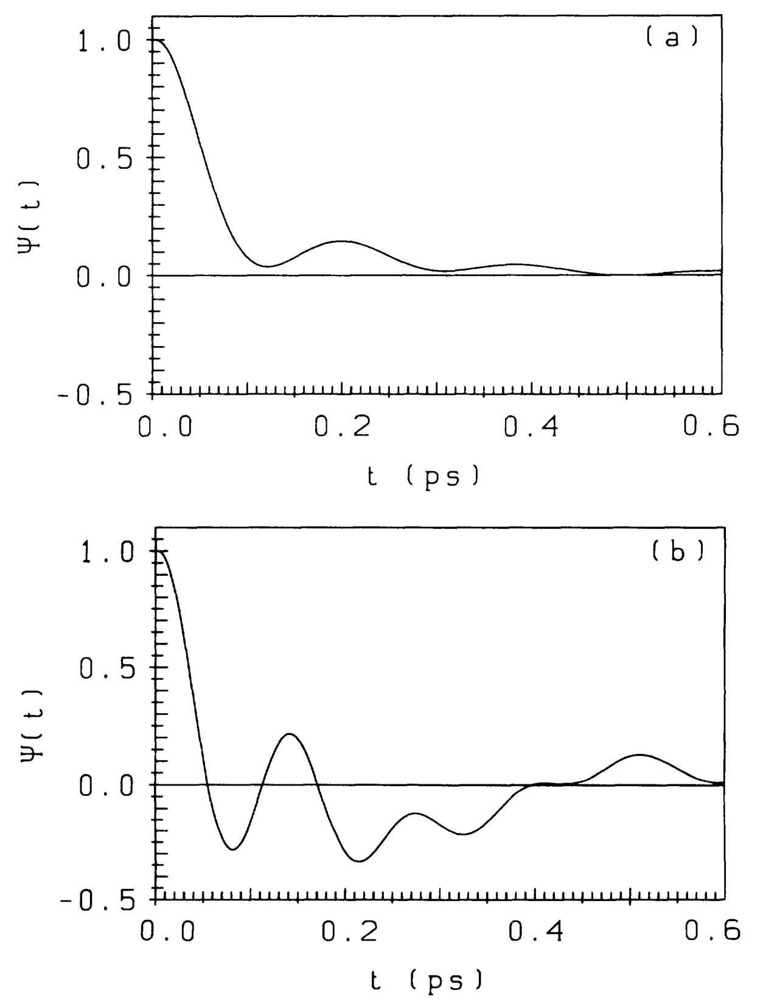
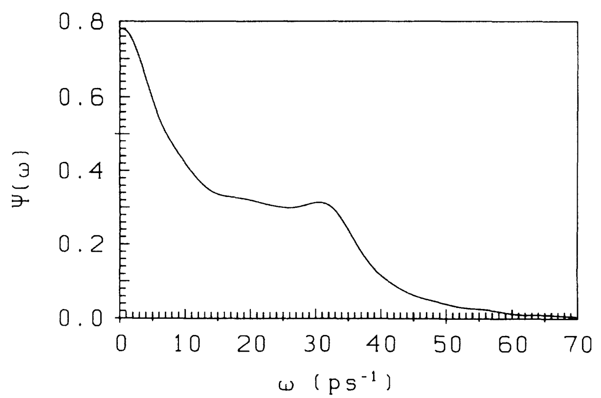
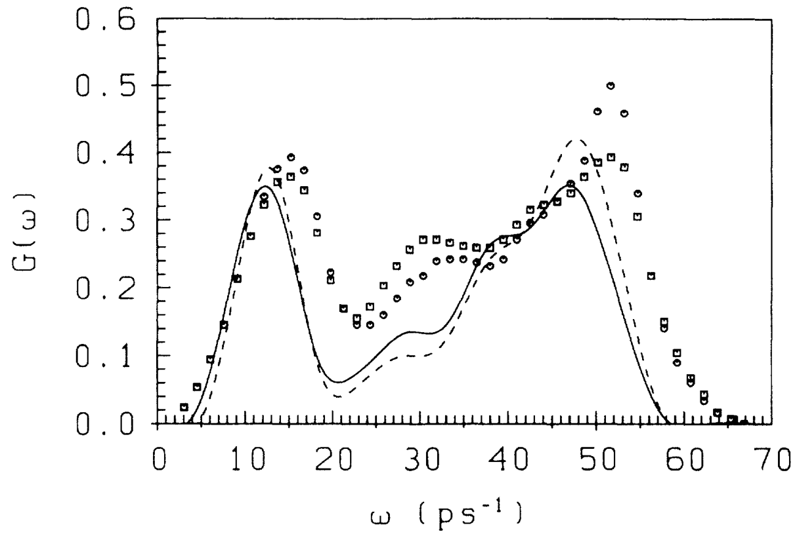
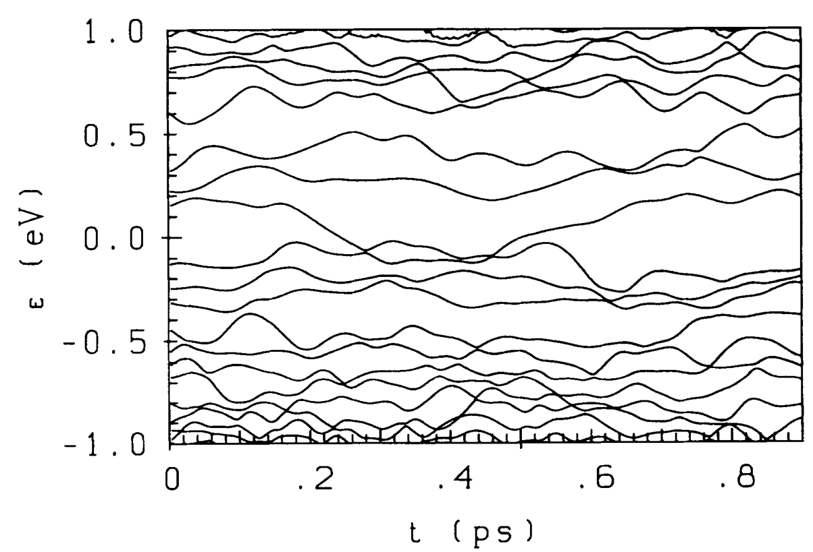

## kresseInitiomoleculardynamicsSimulationLiquidmetalamorphoussemiconductor1994 — 锗中液态金属-非晶半导体转变的从头算分子动力学模拟

## 📄 元数据
G. Kresse 与 J. Hafner，1994-05-15，Physical Review B 49(20), 14251–14269，DOI [10.1103/PhysRevB.49.14251](https://doi.org/10.1103/PhysRevB.49.14251)（奥地利维也纳工业大学理论物理研究所）
## 💡 一句话
提出基于"每步直接能量最小化 + 有限温度 DFT + Nosé 恒温器 + 实空间投影非局域赝势"的从头算分子动力学范式，从第一性原理完整再现 Ge 从高温液态金属到室温非晶半导体的淬火转变，并首次在同一框架下把几何缺陷、成键缺陷与带隙光谱缺陷三者关联起来。
## 🔗 Wiki 双链
  - 概念 [[../concepts/density-functional-theory]]
  - 实体 [[../entities/VASP]]（本文作者 Kresse 即 VASP 主要作者，文中共轭梯度直接最小化、Kleinman-Bylander 实空间投影、超软赝势路线正是 VASP 早期算法基石）
  - 图表 [[../figures/crystal-structures]]（金刚石/β-Sn/fcc/bcc/sc 多相 E-V 状态方程对比）
  - 图表 [[../figures/vibrational-spectra]]（VDOS：TA/LA/LO/TO 四峰与中子非弹性散射对比）
  - 图表 [[../figures/electronic-bands]]（DOS 赝能隙→能隙、带隙局域态）
  - 图表 [[../figures/mathematical-models]]（g(R)、S(Q)、键角分布、局域化参数 L）
  - 年度 [[../write/1945-1999|1994]]
  - 主题 [[../topics/Z01-computational-materials-design|材料模拟计算设计]]
  - 相关论文 [[../../raw/note/kresseInitiomoleculardynamicsSimulationLiquidmetalamorphoussemiconductor1994]]

## 🆕 新概念/实体建议
  - [[../concepts/aimd]]（AIMD，从头算分子动力学；从电子基态实时算力的 MD，本文是 Born-Oppenheimer MD 路线的奠基性工作之一）
  - [[../concepts/born-oppenheimer-md|born-oppenheimer-md]]（BO-MD；与 Car-Parrinello MD 并列的两条 AIMD 主路线，本文是其在金属体系上的标志性实现）
  - [[../concepts/Car-Parrinello]]（CP 方法；与本文方法对照的"同时演化电子-离子"路线，在金属中存在非绝热难题）
  - [[../concepts/finite-temperature-dft|finite-temperature-dft]]（Mermin 有限温度 DFT；用分数占据/高斯展宽稳定金属电子结构，自由能梯度等于 Hellmann-Feynman 力）
  - [[../concepts/amorphous-semiconductor|amorphous-semiconductor]]（非晶半导体；四配位 sp³ 共价网络、短程有序长程无序，区别于液态金属高配位结构）
  - [[../concepts/dangling-bond-floating-bond|dangling-bond-floating-bond]]（悬空键 T3 / 浮动键 T5 缺陷对；非晶四面体网络中的两类特征配位缺陷及其与 EPR 信号的争议）
  - [[../concepts/pair-correlation-function|pair-correlation-function]]（g(R) 与静态结构因子 S(Q)；液态/非晶结构表征的"金标准"对）
  - [[../concepts/conjugate-gradient-minimization|conjugate-gradient-minimization]]（预条件共轭梯度 + 子空间对角化 + Kerker 混合；直接能量最小化算法栈）
  - [[../concepts/nose-thermostat|nose-thermostat]]（Nosé 扩展系统恒温器；生成 NVT 正则系综，ω_T 与离子振动频率同量级时耦合最强）
  - [[../concepts/pseudogap|pseudogap]]（赝能隙；液态 Ge 在 −4.5 eV 处由相对论 s-p 分裂造成的 DOS 凹陷，重 IV 族 Ge/Sn/Pb 液态特征）
## 📊 关键图表
  -  -> [[../figures/mathematical-models-formulas|光学、输运与其他解析公式]]
  - **图示描述**：(a) T=1250 K 液态、(b) T=300 K 非晶态下，Nosé 扩展哈密顿量（守恒量 Ω，上曲线）与离子势能 E（下曲线）随模拟时间（ps）的演化，用于检验 BO 直接最小化方案的绝热性与能量守恒。
  - **关键特征**：液态 3 ps（1000 步、Δt=3 fs）内 Ω 漂移 < 5 meV/atom，不足结合能的 0.1%；非晶态 6 ps 内 < 1 meV/atom；势能在恒温器周期 ω_T≈13.6 ps⁻¹ 附近小幅振荡但无系统漂移。
  - **结论/意义**：证明即使每步都做电子最小化，Born-Oppenheimer 直接能量最小化路线在金属相仍可长时间稳定，是后续 30 ps 淬火-退火模拟的可靠性基础。
  -  -> [[../figures/crystal-structures-bulk|体相晶体结构]]
  - **图示描述**：固态 Ge 在金刚石（CD）、β-Sn（白锡）、fcc、bcc、sc 五种晶体结构下的能量-体积 E(V) 与压强-体积 P(V) 状态方程曲线，横轴为体积（ų/atom），左/右纵轴分别为能量（eV/atom）与压强（kbar）。
  - **关键特征**：金刚石相能量最低，晶格常数误差 1.3%；公切线给出金刚石→β-Sn 相变压 P≈75 kbar（实验 100 kbar）；12 Ry 截断即可把总能收敛到 1 mRy/atom；Vanderbilt 非局域赝势（R_c=1.5 a.u.，p 局域、s/d 非局域）在各相间可移植。
  - **结论/意义**：在进入液相模拟前先以多相状态方程标定赝势精度，证明所选自旋-轨道标量相对论赝势能同时描述四配位共价与高压金属相，是整份工作定量可信的前提。
  -  -> [[../figures/mathematical-models-computational|计算方法与泛函]]
  - **图示描述**：(a) 瞬时离子温度 T(t) 与 (b) 势能 E(t) 随模拟时间记录的完整热历史：1250 K 液相平衡 4.5 ps → 三段淬火至 300 K → 升温到 600 K 退火 3 ps → 再淬火至 300 K。
  - **关键特征**：64 原子、密度 0.04385 Å⁻³；最快淬火速率 1.67×10¹⁴ K/s，750→450 K 段放慢至 0.67×10¹⁴ K/s（结构剧变区）；总热处理 15 ps，退火后再做 7.5 ps 生产运行；势能在每次降温台阶单调下降并在恒温段进入平衡涨落。
  - **结论/意义**：把"液态金属—过冷液体—非晶半导体"路径固化为可复现的温度协议，也是论文表 II 的可视化版本，为后续 g(R)/DOS/动力学对比提供一致的系综来源。
  -  -> [[../figures/mathematical-models-simulations|模拟与数值结果]]
  - **图示描述**：液态与过冷液态 Ge 在 1250、1050、850、650 K 等温度下均方位移 ⟨|r(t)−r(0)|²⟩ 随时间（ps）的双对数曲线，斜率直接反映原子扩散机制。
  - **关键特征**：1250 K 曲线长时间呈线性增长（正常液体扩散）；温度下降后斜率迅速变缓，650 K 附近进入平台+次扩散（caging）；曲线在约 750 K 处出现明显拐折，对应非晶化温度 T_a，T_a/T_m≈0.6。
  - **结论/意义**：从动力学上独立定位金属-半导体转变温区，与结构/电子态判据互证；只有原子迁移率降到足够低，亚稳态共价键才能存活并锁定为非晶网络。
  -  -> [[../figures/electronic-bands-dos-fermi|态密度与费米面]]
  - **图示描述**：T=1250 K 液态 Ge 的四联图：(a) 对关联函数 g(R)，(b) 静态结构因子 S(Q)，(c) 键角分布 g⁽³⁾(θ,R_c)，(d) 电子态密度 n(E)，模拟曲线叠加中子衍射/光电子能谱实验点。
  - **关键特征**：g(R) 第一极小在 R=3.2 Å，配位数 N_c=5.8（3.4 Å 截断为 6.9，实验 6.8），远低于简单金属 10–12；S(Q) 在 Q=2k_F=3.46 Å⁻¹ 处有肩峰，对应 Friedel 振荡调制的软球堆积；键角从 60° 到 180° 宽分布，仅在 60° 与 109° 有平缓极大；DOS 在 E_F 处高态密度但在 −4.5 eV 出现显著赝能隙，恰好容纳 2 个 s 电子/原子。
  - **结论/意义**：液态 Ge 不是"四配位半导体原子 + 高配位金属原子"两相共存，而是配位数 3–8 连续均一的单一液体；−4.5 eV 赝能隙是相对论 s-p 分裂造成的重 IV 族液态特征。
  -  -> [[../figures/crystal-structures-bulk|体相晶体结构]]
  - **图示描述**：与图 5 同构的四联图，但数据取自 750→650 K 连续降温过程中采样的过冷液体，显示转变前夕的结构与电子态。
  - **关键特征**：N_c 降至 4.63，平均最近邻距离 d₁=2.63 Å；g(R) 第一、二峰变高变对称；键角分布中 109° 四面体峰显著增强，但 60° 密堆积峰仍可见；DOS 在 E_F 处态密度虽略降仍为金属性，价带开始显露 sp³ 子带雏形。
  - **结论/意义**：过冷液体已在短程上孕育共价四面体，但在扩散时间尺度上这些键被快速破坏-重建（仅 13–25% 呈共价特征），故宏观上仍是金属；金属-半导体转变需在 T_a 以下迁移率冻结后才完成。
  -  -> [[../figures/electronic-bands-dos-fermi|态密度与费米面]]
  - **图示描述**：300 K 直接淬火态非晶 Ge 的四联图（g(R)、S(Q)、键角分布、DOS），叠加中子衍射与光电子能谱实验数据。
  - **关键特征**：d₁=2.48 Å、N_c=4.04、平均键角 107.7°（Δθ≈17.9°，略宽于 WWW 连续随机网络模型）；四配位原子占 86.8%，T5 占 7.8%、T3 占 4.9%；g(R) 第一、二峰清晰分裂但谷深略浅于实验，提示无序度偏高；DOS 在 E_F 处打开真正的能隙，并保留 −4.5 eV 赝能隙与 −7 eV 浅极小，价带呈现晶态四面体半导体的 S/M/P 三个 sp 子带。
  - **结论/意义**：即使使用 10¹⁴ K/s 量级的极速淬火，精确量子多体力仍能生成符合实验的非晶半导体模型，修正了"经验势必须慢淬或人为增强三体力"的旧结论。
  -  -> [[../figures/electronic-bands-dos-fermi|态密度与费米面]]
  - **图示描述**：600 K 退火 3 ps 后再冷却到 300 K 的非晶 Ge 四联图，与图 7 的直接淬火态逐项对比。
  - **关键特征**：d₁=2.49 Å、N_c=4.05、键角 107.7°（Δθ≈16.9°）与淬火态几乎相同，但 g(R) 第二峰之后的中程振荡更清晰、与中子衍射高阶峰吻合度提升；DOS 能隙内的尾态/缺陷态密度下降；几何缺陷总数未减少，T5 反而略增至约 10.3%。
  - **结论/意义**：退火主要修复中程有序与不稳定的弱键构型，而不是简单"消除缺陷"；光谱缺陷密度的下降与几何缺陷数脱钩，再次暗示几何配位与电子性质并非一一对应。
  -  -> [[../figures/mathematical-models-simulations|模拟与数值结果]]
  - **图示描述**：由均方位移斜率与速度自相关函数积分两种途径给出的自扩散系数 D 随温度 T（K）的变化，线性-对数坐标上呈 Arrhenius 型下降。
  - **关键特征**：近熔点 1250 K 处 D≈1.0×10⁻⁴ cm²/s，与 Pavlov/Dobrokhotov 实验值 0.78–1.21×10⁻⁴ cm²/s 一致；在 T_a≈750 K 附近发生拐折，之后 D 迅速降到熔点值的约 6%；液态段激活能与简单金属熔体同量级，进入非晶后扩散被冻结。
  - **结论/意义**：以独立动力学量标定 T_a，并把液态金属-非晶半导体转变与扩散冻结直接关联；两种独立计算（MSD 与 Green-Kubo）相互校验，强化了数值结论。
  -  -> [[../figures/vibrational-spectra|振动光谱]]
  - **图示描述**：(a) T=1250 K 液态与 (b) 300 K 退火非晶态下，归一化速度自相关函数 ψ(t)=⟨v(0)·v(t)⟩/⟨v²⟩ 随时间（ps）的演化，用于表征原子运动的时间关联。
  - **关键特征**：液态 ψ(t) 在快速衰减到零附近后出现阻尼振荡，振荡周期约 0.2 ps，反映周围原子构成的瞬态"笼"对中心原子的反弹；非晶态下扩散背景消失，ψ(t) 表现为多个频率叠加的持续振荡，振幅缓慢衰减，对应固体本征振动模式。
  - **结论/意义**：在时间域把液态（耗散+笼效应）与非晶态（弹性多模振动）的动力学差异显化，是后续傅里叶变换到 VDOS 的直接输入。
  -  -> [[../figures/electronic-bands-dos-fermi|态密度与费米面]]
  - **图示描述**：由液态速度自相关函数 ψ(t) 傅里叶变换得到的振动态密度 ψ(ω)，横轴为频率/能量（meV 或 ps⁻¹），纵轴为谱强度（任意单位）。
  - **关键特征**：低频区为扩散型准弹性峰；在约 30 meV（≈7 ps⁻¹）处出现明显的非弹性侧峰，与非晶/晶体 Ge 的纵向声学（LA）支频率一致；高频光学支在液态下被阻尼抹平。
  - **结论/意义**：即使在金属液相，原子仍在短时间尺度上"感受"到类固体声学模，为液态中 Friedel 调制的软球堆积图像提供了动力学证据。
  -  -> [[../figures/electronic-bands-dos-fermi|态密度与费米面]]
  - **图示描述**：退火态非晶 Ge 的振动态密度 G(ω)（能量 meV 横轴），模拟谱（实线）叠加中子非弹性散射实验数据；虚线为仅对四配位原子子系综求平均的结果。
  - **关键特征**：清晰再现晶态 Ge 的 TA、LA、LO、TO 四个特征峰位；全原子模拟峰位正确但峰形偏宽，与高有序样品实验相比有明显展宽；仅取四配位原子后谱线显著锐化并更接近有序样品实验；缺陷/高配位原子主要贡献低频与峰间展宽。
  - **结论/意义**：证明非晶 Ge 的振动谱仍由局域四面体 sp³ 网络主导，无序原子则贡献谱线展宽；局域有序度可由振动谱反演，是模拟与非弹性散射实验定量对标最直接的一张图。
  -  -> [[../figures/mathematical-models-simulations|模拟与数值结果]]
  - **图示描述**：通过准牛顿淬火把瞬时室温构型投影到最近势能极小得到的两个 T=0 K 非晶构型的对关联函数 g(R) 对比：实线为经 600 K 退火的慢淬构型，虚线为 0.3 ps 快淬构型。
  - **关键特征**：两构型第一峰位置与高度几乎重合（d₁≈2.46–2.48 Å、N_c≈3.97–4.06）；第二峰之后的中长程振荡细节不同，慢淬构型与中子衍射符合更好但含更多几何缺陷；快淬构型能量反而低约 0.4 eV（作者注明可能为偶然）。
  - **结论/意义**：说明淬火路径主要影响中程结构和缺陷数，短程 sp³ 四面体骨架则在两种速率下都能稳健形成；也暴露 64 原子样本中"单个特殊缺陷"具有统计偶然性。
  -  -> [[../figures/electronic-bands-band-structures|能带结构与带隙]]
  - **图示描述**：300 K 退火非晶态下，费米能级附近若干单电子本征值 ε_i(t) 随模拟时间（ps）的涨落轨迹，其中波动最大的几条线对应能隙中的缺陷态。
  - **关键特征**：价带/导带扩展态本征值随时间仅小幅集体漂移；能隙内 1–2 条局域态本征值出现大幅、非平稳涨落，并间歇性进出能隙；这些涨落与弱键键长和局部键角的热摆动相关，时间尺度在亚皮秒量级。
  - **结论/意义**：首次从头算层面显示室温下"几何/成键缺陷在不断生成与湮灭"，把缺陷从静态 T3/T5 标签升级为动态实体，为 1/f 噪声、Staebler-Wronski 光致亚稳等非晶半导体现象提供了微观起源线索。
  - （注：图14 缺陷电子密度等值面、图15 18 号原子带隙态电荷密度为论文精华图，但 raw/figures 目录未导出对应 PNG，仅有上表/公式图）
## 🔬 项目连接
无直接项目连接。方法论上与 project-5（SnTe 铁电模拟）所依赖的 DFT/VASP 工具有同源关系——本文是 VASP 直接能量最小化路线的奠基文献之一，可作为 SnTe 等材料 AIMD 模拟的方法学引用，但不构成具体科学问题连接。
## 🔗 项目双链

## 📝 组织与用词
  论证遵循"方法建立 → 模型验证 → 性质分析 → 缺陷深析"四段链条。第 II 节先把四大技术支柱（有限温度 DFT、预条件共轭梯度直接最小化、Nosé 动力学、实空间投影非局域赝势）连同子空间对齐讲透，并用能量漂移数据（液态 3 ps < 5 meV/atom、非晶 6 ps < 1 meV/atom）证明绝热性可控；第 III 节给出 64 原子、12 Ry 截断、138 能带、σ=0.2 eV、分段淬火（最快 1.67×10¹⁴ K/s）+ 退火的完整热历史；第 IV–V 节用 g(R)/S(Q)/键角/DOS/扩散/VDOS 与中子衍射、光电子能谱、非弹性中子散射逐项对标；第 VI 节是高潮，把"几何缺陷 → 成键缺陷 → 光谱缺陷"三层定义剥离开，以 18 号原子为案例证明几何配位既非必要也非充分。值得在 wiki 中复用的术语：
  - **Ab initio molecular dynamics (AIMD)** / 从头算分子动力学
  - **Direct energy minimization / Born-Oppenheimer MD** / 直接能量最小化 / 玻恩-奥本海默 MD
  - **Nonadiabaticity in metals** / 金属体系的非绝热性（能级交叉导致电子脱离 BO 面）
  - **Finite-temperature DFT (Mermin)** / 有限温度密度泛函理论
  - **Fractional occupation / Gaussian smearing** / 分数占据 / 高斯展宽
  - **Pair-correlation function g(R) & static structure factor S(Q)** / 对关联函数与静态结构因子
  - **Tetrahedral network / continuous random network (CRN)** / 四面体网络 / 连续随机网络
  - **T3 dangling bond vs T5 floating/weak bond** / 三配位悬挂键 vs 五配位浮动键/弱键
  - **Bond charge** / 键电荷（sp³ 共价键中点处的电荷积累）
  - **Geometrical / bonding / spectral defect** / 几何缺陷 / 成键缺陷 / 光谱缺陷
## ✏️ 可写入 Wiki 的要点
  1. **方法学**：在 Car-Parrinello MD 之外确立了 Born-Oppenheimer/直接能量最小化 AIMD 路线. 每步离子移动后用预条件共轭梯度 + 子空间对角化把电子严格最小化到 BO 基态，配合 Mermin 有限温度 DFT 的分数占据（高斯展宽 σ=0.2 eV），从根本上回避了金属费米能级交叉导致的 CP 非绝热漂移；离子用 Nosé [[../concepts/thermostat|恒温器]]控温，时间步长 Δt=3 fs（约为 CP 典型步长的 10–20 倍），整体效率反超 CP 约 1.5–2 倍。
  2. **守恒性指标**：64 Ge 原子、1250 K 金属液相在 3 ps（1000 步）内守恒量漂移 < 5 meV/atom（< 0.1% 结合能），300 K 非晶相 6 ps 内 < 1 meV/atom，是当时金属 AIMD 稳定性的标杆数据。
  3. **赝势与基组**：标量相对论全电子计算生成的非局域 Vanderbilt 型赝势（R_c=1.5 a.u.，p 为局域分量，s/d 非局域，Kleinman-Bylander 分解 + 实空间投影），12 Ry 截断即可把 Ge 总能收敛到 1 mRy/atom；金刚石相晶格常数误差 1.3%，预测金刚石→β-Sn（白锡）相变压 75 kbar（实验 100 kbar），这是该赝势可移植性的量化证据。
  4. **液态 Ge 结构**：T=1250 K、密度 0.04385 Å⁻³，g(R) 第一极小在 R=3.2 Å，配位数 N_c=5.8（或用 3.4 Å 截断为 6.9，实验 6.8），远低于简单金属 10–12；配位数分布从 3 到 8 连续且均一（N_c=6 占 31.4%，5 占 29.3%，7 占 19.7%），否定了"半导体四配位原子 + 金属高配位原子两相共存"模型；S(Q) 在 Q=2k_F=3.46 Å⁻¹ 处有肩峰，对应 Friedel 振荡对软球堆积的调制。
  5. **液态电子结构**：液态 Ge DOS 在 −4.5 eV 处有显著[[../concepts/pseudogap|赝能隙]]，价带下部恰好容纳 2 个 s 电子/原子——这是相对论效应导致 4s 电子部分穿透 3d 核心、s-p 分裂增强的结果，是重液态 IV 族（Ge/Sn/Pb）区别于 l-Si（近自由电子抛物线 DOS）的特征；与高分辨光电子能谱定量吻合。
  6. **过冷液态与非晶化温度**：750–650 K 仍为金属性过冷液体，N_c 降至 4.63，四面体键角开始占主导但仍混有 60° 密堆积构型；约化非晶化温度 T_a/T_m = 750/1250 ≈ 0.6，与 Si 相当。机制：T_a 以上仅约 13–25% 的键呈共价特征，这些键在扩散时间尺度上被快速破坏-重建；只有原子迁移率降到足够低，已形成的共价键才能存活，金属-半导体转变随之快速发生。
  7. **非晶 Ge 结构**：300 K 淬火态 d₁=2.48 Å、N_c=4.04、平均键角 107.7°（Δθ≈17°，略宽于 Wooten-Winer-Weaire CRN 模型），四配位原子占 86.8%，T5（7.8%）略多于 T3（4.9%）；DOS 在 E_F 处打开真正的能隙，并保留 −4.5 eV 赝能隙与 −7 eV 浅极小，价带呈现对应晶态四面体半导体 S/M/P 三个 sp 子带；退火使 g(R) 中程振荡与中子衍射更吻合，但不减少缺陷数，反而 T5 略增（10.3%）。
  8. **动力学**：液态 Ge 近熔点自扩散系数 D≈1.0×10⁻⁴ cm²/s（与 Pavlov/Dobrokhotov 实验 0.78–1.21×10⁻⁴ cm²/s 一致），T_a 处 D 降至熔点值的 6%；非晶态 VDOS 清晰再现晶态 Ge 的 TA/LA/LO/TO 四峰，仅对四配位原子子系综求平均时谱线与高有序样品 experiment 一致，证明无序原子贡献了谱线展宽——这是局域有序度可从振动谱反演的直接证据。
  9. **缺陷三层定义**：(a) 几何缺陷依赖 R_c——R_c=2.8 Å 时慢淬构型有 3 个 T3 + 7 个 T5，R_c=3.0 Å 时变为 0 T3 + 14 T5，18 号原子即在两可之间；(b) 成键缺陷以"键电荷"判定——d₁ ≥ 2.85 Å 即无键电荷，T5 通常由 3–4 强键 + 1–2 弱键构成，T3 第四方向仅见弥散电荷；(c) 光谱缺陷用局域化参数 L（把元胞分成 m³ 小格，L=1 为完全扩展态，L=1/M 为单格局域态）量化。构型中虽有 10 个几何缺陷，只有 18 号原子产生唯一的强局域带隙态（第 128 能带），电荷集中在其不对称弱键方向；几何缺陷既非必要也非充分，极端键角扭曲 + 不对称成键才是带隙态根源。
  10. **室温缺陷动态学与方法学外溢**：图 16 显示即使 300 K，能隙中态的本征值仍显著涨落，对应局域缺陷的不断形成与湮灭，预示 1/f 噪声、Staebler-Wronski 光致亚稳等现象的微观起源；文末作者宣布已完成基于超软赝势（ultrasoft PP）的代码版本以把方法推广到过渡金属——这条路线直接演化为后来的 VASP。模拟的已知局限：恒密度假设（相对 LDA 晶[[../concepts/density-of-states|态密度]]引入约 6% 密度赤字）、64 原子周期性胞无法捕捉纳米空洞与缺陷-缺陷相互作用、Γ 点采样对力足够但 DOS 需 6×6×6 Monkhorst-Pack 后处理消去伪影。
