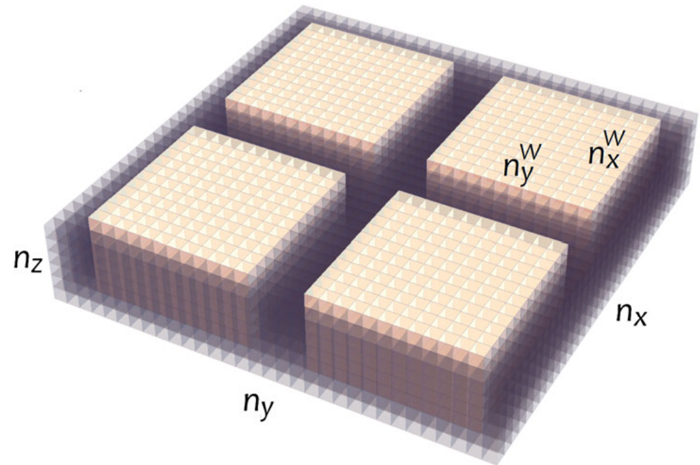
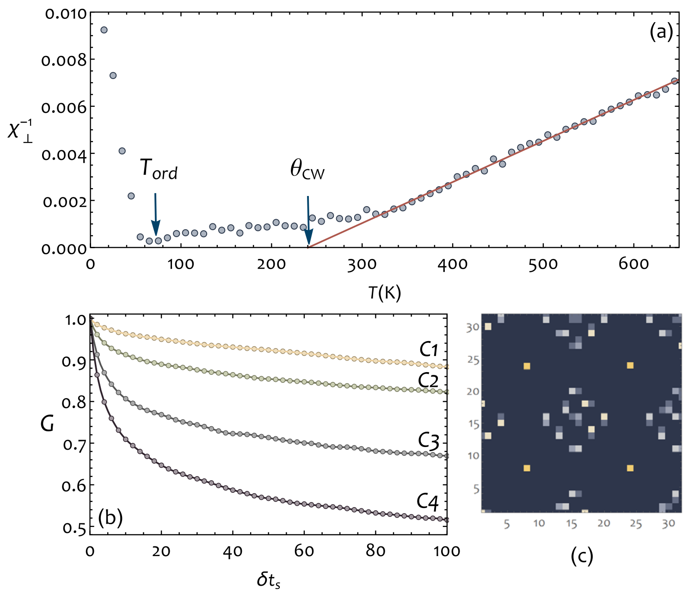
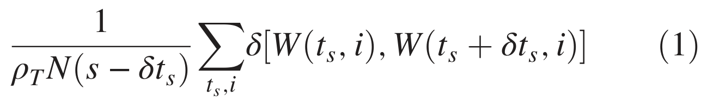

## nahasFrustrationSelfOrderingTopological2016 — 铁电体拓扑缺陷的受挫与自序

## 📄 元数据
Y. Nahas, S. Prokhorenko, L. Bellaiche，2016，Physical Review Letters 116, 117603，DOI 10.1103/PhysRevLett.116.117603
## 💡 一句话
在 BTO 纳米线嵌入 BST 基质的铁电纳米复合材料中，纳米线手性的独立选择对基质施加不相容的几何边界条件，诱导出几何阻挫，基质以自组装、浮动的涡旋-反涡旋有序阵列来容纳阻挫，并在极低温下保留剩余构型熵。
## 🔗 Wiki 双链
  - 概念 [[../concepts/topological-defects|拓扑缺陷]]
  - 概念 [[../concepts/geometric-frustration|几何阻挫]]
  - 概念 [[../concepts/chirality|手性]]
  - 概念 [[../concepts/vortex-antivortex|涡旋-反涡旋]]
  - 概念 [[../concepts/residual-entropy|剩余熵]]
  - 概念 [[../concepts/ground-state-degeneracy|基态简并]]
  - 概念 [[../concepts/frustration-index|阻挫指数]]
  - 概念 [[../concepts/effective-hamiltonian|有效哈密顿量]]
  - 概念 [[../concepts/flux-closure-domain|磁通闭合畴]]
  - 概念 [[../concepts/antiferrotoroidic-order|反铁环形序]]
  - 概念 [[../concepts/toroidal-moment|环形矩]]
  - 概念 [[../concepts/depolarization-field]]
  - 概念 [[../concepts/ferroelectricity|铁电性]]
  - 概念 [[../concepts/domain-wall]]
  - 实体 [[../entities/BaSrTiO3|钛酸锶钡]]
  - 实体 [[../entities/BaTiO3|钛酸钡]]
  - 图表 [[../figures/crystal-structures]]
  - 图表 [[../figures/mathematical-models]]
  - 年度 [[../write/2015-2019|2016]]
  - 项目 [[../projects/project-2-mn-multiferroics]]
  - 项目 [[../projects/project-5-snte-ferroelectric-sim]]
  - 相关论文 [[../../raw/note/nahasFrustrationSelfOrderingTopological2016]]

## 📊 关键图表
  -  -> [[../figures/crystal-structures-bulk|体相晶体结构]]
  - **图示描述**：模拟所用周期性超胞的三维示意，4 根截面为正方形的 BTO 纳米线以正方形阵列嵌入 Ba₀.₁₅Sr₀.₈₅TiO₃ 基质，轴向沿伪立方 [001]，x、y、z 三方向均施加周期性边界条件。
  - **关键特征**：超胞尺寸 32×32×6 个晶格常数；每根纳米线截面 n_x^W = n_y^W = 12（约 21.4 nm²），线间距 4 个晶格常数；BTO 与 BST 极化率差异使纳米线成为手性自由度的载体、基质成为被阻挫的对象；该几何参数（线径、间距）直接决定后续阻挫强度，是全文所有计算与讨论的空间基础。
  - **意义**：定义了"几何阻挫"中"几何"二字的来源——强铁电体方阵列对周围弱铁电基质施加的边界条件。
  -  -> [[../figures/crystal-structures-bulk|体相晶体结构]]
  - **图示描述**：5 K 弛豫后 C1:[++++]、C2:[--+-]、C3:[--++]、C4:[-++−] 四种手性构型在任意 (001) 面内的电偶极矢量场，深色箭头为纳米线内偶极子、浅色箭头为基质偶极子，蓝点为涡旋（拓扑荷 +1）、红点为反涡旋（拓扑荷 −1）。
  - **关键特征**：以 C1 为参考，C2/C3/C4 每单胞能量差仅 0.76 / 0.86 / 1.55 meV，冷启动退火可落入任一构型，构成准四重基态简并；C4（反铁环形排列）中涡旋与反涡旋呈高度有序的交错（staggered）自组装阵列，是铁电体中首次报道的几何阻挫诱导周期性缺陷有序结构；缺陷由 O(2) 卷绕数按小方格四偶极投影在单位圆上的覆盖方向判定（逆时针 +1、顺时针 −1、未覆盖无缺陷）；不同手性输入导致基质微结构迥异，直接证明手性对基质施加了不相容的取向边界条件。
  - **意义**：给出"手性 → 几何约束 → 阻挫 → 缺陷自有序化"因果链的定性图像，是全文最核心的结果图。
  -  -> [[../figures/crystal-structures-bulk|体相晶体结构]]
  - **图示描述**：三子图组合。(a) 构型 C10（线间距加大至 6 个晶格常数）的逆面内介电常数 χ⊥⁻¹=(χ₁₁+χ₂₂)/2 随温度 T 的变化，红线为高温线性拟合，箭头标出 T_ord 与 θ_CW；(b) 5 K 下 C1–C4 缺陷空间分布的蒙特卡洛时间自相关函数 G(δt_s)；(c) 5 K 下 C4 构型缺陷空间概率分布（黄→深蓝表示高→低概率，统计自 100000 次弛豫后 5000 次扫描）。
  - **关键特征**：高温拟合得 θ_CW ≈ 240 K，基质有序化温度 T_ord ≈ 75 K，C10 的阻挫指数 f = θ_CW/T_ord ≈ 3.2；C1–C4 的 f 分别为 3.09、3.13、3.68、4.03，C4（反铁环形）阻挫最强，增大线间距（C10 vs C1）会减弱对基质缺陷的约束、增强阻挫；χ⊥⁻¹ 在 240→75 K 区间保持准线性，表明基质偶极在 θ_CW 以下仍近似自由涨落、顺相被异常延长；G 随 δt_s 下降表明基质缺陷在 5 K 仍持续空间涨落（纳米线内涡旋 G=1 保持钉扎），C4 下降幅度最大、与其 f 最大一致；概率图中纳米线中心亮斑尖锐（钉扎），基质中阵列弥散（浮动特性），单胞能量标准差约 10⁻⁵ eV，T→0 时熵非零即存在剩余构型熵；两次相变分别发生在约 330 K（纳米线获得非零环形矩 z 分量、面内磁化率小尖峰）和约 75 K（基质涡旋/反涡旋数目守恒、面内磁化率显著尖峰）。
  - **意义**：从宏观介电响应、动力学自相关、空间概率三个角度定量证实几何阻挫，并把阻挫强度、缺陷自由体积与基态简并度三者定量关联。
  -  -> [[../figures/mathematical-models-simulations|模拟与数值结果]]
  - **图示描述**：论文公式 (1)，归一化的蒙特卡洛时间自相关函数 G(δt_s)，用以量化拓扑缺陷空间分布在两次相隔 δt_s 次 MC 扫描之间的相似度。
  - **关键特征**：G = (1/ρ_T^N (s−δt_s)) Σ_{t_s,i} δ[W(t_s,i); W(t_s+δt_s,i)]，其中 t_s 为 MC 扫描序号、ρ_T^N 为温度 T 下平均缺陷数、s 为总扫描数；δ[W;W'] 按两时刻位点 i 上缺陷空间分布是否相同取 1 或 0；G=1 表示分布完全不变，G 下降表示缺陷发生空间重排，可定量估计缺陷在基质中的"自由体积"；该公式是图 3(b) 曲线和剩余熵论断的计算依据。
  - **意义**：为"浮动缺陷晶格"提供可计算的统计度量，把微观构型涨落与宏观剩余熵联系起来。

## 🔬 项目连接
  - **project-2（Mn多铁）— medium**：本文将几何阻挫范式引入铁电体，并讨论与"相锁磁态（phase-locked magnetic state）"的类比，C1 构型已在磁性系统中被实验观察到。对于 Mn 基多铁中阻挫、铁电-磁耦合、拓扑缺陷共存等物理图像有参考价值；但材料体系和具体机制不同。
  - **project-5（SnTe铁电模拟）— strong**：方法学直接可复用——基于第一性原理的有效哈密顿量 + 蒙特卡洛模拟有限温度铁电行为；用 O(2) 卷绕数识别二维极化场中的涡旋/反涡旋；通过介电响应和阻挫指数定量表征有序-无序竞争；自相关函数与空间概率分布分析缺陷动力学。这些都可迁移到 SnTe 铁电畴/拓扑结构的模拟与分析中。
  - project-1（双光子）、project-3（机械发光NN）、project-4（TTF分子计算）、project-6（湿度传感器）、project-7（CDW）：无直接项目连接。
## 🔗 项目双链
- 项目 [[../projects/project-2-mn-multiferroics|项目二：Mn极化结构铁电材料]]
- 项目 [[../projects/project-5-snte-ferroelectric-sim|项目五：lammps势函数SnTe铁电模拟]]

## 📝 组织与用词
文章按"提出阻挫概念 → 构建 BTO/BST 纳米复合模型 → 展示四种手性构型的基态简并与微结构 → 用介电响应量化阻挫指数 → 用自相关函数揭示剩余熵与浮动缺陷 → 讨论实验可行性与替代体系"的经典 PRL 论证链条展开。值得在 wiki 叙述中复用的术语：
  - geometrical frustration / 几何阻挫 [[../concepts/geometric-frustration|几何阻挫]]
  - chirality-induced frustration / 手性诱导阻挫
  - self-assembled ordered array / 自组装有序阵列
  - staggered ordering / 交错排列
  - floating character (of defects) / 缺陷的浮动特性
  - residual configurational entropy / 剩余构型熵
  - frustration index f = θ_CW / T_ord / 阻挫指数 [[../concepts/frustration-index|阻挫指数]]
  - antiferrotoroidic arrangement / 反铁环形排列
  - flux-closure domain [[../concepts/flux-closure-domain|flux-closure domain]] / 磁通闭合畴
  - depolarizing field / 退极化场 [[../concepts/depolarization-field|退极化场]]
## ✏️ 可写入 Wiki 的要点
  1. 模型系统：32×32×6 超胞，4 根截面 12×12（约 21.4 nm²）的 BTO 纳米线以 4 个晶格常数间距正方形排列，嵌入 Ba0.15Sr0.85TiO3 基质；轴向沿 [001]，极化沿轴向平移不变，问题降为二维 (001) 面内场。
  2. 四种手性构型 C1:[++++]、C2:[--+-]、C3:[--++]、C4:[-++−]（序列对应左上、右上、左下、右下纳米线），5 K 弛豫后能量差仅 0.76 / 0.86 / 1.55 meV per unit cell（以 C1 为参考），冷启动退火可落入任一构型，构成准四重[[../concepts/ground-state-degeneracy|基态简并]]。
  3. [[../concepts/topological-defects|拓扑缺陷]]识别用 O(2) 卷绕数晶格形式：将每个小方格四个归一化局域偶极投影到单位圆，圆被逆时针覆盖为涡旋（+1），顺时针为[[../concepts/antivortex|反涡旋]]（−1），未覆盖则无缺陷。
  4. C4（反铁环形排列）中涡旋与反涡旋呈高度有序的交错（staggered）自组装阵列，是铁电体中首次报道的[[../concepts/geometric-frustration|几何阻挫]]导致的周期性缺陷有序结构。
  5. [[../concepts/frustration-index|阻挫指数]]由逆面内介电常数 χ⊥⁻¹=(χ11+χ22)/2 的高温线性拟合得到 θ_CW≈240 K，T_ord≈75 K；C1–C4 的 f 分别为 3.09、3.13、3.68、4.03，C10（间距从 4 增至 6 个晶格常数）f=3.2，说明增大基质宽度会减弱对缺陷的约束、增强阻挫。
  6. 两次相变：约 330 K 纳米线获得非零[[../concepts/toroidal-moment|环形矩]] z 分量（涡旋在核心凝聚，面内磁化率有小尖峰）；约 75 K 基质中涡旋/反涡旋数目守恒、位置相对固定（面内磁化率出现更显著尖峰）。
  7. 5 K 下蒙特卡洛时间自相关函数 G(δt_s) 随时间下降，证明基质中缺陷持续空间涨落；纳米线内涡旋保持钉扎（G=1）。各构型每单胞能量标准差约 10⁻⁵ eV，大量准等能构型可达，T→0 时熵非零，即存在剩余构型熵。
  8. C4 的 G 下降最大，与 f 最大一致，将阻挫程度、缺陷可及"自由体积"与基态简并度三者定量关联。
  9. 真实材料中的位错、点缺陷、空间电荷会产生非均匀力/电场，可能部分解除四重简并并钉扎涡旋核心；作者提出穿孔铁电薄膜（二维圆柱孔洞阵列）作为更易制备的替代体系，用以研究[[../concepts/depolarization-field|退极化场]]诱导的几何阻挫。
  10. 方法论意义：基于第一性原理的[[../concepts/effective-hamiltonian|有效哈密顿量]]方案（Walizer–Lisenkov–Bellaiche，Phys. Rev. B 73, 144105）经蒙特卡洛模拟（≥100000 sweeps）可准确复现不同化学有序 (Ba,Sr)TiO3 体系的静/动态性质，为研究大尺度铁电拓扑结构提供了可迁移的计算框架。
