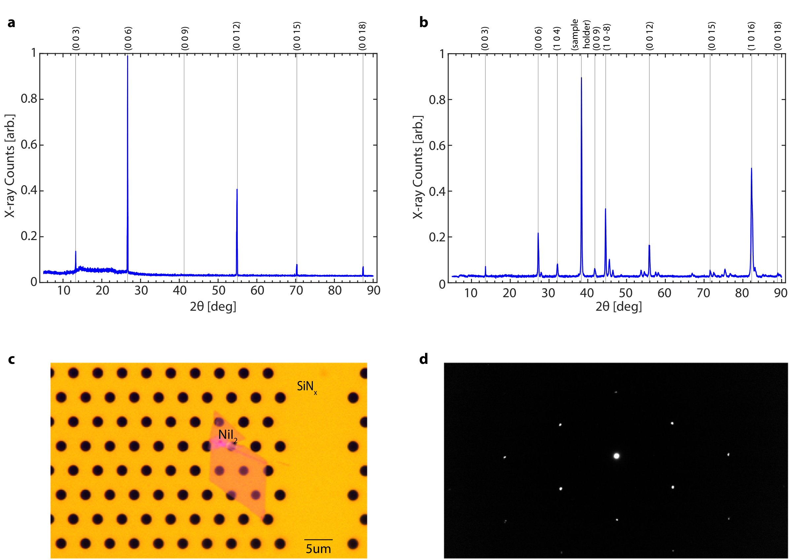
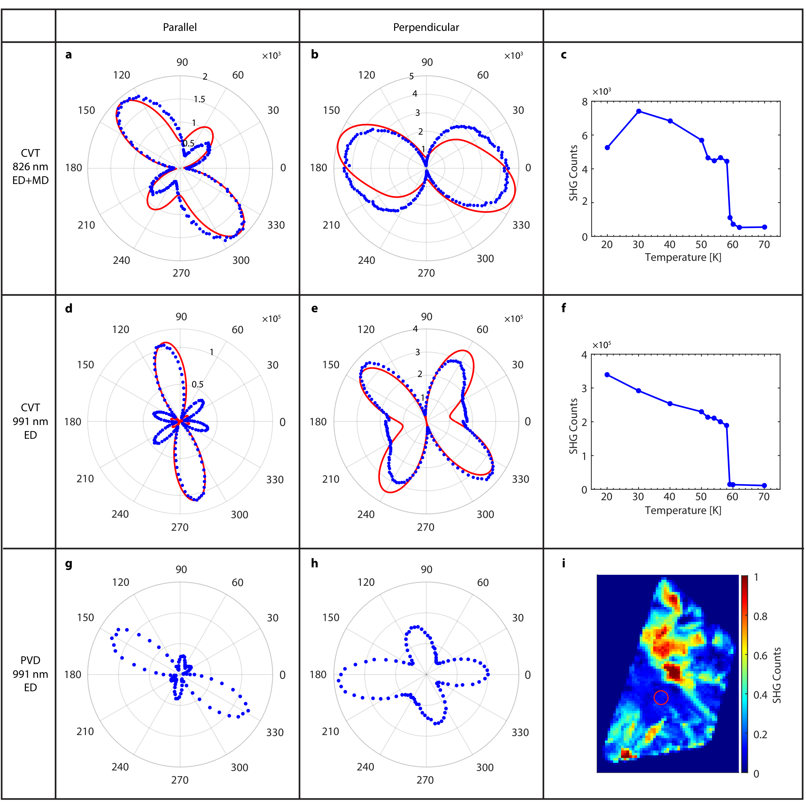
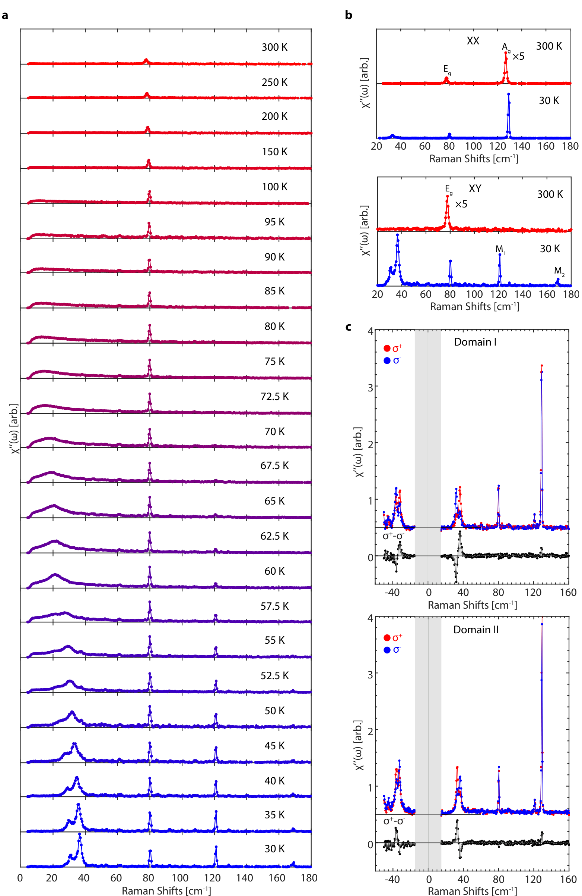
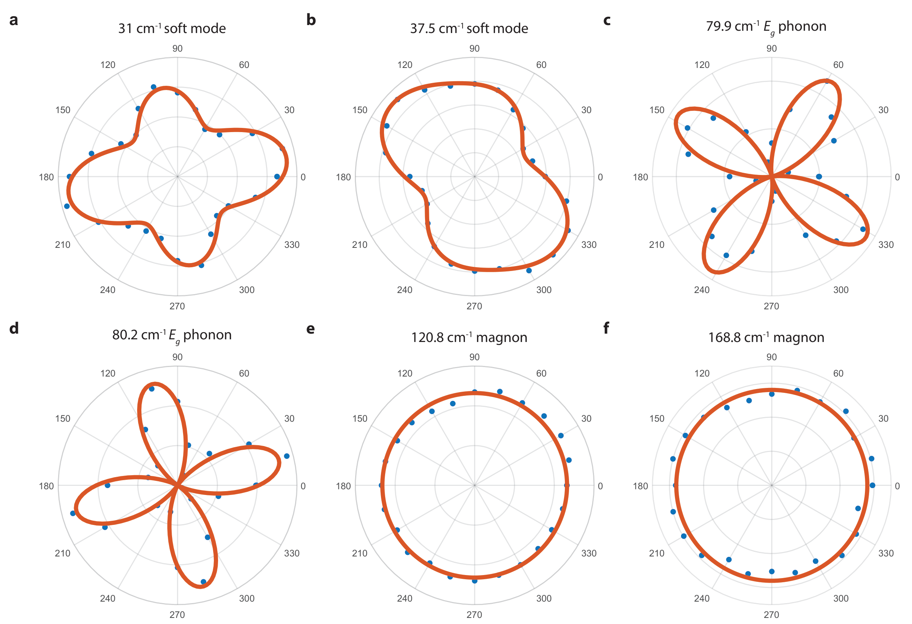
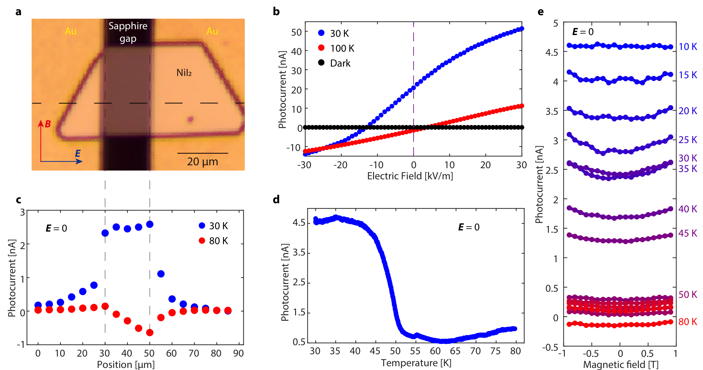
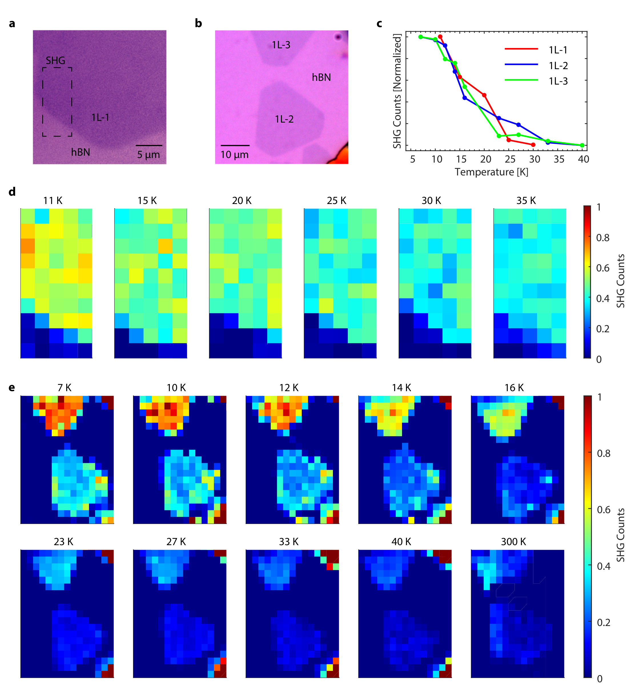
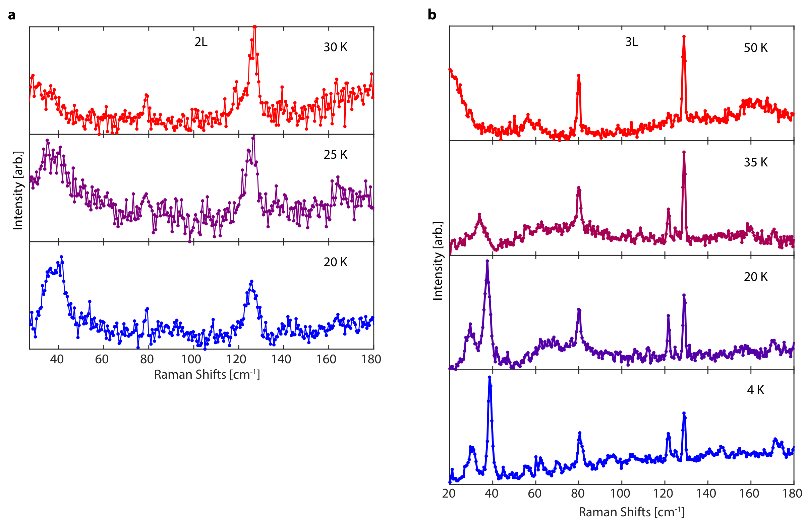

## songEvidenceSinglelayerVan2022 — 单层范德华多铁性的证据

## 📄 元数据
Qian Song, Connor A. Occhialini, Emre Ergeçen, Batyr Ilyas, Danila Amoroso, Paolo Barone, Jesse Kapeghian, Kenji Watanabe, Takashi Taniguchi, Antia S. Botana, Silvia Picozzi, Nuh Gedik, Riccardo Comin，2022，*Nature* 602, 601–605，DOI [10.1038/s41586-021-04337-x](https://doi.org/10.1038/s41586-021-04337-x)
## 💡 一句话
首次在单层 NiI₂ 中通过双折射、SHG 和圆二色拉曼等互补光学手段，并结合 DFT+U 与蒙特卡洛模拟，实验证实了本征第二类多铁性（proper-screw 螺旋磁序诱导沿 a 轴电极化）在二维极限下的存在，单层 T_N ≈ 21 K。
## 🔗 Wiki 双链
  - 概念 [[../concepts/multiferroicity]]
  - 概念 [[../concepts/2d-materials]]
  - 概念 [[../concepts/magnetoelectric-coupling]]
  - 概念 [[../concepts/spin-orbit-coupling]]
  - 概念 [[../concepts/berry-phase]]
  - 概念 [[../concepts/type-ii-multiferroicity|第二类多铁性]]
  - 概念 [[../concepts/electromagnon|电磁振子]]
  - 概念 [[../concepts/raman-optical-activity|拉曼光学活性]]
  - 概念 [[../concepts/second-harmonic-generation|二次谐波产生]]
  - 概念 [[../concepts/birefringence|双折射]]
  - 概念 [[../concepts/magnetic-anisotropy]]
  - 概念 [[../concepts/geometric-frustration|几何阻挫]]
  - 概念 [[../concepts/superexchange|超交换]]
  - 概念 [[../concepts/helical-magnetism|螺旋磁性]]
  - 概念 [[../concepts/improper-electronic-ferroelectricity|非本征电子铁电性]]
  - 概念 [[../concepts/domain-wall]]
  - 概念 [[../concepts/spin-helix]]
  - 概念 [[../concepts/inversion-symmetry-breaking]]
  - 概念 [[../concepts/rotational-symmetry-breaking]]
  - 概念 [[../concepts/skyrmion]]
  - 实体 [[../entities/VASP]]
  - 实体 [[../entities/h-BN]]
  - 实体 [[../entities/NiI2|二碘化镍 NiI₂]]
  - 实体 [[../entities/WIEN2k|WIEN2k]]
  - 图表 [[../figures/crystal-structures]]
  - 图表 [[../figures/optical-spectra]]
  - 图表 [[../figures/vibrational-spectra]]
  - 图表 [[../figures/electronic-devices]]
  - 年度 [[../write/2020-2024|2022]]
  - 项目 [[../projects/project-2-mn-multiferroics]]
  - 项目 [[../projects/project-5-snte-ferroelectric-sim]]
  - 项目 [[../projects/project-7-cdw-charge-density-wave]]
  - 相关论文 [[../../raw/note/songEvidenceSinglelayerVan2022]]

## 🆕 新概念/实体建议
  - [[../concepts/type-ii-multiferroicity|type-ii-multiferroicity]]（第二类多铁性）：由打破反演对称性的磁序（螺旋/摆线）直接诱导铁电极化，磁电内禀强耦合；NiI₂ 为二维首例。
  - [[../concepts/spin-helix|spin-helix]] / [[../concepts/proper-screw|proper-screw]]（正螺旋自旋序）：自旋绕传播轴旋转、自旋旋转平面垂直于 Q 的螺旋磁结构；NiI₂ 中 Q=(0.138,0,1.457) r.l.u.。
  - [[../concepts/electromagnon|electromagnon]]（电磁振子）：磁电耦合体系中磁振子与声子/光耦合的集体激发，具强拉曼光学活性，是动态磁电耦合的谱学指纹。
  - [[../concepts/raman-optical-activity|raman-optical-activity]]（拉曼光学活性, ROA）：手性介质对 σ⁺/σ⁻ 圆偏振光拉曼散射强度差；NiI₂ 中电磁振子峰显示巨大 ROA 并在 Stokes/anti-Stokes 间反转。
  - [[../concepts/second-harmonic-generation|second-harmonic-generation]]（二次谐波, SHG）：电偶极近似下仅在反演对称破缺相中允许，是极性序的"金标准"探针；本文用 λ=991 nm（低于带隙）保证纯 ED-SHG。
  - [[../concepts/birefringence|birefringence]]（双折射/线性二色性）：探测旋转对称性破缺（C₃z→C₂）的高灵敏度光学手段，灵敏度达 10 μrad。
  - [[../concepts/gknb-model|gknb-model]]（广义自旋流/KNB 模型）：P_ij = M·S_i×S_j，由自旋对通过 M 张量诱导电偶极，是自旋螺旋铁电性的微观理论。
  - [[../concepts/four-state-method|four-state-method]]（四态法）：DFT 中通过四组非共线自旋构型计算 Berry 相极化以提取 M 张量的方法。
  - [[../concepts/improper-electronic-ferroelectricity|improper-electronic-ferroelectricity]]（非本征电子铁电性）：在中心对称晶格中由反演破缺磁序驱动产生的极化，NiI₂ 即属此类。
  - 实体 [[../entities/NiI2|NiI2]]（二碘化镍）：过渡金属二卤化物 vdW 磁性半导体，Ni²⁺ (3d⁸, S=1) 三角晶格，块体 T_N,1≈75 K（AFM）、T_N,2≈59.5 K（螺旋磁/多铁），单层 T_c≈21 K；应建实体条目。
  - 实体 [[../entities/WIEN2k|WIEN2k]]：全电子全势 APW+lo 代码，本文与 VASP 交叉验证 DFT 结果。
  - [[../concepts/helical-magnetism|helical-magnetism]]（螺旋磁性）、[[../concepts/geometric-frustration|geometric-frustration]]（几何阻挫）、[[../concepts/superexchange|superexchange]]（超交换）、[[../concepts/skyrmion]]（斯格明子）亦可考虑作为独立概念条目。
## 📊 关键图表
  - 图1 — CVT/PVD NiI₂ 晶体的 X 射线衍射（沿 c 轴）、粉末衍射、7 nm PVD 薄片光学图及 TEM 电子衍射，确认晶体结构与质量。
  - **图示描述**：组合展示 CVT 生长块材沿 c 轴的 (0 0 l) X 射线衍射峰、PVD 薄片的粉末衍射谱、7 nm 薄片的光学显微照片以及 TEM 选区电子衍射图样；横轴 2θ 单位为度，强度为任意单位。
  - **关键特征**：尖锐的 (0 0 l) 系列衍射峰证明 CVT 单晶沿 c 轴高度取向、结晶质量高；PVD 薄片衍射与块材相吻合，说明少层样品仍保持菱面体 R-3m 结构；TEM 电子衍射斑点锐利、无杂相，确认少层薄片为高质量单晶。
  - **结论/意义**：为后续所有光学测量的样品质量与结构一致性提供基础，排除了厚度变薄导致结构相分离的可能。
   -> [[../figures/crystal-structures-xrd-phases|XRD与相变]]
  - 图2 — 块体 NiI₂ 中 Domain I–III 的偏振显微图、双折射诱导偏振旋转 θ(T) 与线性二色性 ΔR(T) 对比、三畴角分辨 ΔR(θ)，显示局域 C₂ 轴。
  - **图示描述**：三个子图分别为块材偏振显微照片（标注 Domain I–III）、Domain I 上双折射诱导偏振旋转角 θ(T)（上，单位 mrad）与线性二色性 ΔR(T)（下，单位 %）随温度（K）的对比、以及三个畴各自的角分辨 ΔR(θ) 极坐标曲线。
  - **关键特征**：θ(T) 与 ΔR(T) 在 T_N,1 ≈ 75 K 与 T_N,2 ≈ 59.5 K 两处出现协同突变，与磁化率 χmag 行为同步，说明旋转对称破缺由磁序驱动；三个畴的 ΔR(θ) 均呈二重（C₂）花瓣形，且 C₂ 轴方向彼此相差约 60°/120°，对应三种结构等价畴。
  - **结论/意义**：在块材中确立 C₃z→C₂ 旋转对称破缺的光学指纹，并为单层测量建立定标参考。
   -> [[../figures/domain-walls-structures|畴结构与畴壁]]
  - 图3 — 波长依赖 RA-SHG：826 nm 需 ED+MD 共同拟合，991 nm 仅 ED 分量，确立 991 nm 为纯电偶极 SHG 探测波长；PVD 样品与 CVT 一致。
  - **图示描述**：a–c 为 826 nm 激发下单畴 CVT 块材的旋转各向异性 SHG（RA-SHG）极坐标图、非线性张量元拟合及其温度依赖；d–f 为同一测量在 991 nm 激发下的对应结果。横轴为样品方位角（度），纵轴为 SHG 计数（任意单位）。
  - **关键特征**：826 nm 的 RA-SHG 图案必须用 ED（电偶极）+ MD（磁偶极）张量共同才能拟合，说明该波长靠近共振、存在磁致 SHG 污染；991 nm（低于光学带隙和 d-d 跃迁）的图案仅由 ED 张量即可完美拟合，温度依赖与 C₂ 单斜点群一致；PVD 薄片给出与 CVT 块材相同的 991 nm RA-SHG 图案，证明两种生长方式对称性一致。
  - **结论/意义**：选定 991 nm 作为后续单层 SHG 成像的纯 ED 探针波长，确保观测到的 SHG 只反映反演对称破缺。
   -> [[../figures/optical-spectra|光学光谱]]
  - 图4 — 块体 NiI₂ 30–300 K 变温 XY 偏振拉曼、XX/XY 通道对比，以及 30 K 下 Domain I/II 的 σ⁺/σ⁻ 圆偏振拉曼与净 ROA。
  - **图示描述**：a 为 XY 交叉偏振通道 30 K 到 300 K 的 waterfall 变温拉曼谱（横轴 Raman shift，单位 cm⁻¹）；中段为 XX 与 XY 通道的对比；底部为 30 K 时 Domain I 与 Domain II 上 σ⁺、σ⁻ 入射的圆偏振拉曼谱及其差值 σ⁺−σ⁻（净 ROA）。
  - **关键特征**：T_N,1 以上仅观察到 80.2 cm⁻¹ 的 E_g 声子；T_N,1 以下出现 120.8、168.8 cm⁻¹ 单磁振子峰；T_N,2 以下低频准弹性信号（QES）硬化为 31、37 cm⁻¹ 的尖锐电磁振子模；31、37 cm⁻¹ 模在 σ⁺ 与 σ⁻ 下强度显著不对称，净 ROA 幅值大，并在 Domain I 与 Domain II 间符号相反；其余声子/磁振子峰无 ROA。
  - **结论/意义**：将电磁振子的巨大 ROA 确立为磁手性基态和动态磁电耦合的谱学指纹，且 ROA 符号可区分畴手性。
   -> [[../figures/vibrational-spectra|振动光谱]]
  - 图5 — XY 构型角分辨偏振拉曼（ARPRS）：31、37 cm⁻¹ 模式极坐标图符合电磁振子；80 cm⁻¹ 峰在 T_N,2 以下分裂为 79.9/80.2 cm⁻¹ 两声子；120.8/168.8 cm⁻¹ 为磁振子。
  - **图示描述**：多子图极坐标曲线，分别给出多铁相中 31 cm⁻¹、37 cm⁻¹ 模式在 XY 构型下随样品转角的强度分布，并与纯声子/纯磁振子对称性预期对比；同时展示 80 cm⁻¹ 附近峰的高分辨线形以及 120.8、168.8 cm⁻¹ 磁振子模的温度依赖。
  - **关键特征**：31、37 cm⁻¹ 模的极坐标图既不符合纯声子的拉曼张量也不符合纯磁振子，必须用磁振子-声子混合（电磁振子）张量拟合；80.2 cm⁻¹ E_g 声子在 T_N,2 以下分裂为 79.9 与 80.2 cm⁻¹ 两支，反映单斜畸变使简并解除；120.8、168.8 cm⁻¹ 模仅在 T_N,1 以下出现，其温度依赖与磁有序参量一致。
  - **结论/意义**：从对称性角度把低频模锁定为电磁振子，为图4中观测到的 ROA 提供群论支撑。
   -> [[../figures/vibrational-spectra|振动光谱]]
  - 图6 — 块体 NiI₂ 体光伏效应（BPE）器件：PVD 薄片桥接蓝宝石间隙上的 Au 电极；30 K 多铁相零偏光电流显著增强，外加 1 T 磁场使光电流增加 10–15%（磁电耦合证据）。
  - **图示描述**：a 为 BPE 器件光学照片（PVD NiI₂ 薄片跨过蓝宝石衬底上刻蚀的间隙，两端制备 Au 电极，比例尺 μm 级）；后续子图给出零偏光电流随温度的演化，以及在多铁相中施加面内 ~1 T 磁场时光电流的相对变化。
  - **关键特征**：零偏光电流在进入 T_N,2 以下的多铁相时显著增强，与极化出现温度一致，属体光伏效应而非结光伏；在 30 K 多铁相施加 1 T 面内磁场（方向垂直于电场、近 a 轴）使光电流进一步增加约 10–15%；高温顺磁/AFM 相中磁场对光电流无可观测影响。
  - **结论/意义**：把磁场对极化相关光电流的调制作为静态磁电耦合的直接电学证据，与光谱学证据互补。
   -> [[../figures/electronic-devices-memory-transistors|存储器与晶体管]]
  - 图7 — 块体、1 层、2 层 NiI₂ 的交叉偏振图像及温度依赖偏振对比度直方图；单层畴织构约 20 K 消失、2 层约 35 K 消失，与偏振旋转测量一致。
  - **图示描述**：交叉偏振构型下拍摄的块材、1 层（1L）、2 层（2L）NiI₂ 薄片在不同温度下的反射显微图像，右侧给出各厚度区域偏振对比度（亮暗差值）随温度的统计直方图。
  - **关键特征**：低温下各厚度区域均出现由双折射畴产生的明暗衬度；升温时 1L 区域畴衬度在约 15–25 K 区间消失、2L 区域在约 25–35 K 消失，块材在 ~60 K 附近消失；直方图中对比度峰随温度升高而塌缩，与偏振旋转 θ(T) 给出的 T_c 定量一致。
  - **结论/意义**：以成像方式直观证明双折射/旋转对称破缺在单层中依然存在，并把 T_c 的层数依赖可视化。
   -> [[../figures/domain-walls-structures|畴结构与畴壁]]
  - 图8 — 单层 NiI₂ 晶体温度依赖 SHG 成像（780 nm 与 991 nm 激发）；三个单层晶体积分 SHG 计数在约 20 K 出现转变，与偏振旋转结果一致；存在温度无关的 NiI₂/hBN 界面残余 SHG。
  - **图示描述**：a–b 为三个独立单层 NiI₂ 晶体在 780 nm 和 991 nm 激发下的变温 SHG 空间成像；c 为三个单层晶体积分 SHG 计数随温度（K）的演化曲线（归一化）。
  - **关键特征**：991 nm 激发的 ED-SHG 信号在约 20 K 以下显著增强，转变温度与图2d 偏振旋转给出的 T_c ≈ 21 K 吻合；780 nm 通道因波长接近共振而叠加了与温度无关的 NiI₂/hBN 界面或衬底残余 SHG 背景；扣除背景后，三个不同单层晶体均给出相同的转变温度，表明这是单层 NiI₂ 本征行为而非样品差异。
  - **结论/意义**：在单层极限下提供反演对称破缺/极性序的直接成像证据，是论文判定单层 type-II 多铁性的关键一环。
   -> [[../figures/optical-spectra|光学光谱]]
  - 图9 — 2 层、3 层 NiI₂ XY 构型变温拉曼；约 38 cm⁻¹ 软模分别在 25 K、35 K 以下建立，与偏振旋转和 SHG 所得转变温度一致。
  - **图示描述**：a、b 分别为 2 层和 3 层 NiI₂ 在 XY 交叉偏振构型下从高温到低温的 waterfall 变温拉曼谱，横轴 Raman shift（cm⁻¹），重点关注低频区。
  - **关键特征**：低温下在约 38 cm⁻¹ 处出现与块材电磁振子对应的软模；该模在 2 层样品中于 25 K 以下、在 3 层样品中于 35 K 以下建立，强度随降温快速增大；这些软模出现温度与双折射 θ(T) 与 SHG 给出的 T_c（2L ≈ 30 K、3L ≈ 39 K）在同一区间。
  - **结论/意义**：把电磁振子这一动态磁电耦合指纹推广到少层，并独立验证 T_c 的层数依赖。
   -> [[../figures/vibrational-spectra|振动光谱]]
  - 图10 — 1–4 层 NiI₂ 宽场光学图、对应 AFM 图，以及不同畴区的温度依赖偏振旋转测量，补充层数依赖的 T_c 数据。
  - **图示描述**：少层 NiI₂ 薄片的宽场光学照片、对应的 AFM 形貌/高度图（单层台阶约 0.62–0.65 nm，用于层数标定），以及在 1L–4L 区域不同畴上分别测得的 θ(T) 曲线。
  - **关键特征**：AFM 高度与光学对比度共同可靠地区分 1L–4L；各层数上多个畴的 θ(T) 给出可重复的 T_c：1L ≈ 21 K、2L ≈ 30 K、3L ≈ 39 K、4L ≈ 41 K，随层数单调上升并向块材 59.5 K 趋近；不同畴仅在 θ 幅值与方向上有差别，转变温度一致。
  - **结论/意义**：为图3b 中 T_c-层数关系提供完整实验数据集，支撑层间交换 J⊥ 主导 T_c 演化的理论分析。
   -> [[../figures/experimental-setups|实验装置与测量系统]]
## 🔬 项目连接
  - **project-2 Mn多铁 — core（核心）**：本文是二维第二类多铁性的里程碑实验，直接命中项目核心议题。可复用内容包括：(1) type-II 多铁性的微观判据——反演破缺磁序（proper-screw 螺旋 Q=(0.138,0,1.457)）通过自旋流/逆 DM 机制诱导沿 a 轴极化；(2) 多铁序的多模态光学指纹学——双折射（C₃→C₂ 旋转对称破缺）+ ED-SHG（反演破缺，λ=991 nm 避开 MD 贡献）+ 圆二色拉曼 ROA（磁手性/电磁振子）三者构成完整证据链，对 Mn 基多铁的表征方案有直接借鉴价值；(3) gKNB 模型 P_ij=M·S_i×S_j 与四态法/Berry 相计算 M 张量的完整流程（VASP+WIEN2k 交叉验证，PBE+U，U=1.8 eV、J=0.8 eV，Ni-3d）；(4) 层间交换 J⊥≈0.45 J‖≈3 meV 对 T_c 的层数依赖调控，MC 海森堡模型加各向异性项的经验公式 T_c(N)=T_c^{1-layer}·tanh(b ln N + …)；(5) 极化方向由螺旋手性 τ=±1 唯一决定，磁电耦合在 BPE 中表现为磁场使零偏光电流增加 10–15%。
  - **project-5 SnTe铁电模拟 — weak（方法学类比）**：材料体系与机制不同（SnTe 为岩盐结构本征铁电，NiI₂ 为磁致非本征电子铁电），但本文的 Berry 相极化计算、四态法提取 M 张量、PBE+U 流程、VASP 与 WIEN2k 交叉验证、以及"对称性破缺→极性点群→电极化方向"的分析范式，对 SnTe 铁电模拟的极化计算与对称性分析有方法学参考价值；SHG 作为反演破缺探针的思路亦可类比。
  - **project-7 CDW — weak（维度/层状物理类比）**：NiI₂ 是层状过渡金属二卤化物（非 TMD 硫族化物，而是卤化物），与 CDW 项目共享"层状 vdW 晶体、维度依赖相变、层间交换 J⊥ 调控 T_c、三角晶格几何阻挫"等物理语言；但本文无 CDW 内容，仅在层间耦合定量分析（J⊥≈0.45 J‖）和层数依赖相变色谱方面提供可类比的实验/理论框架。
  - project-1 双光子、project-3 机械发光NN、project-4 TTF分子计算、project-6 湿度传感器：无直接项目连接。
## 🔗 项目双链
- 项目 [[../projects/project-2-mn-multiferroics|项目二：Mn极化结构铁电材料]]
- 项目 [[../projects/project-5-snte-ferroelectric-sim|项目五：lammps势函数SnTe铁电模拟]]
- 项目 [[../projects/project-7-cdw-charge-density-wave|项目七：CDW电荷密度波]]

## 📝 组织与用词
文章采用"块体定标 → 少层/单层验证 → 理论解释 → 展望"的总分总结构。论证以三种互补光学探针分别锁定三种对称性破缺（旋转对称破缺=双折射/ΔR；反演对称破缺=ED-SHG；手性/磁电耦合=ROA/电磁振子），再以 DFT+MC 闭环解释层数依赖，证据链严密。值得复用的术语：type-II multiferroic（第二类多铁体）、proper-screw spin helix（正螺旋自旋序）、electromagnon（电磁振子）、Raman optical activity / ROA（拉曼光学活性）、electric-dipole SHG / ED-SHG（电偶极二次谐波）、magneto-chiral ground state（磁手性基态）、generalized spin-current / gKNB model（广义自旋流模型）、improper electronic ferroelectricity（非本征电子铁电性）、interlayer exchange J⊥（层间交换）、birefringence-induced polarization rotation（双折射诱导偏振旋转）。
## ✏️ 可写入 Wiki 的要点
  1. NiI₂ 室温为菱面体 R3̄m 结构，Ni²⁺ (3d⁸, S=1) 形成三角晶格；块体 T_N,1≈75 K 进入 AFM 相，T_N,2≈59.5 K 进入 proper-screw 螺旋磁相，Q=(0.138, 0, 1.457) r.l.u.，对称性由菱面体降为单斜，出现面内电极化（垂直于 Q）。
  2. 单层 NiI₂ 多铁转变温度 T_c≈21 K（双折射 dθ/dT 极小值定义），2 层 30 K、3 层 39 K、4 层 41 K，单调趋于块体 59.5 K；这是首次在单层 vdW 材料中实验证实本征 type-II [[../concepts/multiferroicity|多铁性]]。
  3. 转变温度层数依赖由[[../entities/CrI3|层间反铁磁]]交换 J⊥ 主导：MC 拟合给出 J⊥≈0.45 J‖（J‖≈7 meV），即 J⊥≈3.15 meV，与 DFT（VASP 3.1 meV / WIEN2k 2.8 meV）高度吻合；经验公式 T_c(N)=T_c^{1-layer}·tanh(b ln N + ½ ln(t+1)/(t−1))，t=T_N,2/T_c^{1-layer}≈2.8，b=1.05，无拟合参数。
  4. 单层中[[../concepts/magnetic-anisotropy]]保证有限温度长程磁序（规避 Mermin–Wagner），三角晶格层内交换阻挫 + 碘 5p 介导的[[../concepts/superexchange|超交换]]与 SOC 共同稳定 proper-screw 螺旋；MC [[../concepts/migdal-eliashberg-theory|各向异性]]项被 rescale 至从头算值的 60% 以偏向螺旋解。
  5. gKNB 模型 P_ij=M·S_i×S_j：DFT+U+SOC 四态法算得单层 M 张量（单位 10⁻⁵ eÅ）为 [[20,0,32],[0,348,−520],[0,25,0]]，主导分量 M_yy=348、M_yz=−520；沿 a 轴传播螺旋预测 P‖=3M_22 sin(τδ)/2；无论螺旋沿 a 轴还是沿体相 Q 倾斜（自旋平面与基面成 θ=55°），极化始终沿 a 轴，手性 τ=±1 决定极化方向；MC 得单层 T_c≈27 K、|P|~10⁻⁵ eÅ 量级，与实验 21 K 定性一致，[[../concepts/magnetic-point-group|磁点群]]为极性 21′。
  6. ED-SHG 选 λ=991 nm（低于[[../concepts/optical-band-gap|光学带隙]]和 d-d 跃迁）以排除磁偶极 SHG；826/780 nm 附近存在 MD-SHG。RA-SHG 图案与 C₂ 单斜点群 ED-SHG 张量元吻合；单层存在温度无关的 NiI₂/hBN 界面残余 SHG。
  7. 拉曼：T_N,1 以上仅 80.2 cm⁻¹ E_g 声子；磁有序相出现 120.8、168.8 cm⁻¹ 单磁振子模；T_N,2 以下 QES 硬化为 31、37 cm⁻¹ 尖锐[[../concepts/electromagnon|电磁振子]]模，显示巨大 ROA（其他声子/磁振子无 ROA），Stokes/anti-Stokes 间 ROA 反转；80 cm⁻¹ 峰分裂为 79.9/80.2 cm⁻¹ 两声子。
  8. 电磁振子的大 ROA 是磁手性基态和动态[[../concepts/magnetoelectric-coupling|磁电耦合]]的直接谱学指纹；BPE 测量中多铁相零偏光电流显著增强，1 T 面内磁场（垂直电场/沿 a 轴附近）使光电流增加 10–15%，归因于磁电耦合导致极化增大。
  9. NiI₂ 被归类为 improper electronic ferroelectricity（非本征电子铁电体）范例：极化由反演破缺磁序在原中心对称晶格中驱动，而非结构铁电畸变；这区别于第一类多铁体。
  10. 配体工程（NiBr₂ 层间 AFM 耦合仅 ~1.2 meV vs NiI₂ ~3 meV，表明 I-5p 扩展轨道介导层间交换的关键作用）被提出为调控二维磁基态（螺旋、摆线、[[../concepts/skyrmion|斯格明子]]）的旋钮；未来方向包括 PFM/热释电电流直接测极化、栅压静电调控多铁量子临界、[[../concepts/vdW-heterostructure]]界面多铁性。
