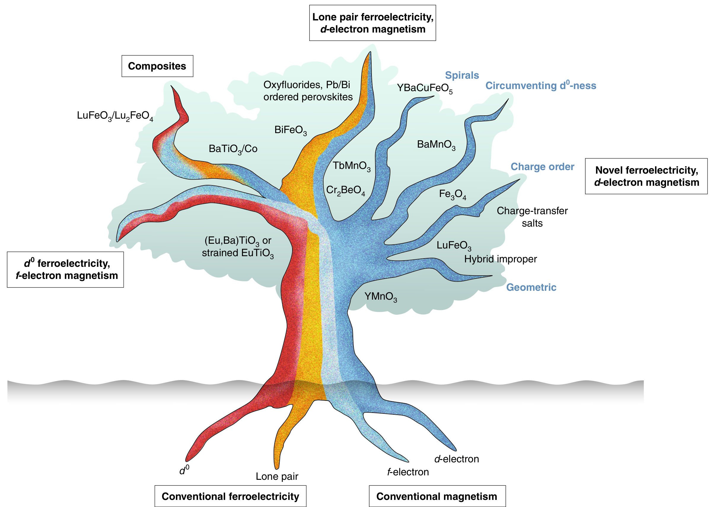
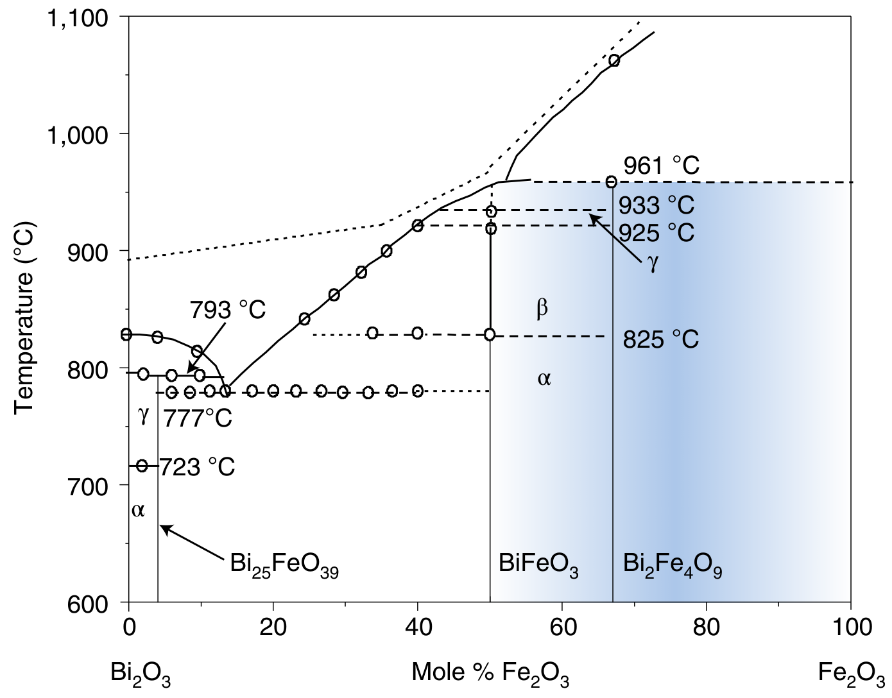
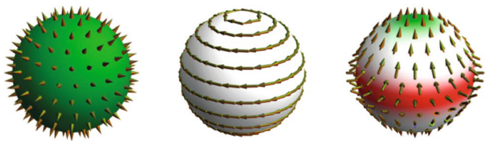
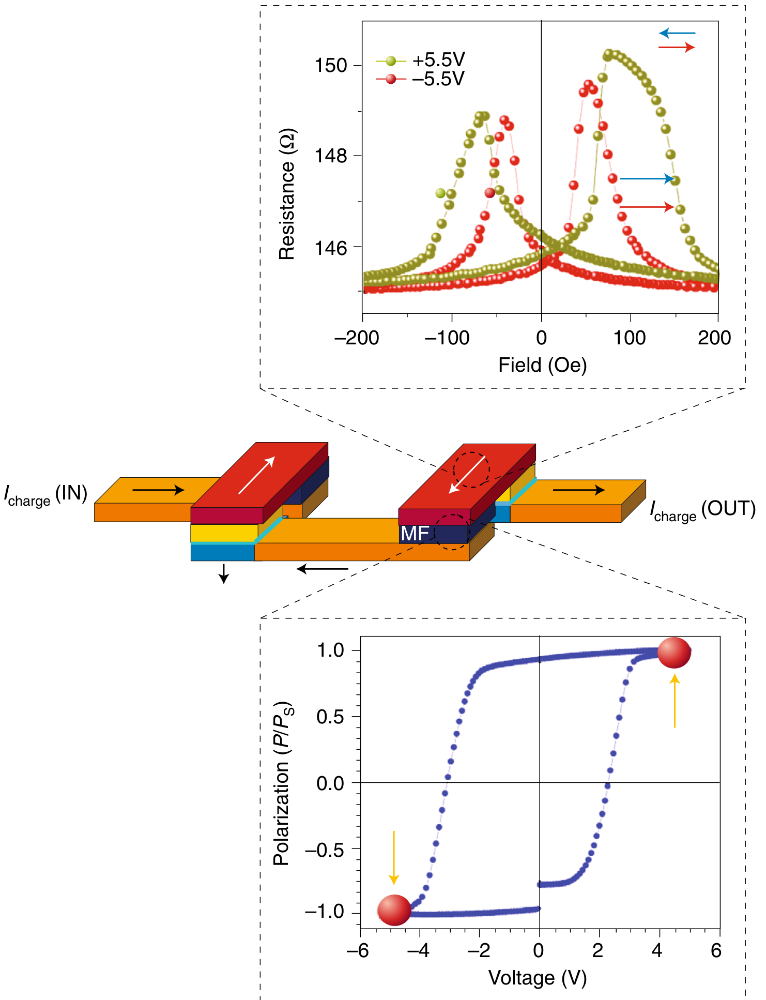

## spaldinAdvancesMagnetoelectricMultiferroics2019 — 磁电多铁性材料研究进展（Advances in magnetoelectric multiferroics）

## 📄 元数据
N. A. Spaldin & R. Ramesh et al.，2019，Nature Materials，vol. 18, pp. 203–212，DOI: 10.1038/s41563-018-0275-2

## 💡 一句话
这是多铁性领域奠基人的前瞻性综述，以"多铁性家族树"框架系统梳理了实现磁电耦合的材料机制、BiFeO3旗舰体系、畴壁新物理、表征/理论方法及MESO超低功耗逻辑器件路线，并凝练出"十大科学与技术挑战"。

## 🔗 Wiki 双链
  - 概念 [[../concepts/multiferroicity]]
  - 概念 [[../concepts/magnetoelectric-coupling]]
  - 概念 [[../concepts/strain-engineering]]
  - 概念 [[../concepts/density-functional-theory]]
  - 概念 [[../concepts/spin-orbit-coupling]]
  - 概念 [[../concepts/topological-defects]]
  - 概念 [[../concepts/ferroelasticity]]
  - 概念 [[../concepts/berry-phase]]
  - 概念 [[../concepts/domain-wall]]
  - 实体 [[../entities/BiFeO3]]
  - 实体 [[../entities/HoMnO3]]
  - 实体 [[../entities/SrMnO3]]
  - 实体 [[../entities/BaTiO3]]
  - 实体 [[../entities/FeRh]]
  - 实体 [[../entities/Cr2O3]]
  - 实体 [[../entities/EuTiO3]]
  - 实体 [[../entities/YBaCuFeO5]]
  - 实体 [[../entities/BiCoO3]]
  - 实体 [[../entities/PMN-PT]]
  - 实体 [[../entities/CoFe2O4]]
  - 图表 [[../figures/domain-walls-structures|畴结构与畴壁]]
  - 图表 [[../figures/crystal-structures]]
  - 图表 [[../figures/electronic-bands]]
  - 年度 [[../write/2015-2019]]
  - 项目 [[../projects/project-2-mn-multiferroics]]
  - 相关论文 [[../../raw/note/spaldinAdvancesMagnetoelectricMultiferroics2019]]

## 🆕 新概念/实体建议
  - [[../concepts/magnetoelectric-multipoles|magnetoelectric-multipoles]]（磁电多极子）：包括磁电单极子、环形矩（toroidal moment）和四极子，分别对应磁电张量的各向同性对角、反对称非对角和无迹分量，是同时打破空间反演与时间反演对称性相变的更本质序参量。
  - [[../concepts/second-principles-calculations|second-principles-calculations]]（第二性原理计算）：从DFT拟合关键参数构建有效哈密顿量，可模拟数千至数百万原子、纳秒尺度动力学（畴壁、异质结、极化翻转），是连接微观物理与宏观器件的核心多尺度方法。
  - [[../entities/meso-logic-device|meso-logic-device]]（磁电自旋轨道耦合逻辑器件）：Intel提出的非易失逻辑架构，结合多铁电场控磁与逆Rashba-Edelstein自旋-电荷转换，目标 1 aJ/bit 能耗。
  - [[../concepts/multiferroic-family-tree|multiferroic-family-tree]]（多铁性家族树）：按物理机制（d0铁电、孤对电子、d/f电子磁性四根）组合分类多铁材料的经典框架，直观标示未探索分支。
  - [[../concepts/lone-pair-ferroelectricity|lone-pair-ferroelectricity]]（孤对电子铁电性）：Bi³⁺ 6s²、Pb²⁺等立体化学活性孤对电子驱动偏心位移产生铁电，是BiFeO3大极化的根源。
  - [[../concepts/improper-ferroelectricity|improper-ferroelectricity]]（非本征/杂化非本征铁电性）：铁电极化由非极性畸变（如氧八面体旋转、电荷有序、磁序）作为副产物产生，包括几何铁电性、电荷有序铁电性、自旋螺旋诱导铁电性。
  - [[../concepts/spin-spiral-multiferroics|spin-spiral-multiferroics]]（自旋螺旋多铁性）：非共线磁结构（如螺旋磁序）通过自旋-轨道耦合打破反演对称性诱导极化；化学无序可将有序温度提升至室温附近（YBaCuFeO5）。
  - [[../concepts/exchange-bias|exchange-bias]]（交换偏置）：铁磁/反铁磁界面交换耦合导致磁滞回线偏移，是BFO/CoFe体系电场控磁180°翻转的核心机制。
  - [[../concepts/inverse-rashba-edelstein-effect|inverse-rashba-edelstein-effect]]（逆Rashba-Edelstein效应）：界面自旋-电荷转换效应，MESO器件读出端的物理基础。
  - [[../concepts/dynamical-multiferroicity|dynamical-multiferroicity]]（动态多铁性）：随时间变化的极化以与自旋螺旋诱导极化对偶的方式诱导磁性，是太赫兹动力学研究的新方向。
  - 实体 [[../entities/FeRh|FeRh]]：铁磁-反铁磁相变伴随体积坍塌和~25%电阻变化，PMN-PT应变异质结中实现电场驱动磁态转变。
  - 实体 [[../entities/Cr2O3|Cr2O3]]：经典磁电体，电场可控反铁磁畴取向，可调控铁磁覆盖层交换偏置。
  - 实体 [[../entities/EuTiO3|EuTiO3]]：d0铁电性（BaTiO3原型）+ f电子磁性（Eu²⁺ f⁷）分支代表，应变下多铁。
  - 实体 [[../entities/YBaCuFeO5|YBaCuFeO5]]：层状钙钛矿，化学无序稳定磁螺旋，多铁有序温度接近室温。
  - 实体 [[../entities/BiCoO3|BiCoO3]]：极性、高奈尔温度470 K，但c/a比过大导致极化尚不可翻转。
  - 实体 [[../entities/PMN-PT|PMN-PT]]（Pb(Mg1/3Nb2/3)O3–PbTiO3）：压电衬底，用于电场-应变驱动FeRh磁相变。
  - 实体 [[../entities/CoFe2O4|CoFe2O4]] / [[../entities/BaTiO3|BaTiO3]]：垂直排列纳米复合多铁的经典磁性尖晶石/铁电钙钛矿组合。

## 📊 关键图表
  -  -> [[../figures/domain-walls-switching-properties|极化翻转与铁电性能]]
    - **图示描述**：以树状分类图呈现，四个根系分别为铁电性的 d0 机制（如 BaTiO₃ 中 Ti⁴⁺）和孤对电子立体化学活性（如 BiFeO₃ 中 Bi³⁺ 6s²），以及磁性的局域 f 电子（稀土）与部分填充 d 电子（过渡金属）；根系组合后形成复合、单相及新型铁电性等多条树枝。
    - **关键特征**：①按物理机制而非化学成分分类，直观揭示"组合即创新"的设计理念；②"孤对+d 电子"分支对应旗舰体系 BiFeO₃；③"d0+f 电子"分支对应 (Eu,Ba)TiO₃、应变 EuTiO₃；④"新型铁电性+d 电子"分支包含几何（YMnO₃）、电荷有序（Fe₃O₄）、自旋螺旋（TbMnO₃、YBaCuFeO₅）和规避 d0（应变 SrMnO₃）等途径；⑤"新型铁电性+f 电子磁性"等空白枝被明确标出，提示新材料搜索方向。
    - **结论/意义**：这是全文的逻辑骨架，为多铁材料的机制地图和后续研究方向提供经典教学框架。
  -  -> [[../figures/heterostructures-stacking|异质结与堆叠]]
    - **图示描述**：三个子图分别展示三类复合多铁结构的原子/显微示意图：(a) LuFeO₃/LuFe₂O₄ 水平原子级超晶格的逐层堆垛；(b) CoFe₂O₄ 磁性纳米柱垂直外延嵌入 BaTiO₃ 铁电基体的三维阵列；(c) LaAlO₃ 衬底上 BFO 薄膜受应变形成四方相 T 与菱方相 R 共存的纳米混合相。
    - **关键特征**：①水平超晶格提供巨大的化学/结构组合空间，并已在 SrTiO₃/PbTiO₃ 超晶格中观察到电场可控手性极化涡旋；②垂直纳米复合的三维异质外延增强磁电耦合和矫顽场，但仍存在<20 nm 纳米柱合成、位错/反相边界磁无序及单向交换偏置等开放问题；③BFO 的 T/R 相界处出现磁性增强的 R' 相，将相界本身变成功能界面。
    - **结论/意义**：说明通过"纳米建筑师"式的结构工程可在已知单相材料之外构造出耦合更强、性能可调的多铁体系。
  -  -> [[../figures/crystal-structures-xrd-phases|XRD与相变]]
    - **图示描述**：以温度为纵轴、Bi₂O₃–Fe₂O₃ 摩尔组成为横轴的二元相图，标出 BiFeO₃ 以及 Bi₂₅FeO₃₉、Bi₂Fe₄O₉ 等已知相，并用阴影区标示作者预测可能存在新多铁相的成分窗口。
    - **关键特征**：①BFO 并非该化学空间的唯一产物，周围还有多个亚稳化合物；②阴影区涵盖偏离化学计量比的"富 Bi/贫 Bi"区间；③作者建议利用薄膜沉积等非平衡生长手段"冻结"出体相图中不存在的亚稳新相。
    - **结论/意义**：把新材料搜索从单一化学计量点扩展到整个相空间，为高通量实验和原子级逐层生长提供了"藏宝图"。
  -  -> [[../figures/domain-walls-structures|畴结构与畴壁]]
    - **图示描述**：(a) BFO 中 109°铁电畴壁的原子分辨率电镜照片；(b) 同一畴壁的导电原子力显微镜电流图，显示畴壁处电流显著增强；(c) 畴壁的电流-电压曲线呈现滞回；(d,e) ErMnO₃ 中头对头/尾对尾带电畴壁的导电性随极性变化。
    - **关键特征**：①BFO 109°畴壁宽度仅约 1–3 nm，接近原子级尺度；②畴壁电导率远高于绝缘母体，可作为天然纳米导线，并可被电场写入、擦除、移动；③I-V 滞回表现出典型忆阻特征，可用于神经形态计算；④ErMnO₃ 中尾对尾带电畴壁因极化不连续导致电荷积累而电导增强；⑤低温（约 50 K 以下）畴壁电导增大并出现大磁电阻，暗示可能的金属性输运。
    - **结论/意义**：将畴壁从"缺陷"重新定义为拥有独立导电、忆阻、磁、光伏等功能的二维新物态，奠定"畴壁纳米电子学"概念。
  -  -> [[../figures/electronic-bands-cdw-transport|CDW与输运性质]]
    - **图示描述**：用磁化密度矢量分布示意三种磁电多极子——单极子（各向同性"源/汇"型）、环形矩（toroidal moment，环形电流或自旋涡旋型）和四极子（更高级、无迹的各向异性分布），分别对应磁电张量的各向同性对角、反对称非对角和无迹对称分量。
    - **关键特征**：①三者都要求同时打破空间反演和时间反演对称性；②它们比传统电极化/磁化更本质地刻画磁电耦合响应；③为计算和分类复杂多铁体系（如含涡旋、拓扑磁结构）的序参量提供统一语言。
    - **结论/意义**：代表多铁理论从传统铁电/铁磁序参量向更高阶多极序参量的范式升级，是新理论工具开发的方向。
  -  -> [[../figures/electronic-devices-memory-transistors|存储器与晶体管]]
    - **图示描述**：MESO（magnetoelectric spin–orbit）逻辑器件三维结构示意图，输入端为多铁层（MF）在 Vdd 下用电场翻转极化并经交换耦合写入铁磁层磁化，输出端通过逆 Rashba–Edelstein/逆自旋霍尔效应层把磁态转换成电荷电流 Icharge OUT；下方配 P-V 电滞回线和 R-H 磁阻回线说明开关行为。
    - **关键特征**：①写入路径为电荷→自旋，读出路径为自旋→电荷，形成完整非易失逻辑级联；②目标开关电压 < 100 mV、多铁层极化约 5 μC/cm²、10×10 nm² 尺寸下单 bit 能耗约 1 aJ，比自旋转移矩（STT，约 10 fJ/bit）低约四个数量级；③当前瓶颈是多铁开关电压仍在伏特级、IREE 读出电压仅数百 μV，需 2–3 个数量级提升。
    - **结论/意义**：把多铁物理与自旋电子学对接为具体器件蓝图，直接导出领域"将开关电压降至 100 mV、设计小而稳定极化"的核心技术挑战。

## 🔬 项目连接
project-2 Mn多铁（本文系统讨论了SrMnO3应变诱导铁电性、Mn基钙钛矿PbMnO3等候选体系，以及含Mn的双钙钛矿铁磁有序设计，与Mn多铁项目直接相关）；其余项目无直接连接。

## 🔗 项目双链

## 📝 组织与用词
  - 文章采用"总-分-总"结构，沿"基础科学（新材料与机制→BiFeO3旗舰→畴壁功能）→表征与建模方法→应用（电控磁取向/磁态→射频器件→MESO逻辑）→挑战与机遇（十大挑战）"三大支柱层层递进。
  - 核心论证逻辑是：先指出铁电性（d0）与磁性（部分填充d）的化学"禁忌"，再以家族树展示绕过该禁忌的组合策略，最后收敛到"电场控磁→阿焦级器件"这一应用目标，并据此提出材料和工程瓶颈。
  - 值得复用的关键词/术语：
    - Multiferroic family tree（多铁性家族树）
    - d0-ness contraindication（d0禁忌）
    - Lone-pair stereochemical activity（孤对电子立体化学活性）
    - Hybrid improper ferroelectricity（杂化非本征铁电性）
    - Spin spiral（自旋螺旋）
    - Domain wall nanoelectronics（畴壁纳米电子学）
    - Second-principles effective Hamiltonian（第二性原理有效哈密顿量）
    - Magnetoelectric spin–orbit logic / MESO（磁电自旋轨道逻辑）
    - Exchange bias（交换偏置）
    - Attojoule switching（阿焦级开关）

## ✏️ 可写入 Wiki 的要点
  1. [[../concepts/multiferroicity|多铁性]]定义为同一相中存在两种以上初级[[../concepts/ferroic-order|铁性序]]（铁磁、铁电、铁弹、铁涡旋），现代语境通常特指兼具铁电与磁性且存在[[../concepts/magnetoelectric-coupling|磁电耦合]]的材料；多铁体与磁电体有交集但不等同（如Cr2O3是磁电体但非多铁体）。
  2. "多铁性家族树"四根系：[[../concepts/ferroelectricity|铁电性]]的两个传统机制为d0性（BaTiO3中Ti⁴⁺）和[[../concepts/lone-pair-electrons|孤对电子]]立体化学活性（BiFeO3中Bi³⁺ 6s²、PbTiO3中Pb²⁺、GeTe中Ge²⁺）；磁性的两个机制为局域f电子（稀土）和部分占据d电子（过渡金属）。未探索分支包括"非常规铁电性+f电子磁性"以及"非常规磁性（稀磁半导体、拓扑材料、SrTiO3）+常规铁电性"。
  3. 复合多铁策略：水平[[../concepts/superlattice|超晶格]]（LuFeO3/LuFe2O4原子级逐层生长）、垂直排列纳米复合（CoFe2O4纳米柱外延嵌入BaTiO3，三维共格异质外延增[[../concepts/strong-coupling|强耦合]]与[[../concepts/coercive-field|矫顽场]]）、应变诱导混合相（BFO在LaAlO3上的T/R共存，R'相磁性增强）；开放问题包括单向[[../concepts/exchange-bias|交换偏置]]、位错/反相边界磁无序、<20 nm纳米柱合成。
  4. 新型铁电性分支：几何驱动（YMnO3[[../concepts/octahedral-rotation|氧八面体旋转]]耦合次级极性畸变，极化小而稳健）；[[../concepts/charge-order|电荷有序]]（Fe3O4在~100 K以下形成极性Verwey电荷有序态，但带隙小、漏电高、回滞差）；磁序驱动（[[../concepts/spin-spiral|自旋螺旋]]打破[[../concepts/inversion-symmetry|反演对称性]]，通常有序温度低，但YBaCuFeO5中化学无序可将其提升至接近室温）；规避d0要求（应变SrMnO3、负[[../concepts/chemical-pressure|化学压力]]BaMnO3中部分填充d态Mn离子偏心位移）。
  5. BiFeO3关键数据：铁电极化~90 μC/cm²，[[../concepts/curie-temperature|居里温度]]~1100 K，奈尔温度~640 K，是唯一在室温以上同时具有强铁电性与磁有序的单相材料；~5%压应变下超四方T-like相c/a增大、Fe-O近四方锥配位，极化高达~150 μC/cm²沿[001]；双轴拉伸应变（NdScO3衬底）稳定正交相，极化沿面内[110]；过去十年约6000篇论文。
  6. BiFeO3还展现光伏效应、光催化、光致伸缩、电致变色、气敏等非多铁直接相关物性，源于带隙区Fe-3d态（改变带隙与带边对称性）与铁电内建电场的共同作用；其表面存在不同于体相的"皮层"（skin layer）。
  7. 畴壁功能：BFO中109°[[../concepts/ferroelectric-domain|铁电畴]]壁宽仅1–3 nm，具有远高于体相的导电性、强忆阻滞回、磁电阻、[[../concepts/spin-transport|自旋输运]]和光伏响应；温度低于~50 K电导增大并出现大磁电阻，暗示畴壁金属性输运可能；ErMnO3中非本征铁电相变导致头对头/尾对尾带电畴壁，尾对尾壁电导增强；TbMnO3孪晶畴壁处观察到二维铁磁相。核心开放问题是能否在畴壁内实现并调控金属-绝缘体转变。
  8. 表征方法：PFM/(c-)AFM/MFM扫描探针兼具空间与功能分辨率；金刚石NV色心探针直接成像BFO中螺旋磁矩；[[../concepts/aberration-correction|像差校正]]电镜+EELS可识别氧原子及氧八面体旋转/倾斜；电子圆二色（波带片诱导电子束螺旋性）提取磁信息；超快同步辐射X射线与飞秒激光探测自旋-电荷耦合动力学；BFO薄膜超快极化调制发射THz辐射可直接反映极化状态，有望作为存储读出；PLD生长中原位二次谐波发生监控铁电序形成。
  9. 理论方法层级：DFT为金标准但限于~100原子、皮秒尺度；[[../concepts/second-principles|第二性原理]][[../concepts/effective-hamiltonian|有效哈密顿量]]（含铁电畸变、八面体旋转、应变、磁矩互作用及磁-晶格耦合）可准确再现BFO晶体磁结构并模拟畴壁、异质结、纳秒[[../concepts/polarization-switching|极化翻转]]；Landau-Ginzburg热力学势含极性与反铁畸畸变及其与磁性耦合，可预测薄膜/纳米结构性质；磁电多极子（单极子、[[../concepts/toroidal-moment|环形矩]]、四极子）作为同时打破空间反演与时间反演的[[../concepts/order-parameter|序参量]]是新理论方向。
  10. 电场控磁能耗对比：自旋转移矩（STT）需~10¹¹ A/m²电流密度、~10 fJ/bit；电容式多铁器件10×10 nm²尺寸下仅~1 aJ，低四个数量级. 室温重大突破：CoFe与BFO交换耦合实现电场驱动铁磁层磁化 180° 确定性翻转（Heron et al., Nature 2014）；全氧化物 LSMO/BFO 界面可电控交换偏置但温度 <100 K；FeRh/PMN-PT中电场经压电应变驱动铁磁-反铁磁相变，伴随~25%电阻变化，但最佳工作温度约 100 °C 需降至室温。
  11. MESO器件（Manipatruni et al., Nature 2019）：多铁层用电场写入磁化（电荷→自旋），逆Rashba-Edelstein效应层读出（自旋→电荷）。两大材料瓶颈：IREE电压输出需从数百 μV 提升至数百 mV（2–3个数量级）；多铁开关电压需从~5 V降至~100 mV，对应极化~5 μC/cm²。BFO矫顽场遵循Kay-Dunn标度 E_c ∝ t^(–2/3)（t为膜厚）；La替代可降低极化从而降低开关能但尚不足；推向铁电/反铁电相界或寻找无强八面体旋转的材料是替代路径。
  12. 十大挑战——科学：①发现室温强耦合、低漏电、高剩磁新多铁材料（最高优先级）；②原子尺度设计+逐层生长合成新材料；③开发磁电耦合新机制并探索其强度极限；④理解/控制/利用动力学及动态开关极限；⑤探索多铁序在非常规超导、量子临界等涌现现象中的作用。技术：⑥10 nm尺度室温下铁电/磁序参量热稳定性；⑦开关电压降至~100 mV；⑧设计~1–5 μC/cm²小而稳定自发极化的本征铁电多铁体；⑨合成方法的集成放大、刻蚀与工艺集成；⑩长期目标达到Landauer极限 kT ln2。
  13. 其他应用方向：电场可调铁磁共振实现射频/微波滤波器、移相器、天线（如FeGaB/PZN-PT中应变改变[[../concepts/magnetic-anisotropy]]）；MERAM磁电随机存储器；电压可调磁电阻；磁场传感器。作者呼吁从基础发现转向转化研发，类比GaN-LED产业化历程，并指出BFO反铁磁净磁矩为零是根本局限，需开发高居里温度、强耦合的氧化物铁磁/亚铁磁体（尖晶石或双钙钛矿为候选）。
