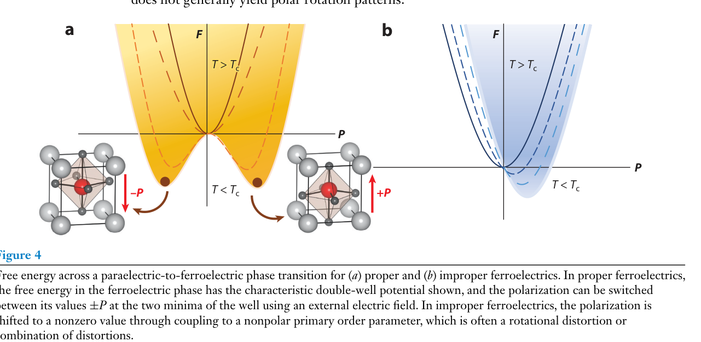

# 超铁电体 / Hyperferroelectrics

超铁电体（hyperferroelectrics）是一类**即使在未屏蔽（无金属电极/真空）边界条件下仍能保持宏观极化**的本征铁电体。普通铁电体的极化会受退极化场（depolarization field）压制而失稳；超铁电体凭借**极小的 Born 有效电荷（Born effective charge）与弱的 LO-TO 分裂**，使其对退极化场高度鲁棒，即便表面无电荷补偿也能维持铁电态。这使它们成为"掺杂金属化后仍保留极性"（即超铁电金属/极性金属）的理想母体材料。

## 👵 太奶导读

太奶，铁电材料就像一块"记住了电流方向"的宝贝。但有个毛病：把宝贝做得特别薄、或者表面没人"接应"时，里面的"记性"自己就会消失。超铁电体则是"记性特别倔"的铁电体——哪怕把它做成薄片、表面啥也不接，它的记性照样稳稳当当。因为它的"记性"来源很特别（是电子云整体挪动，不是单个原子使劲），天生不怕这种"拆台"。所以它适合做超薄的存储芯片，还能改造出又导电又记电的新材料。

## 🧩 核心内容与机制 (Core Content)

- **定义**：hyperferroelectric = 在**非短路边界条件**（未被金属电极完全屏蔽）下仍保持非零极化的铁电体；其铁电双阱不依赖电极屏蔽即可稳定（[[../papers/bhowalPolarMetalsPrinciples2023b]]）。
- **判据**：Born 有效电荷 Z* 很小（接近名义电荷），LO-TO 分裂弱 → 退极化场对极化的"惩罚"小 → 铁电态在开边界下仍稳定（[[../papers/bhowalPolarMetalsPrinciples2023b]]）。
- **代表材料（Carpy-Galy 相）**：La₂Ti₂O₇、Sr₂Nb₂O₇、Ca₃Ti₂O₇ 等层状钙钛矿衍生物被理论鉴定为超铁电体；它们的（反）铁电畸变模式对退极化场极不敏感（[[../papers/bhowalPolarMetalsPrinciples2023b]]）。
- **意义**：①解决"铁电薄膜越薄越难保持极化"的经典难题；②作为掺杂成极性金属/超铁电金属的母体——掺杂后金属性增加但极性保留（[[../papers/bhowalPolarMetalsPrinciples2023b]]、[[../papers/huProgressProspectsLowdimensional2019]]）。
- **与低维体系联系**：超铁电概念在二维铁电研究中被广泛讨论，被视为克服二维去极化坍塌、实现原子层厚度铁电的关键（[[../papers/huProgressProspectsLowdimensional2019]]）。

- **看图要点**：对比"超铁电（本征，无屏蔽也稳定）"与"常规/赝本征铁电（依赖屏蔽）"的自由能曲线随边界条件的变化。
- **来源**：[[../papers/bhowalPolarMetalsPrinciples2023b]]

## 🔬 物理参数表

| 属性 | 数值 | 方法与来源 |
| :--- | :--- | :--- |
| 稳定性判据 | 小 Z* + 弱 LO-TO 分裂 | 理论（[[../papers/bhowalPolarMetalsPrinciples2023b]]） |
| 边界条件 | 非短路（开边界）下保持极化 | 概念定义（[[../papers/bhowalPolarMetalsPrinciples2023b]]） |
| 代表材料 | La₂Ti₂O₇、Sr₂Nb₂O₇、Ca₃Ti₂O₇ | 理论鉴定（[[../papers/bhowalPolarMetalsPrinciples2023b]]） |
| 应用接口 | 掺杂金属化 → 极性金属母体 | 理论（[[../papers/bhowalPolarMetalsPrinciples2023b]]） |

## 🧭 近邻概念辨析

- **与常规铁电体（ferroelectricity）**：常规铁电（BaTiO₃ 等）的稳定性依赖电极屏蔽与短路边界；超铁电体在开边界下也稳定。
- **与超铁电金属（hyper-ferroelectric-metal）**：超铁电体是**绝缘母体**；超铁电金属是它掺杂/金属化后的导电版本，保留极性骨架。
- **与极性金属（polar-metal）**：极性金属强调金属态 + 极性；超铁电体则强调"抗退极化场的铁电母体"，两者是"母体—金属化产物"的承接关系。

## 📚 相关论文 (Related Papers)

- [[../papers/bhowalPolarMetalsPrinciples2023b]]：超铁电体判据与 Carpy-Galy 相鉴定。
- [[../papers/huProgressProspectsLowdimensional2019]]：低维铁电综述，超铁电在二维中的讨论。

## 🔗 关联概念与实体 (Related Concepts & Entities)

- [[../concepts/ferroelectricity|铁电性]]
- [[../concepts/hyper-ferroelectric-metal|超铁电金属]]
- [[../concepts/polar-metal|极性金属]]
- [[../concepts/born-effective-charge|Born 有效电荷]]
- [[../concepts/depolarization-field|退极化场]]
- [[../entities/BaTiO3|BaTiO3]]
- [[../entities/PbTiO3|PbTiO3]]
*（内容由AI生成，仅供参考）*
