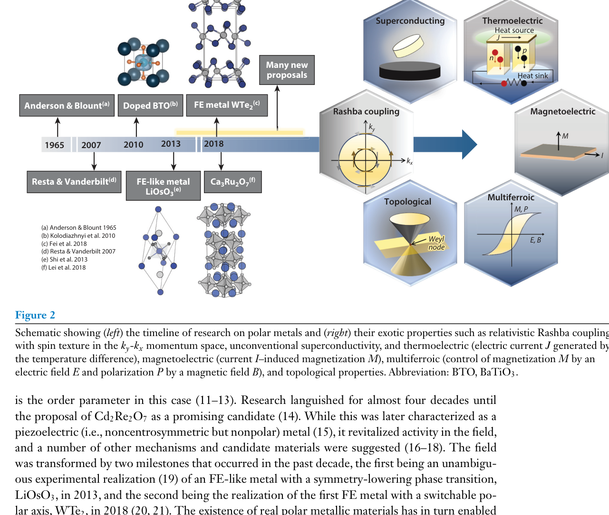

# 极性金属 / Polar Metal

极性金属（polar metal）指**具有极性（非中心对称）晶体结构且同时呈现金属性（存在费米面）**的材料。历史上 Anderson & Blount 于 1965 年理论预言了这类"金属与极性共存"的可能性；2013 年 LiOsO₃ 实验证实第一个类铁电金属，2018 年双层 WTe₂ 进一步实现可翻转的铁电金属。极性金属是"铁电金属"（ferroelectric-metal）与二维极性体系的母体概念，其核心悖论在于：金属中自由载流子应屏蔽内建极化，而极性金属通过低载流子密度、强离子性畸变或特定电子结构保留极性。

## 👵 太奶导读

太奶，"金属导电"和"材料有极性（记住电的方向）"原本被认为水火不容：金属里电子太多，会立刻把极性"抹平"。但科学家发现真有材料既导电又有极性（叫极性金属）——它们靠"电子少一点"或"结构特殊"躲过屏蔽。这类材料既导电又能被极化操控，还可能带来拓扑、超导等稀奇性质，是近年的研究新宠。

## 🧩 核心内容与机制 (Core Content)

- **定义与判据**：极性（非中心对称）点群 + 金属性（费米面存在）。与铁电金属（ferroelectric-metal）的区别在于：极性金属的极化**不一定可通过电场翻转**（如 LiOsO₃ 是"类铁电金属"）。
- **历史脉络**：1965 Anderson-Blount 理论预言 → 2013 LiOsO₃ 首个类铁电金属（极性相变、极化不可翻转）→ 2018 双层 WTe₂ 首个可翻转铁电金属（[[../papers/bhowalPolarMetalsPrinciples2023b]]）。
- **屏蔽悖论与出路**：金属中自由载流子屏蔽内建极化场；极性金属通过低载流子密度（如掺杂铁电体 BaTiO₃₋δ 在低掺杂端保持极性）、强离子性畸变或几何铁电机制（如 Ca₃Ru₂O₇ 的旋转-倾斜-极性模式耦合）保留极性（[[../papers/bhowalPolarMetalsPrinciples2023b]]）。
- **物性表现**：极性金属中可出现 Rashba 劈裂、拓扑态（Weyl 半金属）、超导与非线性光学（SHG）响应共存；如 MoTe₂ 极性/相位畴壁具导电界面态（huang2019）。
- **二维扩展**：双层 WTe₂、插层型 AM₂X₄ 等二维极性金属/铁电金属为柔性可重构器件提供平台（[[../papers/wuSlidingFerroelectricity2D2021a]]、[[../papers/zhaoRealization2DMultiferroic2024]]）。

- **看图要点**：(a) 卡通区分"极性金属—类铁电金属—铁电金属"三层概念；(b) 对比中心对称与非中心对称一维离子链的库仑排斥能。
- **来源**：[[../papers/bhowalPolarMetalsPrinciples2023b]]

- **看图要点**：左侧时间线自 1965 年 Anderson-Blount 理论到 2013 LiOsO₃、2018 WTe₂ 实验突破；右侧枚举极性金属承载的奇异物性。
- **来源**：[[../papers/bhowalPolarMetalsPrinciples2023b]]

## 🔬 物理参数表

| 属性 | 数值 | 方法与来源 |
| :--- | :--- | :--- |
| LiOsO₃ 极性相变温度 | ~140 K（R-3c → R3c） | 实验（[[../papers/bhowalPolarMetalsPrinciples2023b]]） |
| LiOsO₃ 极化可否电场翻转 | 不可（类铁电金属） | 实验/理论（[[../papers/bhowalPolarMetalsPrinciples2023b]]） |
| WTe₂ 双层垂直极化 | ~1×10⁴ e·cm⁻¹ | 双栅静电测量（[[../papers/feiFerroelectricSwitchingTwodimensional2018a]]） |
| WTe₂ 极化可否电场翻转 | 可（铁电金属） | 实验（[[../papers/feiFerroelectricSwitchingTwodimensional2018a]]） |
| Ca₃Ru₂O₇ 极性机制 | 几何铁电（旋转+倾斜+极性模式耦合） | 理论（[[../papers/bhowalPolarMetalsPrinciples2023b]]） |

## 🧭 近邻概念辨析

- **与铁电金属（ferroelectric-metal）**：铁电金属是极性金属中极化**可电场翻转**的子类；极性金属概念更宽，含极化不可翻转的类铁电金属（LiOsO₃）。
- **与金属铁电性（metallic-ferroelectricity）**：metallic-ferroelectricity 侧重"金属中实现铁电"的现象描述，与极性金属中可翻转子类高度重叠。
- **与超铁电金属（hyper-ferroelectric-metal）**：超铁电金属是超铁电体掺杂金属化的产物，属于极性金属的一种特殊实现路径。

## 📚 相关论文 (Related Papers)

- [[../papers/bhowalPolarMetalsPrinciples2023b]]：极性金属领域权威综述，系统梳理定义、历史与机制。
- [[../papers/feiFerroelectricSwitchingTwodimensional2018a]]：双层 WTe₂ 铁电翻转实验。
- [[../papers/huangPolarPhaseDomain2019]]：MoTe₂ 极性/相位畴壁导电界面态。
- [[../papers/wuSlidingFerroelectricity2D2021a]]：滑动铁电综述，覆盖金属铁电与非线性霍尔。
- [[../papers/sharmaRoomtemperatureFerroelectricSemimetal2019]]：室温铁电半金属。

## 🔗 关联概念与实体 (Related Concepts & Entities)

- [[../concepts/ferroelectric-metal|铁电金属]]
- [[../concepts/metallic-ferroelectricity|金属铁电性]]
- [[../concepts/hyper-ferroelectric-metal|超铁电金属]]
- [[../concepts/geometric-ferroelectricity|几何铁电性]]
- [[../concepts/inversion-symmetry-breaking|反演对称破缺]]
- [[../entities/LiOsO3|LiOsO3]]
- [[../entities/WTe2|WTe2]]
- [[../entities/Ca3Ru2O7|Ca3Ru2O7]]
*（内容由AI生成，仅供参考）*
