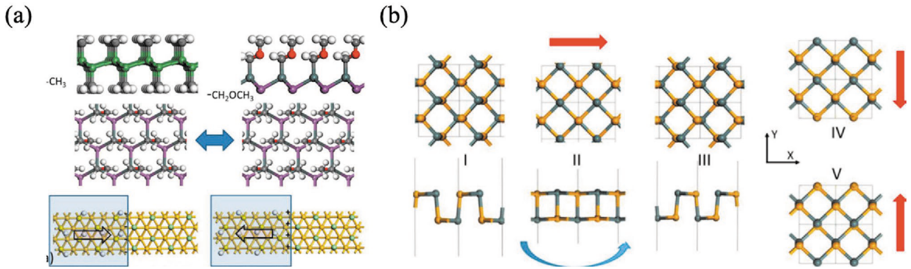

# 硫化锡 (SnS) / Tin Sulfide

SnS（硫化锡）是 IV-VI 族层状半导体，具有**磷烯同构的褶皱（puckered）四方晶格**，是二维**面内铁电**的典型代表之一，也是实验上最早在原子级厚度确认面内铁电性的材料之一。其铁电性源于 Sn 的**孤对电子驱动的结构畸变**，翻转路径伴随 90° 极化旋转，构成铁电-铁弹耦合。此外，SnS 单层可与氧化物超薄铁电（如 1-u.c. BaTiO₃）构建二维/三维杂化体系，实现多极性态与联合扭转-滑动调控。

## 👵 太奶导读

太奶，SnS（硫化锡，锡和硫组成的层状材料）就像一叠**压出波浪纹的纸板**：每一层不是平的，而是像搓衣板一样有起伏的褶皱（这叫"褶皱四方晶格"）。正因为它这种高低不平的结构，锡原子（Sn）有一对"爱偷懒"的电子不愿意参与成键（这叫**孤对电子**），把结构挤得歪向一边，于是每一层都天然带着一个方向的面内电极化——就像搓衣板在某个方向上有一排小箭头。

它跟前面讲的"搓一搓"（滑动铁电）不一样：SnS 的电性是**每层自己天生就带**的，方向在层内，要翻转它得让箭头转 90° 拐个弯，这拐弯还顺带改变了晶格的歪斜方向，所以它的铁电和"铁弹"是绑在一起的。因为它天生带电极化、又只有几个原子厚，正好适合做超薄的记忆芯片。

## 🏗️ 结构概览

SnS 为层状 IV-VI 族半导体，单层呈**褶皱四方晶格**（磷烯同构），层间为范德华相互作用。其面内极化来源于 Sn 的 $5s^2$ 孤对电子引起的**非中心对称结构畸变**——原子沿晶格方向不对称偏移，产生沿面内的净偶极矩（[[../papers/FerroelectricityMultiferroicityAtomic2023]]）。

- **看图要点**：(a) 表面功能化非范德华二维铁电体示例；(b) SnS/SnSe 单层铁电翻转路径及 90° 铁弹-铁电耦合。
- **来源**：[[../papers/guanRecentProgressTwoDimensional2020]] -> [[../figures/crystal-structures-bulk|体相晶体结构]]

## 🧩 面内铁电与铁弹-铁电耦合

- **面内铁电**：SnS 单层在原子级厚度下呈现面内自发极化，是纯面内铁电的实验代表（实验确认于 2020 年，[[../papers/FerroelectricityMultiferroicityAtomic2023]]）。
- **翻转路径**：SnS/SnSe 单层的极化翻转路径同时涉及 **90° 极化旋转**，与晶格畸变方向（铁弹序）互锁，构成铁电-铁弹耦合——翻转铁电的同时必然改变铁弹畴（[[../papers/guanRecentProgressTwoDimensional2020]]）。
- **孤对电子机制**：与 SnTe、SnSe 等 IV-VI 族单硫族化物一致，SnS 的极化由孤对电子驱动的畸变产生，是理解该类面内铁电的统一图像。

## 🧩 异质结与多态调控

SnS 单层可参与二维/三维杂化体系构建：

- **1-u.c. BaTiO₃/SnS 杂化**：理论预言 BaO 终止面有四个极性态、TiO₂ 终止面有三个极性态；界面各向异性应变可使极化在 x、y 间切换并伴随铁弹转变；极性分布汇聚于绕数为 1 的 Néel 点，并出现顺/逆时针 Bloch 涡旋，随 BTO 滑动与 SnS 厚度可调（[[../papers/kaurRecentAdvancesTheoretical2025a]]）。
- 这类体系将 SnS 的面内铁电与 BTO 的面外铁电、层间滑动自由度结合，提供了多态存储与联合扭转-滑动调控的设计平台。

## 🔬 物理参数表

| 属性 | 数值 | 方法与来源 |
| :--- | :--- | :--- |
| 单层面内自发极化 | 存在（实验确认，量级未在库内记录） | 实验（[[../papers/FerroelectricityMultiferroicityAtomic2023]]） |
| 翻转路径 | 90° 极化旋转（铁电-铁弹耦合） | DFT（[[../papers/guanRecentProgressTwoDimensional2020]]） |
| 1-u.c. BTO/SnS 极性态数 | BaO 终止面 4 个、TiO₂ 终止面 3 个 | DFT（[[../papers/kaurRecentAdvancesTheoretical2025a]]） |
| 极化调控 | x↔y 切换伴随铁弹转变 | DFT（[[../papers/kaurRecentAdvancesTheoretical2025a]]） |

> 注：上表为 DFT/实验典型结果，适用对象与条件已在数值中标注；SnS 单层面内极化的具体数值未在库内论文卡片中记录，故不作量化列示，详细来源见 📚 相关论文 节。

## 🧭 近邻体系辨析

- **与 SnTe 的区别**：SnTe 为岩盐型（立方）结构，室温铁电需在超薄膜中通过畸变实现（实验于液氦温度观测）；SnS 为磷烯同构褶皱层状结构，单层面内铁电在原子级厚度即存在。
- **与 SnSe 的区别**：SnSe 与 SnS 同构同族，AA 堆垛 SnSe 还可通过层间滑移产生面内+面外极化；SnS 文献中更强调本征面内铁电与 90° 铁弹耦合。
- **与滑动铁电材料（HgI₂、ReS₂）的区别**：HgI₂、ReS₂ 的极化为层间滑动诱导的面外极化；SnS 的极化是每层本征的面内极化，不依赖层间滑动即可存在。

## 📚 相关论文 (Related Papers)

- [[../papers/FerroelectricityMultiferroicityAtomic2023]]：从综述角度梳理了「Ferroelectricity and multiferroicity down to the atomic thickness」，明确 SnS 为纯面内二维铁电的实验代表。
- [[../papers/guanRecentProgressTwoDimensional2020]]：从综述角度梳理了「Recent Progress in Two‐Dimensional Ferroelectric Materials」，其图 4 给出 SnS/SnSe 单层 90° 铁弹-铁电耦合翻转路径。
- [[../papers/kaurRecentAdvancesTheoretical2025a]]：从理论综述角度梳理了「Recent advances in theoretical investigations of sliding ferroelectricity」，其图 16 给出 1-u.c. BaTiO₃/SnS 杂化的多极性态与联合扭转-滑动调控。
- [[../papers/tangMultiferroicityTwodimensionalVan2025]]：从综述角度梳理了「二维范德华多铁材料的设计策略」，将 IV 族单硫族化物（SnS、SnSe）列为"弹中诱电"策略的代表体系。

## 🔗 关联概念与实体 (Related Concepts & Entities)

- [[../concepts/ferroelectricity|铁电性]]
- [[../concepts/ferroelasticity|铁弹性]]
- [[../concepts/sliding-ferroelectricity|滑动铁电性]]
- [[../concepts/polarization-switching|极化翻转]]
- [[../entities/SnTe|SnTe]]
- [[../entities/SnSe|SnSe]]
- [[../entities/GeSe|GeSe]]
