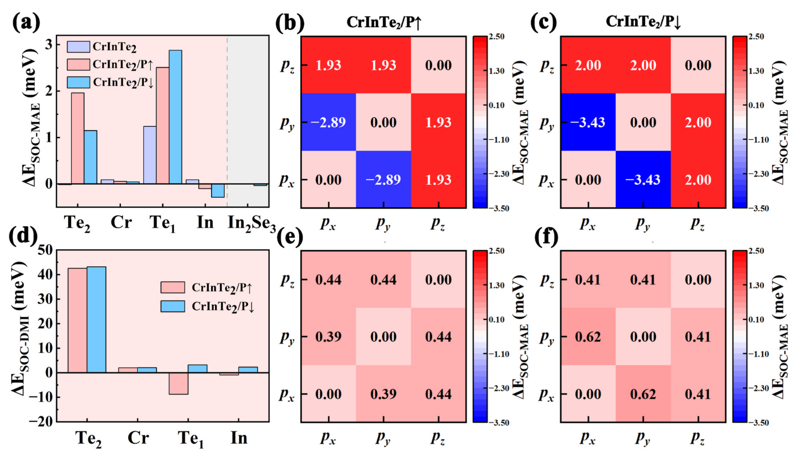

# landau-lifshitz-equation

## 👵 太奶导读

乖孙，这一条讲的是「朗道-栗弗席兹方程」——说白了就是**磁矩怎么动的"运动方程"**。太奶打个比方：一块磁铁里的每个小磁矩都像个小陀螺，被外场一推，不是直接倒过去，而是先绕圈圈转（进动），一边转一边慢慢朝场方向倒（弛豫）。这个方程就是写"陀螺怎么转、转多快、什么时候停下"的数学。它是算自旋波、斯格明子、双半子这些磁结构怎么演化的总发动机——论文里所有电控磁结构的结论，最后都靠它来"演电影"。一句话：**磁矩的"运动圣经"，从自旋波到斯格明子全靠它推演**。

## 🧩 核心机制：进动 + 弛豫 + 转矩的三层结构

### 1. 方程本体（无阻尼形式）

$$
\frac{\partial \mathbf{M}}{\partial t} = -\gamma\, \mathbf{M}\times\mathbf{H}_{\mathrm{eff}}
$$

- $\mathbf{M}$：磁化强度矢量；$\gamma$：旋磁比；$\mathbf{H}_{\mathrm{eff}}$：包含外场、交换场、DM 场、磁各向异性能（MAE）场、退磁场等在内的**有效场**（有效场是自由能对 $\mathbf{M}$ 的泛函导数）。
- 物理图像：磁矩绕有效场做**拉莫进动**，频率由有效场强度决定——这就是磁振子（自旋波）频率的来源。

### 2. 阻尼与弛豫（LLG 形式）

$$
\frac{\partial \mathbf{M}}{\partial t} = -\gamma\,\mathbf{M}\times\mathbf{H}_{\mathrm{eff}} + \frac{\alpha}{M_s}\,\mathbf{M}\times\frac{\partial \mathbf{M}}{\partial t}
$$

- $\alpha$ 为吉尔伯特阻尼常数，描述进动能量的耗散（自旋-晶格、自旋-电子耦合等）。
- 无阻尼极限下能量守恒，系统沿等能面进动；加阻尼后系统螺旋式弛豫到能量极小态——宏观磁序由此建立。

### 3. 从宏观到微观的两类应用

- **自旋波/磁振子**（de Sousa & Moore 2008）：在 BiFeO₃ 倾斜反铁磁中，把铁电序参量与反铁磁序参量耦合进自由能，线性化 LL 方程得到磁振子色散，揭示磁静波效应带来的传播各向异性。
- **拓扑磁结构微磁模拟**（Zhang et al. 2025）：把 DFT 算出的 J / DMI / MAE 参数输入 LLG 方程（Spirit 软件），预测 CrInTe₂/In₂Se₃ 异质结中铁磁态↔斯格明子晶格的电场可逆切换，以及电流驱动下斯格明子与双半子的轨迹。
- **电流驱动项（STT/SOT）**：器件场景还需加入自旋转移矩（$\mathbf{T}_{\mathrm{STT}}\propto \mathbf{M}\times(\mathbf{M}\times\mathbf{J}_s)$）等项，用于描述自旋极化电流对磁矩的驱动——双半子霍尔角较斯格明子小约 80% 即由此类模拟得出。

- **关键特征**：展示铁电极化翻转前后，由 LLG 方程演化的铁磁态与斯格明子晶格之间的可逆切换，体现 LL/LLG 方程作为微磁学引擎的角色。

## 📊 物理参数表

| 参数 | 符号 | 含义 |
| --- | --- | --- |
| 旋磁比 | $\gamma$ | 进动频率/有效场比例系数 |
| 阻尼常数 | $\alpha$ | 能量耗散速率（Gilbert） |
| 有效场 | $\mathbf{H}_{\mathrm{eff}}$ | 交换+DM+MAE+外场等合力 |
| 交换作用 | $J$ | 最近邻自旋耦合（微磁输入） |
| DM 相互作用 | $D$ | 非共线自旋倾斜驱动项 |
| 磁各向异性能 | MAE/K | 自旋易轴偏好 |
| 无量纲判据 | $\kappa$ | $5<|\kappa|<10$ 稳定斯格明子/双半子 |

## 🧭 近邻概念辨析

- **与 [[../concepts/spin-wave|自旋波]]**：自旋波是 LL 方程线性化后的**平面波解**；LL 方程是自旋波动力学的母方程。
- **与 [[../concepts/dzyaloshinskii-moriya-interaction|DM 相互作用]]**：DM 是进入 $\mathbf{H}_{\mathrm{eff}}$ 的**相互作用项**；LL 方程只是承载该项的动力学框架，二者是"内容"与"容器"关系。
- **与 [[../concepts/skyrmion|斯格明子]] / [[../concepts/bimeron|双半子]]**：斯格明子/双半子是 LLG 模拟输出的**拓扑自旋结构**；LL 方程是生成并推演它们动力学的引擎。
- **与 [[../concepts/magnetic-anisotropy|磁各向异性]]**：MAE 是 $\mathbf{H}_{\mathrm{eff}}$ 的组成项之一，决定斯格明子稳定性窗口（与 DMI 竞争）。

## 📚 相关论文

- [[../papers/deSousa2008electrical]]：利用含磁静效应的唯象朗道理论 + LL 方程计算 BiFeO₃ 薄膜自旋波谱，揭示磁振子传播各向异性的机制。
- [[../papers/zhangNonvolatileControlTopological2025]]：将 DFT 磁相互作用参数输入 LLG 微磁学模拟，预言 CrInTe₂/In₂Se₃ 中非易失性电控斯格明子切换，并提出无量纲稳定性判据 $\kappa$。

## 🔗 关联概念与实体

- [[../concepts/multiferroicity|multiferroicity]]
- [[../concepts/magnetoelectric-coupling|magnetoelectric-coupling]]
- [[../concepts/polarization-switching|polarization-switching]]
- [[../concepts/spin-wave|spin-wave]]
- [[../concepts/dzyaloshinskii-moriya-interaction|dzyaloshinskii-moriya-interaction]]
- [[../concepts/canted-antiferromagnetism|canted-antiferromagnetism]]
- [[../concepts/weak-ferromagnetism|weak-ferromagnetism]]
- [[../concepts/magnetostatic-effect|magnetostatic-effect]]
- [[../concepts/electromagnon|electromagnon]]
- [[../concepts/spin-wave-logic|spin-wave-logic]]
- [[../concepts/neel-vector|neel-vector]]
- [[../concepts/ginzburg-landau|ginzburg-landau]]
- [[../concepts/skyrmion|skyrmion]]
- [[../concepts/bimeron|bimeron]]
- [[../concepts/spin-transfer-torque|spin-transfer-torque]]
- [[../entities/BiFeO3|BiFeO3]]
- [[../entities/In2Se3|In2Se3]]
- [[../entities/CrInTe2|CrInTe2]]
- [[../entities/Spirit|Spirit]]
