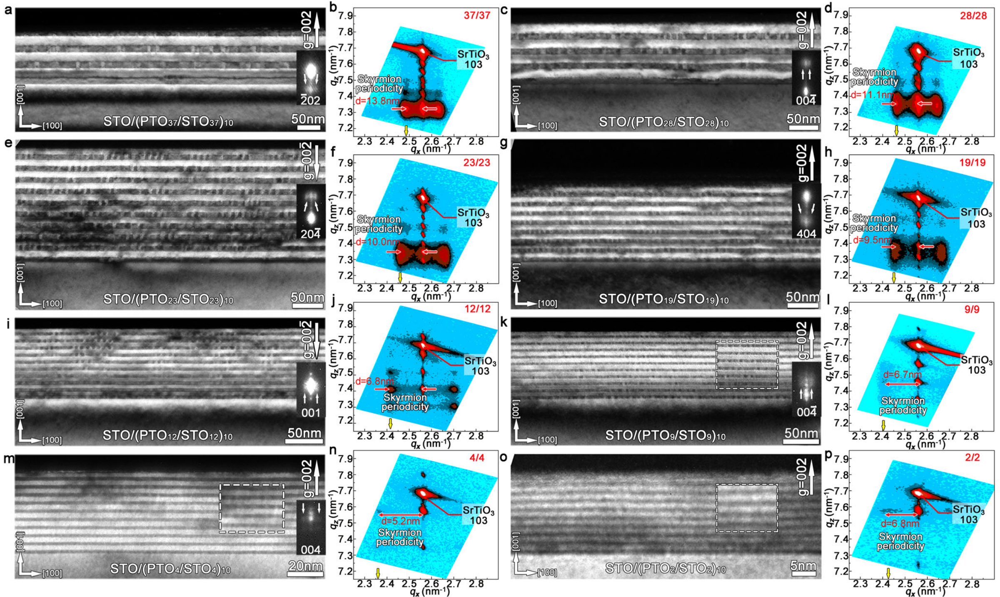

# 极性斯格明子 / Polar Skyrmion

极性斯格明子 (Polar Skyrmion) 是铁电薄膜/超晶格中极化矢量在纳米尺度连续旋转形成的涡旋状拓扑织构，其拓扑荷 $Q = \pm 1$，是磁斯格明子在铁电序参量空间的对应物。它由退极化能、弹性能与梯度能之间的竞争驱动，具有拓扑保护的稳定性。

## 👵 太奶导读

乖孙，这一条讲的是「极性斯格明子」。您可以把铁电材料里的每个小原子看作一个小箭头（极化方向）。一般铁电体里所有箭头整整齐齐朝一个方向；但在极性斯格明子里，这些箭头围成一个"小旋风"，从中心到边缘一圈圈地转过去，像一个甜甜圈形状的漩涡。这个漩涡的"圈数"（拓扑荷）是 1，意味着它很"结实"——您用手去拨它，只要不把它拆散，它转的圈数不会变。它这么小的尺寸（纳米级）又能稳定存在，正好用来做超密度的数据存储。一句话：**"铁电极化自己卷成的小旋风，结实又极小，天生适合存数据"**。

## 🏗️ 结构概览

极性斯格明子在超薄铁电薄膜中稳定存在，其尺度与膜厚的关系打破传统 Kittel 定律。

*   **看图要点**：展示了极性斯格明子在薄膜中的涡旋形貌、中心/边缘极化指向及其对膜厚的依赖。
*   **来源**：[[../papers/gongAbsenceCriticalThickness2023]]

## 🧩 核心机制：能量竞争如何卷出斯格明子

### 1. 四类能量的竞争

- **体自由能**：倾向均匀极化，代价是边界去极化。
- **退极化能**：面外极化产生的退极化场抑制面外分量，驱动极化转向面内。
- **弹性能/应变能**：衬底失配应变约束极化方向与畴取向。
- **梯度能**：惩罚极化方向的急剧变化，使旋转平滑连续。

四者平衡时，极化在实空间形成连续旋转的涡旋织构，拓扑荷 $Q=1$。

### 2. 打破 Kittel 定律的临界厚度行为

传统铁电畴的周期随膜厚遵循 Kittel 定律 $d \propto \sqrt{h}$，且存在临界厚度下限。极性斯格明子体系在超薄极限下违背该定律：其拓扑稳定性来自织构的拓扑荷而非单纯的能量标度，因此即使膜厚缩小到原子级，斯格明子依然可稳定存在（"临界厚度缺失"）。

### 3. 电控与外场响应

极性斯格明子可被电场、应力、光场等外场可逆操控，且伴随巨电阻开关、负电容、电控手性光学与超快太赫兹动力学等效应，具备器件应用潜力。

## 📋 关键参数表

| 参数 | 含义 | 典型值/特征 |
|---|---|---|
| 拓扑荷 $Q$ | 极化织构卷绕数 | $\pm 1$ |
| 尺寸 | 斯格明子特征尺度 | 纳米级（与膜厚同量级） |
| 稳定厚度 | 维持拓扑所需厚度 | 打破 Kittel 定律，临界厚度缺失 |
| 翻转手段 | 外场操控 | 电场/应力/光场可逆切换 |
| 衍生效应 | 器件功能 | 巨阻开关、负电容、手性光学 |

## 🔀 近邻概念辨析

- **极性斯格明子 vs 极性涡旋 (Polar Vortex)**：涡旋的拓扑荷 $Q = \pm 0.5$，常成对出现（涡旋-反涡旋）；斯格明子 $Q = \pm 1$，拓扑荷更"完整"、更稳定。
- **极性斯格明子 vs 磁斯格明子**：序参量分别为极化与磁化；极性体系靠能量竞争（无 DMI 也可），磁体系常依赖 Dzyaloshinskii-Moriya 相互作用。

## 📚 相关论文 (Related Papers)

- [[../papers/gongAbsenceCriticalThickness2023]]：实验证明极性斯格明子体系打破 Kittel 定律、无临界厚度限制。
- [[../papers/hanPolarTopologicalMaterials2025]]：综述极性拓扑结构的能量竞争设计原理、多场调控与器件应用。

## 🔗 关联概念与实体 (Related)

- [[../concepts/topological-charge|topological-charge]]
- [[../concepts/polar-vortex|polar-vortex]]
- [[../concepts/topological-defects|topological-defects]]
- [[../concepts/depolarization-field|depolarization-field]]
- [[../concepts/phase-field-modeling|phase-field-modeling]]
- [[../concepts/strain-engineering|strain-engineering]]
- [[../concepts/polarization-switching|polarization-switching]]
- [[../concepts/flux-closure-domain|flux-closure-domain]]
- [[../concepts/ferroelectricity|ferroelectricity]]
- [[../concepts/multiferroicity|multiferroicity]]
- [[../entities/PbTiO3|PbTiO3]]
- [[../entities/SrTiO3|SrTiO3]]
