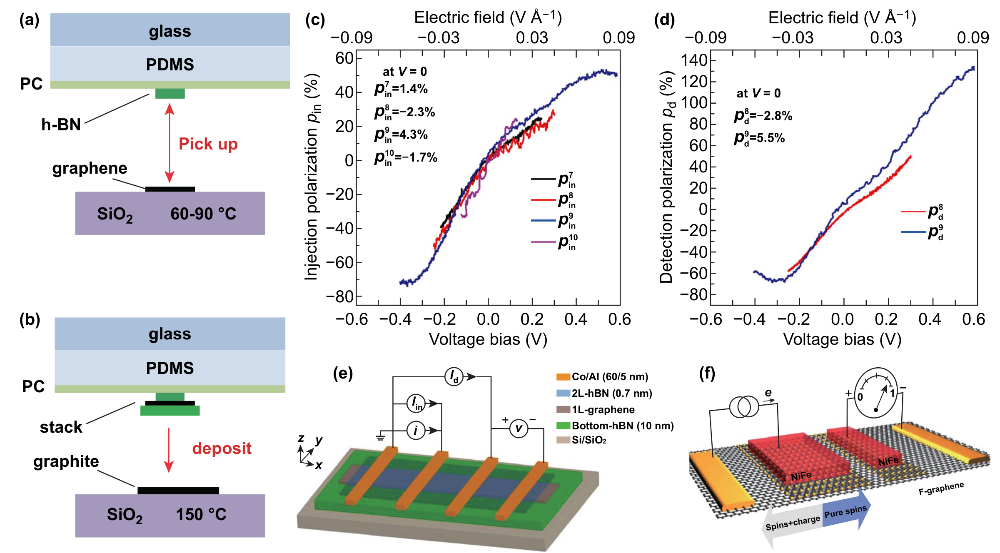

# 自旋弛豫 / Spin Relaxation

自旋弛豫 (Spin Relaxation) 描述注入的非平衡自旋极化（方向一致的净自旋）在时间上衰减回平衡态的过程，对应特征时间即自旋寿命 $\tau_s$。自旋寿命与扩散长度共同决定自旋信息能传输多远、保留多久，是自旋电子学器件性能的核心制约因素。

## 👵 太奶导读

乖孙，"自旋弛豫"说白了就是"转着的小磁针慢慢不转了"。你让一堆电子都朝同一个方向转（自旋极化），过一会儿它们会"各转各的"、乱掉，这混乱的过程就是弛豫。材料里"乱掉"的快慢决定了自旋信息能传多远、存多久——好比一群人手拉手排队走，队伍能整齐走多远，取决于"有人悄悄脱队"的速度。一句话：**"自旋信息在材料里能保持多久不乱，就是自旋弛豫在管"**。

## 🏗️ 结构概览

自旋弛豫通过多种机制耗散自旋角动量，其强度与材料维度、对称性、杂质和温度密切相关。

*   **看图要点**：展示了自旋输运/弛豫的器件测量与数据（如 Hanle 曲线）。
*   **来源**：[[../papers/liuSpintronicsTwoDimensionalMaterials2020b]]

## 🧩 核心机制

### 1. Elliott-Yafet (EY) 机制

自旋-轨道耦合使自旋与动量耦合，动量散射（杂质/声子）同时伴随自旋翻转，弛豫时间与动量弛豫时间同量级：$\tau_s \propto \tau_p$。适合弱 SOC 体系（如石墨烯）。

### 2. D'yakonov-Perel' (DP) 机制

自旋-轨道耦合使自旋在两次散射之间绕有效磁场进动，方向随动量变化；散射越频繁，进动越被平均，弛豫越慢：$\tau_s \propto 1/\tau_p$。适合强 SOC 体系（如 TMD、Rashba 体系）。

### 3. 其它机制与二维材料特性

- **Bir-Aronov-Pikus**：电子-空穴交换作用（重掺杂半导体）；
- **超精细相互作用**：核自旋对电子自旋的扰动（局域化体系）。
二维材料可通过 hBN 封装、悬浮与化学纯化大幅抑制杂质散射，石墨烯的自旋弛豫时间与扩散长度因此获得数量级提升。

## 📋 关键参数表

| 参数 | 含义 | 典型值/特征 |
|---|---|---|
| 自旋寿命 $\tau_s$ | 极化衰减时间 | 石墨烯达纳秒级 |
| 扩散长度 | 自旋保持距离 | 微米级（封装石墨烯） |
| 主导机制 | 弛豫通道 | EY / DP / BAP / 超精细 |
| SOC 强弱 | 决定机制 | 弱→EY，强→DP |
| 抑制手段 | 提升寿命 | hBN 封装、悬浮、纯化 |

## 🔀 近邻概念辨析

- **自旋弛豫 vs 自旋去相干**：弛豫指纵向极化（$T_1$）衰减到平衡；去相干指横向极化（$T_2$）相位失散。自旋电子学器件主要关心 $T_1$/扩散长度。
- **EY vs DP 机制**：EY 随动量散射增强而变快，DP 随动量散射增强而变慢——可通过改变温度/杂质浓度区分二者。

## 📚 相关论文 (Related Papers)

- [[../papers/liuSpintronicsTwoDimensionalMaterials2020b]]：系统综述二维材料中自旋弛豫机制与 hBN 封装对寿命的提升。

## 🔗 关联概念与实体 (Related)

- [[../concepts/spin-transport|spin-transport]]
- [[../concepts/spin-injection|spin-injection]]
- [[../concepts/spin-valve|spin-valve]]
- [[../concepts/spin-orbit-coupling|spin-orbit-coupling]]
- [[../concepts/spin-hall-effect|spin-hall-effect]]
- [[../concepts/spin-injection|spin-injection]]
- [[../entities/graphene|graphene]]
- [[../entities/h-BN|h-BN]]
- [[../entities/TMDs|TMDs]]
