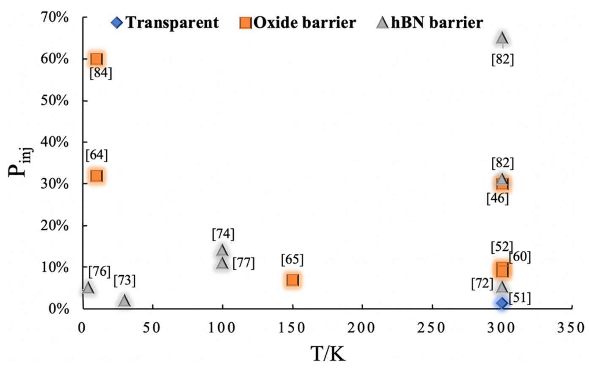

# 自旋阀 / Spin Valve

自旋阀 (Spin Valve) 是经典的自旋电子学器件结构：两层铁磁层（自由层 + 钉扎层）夹一层非磁性导电间隔层。其电阻随两铁磁层磁化相对取向而变化——平行态电阻低、反平行态电阻高，这一巨磁电阻 (GMR) 效应构成硬盘读头与磁传感器的物理基础。二维材料体系中，"非局域自旋阀" (nonlocal spin valve) 则用于纯自旋流的注入与探测。

## 👵 太奶导读

乖孙，自旋阀有点像磁隧道结的"兄弟"：中间那层不换"玻璃"（绝缘）了，换成"导电层"（金属）。两块磁铁方向一致时，电子顺畅流过，电阻小；方向相反时，电子被"堵"住，电阻大。硬盘里读数据靠的就是它——用磁性记录的方向来控制电阻大小。一句话：**"两块磁铁夹块金属，方向一致好过电，方向相反难过电"**。

## 🏗️ 结构概览

自旋阀的层状构型：钉扎层 / 间隔层 / 自由层，以及非局域测量的电极布局。

*   **看图要点**：展示了自旋阀器件构型与自旋注入/探测的测量方案。
*   **来源**：[[../papers/liuSpintronicsTwoDimensionalMaterials2020b]]

## 🧩 核心机制

### 1. 巨磁电阻 (GMR)

电子在铁磁层中的散射依赖其自旋方向与局域磁化方向的相对关系。平行态：多数自旋电子全程低散射；反平行态：两种自旋电子分别在某一段高散射，总电阻升高。

### 2. 非局域自旋阀

二维材料中常用非局域测量：注入电极产生纯自旋流（无净电荷流），在间隔层两侧探测电压随自由层磁化翻转而跳变，从而定量提取自旋扩散长度与极化率。

### 3. 二维平台优势

石墨烯自旋扩散长度长（微米级），配合 h-BN 隧道势垒注入，可实现高效自旋阀；TMD 等强 SOC 材料则用于快速操控。

## 📋 关键参数表

| 参数 | 含义 | 典型值/特征 |
|---|---|---|
| GMR | 磁电阻比值 | 室温数 %–数十 % |
| 间隔层 | 非磁导电层 | Cu、石墨烯等 |
| 自旋扩散长度 | 自旋保持距离 | 石墨烯达微米级 |
| 测量方式 | 器件表征 | 局域 / 非局域自旋阀 |
| 应用 | 器件功能 | 硬盘读头、磁传感器 |

## 🔀 近邻概念辨析

- **自旋阀 vs 磁隧道结**：自旋阀中间是金属间隔层（GMR），磁隧道结中间是绝缘势垒（TMR）。TMR 幅值更大，多用于存储；GMR 响应快，广泛用于传感。
- **局域 vs 非局域自旋阀**：局域测量同时存在电荷流与自旋流；非局域测量将注入与探测电极分离，纯自旋流信号，更干净地提取自旋参数。

## 📚 相关论文 (Related Papers)

- [[../papers/liuSpintronicsTwoDimensionalMaterials2020b]]：综述二维材料自旋阀（含非局域测量、Hanle 效应）的自旋注入与探测进展。

## 🔗 关联概念与实体 (Related)

- [[../concepts/magnetic-tunnel-junction|magnetic-tunnel-junction]]
- [[../concepts/spin-injection|spin-injection]]
- [[../concepts/spin-transport|spin-transport]]
- [[../concepts/spin-relaxation|spin-relaxation]]
- [[../concepts/giant-magnetoresistance|giant-magnetoresistance]]
- [[../concepts/spin-hall-effect|spin-hall-effect]]
- [[../concepts/ferromagnetism|ferromagnetism]]
- [[../entities/graphene|graphene]]
- [[../entities/h-BN|h-BN]]
- [[../entities/Co|Co]]
