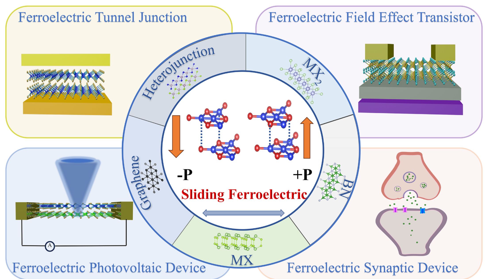
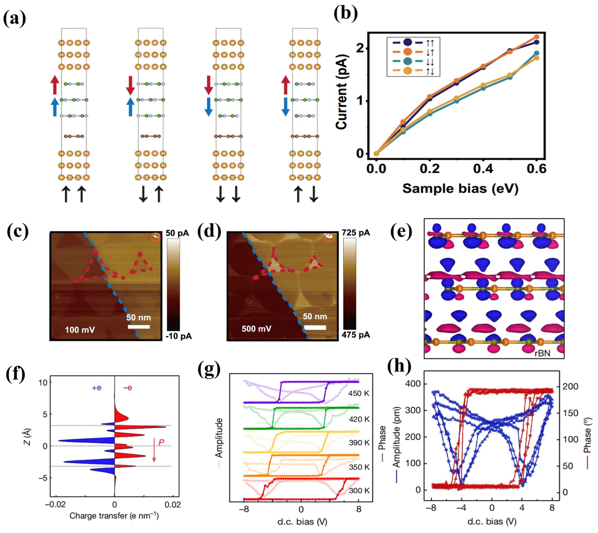
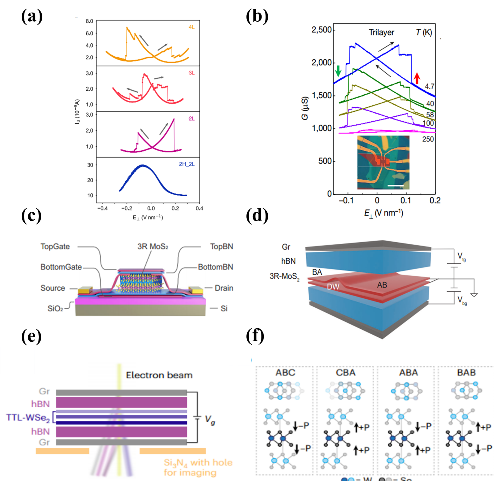
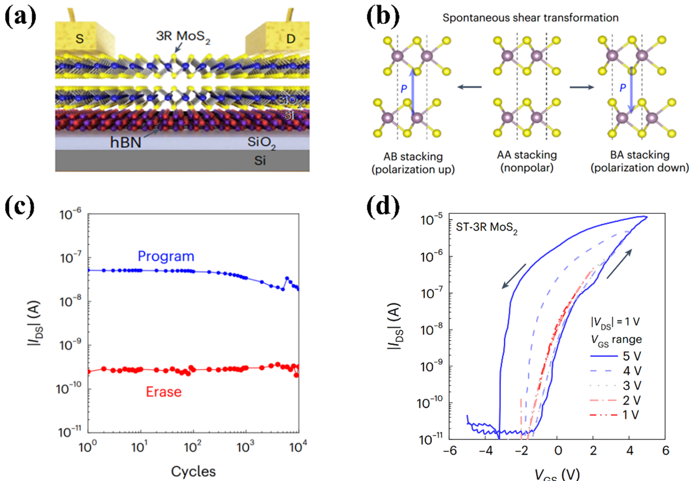

# 批次 01 文献阅读日志

## 1. noseUnifiedFormulationConstant1984 — 恒温分子动力学方法的统一表述
- **元数据**：Shuichi Nosé，1984，The Journal of Chemical Physics (方法文献)，DOI: 10.1063/1.447334
- **一句话**：首次通过解析平衡分布函数，将三种恒温MD方法（扩展系统法、约束法、动量标度法）统一在扩展系统框架下，并严格证明扩展系统方法可精确产生正则系综分布。
- **现有wiki双链**：[[../../wiki/concepts/machine-learning-potential]]、[[../../wiki/write/1984]]
- **新概念/实体建议**：
  - `nose-hoover-thermostat`：Nosé扩展系统方法，引入额外自由度s与对数势能gkT ln s产生正则分布；
  - `canonical-ensemble`：正则系综（NVT），粒子数-体积-温度恒定的统计系综；
  - `virtual-variables`：虚拟变量，扩展系统中用于构造哈密顿结构的标度变量；
  - `nose-hoover-chain`：Nosé-Hoover链，多热浴级联以增强遍历性的改进方案。
- **图表**：无关键图（本文为理论方法论文，含三个表格而非图）。
- **项目连接**：无直接项目连接。
- **组织与用词**：文章遵循"提出统一框架→分析各方法→比较与推广"的逻辑；关键词：扩展系统方法（Extended System Method）、正则系综（Canonical Ensemble）、虚拟变量/实变量（virtual/real variables）、对数势能（logarithmic potential）、平衡分布函数（equilibrium distribution function）。
- **可写入wiki的要点**：
  - Nosé扩展系统方法通过引入自由度s及势能gkT ln s，在g=3N+1（虚拟时间采样）或g=3N（实时采样）时严格产生正则系综分布；
  - Hoover等的约束方法（HLME）可由ES方法施加总动能恒定约束导出，坐标空间严格正则但动量空间为δ函数约束；
  - Haile-Gupta动量标度方法偏差为O(N^{-1/2})，在大体系热力学极限下才近似正则；
  - 框架可推广至恒温-恒压（NPT）系综，引入体积自由度V及外压P_ex；
  - 参数Q（s的有效质量）不影响平衡分布但影响动态性质和采样效率，应使s振荡频率与体系特征频率匹配。

## 2. liPhaseTransitions2D2021 — 二维材料中的相变
- **元数据**：Wenbin Li, Xiaofeng Qian, Ju Li，2021，Nature Reviews Materials (综述)，DOI: 10.1038/s41578-021-00304-0
- **一句话**：系统综述了二维材料中扩散相变、位移相变和量子相变的热力学与动力学特征，突出维数限制、弹性、静电、缺陷和化学对二维相变的独特影响。
- **现有wiki双链**：[[../../wiki/concepts/2D-materials]]、[[../../wiki/concepts/strain-engineering]]、[[../../wiki/concepts/ferroelasticity]]、[[../../wiki/entities/TMDs]]、[[../../wiki/entities/SnTe]]、[[../../wiki/entities/In2Se3]]、[[../../wiki/entities/WTe2]]、[[../../wiki/write/2021]]
- **新概念/实体建议**：
  - `mermin-wagner-theorem`：Mermin-Wagner定理，D≤2短程相互作用系统中连续对称性不能在有限温度破缺；
  - `2d-diffusive-phase-transition`：二维扩散相变，如离子/空位在二维晶格中的有序-无序转变；
  - `euler-buckling`：欧拉屈曲，自由二维晶体在任意小压应力下的长波失稳；
  - `polymorphic-phase-transition`：多态相变，同一化学式不同晶体结构间的转变。
- **图表**：
  - 
  - 
  - 
  - 
- **项目连接**：无直接项目连接。
- **组织与用词**：文章按"独特特征→多态相变→铁性相变→扩散相变→技术潜力→展望"组织；关键词：维数限制（dimensionality confinement）、位移相变（displacive phase transition）、扩散相变（diffusive phase transition）、量子相变（quantum phase transition）、铁性序（ferroic order）、屈曲（buckling）。
- **可写入wiki的要点**：
  - 自由悬浮二维晶体在零温下都不能承受静态压缩，因长波欧拉屈曲不稳定性；Hohenberg-Mermin-Wagner定理限制D≤2系统的长程有序；
  - 单层MoS2厚度仅6.7 Å，面内尺寸微米级，纵横比~10^3；
  - 二维材料的相变受衬底粘附/摩擦、表面化学吸附、外场和物理接触的强烈调制，是"终极表面科学"；
  - 光力相变在自由悬浮二维材料中更易诱导，因弹性约束弱且光-物质相互作用强；
  - 多态、铁性和高温扩散相变是三大类二维相变，各有独特的热力学和动力学行为。

## 3. sunSlidingFerroelectricityTwodimensional2025 — 滑动铁电在二维材料和器件中的应用
- **元数据**：Xiaoyao Sun, Qian Xia, Tengfei Cao, Shuoguo Yuan，2025，Materials Science and Engineering: R: Reports (综述)，DOI: 10.1016/j.mser.2025.100927
- **一句话**：全面综述二维滑动铁电性从基本原理、材料体系、制备表征到FeFET/突触/FTJ等器件应用的完整图景。
- **现有wiki双链**：[[../../wiki/concepts/sliding-ferroelectricity]]、[[../../wiki/concepts/2D-materials]]、[[../../wiki/concepts/moire-superlattice]]、[[../../wiki/concepts/ferroelectric-tunnel-junction]]、[[../../wiki/entities/h-BN]]、[[../../wiki/entities/TMDs]]、[[../../wiki/entities/WTe2]]、[[../../wiki/entities/MXenes]]、[[../../wiki/write/2025]]
- **新概念/实体建议**：
  - `sliding-ferroelectric-transistor`：滑动铁电场效应晶体管，利用层间滑移调制沟道电导；
  - `3r-phase-stacking`：3R相堆叠，非中心对称菱形堆垛天然具备滑动铁电性；
  - `interlayer-charge-transfer`：层间电荷转移，滑动铁电极化的微观起源；
  - `pfm-characterization`：压电力显微镜表征，铁电畴成像与翻转的核心手段。
- **图表**：
  - 
  - 
  - 
  - 
  - 
- **项目连接**：无直接项目连接。
- **组织与用词**：文章按"原理→材料→制备/表征→器件→展望"的经典综述逻辑；关键词：滑动铁电性（Sliding ferroelectricity）、退极化场（Depolarization field）、范德华层间滑移（van der Waals interlayer sliding）、莫尔超晶格（Moiré superlattice）、铁电场效应晶体管（FeFET）、抗疲劳性（fatigue resistance）。
- **可写入wiki的要点**：
  - 滑动铁电性于2017年首次理论预测，通过范德华层状材料的层间相对滑移打破空间反演对称性产生垂直面外极化；
  - 三种主要实现途径：3R相堆叠（如3R-MoS2）、构建扭转角/莫尔超晶格、插层堆叠；
  - h-BN/石墨烯器件在2020年首次观测到滑动铁电；2022-2024年在3R-MoS2、γ-InSe等材料中实验验证；
  - 极化翻转能量势垒极低，但二维材料高层内刚度保证了极化态的稳健性；
  - FeFET编程/擦除循环>10^4次，FTJ和突触器件展示了低功耗、超快读写和抗疲劳的独特优势。

## 4. kaurRecentAdvancesTheoretical2025a — 层状和范德华二维材料中滑动铁电性的理论研究进展
- **元数据**：Arneet Kaur, Abir De Sarkar，2025，Journal of Physics: Condensed Matter (综述)，DOI: 10.1088/1361-648X/addf05
- **一句话**：从第一性原理视角系统梳理滑动铁电性的理论预测材料库、物理机制（电荷转移与轨道畸变）、多场调控及多铁耦合，提出通用对称性判据和一级相变热力学模型。
- **现有wiki双链**：[[../../wiki/concepts/sliding-ferroelectricity]]、[[../../wiki/concepts/moire-superlattice]]、[[../../wiki/concepts/magnetoelectric-coupling]]、[[../../wiki/concepts/altermagnetism]]、[[../../wiki/concepts/spin-orbit-coupling]]、[[../../wiki/concepts/strain-engineering]]、[[../../wiki/entities/h-BN]]、[[../../wiki/entities/TMDs]]、[[../../wiki/entities/WTe2]]、[[../../wiki/entities/VASP]]、[[../../wiki/entities/domain-wall]]、[[../../wiki/write/2025]]
- **新概念/实体建议**：
  - `global-polarization-registry-index`：全局极化登记指数，通过原子垂直投影重叠度量化界面极化的序参量；
  - `across-layer-sliding-fe`：跨层滑动铁电性，非相邻层间耦合在单质多层膜中产生极化；
  - `orbital-distortion`：轨道畸变（如N-pz轨道畸变），对滑动铁电极化的额外贡献；
  - `dynamical-multiferroicity`：动态多铁性，激光诱导极化翻转过程中瞬态磁场感生；
  - `layer-polarized-spin-hall-effect`：层极化自旋霍尔效应，内建电场使自旋霍尔效应仅在一层发生。
- **图表**：笔记以公式图片为主（eq_*.png），关键结构图见figures目录。
- **项目连接**：无直接项目连接。
- **组织与用词**：文章按"现象→材料→机制→调控→耦合→理论模型"递进；关键词：电荷转移（charge transfer）、轨道畸变（orbital distortion）、跨层滑动（across-layer sliding）、动态多铁性（dynamical multiferroicity）、一级相变（first-order phase transition）、面内刚度（intralayer stiffness）。
- **可写入wiki的要点**：
  - h-BN双层滑动铁电极化约2.08 pC/m，翻转能垒低至~9 meV；WTe2半金属能垒仅~0.6 meV；
  - 滑动铁电性是纯电子起源，源于层间不对称电荷转移和轨道畸变（如N-pz轨道畸变），而非离子位移；
  - 倾斜电场利用面内分量打破三度旋转对称性，可显著降低垂直矫顽场；
  - THz激光可共振激发层间滑移声子，在皮秒级实现超快极化翻转，并通过动态多铁性感生瞬态磁场；
  - 连续介质电动力学揭示滑动铁电相变为一级相变，低能垒与稳健极化的矛盾由二维材料高面内刚度解释；
  - MnBi2Te4中层间滑移可驱动铁磁-反铁磁转变和拓扑量子相变，实现铁电控量子反常霍尔效应。

## 5. blochlProjectorAugmentedwaveMethod1994b — 投影增强波法
- **元数据**：P. E. Blöchl，1994，Physical Review B (方法文献)，DOI: 10.1103/PhysRevB.50.17953
- **一句话**：提出投影增强波（PAW）方法，通过线性变换统一全电子LAPW方法与赝势方法，兼具全电子精度与平面波赝势计算效率。
- **现有wiki双链**：[[../../wiki/concepts/density-functional-theory]]、[[../../wiki/entities/VASP]]、[[../../wiki/entities/Wannier90]]、[[../../wiki/write/1994]]
- **新概念/实体建议**：
  - `paw-method`：投影增强波法，通过全电子分波、赝分波和投影函数三者构造线性变换；
  - `projector-functions`：投影函数，局域在增强区域内满足双正交关系，从赝波函数提取分波系数；
  - `augmentation-region`：增强区域，原子核附近需精确描述波函数振荡的球形区域；
  - `compensation-charge-density`：补偿电荷密度，确保单中心修正具有零多极矩。
- **图表**：笔记以公式图片为主（eq_*.png），无数码图。
- **项目连接**：无直接项目连接。
- **组织与用词**：文章按"提出原理→构建实用方案→推导力/哈密顿量→数值验证→建立方法间联系"组织；关键词：投影增强波（Projector Augmented-Wave, PAW）、全电子分波（AE partial waves）、赝分波（pseudo partial waves）、投影函数（projector functions）、线性变换（linear transformation）、冻结核心近似（frozen-core approximation）。
- **可写入wiki的要点**：
  - PAW变换：|Ψ⟩ = |Ψ̃⟩ + Σ_i(|φ_i⟩ - |φ̃_i⟩)⟨p̃_i|Ψ̃⟩，由全电子分波φ_i、赝分波φ̃_i和投影函数p̃_i三要素构成；
  - 投影函数满足双正交关系⟨p̃_i|φ̃_j⟩=δ_ij，是PAW区别于LAPW球面匹配的核心创新；
  - 总能量分解为Ẽ + E^1 - Ẽ^1三部分（均匀网格平滑项+单中心全电子/赝修正），补偿电荷密度保证高效精确；
  - 在30 Ry平面波截断下键长偏差<1%、结合能偏差0.1-0.2 eV；Fe2分子动力学能量漂移<0.8 meV/0.5 ps；
  - LAPW是PAW的特例，传统赝势可从PAW经明确近似导出，实现两大电子结构方法流派的理论统一。

## 6. chenHafniumBasedFerroelectricPostMoore2026 — 铪基铁电后摩尔电子学：器件物理、集成结构和神经形态系统实现
- **元数据**：Xiangwei Chen, Zheng Wang, Jialin Meng, Tianyu Wang，2026，Nano-Micro Letters (综述)，DOI: 10.1007/s40820-026-02158-z
- **一句话**：系统综述CMOS兼容铪基铁电（Hf-FEs）材料体系、四大器件架构（FeFET/FTJ/FeRAM/Fe-Diode）及其在神经形态计算和存内逻辑中的应用。
- **现有wiki双链**：[[../../wiki/concepts/polarization-switching]]、[[../../wiki/concepts/ferroelectric-tunnel-junction]]、[[../../wiki/entities/domain-wall]]、[[../../wiki/write/2026]]
- **新概念/实体建议**：
  - `hafnia-ferroelectric`：铪基铁电体，HfO2中掺杂稳定的亚稳态极性正交相（Pca21）；
  - `o-phase-hfo2`：正交o相，HfO2铁电性的结构起源；
  - `fefet`：铁电场效应晶体管，三端器件利用极化翻转调制阈值电压；
  - `fe-diode`：铁电二极管，具有自选择特性的两端器件，适合高密度交叉阵列；
  - `neuromorphic-computing`：神经形态计算，用器件模拟突触可塑性实现存算一体。
- **图表**：
  - 
  - 
  - 
  - 
  - 
- **项目连接**：无直接项目连接。
- **组织与用词**：文章按"存储墙问题→Hf-FEs材料基础→四大器件架构→突触可塑性→神经网络系统→挑战展望"组织；关键词：铪基铁电（Hafnium-Based Ferroelectrics）、正交相（o-phase）、掺杂工程（doping engineering）、存算一体（in-memory computing）、突触可塑性（synaptic plasticity）、后摩尔电子学（post-Moore electronics）。
- **可写入wiki的要点**：
  - HfO2铁电性源于亚稳态极性正交相（o-phase, Pca21），需通过掺杂（Zr、La、Al等）、应力和氧空位协同稳定；
  - La掺杂可实现高达55 μC/cm²的2Pr，且耐800°C高温，适合BEOL集成；
  - 四大器件：FeFET（开关比3.5×10^6）、FTJ（速度500 ps）、FeRAM（耐久>10^12次）、Fe-Diode（自选择抑制潜行电流）；
  - 铁电翻转通过畴壁运动和氧离子迁移实现，存在73 meV极低能垒路径；
  - Hf-FEs交叉阵列可物理实现向量-矩阵乘法（VMM），在MNIST等任务中接近软件准确率且能效提升数个数量级。

## 7. guanRecentProgressTwoDimensional2020 — 二维铁电材料的研究进展
- **元数据**：Zhao Guan, He Hu, Xinwei Shen, Pinghua Xiang, Ni Zhong, Junhao Chu, Chungang Duan，2020，Advanced Electronic Materials (综述)，DOI: 10.1002/aelm.201900818
- **一句话**：系统综述二维铁电材料的理论预测与实验验证，提出层内键合与层间相互作用两大机制分类框架，并整合DFT/PFM/SHG/TEM等表征方法论。
- **现有wiki双链**：[[../../wiki/concepts/2D-materials]]、[[../../wiki/concepts/sliding-ferroelectricity]]、[[../../wiki/concepts/polarization-switching]]、[[../../wiki/entities/In2Se3]]、[[../../wiki/entities/SnTe]]、[[../../wiki/entities/WTe2]]、[[../../wiki/entities/TMDs]]、[[../../wiki/write/2020]]
- **新概念/实体建议**：
  - `cuinp2s6`：CuInP2S6，过渡金属硫代磷酸盐，Cu离子位移产生OOP铁电性，4 nm厚仍室温铁电；
  - `dipole-locking`：偶极锁定，α-In2Se3中IP与OOP极化互锁的机制；
  - `d1t-mote2`：d1T-MoTe2，Mo原子三聚化导致面内铁电性；
  - `ferroelectric-metal`：铁电金属，WTe2中金属性与铁电性共存；
  - `finite-size-effect`：有限尺寸效应，传统铁电薄膜超薄时退极化场消除极化的瓶颈。
- **图表**：
  - 
  - 
  - 
  - 
- **项目连接**：无直接项目连接。
- **组织与用词**：文章按"尺寸效应痛点→理论预测→实验证实→表征方法→机制分类→应用展望"组织；关键词：有限尺寸效应（finite size effect）、退极化场（depolarization field）、层内键合（intralayer bonding）、层间平移（interlayer translation）、偶极锁定（dipole locking）、电子极化（electronic polarization）。
- **可写入wiki的要点**：
  - 二维铁电机制分两大类：层内键合（结构畸变、偶极锁定、电子极化）和层间相互作用（层间平移/滑动）；
  - CuInP2S6在4 nm厚度仍保持室温铁电性，源于Cu离子脱离中心位移；
  - α-In2Se3同时具有IP和OOP互锁极化，Se原子层横向移动伴随共价键断裂重构实现OOP翻转；
  - SnTe单胞厚（0.63 nm）即表现稳定IP铁电性，源于正方形→平行四边形晶格畸变；
  - WTe2是罕见的铁电金属，金属性与铁电性共存，机制为电子-空穴关联而非离子位移；
  - PFM、SHG、STM/STS和AC-STEM构成验证二维铁电性的互补表征组合。

## 8. Petkov2020hierarchy — 过渡金属二卤化物的晶格层次、电荷密度波和超导序
- **元数据**：Valeri Petkov, Junjie Yang, Sarvjit Shastri, Yang Ren，2020，Physical Review B，DOI: 10.1103/PhysRevB.102.134119
- **一句话**：通过高能XRD、原子对分布函数（PDF）和反向蒙特卡洛（RMC）建模，提出TMDs中晶格、CDW和超导序之间的层级关系：完美二维晶格是CDW前提，三维Ta亚晶格周期性是超导条件。
- **现有wiki双链**：[[../../wiki/concepts/charge-density-wave]]、[[../../wiki/concepts/2D-materials]]、[[../../wiki/entities/TMDs]]、[[../../wiki/write/2020]]
- **新概念/实体建议**：
  - `tase2-te-solid-solution`：TaSe2-xTex固溶体，通过Te替代Se调控晶格结构的模型体系；
  - `pair-distribution-function`：原子对分布函数（PDF），对局部结构畸变敏感的X射线分析技术；
  - `reverse-monte-carlo`：反向蒙特卡洛（RMC）建模，构建8-9万原子大尺度3D结构拟合实验PDF；
  - `ta-subalattice-3d-periodicity`：Ta亚晶格三维周期性，超导出现的关键结构条件；
  - `coordination-polyhedron-distortion`：配位多面体畸变，三棱柱/八面体扭曲程度影响CDW和SC。
- **图表**：无关键图（figures目录仅有manifest.json，无数码图文件）。
- **项目连接**：[[../../wiki/projects/project-7-cdw-charge-density-wave]]（CDW与超导竞争层级关系直接相关）。
- **组织与用词**：文章按"提出问题→合成与XRD/PDF表征→RMC大尺度建模→结构特征分析→关联TCDW/Tc→提出层级模型"组织；关键词：电荷密度波（Charge Density Wave, CDW）、超导（Superconductivity, SC）、原子对分布函数（Pair Distribution Function, PDF）、反向蒙特卡洛（Reverse Monte Carlo, RMC）、层级关系（hierarchy）、配位多面体（coordination polyhedron）。
- **可写入wiki的要点**：
  - TaSe2-xTex中x=0（2H相）和x=2（1T'相）分别在~120 K和~170 K发生CDW相变，中间组分CDW被抑制；
  - 超导仅在x=0.2（3R相）和x=1（1T相）附近出现，Tc不对称，这两种结构共同特征是Ta层平整且Ta亚晶格具有三维周期性；
  - 中间组分（如x=0.66）存在严重晶格畸变包括Ta层皱褶和配位多面体扭曲，同时破坏CDW和SC；
  - 层级模型：严重晶格畸变破坏所有电子序→完美二维晶格周期性是CDW必要条件→Ta亚晶格三维周期性是SC必要条件；
  - 离子半径比RTa+/RCh-临界值~0.49决定三棱柱（>0.49）与八面体（<0.49）配位偏好；
  - RMC建模首次实验证明TaSe2-xTex中存在截然不同的Ta-Se和Ta-Te键长，且确为单相固溶体而非相分离。

## 9. hanPolarTopologicalMaterials2025 — 极性拓扑材料与器件：前景与挑战
- **元数据**：Haojie Han, Ji Ma, Jing Wang, Erxiang Xu, Zongqi Xu, Houbing Huang, Yang Shen, Ce-Wen Nan, Jing Ma，2025，Progress in Materials Science (综述)，DOI: 10.1016/j.pmatsci.2025.101489
- **一句话**：系统综述铁电材料中极性拓扑结构（涡旋、斯格明子、麦纫等）的设计原理、多场调控和新兴功能（导电畴壁、负电容、手性、太赫兹动力学）。
- **现有wiki双链**：[[../../wiki/concepts/topological-defects]]、[[../../wiki/concepts/strain-engineering]]、[[../../wiki/entities/BiFeO3]]、[[../../wiki/entities/domain-wall]]、[[../../wiki/write/2025]]
- **新概念/实体建议**：
  - `polar-skyrmion`：极性斯格明子，极化矢量连续旋转的拓扑构型，拓扑电荷±1；
  - `polar-vortex`：极性涡旋，拓扑电荷±0.5的闭合极化构型；
  - `meron`：麦纫，半斯格明子拓扑构型，分hedgehog型和vortex型；
  - `negative-capacitance`：负电容，dP/dE<0的瞬态/稳态响应，有望突破玻尔兹曼暴政；
  - `flexoelectric-effect`：挠曲电效应，应变梯度产生电场驱动拓扑相变；
  - `vortexon`：涡旋子，极化涡旋阵列的太赫兹集体激发模式。
- **图表**：
  - 
  - 
  - 
  - 
- **项目连接**：无直接项目连接。
- **组织与用词**：文章按"能量竞争原理→材料平台→多场调控→新兴功能→五大挑战"组织；关键词：极性拓扑（polar topology）、斯格明子（Skyrmion）、涡旋（Vortex）、麦纫（Meron）、拓扑电荷（topological charge）、Ginzburg-Landau自由能、去极化场（depolarization field）、挠曲电效应（flexoelectric effect）。
- **可写入wiki的要点**：
  - 极性拓扑形成是体自由能、静电学能、弹性能和梯度能四项竞争平衡的结果，核心是降低去极化场和杂散场；
  - (PbTiO3)n/(SrTiO3)n超晶格和BiFeO3纳米岛是两大主流实验平台，分别实现了涡旋、斯格明子、麦纫等拓扑结构；
  - 带电畴壁（如BiFeO3十字形畴壁）具有巨大电导，开关比>10^3，耐久性>100次；类斯格明子存储密度超200 Gbit/in²；
  - 极化涡旋核心和斯格明子外围存在负电容（dP/dE<0），串联介电层可观察稳态负电容；
  - 太赫兹泵浦探测到涡旋核心在亚皮秒时间尺度的动态反转（涡旋子），频率远高于磁学GHz级；
  - 电场、机械力（挠曲电）、光场（屏蔽束缚电荷）、热场均可驱动拓扑相变，挥发性与非挥发性取决于外场是否改变全局能量景观。

## 10. liuSpintronicsTwoDimensionalMaterials2020b — 二维材料中的自旋电子学
- **元数据**：Yanping Liu, Cheng Zeng, Jiahong Zhong, Junnan Ding, Zhiming M. Wang, Zongwen Liu，2020，Nano-Micro Letters (综述)，DOI: 10.1007/s40820-020-00424-2
- **一句话**：系统综述二维材料及其异质结中自旋注入、传输、操控和器件应用的全链条进展，涵盖电注入、光注入、自旋霍尔效应及邻近工程。
- **现有wiki双链**：[[../../wiki/concepts/2D-materials]]、[[../../wiki/concepts/spin-orbit-coupling]]、[[../../wiki/entities/Fe3GeTe2]]、[[../../wiki/entities/h-BN]]、[[../../wiki/entities/TMDs]]、[[../../wiki/write/2020]]
- **新概念/实体建议**：
  - `spin-injection`：自旋注入，从铁磁电极或光学手段在非磁材料中产生自旋极化电流；
  - `spin-relaxation-time`：自旋弛豫时间τs，自旋保持取向的特征时间；
  - `spin-diffusion-length`：自旋扩散长度λs=√(τs·Ds)，自旋保持取向可传输的距离；
  - `conductivity-mismatch`：电导率失配，铁磁电极与2D材料电阻差异导致注入效率低的问题；
  - `edelstein-effect`：Edelstein效应，Rashba界面或拓扑绝缘体表面态中电荷流→自旋流的转换；
  - `proximity-engineering`：邻近工程，利用异质结界面效应诱导磁性或增强SOC。
- **图表**：
  - 
  - 
  - 
  - 
  - 
- **项目连接**：无直接项目连接。
- **组织与用词**：文章按"自旋注入→自旋传输→自旋操控→器件应用"的全流程逻辑组织；关键词：自旋电子学（Spintronics）、自旋注入（spin injection）、自旋弛豫时间（spin relaxation time）、自旋扩散长度（spin diffusion length）、隧道势垒（tunnel barrier）、自旋霍尔效应（Spin Hall Effect）、邻近效应（proximity effect）。
- **可写入wiki的要点**：
  - 石墨烯因弱SOC和弱超精细相互作用理论上具有极长自旋弛豫时间；悬浮石墨烯实现τs>12 ns、λs>30 μm；
  - hBN封装和衬底工程是提升石墨烯自旋传输性能的关键，从SiO2衬底到hBN封装实现数量级提升；
  - 电导率失配问题通过插入隧道势垒（MgO、hBN）解决，优化hBN层数和偏压可实现接近±100%的自旋注入极化率；
  - 离子液体栅压可将Fe3GeTe2居里温度调控至室温以上；静电掺杂可使双层CrI3在反铁磁/铁磁耦合间可逆切换；
  - 全2D材料Fe3GeTe2/hBN/Fe3GeTe2磁隧道结在低温下获得160%隧穿磁电阻；
  - 绝大多数2D磁体Tc远低于室温，寻找室温2D铁磁体是核心挑战。

## 11. kresseEfficientIterativeSchemes1996d — 基于平面波基集的从头算总能量计算的高效迭代格式
- **元数据**：G. Kresse, J. Furthmüller，1996，Physical Review B (方法文献)，DOI: 10.1103/PhysRevB.54.11169
- **一句话**：提出RMM-DIIS迭代对角化方案和Kerker预条件Pulay电荷混合方案，将平面波DFT自洽计算从O(N³)降至近O(N²)标度，奠定VASP软件的算法基础。
- **现有wiki双链**：[[../../wiki/concepts/density-functional-theory]]、[[../../wiki/entities/VASP]]、[[../../wiki/write/1996]]
- **新概念/实体建议**：
  - `rmm-diis`：残差最小化-迭代子空间直接求逆，避免显式正交化将对角化降至O(N²)；
  - `pulay-mixing`：Pulay电荷密度混合，利用历史迭代信息加速自洽收敛；
  - `kerker-preconditioner`：Kerker预条件矩阵，压制金属体系中长波电荷晃动；
  - `charge-sloshing`：电荷晃动，金属体系中介电矩阵发散导致的自洽迭代不稳定；
  - `partial-occupancies`：部分占据数，处理金属体系费米面展宽的技术。
- **图表**：笔记以公式图片为主（eq_*.png），含6幅收敛性对比图。
- **项目连接**：无直接项目连接。
- **组织与用词**：文章按"问题提出→KS泛函与力修正→RMM-DIIS对角化→Pulay混合与Kerker预条件→标度测试→结论"组织；关键词：RMM-DIIS、自洽循环（Self-Consistency Cycle）、电荷混合（charge mixing）、预条件器（preconditioner）、电荷晃动（charge sloshing）、标度（scaling）、平面波基组（plane-wave basis set）。
- **可写入wiki的要点**：
  - RMM-DIIS通过最小化残差向量范数避免显式正交化，将单步对角化从O(N³)降至O(N²)，且收敛迭代次数与系统尺寸无关；
  - Kerker预条件矩阵有效压制金属体系中G→0的电荷晃动，使fcc-Al等近自由电子金属仅需~8次迭代收敛；
  - 力计算修正公式（用输入电荷密度加梯度修正项）使力的收敛速度比直接用输出密度快约100倍；
  - 随晶胞增大k点可减少（32→1），结合RMM-DIIS使总标度接近O(N)；
  - 该算法构成VASP（Vienna Ab initio Simulation Package）的核心，是目前应用最广的DFT计算软件之一。

## 12. huangTwodimensionalIn2Se3Rising2022 — 二维In2Se3：一种用于铁电数据存储的新兴先进材料
- **元数据**：Yu-Ting Huang, Nian-Ke Chen, Zhen-Ze Li, Xue-Peng Wang, Hong-Bo Sun, Shengbai Zhang, Xian-Bin Li，2022，InfoMat (综述)，DOI: 10.1002/inf2.12341
- **一句话**：系统综述2D In2Se3的α/β相原子结构、"再成键"铁电翻转机制和FeFET/FeS-FET/FSJ/FeCT等原型器件，提出"相变型铁电体"概念。
- **现有wiki双链**：[[../../wiki/entities/In2Se3]]、[[../../wiki/concepts/2D-materials]]、[[../../wiki/concepts/polarization-switching]]、[[../../wiki/concepts/ferroelectric-tunnel-junction]]、[[../../wiki/write/2022]]
- **新概念/实体建议**：
  - `rebonding-mechanism`：再成键机制，In2Se3铁电翻转伴随化学键断裂重构，抵抗退极化场；
  - `phase-change-ferroelectric`：相变型铁电体，区别于传统位移型铁电体的新分类；
  - `mexican-hat-pes`：墨西哥帽势能面，β相中Se原子能量极大值在中心、最低值在环形沟槽；
  - `fes-fet`：铁电半导体沟道晶体管，In2Se3同时用作沟道和铁电层，开关比达10^8；
  - `intershear-phonon-mode`：面内剪切声子模式，激活铁电-顺电相变的集体原子运动。
- **图表**：
  - 
  - 
  - 
  - 
  - 
- **项目连接**：无直接项目连接。
- **组织与用词**：文章按"存储需求→尺寸瓶颈→In2Se3结构（α/β相）→铁电机制→器件→挑战"组织；关键词：再成键（re-bonding）、相变型铁电体（phase-change ferroelectric）、四面体-八面体配位（tetrahedral-octahedral coordination）、墨西哥帽势能面（Mexican-hat potential energy surface）、偶极锁定（dipole locking）、存内计算（in-memory computing）。
- **可写入wiki的要点**：
  - α-In2Se3室温同时具有IP和OOP铁电性且两者互锁，居里温度高达700 K；五层原子结构Se-In-Se-In-Se中两个In层分别为四面体和八面体配位；
  - In2Se3铁电翻转伴随化学键断裂与重构（"再成键"机制），能量远高于退极化场消除所需能量，因此单层极限仍稳定，称为"相变型铁电体"；
  - β相中Se原子势能面呈"墨西哥帽"形，中心顺电相为能量极大值，Se原子自发落至环形沟槽，解释了β、β'、βpc多相并存；
  - 铁电翻转低能垒"三步法"路径仅0.066 eV/unit cell（直接翻转为0.85 eV），由面内剪切声子模式激活；
  - FeS-FET中In2Se3同时作沟道和铁电层，开关比达10^8；FeCT实现40 ns编程速度和突触长/短时程可塑性模拟。

## 13. songEvidenceSinglelayerVan2022 — 单层范德华多铁性的证据
- **元数据**：Qian Song, Connor A. Occhialini, Emre Ergeçen, Batyr Ilyas, Danila Amoroso, Paolo Barone, ..., Riccardo Comin，2022，Nature，DOI: 10.1038/s41586-021-04337-x
- **一句话**：首次在单层NiI2中实验发现第二类多铁性——手性螺旋磁序直接诱导铁电极化，通过圆二色拉曼、双折射和SHG多模态光学手段证实多铁序存活至单层极限。
- **现有wiki双链**：[[../../wiki/concepts/multiferroicity]]、[[../../wiki/concepts/magnetoelectric-coupling]]、[[../../wiki/concepts/spin-orbit-coupling]]、[[../../wiki/concepts/2D-materials]]、[[../../wiki/entities/h-BN]]、[[../../wiki/write/2022]]
- **新概念/实体建议**：
  - `nii2`：二碘化镍（NiI2），三角晶格强自旋阻挫范德华磁半导体，首个单层II型多铁体；
  - `type-ii-multiferroic`：第二类多铁性，打破反演对称的磁序（如螺旋磁序）直接诱导铁电极化；
  - `proper-screw-spin-helix`：正螺旋自旋螺旋，给定手性的proper-screw磁结构；
  - `electromagnon`：电磁振子，动态磁电耦合产生的手性集体激发；
  - `inverse-dm-effect`：逆Dzyaloshinskii-Moriya效应，螺旋磁序产生电极化的机制之一；
  - `raman-optical-activity`：拉曼光学活性（ROA），σ+与σ-圆偏振拉曼信号差异，探测磁手性。
- **图表**：
  - 
  - 
  - 
- **项目连接**：[[../../wiki/projects/project-2-mn-multiferroics]]（二维多铁性与磁电耦合机制直接相关）。
- **组织与用词**：文章按"二维多铁性挑战→NiI2体系选择→块材定标（多模态光学）→少层/单层验证→理论解释（蒙特卡洛+DFT）→结论"组织；关键词：第二类多铁性（Type-II multiferroic）、螺旋磁序（spiral magnetic order）、电磁振子（electromagnon）、磁手性（magneto-chirality）、二次谐波产生（SHG）、圆二色拉曼（circular dichroic Raman）、逆DM效应。
- **可写入wiki的要点**：
  - 单层NiI2中proper-screw螺旋磁序（Q=(0.138,0,1.457) r.l.u.）通过自旋电流/逆DM效应诱导沿a轴电极化，相变温度~21 K；
  - 多铁相变温度从单层21 K单调升至4层41 K、体相59.5 K，层间交换J⊥≈0.45 J‖对稳定多铁序起重要作用；
  - 圆二色拉曼直接观测到电磁振子模式和磁手性基态，是动态磁电耦合的谱学证据；
  - 双折射信号显示C2二重对称性（C3被打破），SHG信号证实空间反演对称破缺（极性序），两者共同确认极-磁共存；
  - 蒙特卡洛模拟基于海森堡模型复现层数依赖的相变温度，广义自旋流模型计算电极化方向沿a轴与实验一致；
  - 该工作将II型多铁性物理引入范德华二维材料领域，过渡金属二卤化物成为研究二维多铁、手性磁织构的新平台。
