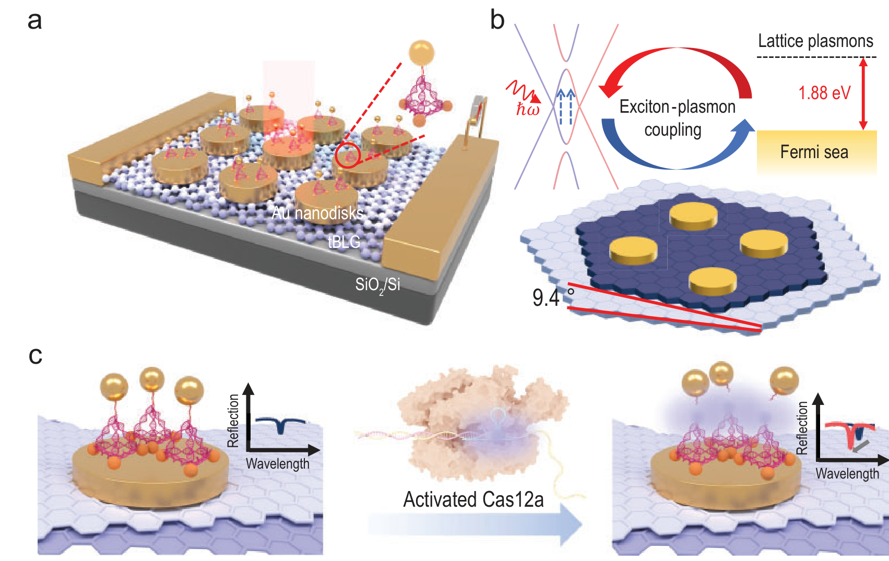

# 能带对齐 / Band Alignment

> [!warning] 本页内容待重写（贡献句部分）
> 本页「相关论文」中部分条目的贡献句为占位或缺失，尚未逐篇核实该论文对本条目的具体贡献。
> 太奶导读与正文可参考。（标记于 2026-08-21）

能带对齐（或称能带结构匹配）描述了当两种半导体或金属接触形成异质结时，它们的导带 ($E_c$)、价带 ($E_v$) 及费米能级 ($E_F$) 如何在界面处相互排列。这种对齐方式决定了载流子（电子和空穴）在界面处的传输行为、电荷转移方向以及激子的复合与解离效率。

## 👵 太奶导读

> [!info] 👵 太奶导读
> 好孩子，这“能带对齐”就像是两座楼房之间的“楼层对接”。想象你有两栋高低不一的楼房（两种材料），每栋楼都有“顶楼”（导带）和“地库”（价带）。
> 
> 如果你想从一栋楼走到另一栋楼，你就得看看两边的楼层是不是一样高。如果这一边的顶楼比那一边的顶楼高出一截（能带偏移），电子往那边走就像下楼梯，顺溜；反过来走就像爬墙，费劲。科学家们每天研究怎么把这些“楼层”对齐，就是为了让电荷、光和自旋这些小人儿能在不同材料之间跑得更欢实，或者被挡在想要的地方。

## 🏗️ 结构概览

在二维范德华异质结中，由于界面无悬挂键，能带对齐通常遵循安德森法则 (Anderson's Rule) 的修正版本。

*   **看图要点**：图中虽然侧重于传感器结构，但隐含了石墨烯与金纳米颗粒接触时的能带排布。导带和价带的相对位置决定了光生载流子是注入金属还是保留在石墨烯中。
*   **来源**：[[../papers/duUltrasensitiveOptoelectronicBiosensor2025]] -> [[../figures/electronic-devices-sensors|传感器与探测器]]

## 🧩 核心分类与原理

### 三种对齐类型 (Type I, II, III)
1.  **Type I (Straddling)**：一种材料的带隙完全包围在另一种材料的带隙之内。电子和空穴都趋向于聚集在窄带隙材料中，适合发光器件。
2.  **Type II (Staggered)**：导带底和价带顶分别位于不同的材料中。电子和空穴会在空间上发生分离，适合光伏探测器。
3.  **Type III (Broken-gap)**：一种材料的导带底甚至低于另一种材料的价带顶。可能导致自发的电荷隧穿或带间隧穿。

### 决定因素
*   **电子亲和能 ($\chi$) 与 功函数 ($\Phi$)**：宏观上的对齐依据。
*   **界面偶极子 (Interface Dipole)**：界面电荷重新分布形成的微观势垒，会使能带发生额外的偏移。
*   **莫尔势调控**：在转角电子学中，莫尔超晶格产生的局域势场会周期性地调制能带对齐。

## 📚 相关论文 (Related Papers)

- [[../papers/duUltrasensitiveOptoelectronicBiosensor2025]]：研究了利用能带对齐（特别是 VHS 位置）与等离激元共振匹配实现高效传感。
- [[../papers/liuSpintronicsTwoDimensionalMaterials2020b]]：讨论了自旋注入时铁磁金属与 2D 通道的能带匹配问题。
- [[../papers/dingPredictionIntrinsicTwodimensional2017a]]
- [[../papers/wuSlidingFerroelectricity2D2021a]]
## 🔗 关联概念与实体 (Related Concepts & Entities)

- [[../concepts/band-offset|能带偏移]]
- [[../concepts/schottky-barrier|肖特基势垒]]
- [[../concepts/work-function|功函数]]
- [[../concepts/vdW-heterostructure]]
- [[../entities/TMDs|TMDs]]
