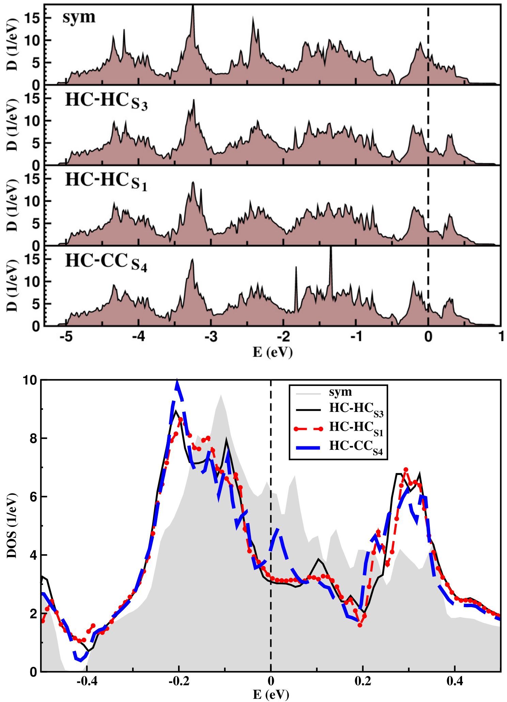

# 电荷密度波 / Charge Density Wave (CDW)

电荷密度波 (Charge Density Wave, CDW) 是低维固体体系中一种典型的集体量子现象。它表现为电子电荷密度的空间周期性调制，通常伴随着晶格原子位置的周期性畸变 (Periodic Lattice Distortion, PLD)。这种状态通常在低温下发生，其驱动力往往源于费米面嵌套 (Fermi Surface Nesting) 导致的一维或二维不稳定性。

## 👵 太奶导读

好孩子，这“电荷密度波”听着玄乎，其实道理挺像咱们在农村晒场上撒米。
本来你把米匀匀实实地铺开在地上（这就是材料里均匀分布的电子），可要是这地儿有点儿不平，或者米粒之间有点儿奇怪的吸引力，这些米就会自动排成一行行、一垄垄的，有的地方米多，有的地方米少（这就是电荷密度波）。
最神奇的是，这些米粒排好队后，连地上的土也会跟着动，原子也得乖乖移个位来配合。这种现象一般得在特别冷的条件下才能看到，温度一高，米粒就又乱跑了。

## 🏗️ 结构概览

在过渡金属硫族化合物 (TMDs) 中，CDW 通常表现为超晶格结构。例如在 2H-NbSe₂ 中，CDW 呈现为 3×3 的超结构。

*   **看图要点**：图中展示了单层中三种最稳定的 CDW 模式：HC (hollow-centered)、CC (chalcogen-centered) 和 HX (hexagonal)。这些模式反映了原子在 CDW 相变发生后，相对于原始格点的位移特征。
*   **来源**：[[../papers/cossuStackingChargedensityWaves2024]] -> [[../figures/heterostructures-stacking|异质结与层间堆积]]

## 🧩 物理机制与费米面嵌套

CDW 的形成传统上由 Peierls 不稳定性解释。在低维体系中，当费米面存在平行片段时，系统响应函数 (Lindhard 函数) 在特定波矢 $q$ 处会发生发散。

*   **关键特征**：在费米能级 $E_F$ 附近出现了态密度的显著耗尽，形成所谓的“赝能隙”。这表明 CDW 的形成伴随着体系总能量的降低，是电子态重新分布以稳定结构的表现。
*   **来源**：[[../papers/cossuStackingChargedensityWaves2024]] -> [[../figures/electronic-bands-dos-fermi|态密度与费米面]]

Inosov 等人的研究指出，虽然费米面嵌套是重要诱因，但嵌套矢量的强度并不直接决定转变温度 $T_{CDW}$，电子-声子耦合 (Electron-Phonon Coupling) 的强弱在其中扮演了更关键的角色。

## 📚 相关论文 (Related Papers)

- [[../papers/cossuStackingChargedensityWaves2024]]：探讨了双层 NbSe₂ 中 CDW 的垂直堆叠效应对电子指纹的影响。
- [[../papers/Inosov2008fermi]]：通过 ARPES 实验验证了 TMDs 中费米面嵌套矢量的非公度性和普适性。
- [[../papers/kawakamiChargedensityWaveAssociated2023]]：研究了 CDW 相关的电子性质及其在不同相中的演化。
- [[../papers/yanagizawaSwitchingChargedensityWave2023]]：演示了 CDW 态的可控切换。
- [[../papers/Barnett2006coexistence]]：从理论分析角度梳理了「Coexistence of Gapless Excitations and Commensurate Charge-Density Wave in the 2H Transition Metal Dichalcogenides」。
- [[../papers/CastroNeto2001charge]]：从理论分析角度梳理了「Charge Density Wave, Superconductivity, and Anomalous Metallic Behavior in 2D Transition Metal Dichalcogenides」。
- [[../papers/Chen2019superconductivity]]：从实验研究角度梳理了「过渡金属二元化合物电荷密度波相的非公度驱动超导电性」。
- [[../papers/Islam2025enhancement]]：从实验研究角度梳理了「有无电荷密度波对过渡金属二元化合物超流体密度的压力诱导增强」。
- [[../papers/Johannes2008fermi]]：从理论分析角度梳理了「费米表面嵌套与金属中电荷密度波的起源」。
- [[../papers/Kang2012dimer]]：从理论分析角度梳理了「Dimer impurity scattering, reconstructed Fermi-surface nesting, and density-wave diagnostics in iron pnictides」。
- [[../papers/Koley2020charge]]：从理论分析角度梳理了「Charge density wave and superconductivity in transition metal dichalcogenides」。
- [[../papers/Laverock2005fermi]]：从实验研究角度梳理了「Fermi surface nesting and charge-density wave formation in rare-earth tritellurides」。
- [[../papers/Makogon2012wave]]：从理论分析角度梳理了「Spin-charge-density wave in a rounded-square Fermi surface for ultracold atoms」。
- [[../papers/Petkov2020hierarchy]]：从实验研究角度梳理了「Hierarchy among the crystal lattice, charge density wave, and superconducting orders in transition metal dichalcogenides」。
- [[../papers/chenFerromagneticNonmagnetic1T2022]]：从理论分析角度梳理了「Ferromagnetic and nonmagnetic 1T′ charge density wave states in transition metal dichalcogenides: Physical mechanisms and charge doping induced reversible transition」。
- [[../papers/chowdhuryReviewTheoreticalComputational]]：从综述角度梳理了「二维电荷密度波材料的理论和计算方法综述」。
- [[../papers/gorkovStrongElectronlatticeCoupling2012]]：从实验研究角度梳理了「强电子-晶格耦合是过渡金属二元化合物电荷密度波转换的机制」。
- [[../papers/guanRecentProgressTwoDimensional2020]]：从综述角度梳理了「Recent Progress in Two‐Dimensional Ferroelectric Materials」。
- [[../papers/hallEnvironmentalControlCharge]]：从实验研究角度梳理了「单层 2H-TaS₂ 中电荷密度波序的环境控制」。
- [[../papers/kaurRecentAdvancesTheoretical2025a]]：从综述角度梳理了「Recent advances in theoretical investigations of sliding ferroelectricity in layered and van der Waals two-dimensional materials」。
- [[../papers/kimObservationPhaseTransition1997]]：从实验研究角度梳理了「Observation of a phase transition from the T phase to the H phase induced by a STM tip in 1T-TaS₂」。
- [[../papers/krishnamurthiSpinChargeDensity2020]]：从理论分析角度梳理了「过渡金属二元化合物界面上的自旋/电荷密度波」。
- [[../papers/lezoualchStudyChargeDensity]]：从理论分析角度梳理了「Study of charge density waves in transition metal dichalcogenides」。
- [[../papers/liMonolayerPuckeredPentagonal2022]]：从理论分析角度梳理了「单层折叠五边形VTe2:一种具有多铁性耦合的二维铁磁半导体」。
- [[../papers/liPhaseTransitions2D2021]]：从综述角度梳理了「Phase transitions in 2D materials」。
- [[../papers/lvUnconventionalHystereticTransition2022]]：从实验研究角度梳理了「Unconventional Hysteretic Transition in a Charge Density Wave」。
- [[../papers/majumdarInterplayChargeDensity2020]]：从实验研究角度梳理了「层状准二维材料中电荷密度波与多带超导电性的相互作用：2H-NbS₂ 与 2H-NbSe₂ 的案例」。
- [[../papers/mostovoyMultiferroicsDifferentRoutes2024]]：从综述角度梳理了「多铁性：磁电耦合的不同途径」。
- [[../papers/nakataRobustChargedensityWave2021]]：从实验研究角度梳理了「Robust charge-density wave strengthened by electron correlations in monolayer 1T-TaSe2 and 1T-NbSe2」。
- [[../papers/nicholsonUniaxialStraininducedPhase2021]]：从实验研究角度梳理了「二维拓扑半金属IrTe2的单轴应变诱导相变」。
- [[../papers/petkovStructureIntercalatedCs2002]]：从实验研究角度梳理了「Structure of Intercalated Cs in Zeolite ITQ-4: An Array of Metal Ions and Correlated Electrons Confined in a Pseudo-1D Nanoporous Host」。
- [[../papers/sunSlidingFerroelectricityTwodimensional2025]]：从综述角度梳理了「Sliding ferroelectricity in two-dimensional materials and device applications」。
- [[../papers/tangCombiningIntrinsicSlidinginduced2025]]：从理论分析角度梳理了「Combining intrinsic and sliding-induced polarizations for multistates in two-dimensional ferroelectrics」。
- [[../papers/wangFormationMechanismTwin2019]]：从实验研究角度梳理了「Formation mechanism of twin domain boundary in 2D materials: The case for WTe2」。
- [[../papers/wongEvidenceMetallic1T]]
- [[../papers/wuElectrostaticGatingIntercalation2022]]
- [[../papers/zhengAnisotropicSuperconductivityTwodimensional2025]]

## 🔗 关联概念与实体 (Related Concepts & Entities)

- [[../concepts/fermi-surface-nesting|费米面嵌套]]（驱动机制）
- [[../concepts/peierls-instability]]（经典物理图像）
- [[../entities/TMDs|TMDs]]（典型载体材料）
- [[../entities/NbSe2|NbSe₂]]（明星 CDW 材料）
