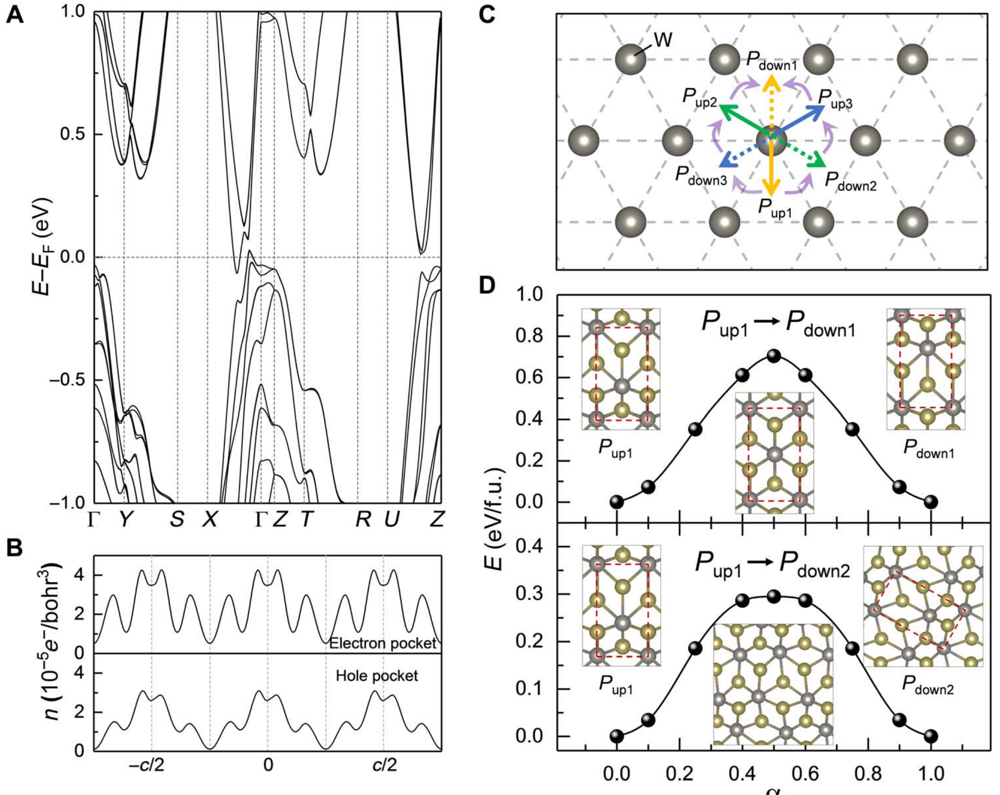

# 狄拉克半金属 / Dirac Semimetal (DSM)

狄拉克半金属 (Dirac Semimetal, DSM) 是一种在三维空间中具有狄拉克点（Dirac point）的物态。不同于外尔半金属，狄拉克半金属同时保持了时间反演对称性和空间反演对称性，因此其狄拉克点实际上是两个手性相反的外尔点在动量空间的重合。这些点在受到特定对称性（如晶格旋转对称性）保护时是稳定的。

## 👵 太奶导读

好孩子，这“狄拉克半金属”你可以把它看成是外尔半金属的“双胞胎合体版”。
外尔半金属里那些“沙漏点”是分开的，一个代表正，一个代表负。而在狄拉克半金属里，由于这材料特别对称（左看右看、前看后看都一样），这两个正负点就重合在了一起。
你可以把它想象成是一个特别完美的、立体的“X”形交叉路口。电子在这个交叉口经过时，速度极快，就像光在真空中跑一样。如果这种对称性被打破了（比如你拉伸一下材料，或者施加个强电场），这对双胞胎就会分开，变成外尔半金属。所以科学家们常把它叫作“三维石墨烯”。

## 🏗️ 结构概览

狄拉克半金属的能带在狄拉克点附近呈线性色散，类似于相对论性的狄拉克方程描述。

*   **看图要点**：图中展示了能带在特定高对称点相交，形成无能隙的线性色散区。
*   **来源**：[[../papers/sharmaRoomtemperatureFerroelectricSemimetal2019]] -> [[../figures/electronic-bands-band-structures|能带结构与带隙]]

## 🧩 对称性保护与演化

*   **对称性要求**：需要空间反演 ($\mathcal{P}$) 和时间反演 ($\mathcal{T}$) 对称性同时存在，且通常受晶体点群对称性（如 $C_n$ 轴）保护。
*   **物理演化**：打破 $\mathcal{P}$ 或 $\mathcal{T}$ 对称性会将狄拉克半金属转变为外尔半金属或拓扑绝缘体。
*   **拓扑性质**：虽然狄拉克点本身拓扑荷为零（正负抵消），但它们是许多拓扑物态的母相。

## 📚 相关论文 (Related Papers)

- [[../papers/sharmaRoomtemperatureFerroelectricSemimetal2019]]：讨论了从非极性相向极性外尔相的转变。
- [[../papers/hanPolarTopologicalMaterials2025]]：极性材料中的拓扑分类。

## 🔗 关联概念与实体 (Related Concepts & Entities)

- [[../concepts/weyl-semimetal|外尔半金属]]（对称性破缺后的状态）
- [[../concepts/topological-insulator|拓扑绝缘体]]（带隙打开后的状态）
- [[../concepts/spin-orbit-coupling|自旋-轨道耦合]]（能带演化的关键）
- [[../entities/Cd3As2|Cd₃As₂]]（经典三维狄拉克半金属）
