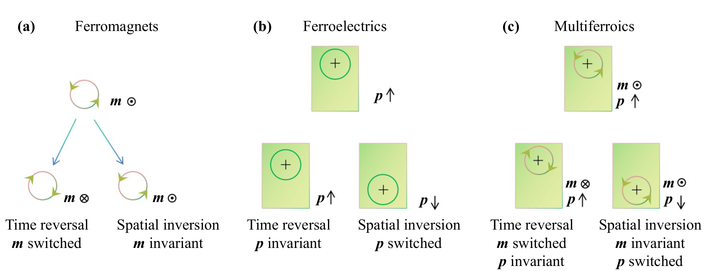
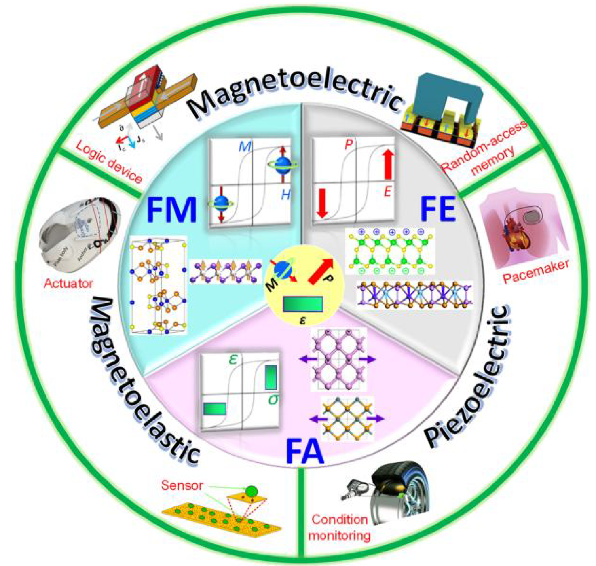

# 磁电耦合 / Magnetoelectric Coupling

磁电耦合（Magnetoelectric Coupling, ME Coupling）是指材料中电极化（Polarization, $P$）与磁化（Magnetization, $M$）之间的交叉调控效应。它包含两个物理过程：
1. **直接磁电效应**：通过外磁场（$H$）诱导电极化改变。
2. **逆磁电效应**：通过外电场（$E$）诱导磁化强度改变。

作为多铁性材料（Multiferroics）最核心的应用价值，磁电耦合为实现“电压写、磁读取”的高能效自旋电子器件提供了物理基础，能够显著降低存储器件的焦耳热损耗。

*图 1：铁性序与空间/时间反演对称性。磁序（Time-reversal symmetry breaking）与电序（Spatial-inversion symmetry breaking）的共存是产生本征磁电耦合的前提（见 [[../papers/RecentAdvancesGrowth2025|Recent Advances 2025]]）。*

---

## 物理机制分类

根据耦合的起源和媒介，磁电耦合主要分为以下几类：

### 1. 本征单相耦合 (Intrinsic Single-Phase)
*   **Ⅰ型多铁性 (Type-I)**：铁电性与磁性起源于不同子系统（如 BiFeO₃ 中的 Bi 6s² 孤对电子驱动铁电性，Fe 3d 电子驱动磁性）。此类材料通常具有较高的相变温度，但磁电耦合较弱，因为两个序参量之间缺乏直接的对称性关联（见 [[../papers/spaldinRenaissanceMagnetoelectricMultiferroics2005|Spaldin 2005]]）。
*   **Ⅱ型多铁性 (Type-II)**：铁电性直接由特定的磁结构（如螺旋磁序）诱导产生。由于铁电序本身是磁序的派生量，其耦合系数极强，但受制于复杂的磁结构，转变温度往往极低（如 TbMnO₃，见 [[../papers/fiebigEvolutionMultiferroics2016|Fiebig 2016]]）。

### 2. 应变介导耦合 (Strain-Mediated)
通过铁电/铁磁异质结界面处的晶格应变传递实现耦合。
*   **方案**：在衬底上外延生长铁电相（如 PZT）与铁磁相（如 CoFe₂O₄）的复合薄膜。
*   **优势**：室温磁电系数可比单相材料高出 2-3 个数量级，是薄膜存储器件的主流路线（见 [[../papers/rameshMultiferroicsProgressProspects2007|Ramesh 2007]]）。

### 3. 电荷转移驱动 (Charge-Transfer Driven) —— 2D 突破
这是近年来在二维范德华（vdW）材料中发现的新机制，打破了传统磁电耦合依赖自旋-轨道耦合（SOC）的限制。
*   **机制**：在双层体系中，铁磁层与反铁磁层之间由于静电势差产生自发的层间电荷转移。这种电荷的非对称分布打破了空间反演对称性，诱导面外极化。
*   **典型案例**：**双层 CrTe₂**。实验证实其在室温大气环境下具有强健的多铁性，并实现了非易失性的“电写磁读”功能（见 [[../papers/tianRoomtemperatureTwodimensionalMultiferroic2026|Tian 2026]]）。

*图 2：双层 CrTe₂ 的电写磁读演示。通过 PFM 写入电畴（左），随后通过 MFM 在相同区域读取到完全对应的磁畴结构（右），实现了室温下的磁电耦合调控。*

### 4. 滑动/莫尔铁电诱导 (Sliding/Moiré Induced)
在 2D 层状材料中，通过层间滑移（Sliding）或莫尔超晶格（Moiré）改变堆叠对称性，从而诱导极化并调控底层磁性（如 HgI₂ 或 In₂Se₃，见 [[../papers/chenStrongSlidingFerroelectricity2024|Chen 2024]]）。

*图 3：滑动铁电机制示意图。层间横向滑移打破中心对称性，诱导产生面外偶极子（红色箭头）。*

### 5. 相锁定与对称性驱动 (Phase-interlocked & Symmetry-driven) —— 2025 新范式
在二维非范德华 $ABO_3$ 氧化物单层中发现的一种强耦合机制，将晶格畸变、电子态与磁序深度绑定。
- **机制**：通过外部应变诱导极低能垒（如 $9.1\text{ meV/atom}$）的有序-有序相变（如 $P4mm \leftrightarrow P4bm$），直接改变电子轨道杂化强度。
- **调控效应**：可实现半导体到半金属（100% 自旋极化）的转变，以及磁序（AFM/FM）的可逆切换。
- **典型案例**：**SrOsO₃** 与 **SrIrO₃**。在 $SrOsO_3$ 中，相变导致价带顶的 Rashba 型自旋劈裂发生能带排序交换；在 $SrIrO_3$ 中则实现了自旋极化电流的“开关”调控（见 [[../papers/zhongHighthroughputExfoliationMultiferroic2025|Zhong et al. 2025]]）。

*图 4：应变诱导的相变与轨道相互作用演化。通过调节扭转角 $\theta$ 和 $pCOHP$ 强度实现物性控制。*

---

## 核心挑战与前沿

| 挑战维度 | 描述 | 相关文献 |
| :--- | :--- | :--- |
| **d0 约束** | 过渡金属 d 电子填充与铁电畸变（需 d0）的化学不相容性 | [[../papers/spaldinRenaissanceMagnetoelectricMultiferroics2005|Spaldin 2005]] |
| **临界厚度** | 铁电性随厚度减小而消失的问题（HfO₂ 和 2D 材料已部分克服） | [[../papers/spaldinAdvancesMagnetoelectricMultiferroics2019|Spaldin 2019]] |
| **金属铁电** | 在导电体系中维持静电极化的物理佯谬（面内金属性与面外绝缘性的解耦） | [[../papers/tianRoomtemperatureTwodimensionalMultiferroic2026|Tian 2026]] |

*图 4：二维多铁材料的应用路线图。涵盖磁电、压电与磁弹耦合的交叉应用（见 [[../papers/RecentAdvancesGrowth2025|Recent Advances 2025]]）。*

## 相关概念
- [[../papers/spaldinRenaissanceMagnetoelectricMultiferroics2005|d0 规则与文艺复兴]]
- [[../papers/fiebigEvolutionMultiferroics2016|多铁性十年演变]]
- [[../papers/tianRoomtemperatureTwodimensionalMultiferroic2026|室温二维多铁金属 CrTe₂]]
- [[../papers/rameshMultiferroicsProgressProspects2007|薄膜与异质结进展]]
