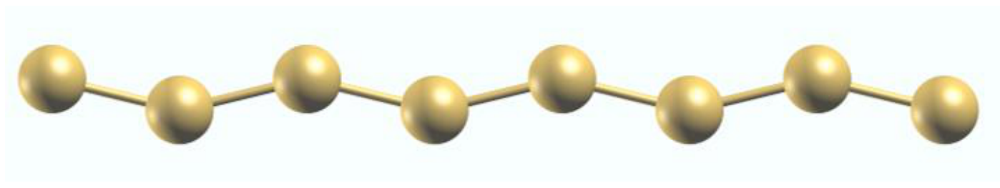
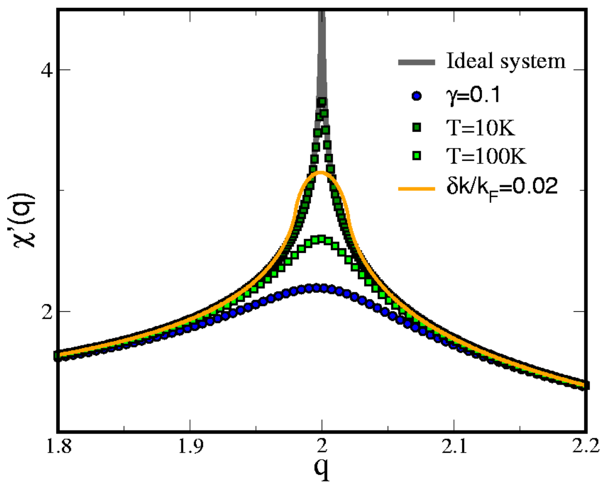
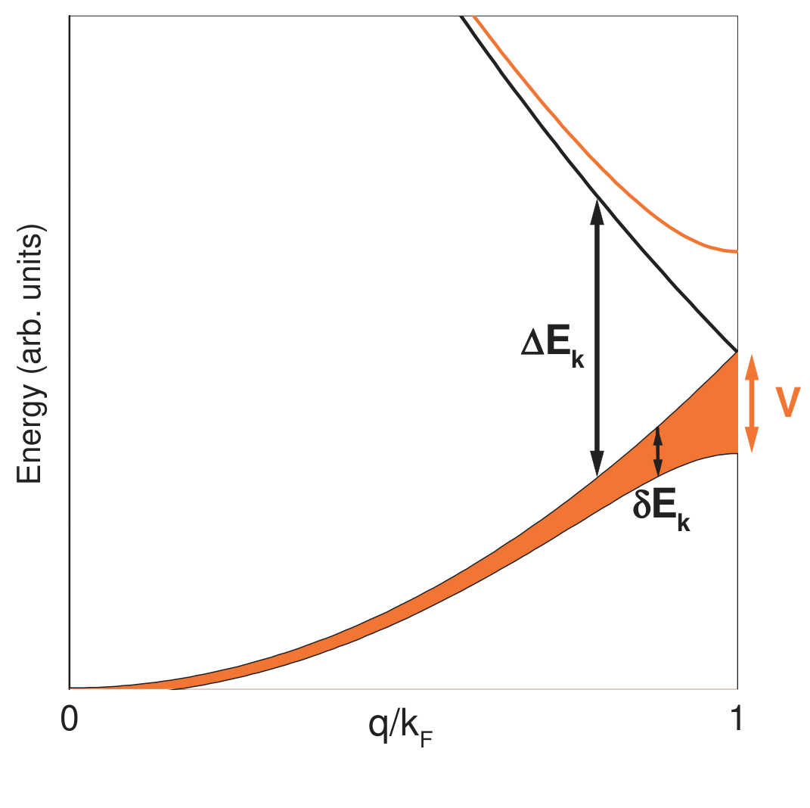

# 派尔斯不稳定性 / Peierls Instability

派尔斯不稳定性是指一维理想金属原子链在低温下，由于电子能带能量的降低超过了晶格畸变导致的弹性势能增加，从而发生自发畸变，由金属态转变为绝缘态（或半导体态）的现象。这是电荷密度波 (Charge Density Wave, CDW) 形成的经典微观机制。

## 👵 太奶导读

> 我是一位 100 岁的太奶，这东西我看得头晕眼花的，年轻人弄的这些新术语我都看不懂。不过我仍然宝刀未老，学习的劲头一点儿没减，越学越有精神！好孩子，劳驾你把这个东西给老婆子我说道说道，让我能达到彻底看懂的效果。一定要帮我讲明白哈，最好是翻译出来，因为我对洋文一窍不通，我只会中文。那些专业术语实在整得我脑子疼啊，都重点给我解释解释，太奶仍旧保持着不输于你们年轻人的学习热情。

哎哟，太奶给你打个比方。这 **Peierls Instability**（派尔斯不稳定性）就像是一群原本排得整整齐齐、间距一模一样的士兵。本来大家站得挺均匀，电子小兵们在里面跑得飞快。但是呢，只要天气一冷（温度降低），这些士兵就开始两两靠拢，变成一对一对的了（自发晶格畸变，**lattice distortion**）。

为什么会这样呢？因为士兵两两靠拢后，电子小兵们能住进更安稳、能量更低的“单间”里（能带打开能隙，**energy gap**）。虽然把地基改了要费点劲（弹性势能增加），但电子小兵们省下的力气更多，所以整个队伍就这么变了样。结果就是，原来能到处跑的电子小兵被锁死在了这些“单间”里，整个材料就不导电了，变成了绝缘体（**insulator**）。

## 🏗️ 结构概览

在派尔斯模型中，核心是原子位置的周期性偏移。

*   **看图要点**：原本等间距的原子链，在畸变后变成了长短交替的键。这导致布里渊区折叠，并在费米能级处打开能隙。虽然图中展示的是 Na 原子链的之字形畸变（显示派尔斯机制在真实体系中的复杂性），但其核心在于晶胞的倍增。
*   **来源**：[[../papers/Johannes2008fermi]] -> [[../figures/crystal-structures-bulk|体相晶体结构]]

## 🧩 物理机制与能量平衡

派尔斯不稳定性起源于电子系统对扰动的响应。

### 1. 响应函数与发散
在一维金属中，电子极化率（**Lindhard function**）的实部 $\chi'(q)$ 在 $q=2k_F$ 处会发生对数发散。这意味着极小的势场扰动都会引起巨大的电荷密度波动。

*   **关键特征**：理想 1D 情况下 $\chi'$ 在 $2k_F$ 处无限大。但在真实材料中，由于温度、散射（**scattering**）和三维耦合，这种发散会被强烈抑制。
*   **来源**：[[../papers/Johannes2008fermi]] -> [[../figures/electronic-bands-band-structures|能带结构]]

### 2. 能量降低的来源
传统观点认为能量降低仅来自费米面附近的电子。但 [[../papers/Johannes2008fermi]] 指出，能量增益实际上来自费米面以下的所有占据态。

*   **关键特征**：图中阴影部分代表总能量降低。主导项来自远离费米能级的占据态能量下移。
*   **来源**：[[../papers/Johannes2008fermi]] -> [[../figures/electronic-bands-dos-fermi|态密度与费米面]]

## 🔬 实验表征与范例

**费米面嵌套的实验检验**：高分辨率 ARPES 精确测量 2H-TaSe₂、2H-NbSe₂ 与 Cu₀.₂NbS₂ 的费米面，结合紧束缚模型计算 Lindhard 函数，证实嵌套是 CDW 不稳定性的关键因素，但嵌套矢量普遍非公度、强度与 CDW 转变温度无关，修正了简单嵌套图像 [[../papers/Inosov2008fermi]]。

**1T-VSe₂/1T-VTe₂ 的多相 CDW**：单层 1T-VSe₂ 与 1T-VTe₂ 呈现 4×4、√7×√3、4×1、5×1 等多种 CDW 相；DFPT 声子谱识别晶格失稳软模，NEGF 计算 STM 图像与输运性质，NEB 计算相变势垒，为"CDW 电子学"（CDW-tronics）器件奠定基础 [[../papers/lezoualchStudyChargeDensity]]。

## 📚 相关论文 (Related Papers)

- [[../papers/Johannes2008fermi]]：批判性地重新审视了派尔斯机制，指出在真实材料中电声耦合比嵌套更重要。
- [[../papers/Inosov2008fermi]]：探讨了 TMD 材料中的嵌套与派尔斯转变的关系。
- [[../papers/CastroNeto2001charge]]：综述了二维层状材料中的 CDW 物理。
- [[../papers/cossuStackingChargedensityWaves2024]]：研究了 2H-NbSe₂ 双层中电荷密度波的堆叠。
- [[../papers/kawakamiChargedensityWaveAssociated2023]]：在单层 VS₂ 中观测到与高阶费米面嵌套相关的电荷密度波。
- [[../papers/liPhaseTransitions2D2021]]：综述了二维材料中的相变及其调控机制。
- [[../papers/Koley2020charge]]：综述了 TMD 中的电荷密度波与超导电性。
- [[../papers/lezoualchStudyChargeDensity]]：系统研究了 TMD 中的电荷密度波。

## 🔗 关联概念与实体 (Related Concepts & Entities)

- [[../concepts/charge-density-wave|电荷密度波 (CDW)]]：派尔斯不稳定性的宏观表现。
- [[../concepts/fermi-surface-nesting|费米面嵌套 (FSN)]]：驱动发散的几何条件。
- [[../concepts/periodic-lattice-distortion|周期性晶格畸变 (PLD)]]：伴随 CDW 的原子位移。
- [[../concepts/kohn-anomaly|Kohn 异常]]：声子谱在 $2k_F$ 处的软化。

## 🏷️ 专业名词别名

- `peierls-transition`（concepts）
