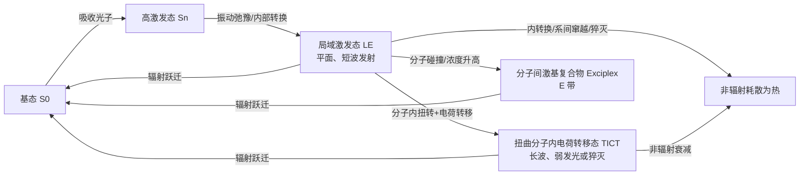

# 光致发光 / Photoluminescence (PL)

光致发光（Photoluminescence, PL）是冷发光的一种：物质吸收紫外、可见或近红外光后，电子被提升到激发态，随后通过辐射跃迁发出光。测得的发光峰位、谱形、强度、量子产率和衰减时间，分别对应激发态能量、发光物种、辐射/非辐射通道的竞争以及动力学过程；因此 PL 既是现象，也是读取微环境和激发态机制的实验窗口。

对分子探针而言，PL 不能只看“亮不亮”。例如，双氰基二苯乙烯体系的吸收峰对溶剂变化很小，但发射峰可大幅红移；同一个光谱还会同时受到极性、粘度、温度、浓度和激发方式影响。[[../papers/Huang2023two]]、[[../papers/Huang2019solvatochromic]] 与 [[../papers/H2017fluorescence]] 共同把这些变化串成了 LE–TICT–Exciplex 的竞争模型，但三篇记录的部分数值口径并不完全相同，不能把不同表格直接拼成一条“普适曲线”。

## 👵 太奶导读

太奶，您可以把发光分子想成一盏会自己泄气的小灯：先用一束光给它充电，它被推到“兴奋状态”，随后要么把能量变成光放出来（辐射跃迁），要么把能量变成热散掉（非辐射跃迁）。发出的光的颜色告诉我们它最后落在哪个能量台阶，光有多亮告诉我们有多少能量成功变成了光；“量子产率”就是每吸收一份光后，真正吐出多少份光的比例。若分子两端发生“分子内电荷转移”（电子从给体搬到受体），并且还把两端拧成近乎直角，就叫“扭曲分子内电荷转移”；周围越极性越容易稳住这种扭曲状态，周围越黏稠越不容易拧动。科学家观察颜色、亮度和快慢的变化，就能反推出分子周围的极性、粘度和温度。

## 🏗️ 物理过程与能级图

典型 PL 过程可按雅布伦斯基图（Jablonski diagram，描述电子能级和跃迁路径的示意图）理解：

*   **关键特征**：吸收先把电子送到高激发态，随后很快落到第一激发态的低振动能级；其后，局域激发态（LE）可直接发光，也可经构型扭转形成 TICT，或在分子相遇时形成 Exciplex。三条路径的相对布居决定 PL 峰位、强度和谱形。
*   **来源**：机制流程依据 [[../papers/H2017fluorescence]]、[[../papers/Huang2019solvatochromic]] 和 [[../papers/Huang2023two]] 对 LE/TICT/Exciplex 的光谱归属与环境依赖整理；对应原始图表在各论文 raw note 中有文字图注，`raw/figures/` 仅提供 manifest，未提供可核对的图片文件。

### 辐射与非辐射竞争

从第一激发态出发，荧光量子产率（fluorescence quantum yield, $\Phi$）由辐射速率 $k_r$ 与非辐射速率之和共同决定：

$$
\Phi = \frac{k_r}{k_r + \sum k_{nr}}
$$

若可用单一主导衰减常数近似，荧光寿命为

$$
\tau = \frac{1}{k_r + \sum k_{nr}} .
$$

因此，PL 变暗既可能是 $k_r$ 变小，也可能是 TICT、内转换、系间窜越或碰撞猝灭使 $k_{nr}$ 变大；仅凭稳态强度不能单独判定是哪条通道。荧光通常在纳秒尺度，磷光则可延伸到微秒至秒级，但本页所列三篇探针论文没有报告可用于校准 LE、TICT 或 Exciplex 的数值寿命。

## 🧩 激发态竞争与物种判据

### LE：局域激发态

局域激发态（locally excited state, LE）主要把电子激发限制在发色团局部，通常保留较平面的共轭构型，发射能量较高、波长较短。在双氰基二苯乙烯探针中，LE 对应短波 B 带（约 380–410 nm，具体峰位随论文和条件而变）。高粘度限制分子内转动时，B 带增强，支持其与平面 LE 构型的联系 [[../papers/Huang2019solvatochromic]]。

### TICT：极性稳定、粘度抑制的长波通道

扭曲分子内电荷转移（twisted intramolecular charge transfer, TICT）是分子内电荷转移（intramolecular charge transfer, ICT）的构型化版本：给体与受体之间发生电荷分离，同时绕单键旋转到近乎正交。极性溶剂可稳定较大的激发态偶极矩，使 TICT 能量降低并带来长波 A 带；但其轨道重叠减小，辐射跃迁可能变弱，非辐射衰减增强，表现为 PL 猝灭。高粘度“冻结”旋转，升温则提高构型重排和溶剂弛豫的机会；这解释了三篇论文中 A/B 带随粘度、温度变化的方向性差异 [[../papers/Huang2019solvatochromic]]。

### Exciplex：浓度和碰撞依赖的第三条发光路径

激基复合物（exciplex）是一个激发态分子与一个基态分子短暂形成的分子间复合物，不是单个分子的 TICT。H2017fluorescence、Huang2019solvatochromic 与 Huang2023two 都将双光子条件下约 542 nm 的 E 带归属于 Exciplex：提高浓度增加分子相遇机会，而纯甘油的高粘度阻碍碰撞，使 E 带消失；低浓度与高浓度下 $I_A/I_B$ 对粘度的趋势相反，也支持其分子间属性。E 带在单光子谱中不明显，论文把原因归为强度低、寿命短和激发路径差异；但没有给出时间分辨寿命，因此“短寿命”的定量尺度仍待确认 [[../papers/H2017fluorescence]]。

## 📈 极性、溶剂弛豫与 Stokes 位移

斯托克斯位移（Stokes shift）是吸收峰与发射峰之间的能量差，严格比较时应使用波数而不是直接相减波长：

$$
\Delta \tilde{\nu} = 10^7\left(\frac{1}{\lambda_{abs}}-\frac{1}{\lambda_{em}}\right)\ \mathrm{cm^{-1}},
$$

其中波长以 nm 计。激发后，分子先经历振动弛豫，再驱动周围溶剂重排；若激发态偶极矩比基态大，极性溶剂会更强地稳定激发态，发射能量下降、峰位红移、Stokes 位移增大。这是溶剂化显色（solvatochromism）的物理基础，也解释了为什么吸收端可基本不动，而发射端强烈移动。

已有记录给出了两组不能直接混用的 P1/1a 口径：Huang2023two 的表格在 $c=10^{-5}$ M、单光子 $λ_{ex}=410$ nm 下记录环己烷 401→445 nm、DMSO 409→641 nm；按波数定义换算，约为 $2.47\times10^3$ 和 $8.85\times10^3$ cm⁻¹。Huang2019solvatochromic 的 Table 1 则记录 P1 为 410→451 nm 和 410→603 nm，条件同样是 $c=10^{-5}$ M、$λ_{ex}=410$ nm。两组数据都支持“基态吸收弱响应、激发态发射强响应”的判断，但应保留原论文的测量口径，不应将 445→641 与 451→603 当成同一张表的两端。

在极性拟合上，H2017fluorescence 与 Huang2023two 给出的发射波数—溶剂参数相关性为：$r^2=0.90$（$E_T(30)$、Kosower $Z$、$δ\Delta G^{\ne}$）、$0.85$（Kamlet–Taft $π^*$）和 $0.82$（Lippert–Mataga $Δf$）。这些相关性说明响应主要受广义极性、极化率及氢键共同影响，而不是只由介电常数单独决定；质子性溶剂对给体的氢键稳定还会造成相对蓝移。

## 🔬 PL 的定量读法与尺度效应

*   **量子产率不是亮度本身**：$\Phi$ 是发射光子数与吸收光子数之比；实际 PL 强度还受浓度、吸光度、光路收集效率、自吸收和激发功率影响。已有论文用 0.05 M $H_2SO_4$ 中硫酸奎宁（$\Phi=0.546$）作相对参比，并报告约 ±10% 的误差；不同论文的表格必须连同参比、浓度和溶剂一起看。
*   **双光子 PL 还要看 $δ_{TPA}$**：双光子激发需要近乎同时吸收两个低能光子，双光子吸收截面 $δ$ 用 GM（$10^{-50}\ \mathrm{cm^4\,s\,photon^{-1}}$）表示。Huang2023two 的 1a 在环己烷中给出 5560 GM、在 DMF 中 130 GM；Huang2019solvatochromic 的 P1 表格给出 6670 GM（环己烷），并在 800–840 nm 范围测量。数值随溶剂和表格口径变化，不能脱离条件比较。
*   **浓度是一个尺度变量**：LE 与 TICT 是单分子路径，而 Exciplex 需要两个分子相遇；因此把浓度从 $10^{-6}$ M 提高到 $3\times10^{-6}$ M 会改变 $I_A/I_B$ 和 E 带，甚至使粘度响应方向反转 [[../papers/Huang2019solvatochromic]]。
*   **粘度和温度改变的是动力学窗口**：高粘度降低分子内转动和分子间碰撞，升温降低甘油粘度并加快溶剂弛豫；两者都会改变各发光态的布居，但不是单一“亮度—温度”标尺。

## 🧪 特殊发光现象：双光子三重荧光

双光子激发荧光（two-photon excited fluorescence, TPEF）利用两个长波长光子同时激发分子。H2017fluorescence 首次在该体系中明确报告双光子三重荧光：B 带来自 LE，A 带来自 TICT，约 542 nm 的 E 带来自分子间 Exciplex；Huang2019solvatochromic 通过温度、粘度和浓度依赖进一步区分三种物种；Huang2023two 则在 790 nm 双光子激发下重复给出三带及其环境响应。这个判据的关键不是“出现三个峰”本身，而是三个峰对粘度、温度、浓度和激发方式呈现不同响应。

## 📚 相关论文 (Related Papers)

- [[../papers/H2017fluorescence]]：首次报告双光子激发下的 LE/TICT/Exciplex 三重荧光，并用温度、粘度、浓度和极性依赖建立物种归属；同时给出 445–641 nm、5560 GM 等一组代表性量级。
- [[../papers/Huang2019solvatochromic]]：系统比较 P1/P2 的溶剂化显色、量子产率、双光子截面以及甘油—乙醇粘度梯度，强调浓度依赖和三带信号对环境判读的影响。
- [[../papers/Huang2023two]]：在 1a/1b 体系中给出含 Table 1 的吸收、发射、量子产率和双光子截面数据，并将 1a 的 790 nm 双光子激发与 542 nm E 带联系到多参数环境传感。

## 📋 关键参数表

下表只列仓库现有论文卡片、raw note 和 manifest 中能够核对到的数值；数值属于特定分子、溶剂、浓度和测量协议，不是 PL 的普适常数。Huang2019solvatochromic 与 H2017fluorescence 的 P1 记录和 Huang2023two 的 1a 记录存在两组峰位/截面口径，故分行保留。

| 参数 | 数值 | 条件 / 来源 | 物理含义或限制 |
| :--- | :--- | :--- | :--- |
| 1a 吸收峰 | 396–409 nm | Huang2023two Table 1/2；$c=10^{-5}$ M | 基态吸收峰对溶剂变化较小 |
| 1a 发射峰 | 445–641 nm | Huang2023two；$c=10^{-5}$ M，$λ_{ex}=410$ nm | 溶剂化显色范围约 196 nm；环己烷→DMSO |
| 1a 荧光量子产率 $\Phi$ | 0.013–0.812 | Huang2023two；相对 0.05 M $H_2SO_4$ 中硫酸奎宁，误差约 ±10% | 二氧六环最高，DMSO 约 0.013；极性环境的非辐射通道增强 |
| 1a 双光子激发峰 | 790 nm | Huang2023two；表格所列溶剂 | 近红外双光子激发条件，不能等同于所有溶剂下的绝对最优峰 |
| 1a 峰值双光子吸收截面 $δ_{max}$ | 130–5560 GM | Huang2023two Table 1/2；环己烷→DMF | 强烈依赖溶剂，GM = $10^{-50}\ \mathrm{cm^4\,s\,photon^{-1}}$ |
| P1 吸收峰 | 401–419 nm | Huang2019solvatochromic Table 1；$c=10^{-5}$ M | 与 1a 的表格范围相近，但不是同一表格 |
| P1 发射峰 | 451–603 nm | Huang2019solvatochromic Table 1；$c=10^{-5}$ M，$λ_{ex}=410$ nm | 该论文表格口径；不要与 445–641 nm 直接拼接 |
| P1 荧光量子产率 $\Phi$ | 0.058–0.885 | Huang2019solvatochromic Table 1；硫酸奎宁参比，误差约 ±10% | 二氧六环约 0.885，MeCN 约 0.058 |
| P1 双光子激发峰 | 800–840 nm | Huang2019solvatochromic Table 1 | 随溶剂记录为 800、810 或 840 nm |
| P1 峰值双光子吸收截面 | 1450–6670 GM | Huang2019solvatochromic Table 1；Xu–Webb 比较法，荧光素参比，截面误差约 ±20% | 表格值与 2017/2023 摘要口径不同，需保留来源 |
| 三重荧光 E 带 | 约 542 nm | H2017fluorescence / Huang2019solvatochromic / Huang2023two；甘油–乙醇混合体系，双光子激发 | 归属 Exciplex；纯甘油高粘度下消失 |
| 三重荧光 B、A 带 | 约 380–410 nm、约 470–485 nm | 各论文双光子粘度实验；具体峰位随浓度、温度和记录口径变化 | 分别归属 LE、TICT，不应把单一峰位当成普适常数 |
| 发光寿命 $τ$ | 未报告数值 | 三篇论文主要为稳态/双光子光谱；仅定性称 E 带“强度低、寿命短” | 不能据此填写 ns、ps 或任意衰减常数；需时间分辨实验确认 |

## 🔗 关联概念与实体 (Related Concepts & Entities)

- [[../concepts/fluorescence-quantum-yield|荧光量子产率]]（辐射与非辐射通道竞争）
- [[../concepts/stokes-shift|斯托克斯位移]]（吸收—发射能量差）
- [[../concepts/solvatochromism|溶剂化显色]]（极性驱动的峰位移动）
- [[../concepts/local-excited-state|局域激发态]]（LE/B 带）
- [[../concepts/ict-mechanism|分子内电荷转移]]
- [[../concepts/tict-mechanism|TICT 机制]]（扭转电荷转移态）
- [[../concepts/solvent-relaxation|溶剂弛豫]]
- [[../concepts/exciplex|激基复合物]]（分子间 E 带）
- [[../concepts/triple-fluorescence|三重荧光]]
- [[../concepts/two-photon-excitation|双光子激发]]
- [[../concepts/two-photon-absorption-cross-section|双光子吸收截面]]
- [[../entities/dicyanostilbene-1a|二氰基二苯乙烯 1a / P1 探针]]
