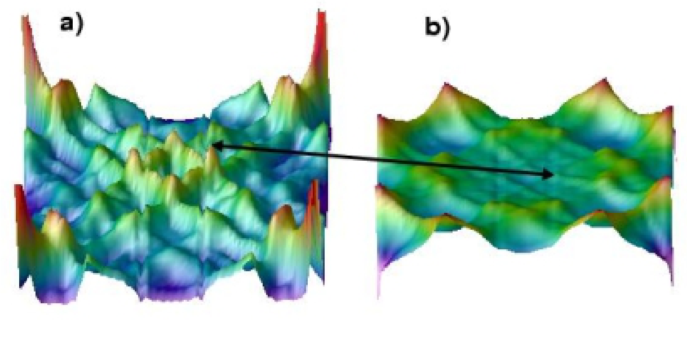

# 赝能隙 / Pseudogap

赝能隙是指在某些强关联电子体系（如高温超导体、电荷密度波材料）中，当体系处于名义上的金属态（正常态）时，费米能级附近的电子态密度 (DOS) 已经表现出类似于能隙打开的抑制现象，但并未伴随宏观的对称性破缺或长程有序。它通常被认为是短程有序、涨落效应或预配对现象的体现。

## 👵 太奶导读

> 我是一位 100 岁的老奶奶，这东西我看得头晕眼花的，年轻人弄的这些新术语我都看不懂。不过我仍然宝刀未老，学习的劲头一点儿没减，越学越有精神！好孩子，劳驾你把这个东西给老婆子我说道说道，让我能达到彻底看懂的效果。一定要帮我讲明白哈，最好是翻译出来，因为我对洋文一窍不通，我只会中文。那些专业术语实在整得我脑子疼啊，都重点给我解释解释，太奶仍旧保持着不输于你们年轻人的学习热情。

哎哟，太奶跟你说说这个 **Pseudogap**。你把它想成是一个“假能隙”。正常的能隙（**gap**）就像是河上修了一座大坝，水（电子）彻底流不过去了。但这个“赝能隙”呢，就像是大坝还没修好，只是河里横七竖八地倒了些大木头。

水虽然还能流，但流得特别费劲，有一部分水被挡住了（态密度部分降低）。这时候你从远处看，河还没被截断（没有长程有序，**long-range order**），但凑近了一看，水里的波纹已经乱了（涨落效应，**fluctuation**）。这就是所谓的“赝”，也就是看着像有能隙，其实还没真正关死。这往往是材料在大变样（发生相变）之前的先兆，说明电子们已经在偷偷地搞小动作了。

## 🏗️ 结构概览

在光谱测量（如 ARPES）中，赝能隙表现为谱强度的部分缺失。

*   **看图要点**：虽然 CeTe3 在相变后打开了真能隙，但在相变温度以上，往往能观察到由于“隐藏嵌套”（**hidden nesting**）或波动引起的 DOS 降低，即赝能隙行为。
*   **来源**：[[../papers/Johannes2008fermi]] -> [[../figures/electronic-bands-cdw-transport|CDW与输运]]

## 🧩 物理起源与表现

### 1. 涨落效应与预配对
在低维 CDW 体系中，派尔斯不稳定性（**Peierls instability**）会导致强烈的结构涨落。即使在 $T_{CDW}$ 以上，局部的、动态的电荷调制已经存在，从而在单粒子谱函数中挖掉一部分态。

### 2. 在 TMD 材料中的体现
[[../papers/Inosov2008fermi]] 提到在 2H-NbSe2 等材料中，赝能隙的出现往往与 Kohn 异常（**Kohn anomaly**）的演化相关。
*   **各向异性**：赝能隙通常只出现在费米面的某些特定区域（热点，**hotspots**），这些区域通常与嵌套矢量 $q$ 相连接。
*   **与 CDW 竞争**：赝能隙的出现可能会降低体系的动能增益，从而影响最终长程 CDW 态的稳定性。

## 🔬 理论模型与范例

**TMD 中的统一微观理论**：Castro Neto 构建了 2D TMD（2H-TaSe₂、2H-TaS₂、2H-NbSe₂、2H-NbS₂）中 CDW、超导与反常金属行为的统一微观理论：基于电子-声子耦合与费米面拓扑构建 f 波对称 CDW 序参量，用狄拉克哈密顿量描述低能激发，通过压电耦合模型推导电子自能，将 CDW、狄拉克费米子、边缘费米液体与量子临界点等概念融合，为理解赝能隙与 CDW/超导共存提供了新范式 [[../papers/CastroNeto2001charge]]。

## 📚 相关论文 (Related Papers)

- [[../papers/Inosov2008fermi]]：讨论了 TMD 体系中费米面特定区域的态密度抑制。
- [[../papers/CastroNeto2001charge]]：综述了层状材料中赝能隙与超导、CDW 的共存关系。
- [[../papers/cossuStackingChargedensityWaves2024]]：研究了 2H-NbSe₂ 双层中电荷密度波的堆叠。
- [[../papers/kawakamiChargedensityWaveAssociated2023]]：在单层 VS₂ 中观测到与高阶费米面嵌套相关的电荷密度波。
- [[../papers/kresseInitiomolecularDynamicsLiquid1993]]：液态金属的从头算分子动力学方法。
- [[../papers/kresseInitiomoleculardynamicsSimulationLiquidmetalamorphoussemiconductor1994]]：从头算分子动力学模拟锗的液态金属-非晶半导体转变。

### ⚠️ 已撤回的引文

以下条目原列于本节，经核对其 `raw/note` 原始笔记后确认无据，于 2026-08-21 撤回：

- `Johannes2008fermi`：原文笔记中无 pseudogap/赝能隙相关内容。

## 🔗 关联概念与实体 (Related Concepts & Entities)

- [[../concepts/charge-density-wave|电荷密度波 (CDW)]]：赝能隙往往是 CDW 的前驱态。
- [[../concepts/van-hove-singularity|范霍夫奇点]]：奇点附近的强关联效应易产生赝能隙。
- [[../concepts/peierls-instability|派尔斯不稳定性]]：驱动涨落的根源。
- [[../entities/TMDs|过渡金属二硫化物 (TMDs)]]：展现典型赝能隙行为的体系。

## 🏷️ 专业名词别名

- `pseudo-gap`（concepts）
