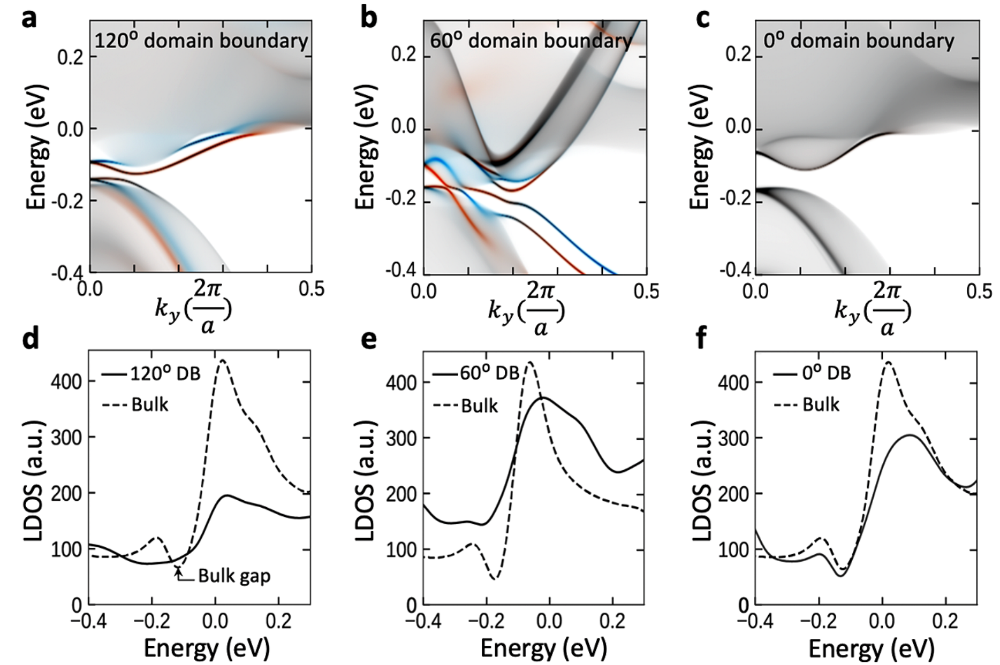

# 量子自旋霍尔效应 / Quantum Spin Hall Effect (QSHE)

量子自旋霍尔效应 (Quantum Spin Hall Effect, QSHE) 发生于二维拓扑绝缘体（也称为量子自旋霍尔绝缘体）中。其特征是体系内部绝缘，而在边界处存在一对反向运动且自旋取向相反的螺旋边缘态 (helical edge states)。由于这些态受时间反演对称性保护，电子的背散射被完全抑制，从而实现无耗散的自旋输运。

## 👵 太奶导读

好孩子，这“量子自旋霍尔效应”就像是在超薄材料边缘修了两条“单向行驶的高速公路”。
这两条路是给电子走的：一条路专门让“头朝上”的电子往左跑，另一条路专门让“头朝下”的电子往右跑。因为路的方向和电子自旋的方向是绑在一起的，所以哪怕路上有点儿小垃圾（杂质），电子也不会撞车或者调头。
最厉害的是，只要你不拿磁铁去干扰，这两条路上的电就不会发热（无耗散），因为电子不会被撞回去。这就解决了咱们电子产品容易发烫的大难题。

## 🏗️ 结构概览

QSHE 体系的特征是存在穿过体带隙的螺旋边缘态。

*   **看图要点**：图中红蓝交错的线表示了受拓扑保护的一对边缘态，分别对应相反的自旋。
*   **来源** [[../papers/pedramraziManipulatingTopologicalDomain2019]] -> [[../figures/electronic-bands-band-structures|能带结构与带隙]]

## 🧩 物理本质与鉴别

*   **螺旋边缘态 (Helical Edge States)**：自旋与动量一一对应，是 QSHE 的最核心特征。
*   **Z2 不变量**：QSHE 材料由 $Z_2 = 1$ 的拓扑指数标识。
*   **实验观测**：通常表现为电导随样品尺寸无关的量子化平台 $G = 2e^2/h$（每个边缘贡献 $e^2/h$）。

在单层 1T'-WSe₂ 中，这种效应已在实验中通过 STM 观测到的边缘态得到初步印证。

## 🔬 材料范例与调控

**1T' 相 TMD 与相变调控**：1T' 相过渡金属二硫族化物（如 WSe₂、MoTe₂）被证实为二维量子自旋霍尔绝缘体；通过相变工程（应变、静电掺杂、激光图案化等）可在 2H 半导体相与 1T' 拓扑相之间切换，为可调控的拓扑电子器件提供了平台 [[../papers/liPhaseTransitions2D2021]]。

## 📚 相关论文 (Related Papers)

- [[../papers/pedramraziManipulatingTopologicalDomain2019]]：利用畴界操控探讨 QSHI 中的边缘态输运。
- [[../papers/hanPolarTopologicalMaterials2025]]：极性材料中的拓扑保护态。
- [[../papers/feiFerroelectricSwitchingTwodimensional2018a]]：在二维金属 WTe₂ 中实现铁电开关。
- [[../papers/liPhaseTransitions2D2021]]：综述了二维材料中的相变及其调控机制。

## 🔗 关联概念与实体 (Related Concepts & Entities)

- [[../concepts/topological-insulator|拓扑绝缘体]]（QSHE 的所属类别）
- [[../concepts/time-reversal-symmetry|时间反演对称性]]（量子化平台的保护伞）
- [[../concepts/spin-orbit-coupling|自旋-轨道耦合]]（驱动力）
- [[../entities/WSe2|WSe₂]]（典型的 1T' 相 QSHI 材料）

## 🏷️ 专业名词别名

- `quantum-spin-hall`（concepts）
