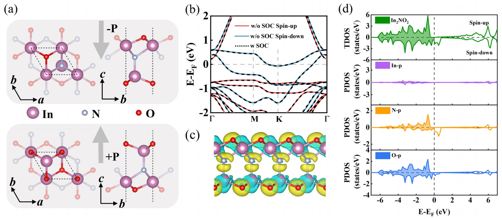

# 拓扑自旋织构 / Topological Spin Texture

拓扑自旋织构（topological spin texture）指在实空间中形成的、由**非平庸拓扑荷（skyrmion number / winding number）**保护的磁性织构，包括斯格明子（skyrmion）、反斯格明子（antiskyrmion）、双半子（bimeron）、磁涡旋与磁泡等。它们的稳定性源于拓扑保护，不依赖缺陷钉扎，且尺寸小、可被电流/电场高效驱动，是新型自旋电子学器件的核心信息载体。

## 👵 太奶导读

乖孙，这一条讲的是「拓扑自旋织构」——就是材料里的小磁针（自旋）集体摆出的各种"花活儿"造型。
普通的磁体里小磁针都朝一个方向，但有些材料里小磁针会拧成一个个小旋涡（斯格明子）、或两个连在一起的"麻花"（双半子）。这些造型有个好处：特别结实，因为它们是"打了结"的（拓扑保护），你想把它拆散得费很大劲。而且它们个头小、又轻巧，用一点点电流就能推着它们跑，正好可以用来当"信息的小货柜"，一个旋涡存一位数据。科学家最近还发现，用铁电材料"拧"一下就能让这些小旋涡消失或出现，等于用电压开关磁性。

## 🏗️ 结构概览

拓扑自旋织构的稳定性与形态由**空间反演对称性破缺**（产生 DMI）、**磁各向异性**与**外磁场/应变**三者的竞争决定。

*   **看图要点**：示意了本征地打破空间反演对称性的二维材料中，自旋织构（斯格明子/双半子）的形成与随外场、应变演化的拓扑相图。
*   **来源**：[[../papers/wangTunableD0Topological2025b]]

## 🧩 核心内容与机制 (Core Content)

- **形成条件**：Dzyaloshinskii-Moriya 相互作用（DMI，源于自旋-轨道耦合+反演对称性破缺）使相邻自旋发生倾斜，与铁磁交换、垂直磁各向异性（PMA）竞争，稳定非共线/非共面织构。
- **拓扑荷**：斯格明子数 $Q = \frac{1}{4\pi}\int m\cdot(\partial_x m \times \partial_y m)\,d^2x$。$|Q|=1$ 的织构受拓扑保护，不能通过连续形变退化为均匀态。
- **类型**：Néel 型（径向收缩/发散）、Bloch 型（切向环绕）、反斯格明子（鞍点型拓扑荷）、双半子（面内版斯格明子）等，取决于 DMI 类型与体系维度。
- **二维调控新进展**：在铁电-铁磁异质结/单层多铁中，可通过铁电极化翻转或应变改变 DMI 强度与 MAE，实现拓扑磁态的非易失电控与稳定性切换。
- **d0 磁性**：部分二维材料中磁性源于 $p$ 轨道电子（d0 磁性），配合本征铁电性可提供更强的 DMI 与更高的织构稳定性（如 In$_2$NO$_2$ 体系）。

## 📊 参数对照 (Parameters)

| 织构类型 | 拓扑荷 Q | 维度 | 稳定因素 | 驱动方式 |
|---|---|---|---|---|
| Néel 斯格明子 | ±1 | 2D 面内 | 界面 DMI + PMA | 电流（自旋转移/自旋轨道矩） |
| Bloch 斯格明子 | ±1 | 2D 面内 | 体 DMI | 电流、磁场梯度 |
| 反斯格明子 | ±1 | 2D 面内 | 各向异性 DMI | 电流 |
| 双半子 bimeron | ±1 | 2D 面内（赝自旋） | 面内磁化 + DMI | 电流 |
| 磁涡旋 vortex | 0 | 2D 面内 | 几何约束 | 磁场/自旋波 |
| 磁泡 bubble | 0~1 | 2D 面内 | 垂直各向异性 | 磁场、电流 |

## 📚 相关论文 (Related Papers)

- [[../papers/wangTunableD0Topological2025b]]：单层多铁 In$_2$NO$_2$ 中由 $p$ 轨道磁性（d0）驱动的可调拓扑磁态，垂直/水平磁场下分别形成斯格明子与双半子，应变增强 DMI。
- [[../papers/zhangNonvolatileControlTopological2025]]：CrInTe$_2$/In$_2$Se$_3$ 多铁异质结中，铁电极化翻转协同调控 DMI 与 MAE，实现拓扑磁性（斯格明子晶格/铁磁态）的非易失切换与电流驱动动力学调控。

## 🔗 关联概念与实体 (Related Concepts & Entities)

- [[../concepts/skyrmion|斯格明子]]：最典型的拓扑自旋织构。
- [[../concepts/topological-defects|拓扑缺陷]]：织构作为受拓扑荷保护的实空间缺陷。
- [[../concepts/chirality|手性]]：Néel/Bloch 织构的手性取向由 DMI 决定。
- [[../concepts/magnetic-anisotropy|磁各向异性]]：决定织构面内/面外取向与稳定性。
- [[../concepts/spin-orbit-coupling|自旋-轨道耦合]]：DMI 的微观起源。
- [[../concepts/spin-spiral|自旋螺旋]]：非共线磁序的相邻形态。
