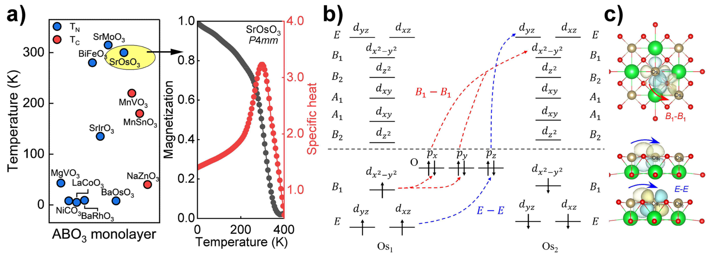

# BiFeO3 (BFO)

铋铁氧体（Bismuth Ferrite, BiFeO3）是多铁性材料研究领域的“明星”材料，也是目前唯一在室温下同时具备强铁电性（$T_C \approx 1103\text{ K}$）和反铁磁性 ($T_N \approx 643\text{ K}$) 的单相材料。由于其高转变温度和显著的磁电耦合效应，BFO 在非挥发性存储器、自旋电子器件和多功能传感器中具有巨大的应用潜力。

## 1. 结构与多铁性机制
BiFeO3 属于典型的 **Type-I 多铁性材料**，其铁电性和磁性起源于不同的子晶格：
- **铁电性起源**：由 $Bi^{3+}$ 离子的 $6s^2$ 孤对电子（Lone-pair）驱动的结构畸变产生，极化方向沿伪立方体的 $[111]_c$ 方向，室温极化强度可达 $\sim 100\text{ \mu C/cm^2}$ [[../../raw/note/fiebigEvolutionMultiferroics2016|Evolution of multiferroics]]。
- **磁性起源**：由 $Fe^{3+}$ 离子间的超交换相互作用产生，表现为 G 型反铁磁序。在块体中，受二次非齐次交换作用驱动，会形成波长约 $62\text{ nm}$ 的旋摆磁结构（Cycloidal spin structure），这往往会抵消宏观净磁矩 [[../../raw/note/rameshMultiferroicsProgressProspects2007|Multiferroics: progress and prospects in thin films]]。

## 2. 应变工程与相竞争
在薄膜形态下，外延应变（Epitaxial strain）是调控 BFO 物理特性的重要手段：
- **R-T 相竞争**：通过在 LaAlO3 等衬底上施加大的压缩应变，BFO 可以从块体状的菱方相（R-like, $c/a \approx 1.01$）转变为“超级四方相”（T-like, $c/a \approx 1.25$）。
- **混合相区域**：在特定的中等应变下，R 相和 T 相会纳米级共存，形成复杂的条纹状结构。这种混合相界面具有巨大的电致形变响应（$\sim 5\%$），类似于铁电体中的准同型相界（MPB）效应 [[../../raw/note/martinThinfilmFerroelectricMaterials2016|Thin-film ferroelectric materials: models and mechanisms]]。

## 3. 畴壁物理与输运特性
BFO 的铁电畴壁具有丰富的物理内涵，与其绝缘的块体性质截然不同：
- **导电畴壁**：实验发现 BFO 的 $71^\circ$ 和 $109^\circ$ 畴壁展现出明显的局部导电性，而块体本身是宽禁带绝缘体。这种导电性与畴壁处的结构畸变导致的能带偏移以及氧空位富集有关。
- **极化翻转**：BFO 具有多种翻转路径，通过交叉场（Cross-field）控制，可以利用电场翻转铁电极化，进而通过铁弹性应变耦合带动反铁磁轴的旋转，实现非易失性的磁电控制 [[../../raw/note/liMagnetoelectricDomainsCrossfield2008a|The magnetoelectric domains and cross-field switching in multiferroic BiFeO3]]。

## 4. 超薄膜中的尺寸效应与 Kittel 定律
在超薄 BFO 薄膜中，畴宽（$w$）与厚度（$h$）的比例关系遵循 **Kittel's Law** ($w \propto \sqrt{h}$)。
- **AFD 相互作用**：与传统铁电体不同，BFO 的畴壁能量平衡不仅取决于偶极子相互作用，还深受抗铁畸变（Antiferrodistortive, AFD）分量的影响。研究表明，AFD 这种短程相互作用是主导 BFO 超薄膜畴尺寸缩放的关键因素 [[../../raw/note/prosandeevKittelLawInBiFeO3Ultrathin2010|Kittel law in BiFeO3 ultrathin films: The role of antiferrodistortive motions]]。

## 5. 二维单层特性 (2D Monolayer Properties)

根据 2025 年高通量剥离研究 [[../../raw/note/zhongHighthroughputExfoliationMultiferroic2025|Zhong et al. 2025]]，BiFeO3 在二维极限下展现出独特的物性：

- **剥离可行性**：通过键密度与结合强度判据筛选，BFO 单层的**剥离能**约为 **$0.109 \text{ eV/Å}^2$**，这在能量上是可实现的，与典型的范德华材料（如石墨烯 $0.013 \text{ eV/Å}^2$）及实验已获得的 2D 非范德华氧化物（如 Fe2O3 $0.108 \text{ eV/Å}^2$）相当。
- **磁转变温度**：单层 BFO 的 Néel 温度预测为 **$T_N \approx 280 \text{ K}$**，接近室温，是实现常温 2D 自旋电子器件的理想候选。
- **相锁定与应变调控**：
    - **相变路径**：在面内应变下可实现 **$Pc \text{ (AFM)} \to P4mm \text{ (FM)}$** 的相变。
    - **临界应变**：需要 $a$ 轴压缩 4%，$b$ 轴压缩 3%。
    - **能带调制**：随相变发生，带隙从 $3.31 \text{ eV}$ 急剧减小至 **$0.60 \text{ eV}$**，且带边附近的自旋极化显著增强。

*图 2: (c) 筛选出的多铁性 ABO3 单层的剥离能与带隙分布图。BiFeO3 (BFO) 位于低剥离能区域，证明其从非范德华块体中剥离的可行性。图表来源：[[../../raw/note/zhongHighthroughputExfoliationMultiferroic2025|Zhong et al. 2025]]*

## 6. 本库相关代表性论文
- [[../../raw/note/zhongHighthroughputExfoliationMultiferroic2025|Zhong et al. 2025]]：二维非范德华多铁单层的高通量剥离与相调控研究。
- [[../../raw/note/fiebigEvolutionMultiferroics2016|fiebigEvolutionMultiferroics2016]] (2016)
- [[../../raw/note/martinThinfilmFerroelectricMaterials2016|martinThinfilmFerroelectricMaterials2016]] (2016)
- [[../../raw/note/prosandeevKittelLawInBiFeO3Ultrathin2010|prosandeevKittelLawInBiFeO3Ultrathin2010]] (2010)
- [[../../raw/note/rameshMultiferroicsProgressProspects2007|rameshMultiferroicsProgressProspects2007]] (2007)
- [[../../raw/note/liMagnetoelectricDomainsCrossfield2008a|liMagnetoelectricDomainsCrossfield2008a]] (2008)
- [[../../raw/note/hillWhyAreThere2000a|hillWhyAreThere2000a]] (2000)
- [[../../raw/note/spaldinRenaissanceMagnetoelectricMultiferroics2005|spaldinRenaissanceMagnetoelectricMultiferroics2005]] (2005)
