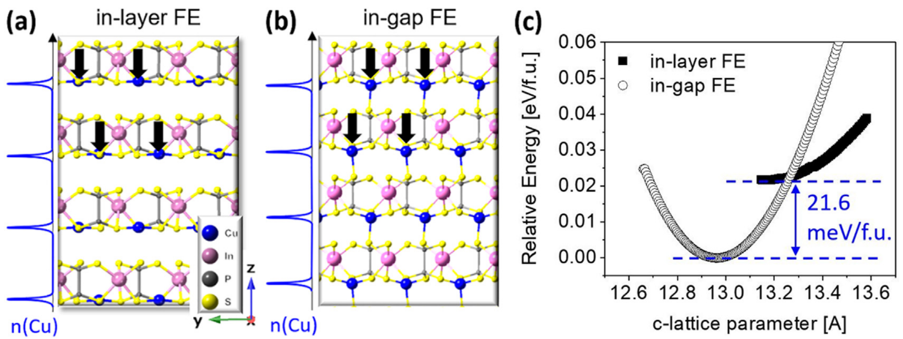
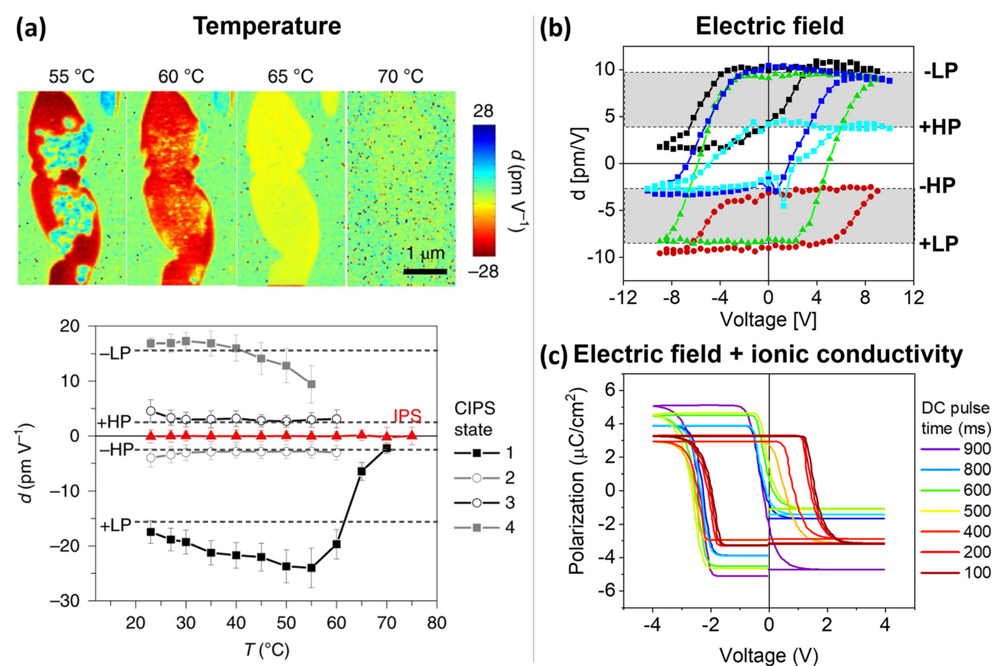

# 硫磷酸铜铟 / Copper Indium Thiophosphate (CuInP2S6, CIPS)

CuInP2S6（CIPS）是二维过渡金属硫代磷酸盐（TMTPs，ABP2X6）家族的明星铁电体，以**铁电-离子导体双功能性**与**多极性相竞争**著称。其铁电性源于 Cu⁺ 离子在 S 八面体笼四重势阱中的协同位移，居里温度 $T_c \approx 315\text{ K}$，减薄至约 2–4 nm 仍保持稳健的室温面外铁电性 [[../papers/guoAdvancesTwodimensionalFerroelectric2025]] [[../papers/FerroelectricityMultiferroicityAtomic2023]]。

## 👵 太奶导读

太奶，您就把这材料想成一栋两层的楼房，楼里住着一群叫"铜离子"的小住户。每个住户都能在自家屋里待着，也能搬出门、站到两层楼中间的过道上去。住户往哪边站，整栋楼的"朝向"（也就是电极化）就跟着朝哪边——这就是它能记住"0"和"1"的道理。

有意思的是这过道挺宽：住户留在屋里是一种状态（叫"层内相"，劲头小些），搬到过道上又是另一种状态（叫"间隙相"，劲头能大一倍还多）。两边差的力气极小，一声令下（加个电场）住户就能搬来搬去，于是一块材料能摆出好几种不同的朝向，不止能记"0/1"，还能记更多花样。更奇的是它"反着来"：您越往下按，它偏往上缩（这叫负压电）；光照上去，它自己就能把电给分出来（叫体光伏效应）。所以这材料不光是个能记住事儿的薄片，以后还能当感光、传感的机灵玩意儿使。

## 🏗️ 结构概览

CuInP2S6 是范德华层状晶体：硫（S）原子搭成骨架，铜（Cu）和铟（In）阳离子坐在由 S 围成的八面体笼里，铜的位置是铁电的关键。下面这张图里，左、中两栏分别画出铜待在层内（LP 相）和钻进两层之间的范德华间隙（HP 相）的两种结构，黑箭头标出极化方向。

*   **看图要点**：橙色球为 Cu，其在层内还是在层间间隙决定极化大小（5.0 vs 11.3 μC/cm²）；(c) 中两条能量抛物线最低点的 c 轴不同、能量仅差约 21.6 meV/f.u.，说明两种摆法几乎一样"省力" [[../papers/neumayerCompetingPolarPhases2025]]。
*   **来源**：[[../papers/neumayerCompetingPolarPhases2025]] -> [[../figures/crystal-structures|晶体结构]]

## 🧩 离子-极性耦合与竞争性极性相

CIPS 的核心物理是极小能量差（数十 meV/f.u.）下共存的多种极性相。按 Cu 原子位置区分：

- **层内铁电相（LP, in-layer FE）**：Cu 位于 P2S6 层内，自发极化约 $5.0\ \mu\text{C/cm}^2$，压电系数 $d_{33}\approx-15.6\text{ pm/V}$。
- **间隙铁电相（HP, in-gap FE）**：Cu 迁移入范德华间隙内的稳定位置，极化倍增至 $11.3\ \mu\text{C/cm}^2$，$d_{33}\approx+2.5\text{ pm/V}$。
- **反铁电相（AFE）与顺电相（PE）**：与 FE 相同样能量接近，可经外场相互转换。

*   **关键特征**：(a) 升温时 LP 相（低压电响应）先转为 HP 相（强响应），越过居里点 70 °C 后进入无极性 PE 相；(b) PFM 回线显示 +HP↔−LP、+LP↔−HP、+HP↔−HP、+LP↔−LP 等多条切换路径；(c) 负直流偏压激活离子电流后 P-E 回线的矫顽电压与可切换极化量被改写，证实 Cu 离子迁移主导非传统翻转，甚至可出现逆电场方向极化 [[../papers/neumayerCompetingPolarPhases2025]]。
*   **来源**：[[../papers/neumayerCompetingPolarPhases2025]] -> [[../figures/domain-walls|畴与畴壁]]

这种极化状态与 Cu 离子长程迁移深度耦合的机制即**离子-极性耦合（Ionic-Polar Coupling）**：电场驱动 Cu⁺ 移动既能实现二进制翻转，也能触发 LP–HP 相变或诱导 AFE 序，使 CIPS 成为超越二进制存储与神经形态器件的平台 [[../papers/neumayerCompetingPolarPhases2025]] [[../papers/liPhaseTransitions2D2021]]。

## ⚡ 异常物性：负压电性与体光伏效应

- **负压电性（Negative $d_{33}$）**：LP 相在垂直电场下沿极化方向收缩而非膨胀，起源于铁电势阱的高度非谐性，为"零应变"铁电逻辑提供可能。
- **反常体光伏效应（BPVE）**：CIPS 为窄带隙半导体，非中心对称晶格对光生载流子的本征分离使其光电流密度比传统钙钛矿高约两个数量级 [[../papers/guoAdvancesTwodimensionalFerroelectric2025]]。

## 🎯 相变工程与异质结调控

- **应变工程**：面内应变可显著调节极化强度与转变温度 [[../papers/gaoStrainEngineeringFerroelectric2024]]；在 CIPS 与非极性同源物 In$_{4/3}$P2S6（IPS）构成的异质结中，界面应变可稳定特定亚稳极性相。
- **莫尔超晶格**：CIPS 与 GeS2 等构成转角异质结可产生位移-滑动耦合铁电态，理论预测实现约 $0.7\text{ TB/cm}^2$ 的超高密度极化存储阵列 [[../papers/kaurRecentAdvancesTheoretical2025a]]。
- **临界厚度**：实验证实 CIPS 低至约 2 nm（~3 个单位层）仍能由 PFM 测得清晰的铁电翻转迟滞回线 [[../papers/FerroelectricityMultiferroicityAtomic2023]]。

## 📊 主要物性参数

| 参数 | 数值 | 备注 |
| :--- | :--- | :--- |
| 居里温度 $T_c$ | ~315 K | 块体室温铁电 |
| 极化 $P$（LP/HP） | 5.0 / 11.3 μC/cm² | 层内 / 间隙 FE 相 |
| 压电系数 $d_{33}$ | −15.6 / +2.5 pm/V | LP / HP 相反号 |
| 两相能量差 | ~21.6 meV/f.u. | in-gap 相对 in-layer 相 |
| 铁电临界厚度 | ~2 nm（~3 层） | PFM 测得 |
| 材料家族 | TMTPs / MPS3 | 范德华铁电半导体 |

## 📚 相关论文 (Related Papers)

- [[../papers/guoAdvancesTwodimensionalFerroelectric2025]]：二维铁电分类与 CIPS 应用进展综述（负压电、BPVE）。
- [[../papers/neumayerCompetingPolarPhases2025]]：CIPS/CIPSe 多极性相竞争、离子-极性耦合、HP/LP 相实验证据。
- [[../papers/liPhaseTransitions2D2021]]：CIPS 位移型相变与相变工程框架。
- [[../papers/gaoStrainEngineeringFerroelectric2024]]：应变对极化翻转动力学的调控。
- [[../papers/cuiIntercorrelatedInplaneOutofplane2018a]]：二维铁电面内/面外耦合讨论中引用 CIPS。
- [[../papers/FerroelectricityMultiferroicityAtomic2023]]：原子级厚度铁电与多铁综述。
- [[../papers/kaurRecentAdvancesTheoretical2025a]]：CIPS/GeS2 莫尔系统高密度存储理论预测。

## 🔗 关联概念与实体 (Related Concepts & Entities)

- [[../concepts/sliding-ferroelectricity|滑动铁电性]]、[[../concepts/polarization-switching|极化翻转]]、[[../concepts/moire-superlattice|莫尔超晶格]]、[[../concepts/negative-piezoelectricity|负压电性]]
- [[../entities/CuCrP2S6|CuCrP2S6 (CCPS)]]（同族 TMTP，I 型多铁对照）
- [[../entities/In2Se3|In2Se3]]（面内/面外耦合铁电对照）
- [[../entities/SnS|SnS]]（面内铁电对照）
