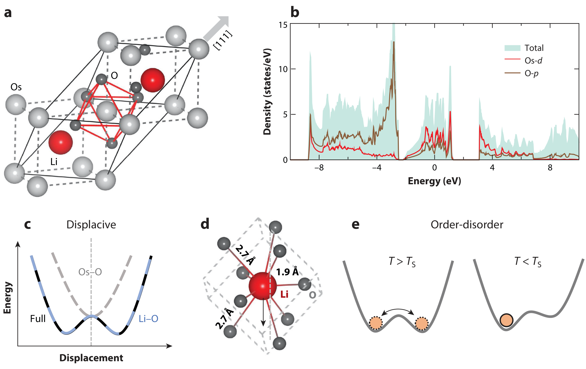

# 锇酸锂 (LiOsO₃) / Lithium Osmate

LiOsO₃（锇酸锂）是实验上第一个被确认的**类铁电金属（ferroelectric-like metal）**，也是极性金属家族的开创性成员。它在约 140 K 发生从中心对称 R-3c 到极性 R3c 的结构相变，同时始终保持金属性。其极化源于 Li 离子的位移，与导电的 Os-O 网络在实空间分离，因此自由载流子无法完全屏蔽内建极化——这与 WTe₂ 的"铁电金属"形成对照：LiOsO₃ 的极化**不可通过电场翻转**，属于"极性金属"而非"铁电金属"。

## 👵 太奶导读

太奶，这个叫 LiOsO₃ 的材料，是科学家在 2013 年找到的"第一个既导电又有方向感（极性）的宝贝"。以前大家以为金属导电和"记住电方向"没法共存，它偏偏两样都有。它的秘密在于：导电的活儿（锇和氧干的）和记方向的活儿（锂原子干的）分给不同的人干，互不打扰，所以电子再多也不影响"记性"。不过它的记性有个缺点：装好之后没法用外加电场把它翻过来（不像 WTe₂ 能翻），所以它叫"类铁电金属"，只能算半个铁电。

## 🏗️ 结构概览 (Structure)

- **相变**：T_s ≈ 140 K，高对称相 R-3c（中心对称，空间群 167）→ 低温极性相 R3c（空间群 161）。
- **极性畸变模式**：铁电软模为 Li 离子沿 [111] 方向位移（伴随 O 八面体轻微畸变），Li 位移 ~0.5 Å 量级；Os 与 O 组成的共角八面体网络保持金属导电通道。
- **关键点**：Li-O 骨架与 Os-O 导电网络**实空间分离** → 金属性不破坏极性畸变（[[../papers/bhowalPolarMetalsPrinciples2023b]]）。

- **看图要点**：LiOsO₃ 结构、Li 位移导致的极性畸变，以及相应双阱自由能。
- **来源**：[[../papers/bhowalPolarMetalsPrinciples2023b]]

## 🔬 物理参数表

| 属性 | 数值 | 方法与来源 |
| :--- | :--- | :--- |
| 极性相变温度 T_s | ~140 K（R-3c → R3c） | 实验/理论（[[../papers/bhowalPolarMetalsPrinciples2023b]]） |
| 极性畸变来源 | Li 位移（~0.5 Å）+ 八面体畸变 | 结构分析（[[../papers/bhowalPolarMetalsPrinciples2023b]]） |
| 金属性来源 | Os 5d 带（共角八面体网络） | 电子结构（[[../papers/bhowalPolarMetalsPrinciples2023b]]） |
| 极化可否电场翻转 | 不可（类铁电金属） | 实验（[[../papers/bhowalPolarMetalsPrinciples2023b]]） |
| 地位 | 首个实验类铁电金属 | 综述（[[../papers/bhowalPolarMetalsPrinciples2023b]]） |

## 🧭 近邻材料辨析

- **与 WTe₂（铁电金属）**：WTe₂ 双层极化可电场翻转（铁电金属）；LiOsO₃ 极化不可翻转（类铁电金属）。前者靠层间滑移，后者靠体相 Li 位移。
- **与 BaTiO₃ / PbTiO₃（常规铁电）**：常规钙钛矿铁电为**绝缘体**；LiOsO₃ 是**金属**，是其最本质区别。
- **与超铁电母体（如 La₂Ti₂O₇）**：超铁电母体靠小 Born 有效电荷抗退极化；LiOsO₃ 靠导电/极化实空间分离，机制不同。

## 📚 相关论文 (Related Papers)

- [[../papers/bhowalPolarMetalsPrinciples2023b]]：LiOsO₃ 作为类铁电金属在极性金属谱系中的定位。

### ⚠️ 已撤回的引文

以下条目原列于本节，经核对其 `raw/note` 原始笔记后确认无据，于 2026-08-21 撤回：

- `huProgressProspectsLowdimensional2019`：原文笔记中未出现 LiOsO₃。

## 🔗 关联概念与实体 (Related Concepts & Entities)

- [[../concepts/polar-metal|极性金属]]
- [[../concepts/ferroelectric-metal|铁电金属]]
- [[../concepts/metallic-ferroelectricity|金属铁电性]]
- [[../concepts/ferroelectricity|铁电性]]
- [[../entities/WTe2|WTe2]]
- [[../entities/BaTiO3|BaTiO3]]
- [[../entities/PbTiO3|PbTiO3]]
