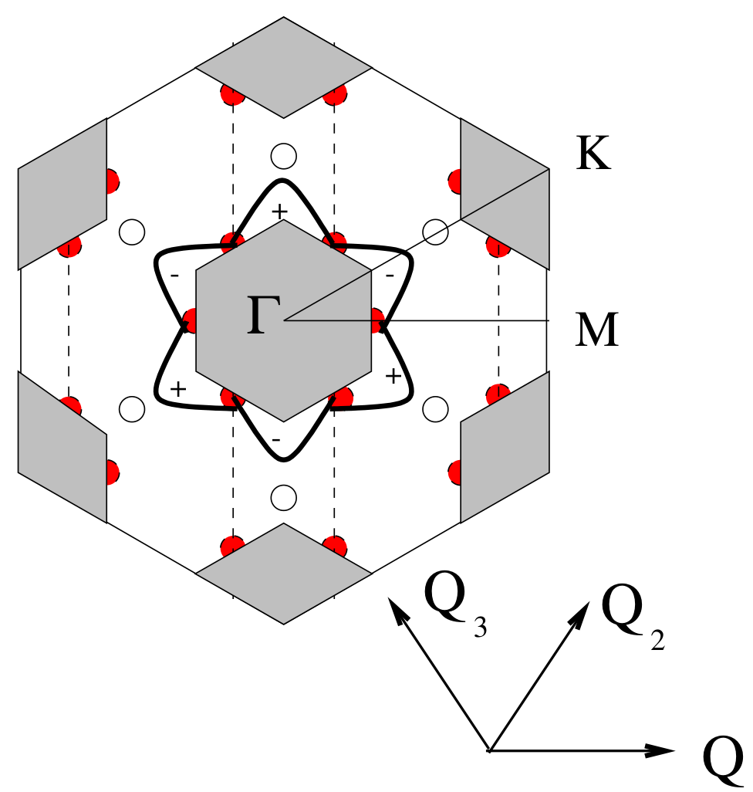

# 二硒化铌 (NbSe2) / Niobium Diselenide

> [!warning] 本页内容待重写（贡献句部分）
> 本页「相关论文」中部分条目的贡献句为占位或缺失，尚未逐篇核实该论文对本条目的具体贡献。
> 太奶导读与正文可参考。（标记于 2026-08-21）

二硒化铌 (NbSe2) 是一种典型的层状过渡金属硫族化合物 (TMD)，以其在低温下表现出的电荷密度波 (CDW) 与超导性 (Superconductivity) 的共存与竞争而闻名。它是研究二维极限下电子-声子耦合与关联电子序的理想平台。

## 👵 太奶导读

太奶啊，您就把这 NbSe2 想象成一块非常有个性的“多功能绸缎”。这绸缎平时看着很普通，但只要把它放进极冷极冷的液氦里（接近绝对零度），它的表面就会自发地起皱纹，就像是水面上起了一层疏密相间的波纹（这就是所谓的**电荷密度波 (CDW)**）。更神的是，这起皱的绸缎还能让电流像抹了油一样，刺溜一下滑过去，一点阻力都没有（这就是**超导性 (Superconductivity)**）。科学家们就爱盯着它看，想弄明白为什么皱纹和丝滑能同时发生。

## 🏗️ 结构概览

NbSe2 最稳定的相是 2H 相（六角相），其中铌 (Nb) 原子处于硫族元素构成的三棱柱配位环境中。

*   **看图要点**：图中展示了 NbSe2 的层状结构，紫色小球代表 Nb 原子，黄色小球代表 Se 原子。单层内 Nb 原子被 Se 原子包裹形成三棱柱单元，层与层之间通过微弱的范德华力连接。
*   **来源**：[[../papers/CastroNeto2001charge]] -> [[../figures/crystal-structures-bulk|晶体结构]]

## 🧩 电荷密度波与超导竞争

NbSe2 是极少数在块体和单层状态下都能稳定维持 CDW 的 TMD 材料。

*   **CDW 特征**：在转变温度 $T_{CDW} \approx 33\text{ K}$ 以下，NbSe2 表现出 $3 \times 3$ 的非公度 CDW 序。
*   **超导性**：在更低的温度下（块体 $T_c \approx 7.2\text{ K}$），它进入超导态。
*   **维度效应**：当 NbSe2 减薄至单层时，CDW 的稳定性反而增强，其转变温度显著提升，这与电荷屏蔽效应的减弱有关。

## 🔬 电子结构与费米面

2H-NbSe₂ 是金属，费米面附近的电子态主要由 Nb 的 4d 能带贡献，在布里渊区中形成多个空穴与电子口袋。ARPES 等实验对费米面形状与能带色散的直接测量，是将 CDW 起因与超导配对联系起来的核心证据。早期理论把 CDW 归因于费米面嵌套驱动的电荷不稳定性，但进一步研究表明动量依赖的电子-声子耦合对 CDW 波矢的选择同样重要，因此需要结合能带结构、声子色散与电子-声子矩阵元共同解释。单层 NbSe₂ 的 CDW 转变温度相比块体升高，说明维度降低与屏蔽减弱会改变电子-声子相互作用和关联强度，进而重新平衡 CDW 与超导两种序。

## 📚 相关论文 (Related Papers)

- [[../papers/CastroNeto2001charge]]：综述了 TMD 中的电荷密度波物理。
- [[../papers/Inosov2008fermi]]：详细研究了 NbSe2 的费米面与关联序。
- [[../papers/liPhaseTransitions2D2021]]：总结了 2D 材料中的相变行为。
- [[../papers/Islam2025enhancement]]
- [[../papers/Johannes2008fermi]]
- [[../papers/cossuStackingChargedensityWaves2024]]
- [[../papers/majumdarInterplayChargeDensity2020]]

## 🔗 关联概念与实体 (Related Concepts & Entities)

- [[../concepts/charge-density-wave|电荷密度波 (CDW)]]
- [[../concepts/superconductivity|超导性]]
- [[../entities/2h-phase|2H 相]]
- [[../entities/TaS2|二硫化钽 (TaS2)]]（同族关联材料）
