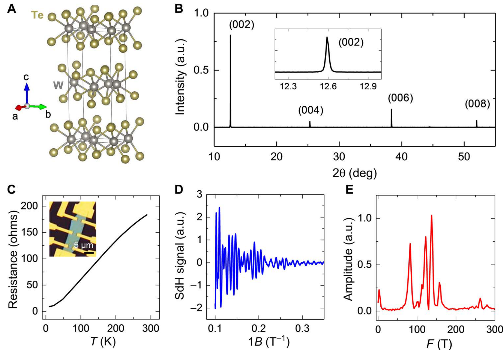

# 二碲化钨 (WTe2) / Tungsten Ditealluride

二碲化钨 (WTe2) 是一种极为特殊的过渡金属硫族化合物。它在体相下以不具有空间反演对称性的 $T_d$ 相稳定存在，是公认的 **II 型外尔半金属 (Type-II Weyl Semimetal)**。更具革命性的是，WTe2 也是首个被实验证实存在室温**铁电半金属**（极性金属）特性的范德华材料。

## 👵 太奶导读

太奶啊，这 WTe2 可是物理学界里一位不折不扣的“特种兵”！过去科学家们一直觉得，如果一个材料里有成群结队自由奔跑的电子（金属），那它的内部就无法维持任何稳定的电偶极矩（铁电极化），因为自由电子会像洪水一样瞬间把多余的电荷冲刷干净（电屏蔽）。可是 WTe2 却打破了这个铁律，它既能像金属一样哗哗导电，同时体内还保留着一排排整齐的、可以通过外加电压齐刷刷掉头的小电偶极矩。这就像是一条奔腾大河里，居然藏着一座座稳固不倒、还能指挥掉头的石碑，这在物理上叫做“极性金属”或“铁电半金属”。

## 🏗️ 结构概览

WTe2 稳定的晶体结构是正交晶系的 $T_d$ 相，空间群为极性的 $Pmn2_1$。其中 W 原子层偏离了理想的平面，形成了沿 $a$ 轴方向延伸的扭曲锯齿状金属链。

*   **看图要点**：图中清晰展示了 WTe2 的 $T_d$ 相结构。W 原子（青色）在 Te 八面体（黄色）中发生畸变，形成了特殊的锯齿链（W-W chains）。这种畸变打破了面内的反演对称性，导致了沿 $c$ 轴（垂直平面）的本征自发极化。
*   **来源**：[[../papers/sharmaRoomtemperatureFerroelectricSemimetal2019]] -> [[../figures/crystal-structures-bulk|体相晶体结构]]

## 🧩 极性金属性与不完全屏蔽

WTe2 之所以能同时兼具导电性与铁电极化，关键在于其**低载流子浓度带来的不完全屏蔽（Incomplete screening）**。

*   **半金属态**：WTe2 是一种半金属，其导带底与价带顶在费米面附近略有重叠，形成极小的电子和空穴口袋。由于载流子浓度较低，其德拜屏蔽长度较长（约 $1.6\text{ nm}$），使内部的极化电场不被完全抵消。
*   **电场可翻转性**：为了在实验中克服高电导带来的短路问题，科学家们巧妙地利用 WTe2 表面约 $2.5\text{ nm}$ 厚的天然氧化层（非晶态）作为介电层构建了电容器，成功测得了典型的铁电相位电滞回线（电滞翻转）。
*   **滑动铁电路径**：在少层或双层极限下，WTe2 的极化翻转还可以通过层间的侧向剪切滑动实现（即**滑动铁电性**），其极化翻转能垒仅为 $\sim 0.29\text{ eV/f.u.}$，可与经典铁电氧化物 $BiFeO_3$ 媲美。

## 🔬 物理参数表

| 属性 | 数值 |
| :--- | :--- |
| 自发极化强度 $P$ | $\sim 0.19\text{ \mu C/cm}^2$ (DFT 计算值) |
| 极化翻转势垒 | $\sim 0.29\text{ eV/f.u.}$ (跨等效变体路径) |
| 德拜屏蔽长度 | $\sim 1.6\text{ nm}$ |
| 超导转变温度 $T_c$ | $\sim 7\text{ K}$ (高压或调控下) |

> 注：上表为典型实验或 DFT 计算数值，适用对象与条件已在数值中标注，详细来源见下方 📚 相关论文 节。

## 📚 相关论文 (Related Papers)

- [[../papers/sharmaRoomtemperatureFerroelectricSemimetal2019]]：首次在块体 WTe2 中于室温下实验证实了本征金属性与铁电性共存。
- [[../papers/liPhaseTransitions2D2021]]：系统梳理了二维材料中包括滑动铁电在内的多自由度相变。
- [[../papers/FerroelectricityMultiferroicityAtomic2023]]：从综述角度梳理了「Ferroelectricity and multiferroicity down to the atomic thickness」。
- [[../papers/Li2013bonding]]：从理论分析角度梳理了「Bonding Charge Density and Ultimate Strength of Monolayer Transition Metal Dichalcogenides」。
- [[../papers/aiFerroelectricityCoexistedPorbital2022]]：从理论分析角度梳理了「二维金属氮氧化物中的铁电性与p轨道铁磁性和金属丰度共存」。
- [[../papers/bhowalPolarMetalsPrinciples2023b]]：从综述角度梳理了「极性金属：原理与展望」。
- [[../papers/chenFerromagneticNonmagnetic1T2022]]：从理论分析角度梳理了「Ferromagnetic and nonmagnetic 1T′ charge density wave states in transition metal dichalcogenides: Physical mechanisms and charge doping induced reversible transition」。
- [[../papers/chenStrongSlidingFerroelectricity2024]]：从理论分析角度梳理了「Strong Sliding Ferroelectricity and Interlayer Sliding Controllable Spintronic Effect in Two-Dimensional HgI₂ Layers」。
- [[../papers/feiFerroelectricSwitchingTwodimensional2018a]]：从实验研究角度梳理了「Ferroelectric switching of a two-dimensional metal」。
- [[../papers/gaoStrainEngineeringFerroelectric2024]]：从理论分析角度梳理了「Strain engineering of ferroelectric polarization and domain in the two-dimensional multiferroic semiconductor」。
- [[../papers/guanRecentProgressTwoDimensional2020]]：从综述角度梳理了「Recent Progress in Two‐Dimensional Ferroelectric Materials」。
- [[../papers/guoAdvancesTwodimensionalFerroelectric2025]]：从综述角度梳理了「二维铁电材料的研究进展」。
- [[../papers/hanTunableSlidingFerroelectricity2025]]：从理论分析角度梳理了「Tunable sliding ferroelectricity in two-dimensional van der Waals RuX2 (X = Cl, Br, and I) multiferroic layers」。
- [[../papers/heSwitchingTwodimensionalSliding2025]]：从理论分析角度梳理了「机械弯曲切换二维滑动铁电体」。
- [[../papers/huProgressProspectsLowdimensional2019]]：从综述角度梳理了「低维多铁性材料的研究进展与展望」。
- [[../papers/huangPolarPhaseDomain2019]]：从实验研究角度梳理了「Polar and phase domain walls with conducting interfacial states in a Weyl semimetal MoTe2」。
- [[../papers/kaurRecentAdvancesTheoretical2025a]]：从综述角度梳理了「Recent advances in theoretical investigations of sliding ferroelectricity in layered and van der Waals two-dimensional materials」。
- [[../papers/liFerroelasticityDomainPhysics2016]]：从理论分析角度梳理了「二维过渡金属二硫族化物单层的铁弹性和畴物理」。
- [[../papers/miaoMagneticFerroelectricMetal2024]]：从理论分析角度梳理了「Magnetic ferroelectric metal in bilayer Fe3GeTe2 under interlayer sliding」。
- [[../papers/neumayerCompetingPolarPhases2025]]：从综述角度梳理了「二维铁电过渡金属硫代和硒酸盐中的竞争极性相」。
- [[../papers/nicholsonUniaxialStraininducedPhase2021]]：从实验研究角度梳理了「二维拓扑半金属IrTe2的单轴应变诱导相变」。
- [[../papers/niuDirectVisualizationLargeScale2021]]：从实验研究角度梳理了「Direct Visualization of Large-Scale Intrinsic Atomic Lattice Structure and Its Collective Anisotropy in Air-Sensitive Monolayer 1T'-WTe2」。
- [[../papers/pedramraziManipulatingTopologicalDomain2019]]：从实验研究角度梳理了「单层量子自旋霍尔绝缘体 1T′–WSe₂ 中拓扑畴边界的操控」。
- [[../papers/pengStrainEngineering2D2020]]：从综述角度梳理了「二维半导体和石墨烯的应变工程：从应变场到能带结构调谐和光子应用」。
- [[../papers/shenEmergenceMultipleFerroelectric2025]]：从实验研究角度梳理了「多层黑磷中多铁电态的出现」。
- [[../papers/sunSlidingFerroelectricityTwodimensional2025]]：从综述角度梳理了「Sliding ferroelectricity in two-dimensional materials and device applications」。
- [[../papers/wangFormationMechanismTwin2019]]：从实验研究角度梳理了「Formation mechanism of twin domain boundary in 2D materials: The case for WTe2」。
- [[../papers/wuElectrostaticGatingIntercalation2022]]：从综述角度梳理了「二维材料中的静电门控与插层」。
- [[../papers/wuSlidingFerroelectricity2D2021a]]：从综述角度梳理了「二维范德华材料中的滑动铁电性：相关物理和未来机遇」。
- [[../papers/yangRipplingFerroicPhase2021]]：从理论分析角度梳理了「Rippling Ferroic Phase Transition and Domain Switching In 2D Materials」。
- [[../papers/yuFerroelectricControlMagnetism2026]]
- [[../papers/zhangEmergingFrontiersTwodimensional2025]]
- [[../papers/zhaoRealization2DMultiferroic2024]]

## 🔗 关联概念与实体 (Related Concepts & Entities)

- [[../concepts/sliding-ferroelectricity|滑动铁电性]]
- [[../concepts/weyl-semimetal|外尔半金属]]
- [[../entities/td-phase|Td 相]]
- [[../entities/MoTe2|二碲化钼 (MoTe2)]]
