---
tags:
  - type/figure-collection
---

# 晶体结构与原子构型：体相晶体结构

> 属于 [[crystal-structures|晶体结构与原子构型]]

## 条目

### 1. 式1 紧束缚色散 ε⁰_k=Σ_R t_|R| cos(k·R)

*   **来源**：[[../papers/Barnett2006coexistence]]
*   **图示描述**：二维三角晶格紧束缚色散关系，R 遍历格矢，t_|R| 为对应壳层跃迁积分。
*   **关键特征**：最小模型仅保留 t₂ 与 t₆=t₂/3（t₂ 调整为 140 meV），其他跃迁忽略；该截断下哈密顿量在拓扑上解耦为三套三角子晶格，是"子晶格解耦"概念的数学出发点。

### 2. 图2 (a) 以 Ta 为中心的低能瓦尼尔函数，中心 d_z² 对称、尾部 d_xy/d_x²-y² 对称；(b) 三角晶格中 WF 符号示意；(c)(d) 最近邻相消干涉、次近邻相长干涉

*   **来源**：[[../papers/Barnett2006coexistence]]
*   **图示描述**：组合图，(a) 为定域于 Ta 位的瓦尼尔函数三维等值面（红正蓝负），(b) 为其在 Ta 三角晶格平面的符号投影（小点为 Se 原子），(c)(d) 分别示意最近邻与次近邻跃迁时杂化尾部的相位重叠。
*   **关键特征**：WF 中心呈 a_g（d_z²）对称，尾部在相邻 Ta 位呈 d_xy/d_x²-y² 对称；最近邻两尾部相位相反→相消干涉，t₁=38 meV 被抑制；次近邻相位相同→相长干涉，t₂=115 meV 反而主导；层间 t⊥,1=29 meV、t⊥,2=23 meV 与面内 t₁ 同量级。

### 3. 图1 TEM 与 HRTEM 照片，显示 ~22 nm 单晶颗粒及 (012) 面晶格条纹
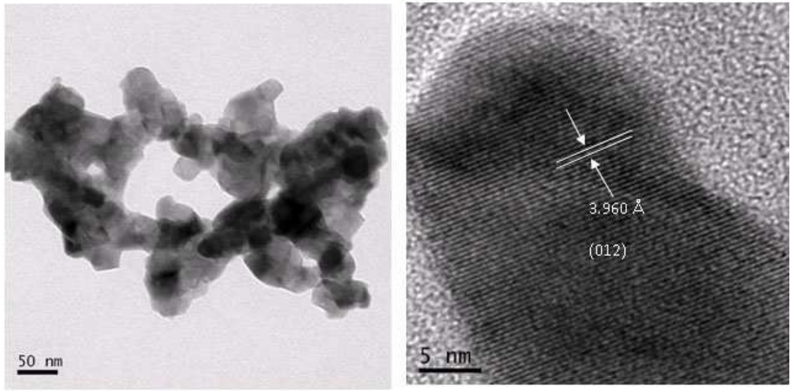
*   **来源**：[[../papers/Goswami2011multiferroic]]
*   **图示描述**：(a) TEM 照片给出整体形貌与粒径分布（平均约 22 nm，颗粒间有轻微团聚）；(b) HRTEM 照片对单颗粒做原子级分辨，可见规则晶格条纹。
*   **关键特征**：(b) 中条纹间距对应 R3c 结构的 (012) 晶面（部分颗粒观察到 (110) 面取向）；条纹连续贯穿整个颗粒，无内部晶界，证明颗粒为高度结晶的单晶；单晶性保证了后续 Rietveld 精修与极化估算的结构可靠性。

### 4. 图1 4H-NbSe2与2H-NbS2晶体结构对比（三棱柱配位；4H ABAC vs 2H AB堆垛）
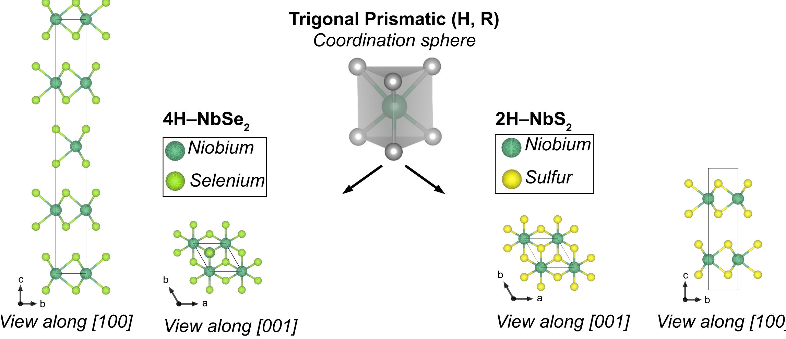
*   **来源**：[[../papers/Islam2025enhancement]]
*   **图示描述**：对比展示 4H-NbSe₂（左，ABAC 四层堆垛）与 2H-NbS₂（右，AB 两层堆垛）的侧视/顶视晶体结构，中部为 Nb 原子被六个 S/Se 包围的三棱柱配位多面体。
*   **关键特征**：两种多型体的单层结构相同，均为三棱柱配位的 MX₂ 层；差异仅在层间堆垛顺序（4H 四层 vs 2H 两层），由此改变层间耦合、p-d 杂化与费米面结构；这是后续压力响应差异（4H 对压力更敏感）的结构起点。

### 5. 图8 Na 原子链弛豫后形成之字形构型（间距 3.43 Å，角度 152°），加倍晶胞但不打开 E_F 能隙

*   **来源**：[[../papers/Johannes2008fermi]]
*   **图示描述**：初始为等间距（3.34 Å）一维 Na 原子链，非链方向间距 38 Å；允许二维自由度弛豫后形成的之字形（zigzag）稳定构型，标出原子间距 3.43 Å 与弯折角 152°。
*   **关键特征**：钳制离子时纯电子 CDW 不稳定；仅允许沿一维方向弛豫时即使预置二聚化也回弹；放开二维自由度才出现之字形畸变，晶胞加倍；但 BZ 边界 k=±π/a 处矩阵元因垂直方向积分而归零，E_F 处无能隙；强制二聚化虽打开能隙却能量上不稳定。

### 6. 图1 RTe2与RTe3晶体结构对比，RTe3中双Te方平面夹于RTe层之间
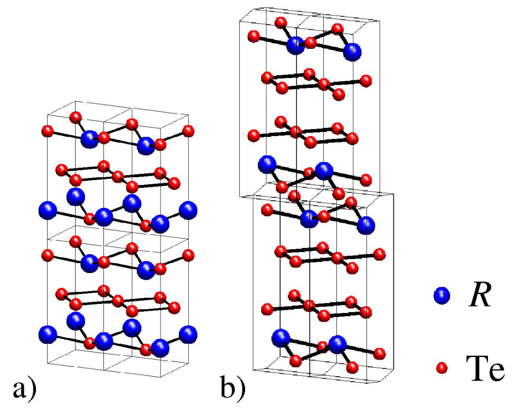
*   **来源**：[[../papers/Laverock2005fermi]]
*   **图示描述**：对比展示 (a) RTe₂（四方反-Cu₂Sb 结构，空间群 P4/nmm）与 (b) RTe₃（层状 NdTe₃ 结构，空间群 Cmcm）的晶体结构，晶体学 b 轴为长轴。RTe₃ 的关键特征是两层正方平面排列的 Te 原子层被夹在惰性的 RTe 板层之间。
*   **关键特征**：RTe₃ 中双 Te 方平面是后续双层劈裂与费米面嵌套的结构前提；RTe 板层近似惰性，导电电子主要集中在 Te 5p 平面；电阻率各向异性 ρa/ρb 在 SmTe₃ 中高达约 5000，印证了准二维性。

### 7. 图1 MX2单层晶体结构（俯视/侧视），红色原胞、蓝色正交超胞，x=扶手椅、y=锯齿

*   **来源**：[[../papers/Li2013bonding]]
*   **图示描述**：图1给出单层 MX₂ 的俯视(a)与侧视(b)原子结构示意；紫色大球为过渡金属 M（Mo/W），黄色小球为硫族元素 X（S/Se/Te），构成 X–M–X 三明治结构，每个 M 与周围六个 X 三角棱柱配位。俯视中红色菱形为六方原胞（1 个 M + 2 个 X），蓝色矩形为单轴拉伸所用正交超胞，x 轴标为扶手椅方向、y 轴为锯齿方向。
*   **关键特征**：扶手椅方向平行于 M–X 键在 M 原子面内的投影，锯齿方向与之垂直，预示两方向加载时键的拉伸/弯曲模式不同；侧视图直观显示三层夹心结构和层间范德华间隙；该几何定义是后续应力–应变各向异性分析的基础。

### 8. 图5 杨氏模量(a)和极限强度(b)随电荷转移ΔQ的线性关系

*   **来源**：[[../papers/Li2013bonding]]
*   **图示描述**：图5把六种 MX₂ 的力学量对 Bader 电荷分析得到的 M→X 电荷转移量 ΔQ（单位 e）作图：(a) 杨氏模量 E（GPa），(b) 极限强度 σ*（GPa），并分别对扶手椅、锯齿两方向数据点做线性拟合 E(σ*)≈a+b·ΔQ。
*   **关键特征**：所有数据点近似落在一条直线上；拟合参数（表 III）：E 的 a=171.97 GPa、b=61.34 GPa/e，σ*_AR 的 a=18.21 GPa、b=10.40 GPa/e，σ*_ZZ 的 a=16.86 GPa、b=1.60 GPa/e；即 ΔQ 每增加 0.1 e，E 升高约 6.1 GPa、扶手椅 σ* 升高约 1.04 GPa；WS₂ 的 ΔQ=1.07 e 最大、MoTe₂ 的 ΔQ=0.37 e 最小，与强度排序一致。

### 9. 表II 六种MX2两方向的E、σ*、ε*、各向异性因子φ与ΔQ

*   **来源**：[[../papers/Li2013bonding]]
*   **图示描述**：表II汇总六种无应变单层 MX₂ 在扶手椅(x)与锯齿(y)两方向的杨氏模量 E（GPa）、极限强度 σ*（GPa）、极限应变 ε*，以及各向异性因子 φ=σ*_AR/σ*_ZZ 和 Bader 电荷转移量 ΔQ（e），是图2、图5的定量数据底表。
*   **关键特征**：WS₂ 最强：E_AR=244.18 GPa、σ*_AR=29.96 GPa、φ=1.50、ΔQ=1.07 e；MoTe₂ 最弱且各向异性最大：E_AR=125.94 GPa、σ*_AR=17.12 GPa、σ*_ZZ=7.88 GPa、φ=2.17、ΔQ=0.37 e；扶手椅 ε* 介于 0.28–0.32，锯齿 ε* 介于 0.14–0.19；两方向 E 几乎相等但 σ* 差异显著，φ 与强度呈反相关（材料越弱各向异性越强）。

### 10. 图6 CVT生长单层NiI₂的偏振显微与角分辨线二色性（C3→C2对称破缺）
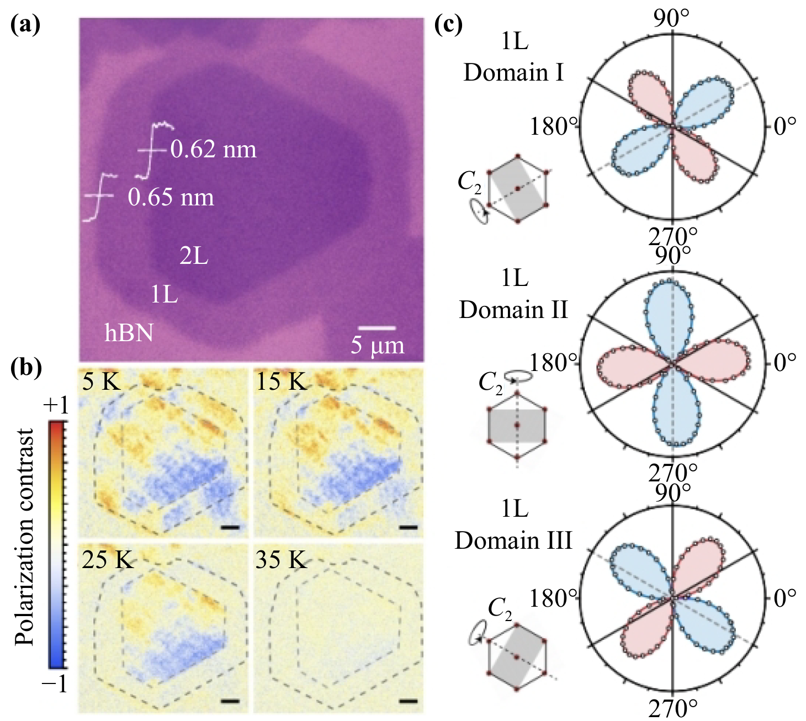
*   **来源**：[[../papers/RecentAdvancesGrowth2025]]
*   **图示描述**：给出单层 CuCrSe₂ 的晶体结构示意，展示层状 CdI₂ 型骨架中 Cr、Cu、Se 原子的位置关系及 CVT/化学剥离后单层的形貌与多铁测量结果。
*   **关键特征**：CVT 合成的单层同时具有室温铁电与约 120 K 的铁磁性；FE 极化诱导 Cr 原子发生轨道位移，反过来增强铁磁交换耦合；机制介于经典 I 型与 II 型之间，由 STEM + SHG + PFM + 磁性 + 霍尔测量联合证实。

### 11. 图7 单层CuCrSe₂的晶体结构与高温多铁性
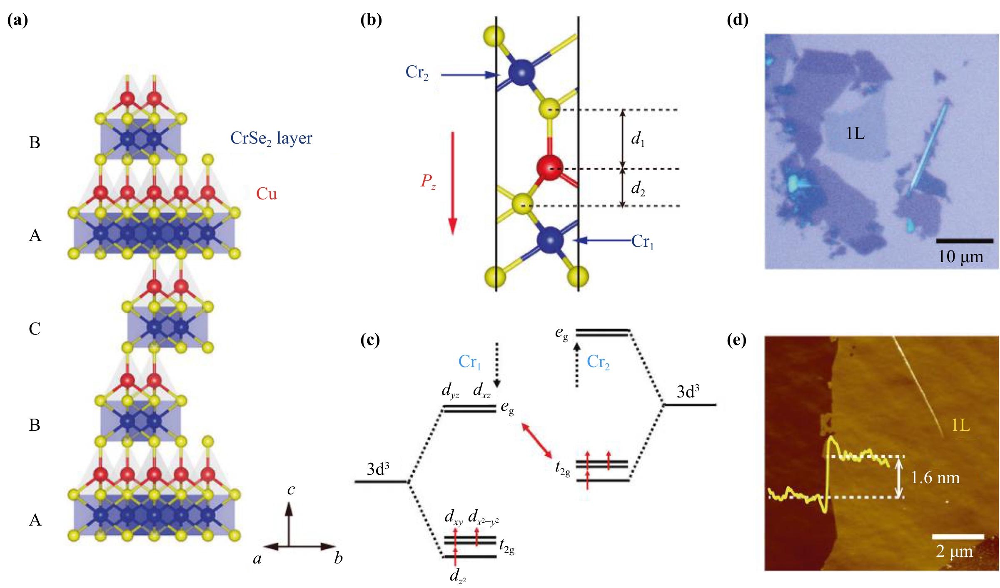
*   **来源**：[[../papers/RecentAdvancesGrowth2025]]
*   **图示描述**：PVD 在云母衬底上生长的 p 型掺杂 SnSe 薄片的形貌、电输运与磁性测量结果，展示室温铁电与约 337 K 亚铁磁共存的实验证据。
*   **关键特征**：生长反应器压力约 10¹–10² Pa；亚铁磁 T_C ≈ 337 K，铁电性维持至室温；体系呈现局域相分离的 SnSe 微畴与界面电荷转移，并具有简并半导体/金属特征；p 型掺杂是诱导磁性的关键。

### 12. 图2 制造DOE的2.5倍光学显微镜俯视图，可见相位图样及缺陷小孔

*   **来源**：[[../papers/Unknown2025diffractive]]
*   **图示描述**：2.5 倍光学显微镜下整个直径 3.5 mm DOE 的俯视图，宏观相位图样与图1(b) 计算结果一一对应；左上角可见一个较大孔洞，各 500 μm×500 μm 拼接方块的角落也散布小孔。
*   **关键特征**：左上角孔疑为涂胶前玻璃基板上的灰尘颗粒所致；拼接区角落孔可能源于切片算法计算误差；作者引用前期工作指出这类微孔对光束整形影响可忽略；7×7 拼接网格边界在图中隐约可辨，证明大面积拼接策略成功落地。

### 13. 模型构建示意图

*   **来源**：[[../papers/Wei2021]]
*   **图示描述**：展示从标注晶格矢量 a₁、a₂ 的石墨烯片沿 y 轴卷曲成 (5,0) 纯碳管，再以氮原子层（紫色球）替换碳原子层（灰色球）形成竹节状 N-CNT 的完整建模流程。
*   **关键特征**：管轴沿 y 方向，x/z 方向各加 200 Å 真空层以消除周期镜像相互作用；C/N 原子层以 1:1 比例交替排列，构成"竹节"形貌；该模型是后续 12 种 (n=3–14,0) 管几何优化与电子性质计算的原子构型基础。

### 14. 直径差与面积比

*   **来源**：[[../papers/Wei2021]]
*   **图示描述**：(a) N 环与 C 环直径差（单位 Å）随手性指数 n 的变化；(b) C 环与 N 环横截面积比（无量纲）随 n 的变化。
*   **关键特征**：两子图均呈明显奇偶振荡，奇数 n 管（如 3、5、7）的直径差/面积比大于相邻偶数 n 管；(3,0) 管横截面积比最高，氮环相对收缩最剧烈、曲率效应最强；C 环直径线性拟合为 D_C-ring = 0.72829 n + 0.40656 Å。

### 15. 键角变化

*   **来源**：[[../papers/Wei2021]]
*   **图示描述**：四个独立键角——C-C-N、C-N-N（平行于管轴的六原子环）与 C-C-C、N-N-N（垂直于管轴）——随手性指数 n 的变化曲线，单位为度 (°)。
*   **关键特征**：C-C-N 均值 121.15°（(4,0) 最大 123.3°），C-N-N 均值 117.325°（(6,0) 最大 119.3°），二者随 n 呈相反趋势，反映 C-N 键随管径增大向内倾；C-C-C 角在 (7,0) 后稳定于 109.5°，呈现 sp³ 杂化特征；N-N-N 角在 (5,0) 达峰值 110.7° 后，于 (8,0) 起稳定在 104.6°；小直径管（n<7）键角畸变剧烈，曲率应力显著。

### 16. 几何参数表

*   **来源**：[[../papers/Wei2021]]
*   **图示描述**：列出 n=3–14 共 12 种手性指数下，纯 CNT 与竹节状 N-CNT 的原子数、最近邻 C-C/N-N 键长、平均 C-N 键长、C/N 环直径等几何参数。
*   **关键特征**：纯 CNT 最近邻 C-C 键长约 1.4 Å，直径拟合 D = 0.75688 n + 0.39712 Å（与文献 Zolyomi & Kurti 的 D = 0.77037 n + 0.17441 Å 略有差异）；N-CNT 中 N-N 键长在 ~1.37 Å 附近小幅波动，C-N 平均键长约 1.380 Å，(5,0) 管最短为 1.374 Å；所有 N-CNT 的 N 环直径均小于 C 环直径及同手性纯 CNT 直径，从数据上印证氮环收缩。

### 17. 图1 TTF与CA分子结构
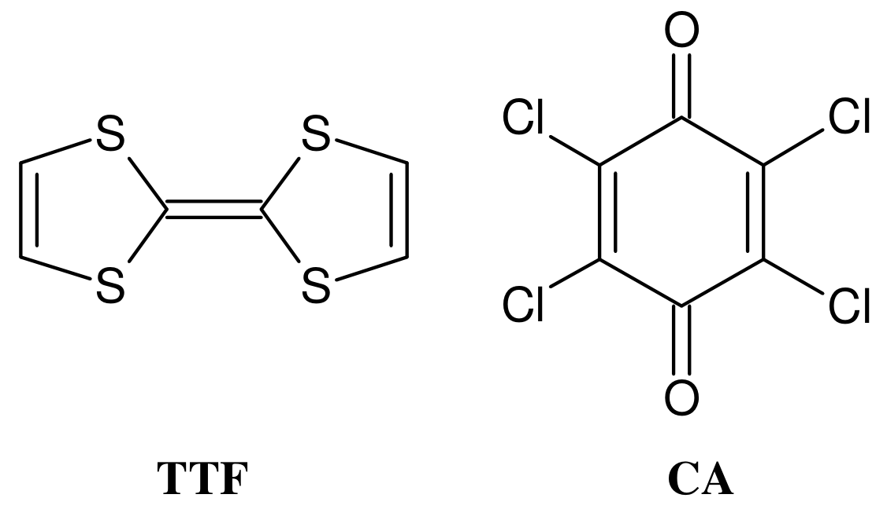
*   **来源**：[[../papers/Wixtrom2011electrical]]
*   **图示描述**：给出本研究所用两个构建单元的二维化学结构式：左侧为给体分子 TTF（四硫富瓦烯），由两个共享中心 C=C 双键的五元环构成，环上共四个硫原子；右侧为受体分子 CA（四氯苯醌/氯冉酸），即带有两个羰基和四个氯取代基的苯醌六元环。
*   **关键特征**：TTF 因富硫骨架和中心双键成为强电子给体，CA 因电负性 O、Cl 取代基成为强电子受体；两者按 1:1 化学计量经机械化学作用形成电荷转移盐；后续图2–4的结构与电学行为都建立在这一给体–受体配对之上。

### 18. 图3 黑色多晶型TTF-CA的晶体结构（混合堆砌）
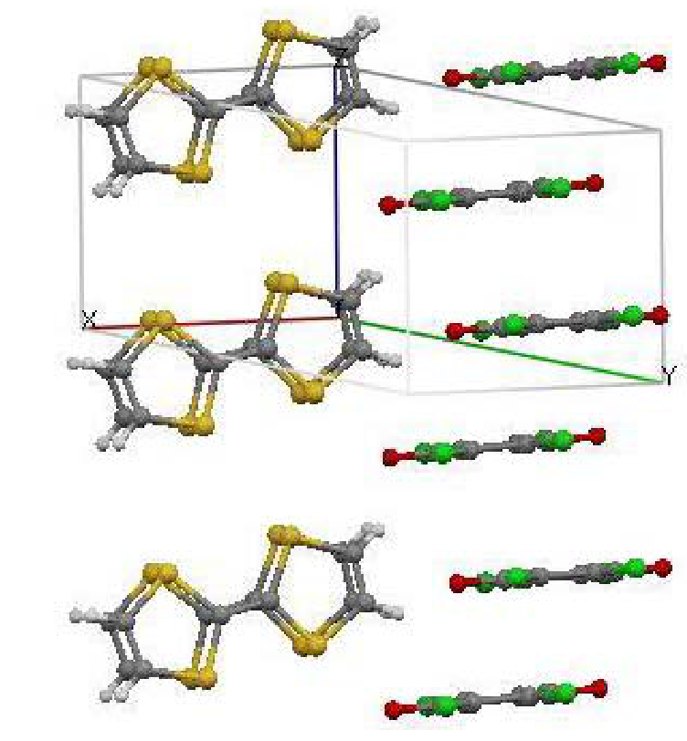
*   **来源**：[[../papers/Wixtrom2011electrical]]
*   **图示描述**：由粉末 XRD 数据解析得到的黑色 TTF-CA 多晶型三维晶体结构示意，显示 TTF 与 CA 分子在晶胞中的相对位置与沿柱方向的堆积方式。
*   **关键特征**：分子呈面对面的一维柱状排列，TTF（给体）与 CA（受体）交替出现，构成典型的**混合堆砌（mixed stack）**柱，而非 TTF-TTF、CA-CA 分列的 segregated stack；混合堆砌沿堆叠方向有利于分子间电荷转移，但也容易因一维 Peierls 失稳而呈现绝缘或半导体基态；紧密的交替堆积被认为与样品呈黑色（比绿色相更强/更宽的电荷转移吸收、可能更窄的带隙）相关。

### 19. 图1 初始构建的Si(001)平板模型（3×3和6×6单胞，3原子层，265 Å真空层）

*   **来源**：[[../papers/Wu2018]]
*   **图示描述**：(a)(c) 为沿[001]方向的俯视图，(b)(d) 为侧视图；绿色球为底层、橙粉色为中间层、紫色为顶层。3×3单胞用于获得p(2×2)重构，6×6单胞用于c(4×2)重构。
*   **关键特征**：平板含3个原子层（约0.272 nm厚），层间真空层宽度265.00 Å；Si块体晶格常数取5.43 Å，DFTB优化得到Si=5.46 Å、Ge=5.71 Å，与实验偏差<1%；底部固定、上部弛豫。

### 20. 表2：各构型Ge二聚体、Ge–Si、Si–Si键的键长BL与键能BE

*   **来源**：[[../papers/Wu2021]]
*   **图示描述**：表格列出22个稳定构型中Ge二聚体、Ge1–Si1、Ge1–Si2、Ge2–Si1、Ge2–Si2、Si1–Si2六类键的键长BL（Å）和键能BE（eV），"–"表示该键未形成或已断裂。
*   **关键特征**：顶位吸附（A1/A2/B7/C2）使Si1–Si2键缩短至2.30–2.31 Å、BE升至8.0–8.35 eV；桥位吸附（A3/B4/B6/C1/E系列多数）使Si键拉长至2.63–2.67 Å、BE降至2.99–4.57 eV；B1–B3、E1、F2、F4中Ge–Ge键BE为"–"，对应二聚体完全解离；F3中Si1–Si2键BL/BE均为"–"，对应Si二聚体断裂；最强Ge–Si键为C2的Ge2–Si1（2.33 Å, 7.997 eV）。

### 21. 六边形CA网格的六个最近邻与L_CA

*   **来源**：[[../papers/Zhang2003a]]
*   **图示描述**：六边形 CA 网格的局部放大，中心元胞被编号 1–6 的六个最近邻包围，标注相邻元胞中心距 L_CA。
*   **关键特征**：六边形网格相比正方形网格对称性更高，可显著降低由网格几何引入的数值各向异性；L_CA 是计算捕获概率 p_cap = l(t)/L_CA（式12）和时间步 Δt = min(L_CA/v_max, L_CA²/D_α, L_CA²/D_γ)（式14）的关键长度尺度。

### 22. 图1 X₂NO₂三种相(fcc/FE-ZB′/FE-WZ′)的晶体结构与Tl₂NO₂声子谱

*   **来源**：[[../papers/aiFerroelectricityCoexistedPorbital2022]]
*   **图示描述**：(a–c) X₂NO₂单层 fcc、FE-ZB′、FE-WZ′ 三种相的俯视图与侧视图（虚线为单胞），(d–f) Tl₂NO₂对应相沿 Γ–M–K 路径的声子色散（纵轴为声子频率，THz）。
*   **关键特征**：fcc 相中心对称（D3d 点群），N 位于六个 X 原子中心；FE-ZB′/FE-WZ′ 相中 N 垂直偏心位移，与四个 X 原子形成"三长一短"四面体配位（C3v 极性结构），是面外铁电的结构根源；fcc Tl₂NO₂ 在 Γ 点出现两个明显虚频光学模（软模），动力学不稳定并自发对称破缺；FE-WZ′ 相声子谱全正，与 AIMD 300 K 和 Born–Huang 判据共同确认其为稳定基态。

### 23. 表1 各体系电偶极矩、二维/三维极化、真空能级差与反转势垒汇总

*   **来源**：[[../papers/aiFerroelectricityCoexistedPorbital2022]]
*   **图示描述**：汇总 FE-ZB′ In₂NO₂、FE-ZB′ In₂NO₂(+4% 应变)、FE-WZ′ Tl₂NO₂ 三个体系的电偶极矩 p_e（eÅ/unit cell）、二维极化 P₂D（pC/m）、三维极化 P₃D（μC/cm²）、真空能级差 ΔΦ（eV/unit cell）和极化反转势垒 E_barrier（eV/unit cell）。
*   **关键特征**：FE-ZB′ In₂NO₂ 本征态 p_e=0.088、P₂D=13.90、P₃D=2.75、ΔΦ=1.57，但无反转势垒（fcc 更稳定，非铁电）；加 4% 应变后 p_e=0.092、P₂D=13.48、P₃D=2.79、ΔΦ=1.52、E_barrier=0.14，成为铁电体；FE-WZ′ Tl₂NO₂ p_e=0.045、P₂D=6.60、P₃D=1.26、ΔΦ=0.75、E_barrier=0.65，势垒最高，非易失性最好。

### 24. 图3 掺杂铁电体制备极性金属：BaTiO₃₋δ 相图、DFT 极化-掺杂曲线、Nb-PTO 的 STEM 原子位移、BaMF₆ 几何铁电结构
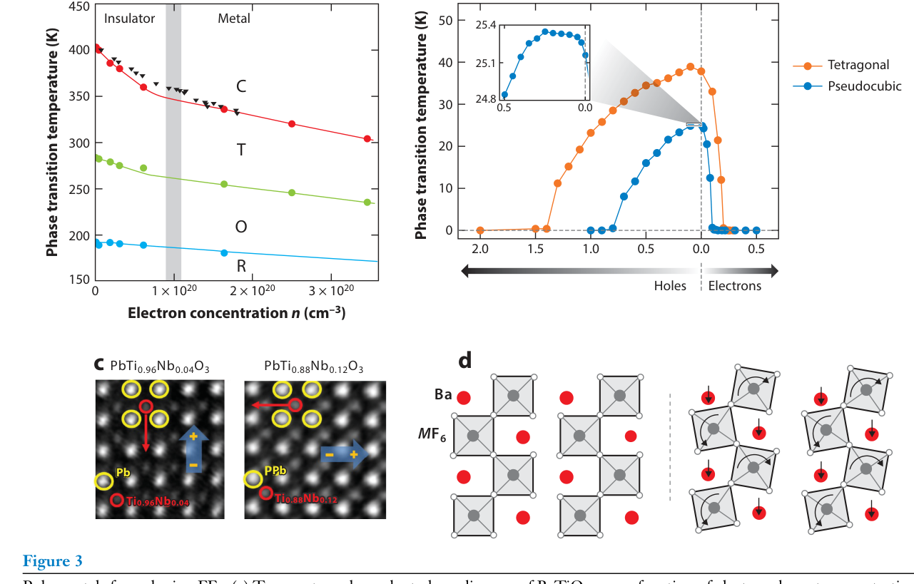
*   **来源**：[[../papers/bhowalPolarMetalsPrinciples2023b]]
*   **图示描述**：四子图说明"向传统/非传统铁电体掺入载流子获得极性金属"的策略：(a) BaTiO₃₋δ 温度-掺杂相图，(b) DFT 计算的四方/赝立方 BaTiO₃ 极化-载流子浓度曲线，(c) Nb 掺杂 PbTiO₃ 的 STEM 原子图像，(d) 层状几何铁电体 BaMF₆ 的高对称与极性结构对比。
*   **关键特征**：BaTiO₃₋δ 进入金属态后铁电结构相变（C/T/O/R 相）仍持续至临界电子浓度 n；DFT 曲线显示 n 型掺杂下铁电畸变可维持至约 0.1 e/单胞，而低空穴掺杂下极化反而因面内 Ti–O 键减弱而增强；STEM 中 PbTi₀.₈₈Nb₀.₁₂O₃ 仍可见 Ti/Nb 相对 Pb 的偏心位移并出现金属导电；BaMF₆ 中 MF₆ 八面体旋转驱动 Ba 离子次级极性位移。

### 25. 图5 几何极性金属：Ca₃Ru₂O₇ 的旋转/倾斜/极性模式耦合与 Bi₅Mn₅O₁₇ 极性结构
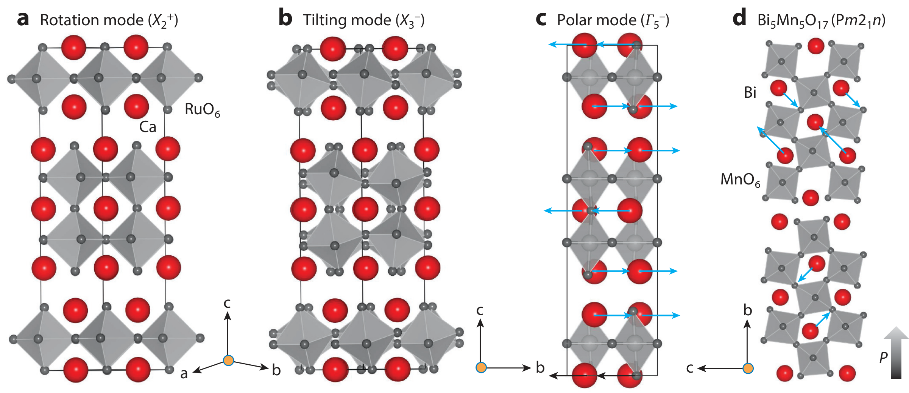
*   **来源**：[[../papers/bhowalPolarMetalsPrinciples2023b]]
*   **图示描述**：(a–c) Ca₃Ru₂O₇ 中波矢边界旋转模 X₂⁺ 与倾斜模 X₃⁻ 耦合到区域中心极性模 Γ₅⁻ 共同降低对称性；(d) Bi₅Mn₅O₁₇ 的 Pm2₁n 极性结构，Bi 原子位移（蓝色箭头）沿 b 方向产生净极化 P。
*   **关键特征**：Ca₃Ru₂O₇ 的金属导电由 Ru-t₂g 态主导，而几何畸变几乎不影响这些态，实现电子解耦；Bi₅Mn₅O₁₇ 中 Bi³⁺ 孤对电子增强极化、Mn 离子提供磁性，是潜在多铁极性金属。

### 26. 图6 类铁电金属 LiOsO₃：R-3c/R3c 晶体结构、态密度、Li 位移驱动的双阱势、几何起源与有序-无序势阱

*   **来源**：[[../papers/bhowalPolarMetalsPrinciples2023b]]
*   **图示描述**：五个子图系统剖析首个类铁电金属 LiOsO₃：(a) 高温 R-3c 与低温 R3c 晶体结构，(b) 总/分态密度，(c) 沿 A₂u 模式的势能-位移曲线，(d) Li 在氧笼中的配位几何，(e) 有序-无序模型下的 Li 势阱。
*   **关键特征**：140 K 发生 R-3c→R3c 连续二级相变，Li⁺ 沿赝立方 [111] 位移约 0.5 Å；费米能级处态密度主要由 Os-d 与 O-p 杂化贡献，金属性来自 OsO₆ 网络；双阱势几乎完全由 Li–O 位移贡献，单独 Os–O 位移反而升高能量，双阱深度约 44 meV、相变温度对应约 12 meV；Li 在面内 Li–O 距离约 1.9 Å、面外约 2.7 Å 的"欠束缚"配位驱动其位移。

### 27. 图1 (a) 1T/1T′晶体结构与结构畸变指数d₁/d₂定义；(b) VX₂、CrX₂、MnX₂各体系1T′ NM/FM CDW相相对1T相的能量对比
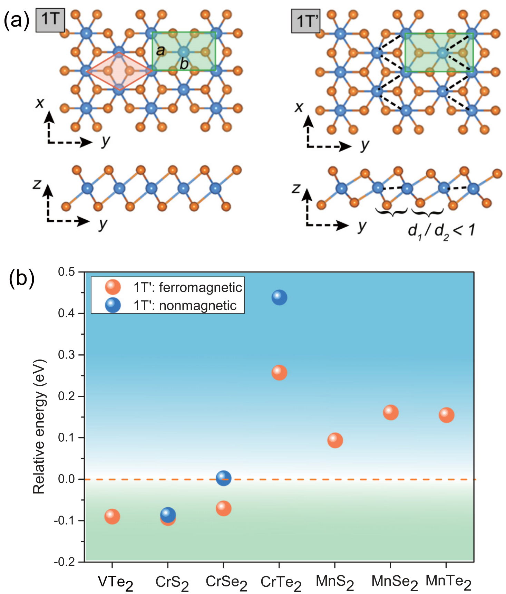
*   **来源**：[[../papers/chenFerromagneticNonmagnetic1T2022]]
*   **图示描述**：(a) 左侧为高对称1T相（P-3m1，橘色菱形原胞），右侧为低对称1T′相（绿色矩形原胞），二者关键区别是沿y方向相邻两列金属原子间距不再相等，d₁<d₂，d₁/d₂定义为结构畸变指数；(b) 以1T相能量为零点（橘色横线），柱状对比VX₂、CrX₂、MnX₂九个体系1T′ NM与FM CDW态的相对总能量。
*   **关键特征**：VS₂、VSe₂无稳定1T′相；VTe₂与全部MnX₂仅存在1T′ FM-CDW；CrX₂（CrS₂/CrSe₂/CrTe₂）是唯一同时具有NM与FM两种1T′ CDW态的家族；d₁/d₂≈0.8对应FM态、≈0.7对应NM态；声子谱显示除1T′ FM-CrTe₂有虚频（倾向转回1T）外其余CDW相动力学稳定。

### 28. 图6 电荷掺杂诱导CrS₂ NM↔FM CDW可逆相变：(a)(b) 晶格常数随电子/空穴注入的滞后回线；(c) 相变能垒随掺杂浓度降低

*   **来源**：[[../papers/chenFerromagneticNonmagnetic1T2022]]
*   **图示描述**：(a)(b) 横轴为每原子注入电荷Q（负值电子、正值空穴），纵轴为1T′ CrS₂晶格常数a、b（以1T′-NM为参考计算应变），黑色箭头标示电子注入→抽取→空穴注入→空穴减少的循环路径；(c) 为CI-NEB计算的NM↔FM相变能垒随掺杂浓度的变化。
*   **关键特征**：电子注入至Q≈−0.16 e/atom时a从3.088 Å跃至3.464 Å、b从5.617 Å跃至5.950 Å，d₁/d₂从0.739跳至0.911，磁矩升至约4.379 μB，对应NM→FM自发转变，输出εx≈12.17%、εy≈5.93%；空穴注入至Q≈+0.15 e/atom时体系先经1T相（d₁/d₂→1，a≈2.992 Å、b≈5.181 Å），减少空穴至+0.06 e/atom再恢复1T′ NM，形成滞后回线；无掺杂时NM→FM势垒约87.4 meV/f.u.，Q=−0.10时降至约23.6 meV/f.u.，Q=+0.10时FM→NM降至约25.8 meV/f.u.，接近室温热能~26 meV；20% Li插层约提供0.24 e/atom，可达所需掺杂水平。

### 29. 掺杂工程与制造工艺

*   **来源**：[[../papers/chenHafniumBasedFerroelectricPostMoore2026]]
*   **图示描述**：由三组（a/d/g 晶体结构、b/e/h TEM/STEM照片、c/f/i 工艺流程图）子图组成，分别对应Zr、La、Al等掺杂体系。
*   **关键特征**：① 晶体结构子图显示原子排布，铁电性源于亚稳态极性正交相（o-phase, Pca2₁），掺杂元素像"脚手架"一样稳定该相；② 图3b的STEM-HAADF图像在原子尺度呈现HZO薄膜的高质量晶格；③ 工艺子图（如3c的反铁电HZO器件流程）展示从沉积到退火再到电极图形化的完整制造链路。

### 30. 图1 In2Se3 QL的层状结构，FE-ZB'与FE-WZ'基态中中心Se层的不对称配位（1.68 Å vs 2.55 Å）打破面外中心对称

*   **来源**：[[../papers/dingPredictionIntrinsicTwodimensional2017a]]
*   **图示描述**：图(a,b)为层状 In2Se3 的三维结构与俯视图，一个 QL 由 Se-In-Se-In-Se 五层原子组成，层内原子占据三角晶格的 A/B/C 位点；图(c-h)依次对比闪锌矿、纤锌矿、fcc 三种高对称衍生结构以及两个简并基态 FE-ZB'（ABBCA）、FE-WZ'（ABBAC）和亚稳 fcc' 的侧视。
*   **关键特征**：FE-ZB' 与 FE-WZ' 中中心 Se 层到两侧 In 层的间距分别为 1.68 Å 与 2.55 Å，构成"一长键-三短键"的四面体配位，直接打破面外中心对称；图(f,g)中的黑色箭头 P 标出方向相反的自发面外极化，面外偶极矩约 0.11 eÅ/单胞（HSE06；PBE 为 0.094 eÅ/单胞）；一个 QL 总厚度约 6.8 Å，面内晶格常数约 4.106 Å；亚稳 fcc' 比基态高 0.057 eV/单胞，作为非极性参比态。

### 31. 图2 上：NiO岩盐结构；下：(100)面 LSDA+U 与 LSDA 电荷密度差，显示间隙区电荷密度减少、共价键减弱
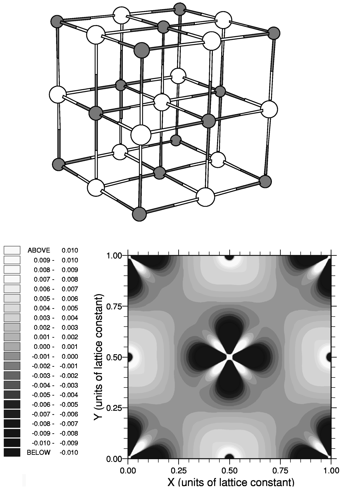
*   **来源**：[[../papers/dudarevElectronenergylossSpectraStructural1998a]]
*   **图示描述**：上图为 NiO 岩盐（NaCl 型）晶体结构示意（白球为氧、灰球为镍）；下图为在 (100) 晶面上 LSDA+U（Ū=6.2 eV）相对于 LSDA 的电荷密度差 Δρ = ρ(LSDA+U) − ρ(LSDA) 的空间分布。
*   **关键特征**：(1) Ni–O 之间的间隙区域 Δρ 为负，即 LSDA+U 下该区域成键电荷减少；(2) 电子云收缩至 Ni 离子周围，反映 3d 电子因在位库仑排斥而更局域；(3) 该图像与图1 中低能 O 2p–Ni 3d 杂化峰被压低、向高能移动完全自洽，而对应 O 2p–Ni 4s/4p 的高能峰几乎不受影响，体现 U 的轨道选择性。

### 32. 图1 Sc₂P₂Se₆ 和 ScCrP₂Se₆ FE 相晶体结构（俯/侧视图，箭头为极化方向）

*   **来源**：[[../papers/fengFerroelectricityMultiferroicityTwodimensional2020]]
*   **图示描述**：(a) Sc₂P₂Se₆ 与 (b) ScCrP₂Se₆ 铁电相的俯视图与侧视图，菱形框标记原胞，箭头指示垂直于平面的自发极化方向。
*   **关键特征**：Sc₂P₂Se₆ 空间群 P31m、a=6.683 Å；ScCrP₂Se₆ FE 相空间群 P3、a=6.535 Å；铁电性源于半数 P 原子相对 Se 面的垂直翘曲（而非 CuInP₂S₆ 中 Cu 离子位移），由 Sc³⁺ 大离子半径迫使 P 离开平面、破缺反演对称性；AFE 相 ScCrP₂Se₆ 畸变为 P1，a=6.303 Å、b=11.651 Å。

### 33. tab_2

*   **来源**：[[../papers/fengFerroelectricityMultiferroicityTwodimensional2020]]
*   **图示描述**：ScCrP₂Se₆ FE 与 AFE 相沿 [100]、[010]、[110]、[001]、[111] 五个方向的磁各向异性能，易轴能量置零。
*   **关键特征**：FE 相 MAE = 7.2/0.0/31.2/106.9/195.7 μeV（易轴 [010]）；AFE 相 MAE = 123.9/82.7/31.8/156.5/0.0 μeV（易轴 [111]）；相变不仅翻转磁序，也翻转易轴方向，体现磁与晶格的强耦合。

### 34. 图3 四种 (W,X) 参数下单链 |a_n(t)|² 与晶格位移平方的时间演化

*   **来源**：[[../papers/fornerQuantumTemperatureEffects1993]]
*   **图示描述**：T = 300 K、|D₁⟩ 态、M = 342 mₚ 的 50 格点单链上，四种 (W, X) 组合下酰胺-I 概率 |a_n(t)|²（上半）与平方晶格位移 D_n(t) = [q_{n+1}−q_n]²（下半）随时间的堆叠演化；横轴为格点 n（1–50），时间轴由远及近。
*   **关键特征**：(a) W=40 N/m, X=20 pN 时孤子与声波作用后主体反射、残余激发形成第二个慢速反向孤子；(b) W=40, X=40 时孤子展宽并最终分裂为两个反向传播孤子；(c) W=60, X=20 时孤子完整穿越并同时经受冲击波与端面反射；(d) W=60, X=40 时孤子穿越但与声波作用期间振幅减小。

### 35. 图1 NiI₂ 晶体结构、手性螺旋、电磁振子

*   **来源**：[[../papers/gaoGiantChiralMagnetoelectric2024a]]
*   **图示描述**：六联图总览 NiI₂ 的结构-磁序-激发：(a) 左旋/右旋自旋螺旋示意图展示磁致手性；(b) 高温 R3̄m 菱方晶格中 Ni（蓝）被 I（红）八面体包围形成三角晶格层；(c) THM≈60 K 以下 (001) 面内 proper-screw 螺旋序，传播矢量 q=(0.138a*,0,1.457c*)，面内分量 qin 垂直于沿 y ∥ C₂ 轴的电极化 P；(d) 2.4 K 下 σ⁺/σ⁻ 圆偏振低频拉曼谱；(e) DFT 在 7×1 单层超胞算得的电磁振子能量-动量色散；(f) EMo/EMe 的自旋进动本征矢及 ΔP、ΔM 矢量方向。
*   **关键特征**：零场冷下 TAFM≈75 K 进入共线 AFM、THM≈60 K 进入螺旋多铁相；σ⁺/σ⁻ 拉曼在 4.09 meV（~0.99 THz，EMo，C₂-奇）与 4.51 meV（~1.09 THz，EMe，C₂-偶）出现不对称双峰，直接显示手性；DFT 给出区心 EMo≈3.92 meV、EMe≈4.30 meV，与实验吻合；EMo 的 ΔP、ΔM 垂直 C₂ 轴，EMe 平行 C₂ 轴；基态二维 Pel=5.3×10⁻¹³ C m⁻¹，EMo 电偶极矩 do=2.5 μB/c、EMe de=10.3 μB/c。

### 36. β'-In2Se3晶体结构与三个极化变体

*   **来源**：[[../papers/gaoStrainEngineeringFerroelectric2024]]
*   **图示描述**：展示顺电相 β-In₂Se₃ 的俯视图/侧视图（中心 Se 位于反演对称中心）和铁电相 β'-In₂Se₃ 三个取向变体 FE-P₀、FE-P₆₀、FE-P₁₂₀ 的原子排布，红色箭头标出面内极化方向（与中心 Se 位移方向相反）。
*   **关键特征**：PE 相 a=b=4.014 Å，具空间反演对称；FE 相比 PE 相低 0.083 eV/f.u.，FE-P₀ 中 a=4.127 Å、b=6.876 Å，沿极化方向自发伸长、垂直方向收缩；六方三重对称给出 0°、60°、120° 三个等效极化方向（加反向共六态）。

### 37. 单轴应变调控能量、极化与势垒

*   **来源**：[[../papers/gaoStrainEngineeringFerroelectric2024]]
*   **图示描述**：四个子图分别为 (a) 三种取向变体能量差随 x 方向单轴拉伸应变的变化，(b) FE-P₀ 与 FE-P₆₀ 的极化分量 Px、Py 随应变的变化，(c) 不同应变下 FE-P₆₀→FE-P₀ 的 CI-NEB 势垒曲线，(d) FE-P₆₀ 原子结构随应变演化的快照。
*   **关键特征**：约 3% 拉伸时 P₆₀/P₁₂₀ 能量曲线突然变平（其 a 已等于 P₀ 平衡晶格常数），FE-P₆₀ 的 Px 增至最大、Py 降至零，极化矢量转向 x 方向；无应变时 FE-P₆₀→FE-P₀ 势垒约 7.5 meV/f.u.，2% 拉伸下势垒趋近于零；撤去应变 fully relax 后仍停在 FE-P₀。

### 38. 转变应变张量定义

*   **来源**：[[../papers/gaoStrainEngineeringFerroelectric2024]]
*   **图示描述**：以 PE 相未畸变晶格矩阵 H₀ 为参考，定义 FE 变体 H_i 相对其的 Green-Lagrange 应变张量 η_i0 = ½[H₀^(−T) H_i^T H_i H₀^(−1) − I]，上标 T 为矩阵转置、I 为 2×2 单位阵。
*   **关键特征**：将 PE→FE 相变伴随的有限晶格畸变统一为一个 2×2 面内张量，是定量判断"哪种应变驱动哪种变体转换"的理论起点。

### 39. 图2 Kittel定律验证

*   **来源**：[[../papers/gomez-ortizKittelLawDomain2023]]
*   **图示描述**：(a) n=8–16 u.c. 各层厚下，每个五原子单胞能量（meV/5-atom cell）随横向尺寸 L（u.c.）的 U 型曲线；(b) 由曲线极小值经 ω=L/2−1 得到的 ω²（u.c.²）对 PbTiO₃ 层厚 d（u.c.）作图，红点为全能量最小化、蓝方块为图3 力常数带结果，并附线性拟合。
*   **关键特征**：n 越大，整体单胞能量越低（PbTiO₃ 极化趋体相、SrTiO₃ 极化减小，从静电耦合过渡到解耦），且能量极小值变浅并向更大 L 移动；两套数据均给出 ω²∝d 的线性关系，直接验证 Kittel 定律 ω²/δ=Ad；红点始终位于蓝方块上方，能量最小化法预测更宽的畴。

### 40. 图1 不同厚度 PTO/STO 超晶格的 DF-TEM、SAED 与 (103) RSM，周期从 13.8 nm 演变到 6.8 nm

*   **来源**：[[../papers/gongAbsenceCriticalThickness2023]]
*   **图示描述**：复合图，对 (PTOₙ/STOₙ)₁₀ 超晶格系列（n = 37, 28, 23, 19, 12, 9, 4, 2 u.c.）依次给出截面 DF-TEM 暗场像、内嵌的 (202) SAED 放大斑点，以及在衬底 (103) 反射附近、qₓ–q_z 散射平面内的对数 RSM；DF 像用 g = 002 衍射矢量拍摄。
*   **关键特征**：DF 像中的明暗强度调制和 SAED 主斑两侧的白色箭头卫星斑，共同指示面内长程有序的极性斯格明子晶格；RSM 中 q_z 方向的布拉格超晶格峰对应 PTO/STO 层厚的面外周期，qₓ 方向的卫星峰对应斯格明子面内周期，按 d = 1/Δqₓ 计算；八个厚度对应的周期依次为 13.8、11.1、10.0、9.5、6.8、6.7、5.2、6.8 nm；n = 19–37 区间周期随厚度减小而单调下降，符合 Kittel 定律，但 n = 2–12 区间周期维持在约 5–6 nm，n = 2 时反而回升至 6.8 nm，且 (PTO₂/STO₂)₁₀ 的 RSM 中仍有清晰卫星峰。

### 41. 图5 CuInP2S6：a)原子结构（S骨架中Cu/In/P-P填充八面体空隙）；b)不同Cu/In比下的PFM图像；c)2-4层CuInP2S6的AFM形貌、PFM振幅/相位及反偏压写入的相位图

*   **来源**：[[../papers/guanRecentProgressTwoDimensional2020]]
*   **图示描述**：(a) 对比中心对称 c1T 与畸变 d1T-MoS₂ 的原子结构、能带结构及电荷密度差；(b) 展示 MX₂（M=Mo,W；X=S,Se,Te）从中心对称相到三聚化相的畸变模式与锯齿链。
*   **关键特征**：电荷密度差图直观显示 Mo 原子面内位移打破反演对称，是二维铁电性的必要条件；三聚化形成“之”字形金属链，是自发极化的结构起源；对应 Shirodkar & Waghmare PRL 2014 提出的电子-声子耦合驱动的不正铁电性。

### 42. 块体与有机铁电体中的极性拓扑：BNT基陶瓷成分驱动畴演化；(4,4-DFPD)2PbI4象限畴；向列态铁电液晶的K11/K33-P0拓扑相图

*   **来源**：[[../papers/hanPolarTopologicalMaterials2025]]
*   **图示描述**：(a) Bi₀.₅Na₀.₅TiO₃ 基陶瓷中由化学组成驱动的畴演化；(b) (4,4-DFPD)₂PbI₄ 薄膜中极性象限畴的晶体结构与侧向 PFM 图像；(c) 向列态（NF）铁电液晶中依赖于展曲/弯曲弹性模量比 K₁₁/K₃₃ 与极化 P₀ 的拓扑相图。
*   **关键特征**：BNT 中成分微调可驱动条带畴到更复杂拓扑；2D 杂化钙钛矿 (4,4-DFPD)₂PbI₄ 中出现象限畴；液晶相图把拓扑类型与 K₁₁/K₃₃、P₀ 直接关联。

### 43. 手性表表征与操控：(PTO)n/(STO)n超晶格RSXD探测涡旋阵列手性；XCD mapping；La掺杂BFO纳米岛SHG-CD"电写光读"手性光电器件与"T"字阵列图案

*   **来源**：[[../papers/hanPolarTopologicalMaterials2025]]
*   **图示描述**：(a) 共振软 X 射线衍射（RSXD）利用圆偏振光探测涡旋阵列手性；(b) X 射线圆二色（XCD）mapping 显示不同区域涡旋阵列手性符号相反；(c) "电写-光读"手性光电器件概念；(d) SHG-CD 图中电场在有序 La 掺杂 BFO 纳米岛阵列上写入"T"字形手性图案。
*   **关键特征**：软 X 射线波长 2–3 nm 匹配约 11 nm 涡旋周期；La 掺杂 BFO 纳米岛约 250 nm，其孤立涡旋手性信号可被电场可逆、非易失地擦写；SHG-CD mapping 比例尺 1 μm。

### 44. 图1 单层结构、声子谱与双层自旋密度

*   **来源**：[[../papers/hanTunableSlidingFerroelectricity2025]]
*   **图示描述**：(a) 单层 RuX₂ 的俯/侧视原子结构，每个 Ru 由六个 X（Cl/Br/I）以三棱柱配位，六方晶格、空间群 P-6m2（No.187）；(b) RuCl₂、RuBr₂、RuI₂ 三种单层沿布里渊区高对称路径的声子色散；(c) 双层 RuCl₂ 在层间 AFM 与 FM 构型下的自旋极化电荷密度等值面（青/红分别为自旋上/下）。
*   **关键特征**：三条声子谱均无虚频，证明三种单层动力学稳定；配合 5×5×1 超胞 300 K、3 ps AIMD 无重构断键确立热力学稳定；AFM/FM 对比给出层内 FM、层间 AFM 的磁基态；Ru/X 磁矩分别为 RuCl₂ 3.33/0.26 μ_B、RuBr₂ 3.26/0.28 μ_B、RuI₂ 3.06/0.26 μ_B。

### 45. 图5 立方钙钛矿ABO3结构

*   **来源**：[[../papers/hillWhyAreThere2000a]]
*   **图示描述**：ABO3 立方钙钛矿晶胞的球棍模型，大 A 阳离子占据立方体八个顶角，小 B 阳离子位于体心，被六个灰色氧阴离子构成的正八面体包围。
*   **关键特征**：B 位离子处于氧八面体中心，居里温度以下沿 <111> 或 <100> 方向偏心位移即可产生自发极化；A 位离子半径与 A–O 共价性会通过晶格应变远程影响铁电稳定性。此结构是讨论 d0 规则与 BiMnO3、YMnO3 两个反例的共同结构起点。

### 46. 图15 六方钙钛矿（YMnO3，Mn为5配位）

*   **来源**：[[../papers/hillWhyAreThere2000a]]
*   **图示描述**：YMnO3 六方钙钛矿（P63cm）高温顺电结构，展示密排氧层的 ABC–ACB 堆垛，Mn 位于五配位三角双锥位置，Y/稀土占据七配位空隙。
*   **关键特征**：Mn 由立方相的 6 配位八面体变为 5 配位三角双锥（dsp3 杂化），配位多面体本身缺乏反演中心，为铁电偶极提供"结构双阱"；Y3+ 半径过小无法稳定立方钙钛矿，转而稳定该六方相；铁电居里温度约 914 K，奈尔温度约 80 K，是结构驱动绕开 d0 规则的代表。

### 47. 图6 带电 CrBr₃ 单层中 CrBr₆ 八面体不对称 Jahn-Teller 畸变诱导面内 FE+FM
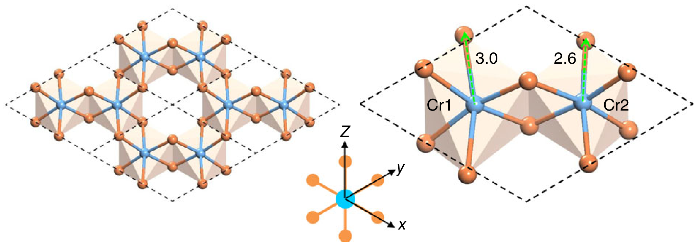
*   **来源**：[[../papers/huProgressProspectsLowdimensional2019]]
*   **图示描述**：带电 CrBr₃^{0.5−} 单层中 [CrBr₆] 八面体发生不对称二阶 Jahn-Teller 畸变，Cr1 与 Cr2 位点位移不等，导致电荷/轨道有序化并出现面内净极化；同时 Cr 自旋保持铁磁排列。
*   **关键特征**：无需外来吸附原子，仅靠电荷掺杂+电荷轨道自旋晶格耦合即可同时产生 FE 与 FM；面内极化方向与 FM 易轴平行共线，便于电场对磁化的直接调控；机制归属二阶 JT 图像（拉伸降低库仑排斥、共价项占优）。

### 48. 图3 80 K SAED花样与Td/1T′超晶格原子模型，统一空间群Pm

*   **来源**：[[../papers/huangPolarPhaseDomain2019]]
*   **图示描述**：(a) 80 K 截面 SAED 花样，用不同颜色线条同时标定出 1T′-I、1T′-II 与 Td 三相的衍射斑点，通过 (110) 与 (1-12) 晶面夹角可区分单斜 1T′ 与正交 Td；(b–e) 不同周期的 −(Td)ₘ(1T′)ₙ− 超晶格原子堆垛模型（如 −(Td)₂(1T′)₂−、−(Td)₄(1T′)₂− 等），所有模型统一在空间群 Pm（#6）下。
*   **关键特征**：倒空间（衍射斑点叠加）与正空间（原子模型）相互印证三相共存；实验最薄周期约 6 层；Pm 同时是 P2₁/m（1T′）与 Pmn2₁（Td）的子群，为共存相提供统一对称性描述。

### 49. 图3

*   **来源**：[[../papers/huangTwodimensionalIn2Se3Rising2022]]
*   **图示描述**：(A) 单层 In₂Se₃ 五层原子（Se–In–Se–In–Se）三角晶格的俯视图；(B)–(D) 为 α 相三维结构与侧视图，标出 OOP（黑箭头）与 IP（红箭头）极化；(E) 为中心对称的 β 相；(F) 为中心 Se 偏离对称中心、带 IP 极化的 β′（β0）畸变相。
*   **关键特征**：α 相中顶层 In 为四面体配位、底层 In 为八面体配位，配位不对称是铁电性的结构起源；OOP 与 IP 两种极化方向互锁，翻转其一必翻转另一；β 相两个 In 亚层均为八面体配位、中心 Se 在对称中心，整体无极化；β′ 相中心 Se 偏心畸变，能量比 β 相更低，存在 IP 极化。

### 50. 图12 HgI2 双层：双阱、屏蔽电荷积分求极化、Rashba 自旋织构、室温稳定

*   **来源**：[[../papers/kaurRecentAdvancesTheoretical2025a]]
*   **图示描述**：(a) 极性 ±P 与非极性 PE 块体 HgX2 晶体结构；(b)(c) 块体与双层的能量双阱及极化曲线；(d) 三至六层 HgI2 的面平均屏蔽电荷；(e)(f) 总层间极化与平均层间极化随层数变化；(g) FE-HgI2 双层 +P 态在 kx–ky 面 VBM/CBM 的自旋织构。
*   **关键特征**：双层极化由 FE 与 PE 相面平均屏蔽电荷密度差积分 P=m/d 求得；HgI2 双层呈现 Rashba 自旋织构并具有室温稳定性，为低成本自旋电子学提供候选。

### 51. 图20 四层 MnBi2Te4：破 P 对称的铁电 QAH 绝缘体，σxy=±e²/h，陈数随层间距变化

*   **来源**：[[../papers/kaurRecentAdvancesTheoretical2025a]]
*   **图示描述**：(a) 块体 MBT 晶体结构；(b) 破 P 对称后四层 MBT (FL-MBT) 的 P1/P1′ 原子结构与 FE 翻转；(c) P1-FLMBT 的 NEB 势垒；(d) SOC 能带；(e) P1/P1′ 的反常霍尔电导；(f) 原始 FLMBT 陈数随表面单层与三层间层间距增量 δd 的变化。
*   **关键特征**：原始 FLMBT 因 P 对称无极化；顶层与底层反向轻微滑动（或滑动 P 对称中心双层）得到 P1/P1′ 极性态，P⊥=6.82×10⁻¹³ C/m；铁电 QAH 绝缘体 σxy=±e²/h，极化翻转逆转 AFM 自旋分布、Berry 曲率与手性边缘态；陈数对表面层间距敏感，小角扭转可获更稳定的大畴。

### 52. 图1(a) -10 V/0.5 ms 脉冲后大范围 STM 形貌，可见中心移除坑及周围 T 相(√13×√13 CDW) 与新生 H 相(平坦三角晶格) 共存，357×357 Å

*   **来源**：[[../papers/kimObservationPhaseTransition1997]]
*   **图示描述**：针尖脉冲（十字标记处）在中心打出一个整层移除的暗坑（电子轰击升华所致），坑周围可见两类区域——右上/左侧为带强烈周期起伏（周期约 13 Å）的原始 T 相 √13×√13 CDW，中部为平坦、无 CDW 调制的新生 H 相三角晶格（a₀≈3.3 Å）；方框区在同图(b)中放大。
*   **关键特征**：(1) 两相跨界无高度台阶，截面分析证实高度连续；(2) 相界呈约 60°/270° 的特征三角形夹角；(3) 三角相界角部 CDW 极大值行（白线）相对未畸变 CDW 晶格旋转 13°–15°，被解释为 CDW 孪晶被界面钉扎后的重排；(4) 相变阈值偏压约 −8 至 −9 V，−10 V 下 H 相区尺寸 100–500 Å。

### 53. 图2 相界高分辨原子像：(a) -250 mV 同时显示 T 相 CDW 超晶格相对原子晶格旋转约 14°，(b) -10 mV 显示跨相界原子行平行但存在分数倍错位，77×77 Å

*   **来源**：[[../papers/kimObservationPhaseTransition1997]]
*   **图示描述**：同一相界区域在两种偏压下成像；(a) −250 mV、1 nA 时 T 相区（左上）的 √13×√13 CDW 超晶格相对底层原子晶格旋转约 14°，H 相区（右下）显示三角原子晶格；(b) −10 mV 低偏压下两区域均显出相同的原子晶格，白线沿跨界原子行描绘。
*   **关键特征**：(1) 两相的底层原子晶格具有几乎相同的间距和取向，排除了重结晶或大范围破坏；(2) 跨界原子行彼此平行，但横向位移为晶格常数的分数倍而非整数倍；(3) 相界处两行原子充当"缓冲行"，构成位错阵列；(4) 该分数错位与图3模型预测的 (√3/6)a₀≈1 Å 定量吻合。

### 54. 图4 另一处高压脉冲后典型 STM 像，多个 H 相区域的相界均沿晶体方向呈 60° 特征角，102×102 Å

*   **来源**：[[../papers/kimObservationPhaseTransition1997]]
*   **图示描述**：另一脉冲点附近的典型 STM 像，显示多个独立的新生 H 相区域及其边界。
*   **关键特征**：(1) 多数相界沿三角晶格的密排高对称方向延伸，特征夹角稳定在 60°；(2) 60° 角对应三角/六方晶格的本征晶格角，而非偶然形貌；(3) 该几何在不同脉冲位置重复出现，证明相变具有晶体学择优取向而非随机破坏。

### 55. 图2 金刚石/β-Sn/fcc/bcc/sc 多相 E-V 与 P-V 状态方程，验证赝势（金刚石→β-Sn 相变压计算 75 kbar vs 实验 100 kbar）
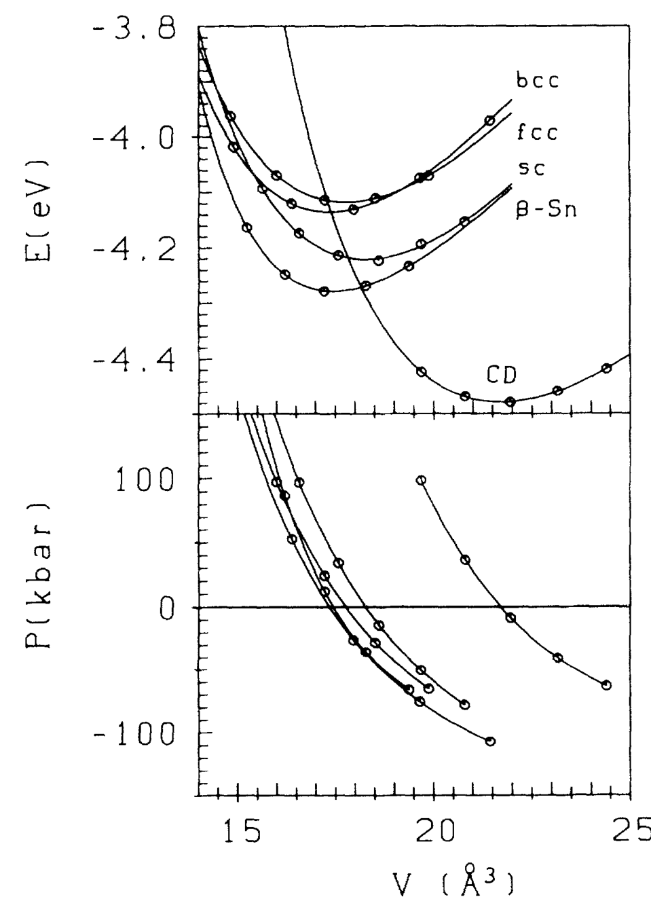
*   **来源**：[[../papers/kresseInitiomoleculardynamicsSimulationLiquidmetalamorphoussemiconductor1994]]
*   **图示描述**：固态 Ge 在金刚石（CD）、β-Sn（白锡）、fcc、bcc、sc 五种晶体结构下的能量-体积 E(V) 与压强-体积 P(V) 状态方程曲线，横轴为体积（ų/atom），左/右纵轴分别为能量（eV/atom）与压强（kbar）。
*   **关键特征**：金刚石相能量最低，晶格常数误差 1.3%；公切线给出金刚石→β-Sn 相变压 P≈75 kbar（实验 100 kbar）；12 Ry 截断即可把总能收敛到 1 mRy/atom；Vanderbilt 非局域赝势（R_c=1.5 a.u.，p 局域、s/d 非局域）在各相间可移植。

### 56. 图6 过冷液态 Ge（750–650 K）：四面体角峰增强，但仍金属性
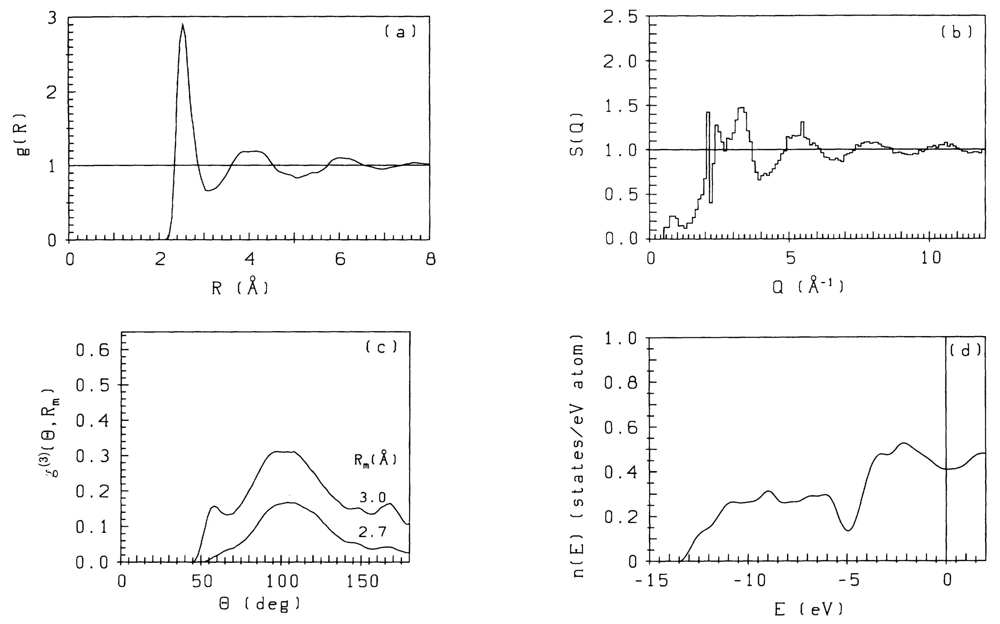
*   **来源**：[[../papers/kresseInitiomoleculardynamicsSimulationLiquidmetalamorphoussemiconductor1994]]
*   **图示描述**：与图 5 同构的四联图，但数据取自 750→650 K 连续降温过程中采样的过冷液体，显示转变前夕的结构与电子态。
*   **关键特征**：N_c 降至 4.63，平均最近邻距离 d₁=2.63 Å；g(R) 第一、二峰变高变对称；键角分布中 109° 四面体峰显著增强，但 60° 密堆积峰仍可见；DOS 在 E_F 处态密度虽略降仍为金属性，价带开始显露 sp³ 子带雏形。

### 57. 小分子键长对比 PAW/US-PP/AE（表I）

*   **来源**：[[../papers/kresseUltrasoftPseudopotentialsProjector1999c]]
*   **图示描述**：对比 H₂、Li₂、N₂、F₂、BF₃、SiF₄、H₂O 等小分子在 US-PP、PAW 与弛豫核心全电子（AE）三种方法下的平衡键长（Å）及水分子键角（°）；括号内为采用更硬 r_c（r_c≈1.1 a.u., E_cut≈700 eV）的结果。
*   **关键特征**：(1) PAW 与 AE 差异普遍 <0.1%，例如 N₂ 键长 PAW = 2.076 Å、AE = 2.068 Å，F₂ = 2.633 vs 2.615 Å；(2) 硬 PAW 进一步把 F₂ 推到 2.621 Å，更接近 AE；(3) BF₃、SiF₄ 等大电负性差体系软 PAW 误差仍 <0.5%；(4) US-PP 与 PAW 差异约 0.1%，但 Li/Na 含强局域半芯态时 US-PP 构建困难，Li 的 1s 甚至无法解冻。

### 58. 论文图3

*   **来源**：[[../papers/lezoualchStudyChargeDensity]]
*   **图示描述**：1T-VSe₂/1T-VTe₂ 单层的晶体结构、布里渊区高对称路径以及相关 CDW 超结构（如 4×4、√7×√3、4×1 等）的几何关系示意。
*   **关键特征**：标示出 1T 相八面体配位、V 原子 dz² 轨道主导的费米面以及不同软模波矢（1/2 Γ-M、3/5 Γ-K、1/2 Γ-K、1/3 Γ-K）在布里渊区中的位置，把 CDW 周期与动量空间失稳点一一对应。

### 59. 图1 1T与1T′-WTe2单层原子结构对比，示W原子二聚化之字形链

*   **来源**：[[../papers/liFerroelasticityDomainPhysics2016]]
*   **图示描述**：对比 WTe₂ 单层 1T 相与 1T′ 相的原子结构；左侧 1T 相中 W 原子（蓝）排成二维三角晶格、Te 原子（橙）构成正八面体配位，右侧 1T′ 相中 W 原子沿 [100] 方向二聚化成平行"之"字形链，八面体发生扭曲、对称性降低。
*   **关键特征**：1T 相二维原胞是边长 t₀ 的 120° 菱形，1T′ 相原胞为 a×b 矩形，对应 1T 的 1×√3 超胞；红色/绿色虚线框分别标出两种二维单胞；该 Peierls 畸变由费米面嵌套驱动，是后续三个取向变体与铁弹性的结构根源。

### 60. 图2 1T′相三个取向变体O1/O2/O3的起源与原子结构

*   **来源**：[[../papers/liFerroelasticityDomainPhysics2016]]
*   **图示描述**：(a) 在 1T 相 W 原子三角晶格上用箭头 1、2、3 标出三个对称等效的 Peierls 畸变方向；(b–d) 分别为沿这三个方向二聚化后弛豫得到的 O1、O2、O3 取向变体原子结构。
*   **关键特征**：三个变体的 W–W 二聚化链互成 120°：O1 链平行 x 轴，O2/O3 链与 x 轴约成 ±60°；三者同属 1T′ 结构、能量简并但晶格取向不同；这种 P3m2 三重对称自发破缺到矩形相，是铁弹性"多个能量相等取向态"判据的直接证据。

### 61. 图6 NEB计算的O1→O2变体切换路径与0.22 eV/f.u.势垒

*   **来源**：[[../papers/liFerroelasticityDomainPhysics2016]]
*   **图示描述**：(a) 爬升图像 NEB 计算得到的 O1→O2 变体切换能量沿反应坐标的变化，呈典型双势阱曲线；(b) 路径上初始态、过渡态、末态等关键点的原子结构快照，展示 W–W 二聚链逐步扭转、重排的过程。
*   **关键特征**：固定超胞 NEB 给出切换势垒约 0.22 eV/f.u.；广义固态 NEB（允许超胞自由度弛豫）给出 0.19 eV/f.u.，两者一致；显著低于 1T′↔2H 相变势垒 ~0.8 eV/f.u.；按 10 THz 光学声子尝试频率估算，0.2 eV 势垒对应约 0.2 ns 的时间尺度；势垒低的几何原因是变体切换只扭曲八面体配位，而 1T′→2H 需将八面体配位整体改为三角棱柱配位。

### 62. 图1 BP-VTe2晶体结构与能带、PP-VTe2顶视/侧视、布里渊区及模拟STM图像

*   **来源**：[[../papers/liMonolayerPuckeredPentagonal2022]]
*   **图示描述**：图1由五个子图组成，对比展示母体BP-VTe2与新相PP-VTe2的原子结构和电子结构：(a)块体黄铁矿相BP-VTe2晶体结构，绿色虚线标出V2Te4亚层；(b)BP-VTe2含/不含SOC的自旋极化能带；(c)单层PP-VTe2的顶视图与侧视图；(d)PP-VTe2（上）和BP-VTe2（下）的布里渊区与高对称动量路径；(e)PP-VTe2结构模型（上）及−0.5 eV偏压下的模拟STM形貌（下）。深蓝/浅青球为V原子，橙红/浅黄球为Te原子。
*   **关键特征**：BP-VTe2为半金属，自旋向上通道金属性、自旋向下通道带隙1.088 eV；每个V在八面体晶体场中3个未配对电子占据t2g能级，磁矩约3 μB/atom；BP-VTe2化学形成能−0.265 eV/atom（1T-VTe2为−0.307 eV/atom）。PP-VTe2空间群Pca21，矩形晶胞a=6.774 Å、b=6.655 Å，由两个化学键合的子层构成（单独子层不能稳定）；模拟STM最亮信号对应翘曲顶层Te原子，呈锯齿状图案。

### 63. 图2 非传统应变：不同激光能量(1.5 vs 2.7 J/cm²)生长BaTiO3的RSM与Δc/c≈4.1%晶格膨胀；Tc从~100°C升至>600°C；氧八面体旋转a⁻a⁻c⁺诱导杂化非本征铁电示意

*   **来源**：[[../papers/martinThinfilmFerroelectricMaterials2016]]
*   **图示描述**：a、b 子图为 PLD 激光能量分别取 1.5 与 2.7 J/cm² 时生长的 BaTiO₃ 薄膜的 X 射线倒易空间图（Qx、Qy 单位为 Å⁻¹）及其铁电性能曲线（电滞回线电场轴 kV/cm、极化轴 μC/cm²；温度曲线含 1/εr × 1000）；c 子图为钙钛矿 (A,A')B₂O₆ 中氧八面体 a⁻a⁻c⁺ 旋转模式打破反演对称、诱导杂化非本征铁电性的示意图。
*   **关键特征**：激光能量从 1.5 提至 2.7 J/cm² 时，薄膜由近共格应变态转为显著弛豫，面外晶格参数 Δc/c ≈ 4.1% 的各向异性膨胀，源于取向缺陷偶极子同时具有电偶极矩与弹性偶极矩并与极化、应变耦合；该缺陷工程把 BaTiO₃ 的居里温度 Tc 从块体约 120 °C 推高至 600 °C 以上（正文部分提及 >1000 °C），室温和 500 °C 下仍测得饱满电滞回线；c 图所示的 a⁻a⁻c⁺ 旋转模式由两种不同对称性的非极性光学模组合而成，可诱导可翻转的自发极化，是一条不依赖衬底失配的全新铁电生成路径。

### 64. 图4 双轴压缩应变对State-1/State-2极化的调控
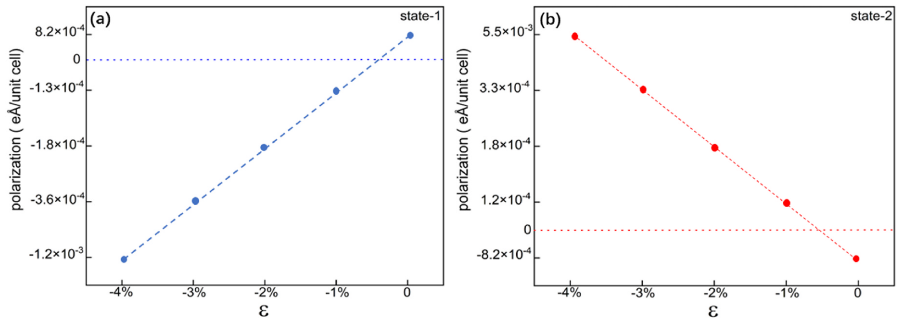
*   **来源**：[[../papers/miaoMagneticFerroelectricMetal2024]]
*   **图示描述**：(a, b) 分别为 State-1 和 State-2 的面外极化值随双轴面内压缩应变 ε（横轴从 0 到约 −4%）变化的柱状/折线图，纵轴单位为 eÅ/unit cell。
*   **关键特征**：零应变时 State-1 为 P↑、State-2 为 P↓；约 −1% 压缩应变即令两者极化方向同时反转；随应变量级增大，极化绝对值单调上升，State-1 在 ε = −1%, −2%, −3%, −4% 时分别约 −1.3×10⁻⁴、−1.8×10⁻⁴、−3.6×10⁻⁴、−3.1×10⁻³ eÅ/unit cell；机制是应变让层内 FeII 与 Ge 原子偏离 z 方向镜面位置、产生反向离子极化，当其超过电子极化贡献时总极化反转。

### 65. CuFeO2 中低对称额外耦合（helical spiral，P∥q）
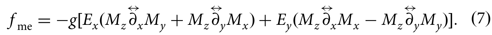
*   **来源**：[[../papers/mostovoyMultiferroicsDifferentRoutes2024]]
*   **图示描述**：铜铁矿 CuFeO₂（空间群 R3̄m）除标准 Lifshitz 项外，允许含 M_z ∂_x M_y、M_z ∂_y M_x 等组合的附加耦合，用于描述螺旋型螺旋（e₃∥q）诱导的极化。
*   **关键特征**：q∥x（二重轴）时极化 P∥q；q∥y 时 P 仍平行二重轴且垂直于 q；MnI₂、CoI₂（P3̄m1）中磁场在 ab 面旋转时极化以两倍角速度反向旋转。

### 66. 杂化非本征铁电 f_int = g Δ_1 Δ_2 E
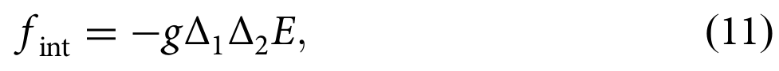
*   **来源**：[[../papers/mostovoyMultiferroicsDifferentRoutes2024]]
*   **图示描述**：双层钙钛矿 Ca₃Mn₂O₇ 中两个共存的周期晶格畸变（氧八面体倾斜 Δ₁ 与旋转 Δ₂，波矢 Q=(½,½,0)）的乘积与均匀电场耦合。
*   **关键特征**：Δ₁ 单独破反演但因波矢非零不能直接耦合均匀 E，必须通过 Δ₁Δ₂ 乘积；两个畸变的共同出现诱导宏观极化；是第 I 类多铁中将磁性与强极化绑定的关键路径。

### 67. 图1 MAX相及其对应MXene的原子结构对比

*   **来源**：[[../papers/naguib25thAnniversaryArticle2013a]]
*   **图示描述**：左侧为六方层状 MAX 相（P6₃/mmc，以 Ti₃AlC₂ 为代表），M（早期过渡金属）与 X（C/N）构成的 Mn+1Xn 八面体层被 A 层（主要为 Al）"胶合"交替堆叠；右侧为刻蚀掉 A 层、表面被 O/OH/F 等 T 基团封端后的二维 MXene 片层（Ti₃C₂Tₓ）。
*   **关键特征**：① M–X 层内为共价/金属/离子混合强键，M–A 为较弱金属键，这一键性差异是选择性刻蚀可行的结构根源；② 移除 A 层后 Mn+1Xn 骨架的面内原子排列完整保留，呈现"拓扑化学转化"而非非晶化；③ M₂X、M₃X₂、M₄X₃ 单层分别由 3、5、7 个原子层构成，厚度均 <1 nm；④ 该图定义了全文从 3D MAX 到 2D MXene 的结构叙事起点。

### 68. 表1 不同MAX相合成MXene的HF浓度、时间、c晶格参数及产率

*   **来源**：[[../papers/naguib25thAnniversaryArticle2013a]]
*   **图示描述**：汇总 Ti₂AlC、Ti₃AlC₂、Ti₃AlCN、Nb₂AlC、V₂AlC、Ta₄AlC₃、Nb₄AlC₃ 等 MAX 相合成对应 MXene 所需的 HF 浓度（约 10%–50%）、刻蚀时间（约 2–90 h）、刻蚀前后的 c 晶格参数及备注（如 V₂AlC 经研磨细化后由 90 h 缩至 8 h）。
*   **关键特征**：① 刻蚀条件随 M–Al 键能系统变化（Ti–Al 约 0.98 eV、Nb–Al 约 1.21 eV）；② n 越小越易被过度刻蚀（50% HF 会完全溶解 Ti₂AlC）；③ 刻蚀后 c 轴普遍增大，V₂CTₓ、Nb₂CTₓ 因层间水共插层 c 值异常大（约 23.96 Å、22.34 Å）；④ 该表是 MXene 合成条件"材料依赖性"的核心实验数据。

### 69. 图4 Ti3C2Tx纳米卷轴与OH封端Ti3C2纳米管原子模型

*   **来源**：[[../papers/naguib25thAnniversaryArticle2013a]]
*   **图示描述**：(a) 外径约 20 nm 的 Ti₃C₂Tₓ 纳米卷轴 TEM；(b) 卷轴截面 TEM，内径 <20 nm；(c) OH 封端 Ti₃C₂ 无缝纳米管的原子结构模型。
*   **关键特征**：① 超声处理可使分层 MXene 薄片像石墨烯一样自发卷曲成卷轴；② DFT 预测无缝 MXene 纳米管热力学稳定且保持金属性；③ 卷轴/管状形态为调控 MXene 的一维电子、力学与储质性质提供了新思路，是二维片之外的重要衍生结构。

### 70. 图6 肼插层OH-Ti3C2的分子动力学模拟：c轴随N/C比阶梯增大、单层排列、模拟与实验XRD吻合

*   **来源**：[[../papers/naguib25thAnniversaryArticle2013a]]
*   **图示描述**：(a) OH–Ti₃C₂ 的 c 晶格常数随插层 N₂H₄ 分子数（以 N/C 比表示）的变化曲线；(b) N/C≈0.375（4×2×1 超胞中 6 个 N₂H₄）时的 MD 快照；(c) 模拟（黑）与实验（蓝）XRD 图谱对比，插图为 (002) 峰区放大。
*   **关键特征**：① N/C≈0.4 时肼在层间形成平行于基面的完整单层，c 轴稳定在约 25–26 Å；② N/C 继续增大至约 0.875 时开始出现第二层但尚未完整，c 轴呈阶梯式增大；③ 模拟 XRD 的 (002) 峰位与实验吻合，验证了插层结构模型；④ 该图从原子尺度解释了插层致层间距增大的微观机制，为 DMSO 等大规模分层工艺提供理论支撑。

### 71. 周期性超胞示意：4根BTO纳米线嵌入BST基质

*   **来源**：[[../papers/nahasFrustrationSelfOrderingTopological2016]]
*   **图示描述**：模拟所用周期性超胞的三维示意，4 根截面为正方形的 BTO 纳米线以正方形阵列嵌入 Ba₀.₁₅Sr₀.₈₅TiO₃ 基质，轴向沿伪立方 [001]，x、y、z 三方向均施加周期性边界条件。
*   **关键特征**：超胞尺寸 32×32×6 个晶格常数；每根纳米线截面 n_x^W = n_y^W = 12（约 21.4 nm²），线间距 4 个晶格常数；BTO 与 BST 极化率差异使纳米线成为手性自由度的载体、基质成为被阻挫的对象；该几何参数（线径、间距）直接决定后续阻挫强度，是全文所有计算与讨论的空间基础。

### 72. 5 K下C1–C4四种手性构型的面内偶极场与涡旋/反涡旋分布

*   **来源**：[[../papers/nahasFrustrationSelfOrderingTopological2016]]
*   **图示描述**：5 K 弛豫后 C1:[++++]、C2:[--+-]、C3:[--++]、C4:[-++−] 四种手性构型在任意 (001) 面内的电偶极矢量场，深色箭头为纳米线内偶极子、浅色箭头为基质偶极子，蓝点为涡旋（拓扑荷 +1）、红点为反涡旋（拓扑荷 −1）。
*   **关键特征**：以 C1 为参考，C2/C3/C4 每单胞能量差仅 0.76 / 0.86 / 1.55 meV，冷启动退火可落入任一构型，构成准四重基态简并；C4（反铁环形排列）中涡旋与反涡旋呈高度有序的交错（staggered）自组装阵列，是铁电体中首次报道的几何阻挫诱导周期性缺陷有序结构；缺陷由 O(2) 卷绕数按小方格四偶极投影在单位圆上的覆盖方向判定（逆时针 +1、顺时针 −1、未覆盖无缺陷）；不同手性输入导致基质微结构迥异，直接证明手性对基质施加了不相容的取向边界条件。

### 73. 阻挫定量证据：逆介电常数-温度、MC自相关函数、缺陷空间概率分布

*   **来源**：[[../papers/nahasFrustrationSelfOrderingTopological2016]]
*   **图示描述**：三子图组合。(a) 构型 C10（线间距加大至 6 个晶格常数）的逆面内介电常数 χ⊥⁻¹=(χ₁₁+χ₂₂)/2 随温度 T 的变化，红线为高温线性拟合，箭头标出 T_ord 与 θ_CW；(b) 5 K 下 C1–C4 缺陷空间分布的蒙特卡洛时间自相关函数 G(δt_s)；(c) 5 K 下 C4 构型缺陷空间概率分布（黄→深蓝表示高→低概率，统计自 100000 次弛豫后 5000 次扫描）。
*   **关键特征**：高温拟合得 θ_CW ≈ 240 K，基质有序化温度 T_ord ≈ 75 K，C10 的阻挫指数 f = θ_CW/T_ord ≈ 3.2；C1–C4 的 f 分别为 3.09、3.13、3.68、4.03，C4（反铁环形）阻挫最强，增大线间距（C10 vs C1）会减弱对基质缺陷的约束、增强阻挫；χ⊥⁻¹ 在 240→75 K 区间保持准线性，表明基质偶极在 θ_CW 以下仍近似自由涨落、顺相被异常延长；G 随 δt_s 下降表明基质缺陷在 5 K 仍持续空间涨落（纳米线内涡旋 G=1 保持钉扎），C4 下降幅度最大、与其 f 最大一致；概率图中纳米线中心亮斑尖锐（钉扎），基质中阵列弥散（浮动特性），单胞能量标准差约 10⁻⁵ eV，T→0 时熵非零即存在剩余构型熵；两次相变分别发生在约 330 K（纳米线获得非零环形矩 z 分量、面内磁化率小尖峰）和约 75 K（基质涡旋/反涡旋数目守恒、面内磁化率显著尖峰）。

### 74. 图2 CIPS中in-layer与in-gap FE相结构及DFT能量-c轴曲线（能差21.6 meV/f.u.）

*   **来源**：[[../papers/neumayerCompetingPolarPhases2025]]
*   **图示描述**：(a)(b) 为 CIPS 晶体结构示意，黑色箭头标示极化方向，Cu 原子位置以分布函数示意；(a) 中 Cu 位于 P₂S₆ 层内（in-layer / LP 相），(b) 中 Cu 移入 vdW 间隙（in-gap / HP 相）；(c) 为 DFT 计算的能量–c 轴晶格参数曲线，纵轴单位 meV/f.u.，横轴单位 Å。
*   **关键特征**：LP 相自发极化 5.0 μC/cm²、压电系数 −15.6 pm/V（负压电）；HP 相自发极化 11.3 μC/cm²、压电系数 +2.5 pm/V；两条抛物线能量极小值仅相差 21.6 meV/f.u.，且平衡 c 轴略有偏移；极小值附近的非谐势阱是负压电效应的结构来源。

### 75. 图2：CsxSi32O64 (x=0, 3.6, 4.6)的实验(圆圈)与模型(实线)PDF G(r)
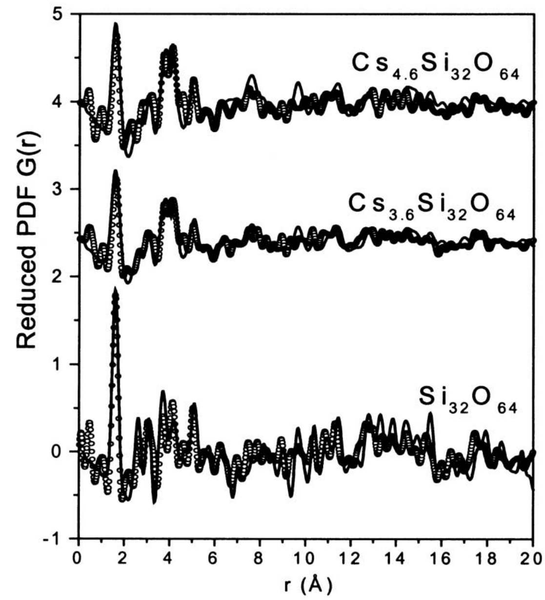
*   **来源**：[[../papers/petkovStructureIntercalatedCs2002]]
*   **图示描述**：三组 PDF 曲线纵向错开排列，分别覆盖纯沸石骨架以及两种 Cs 负载样品；圆圈是 NSLS X7A 光束线 29.09 keV 同步辐射实验数据，实线是在 I2/m 空间群约束下用 PDFFIT 计算的模型 PDF。
*   **关键特征**：三条曲线在 r ≈ 1.61 Å 处均有尖锐峰，对应 SiO₄ 四面体的 Si–O 键长，证明 Cs 嵌入后沸石基本骨架单元未被破坏；掺 Cs 样品在 r ≈ 4 Å 处出现一个随 x 增大而增强的新峰（箭头标出），被明确归因于含 Cs 原子对（Cs–Cs 或 Cs–骨架）的关联；锯齿链 Cs⁺ 模型实线与实验圆圈在整个 r 范围高度吻合，而 Cs⁰（半径 2.67 Å）和 Cs⁻（半径 3.5 Å）模型均无法重现数据。

### 76. 图4：CsxSi32O64原子结构片段，Cs+离子(红)在纳米孔中组装成锯齿形链，O为蓝色，Si为黑色

*   **来源**：[[../papers/petkovStructureIntercalatedCs2002]]
*   **图示描述**：红色大球为 Cs⁺ 离子，蓝色为 O 原子，黑色为 Si 原子；视角沿 ITQ-4 单斜晶胞 c 轴方向展开，可见直径约 7 Å 的伪一维正弦形孔道。
*   **关键特征**：Cs⁺ 紧贴孔道壁交替占据 I2/m 空间群中的 4h (1/2, y, 0) 与 4g (0, y, 0) 位，y 分别为 0.870(5) 和 0.370(5)；当 x 接近 4 时这两组位点恰好半满，形成连续的之字形阳离子链；链上相邻 Cs⁺–Cs⁺ 最小间距约 5.2 Å，是紧密堆积趋势与同号电荷库仑排斥相平衡的结果；当 x > 4 必须占据超过一半位点，迫使出现约 4 Å 的过近 Cs⁺–Cs⁺ 接触，库仑排斥能骤增，解释了实验上 x ≈ 4.6 的合成上限。

### 77. 图1 WTe₂晶体结构（Td相，Pmn21）、XRD、R-T金属行为及SdH振荡

*   **来源**：[[../papers/sharmaRoomtemperatureFerroelectricSemimetal2019]]
*   **图示描述**：图1为"WTe₂的晶体与电子结构"多面板图：A为Td相正交结构原子模型（W被Te八面体包围，W链沿a方向略呈锯齿状弯曲）；B为(00l)面XRD谱；C为电阻-温度（R-T）曲线；D-E为30 mK、最高10 T磁场下的Shubnikov-de Haas（SdH）振荡及其FFT频谱。
*   **关键特征**：B中(00l)衍射峰尖锐，证实为c轴择优取向的高质量Td相单晶；C中电阻从300 K到10 K单调下降（dR/dT>0），属典型金属行为；D中电阻在1/T轴上呈周期性振荡，是费米面存在的直接证据；E的FFT出现四个主频，对应两个电子型与两个空穴型费米口袋，解释了WTe₂的巨大非饱和磁阻。

### 78. 图1 LPE制备流程与b-AsP晶体结构

*   **来源**：[[../papers/shuTwoDimensionalBlackArsenic2020]]
*   **图示描述**：左面板为液相剥离法（LPE）制备流程示意——块体 b-AsP 晶体在溶剂中经探头超声剥离、离心分离得到含少层纳米片的分散液；右面板为 b-AsP 的正交晶系褶皱蜂窝晶格球棍模型，As 与 P 原子比例约 0.2:0.8，层间为弱范德华作用、面内为强共价键。
*   **关键特征**：层状结构是 LPE 可剥离的结构基础；褶皱蜂窝晶格继承自黑磷并由 As 随机取代部分 P；As 掺杂破坏了原有的镜面对称性，为后续低复合率提供结构前提。

### 79. 图2 在网法晶格偏差示意：格点轨迹偏离真实梯度线，使分割面沿网格方向对齐

*   **来源**：[[../papers/tangGridbasedBaderAnalysis2009]]
*   **图示描述**：在一张二维网格上叠加真实的连续梯度线（蓝色弯曲箭头）和真实分割面（红色斜线），对比在网法实际走出的直箭头路径；浅蓝点本应属于另一侧 Bader 体积，却被错误归入当前区域。
*   **关键特征**：二维只有 8 个、三维只有 26 个离散跳跃方向，无法精确跟随与网格成小角度的连续梯度；格点路径偏离真实轨迹并跨越真实零通量面；最终分割面被"拉成"沿 x 格点方向的直线/折面；这一偏差在网格无限加密的极限下仍然存在，无法靠提高分辨率消除。

### 80. 图6 NaCl晶体中Na离子Bader价电荷随网格密度的收敛性：近网法单调收敛到0.828 e，在网法残留约0.01 e系统偏差

*   **来源**：[[../papers/tangGridbasedBaderAnalysis2009]]
*   **图示描述**：横轴为电荷密度网格点数（从 60³ 到 350³，约 0.2–4 千万点），纵轴为 NaCl 晶体中 Na 离子的价电荷（e）；蓝色虚线 0.828 e 为近网法在极密网格下的收敛基准，蓝点为近网法结果、黑点为在网法结果，插图为 8 原子 NaCl 晶胞。
*   **关键特征**：计算条件为 VASP + PW91、PAW/Vanderbilt 赝势、262.5 eV 截断、3×3×3 Monkhorst–Pack k 点、晶格常数 5.86 Å；近网法曲线随网格加密单调、平滑地收敛到 0.828 e；在网法即使加密到约 4×10⁷ 点，仍残留约 0.01 e 的系统性偏差且不消失；必须把赝势冻芯电荷加回电荷密度网格才能得到准确 Bader 电荷。

### 81. 图1 单层与双层 CrTe₂ 的原子级结构与电子性质：1T 结构模型、单层 STM/LEED（0.37 nm，z-AFM 锯齿条纹）、双层 STM/LEED（0.37+0.39 nm 两套斑点，第二层六方密堆积 FM）、dI/dV 证实金属性

*   **来源**：[[../papers/tianRoomtemperatureTwodimensionalMultiferroic2026]]
*   **图示描述**：8 个面板 (a–h) 依次给出 1T-CrTe₂ 晶体结构模型（Cr 被 Te 八面体配位的层状三角结构），单层 CrTe₂/石墨烯/SiC(0001) 的 STM 形貌（台阶 0.8 nm）、90 eV LEED 斑点（晶格 0.37 nm）、−0.1 V 高分辨 SP-STM 锯齿条纹（a=0.74 nm、b=0.64 nm，对应 2×√3 重构），以及双层的 STM 形貌（第二层高出 0.6 nm）、LEED（同时出现 0.37 nm 外圈与 0.39 nm 内圈两套斑点）、第二层六方密堆积 SP-STM（0.39 nm）和单层/双层 dI/dV 谱。
*   **关键特征**：单层 LEED 晶格 0.37 nm、SP-STM 呈锯齿状条纹，对应 z-AFM 序；双层 LEED 出现 0.37 nm（第一层）+0.39 nm（第二层）两套斑点，SP-STM 第二层为六方密堆积，指示第一层 AFM、第二层 FM 的异层磁构型；dI/dV 在费米能级非零，单层与双层均为金属，奠定"二维多铁金属"基础；拉曼 E₂g（126.6 cm⁻¹）、A₁g（142.9 cm⁻¹）在大气暴露两周后仍可探测。

### 82. 图2 WTe2原子结构模型与含孪晶畴界的高分辨STM图像

*   **来源**：[[../papers/wangFormationMechanismTwin2019]]
*   **图示描述**：(a)(b) 分别为三维 Td-WTe₂ 侧视图与单层 1T'-WTe₂ 俯视图（W 棕色、顶表面较高 TeTH 蓝色、较低 TeTL 橙色、底层 TeB 灰色）；(c) 为 Vbias = 5 mV 下原始 WTe₂ 的高分辨 STM；(d) 为 Vbias = 2.08 V 下含 TDB 的表面形貌；(e) 为 Vbias = 9.57 mV 下 TDB 的原子分辨像；(f) 为对应 11 个原子层宽孪晶区的结构模型，蓝色阴影为孪晶区，各图标尺 1 nm。
*   **关键特征**：从 (c) 测得晶格常数 a 轴 3.48 Å、b 轴 6.25 Å，与早期报道一致；(d) 中高偏压使孪晶区呈亮斑，内部条纹方向与基体明显不同；(e) 测得孪晶内部条纹与基体条纹夹角约 122°，略偏离理想 1T 相的 120°，源于 1T→1T' 晶格畸变；模型 (f) 预测 TDB 完全平坦，而实验中 TDB 总伴有表面褶皱（褶皱宽约 6 nm、高约 150 pm），这一差异是后续应变分析的关键线索。

### 83. 图3 正常区域与孪晶区域的GPA应变映射及统计

*   **来源**：[[../papers/wangFormationMechanismTwin2019]]
*   **图示描述**：(a)(b) 各含四幅子图——左上为高分辨 STM 原图，其余三幅为 GPA 得到的正应变 εxx、εyy 和剪切应变 εxy；x 轴沿 TDB 方向、y 轴垂直于 TDB，标尺 2 nm，(b) 中黑虚线标出 TDB 位置；(c) 为 (a)(b) 白框内 εxy 沿 x 方向的平均线轮廓；(d) 为多个相距远大于扫描窗口位置的应变均值（实心点）与标准差（误差棒）统计。
*   **关键特征**：正常区 (a) 晶格近乎完美，εxx、εyy、εxy 均接近零；孪晶区 (b) 中 εxy 在 TDB 附近呈大范围正值集中；线轮廓 (c) 显示正常区 εxy 在 (−1%, 1%) 内波动，而孪晶区跃升至 (5%, 9%)；多点统计 (d) 表明孪晶区 εxy 均值在所有位置都系统性增至 7%–9%，εxx 仅标准差升至约 4%、εyy 均值波动增大但标准差不变，唯独 εxy 呈一致性跃升。

### 84. 图1 Mn2(TTFTB)晶体结构：沿c轴纳米孔道、π-堆积TTF柱、配位水

*   **来源**：[[../papers/wangScreeningEnabledChemiresistiveMoisture2025]]
*   **图示描述**：以Mn₂(TTFTB)为代表展示M₂(TTFTB)系列的晶体骨架，三个子图分别为：(a) 沿晶体学 c 轴俯视的纳米孔道，(b) 垂直于 c 轴观察的长程 π-堆积 TTF 柱，(c) 金属-羧酸链局部放大，标注与金属离子配位的水分子；浅蓝/灰/红/黄/蓝绿球分别对应 H、C、O、S、Mn。
*   **关键特征**：导电主通道为沿 c 轴的一维 π-堆积 TTF 柱（through-space charge transport），四种同构材料相邻 TTF 间最短 S···S 距离仅 3.71–3.76 Å；金属-羧酸链上部分金属节点配位了水分子，孔道中同时存在硝酸根/氢氧根/羧酸根缺陷等电荷平衡阴离子，为后续"水-陷阱"相互作用提供结构位点。

### 85. 三层NiI2三明治器件、菱方晶体结构、STEM、圆偏振拉曼、MCD光谱
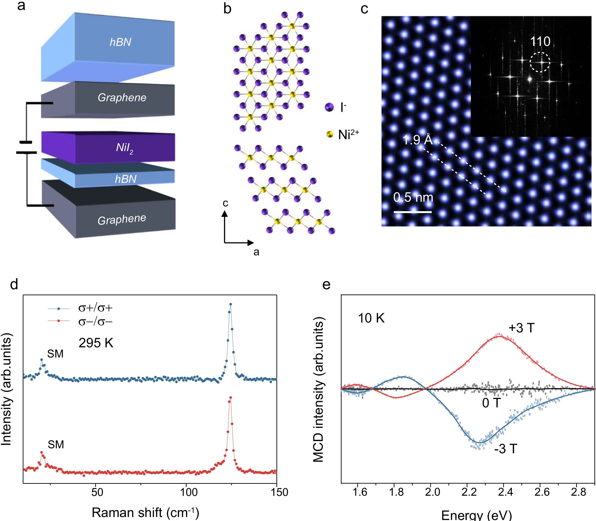
*   **来源**：[[../papers/wuCoexistenceFerroelectricityAntiferroelectricity2024]]
*   **图示描述**：图1从结构与磁性两个角度确认三层 NiI₂ 的样品质量与磁基态，包含五个子图：(a) Gr/hBN/NiI₂/Gr/hBN 三明治器件爆炸示意图；(b) 菱方（rhombohedral）晶体结构，Ni²⁺ 被 I⁻ 八面体包围、三层 (I–Ni–I) 为重复单元沿 c 轴错位堆垛；(c) 原子分辨率 ADF-STEM 图与 FFT 插图；(d) 室温圆偏振拉曼光谱；(e) 10 K 下 +3 T、0 T、−3 T 的白光 MCD 光谱。
*   **关键特征**：STEM 测得 (110) 面间距 1.9 Å，与菱方相吻合；拉曼在 ~124.7 cm⁻¹（A₁g 声子模）和 ~20 cm⁻¹（层间剪切模 SM）出现两个特征峰，SM 的存在是三层厚度的指纹；10 K 时 ~30 cm⁻¹ 磁振子模与 ~78 cm⁻¹ Eg 模在 ~35 K 同时消失，对应磁转变温度 TN ≈ 35 K；MCD 在 ~2.3 eV 出现一对随磁场反向而反转的相反符号峰，0 T 时零剩磁，直接证明 10 K 下为反铁磁基态；2.3 eV/2.33 eV 被选定为后续 RMCD 工作光子能量。

### 86. 图2 60°与120°畴壁原子结构、SAED分裂斑点及晶格间距映射

*   **来源**：[[../papers/xuTwodimensionalFerroelasticityVan2021]]
*   **图示描述**：六连图从原子尺度解析 60°/120° 畴壁。(a)(b) 分别为 120° 和 60° 畴壁的 ADF-STEM 原子像（比例尺 1 nm）；(c)(d) 对应畴区的 SAED 花样及分裂斑点放大插图；(e) 对 (b) 区域做 d1100 晶格间距彩色映射（3.42 Å 蓝 → 3.50 Å 红）；(f) 60° 畴壁结构示意图，标示晶格偏转 δ 角。
*   **关键特征**：畴壁两侧基本晶格保持共格，仅纳米条纹取向改变；高阶衍射斑点因应变取向差异发生分裂，实验测得偏转角 δ≈0.9°，与 ±0.49% 应变理论推导的 0.97° 一致；晶格间距映射直观显示上下畴 d1100 取值不同；60° 畴壁沿 {1-100}、120° 畴壁沿 {11-20}，分别对应 S 墙与 Wf 墙。

### 87. 图1 单层 1T-TiTe₂ 晶体结构、RHEED、180 K/30 K ARPES 能带与 DFT 计算、2×2 BZ 折叠

*   **来源**：[[../papers/yanagizawaSwitchingChargedensityWave2023]]
*   **图示描述**：(a) 单层 1T-TiTe₂ 八面体配位晶体结构；(b) 双层石墨烯/SiC 上生长薄膜的 RHEED 图；(c)–(f) 沿 Γ–M 方向、T = 180 K 与 30 K 的 EDC、ARPES 强度与二阶导数图；(e) DFT 计算能带；(g) 正常相与 2×2 CDW 相布里渊区对比。
*   **关键特征**：180 K 时 Γ 点可见 Te 5p 空穴带穿越 E_F、M 点有 Ti 3d 浅电子带，约 −1.5 eV 处有 M 形带，与 DFT 吻合，确认单层 TiTe₂ 为负带隙补偿半金属；降至 30 K 时 M 点电子带下方出现额外强度（白箭头），是 Γ 点空穴带被 2×2 CDW 周期势折叠至 M 点的副本，折叠带谱重约为主带的 10%，远弱于同构 TiSe₂。

### 88. 图1 单层GeSe晶体结构、四畴变体、势能-温度相变曲线、晶格常数演化及原子级铁性序空间分布与角度关联函数
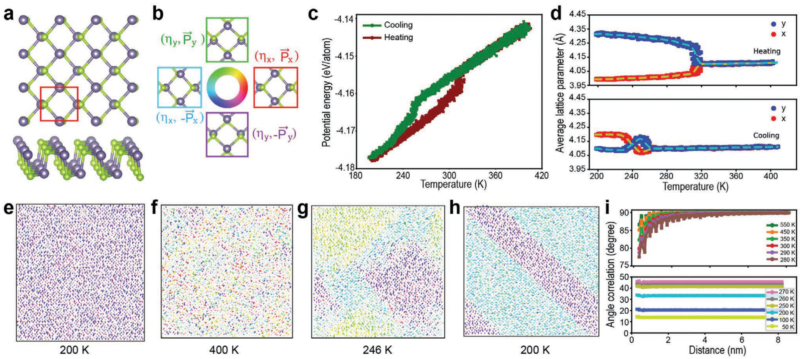
*   **来源**：[[../papers/yangRipplingFerroicPhase2021]]
*   **图示描述**：图1a-b 给出单层 GeSe 褶皱蜂窝晶格及四个能量等效畴变体（以原子级铁性序参量 Rp 方向着色，色环定义矢量取向）；图1c-d 为加热-冷却循环中势能（eV/原子）和 x/y 晶格常数（Å）随温度的演化；图1e-h 是 200→400→246→200 K 各阶段 Rp 的空间分布图；图1i 为不同温度下空间关联角 θij(r)（度）随距离 r（nm）的曲线。
*   **关键特征**：势能曲线在加热约 310 K、冷却约 260 K 处出现不连续跳变，对应一级铁性相变并带弱滞后；高温相 x/y 晶格常数趋同、自发应变消失；400 K 时长程序消失但局部仍存在团簇状"偶极子"，即极性纳米微区；θij(r) 在低温相 r>6 nm 仍 <45°，在高温相 r<2 nm 保持 75°–90°（低于完全随机的 90°），定量证实短程铁性序存在；冷却至 200 K 形成由两个 90° 畴壁分隔的条纹状多畴。

### 89. 图1 插层破缺对称的概念示意与单层 Cr4S4FBr2 原子结构（Pmm2, a=3.51 Å, b=4.85 Å），标注极化轴和 J1–J4 交换路径
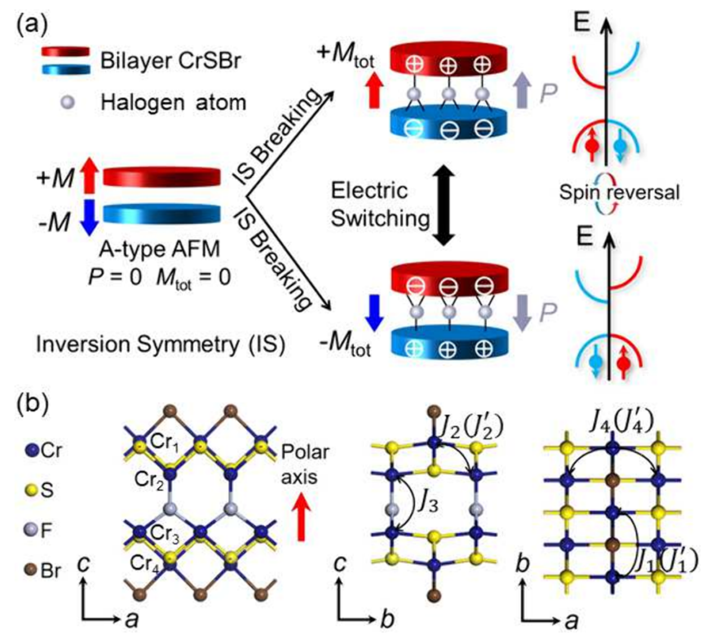
*   **来源**：[[../papers/yuFerroelectricControlMagnetism2026]]
*   **图示描述**：(a) 概念图——红/蓝圆盘为 A 型反铁磁的上下两层 CrSBr，灰色球为插层卤素（F/Cl/Br/I），卤素三角配位的上下不对称打破反演对称，产生垂直电极化 P（灰箭头），翻转 P 即带动净磁化 M_tot（红/蓝箭头）180° 翻转；右侧示意 P↑/P↓ 两态自旋分辨能带的镜像反转。(b) 单层 Cr₄S₄FBr₂ 的俯视与侧视原子结构，Pmm2 (C₂ᵥ) 对称，a=3.51 Å、b=4.85 Å、c=20 Å；中心 F 分别与上层 1 个 Cr、下层 2 个 Cr 成键，红箭头标出 c 轴极化方向，黑箭头标出 J₁–J₄ 磁交换路径。
*   **关键特征**：F 原子位移导致八面体/三角双锥两种晶体场，使上下 Cr 局域磁矩不等，构成 A 型完全补偿亚铁磁（净磁矩仅 0.20 μB/cell）；约 90° 的 Cr–X–Cr 键给铁磁超交换、约 180° 键给反铁磁超交换（Goodenough–Kanamori–Anderson 规则），180° 的 J₄ 因金属性呈双交换铁磁；图(a)把"插层→对称破缺→铁电-自旋锁定"这一设计范式一次性可视化。

### 90. CrInTe2/In2Se3 晶体结构与堆叠
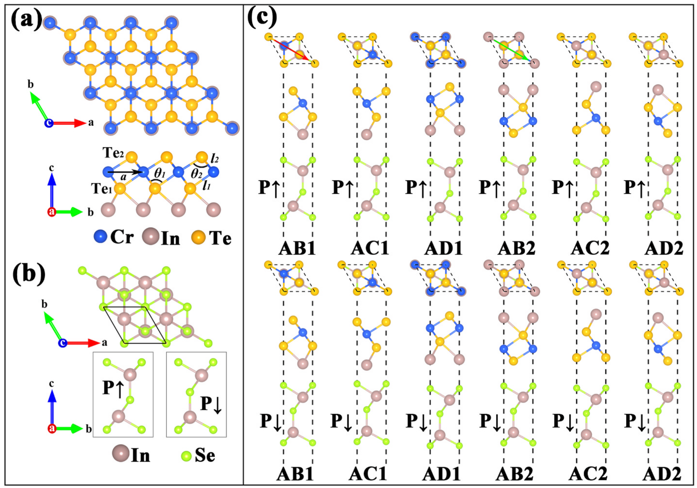
*   **来源**：[[../papers/zhangNonvolatileControlTopological2025]]
*   **图示描述**：(a) 单层 CrInTe2 的俯视与侧视图，呈现 Te2–Cr–Te1–In 堆叠序列、C3v 对称且反演破缺的三角晶格，a = b = 4.04 Å；(b) 单层 α-In2Se3 的俯视与侧视图，显示 Se–In–Se–In–Se 五重层结构及 P↑/P↓ 两种面外铁电极化方向，a = b = 4.07 Å；(c) 异质结俯视与侧视图，沿红/绿箭头平移得到 AB1/AC1/AD1 等共 12 种堆叠。
*   **关键特征**：异质结晶格失配仅 0.7%，可形成共格界面；P↓-AC1（Se–In 界面）在 12 种构型中能量最低，比对应 P↑-AC1 低 140 meV/单胞；各构型界面键长 l1 = 2.84–2.85 Å、l2 = 2.75–2.76 Å，键角 θ1 = 90.15°–90.85°、θ2 ≈ 94°，表明极化翻转时结构骨架基本保持。

### 91. 图3 双层MnBi2Te4晶体结构、σ^A_xy及偶/奇SHG系数

*   **来源**：[[../papers/zhaoOpticalFingerprintsTwodimensional2024]]
*   **图示描述**：双层 MnBi₂Te₄（Case 2，A/B 堆叠，磁点群 3m′）的结构与光学系数：(a) P↑N↑ 态七层序列 Te–Bi–Te–Mn–Te–Bi–Te 的晶体结构侧视，红箭头标 Mn 位磁矩、绿箭头标整体面外极化；(b) 四多铁态的 σ^A_xy 随光子能量（eV）变化；(c) 四多铁态 SHG 偶、奇分量（pm/V）随光子能量（eV）变化。
*   **关键特征**：仅翻转 FE 或仅翻转 Néel 序时 σ^A_xy 变号，两者同时翻转时 σ^A_xy 不变，与 Table I 一致；双层 MnBi₂Te₄ 与双层 VSe₂ 单层磁点群不同，但双层磁点群均为 3m′，故 SHG 张量约束相同；低频区（接近 0 eV）SHG 系数异常大，作者推测与其拓扑性质有关。

### 92. T-/H-AM2X4 晶体结构与铁电翻转机制

*   **来源**：[[../papers/zhaoRealization2DMultiferroic2024]]
*   **图示描述**：对比展示基于 1T 相 MX₂ 双层的 T-AM₂X₄ 与基于 2H 相的 H-AM₂X₄ 两种晶体结构，标出插层原子 A 的两个等效位置 FE1/FE2 及 A 在两位置间翻转的位移路径（蓝色箭头）。
*   **关键特征**：A 原子（紫色）与一侧 1 个 X、另一侧 3 个 X 形成不对称四面体配位，从而破缺中心反演对称并产生自发极化；A 在 FE1↔FE2 间 180° 翻转即对应上下层配位环境互换与极化反向，是整篇论文"插层诱导铁电"策略的结构起源。

### 93. Eq.1 键密度 ρ=N(R_i,R_j)/A

*   **来源**：[[../papers/zhongHighthroughputExfoliationMultiferroic2025]]
*   **图示描述**：定义晶面上单位面积所切断化学键数 ρ = N(R_i, R_j)/A（i ≠ j），R_i、R_j 为晶面两侧相邻原子坐标，A 为键合原子张成的平面面积。
*   **关键特征**：筛选阈值取 ρ ≤ 0.3 bonds/Ų；法线方向通过扫描选取使交切键数最小者；该量与化学成分、对称性解耦，是判据的几何基础。

### 94. Eq.3 对称性等价判据 ŜR_j≈R_i≤δ

*   **来源**：[[../papers/zhongHighthroughputExfoliationMultiferroic2025]]
*   **图示描述**：AIMD 快照中两原子构型在对称操作 Ŝ 下等价的判据，要求原子位置偏差 ≤ δ，其中 δ = δ_p + δ_a 为位置容差与晶格角容差之和。
*   **关键特征**：用于在 ~10 ps、300 K NVT 轨迹中自动识别新相空间群、去重得到 {S₀, S₁, …} 代表性结构，是相扫描工作流的核心判据。
