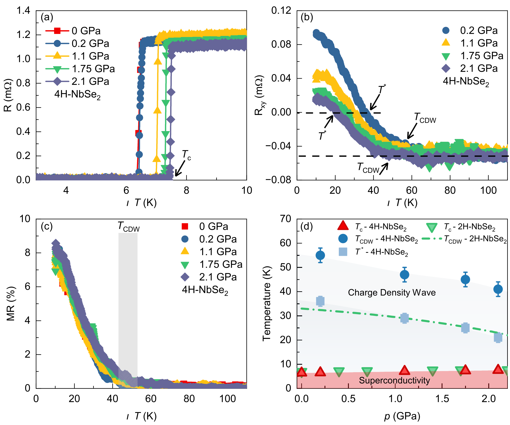

*   **来源**：[[../papers/CastroNeto2001charge]]

*   **关键特征**：基于能带
*   **来源**：[[../papers/Chen2016electrical]]

*   **关键特征**：(a-b) 力学翻转前后的表面形貌：对比证明，即使施加了高达3325 nN（对应~1.1
*   **来源**：[[../papers/Wei2
*   **来源**：[[../papers/Wei2021]]

*   **关键特征**：展示了四个关键键角——C-C-N、C-N-N（平行于管
*   **来源**：[[../papers/Wixtrom
*   **来源**：[[../papers/Zhang2002b]]

*   **关键特征**：该图定义了一个关键概念——Ae3温度，即在给定碳浓度下，奥氏体开始向铁素体转变的平衡温度。对于合金中任何一个具有浓度c的局部区域
*   **来源**：[[../papers/Zhang2002b]]

*   **关键特征**：这是模型的几何基础和核心假设——晶界优先形核
*   **来源**：[[../papers/Zhang2002b]]

*   **关键特征**：这是对相变过程动态、可视化的完美呈现。它直观地展示了形核并非一次性完成，而是持续发生；
*   **来源**：[[../papers/Zhang2002b]]

*   **关键特征**：该图将图7的定性观察关系定量化。它清晰地揭示了一个负相关关系：冷却速率越快，最终获得的铁素体晶粒尺寸越细小
*   **来源**：[[../papers/Zhang200
*   **来源**：[[../papers/Zhang2003a]]

*   **关键特征**：(a) 模拟的A36钢初始奥氏体微观组织，不同颜色（文中以
*   **来源**：[[../papers/Zhang2003a]]

*   **关键特征**：横轴为冷却速率 Q（单位：°C/s），纵
*   **来源**：[[../papers/Zhang2003a]]

*   **关键特征**：横轴为冷却速率 Q（单位：°C/s），纵轴为每个奥氏体晶粒内的铁素体晶粒平均数 M（
*   **来源**：[[../papers/Zhang2003a]]

*   **关键特征**：横轴为过冷度 T（单位：°C），纵
*   **来源**：[[../papers/Zhang2003a]]

*   **关键特征**
*   **来源**：[[../papers/Zhang2003a]]

*   **关键特征**：横轴为过冷度 T（单位
*   **来源**：[[../papers/bhowa
*   **来源**：[[../papers/huProgressProspectsLowdimensional2019]]

*   **关键特征**：
*   **来源**：[[../papers/liMonolayerPuckeredPentagonal2022]]

*   **关键特征**：极坐标图展示了在x-y平面内旋转磁矩方向时体系总能量的变
*   **来源**：[[../papers/nahasFrustratio
*   **来源**：[[../papers/spaldinAdvancesMagnetoelectricMultiferroics2019]]

*   *
*   **来源**：[[../papers/zhangNonvolatileControlTopological2025]]

*   **关键特征**：(a) 0 K下，P↑和P↓态在零场和50 mT场下的自旋织构；(b) P↓态下拓扑电荷Q与磁场Bz的关系；(c) 
*   **来源**：[[../papers/zhangNonvolatileControlTopological2025]]

*   **关键特征**：(a) 零场下，自旋织构随d||和K值变化的二维相图；(b) 以无量纲参数κ = (π²/4) * (2JK / 3d||²) 为判据的一维相图。i₂Fe₄O₉）。源**：[[../papers/Chen2016electrical]]

*   **关键特征**：(a-b) 力学翻转前后的表面形貌：对比证明，即使施加了高达3325 nN（对应~1.1
*   **来源**：[[../papers/Wei2
*   **来源**：[[../papers/Wei2021]]

*   **关键特征**：展示了四个关键键角——C-C-N、C-N-N（平行于管
*   **来源**：[[../papers/Wixtrom
*   **来源**：[[../papers/Zhang2002b]]

*   **关键特征**：该图定义了一个关键概念——Ae3温度，即在给定碳浓度下，奥氏体开始向铁素体转变的平衡温度。对于合金中任何一个具有浓度c的局部区域
*   **来源**：[[../papers/Zhang2002b]]

*   **关键特征**：这是模型的几何基础和核心假设——晶界优先形核
*   **来源**：[[../papers/Zhang2002b]]

*   **关键特征**：这是对相变过程动态、可视化的完美呈现。它直观地展示了形核并非一次性完成，而是持续发生；
*   **来源**：[[../papers/Zhang2002b]]

*   **关键特征**：该图将图7的定性观察关系定量化。它清晰地揭示了一个负相关关系：冷却速率越快，最终获得的铁素体晶粒尺寸越细小
*   **来源**：[[../papers/Zhang200
*   **来源**：[[../papers/Zhang2003a]]

*   **关键特征**：(a) 模拟的A36钢初始奥氏体微观组织，不同颜色（文中以
*   **来源**：[[../papers/Zhang2003a]]

*   **关键特征**：横轴为冷却速率 Q（单位：°C/s），纵
*   **来源**：[[../papers/Zhang2003a]]

*   **关键特征**：横轴为冷却速率 Q（单位：°C/s），纵轴为每个奥氏体晶粒内的铁素体晶粒平均数 M（
*   **来源**：[[../papers/Zhang2003a]]

*   **关键特征**：横轴为过冷度 T（单位：°C），纵
*   **来源**：[[../papers/Zhang2003a]]

*   **关键特征**
*   **来源**：[[../papers/Zhang2003a]]

*   **关键特征**：横轴为过冷度 T（单位
*   **来源**：[[../papers/bhowa
*   **来源**：[[../papers/huProgressProspectsLowdimensional2019]]

*   **关键特征**：
*   **来源**：[[../papers/liMonolayerPuckeredPentagonal2022]]

*   **关键特征**：极坐标图展示了在x-y平面内旋转磁矩方向时体系总能量的变
*   **来源**：[[../papers/nahasFrustratio
*   **来源**：[[../papers/spaldinAdvancesMagnetoelectricMultiferroics2019]]

*   *
*   **来源**：[[../papers/zhangNonvolatileControlTopological2025]]

*   **关键特征**：(a) 0 K下，P↑和P↓态在零场和50 mT场下的自旋织构；(b) P↓态下拓扑电荷Q与磁场Bz的关系；(c) 
*   **来源**：[[../papers/zhangNonvolatileControlTopological2025]]

*   **关键特征**：(a) 零场下，自旋织构随d||和K值变化的二维相图；(b) 以无量纲参数κ = (π²/4) * (2JK / 3d||²) 为判据的一维相图。i₂Fe₄O₉）。[[科研Wiki/wiki/figures/crystal-structures|← 返回枢纽页]]

---

> **📂 子页面导航**：
>
> | 子页面 | 主题 | 条目数 |
> |--------|------|--------|
> | [[crystal-structures-fundamentals|🧱 基础晶体结构]] | 单层与多层晶体几何、堆垛构型、Janus 结构、层间滑移与结构畸变。 | 42 |
> | [[crystal-structures-computational|💻 计算模拟与电子结构]] | DFT/MD 计算模型、吸附构型、电子结构、畴壁动力学与磁性计算。 | 40 |
> | [[crystal-structures-phase|🔄 相变与缺陷结构]] | 相图、CDW/超导竞争、熔化凝固、晶粒演化与非晶化。 | 41 |
> | [[crystal-structures-tables|📊 数据表格与补充结构]] | 关键数据表格以及溢出的基础晶体结构图。 | 45 |
>
> [[科研Wiki/wiki/figures/crystal-structures|← 返回枢纽页]]

---

## 🔄 相变与缺陷结构

### 1. T_cdw 与 T_c 随 a/c 变化的相图，显示 TaSe₂/TaS₂/NbSe₂/NbS₂ 的反相关关系

*   **来源**：[[../papers/CastroNeto2001charge]]

### 2. 力学翻转面积比随针尖力递增至100%

*   **来源**：[[../papers/Chen2016electrical]]

### 3. E-t 相图：C/NC/IC 三相及超导穹顶，红线为 a1∝E 耦合，灰线为 E 无关耦合；插图显示 η 在 t_c 处跳变（一级相变）

*   **来源**：[[../papers/Chen2019superconductivity]]
*   **关键特征**：插图显示 η 在 t_c 处跳变

### 4. 相图/纹理图（fig_4）

*   **来源**：[[../papers/Chen2019superconductivity]]

### 5. 4H-NbSe2压力-温度相图：纵向电阻、霍尔符号反转、磁阻、Tc/T_CDW/T*汇总

*   **来源**：[[../papers/Islam2025enhancement]]

### 6. 直径差与面积比

*   **来源**：[[../papers/Wei2021]]

### 7. 键角变化

*   **来源**：[[../papers/Wei2021]]

### 8. TTF与CA分子结构

*   **来源**：[[../papers/Wixtrom2011electrical]]

### 9. Fe-C相图与Ae3温度

*   **来源**：[[../papers/Zhang2002b]]

### 10. 晶界形核示意

*   **来源**：[[../papers/Zhang2002b]]

### 11. 组织演化模拟

*   **来源**：[[../papers/Zhang2002b]]

### 12. 冷速-晶粒尺寸曲线

*   **来源**：[[../papers/Zhang2002b]]

### 13. Fe-C合金示意相图与Ae3线

*   **来源**：[[../papers/Zhang2003a]]

### 14. A36钢初始奥氏体与最终铁素体/渗碳体模拟组织

*   **来源**：[[../papers/Zhang2003a]]

### 15. 铁素体晶粒尺寸dα随冷却速率Q下降

*   **来源**：[[../papers/Zhang2003a]]

### 16. 每奥氏体晶粒内铁素体晶粒数M：模拟与实验对比

*   **来源**：[[../papers/Zhang2003a]]

### 17. 形核元胞数n_nuc随过冷度ΔT：I区上升II区饱和（561/1352/1590）

*   **来源**：[[../papers/Zhang2003a]]
*   **关键特征**：I区上升II区饱和

### 18. 铁素体转变分数Y随过冷度ΔT

*   **来源**：[[../papers/Zhang2003a]]

### 19. 铁素体转变分数Y随时间t：高冷速相变更快

*   **来源**：[[../papers/Zhang2003a]]

### 20. 形核分数Y_nuc随ΔT：高冷速下早期剧烈振荡

*   **来源**：[[../papers/Zhang2003a]]

### 21. 熔化温度随粒子直径变化（<4 nm振荡，>4 nm收敛）

*   **来源**：[[../papers/Zhang2019a]]
*   **关键特征**：<4 nm振荡

### 22. 掺杂铁电体制备极性金属：BaTiO₃₋δ 相图、DFT 极化-掺杂曲线、Nb-PTO 的 STEM 原子位移、BaMF₆ 几何铁电结构

*   **来源**：[[../papers/bhowalPolarMetalsPrinciples2023b]]

### 23. LiOsO₃ 极性相 Dirac 点→节线环演化、贝里曲率偶极子/NHE 机制、SrTiO₃ 铁电超导相图

*   **来源**：[[../papers/bhowalPolarMetalsPrinciples2023b]]

### 24. 维度依赖CDW统一相图

*   **来源**：[[../papers/chowdhuryReviewTheoreticalComputational]]

### 25. 上：NiO岩盐结构；下：(100)面 LSDA+U 与 LSDA 电荷密度差，显示间隙区电荷密度减少、共价键减弱

*   **来源**：[[../papers/dudarevElectronenergylossSpectraStructural1998a]]
*   **关键特征**：100)面 LSDA+U 与 LSDA 电荷密度差

### 26. 块体与有机铁电体中的极性拓扑：BNT基陶瓷成分驱动畴演化；(4,4-DFPD)2PbI4象限畴；向列态铁电液晶的K11/K33-P0拓扑相图

*   **来源**：[[../papers/hanPolarTopologicalMaterials2025]]
*   **关键特征**：4-DFPD)2PbI4象限畴

### 27. 带电 CrBr₃ 单层中 CrBr₆ 八面体不对称 Jahn-Teller 畸变诱导面内 FE+FM

*   **来源**：[[../papers/huProgressProspectsLowdimensional2019]]

### 28. 过冷液态 Ge（750–650 K）：四面体角峰增强，但仍金属性

*   **来源**：[[../papers/kresseInitiomoleculardynamicsSimulationLiquidmetalamorphoussemiconductor1994]]
*   **关键特征**：四面体角峰增强

### 29. 淬火态非晶 Ge（300 K）：g(R) 第一/二峰分离、109° 键角、费米能级处打开能隙

*   **来源**：[[../papers/kresseInitiomoleculardynamicsSimulationLiquidmetalamorphoussemiconductor1994]]
*   **关键特征**：g

### 30. 液态 ψ(ω)：30 meV 处 LA 侧峰

*   **来源**：[[../papers/kresseInitiomoleculardynamicsSimulationLiquidmetalamorphoussemiconductor1994]]
*   **关键特征**：ω)

### 31. (Δa/a0, Δb/b0)双轴应变空间中O1/O2-O3/2H的能量最低相图

*   **来源**：[[../papers/liFerroelasticityDomainPhysics2016]]
*   **关键特征**：Δa/a0

### 32. 面内磁各向异性能极坐标图、铁磁/倾斜铁磁磁构型、MC模拟磁矩-温度曲线(Tc~110 K)及磁化率/比热

*   **来源**：[[../papers/liMonolayerPuckeredPentagonal2022]]

### 33. 温度-压力相图：NbSe₂ 中 T_CDW 在 ~5 GPa 消失、T_c 穹顶状上升；NbS₂ 的 T_c 缓慢线性增长

*   **来源**：[[../papers/majumdarInterplayChargeDensity2020]]
*   **关键特征**：NbSe₂ 中 T_CDW 在 ~5 GPa 消失、T_c 穹顶状上升

### 34. 周期性超胞示意：4根BTO纳米线嵌入BST基质

*   **来源**：[[../papers/nahasFrustrationSelfOrderingTopological2016]]

### 35. ：CsxSi32O64 (x=0, 3.6, 4.6)的实验(圆圈)与模型(实线)PDF G(r)

*   **来源**：[[../papers/petkovStructureIntercalatedCs2002]]
*   **关键特征**：实线)PDF G

### 36. ：CsxSi32O64电子化合物的Cs差分PDF，实验(圆圈)与模型(实线)

*   **来源**：[[../papers/petkovStructureIntercalatedCs2002]]
*   **关键特征**：圆圈)与模型

### 37. Bi2O3–Fe2O3相图，阴影区为预测可发现新多铁相的成分范围

*   **来源**：[[../papers/spaldinAdvancesMagnetoelectricMultiferroics2019]]

### 38. J、d_k、SIA 随双轴应变变化，及应变-磁场拓扑相图（斯格明子/双半子）

*   **来源**：[[../papers/wangTunableD0Topological2025b]]
*   **关键特征**：及应变-磁场拓扑相图

### 39. 气相/液面/超临界/液态/冰五种水的氧K边谱对比；534、536 eV双峰=自由O-H，535 eV峰=单断供体键，537–542 eV后边=氢键；超临界水缺5

*   **来源**：[[../papers/wernetSpectroscopicCharacterizationMicroscopic2005]]
*   **关键特征**：537–542 eV后边=氢键

### 40. 拓扑磁结构相图与温度稳定性

*   **来源**：[[../papers/zhangNonvolatileControlTopological2025]]

### 41. d-K 相图与 κ 判据

*   **来源**：[[../papers/zhangNonvolatileControlTopological2025]]

---

## 🔗 相关概念与实体 (Related Concepts & Entities)

**核心概念**：[[../concepts/charge-density-wave|charge density wave]]、[[../concepts/peierls-distortion|peierls distortion]]、[[../concepts/commensurate-cdw|commensurate cdw]]、[[../concepts/superconducting-dome|superconducting dome]]、[[../concepts/phase-interference|phase interference]]、[[../concepts/discommensuration|discommensuration]]

**相关材料/实体**：[[../entities/TaSe2|TaSe2]]、[[../entities/NbSe2|NbSe2]]、[[../entities/1T-TaS2|1T TaS2]]、[[../entities/NbS2|NbS2]]、[[../entities/2H-TaSe2|2H TaSe2]]、[[../entities/Ge|Ge]]、[[../entities/Si|Si]]
