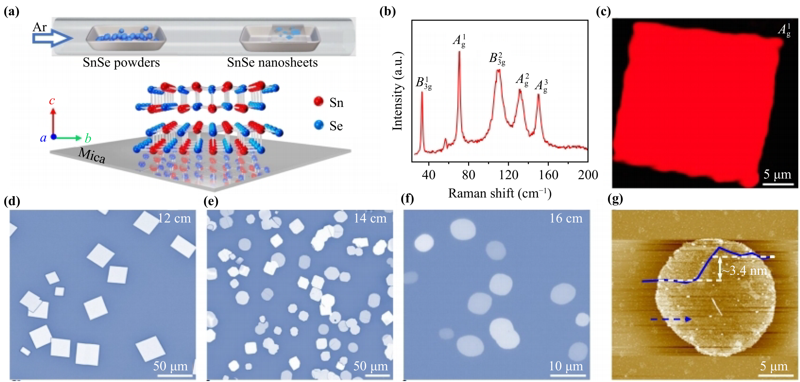
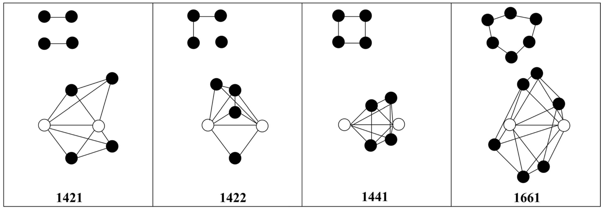
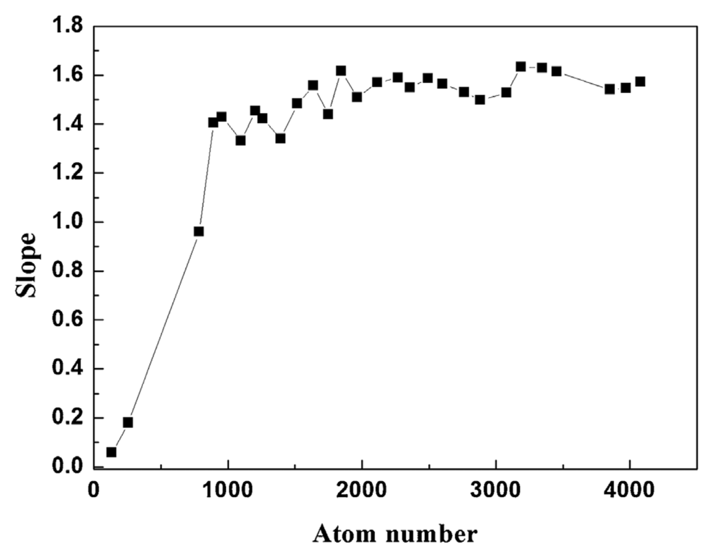
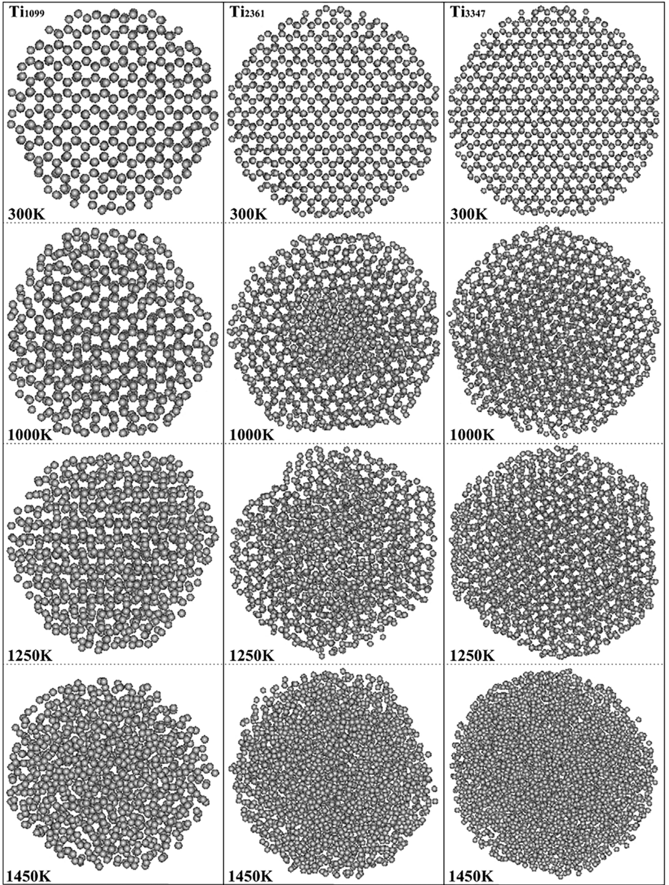
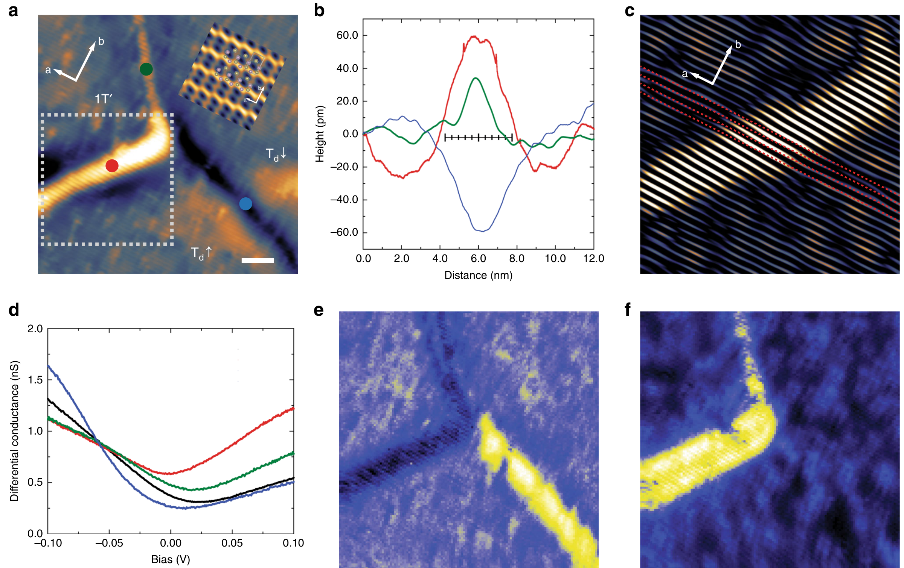
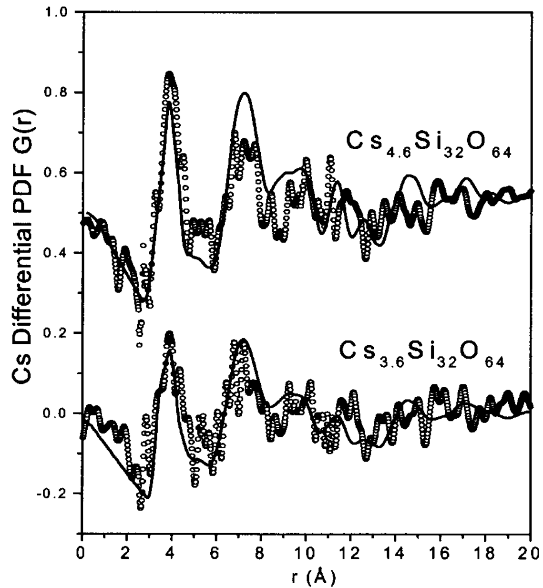
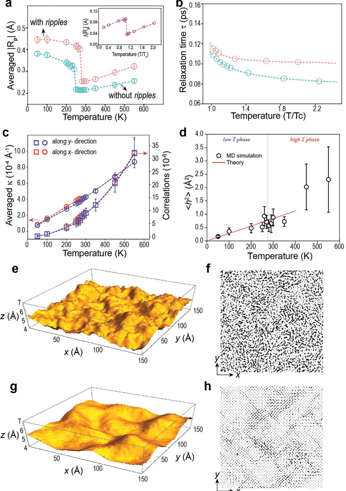

---
tags:
  - type/figure-collection
---

# 晶体结构与原子构型：表面、缺陷与形貌

> 属于 [[crystal-structures|晶体结构与原子构型]]

## 条目

### 1. Table 1 structural parameters

*   **来源**：[[../papers/Perugu2024morphology]]
*   **图示描述**：按 x=0.2、0.4、0.6、0.8 四行列出 Davg、FWHM βavg、a=b、c、c/a、MW、Vcell、ρx、Pavg、S 共十列结构参数。
*   **关键特征**：a=b 由 0.5599 nm 增至 0.5619 nm，c 由 1.3926 nm 增至 1.3952 nm，Vcell 由 0.4365 增至 0.4405 nm³，c/a 几乎不变（2.487→2.483）；Davg 由 41.5 增至 83.6 nm，FWHM 由 0.0034° 降至 0.0012°；X 射线密度 ρx 因分子量由 298.81 降至 256.76 g/mol 而由 1.136 降至 0.968 g/cm³；比表面积 S=600/(Davg·ρx) 由 127.2 降至 74.2 m²/g；Pavg 由 74.8 增至 127.4 nm。

### 2. 图8 PVD生长p型掺杂SnSe的室温亚铁磁（337 K）与铁电共存

*   **来源**：[[../papers/RecentAdvancesGrowth2025]]
*   **图示描述**：展示通过 ALD 封装（绝缘保护层）+ 干法转移技术，将空气敏感的 CVT/MBE-NiI₂ 制备成霍尔棒器件的完整工艺流程与器件光学照片、低温输运曲线。
*   **关键特征**：ALD 保形封装有效隔绝水汽和氧气，解决 NiI₂ 在空气中迅速降解的难题；干法转移避免聚合物和溶剂污染；器件在 T = 1.7 K 下测得迁移率约 15 cm²·V⁻¹·s⁻¹，可用于磁阻和霍尔测量以研究磁电耦合。

### 3. 图2 p(2×2)重构表面原子结构（Zigzag不对称二聚体，键长2.30/2.60 Å，翘曲角8.30°/9.81°）

*   **来源**：[[../papers/Wu2018]]
*   **图示描述**：(a) 顶视图显示顶层原子沿[110]方向成对靠近形成"之"字形二聚体；(b)(c) 侧视图展示二聚体一原子上翘、一原子下陷的不对称排列；(d) 为(c)中打点区域的局部放大，标出SiA（上翘）和SiB（下陷）。
*   **关键特征**：二聚体键长有2.30 Å和2.60 Å两种；短键翘曲角9.81°，长键8.30°；沿[1-10]方向相邻二聚体列翘曲方向呈"同-同-反"交替，形成p(2×2)周期。

### 4. 图3 c(4×2)重构表面原子结构（反铁电式翘曲排列，翘曲角10.36°，部分二聚体翘曲方向无序）

*   **来源**：[[../papers/Wu2018]]
*   **图示描述**：6×6超胞弛豫后的原子排布；(d)为局部放大，标出上翘原子SiD与下陷原子SiC；(b)中可见部分二聚体翘曲方向出现无序。
*   **关键特征**：二聚体翘曲方向沿[1-10]呈"同-反-反-同"排列，即反铁电式c(4×2)图案；SiC-SiD二聚体翘曲角10.36°，略大于p(2×2)中SiA-SiB的8.30°；部分二聚体翘曲方向无序，与实验在真实Si(001)-(2×1)表面观察到的现象一致。

### 5. 图5 Ge原子在Si二聚体上的6个初始吸附位置示意图（Top_SiA/B/D/C、Bridge_Si(A-B)/(C-D)，h=1.2–5.4 Å）

*   **来源**：[[../papers/Wu2018]]
*   **图示描述**：(a) p(2×2)、(b) c(4×2)表面上红色Ge球在Si二聚体上方的初始位置编号1–6。
*   **关键特征**：6个位置分别为Top_SiA(1)、Top_SiB(2)、Bridge_Si(A-B)(3)、Top_SiD(4)、Top_SiC(5)、Bridge_Si(C-D)(6)；顶位分上翘原子(SiA/SiD)和下陷原子(SiB/SiC)两种；Ge与二聚体初始高度h扫描范围1.2–5.4 Å。

### 6. 图7 18种稳定Ge吸附几何构型（顶位/桥位/偏心桥位）

*   **来源**：[[../papers/Wu2018]]
*   **图示描述**：(a1)–(f3)共18个子图，对应表3中三种特征高度下弛豫后的Ge位置；a/b/c为p(2×2)上的Top_SiA、Top_SiB、Bridge_Si(A-B)，d/e/f为c(4×2)上的Top_SiD、Top_SiC、Bridge_Si(C-D)。
*   **关键特征**：Ge最终只稳定在两类位置——二聚体单原子的外侧顶位(outside top)和桥位(bridge)；顶位吸附于上翘Si时Ge–Si距离2.58–2.61 Å、二聚体键长缩至2.31 Å、翘曲角增大；中心桥位时二聚体键长拉长至2.64–2.66 Å、翘曲角仅1.1°–2.2°（近乎对称）；初始高度越高，初始位置影响越小，Ge越易弛豫到全局最优顶位。

### 7. F区构型，含Ge二聚体空位吸附DHS导致Si二聚体断裂

*   **来源**：[[../papers/Wu2021]]
*   **图示描述**：展示F区F1–F4四个构型（h≈1.0–1.3 Å、θ≈0°–170°，最低初始高度区）的几何与电荷分布；F1为MHS+MBS，F2、F4为近单原子分散，F3为Ge二聚体空位吸附DHS。
*   **关键特征**：F3中Ge二聚体落于空位使下方Si二聚体键断裂（表2中Si1–Si2键长/键能均为"–"），是22个稳定构型中最极端的结构重构；F1的Eave=−33.565 eV与B1、B2并列全局最低；F2中两Ge原子均直接与中间层Si成键（Ge1–Si2键长2.61 Å、键能4.325 eV）；F3保留Ge–Ge键2.70 Å、键能3.835 eV。

### 8. 图8：平均铁素体晶粒尺寸随冷却速率增大而单调下降的定量曲线

*   **来源**：[[../papers/Zhang2002b]]
*   **图示描述**：以冷却速率 Q（K/s）为横轴、平均铁素体晶粒尺寸 d（μm）为纵轴的曲线图，d = Σd_i / num。
*   **关键特征**：曲线呈单调下降趋势且斜率随 Q 增大逐渐变缓；Q 由 0.05 增至 5.0 K/s 时，实验晶粒尺寸 106→33 μm、模拟 108→38 μm；下降源于高冷速提高形核率并以渗碳体钉扎限制生长，趋缓则反映扩散时间被压缩到极限后细化空间收窄。

### 9. 铁素体晶粒尺寸dα随冷却速率Q下降

*   **来源**：[[../papers/Zhang2003a]]
*   **图示描述**：横轴为冷却速率 Q（°C/s），纵轴为铁素体平均晶粒尺寸 d_α（μm），单条单调下降曲线。
*   **关键特征**：d_α = Σ d_i^α / N_α；冷速越大，过冷度越大、形核概率越高、晶核越多，最终晶粒越细小；把"快冷细化晶粒"的冶金经验定量化为可计算的函数关系。

### 10. 每奥氏体晶粒内铁素体晶粒数M：模拟与实验对比

*   **来源**：[[../papers/Zhang2003a]]
*   **图示描述**：横轴为冷却速率 Q（°C/s），纵轴为每个奥氏体晶粒内的铁素体晶粒平均数 M = N_α/N_γ（无量纲），曲线为模拟值、菱形点为 Militzer 等人的实验数据。
*   **关键特征**：M 随冷速增大而上升，模拟曲线与实验点趋势一致、数值接近；M 直接反映晶界形核事件密度，是连接冷速与最终组织的关键统计量。

### 11. 1°C/s下实验金相与模拟组织对比

*   **来源**：[[../papers/Zhang2003a]]
*   **图示描述**：(a) 冷速 1 °C/s 下 A36 钢的实验金相照片；(b) 同等冷速下 CA 模拟的微观组织，白色方框标出渗碳体区域。
*   **关键特征**：模拟图中等轴铁素体晶粒沿原奥氏体晶界分布，晶粒尺寸、形貌和相分布与实验金相高度相似；白色方框指示的渗碳体位置与高冷速下碳富集区一致。

### 12. 图2 1421/1422/1441/1661原子对示意图

*   **来源**：[[../papers/Zhang2019a]]
*   **图示描述**：球棍示意Honeycutt–Andersen对分析（PA）所用的四类特征键对：1421、1422、1441、1661。
*   **关键特征**：白圆为成键原子对，黑圆为其共有近邻，黑线表示在截断距离0.656 nm内；1421与1422对应FCC/HCP密堆积（1422偏HCP，1421在FCC中亦多），1441+1661对应BCC；该图是图7定量追踪HCP→FCC转变和BCC缺失的方法学钥匙。

### 13. 图7 六粒子1421/1422原子对数量随温度变化

*   **来源**：[[../papers/Zhang2019a]]
*   **图示描述**：与图6对应的六个大粒子中，1421与1422特征键对数量（或占比）随300–1450 K温度的变化。
*   **关键特征**：低温下两者之和维持高位，代表HCP/FCC密堆积比例；在各自熔点处1421+1422数量急剧下降，标志有序结构崩塌；Ti1099在熔化前1421升、1422降，定量显示HCP→FCC局部转变，其他更大粒子无此现象；全程几乎不出现1441/1661，暴露该EAM势不能再现块体Ti的HCP→BCC高温相变。

### 14. 图9 Ti1099/Ti2361/Ti3347不同温度原子堆积（表面预熔可视化）

*   **来源**：[[../papers/Zhang2019a]]
*   **图示描述**：Ti1099、Ti2361、Ti3347在300、1000、1250、1450 K四个温度下的原子构型快照。
*   **关键特征**：300 K三粒子均呈完整HCP有序；1000 K表面原子开始无序重排，核心仍为HCP，形成"液态壳层"；1250 K临近熔点时无序区贯穿粒子；1450 K整体完全无序呈液态；粒子越小表面无序越早侵入核心，直观可视化了"表面预熔→无序壳层扩展→整体熔化"机制。

### 15. 图4 Li 掺杂：(√7×√7)R19.1° Li 吸附超结构，去 Li 后露出 2×2 CDW，2Δ=19±9 meV

*   **来源**：[[../papers/hallEnvironmentalControlCharge]]
*   **图示描述**：图4 为 Li 蒸气（500 K 暴露）掺杂单层 TaS₂ 后的表征：(a) 大尺度 STM 显示整个表面被 Li 吸附原子覆盖，ML 上形成规则的 (√7×√7)R19.1° 超结构（插图放大），同时 Gr/Ir 莫尔条纹消失、Gr 下可见 Li 插层结构，提示 Li 同时存在于 TaS₂ 上、Gr 下以及二者之间；(b) 在 Li 覆盖层上采集的归一化 STS 仍在 E_F 处有部分能隙；(c) 升温到 30 K 后用 STM 针尖移除 Li，露出 TaS₂ 原子晶格和弱 2×2 调制；(d) 对应 FFT 确认 2×2 周期。
*   **关键特征**：DFT 估计实验覆盖度的 Li 吸附使掺杂增加约 0.25 e/单胞（x ≈ −0.25）；Li 覆盖层下仍测得 2Δ = 19 ± 9 meV 的部分能隙，证明 CDW 在掺杂后仍存在但已切换周期；移除 Li 后直接观察到 2×2 超晶格而非 3×3，构成"电子掺杂驱动 3×3 → 2×2 转变"的泵浦-探测式直接证据；900 K 热退火不能脱附 Li、反而完全改变 TaS₂ 形貌。

### 16. 图5 不同掺杂 x 与杂化 Γ 下的声子色散及掺杂–杂化 CDW 相图（3×3 / 2×2 / 无 CDW）

*   **来源**：[[../papers/hallEnvironmentalControlCharge]]
*   **图示描述**：图5 是论文理论核心。(a) 四种 (x, Γ) 组合下的声学支声子色散（LA/TA/ZA 以颜色区分，纵轴负值即虚频代表晶格失稳）：(1) x=0, Γ=52.7 meV（强杂化）与 (2) x=−0.267, Γ=52.7 meV（强掺杂+强杂化）的虚频全部消失、晶格稳定；(3) x=0, Γ=10 meV（准自由本征态）在 q≈2/3 ΓM 处出现最深虚频，对应 3×3 CDW；(4) x=−0.267, Γ=10 meV（强掺杂弱杂化）的最深虚频移到 M 点，对应 2×2 CDW。(b) 以电子掺杂 −x 为横轴、杂化展宽 Γ（HWHM）为纵轴的 CDW 相图，颜色区分 3×3 CDW、2×2 CDW 和无 CDW 区，并标出 TaS₂/Gr/Ir、Li 掺杂、TaS₂/Au(111) 三个实验点及 (a) 中四点。
*   **关键特征**：电子掺杂把主导失稳波矢 q_c 从 2/3 ΓM（3×3）移到 M（2×2），> 0.27 e/Ta 后晶格完全稳定；杂化主要通过 Lorentz 展宽和 arctan 占据函数淬灭声子自能 Π、削弱 Kohn 异常，几乎不改变 q_c 就直接抑制 CDW——arctan 的多项式衰减使其比热展宽更有效；TaS₂/Au(111) 以 Γ = 30–90 meV、x = −0.326 至 −0.430（含赝掺杂）落在无 CDW 区，把既往"无 CDW"争议归因为强 S–Au 杂化而非真实电荷转移；晶格弛豫可进一步稳定。

### 17. 图5 Fe掺杂MoTe₂的STM形貌、畴壁高度剖面与dI/dV谱：相畴壁空态增强电导、极性畴壁满态增强电导

*   **来源**：[[../papers/huangPolarPhaseDomain2019]]
*   **图示描述**：77 K 下 Fe 掺杂 MoTe₂（Fe 约 1.06 at%）三相结区 STM 结果。(a) 形貌图显示 Td↑、Td↓、1T′ 交界，红/绿点标示偏离锯齿链方向的凸起型畴壁（1T′/Td 相畴壁），蓝点标示沿锯齿链方向的凹陷型畴壁（Td↑/Td↓ 极性畴壁）；(b) 高度剖面量化两类畴壁的形貌差；(c) 傅里叶滤波形貌，凸起相畴壁处原子锯齿链发生垂直于链方向的偏移，归因于 1T′ 与 Td 晶格失配；(d) 各位置 dI/dV 谱；(e–f) 分别在 −100 mV（满态）与 +100 mV（空态）的微分电导空间映射。
*   **关键特征**：相畴壁凸起约 40 pm、弯曲、偏离 a 轴锯齿方向，正偏压（空态）dI/dV 增强；极性畴壁凹陷约 20 pm、沿锯齿链走向，负偏压（满态）dI/dV 增强；两类畴壁电导均与体态（黑线）不同；电导映射在 ±100 mV 下直观呈现选择性增强；文中将相畴壁增强电导措辞为“possible signature / promising candidates”的一维铰链态。

### 18. 图1 MBE+拓扑反应制备单层VS₂及RHEED/芯能级/STM表征

*   **来源**：[[../papers/kawakamiChargedensityWaveAssociated2023]]
*   **图示描述**：图1展示"先MBE生长单层VTe₂、再硫蒸气退火将Te置换为S"的拓扑化学反应流程，并通过RHEED、芯能级光电子谱和STM确认产物质量。子图b/c为VTe₂和硫化后VS₂的RHEED图样，d为对应强度剖面，e为宽能量范围光电子谱（插图为Te 4d区），f/g为STM形貌及台阶高度剖面。
*   **关键特征**：VTe₂与VS₂均呈清晰1×1 RHEED条纹，证明为单层单晶膜；硫化后RHEED峰位相对中心峰外移，对应晶格常数收缩；S 2p₁/₂/2p₃/₂峰在结合能162–163 eV出现，同时原Te 4d峰（40–42 eV）完全消失，定量证明Te被S完全置换；STM测得单层岛台阶高度0.9 nm，证实单层属性。

### 19. 论文图5

*   **来源**：[[../papers/lezoualchStudyChargeDensity]]
*   **图示描述**：1T-VSe₂ 在氮吸附/钠插层等外部化学调控下的原子结构与 STM 图像对比，展示缺陷类型识别以及 Na 插层诱导的 CDW 相变。
*   **关键特征**：N 等离子体处理引入 I 型（N 桥位吸附）、III 型（N 替代底层 Se）等缺陷，但 (4×4) CDW 整体保持稳健；Na 插入层间后顶层 VSe₂ 由体相 (4×4) 转变为单层本征的 (√7×√3) CDW，同时在 Na 岛边缘出现反常"p 型掺杂"特征。

### 20. Fig. 5 CVD 生长中相分离异质结与合金的动力学调控

*   **来源**：[[../papers/liPhaseTransitions2D2021]]
*   **图示描述**：面板 a 为 CVD 生长示意图，对比在较低温度下形成相分离的横向 MoS2/WS2 异质结、在较高温度下形成均匀固溶体 Mo1−xWxS2 合金两条路径；后续面板还展示通过前驱体质量通量与生长速率调控二维 TMD 形貌与缺陷含量。
*   **关键特征**：低温（约 650 °C）有利于成分分离、形成原子级锐利的横向异质结界；高温（≥680 °C）有利于成分混合、得到均匀合金相；晶粒尺寸、形貌和缺陷密度由金属前驱体质量通量与生长速率等动力学参数决定；可通过温度和 H2 浓度等条件直接生长出热力学亚稳相。

### 21. 图1 磁光成像：Tc 标定与磁通穿透（低场迈斯纳态、高场缺陷引导穿透）

*   **来源**：[[../papers/majumdarInterplayChargeDensity2020]]
*   **图示描述**：(a) 以 1 mT 场冷后归一化光强 I/I₀ 随温度的变化确定 Tc，NbSe₂ 约 7.0 K、NbS₂ 约 5.6 K；(b)–(e) 零场冷后分别在 μ₀H=0.1 mT 和 0.6 mT 下成像磁通分布，上排 NbSe₂（T=6.8 K），下排 NbS₂（T=4.25 K）。
*   **关键特征**：低场下样品中心完全屏蔽（暗区），磁通仅堆积在边缘，呈现完美迈斯纳态；高场下磁通主要沿裂纹和缺陷进入，形成树枝状/指状图案；说明钉扎由宏观缺陷主导而非体钉扎，Bean 模型估算 Jc 会失真。

### 22. 图1 薄膜应变效应：三色BaTiO3/SrTiO3/CaTiO3超晶格Z-衬度像与XRD卫星峰；高应变BiFeO3混合相AFM/TEM；DyScO3上La-BFO的109°周期畴阵列PFM

*   **来源**：[[../papers/martinThinfilmFerroelectricMaterials2016]]
*   **图示描述**：由 a–d 四个子图组成，集中展示外延应变对铁电薄膜晶体结构与畴结构的调控。a 图为三色 BaTiO₃/SrTiO₃/CaTiO₃ 超晶格的 Z-衬度 STEM 像（左）与宽角 XRD 扫描（右，衍射角 2θ 单位为度，强度为任意单位）；b 图为高应变 BiFeO₃ 混合相薄膜的 AFM 表面形貌及 2–3 nm 周期性高度起伏；c 图为高分辨 TEM 下类四方相与类菱方相之间共格、无缺陷的相界；d 图为 DyScO₃ 衬底上 La 掺杂 BiFeO₃ 薄膜的垂直（左）与水平（右）PFM 像。
*   **关键特征**：a 图 XRD 除 SrTiO₃ 衬底峰外出现一系列 ±1、±2 级卫星峰，证明超晶格具有原子级平整界面与长程周期，相干应变加界面耦合使 BaTiO₃ 层极化增强约 50%；b–c 图中约 −4.5% 压应变稳定了 P4mm 超四方相（c=4.655 Å、a=3.665 Å，c/a≈1.26），并与菱方相形成条纹状混合相，两相界面共格且可在电场下运动，给出 4–5% 的巨电致应变；d 图显示通过平衡弹性能与静电能获得一维纳米尺度的周期性 109° 畴阵列。

### 23. 图6 CIPS薄片FIB截面HAADF STEM图像及GPA应变分量eyy图，显示层错缺陷与非均匀应变

*   **来源**：[[../papers/neumayerCompetingPolarPhases2025]]
*   **图示描述**：(a) 为聚焦离子束（FIB）制备的 CIPS 薄片截面高角环形暗场（HAADF）STEM 像，利用 ⟨002⟩ 反射形成 Bragg 像以增强层状衬度；(b) 为同一区域经几何相分析（GPA）得到的面内应变分量 e_yy 分布图，应变本身无量纲（以分数/百分比表示）。
*   **关键特征**：(a) 中可直接观察到层堆叠中的层错、位错、扭结等缺陷；(b) 中缺陷周围呈现明显的非均匀应变场（局部压/拉应变交替）；图像为原子分辨率，但原文未给出具体应变量化数值范围。

### 24. 图4 Te 空位在褶皱挤压侧聚集的统计与 DFT 形成能

*   **来源**：[[../papers/niuDirectVisualizationLargeScale2021]]
*   **图示描述**：a–d 为 1T' 低对称单胞产生的四种不等价 Te 空位（site 1up/down、site 2up/down）；e 把弯曲区域分为上/下部并标出挤压侧（constrictive side）与拉伸侧（tensile side）；f 为多个薄片约 1000 nm² 面积上四种空位在褶皱两侧的统计；g、h 为 DFT 计算的空位形成能随弯曲程度及在完整褶皱超胞中的波动。
*   **关键特征**：统计（P<0.05）表明无论哪种位点，Te 空位都优先聚集在挤压侧，上下弯曲段规律相反；DFT 显示挤压侧 site 1up/site 2up 形成能低于拉伸侧，弯曲越大形成能越低；site 1 因 W–Te 键更近对波纹调制应变更敏感，形成能波动比 site 2 更剧烈。

### 25. 图5 晶界与部分氧化对各向异性褶皱的调制

*   **来源**：[[../papers/niuDirectVisualizationLargeScale2021]]
*   **图示描述**：a 为晶界附近的 STEM 像，左右两晶粒取向不同，黄色箭头标示来自晶界的应变方向；b 为部分氧化区域的原子像，畸变单元呈阶梯状排列；c 为对应示意模型，把连续波纹软化为同向小台阶。
*   **关键特征**：晶界右侧晶粒内出现垂直于 (1−10) 面的褶皱而左侧没有，因为右侧应变方向恰好垂直于该择优晶面；部分氧化时所有畸变区域沿同一面外方向（图中向下）弯曲，连续褶皱被分解为多个精细阶梯以释放局域应变。

### 26. 图2 三种1T′/1T′畴界(120°/60°/0°)的STM形貌、DFT弛豫结构与STS dI/dV谱对比

*   **来源**：[[../papers/pedramraziManipulatingTopologicalDomain2019]]
*   **图示描述**：三列分别对应120°（出现概率85%）、60°（13%）、0°（2%）三种1T′/1T′畴界。上排(a-c)为STM形貌像（Vs=1 V，It=10 pA），中排(d-f)为DFT弛豫后的原子结构模型，下排(g-i)为黑点（畴界）和绿点（1T′体相参考）处的STS dI/dV谱（f=613.7 Hz，V_ac=4 mV，T=4.5 K，初始隧穿参数Vs=−400 mV，I=100 pA）。
*   **关键特征**：1T′体能隙中心位于−130±5 mV（BLG/SiC衬底n型掺杂导致负移），平均FWHM为85±21 mV；120°和60°畴界谱在−300 mV至0 V呈宽斜坡、无明显体能隙凹陷，V=0处有窄赝能隙凹陷；0°畴界在体能隙能量处仍保留明显凹陷，更接近体相；V=0的零偏压异常在一维缺陷处更显著，归因于无序与长程电子-电子相互作用的协同。

### 27. 图3：CsxSi32O64电子化合物的Cs差分PDF，实验(圆圈)与模型(实线)

*   **来源**：[[../papers/petkovStructureIntercalatedCs2002]]
*   **图示描述**：差分 PDF 仅反映 Cs–Cs 与 Cs–硅酸盐骨架之间的原子对关联，骨架本身的信号被扣除；横坐标仍为 r（Å），两条曲线分别对应 x=3.6 与 x=4.6 样品。
*   **关键特征**：实验差分 PDF 在 r 高达 13 Å 甚至更远仍呈现清晰、规则的物理振荡而非随机噪声，证明孔道内 Cs 物种并非随机分布而是形成延伸、连贯的纳米尺度有序亚结构；锯齿链模型计算的实线与实验圆圈在整个 0–13 Å 范围吻合良好；该方法无需同位素替换或共振散射即实现了化学选择性，前提是不同 Cs 含量样品的骨架局域结构保持一致（已由 1.61 Å 峰不变验证）。

### 28. 图5 机制示意：空穴-阴离子对→干燥下电荷陷阱→潮湿下水屏蔽释放空穴

*   **来源**：[[../papers/wangScreeningEnabledChemiresistiveMoisture2025]]
*   **图示描述**：三帧示意图：(a) TTF•+ 自由基（空穴）与孔道中硝酸根/氢氧根/羧酸根空位阴离子形成空穴-阴离子对；(b) 干燥条件下库仑吸引把空穴局域在阴离子旁，构成深电荷陷阱、压低外禀迁移率；(c) 潮湿条件下吸附水以氢键将阴离子拉离空穴，并以高介电常数介质屏蔽两者间库仑引力，空穴被释放。
*   **关键特征**：水的介电常数 ε_H2O=80.2 远高于 ε_N2=1.0（293 K），氢键+介电屏蔽共同削弱空穴-阴离子对；DRT 分析显示湿空气下弛豫时间（Zn ~10⁻² s，其他 ~10⁻⁴ s）比干 N₂（10⁻¹–10⁻² s）更短，电荷传输更快；Zn 的气氛变化最小，与其弱响应一致。

### 29. 图2 波纹对铁性相变的影响：序参量-温度、弛豫时间、平均曲率及相关性、波纹振幅热涨落、波峰波谷处铁性序长寿命

*   **来源**：[[../papers/yangRipplingFerroicPhase2021]]
*   **图示描述**：图2a 对比 constrained（无波纹）与 unconstrained（有波纹）模型平均铁性序幅度 |Rp| 随温度的变化；图2b 为两模型铁性序弛豫时间 τ（ps）-温度曲线；图2c 给出空间平均曲率 κ（Å⁻¹）及其与 |Rp| 的相关性随温度变化；图2d 为波纹均方振幅 <h²>（Ų）-温度关系；图2e-h 为 280 K 下经 0.2 ps 与 2.0 ps 时间平均的表面形貌及对应局域铁性序分布。
*   **关键特征**：波纹将冷却相变温度从约 245 K 提升至约 275 K，并增大铁性序幅度；2Tc 处波纹使弛豫速率降低约 23.3%（τ 显著延长）；平均铁性序增量 ΔR 与平均曲率 κ 呈强线性相关，高温下相关性二次增长；<h²> 随温度线性增长，符合 Gao-Huang 热力学模型（GeSe 低温相弯曲刚度 δ=1.35 eV，样品初始面积 27237.5 Ų）；波峰/波谷处局域铁性序寿命最长，高温下经 100τ 仍有残留；大尺度长寿命波纹与 ZA 声子模一致。
