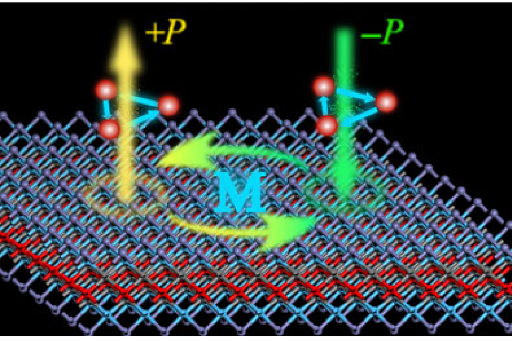
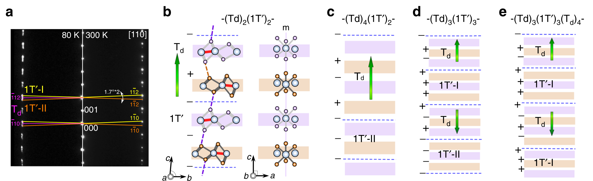
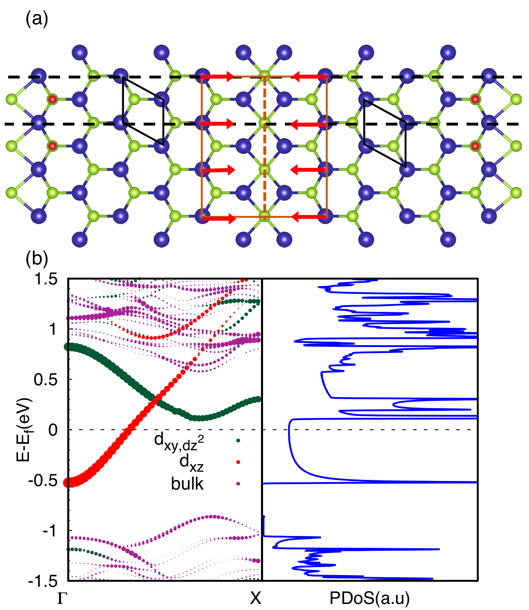
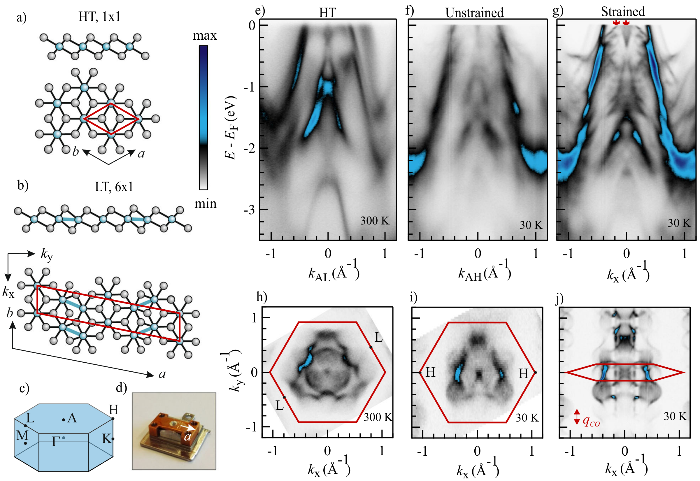
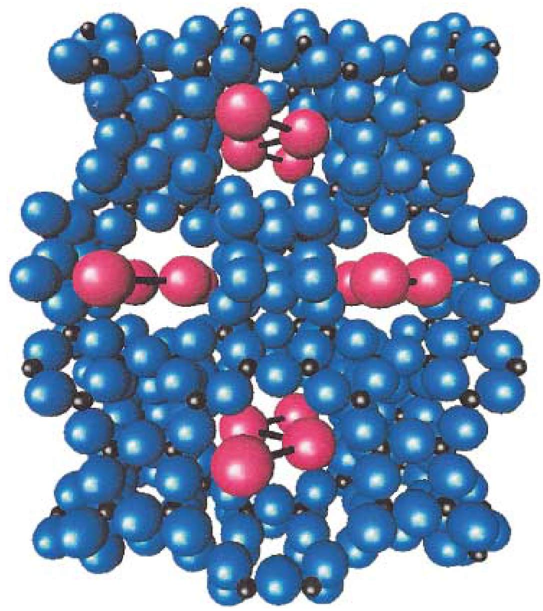
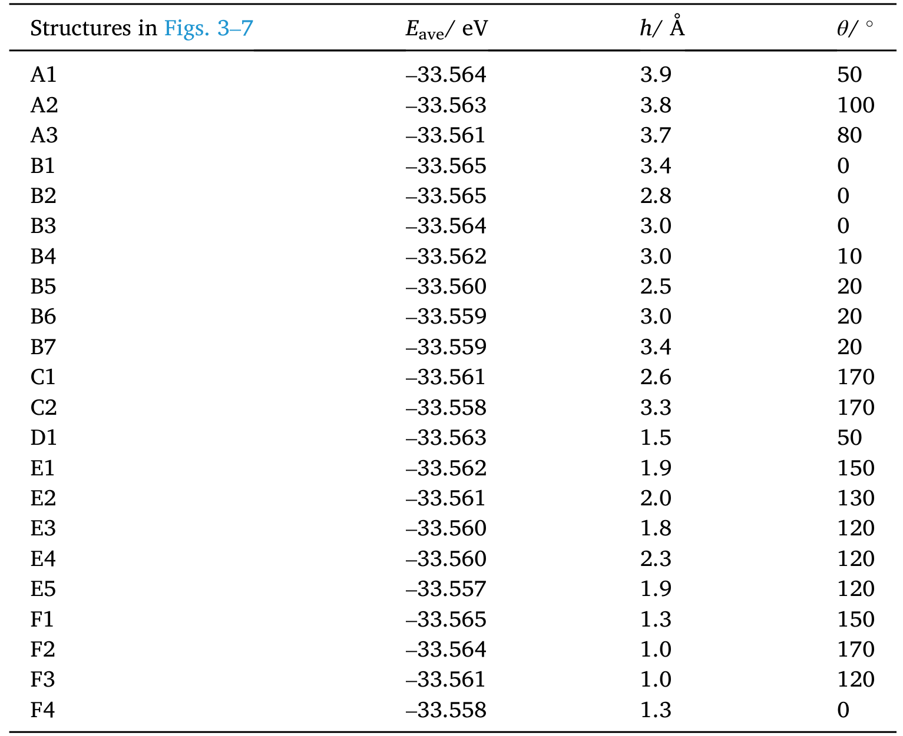
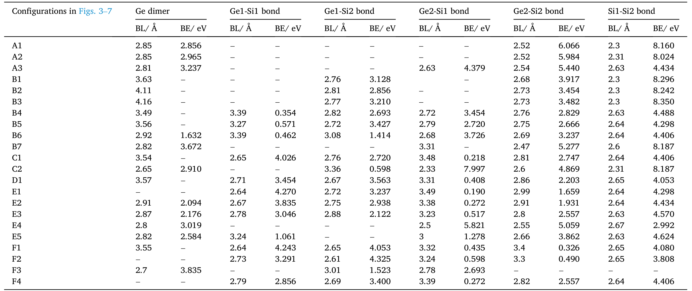

*   **来源**：[[../papers/huProgressProspectsLowdimensional2019]]

*   **关键特征**：这是Type-II 多铁的经典机制，即极化完全由磁
*   **来源**：[[../papers/huangPolarPhaseDomain2019]]

*   **关键特征**：不同颜色线条标示了1T’-I、1T’-II和Td相的衍射斑点。通过测量(1
*   **来源**：[[../papers/krishnamurthiSpinChargeDensity2020]]

*   **关键特征**：在费米能级附近，态密度出现了尖锐的
*   **来源**：[[../papers/liMonolayerPuckeredPentagonal2022]]

*   **关键特征**：展示了块体黄铁矿相VTe₂的结构。图中用绿色虚线标出了构成单层PP-VTe₂的“V₂Te₄”子层，直观
*   **来源**：[[../papers/nicholsonUni
*   **来源**：[[../papers/shuTwoDimensionalBlackArsenic2020]]

*   **关键特征**：(a) 展示了通过液相剥离法（LPE） 制备二维b-AsP纳米片的过程。流程大致为：块体晶体 → 在溶剂中超声处理 → 离心分离 → 得到含有纳
*   **来源**：[[../papers/spaldinAdvancesMagnetoelectric
*   **来源**：[[../papers/wangFormationMechanismTwin2019]]

*   **关键
*   **来源**：[[../papers/wangFormationMechanismTwin2019]]
*   **来源**：[[../papers/xuTwodimensionalFerroelasticityVan2021]]

*   **关键特征**：原子级分辨率的ADF-STEM（环形暗场像）图像，直观展示了60°和120°畴壁（DWs）。可以看到，跨过畴壁，基本晶格保持连贯，但纳米条纹的取向发生了改变。的层-层生长技术。特征**：这是Type-II 多铁的经典机制，即极化完全由磁
*   **来源**：[[../papers/huangPolarPhaseDomain2019]]

*   **关键特征**：不同颜色线条标示了1T’-I、1T’-II和Td相的衍射斑点。通过测量(1
*   **来源**：[[../papers/krishnamurthiSpinChargeDensity2020]]

*   **关键特征**：在费米能级附近，态密度出现了尖锐的
*   **来源**：[[../papers/liMonolayerPuckeredPentagonal2022]]

*   **关键特征**：展示了块体黄铁矿相VTe₂的结构。图中用绿色虚线标出了构成单层PP-VTe₂的“V₂Te₄”子层，直观
*   **来源**：[[../papers/nicholsonUni
*   **来源**：[[../papers/shuTwoDimensionalBlackArsenic2020]]

*   **关键特征**：(a) 展示了通过液相剥离法（LPE） 制备二维b-AsP纳米片的过程。流程大致为：块体晶体 → 在溶剂中超声处理 → 离心分离 → 得到含有纳
*   **来源**：[[../papers/spaldinAdvancesMagnetoelectric
*   **来源**：[[../papers/wangFormationMechanismTwin2019]]

*   **关键
*   **来源**：[[../papers/wangFormationMechanismTwin2019]]
*   **来源**：[[../papers/xuTwodimensionalFerroelasticityVan2021]]

*   **关键特征**：原子级分辨率的ADF-STEM（环形暗场像）图像，直观展示了60°和120°畴壁（DWs）。可以看到，跨过畴壁，基本晶格保持连贯，但纳米条纹的取向发生了改变。的层-层生长技术。
[[科研Wiki/wiki/figures/crystal-structures|← 返回枢纽页]]

---

> **📂 子页面导航**：
>
> | 子页面 | 主题 | 条目数 |
> |--------|------|--------|
> | [[crystal-structures-fundamentals|🧱 基础晶体结构]] | 单层与多层晶体几何、堆垛构型、Janus 结构、层间滑移与结构畸变。 | 42 |
> | [[crystal-structures-computational|💻 计算模拟与电子结构]] | DFT/MD 计算模型、吸附构型、电子结构、畴壁动力学与磁性计算。 | 40 |
> | [[crystal-structures-phase|🔄 相变与缺陷结构]] | 相图、CDW/超导竞争、熔化凝固、晶粒演化与非晶化。 | 41 |
> | [[crystal-structures-tables|📊 数据表格与补充结构]] | 关键数据表格以及溢出的基础晶体结构图。 | 45 |
>
> [[科研Wiki/wiki/figures/crystal-structures|← 返回枢纽页]]

---

## 🧱 补充晶体结构

### 1. 极性拓扑结构示意图：畴壁、通量闭合畴、涡旋、反涡旋、半子（刺猬型/涡旋型）、斯格明子（Néel/Bloch型）

*   **来源**：[[../papers/hanPolarTopologicalMaterials2025]]
*   **关键特征**：刺猬型/涡旋型）、斯格明子

### 2. 立方钙钛矿ABO3结构

*   **来源**：[[../papers/hillWhyAreThere2000a]]

### 3. 六方钙钛矿（YMnO3，Mn为5配位）

*   **来源**：[[../papers/hillWhyAreThere2000a]]
*   **关键特征**：YMnO3

### 4. Hf₂VC₂F₂ MXene 中 120° Y 型自旋序打破反演对称产生垂直极化（Type-II 多铁）

*   **来源**：[[../papers/huProgressProspectsLowdimensional2019]]

### 5. 80 K SAED花样与Td/1T′超晶格原子模型，统一空间群Pm

*   **来源**：[[../papers/huangPolarPhaseDomain2019]]

### 6. MAX相到MXene的结构演变及A/B型空心位

*   **来源**：[[../papers/khazaeiNovelElectronicMagnetic2013]]

### 7. (a) -10 V/0.5 ms 脉冲后大范围 STM 形貌，可见中心移除坑及周围 T 相(√13×√13 CDW) 与新生 H 相(平坦三角晶格) 共存，35

*   **来源**：[[../papers/kimObservationPhaseTransition1997]]
*   **关键特征**：平坦三角晶格) 共存

### 8. 相界高分辨原子像：(a) -250 mV 同时显示 T 相 CDW 超晶格相对原子晶格旋转约 14°，(b) -10 mV 显示跨相界原子行平行但存在分数倍错位

*   **来源**：[[../papers/kimObservationPhaseTransition1997]]
*   **关键特征**：b) -10 mV 显示跨相界原子行平行但存在分数倍错位

### 9. MTB原子结构、DFT能带与一维范霍夫奇点态密度

*   **来源**：[[../papers/krishnamurthiSpinChargeDensity2020]]

### 10. BP-VTe2晶体结构与能带、PP-VTe2顶视/侧视、布里渊区及模拟STM图像

*   **来源**：[[../papers/liMonolayerPuckeredPentagonal2022]]

### 11. 界面相变存储与 Sb2Te3-GeTe 超晶格扩散开关

*   **来源**：[[../papers/liPhaseTransitions2D2021]]

### 12. 非传统应变：不同激光能量(1.5 vs 2.7 J/cm²)生长BaTiO3的RSM与Δc/c≈4.1%晶格膨胀；Tc从~100°C升至>600°C；氧八面体旋

*   **来源**：[[../papers/martinThinfilmFerroelectricMaterials2016]]
*   **关键特征**：Tc从~100°C升至>600°C

### 13. 未来方向：ABC型化合物高通量筛选(a0-Eg、k14-e14)；PbTiO3皮秒超快泵浦-探测c轴动力学(5 ps退极化场极小值)；PbTiO3/SrTiO3

*   **来源**：[[../papers/martinThinfilmFerroelectricMaterials2016]]
*   **关键特征**：5 ps退极化场极小值)

### 14. MAX相及其对应MXene的原子结构对比

*   **来源**：[[../papers/naguib25thAnniversaryArticle2013a]]

### 15. 从MAX相粉末经HF刻蚀、洗涤到手风琴状多层MXene的合成流程示意图

*   **来源**：[[../papers/naguib25thAnniversaryArticle2013a]]

### 16. 多种MXene的SEM/XRD/TEM/HRTEM/SAED/光学显微形貌表征

*   **来源**：[[../papers/naguib25thAnniversaryArticle2013a]]

### 17. Ti3C2Tx纳米卷轴与OH封端Ti3C2纳米管原子模型

*   **来源**：[[../papers/naguib25thAnniversaryArticle2013a]]

### 18. 功能化MXene表面T基团的三种构型I/II/III（侧视与顶视）

*   **来源**：[[../papers/naguib25thAnniversaryArticle2013a]]

### 19. 多层Ti3C2Tx粉末电极与少层MXene纸电极在锂离子电池中的性能对比

*   **来源**：[[../papers/naguib25thAnniversaryArticle2013a]]

### 20. 应变对 IrTe2 电子结构的影响：晶体结构、应变装置照片、未应变/应变下 ARPES 能带与费米面对比

*   **来源**：[[../papers/nicholsonUniaxialStraininducedPhase2021]]

### 21. ：CsxSi32O64原子结构片段，Cs+离子(红)在纳米孔中组装成锯齿形链，O为蓝色，Si为黑色

*   **来源**：[[../papers/petkovStructureIntercalatedCs2002]]
*   **关键特征**：O为蓝色

### 22. LPE制备流程与b-AsP晶体结构

*   **来源**：[[../papers/shuTwoDimensionalBlackArsenic2020]]

### 23. 多铁复合结构：(a) LuFeO3/LuFe2O4原子级超晶格；(b) BaTiO3-CoFe2O4垂直纳米柱；(c) BFO应变诱导T/R混合相及R'磁性相

*   **来源**：[[../papers/spaldinAdvancesMagnetoelectricMultiferroics2019]]

### 24. 多铁畴壁功能：(a) BFO中109°畴壁原子结构；(b) 畴壁导电；(c) 忆阻I-V滞回；(d,e) ErMnO3带电畴壁极性依赖电导

*   **来源**：[[../papers/spaldinAdvancesMagnetoelectricMultiferroics2019]]
*   **关键特征**：d

### 25. 在网法晶格偏差示意：格点轨迹偏离真实梯度线，使分割面沿网格方向对齐

*   **来源**：[[../papers/tangGridbasedBaderAnalysis2009]]
*   **关键特征**：格点轨迹偏离真实梯度线

### 26. WTe2原子结构模型与含孪晶畴界的高分辨STM图像

*   **来源**：[[../papers/wangFormationMechanismTwin2019]]

### 27. 原子滑移过程与广义堆垛层错能（GSFE）曲线

*   **来源**：[[../papers/wangFormationMechanismTwin2019]]

### 28. Mn2(TTFTB)晶体结构：沿c轴纳米孔道、π-堆积TTF柱、配位水

*   **来源**：[[../papers/wangScreeningEnabledChemiresistiveMoisture2025]]
*   **关键特征**：TTFTB)晶体结构

### 29. 60°与120°畴壁原子结构、SAED分裂斑点及晶格间距映射

*   **来源**：[[../papers/xuTwodimensionalFerroelasticityVan2021]]

## 📊 数据表格 (Data Tables)

### 30. 表：六种MX2两方向的E、σ*、ε*、各向异性因子φ与ΔQ

*   **来源**：[[../papers/Li2013bonding]]

### 31. 表：structural parameters

*   **来源**：[[../papers/Perugu2024morphology]]

### 32. 表：几何参数表

*   **来源**：[[../papers/Wei2021]]

### 33. 表：表1 重构表面二聚体键长与翘曲角（与DFT和实验值对比）

*   **来源**：[[../papers/Wu2018]]

### 34. 表：表2 未重构与重构表面总能量及表面能（重构降低表面能0.0458/0.0469 eV/Ų）

*   **来源**：[[../papers/Wu2018]]

### 35. 表：表3 Ge原子稳定吸附构型参数汇总（初始高度、吸附能、键长、翘曲角、布居数）

*   **来源**：[[../papers/Wu2018]]

### 36. 表：表1：22个稳定构型的Eave、h、θ

*   **来源**：[[../papers/Wu2021]]

### 37. 表：表2：各构型Ge二聚体、Ge–Si、Si–Si键的键长BL与键能BE

*   **来源**：[[../papers/Wu2021]]

### 38. 表：表1：Si/Mn/Ni/Cu/Cr的Zener参数ΔT_i^M与ΔT_i^NM

*   **来源**：[[../papers/Zhang2003a]]

### 39. 表：二聚体性质对比

*   **来源**：[[../papers/blochlProjectorAugmentedwaveMethod1994b]]

### 40. 表：晶格常数、极化与MAE

*   **来源**：[[../papers/hanTunableSlidingFerroelectricity2025]]

### 41. 表：小分子键长对比 PAW/US-PP/AE（表I）

*   **来源**：[[../papers/kresseUltrasoftPseudopotentialsProjector1999c]]

### 42. 表：Fe/Co/Ni 块体晶格常数、体模量、磁矩对比（表V）

*   **来源**：[[../papers/kresseUltrasoftPseudopotentialsProjector1999c]]

### 43. 表：表1 不同MAX相合成MXene的HF浓度、时间、c晶格参数及产率

*   **来源**：[[../papers/naguib25thAnniversaryArticle2013a]]

### 44. 表：表2 多种裸MXene单层的面内弹性常数c11、a晶格参数与费米能级DOS（含对应MAX相c11对照）

*   **来源**：[[../papers/naguib25thAnniversaryArticle2013a]]

### 45. 表：表1 不同堆垛下Gd-Gd层间距离、配位数、海森堡交换参数J及ΔE

*   **来源**：[[../papers/xunCoexistingMagnetismFerroelectric2024]]

---

## 🔗 相关概念与实体 (Related Concepts & Entities)

**核心概念**：[[../concepts/ferroelectricity|ferroelectricity]]、[[../concepts/sliding-ferroelectricity|sliding ferroelectricity]]、[[../concepts/multiferroicity|multiferroicity]]、[[../concepts/charge-density-wave|charge density wave]]

**相关材料/实体**：[[../entities/h-BN|h BN]]、[[../entities/WTe2|WTe2]]、[[../entities/MoTe2|MoTe2]]、[[../entities/NiI2|NiI2]]、[[../entities/TMDs|TMDs]]、[[../entities/HgI2|HgI2]]、[[../entities/BiFeO3|BiFeO3]]、[[../entities/TaSe2|TaSe2]]
