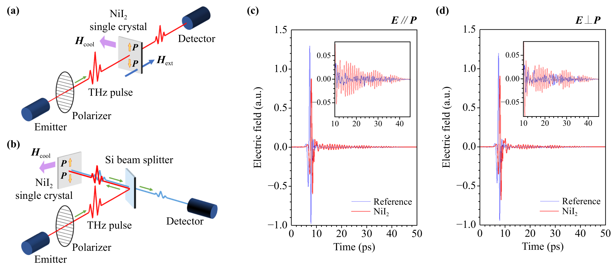
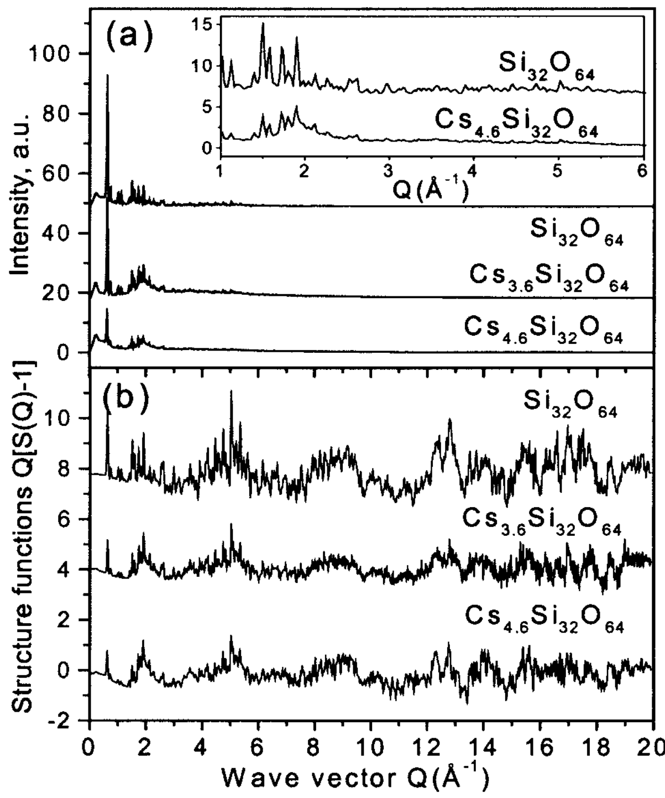

---
tags:
  - type/figure-collection
---

# 晶体结构与原子构型：XRD与相变

> 属于 [[crystal-structures|晶体结构与原子构型]]

## 条目

### 1. 图1 T_cdw 与 T_c 随 a/c 变化的相图，显示 TaSe₂/TaS₂/NbSe₂/NbS₂ 的反相关关系

*   **来源**：[[../papers/CastroNeto2001charge]]
*   **图示描述**：横轴为面内晶格常数与层间距之比 a/c（无量纲），纵轴为转变温度 T（K）。星号标记 CDW 转变温度 T_cdw，实心方块标记超导转变温度 T_c；从左到右四种材料依次为 TaSe₂、TaS₂、NbSe₂、NbS₂。
*   **关键特征**：随 a/c 增大（二维性减弱、层间耦合增强），T_cdw 单调下降而 T_c 单调上升，二者呈明显反相关；TaSe₂ 的 T_c ≈ 0.1 K，已非常接近理论预言的超导量子临界点 QCP（g ≈ g_c）；加压使 c 减小、T_c 升高的实验趋势与该图像一致。

### 2. 图1 E-t 相图：C/NC/IC 三相及超导穹顶，红线为 a1∝E 耦合，灰线为 E 无关耦合；插图显示 η 在 t_c 处跳变（一级相变）

*   **来源**：[[../papers/Chen2019superconductivity]]
*   **图示描述**：横轴为锁相能 E（从左到右减小，对应电子掺杂浓度增加），纵轴为约化温度 t ∝ T − T_icdw；相图划分出正常态、公度 C、近公度 NC、非公度 IC 四个区域，叠加在 NC 区之上的是超导穹顶 SC+NC。
*   **关键特征**：绿线 E_c(t) 为 C–IC 边界，斜率陡峭，表明公度相突然消失；红线（a₁=500E，耦合随锁相能线性变化）给出仅在 NC 区出现的超导穹顶，与实验一致；灰线（a₁=500×2.1，与 E 无关）则让 SC 一直延伸到 IC 极限；插图显示 η=|q|/qᴵ 在 t_c 处由 0 跳变到约 1，证实 C–IC 为一级相变。

### 3. 补充相图/纹理图（fig_4）

*   **来源**：[[../papers/Chen2019superconductivity]]
*   **图示描述**：补充材料中的相图或实空间超导序参量纹理图，用于展示耦合强度对 SC 穹顶边界的影响以及不同 (E,t) 点处 Φ(r) 的空间形态（对应补充材料 Fig. S3/S4）。
*   **关键特征**：补充相图显示 SC 自由能中耦合常数 a₁ 控制 T_sc 线在 NC 区的位置（a₁=500 对应正文红线，减小到 a₁=250 时穹顶边界下移，可用于匹配实验 T_cdw/T_sc≈20）；实空间纹理面板分别展示刚低于 T_s0^cd 时在 Kagome 顶点成核的 0D 岛、低于 T_s1^cd 后的 1D 渗透网络、E 减小时因 a₁∝E 被削弱的 SC 振幅，以及 E 无关耦合下在 E=0 均匀 IC 态中扩展到全域的 2D 超导。

### 4. 图4 (a) DSC、(b) 晶格参数 a/c、(c) 体积、(d) 离子位移 δ、(e) 极化 P 随温度变化

*   **来源**：[[../papers/Goswami2011multiferroic]]
*   **图示描述**：五个子图共享温度 T（K）横轴：(a) DSC 热流（块体黑、纳米红）、(b) 晶格参数 c（左轴，Å）与 a（右轴，Å）、(c) 晶胞体积 V（ų）、(d) Bi/Fe 偏心位移及净 δ（菱形/倒三角/星号，Å）、(e) 点电荷模型计算的铁电极化 P（μC/cm²）。
*   **关键特征**：纳米颗粒 TN 由块体 ~653 K 降至 ~635 K，DSC 吸热峰明显宽化（表面效应圆化一级相变）；TN 处 V 收缩约 0.4%，a、c 出现拐折，呈磁弹耦合特征；δBi、δFe 与净 δ 在 TN 处台阶式跃升；P 在 TN 处跃升约 30%，磁有序"从无到有"对极化的影响远大于远低于 TN 时 5 T 磁场的 7% 抑制。

### 5. XRD patterns of BLFO nanoparticles

*   **来源**：[[../papers/Perugu2024morphology]]
*   **图示描述**：横轴为 2θ（度），纵轴为衍射强度（任意单位），并列 x=0.2、0.4、0.6、0.8 四条谱线；最强峰位于 (110) 面。
*   **关键特征**：所有样品均与 JCPDS 86-1518 菱方（三方）钙钛矿标准卡片吻合；低 La 含量样品存在正交 Bi₂Fe₄O₉ 和立方 Bi₂₅FeO₄₀ 杂相峰，La 含量超过 50% 后这些杂峰基本消失；(110) 峰随 x 增大轻微向低角偏移，对应晶格膨胀；结合谢乐公式 D=0.9λ/βcosθ，Davg 从 41.5 nm（x=0.2）增至 83.6 nm（x=0.8），微应变由 0.0034 降至 0.0012。

### 6. 图12 NiI₂太赫兹反射/透射谱，T_N2以下34与37 cm⁻¹两个电磁振子模式

*   **来源**：[[../papers/RecentAdvancesGrowth2025]]
*   **图示描述**：CVT 生长 NiI₂ 的 X 射线衍射（XRD）图谱，横轴为衍射角 2θ（度，Cu Kα 辐射），纵轴为衍射计数（a.u.），出现一系列 (00l) 布拉格峰。
*   **关键特征**：(003)、(006) 等系列峰证明晶体沿 c 轴高度取向、层状堆垛良好；室温精修给出晶胞参数 a ≈ 3.91 Å、c ≈ 19.93 Å；峰位与峰宽可用于判定相纯度和层状结晶质量。

### 7. 图2 黑色多晶型TTF-CA的X射线粉末衍射图谱与三斜晶胞参数

*   **来源**：[[../papers/Wixtrom2011electrical]]
*   **图示描述**：新黑色多晶型的粉末 X 射线衍射图谱；横轴为衍射角 2θ（单位 °），纵轴为衍射强度（任意单位），峰下方的黑色刻度线表示三斜晶胞允许的理论布拉格峰位置。
*   **关键特征**：实验峰尖锐、分离良好并与理论刻度吻合，表明产物结晶度高、物相纯净；由图谱解析得到三斜晶系晶胞参数 a=10.756(5) Å、b=11.057(4) Å、c=6.614(2) Å，α=101.36(2)°、β=93.69(3)°、γ=89.37(3)°，晶胞体积 V=769.6(5) ų，每个晶胞含 Z=2 个 TTF-CA 对；这些参数与被广泛研究的绿色单斜多晶型明显不同，证明机械化学路线得到了真正的新多晶型。

### 8. 图1：Fe–C 合金相图示意，标出 Ae3 温度线

*   **来源**：[[../papers/Zhang2002b]]
*   **图示描述**：简化的 Fe–C 二元相图局部，标出奥氏体(γ)区、铁素体(α)区以及 γ/α 平衡相界 Ae3 温度线，任一局部碳浓度 c 都对应一个 Ae3(c)。
*   **关键特征**：Ae3 是 γ→α 相变开始的平衡温度；模型把 Fe–Xi–C 多组分钢经"超元素 S"近似成 S–C 伪二元合金后，cγ、cα 与 Ae3 均直接读自该相图；每个元胞的形核判据 T < Ae3 即来自此图。

### 9. A36钢初始奥氏体与最终铁素体/渗碳体模拟组织

*   **来源**：[[../papers/Zhang2003a]]
*   **图示描述**：两子图并置，(a) 为 A36 钢（C0.17、Mn0.74、Si0.012、Cu0.016、Ni0.01、Cr0.019 wt%）经均匀恒形核率再结晶生成的初始奥氏体组织，d_γ = 18 μm；(b) 为足够高冷速下相变完成后的最终组织。
*   **关键特征**：不同灰度代表不同晶粒取向；铁素体优先在原奥氏体晶界形核并向晶内生长；深灰色颗粒为渗碳体，出现在碳富集且来不及扩散的界面处。

### 10. 铁素体转变分数Y随时间t：高冷速相变更快

*   **来源**：[[../papers/Zhang2003a]]
*   **图示描述**：横轴为物理时间 t（s），纵轴为铁素体转变分数 Y（%），三条 S 形曲线对应 11、41、61 °C/s 冷速。
*   **关键特征**：冷速越高，曲线起始越早、上升越陡、到达饱和所需时间越短；这是大过冷度下形核率与生长速度同时提高的动力学结果。

### 11. 表1 铁电体分类：本征（d⁰共价、孤对电子）与非本征（几何、电子、磁性铁电体）

*   **来源**：[[../papers/cheongMultiferroicsMagneticTwist2007a]]
*   **图示描述**：两栏表格，左栏列出反演对称破缺的微观机制，右栏给出代表性材料。本征类包括 3d⁰ 过渡金属-氧共价键合（BaTiO₃）和 Bi/Pb 的 6s² 孤对电子极化（BiMnO₃、BiFeO₃）；非本征类包括结构相变驱动的几何铁电体（K₂SeO₄、Cs₂CdI₄、六方 RMnO₃）、电荷有序驱动的电子铁电体（LuFe₂O₄）以及磁有序驱动的磁性铁电体（正交 RMnO₃、RMn₂O₅、CoCr₂O₄）。
*   **关键特征**：(1) 明确把"磁有序诱导极化"单列为非本征铁电体的一个子类，是本文范式转换的分类学基础；(2) BaTiO₃（3d⁰）与 BiFeO₃（6s² 孤对电子）虽为本征铁电体，但前者无磁性、后者磁电来自不同离子故耦合弱；(3) 几何/电子/磁性三类非本征铁电体的共同特征是极化作为其他序参量的副产品出现，从而对该序参量的外场调控高度敏感。

### 12. 弹性能与应变工程：ABO3外延失配应变、张/压应变下极化旋转、各向同性/异性应变、PTO基薄膜应变相图、P(VDF-TrFE)环形拓扑

*   **来源**：[[../papers/hanPolarTopologicalMaterials2025]]
*   **图示描述**：(a) ABO₃ 外延异质结晶格失配示意；(b,c) 张/压应变诱导极化旋转以及各向同性/异性应变对畴结构影响；(d) PTO 基薄膜在不同面内应变 ε_xx 下的拓扑相图；(e,f) 有机聚合物 P(VDF-TrFE) 中面内双轴应变稳定环状拓扑织构。
*   **关键特征**：张应变倾向面内极化、压应变倾向面外极化；双轴各向同性应变与各向异性应变给出不同旋转路径；PTO 基薄膜在合适应变窗口出现涡旋/斯格明子等；P(VDF-TrFE) 在双轴应变下出现环形极性拓扑。

### 13. 论文图6：1T-VTe₂ 中 (4×1)γ/(4×1)α/(4×4)/(4×1)γ 滑移相的 STM 模拟及 NEB 相变能垒（旋转 ~1.7 eV，相变/相移 ~3.0–3.3 eV）

*   **来源**：[[../papers/lezoualchStudyChargeDensity]]
*   **图示描述**：(a–d) 为 1T-VTe₂ 单层中 (4×1)γ、(4×1)α、(4×4) 以及 π/2 相移后的 (4×1)γ 滑移等不同 CDW 相的 DFT 模拟 STM 图像；(e) 为用 NEB 计算的从 (4×1)γ 出发转向其余各相的最小能量路径。
*   **关键特征**：模拟 STM 衬度与实验高度吻合，验证了所建原子模型；(4×1)γ → (4×1)α 旋转能垒最低，约 1.7 eV/(4×4) 单胞；(4×1)γ → (4×4) 相变及 → (4×1)γ 滑移相的能垒较高，约 3.0–3.3 eV/(4×4) 单胞；旋转只需改变单轴畸变方向而相变需引入多方向原子协同位移，故能垒差异显著。

### 14. 图3 (Δa/a0, Δb/b0)双轴应变空间中O1/O2-O3/2H的能量最低相图

*   **来源**：[[../papers/liFerroelasticityDomainPhysics2016]]
*   **图示描述**：以 O1 平衡晶格常数 a₀、b₀ 为参考，横轴 Δa/a₀、纵轴 Δb/b₀ 为 ±10% 工程应变，按 11×11 网格（121 点）DFT 扫描后二维样条插值，用不同色块标出各应变点能量最低的相/变体（O1、O2/O3、2H），曲线为相邻相能量等值边界。
*   **关键特征**：O1 与 O2/O3 势能面在仅几个百分点双轴应变处交叉；最快切换路径是沿 a 轴（二聚化金属链方向）拉伸同时沿 b 轴压缩（约 +4%/−2%）；双轴应变不破坏 y 方向镜像，故 O2/O3 保持简并；2H 相在 WTe₂ 中仅占左上角很小区域，与未考虑变体自由度的早期相图明显不同；该交叉应变在 TMD 单层可承受的 ~10% 弹性应变范围内。

### 15. 图3 双轴倾转电子衍射验证褶皱各向异性（FWHM 不对称展宽）

*   **来源**：[[../papers/niuDirectVisualizationLargeScale2021]]
*   **图示描述**：a、b 为更大范围 HAADF-STEM 像及畸变单元分布图；c 为 0° 倾转的 SAED 图样；d、e 分别为绕 α 轴和 β 轴倾转时 (330)/(360) 与 (3−30)/(3−60) 衍射斑 FWHM 随倾角的变化；f 为各向异性褶皱示意，g 为倒易杆（relrod）锥角测量。
*   **关键特征**：绕 α 轴倾转时代表 (110)/(120) 晶面的 (330)、(360) 斑 FWHM 显著展宽，绕 β 轴时代表 (1−10)/(1−20) 的 (3−30)、(3−60) 几乎不变；倒易杆锥角 12°–16°，结合 HAADF 测得横向周期 L≈12 nm，得褶皱平均高度约 2.5 nm，AFM 佐证；与 MoS2 单层各向同性褶皱形成对照。

### 16. 图1 STM针尖脉冲诱导1T′-WSe2结构相变：(a,b)可逆产生1T′/1T′畴界；(c,d)1T′→1H相变

*   **来源**：[[../papers/pedramraziManipulatingTopologicalDomain2019]]
*   **图示描述**：STM形貌像（dz/dx 微分模式以增强相衬度），展示同一单层1T′-WSe2岛在针尖脉冲（V_pulse=10 V，Δt=100 ms，针尖-样品间距约6 Å，Vs=1 V，It=10 pA，T=4.5 K）前后的结构变化。(a)(b)脉冲前后同一1T′岛出现多个不同取向的畴并形成有序一维1T′/1T′畴界；(c)(d)另一1T′岛脉冲后中心区域发生1T′→1H相变，1H区表观高度更低。
*   **关键特征**：V_pulse≥6 V即可在三个等价1T′ Peierls取向间可逆切换（铁弹性直接证据），高电流栅格扫描（300 mV，1 nA）可擦除；V_pulse≥10 V才诱导不可逆的1T′→1H局部相变，且仅出现在被其他材料包围的"受限"区域；取向翻转势垒低于1T′→1H相变异垒；畴界为直线缺陷，最长约20 nm。

### 17. 图1：原始Si32O64和CsxSi32O64的粉末衍射图样(a)及结构函数S(Q)(b)

*   **来源**：[[../papers/petkovStructureIntercalatedCs2002]]
*   **图示描述**：上图(a)为原始粉末衍射强度随 Q 的变化，下图(b)为经过通量、背景、康普顿散射和吸收校正并以绝对电子单位归一化后的结构函数 S(Q)；三条曲线自上而下分别对应纯 ITQ-4 与 x=3.6、x=4.6 两种电子化合物。
*   **关键特征**：纯 Si₃₂O₆₄ 显示高而尖锐的布拉格峰，证明骨架的长程晶体有序；掺 Cs 后布拉格峰在 Q≈2 Å⁻¹ 处即显著衰减并合并为缓慢振荡的漫散射背景，插图(12–20 Å⁻¹)更清晰地展示了峰的消失与漫散射主导；S(Q) 在高 Q 区仍有振荡，说明局域尺度上材料依然有序，这正是 PDF 方法可以解析纳米受限 Cs 结构的前提。

### 18. ED Fig.1 NiI2 晶体的 X 射线与电子衍射

*   **来源**：[[../papers/songEvidenceSinglelayerVan2022]]
*   **图示描述**：组合展示 CVT 生长块材沿 c 轴的 (0 0 l) X 射线衍射峰、PVD 薄片的粉末衍射谱、7 nm 薄片的光学显微照片以及 TEM 选区电子衍射图样；横轴 2θ 单位为度，强度为任意单位。
*   **关键特征**：尖锐的 (0 0 l) 系列衍射峰证明 CVT 单晶沿 c 轴高度取向、结晶质量高；PVD 薄片衍射与块材相吻合，说明少层样品仍保持菱面体 R-3m 结构；TEM 电子衍射斑点锐利、无杂相，确认少层薄片为高质量单晶。

### 19. 图3 Bi2O3–Fe2O3相图，阴影区为预测可发现新多铁相的成分范围

*   **来源**：[[../papers/spaldinAdvancesMagnetoelectricMultiferroics2019]]
*   **图示描述**：以温度为纵轴、Bi₂O₃–Fe₂O₃ 摩尔组成为横轴的二元相图，标出 BiFeO₃ 以及 Bi₂₅FeO₃₉、Bi₂Fe₄O₉ 等已知相，并用阴影区标示作者预测可能存在新多铁相的成分窗口。
*   **关键特征**：①BFO 并非该化学空间的唯一产物，周围还有多个亚稳化合物；②阴影区涵盖偏离化学计量比的"富 Bi/贫 Bi"区间；③作者建议利用薄膜沉积等非平衡生长手段"冻结"出体相图中不存在的亚稳新相。

### 20. 图1 α-Fe₂O₃ 的 DQM 实验装置、ODMR 谱及 4 K/300 K 下重构的 Bz 磁场图，呈现莫林相变两侧磁相对比

*   **来源**：[[../papers/tanRevealingEmergentMagnetic2024]]
*   **图示描述**：自上而下展示材料结构（a–d：α-Fe₂O₃ 原子排布、M₁/M₂ 反铁磁亚晶格、Néel 矢量 l⃗ = M₁−M₂ 与 DMI 诱导的净磁化 m⃗ = M₁+M₂，倾斜角 Δ ≈ 1.1 mrad）、DQM 装置与 NV 色心 ODMR 读出原理（e–f），以及 T = 4 K 与 300 K（分别低于/高于莫林相变 T_M ≈ 200 K）下的 ODMR 谱（g–h）和重构 Bz 磁场图（i–j，比例尺 1 μm）。
*   **关键特征**：4 K（T < T_M）下磁矩面外排列、m⃗ ≈ 0，Bz 图仅见窄而锐利、零背景的畴壁信号；300 K（T > T_M）下磁矩面内倾斜、平均 mΔ ≈ 2×10³ A m⁻¹，Bz 图呈现更宽、非零背景的拓扑织构特征；ODMR 共振峰 f+ 的频移直接给出 NV 处投影磁场 B_NV，偏置场约 0.5 mT，D ≈ 2.87 GHz、γ̃ ≈ 28 MHz mT⁻¹。

### 21. 图4 二维积分磁荷 |Qm| 随积分半径 r 的标度：半子线性增长、反半子近零并因织构间相互作用而偏离

*   **来源**：[[../papers/tanRevealingEmergentMagnetic2024]]
*   **图示描述**：（a–b）两个实验反半子的 σ_m 图，点线圆圈标出以织构中心为圆心、半径 r 的积分区域 S；（c）为 |Q_m(r)| = |∫_S σ_m dS| 曲线：浅蓝/浅红虚线为单个半子/反半子数据，深蓝/深红虚线为平均，黑色实线为线性半子模型预测，横轴 r 单位 nm，纵轴 |Q_m| 单位 10⁻¹⁰ A·m。
*   **关键特征**：半子的 |Q_m| 随 r 线性增长，符合孤立单极子理论（r > R_M 时 Q_m = 2π mΔ sin(ξ_a) r t）；理想孤立反半子因二重旋转对称 Q_m ≡ 0，但实测在长程因邻近织构扰动而偏离零值；该偏离说明 Q_m 不是拓扑不变量，a-Bloch→a-Néel 的平滑过渡即可令 Q_m → 0。

### 22. 图4 J、d_k、SIA 随双轴应变变化，及应变-磁场拓扑相图（斯格明子/双半子）

*   **来源**：[[../papers/wangTunableD0Topological2025b]]
*   **图示描述**：四面板图。(a) 双 Y 轴曲线：横轴双轴应变 -5%–5%，左轴 J（meV）、右轴 d_k（meV），插图为 |d_k/J|；(b) SIA（μeV）随应变曲线，插图分解 K_MCA 与 K_MSA；(c)(d) 分别为斯格明子、双半子的应变-磁场二维相图，颜色编码拓扑电荷 Q。
*   **关键特征**：拉伸应变下 d_k 单调增大、J 略减，|d_k/J| 显著上升；压缩应变影响很小；-4%–5% 应变内 SIA 为正、面外易轴，且主要由 K_MCA 主导；5% 拉伸时斯格明子纯相可在 B_z = 4–11 T 极宽窗口内存在、密度增大；双半子的稳定磁场上限也随拉伸同步抬高。

### 23. 图6 应变诱导磁性（NbS₂/NbSe₂、褶皱ReSe₂）与2H-1T'相变（AFM驱动MoTe₂电导率变化10⁴倍）

*   **来源**：[[../papers/yangStrainEngineeringTwodimensional2021]]
*   **图示描述**：(A)(B) DFT 计算双轴拉伸应变下非磁性 NbS₂、NbSe₂ 出现自旋极化能带；(C) 褶皱 ReSe₂ 的 MFM 图像在褶皱区显示磁性信号；(D)(E) MX₂ 型 TMD 的 2H、1T、1T' 三种相原子结构及拉伸下 2H→1T' 渐进相变；(F)(G) AFM 针尖对 MoTe₂ 局域加载并测量电导率突变。
*   **关键特征**：NbS₂/NbSe₂ 的磁性来自理论预测，褶皱 ReSe₂ 给出实验 MFM 证据；MoTe₂ 在 AFM 针尖加载下实现半导体 2H 相到金属 1T' 相转变，电导率变化高达 10⁴ 倍；应变还可调控本征范德华磁体的居里温度与磁耦合（理论多于实验）。

### 24. 拓扑磁结构相图与温度稳定性

*   **来源**：[[../papers/zhangNonvolatileControlTopological2025]]
*   **图示描述**：(a) 0 K 下 P↑ 与 P↓ 态在 Bz = 0 T 和 50 mT 时的自旋织构快照；(b) P↓ 态拓扑电荷 |Q| 随外磁场 Bz（T）的变化曲线；(c) P↓ 态温度 T（K）–磁场 Bz（T）二维相图，划分 SkX、FD、FM、PM 区域，并附 2.0 T 下不同温度的自旋织构；(d) P↓ 态斯格明子半径 R_x（nm）随 Bz 的变化。
*   **关键特征**：P↑ 态在 50 mT 时 SkX 坍塌为 FM，而 P↓ 态 SkX 维持至 5.2 T；|Q| 在 Bz ≈ 2.8 T 达峰 17，5.6 T 完全进入 FM；R_x 由 0 T 的 6.15 nm 压缩至 5.2 T 的 2.86 nm；200 K、4.4 T 下 SkX 密度仍 >628 μm⁻²，热稳定性优于 CrSeI/In2Te3，200 K 以上转入 FD 再到 PM。

### 25. MAE 对拓扑相与能量的影响

*   **来源**：[[../papers/zhangNonvolatileControlTopological2025]]
*   **图示描述**：(a) Bz = 0 T 与 1.6 T 下自旋织构随 K（meV/Cr）变化的相图；(b) 0 T 下总能量 E_tot 及交换能 E_Ex、DMI 能 E_DMI、各向异性能 E_Ani 随 K 的变化；(c) 1.6 T 下加入塞曼能 E_Zeeman 后的各能量项分解。
*   **关键特征**：Bz = 0 T 时 K > 2.0 meV/Cr 抑制迷宫畴，稳定半径约 5.8 nm 的孤立 Néel 斯格明子；K < −2.0 meV/Cr 且 |K| > 2 meV/Cr 时出现双半子；E_Ex 在 K = 0 最大、随 |K| 增大而减小，E_DMI 趋势相反，二者竞争驱动 E_tot 随 K 呈抛物线下降；1.6 T 下 E_Zeeman 在 K 为负时几乎不变，K 为正时小幅下降。

### 26. d-K 相图与 κ 判据

*   **来源**：[[../papers/zhangNonvolatileControlTopological2025]]
*   **图示描述**：(a) 零场下自旋织构随 d∥（meV）和 K（meV/Cr）变化的二维相图，标出 FM、迷宫畴、斯格明子、双半子区域；(b) 以无量纲参数 κ = (π/4)²·2JK/(3d∥²) 为横轴的一维相图，叠加 κ = ±5、±10 边界线。
*   **关键特征**：d∥ 较小时体系为 FM，随 d∥ 增大迷宫畴与斯格明子密度升高，DMI 是非平庸拓扑态的必要条件；|κ| < 5 对应斯格明子-迷宫混合（SLM）相；5 < |κ| < 10 为孤立斯格明子/双半子稳定窗口；|κ| 更大时共线能量占优、回到 FM；斯格明子与双半子的半径、密度均与 |K| 成反比。

### 27. Eq.5 Arrhenius 1/τ=A·exp(−E_A/k_BT)

*   **来源**：[[../papers/zhongHighthroughputExfoliationMultiferroic2025]]
*   **图示描述**：序-序相变特征时间 τ 的 Arrhenius 估计 1/τ = A·exp(−E_A/k_BT)，A 为尝试频率、E_A 为 cNEB 势垒。
*   **关键特征**：取 A = 10 THz、T = 300 K、E_A = 9.1 meV/atom，得 τ ~ 21–232 fs；对应单次开关能耗 4.4×10⁻⁴–4.9×10⁻³ fJ，较 3 nm 环栅 SiC/SiGe CMOS 的 2.85 ps 电荷动力学跨入飞秒量级。
