---
tags:
  - type/figure-collection
---

# 铁电畴与畴壁：畴结构与畴壁

> 属于 [[domain-walls|铁电畴与畴壁]]

## 条目

### 1. Fig.1 初始畴结构与8种极化方向
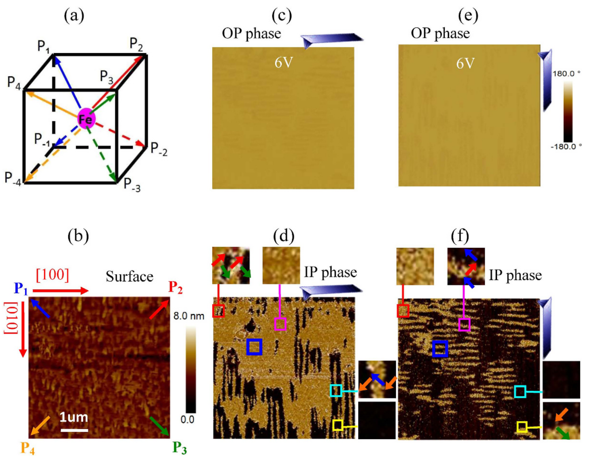
*   **来源**：[[../papers/Chen2016electrical]]
*   **图示描述**：(a) BiFeO₃ 晶胞沿四条赝立方体对角线的 8 种极化方向示意（P1–P4 向上、P−1–P−4 向下）；(b) 5×5 μm² 范围的 AFM 表面形貌；(c–f) 经 +6 V 极化后，悬臂分别沿 [100] 与 [010] 方向所测的垂直 (OP) 与水平 (IP) PFM 相位图。
*   **关键特征**：表面呈纳米级光滑，是后续针尖施加 1.18 GPa 应力而不产生塑性损伤的前提；6 V 极化后形成以 P2–P3、P3–P4、P4–P1 为主的 μm 级 71° 条纹畴；OP 相位区分向上/向下，两组正交 IP 相位组合可唯一确定 P1–P4 四种面内取向。

### 2. P-E loops of BLFO nanoparticles
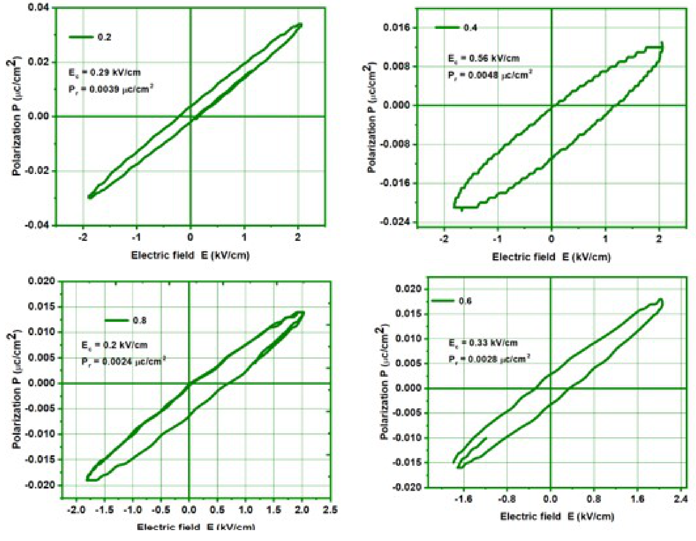
*   **来源**：[[../papers/Perugu2024morphology]]
*   **图示描述**：横轴为外加电场 E（kV/cm），纵轴为极化强度 P（μC/cm²），四条闭合曲线对应 x=0.2–0.8。
*   **关键特征**：所有回线均呈"香蕉形"而非矩形饱和环，表明 180° 铁电畴与高浓度氧空位导致的漏电流占主导；矫顽电场 Ec 在 0.2–0.56 kV/cm 之间，剩余极化 Pr 仅 0.0024–0.0048 μC/cm²，两者随成分均无系统变化。

### 3. 图4 多铁畴壁操控
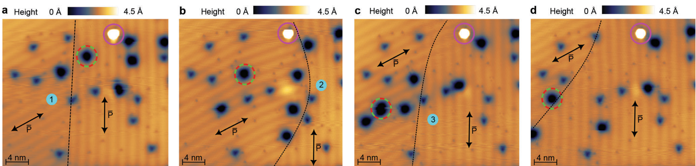
*   **来源**：[[../papers/aminiAtomicscaleVisualizationMultiferroicity2024]]
*   **图示描述**：同一区域（约 30 × 27 nm²）的四帧连续 STM 图 (a–d)，记录多铁畴壁（黑色虚线）在 STM 针尖电压脉冲（偏压 1 → 4 V 扫描、闭环反馈、I = 100 pA）下的移动；天蓝点为脉冲施加位置，粉色实心圆为中性缺陷（不动参考），红-绿虚线圆为带电缺陷，黑箭头标出每个畴内平均极化方向。
*   **关键特征**：每次脉冲后畴壁都向远离脉冲点的方向移动，被脉冲一侧的畴面积扩大；带电缺陷随脉冲移动、中性缺陷保持不动，既区分了缺陷类型又提供了可靠的空间参考系；脉冲序列可重复三次，畴壁位置均发生可追踪的净位移。

### 4. 文中图27（版式插图）
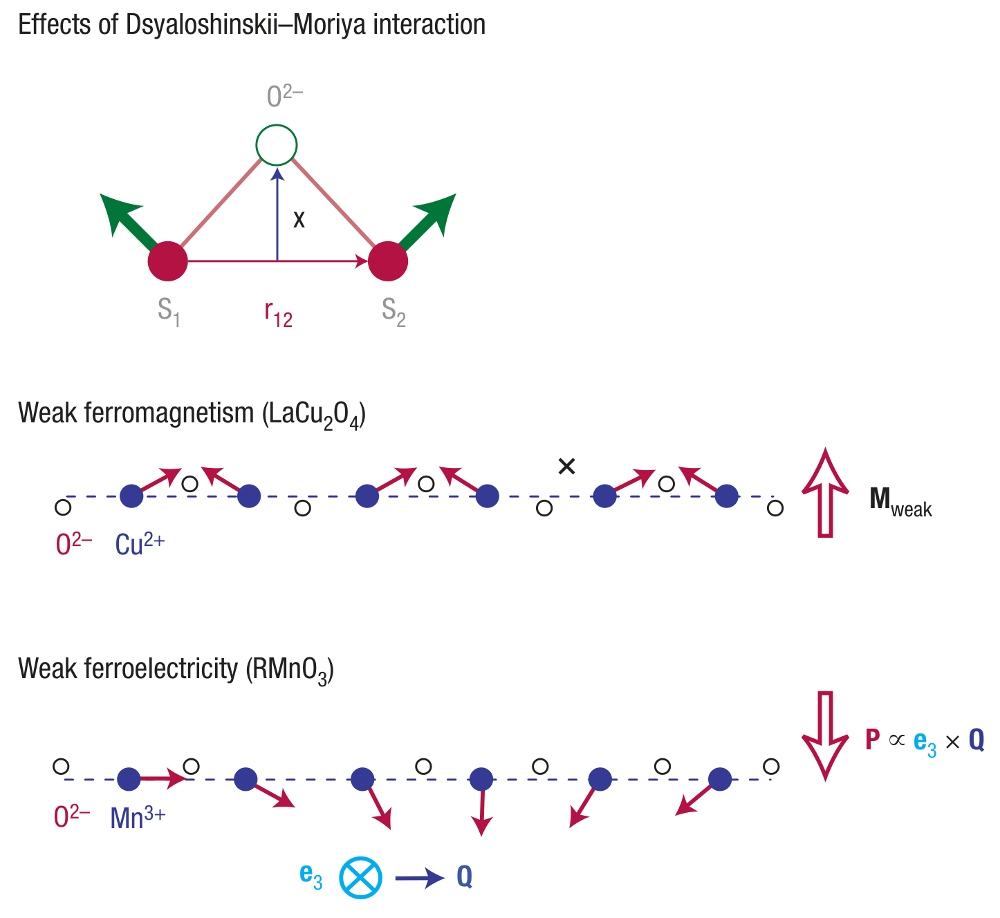
*   **来源**：[[../papers/cheongMultiferroicsMagneticTwist2007a]]
*   **图示描述**：综述正文中的版式插图，raw/note 未提供该编号图的解析；从编号与版式判断为正文配图，用于示意文中讨论的某类磁结构或材料构型。
*   **关键特征**：无定量数据；具体图意需对照原文页码与图注确认。

### 5. 题图/版式横幅
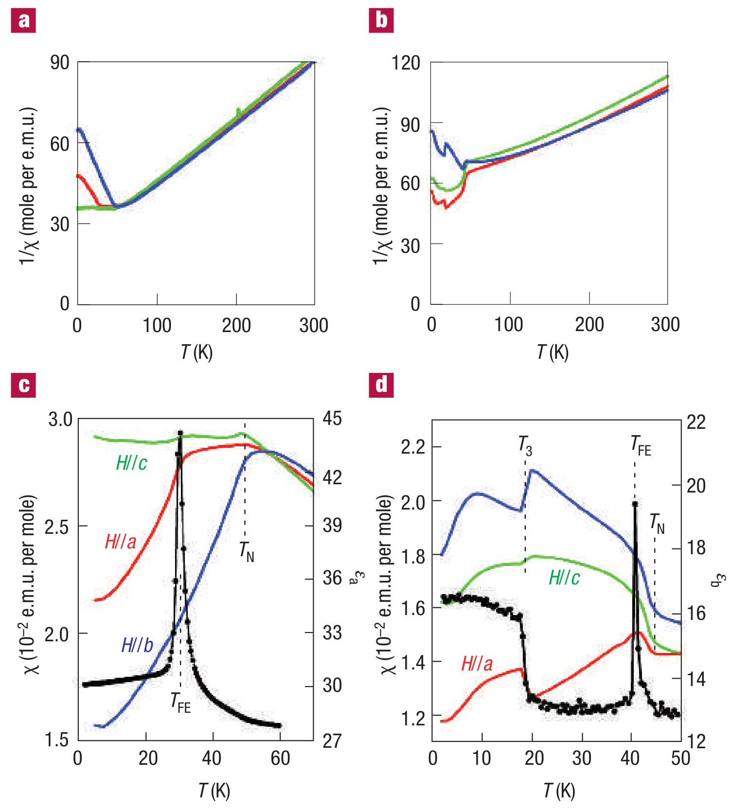
*   **来源**：[[../papers/cheongMultiferroicsMagneticTwist2007a]]
*   **图示描述**：期刊版面的题图或横幅装饰图，非论文正文科学图，raw/note 未对其作专门解析。
*   **关键特征**：无数据图轴与定量信息；仅作版式识别用途，不承载独立物理论断。

### 6. 图4 畴壁运动动力学路径：低能畴壁构型形成能 0.22 eV/单胞，移动能垒 0.40/0.28 eV per unit cell，远低于直接位移的0.85 eV
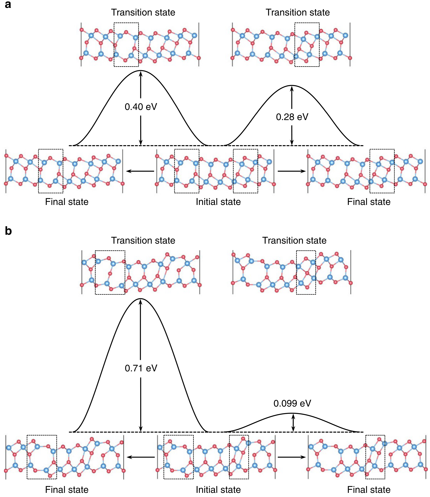
*   **来源**：[[../papers/dingPredictionIntrinsicTwodimensional2017a]]
*   **图示描述**：底部中央为含两个相反极化畴的初始超胞（黑色虚线方框标示畴壁位置），左右为畴壁移动后的终态，顶部为对应过渡态；(a,b)分别为低能和高能畴壁构型及其 CI-NEB 能量曲线。
*   **关键特征**：低能构型(a)中两畴壁总形成能为 0.22 eV/单胞，移动活化势垒分别为 0.40 eV/单胞和 0.28 eV/单胞；高能构型(b)形成能高达 1.45 eV/单胞（含 0.71、0.099 eV 等过渡态）；畴壁辅助反转势垒显著低于单畴直接位移的 0.85 eV/单胞。

### 7. 图3 多铁薄膜架构：交换耦合、应变耦合（3D传递型）与多铁界面、多铁畴壁（2D受限型）
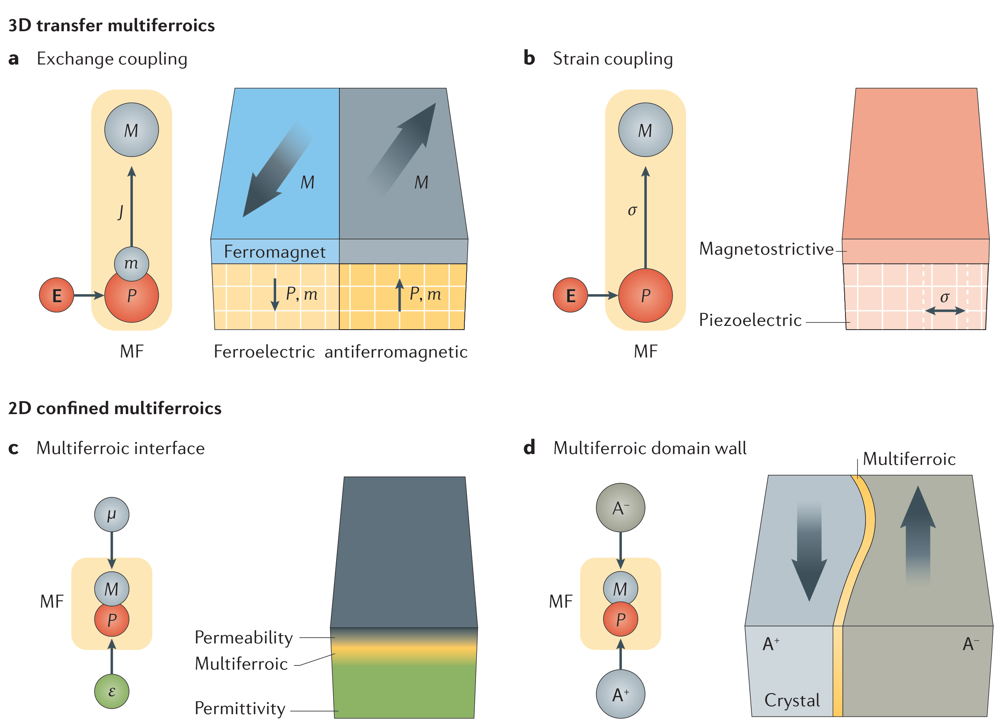
*   **来源**：[[../papers/fiebigEvolutionMultiferroics2016]]
*   **图示描述**：四种薄膜/异质结策略示意：(a) 交换耦合（FE/AFM多铁层/FM通过界面J传递）；(b) 应变耦合（压电↔磁致伸缩，应力σ传递）；(c) 多铁性仅存在于ε/μ两材料的二维界面；(d) 多铁性仅存在于单晶内部A⁺/A⁻畴之间的畴壁。
*   **关键特征**：(a)(b)属3D传递型，多铁性来自体相复合，BiFeO₃-CoFe已演示室温可重复电场翻转磁化；(c)(d)属2D受限型，多铁性由对称性破缺"凭空"出现在界面或畴壁；衬底外延应窗口约±0.1%可调。

### 8. 图4 I类与II类多铁中畴与畴壁的对比：II类中每个铁电畴壁必为磁畴壁
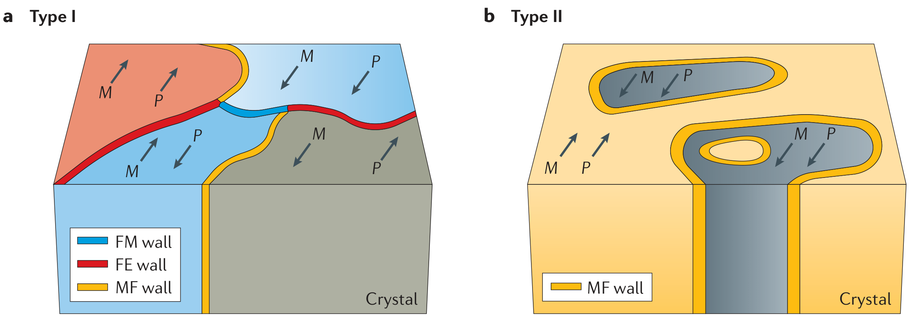
*   **来源**：[[../papers/fiebigEvolutionMultiferroics2016]]
*   **图示描述**：红线为铁电畴壁、蓝线为磁畴壁，对比I类（磁电独立）与II类（电由磁生）中两类畴壁的重合关系。
*   **关键特征**：I类中P畴与M畴图案可互不重合，畴壁各自独立；只有部分区域巧合重合才形成多铁畴壁（橙线）。II类中由于铁电由磁序诱导，对称性强制每一个铁电畴壁同时是磁畴壁，所有畴壁"天生"多铁。

### 9. 图5 晶胞中磁环矩（T=Σri×Si）、铁涡旋畴与磁单极子自旋排列
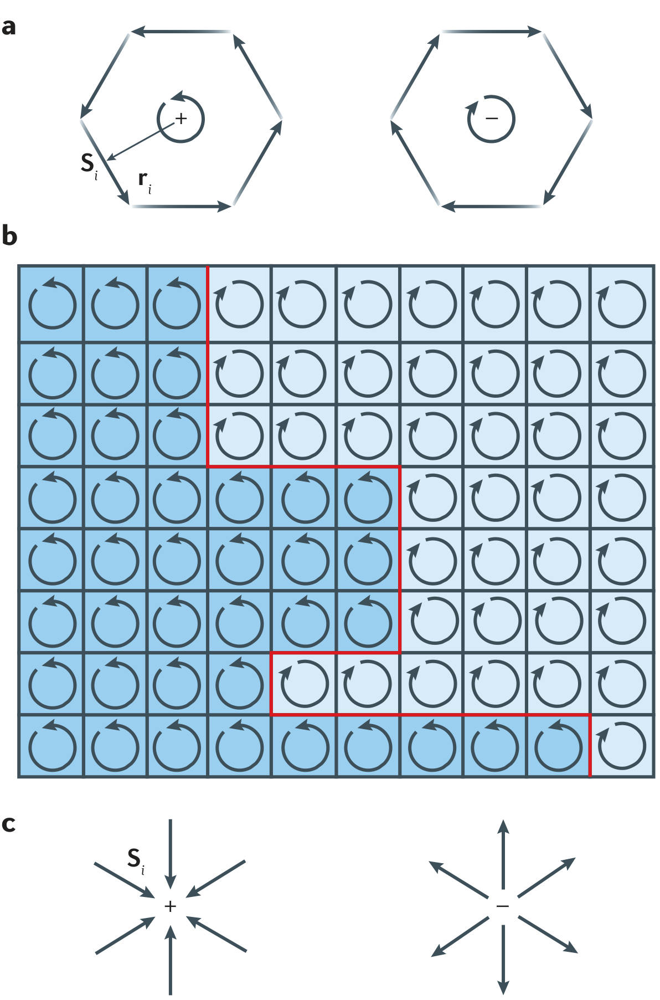
*   **来源**：[[../papers/fiebigEvolutionMultiferroics2016]]
*   **图示描述**：三个子图展示时空反演双破缺衍生的高阶自旋织构：(a) 晶胞内六自旋首尾相接形成涡旋，定义环矩T=Σᵢ rᵢ×Sᵢ；(b) 相反环矩取向构成铁涡旋畴结构；(c) 自旋由一点向外辐射或向内汇聚，呈磁单极准粒子排列。
*   **关键特征**：磁环矩同时破坏空间反演与时间反演，被提为继铁电、铁磁、铁弹之后第四种初级铁性序；LiCoPO₄中可用正交电磁场组合的环向场翻转畴；Cr₂O₃等体系最早展示相关NDD与磁电响应。

### 10. 应变调控畴壁构型

*   **来源**：[[../papers/gaoStrainEngineeringFerroelectric2024]]
*   **图示描述**：用 16×1 超胞（16 个单胞、80 个原子）模拟 60° 与 180° 畴壁，四个子图分别展示应变方向 (a) 垂直/平行于 60° 畴壁、(b) 与 60° 畴壁成 60°、(c) 垂直于 180° 畴壁、(d) 与 180° 畴壁成 60° 时畴壁构型的演化，红/蓝箭头表示两侧极化方向。
*   **关键特征**：120° 畴壁弛豫后自发转为 180° 畴壁（法向极化分量不连续积累束缚电荷、静电能较高）；60° 畴壁在应变垂直时 5% 内保持，平行时 3% 应变转为 180° 畴壁，成 60° 时 4% 应变近似单畴；180° 畴壁在平行时保持，垂直时 4% 转为 60° 畴壁，成 60° 时先 4% 转 60° 再 5% 转近似单畴。

### 11. 图1 双畴结构弛豫为涡旋畴壁
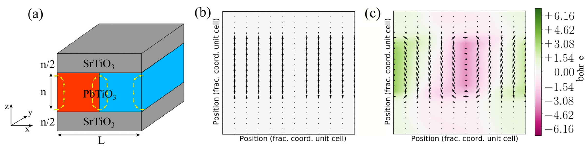
*   **来源**：[[../papers/gomez-ortizKittelLawDomain2023]]
*   **图示描述**：(a) 周期性边界下红/蓝双畴超胞示意；(b) 初始 180° Ising 构型，偶极矩在单个晶胞内沿 z 轴从向上突翻为向下；(c) 蒙特卡洛退火弛豫后的偶极矩地图，箭头为局域偶极矩、颜色为沿 y 向极化分量，畴壁处自发形成交替排列的顺时针/逆时针极性涡旋。
*   **关键特征**：畴壁厚度 δ≈1 u.c.，与后续 ω=L/2−1 的取法一致；涡旋轴垂直于堆叠方向（沿 y），核区出现面外（轴向）极化分量；该涡旋畴壁构型是 n=8–16 范围内的真实基态，而非理想 Ising 壁。

### 12. 图3 力常数谱分析
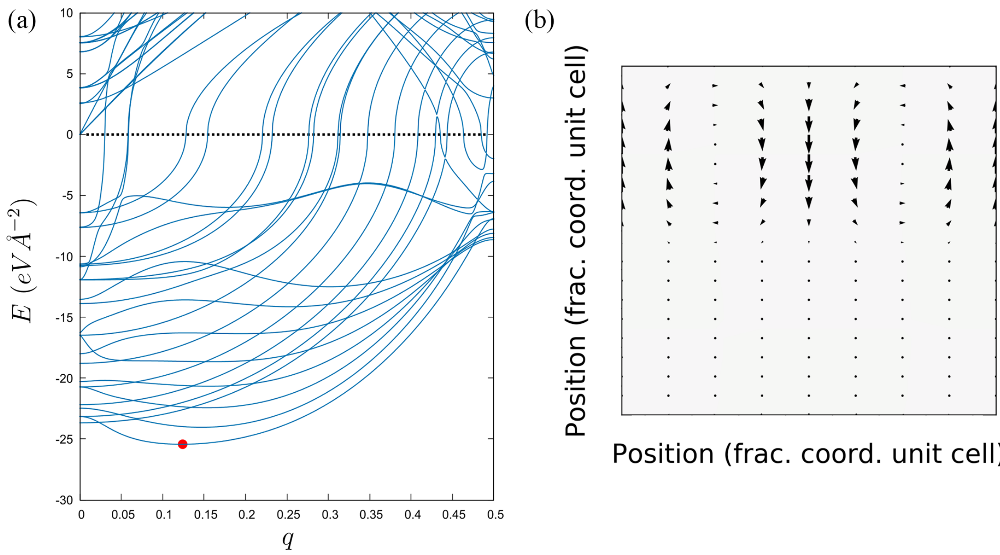
*   **来源**：[[../papers/gomez-ortizKittelLawDomain2023]]
*   **图示描述**：(a) (PbTiO₃)₉/(SrTiO₃)₉ 高对称参考态沿 Γ–X 的力常数带（本征值，负值代表不稳定模），虚线为中心对称参考能量，红点标示最强不稳定性；(b) 按该软模波矢冻结位移后的原子/偶极构型。
*   **关键特征**：最强不稳定模位于 q_min≈0.123（分数坐标）；据 ω=1/(2q)−1 独立预测最优畴宽，与图2 红点趋势一致但系统性偏窄；冻结所得涡旋中心严格位于 PbTiO₃ 层中心、无偏移，与图1(c) 含偏移和面内倾斜的全弛豫结构形成对照。

### 13. 图4 畴密度相竞争
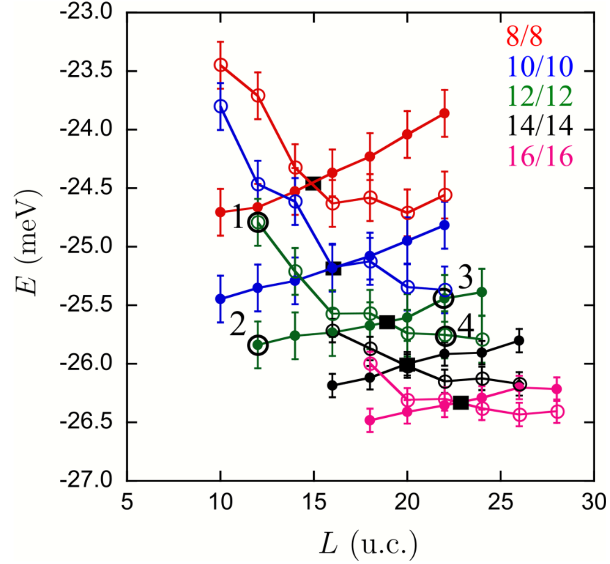
*   **来源**：[[../papers/gomez-ortizKittelLawDomain2023]]
*   **图示描述**：对各层厚 n，比较 2 畴（实心点）与 4 畴（空心点）构型每五原子单胞能量随横向尺寸 L 的变化；黑色实心方块标出两曲线交点即临界尺寸 Lc，数字 1–4 对应图5 具体构型。
*   **关键特征**：L<Lc 时 2 畴更稳定（畴壁数少、畴壁能惩罚主导）；L>Lc 时 4 畴更稳定（静电能惩罚主导，需引入更多畴壁屏蔽退极化场）；Lc 随 n 增大而增大。

### 14. 图5 不同L下极化构型
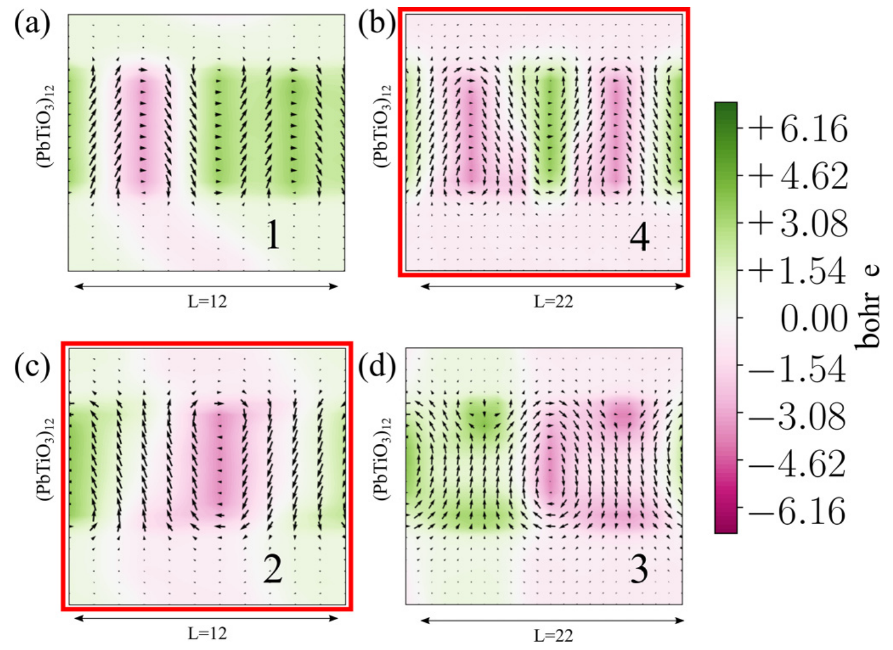
*   **来源**：[[../papers/gomez-ortizKittelLawDomain2023]]
*   **图示描述**：n=12 时四个代表性极化构型：L 较小的 4 畴亚稳态出现沿 [100]pc 的极化波、面内净极化及涡旋核向界面偏移；L≈Lc 附近为宽大 2 畴稳态；L>Lc 的 2 畴亚稳态在 PbTiO₃/SrTiO₃ 界面出现新生涡旋-反涡旋对；升温后由该亚稳态弛豫为规则 4 畴态。
*   **关键特征**：L 越小，相邻涡旋核偏移越大，无法居于 PbTiO₃ 层中心；界面新生涡旋/反涡旋对是新畴的成核点，可分割已有上/下极化区；在 T<50 K 该 2 畴亚稳态为长寿命相，升温至 ≥90 K 或施加 ≥−0.5% 压应变即可越过势垒形成新畴；反向（L<Lc 高畴密度极化波态）即使升温也无法弛豫到低密度畴。

### 15. 图6 涡旋-反涡旋复合动力学
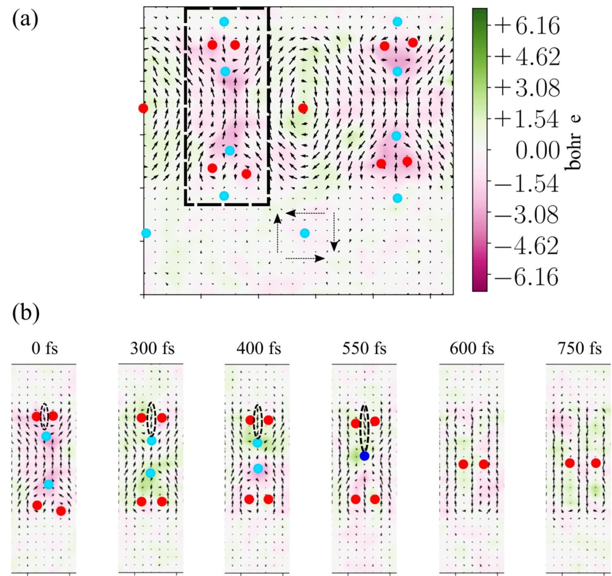
*   **来源**：[[../papers/gomez-ortizKittelLawDomain2023]]
*   **图示描述**：(a) n=14、L=28、T=90 K、−0.5% 压应变下的初始 2 畴亚稳态，虚线框标出待分析的上畴区域，上下界面各有两涡旋（红）一反涡旋（浅蓝）；(b) 该区域 0–600 fs 朗之万 MD 时间序列，深蓝点为涡度 −2 的双反涡旋，虚线椭圆标示向下极化单胞数随时间增加。
*   **关键特征**：0–550 fs 涡旋沿界面拉长、向下极化单胞从 3 个增至 4–5 个，反涡旋被推向 PbTiO₃ 层中心；约 550 fs 两反涡旋合并为涡度 −2 的高能双反涡旋（能量随涡度二次方增长，符合 Kosterlitz–Thouless XY 模型）；约 50 fs 内即与两涡旋湮灭，形成向下极化新畴及一对新的拉长顺/逆时针涡旋；反涡旋优先出现在极化幅度较小的 SrTiO₃ 层，净涡度为零符合周期性边界下的庞加莱–霍普夫定理。

### 16. 图6：畴工程四类结构（背栅PFM原位观测/应变区畴壁合并/孤立单畴壁-周期三角畴-多畴壁交联-完全位错畴及各自电滞回线）

*   **来源**：[[../papers/guoAdvancesTwodimensionalFerroelectric2025]]
*   **图示描述**：(a) 背栅电场下用 PFM 原位观测 R-MoSe₂ 畴壁移动的器件示意和振幅图（比例尺 300 nm）；(b,c) 应变积累区相邻畴壁合并形成完全螺旋错位结构的 PFM 图像；(d-g) 四类典型畴结构示意图及对应电滞回线：孤立单畴壁、周期三角莫尔畴、多畴壁交联、完全位错畴。
*   **关键特征**：(i) 孤立单畴壁——外场驱动畴壁整体移动触发全域反转，显著双极回线，适合高性能非易失存储；(ii) 周期三角莫尔畴——C3 对称性钉扎节点，仅靠畴面积弹性缩放实现弱迟滞、线性多态响应；(iii) 多畴壁交联——缺陷/污染引入额外钉扎，极化反转效率极低；(iv) 完全位错畴——位错网络锁死极化方向，翻转需 >1 V/nm，无电滞响应。

### 17. 极性拓扑结构示意图：畴壁、通量闭合畴、涡旋、反涡旋、半子（刺猬型/涡旋型）、斯格明子（Néel/Bloch型）
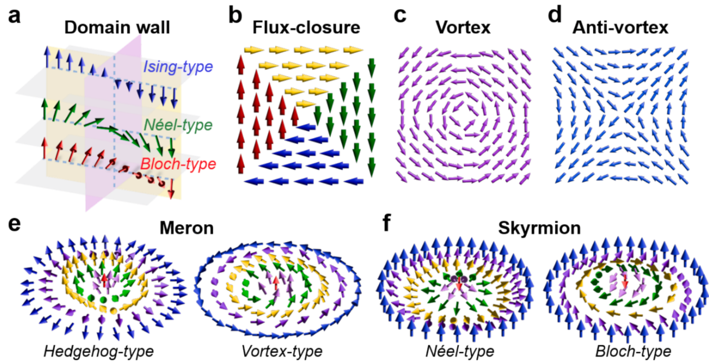
*   **来源**：[[../papers/hanPolarTopologicalMaterials2025]]
*   **图示描述**：以彩色极化箭头定义六类基本极性拓扑：(a) 畴壁、(b) 通量闭合畴、(c) 涡旋、(d) 反涡旋、(e) 半子（刺猬型/涡旋型）、(f) 斯格明子（Néel 型/Bloch 型）。
*   **关键特征**：通量闭合畴中极化矢量首尾相连形成闭合回路；涡旋环绕核心旋转，按核心面外分量分为手性/非手性；反涡旋与涡旋成对出现、拓扑荷相反；半子核心带面外极化；斯格明子核心与外围极化反向、过渡区为面内极化。

### 18. 典型铁电材料各向异性：四方/菱方相极化变体、有机分子取向、Bloch型畴壁、各向异性对Landau能势垒的平坦化
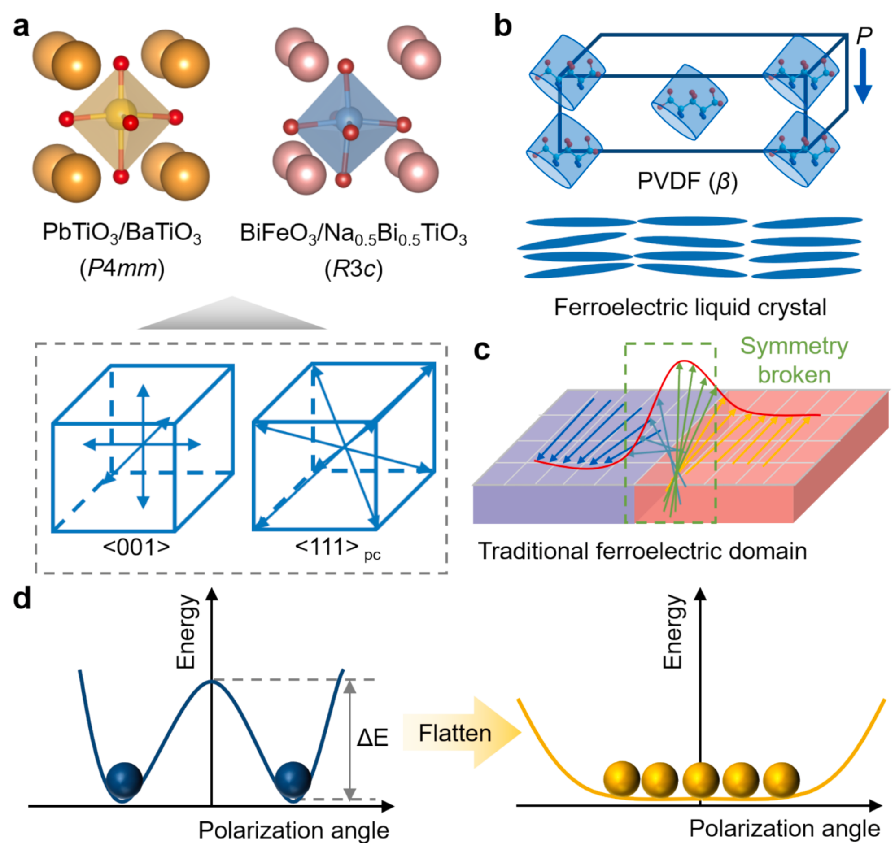
*   **来源**：[[../papers/hanPolarTopologicalMaterials2025]]
*   **图示描述**：(a) 四方相与菱方相无机铁电体的极化变体对比；(b) 有机分子链取向柔性；(c) Bloch 型畴壁中极化在畴壁平面内旋转；(d) 通过调控各向异性平坦化 Landau 自由能势阱、降低极化旋转能垒的核心概念图。
*   **关键特征**：四方相沿 <100>、菱方相沿 <111> 给出有限的极化变体；有机分子链允许更连续的取向；降低各向异性可使 Landau 势阱变浅、可访问极化态数量增加。

### 19. 本征静电能调控：退极化场驱动单畴→条带畴→通量闭合畴→涡旋畴的演化；La掺杂BFO纳米岛带电畴壁→中性畴壁涡旋；挠曲电场
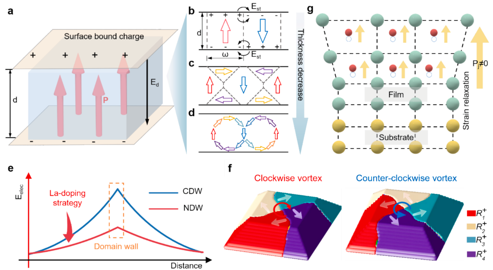
*   **来源**：[[../papers/hanPolarTopologicalMaterials2025]]
*   **图示描述**：(a–d) 退极化场作用下畴结构从单畴→条带畴→通量闭合畴→涡旋畴的逐步演化示意（d 为薄膜厚度、ω 为畴尺寸）；(e) La 掺杂 BFO 纳米岛中通过降低缺陷载流子浓度，将带电畴壁顶点畴转变为 71° 中性畴壁涡旋畴；并展示挠曲电场贡献。
*   **关键特征**：随厚度 d 减小/退极化场增强，极化以连续旋转降低静电能；La³⁺ 取代 A 位减少屏蔽电荷，使十字形带电畴壁被中性畴壁替代并自发形成涡旋；挠曲电场在应变梯度处提供额外旋转驱动力。

### 20. 铁电异质结中的极性拓扑：可变静电/弹性边界的异质结示意图；DyScO3衬底上PTO/STO超晶格的周期性拓扑相图（c畴→通量闭合→涡旋→a畴）
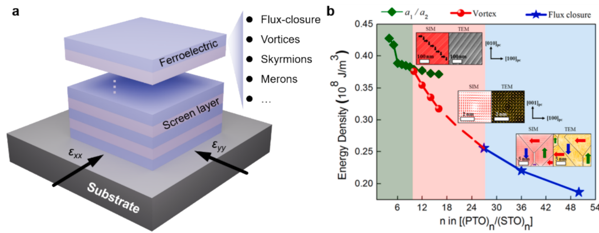
*   **来源**：[[../papers/hanPolarTopologicalMaterials2025]]
*   **图示描述**：(a) 具有可变静电、弹性等边界条件的铁电/介电异质结示意；(b) DyScO₃ 衬底上 (PTO)n/(STO)n 超晶格随周期 n 变化的畴结构拓扑相图。
*   **关键特征**：PTO 为位移型铁电层、STO 为绝缘介电层并引入强退极化与界面耦合；随 n 减小依次出现 c 畴→通量闭合畴→涡旋→a₁/a₂ 畴；DSO 衬底约 1.2% 拉伸应变下涡旋对阵列周期约 9–10 nm；换衬底可得到斯格明子泡、偶极波、半子晶格、布洛赫点等。

### 21. 多场操控：HAADF-STEM实时观测PTO/STO涡旋→波→极化向下；BFO纳米岛电场诱导中心↔涡旋相变；P(VDF-TrFE)力/电螺旋旋转；光脉冲/热致3D超晶相
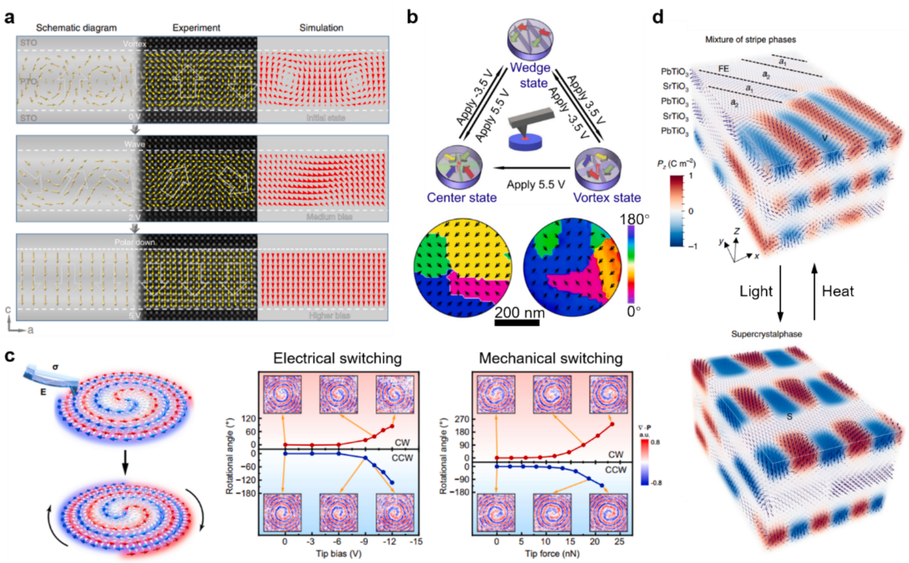
*   **来源**：[[../papers/hanPolarTopologicalMaterials2025]]
*   **图示描述**：(a) 原子分辨 HAADF-STEM 实时观测 PTO/STO 超晶格在外电场下涡旋→波→单畴（极化向下）的转变；(b) BFO 纳米岛在 SPM 电场下中心畴↔涡旋畴的可逆、非易失性 PFM 图与相场模拟；(c) P(VDF-TrFE) 中极性螺旋在机械/电场下集体旋转；(d) PTO/STO 中亚皮秒光脉冲与加热驱动铁电畴、涡旋、三维超晶相之间转变的相场结果。
*   **关键特征**：STEM 比例尺 2 nm；连续膜中电场诱导相变多为易失，纳米岛中可非易失；机械力通过挠曲电/压电/铁弹翻转有机螺旋；光脉冲可创建三维涡旋超晶相，τ 为弛豫时间；升温还可驱动涡旋→波→c 畴及类 KT 相变。

### 22. 电阻特性：BFO纳米岛十字形带电畴壁巨电导及±3V百次循环；导电畴壁通断实现NOT门；自支撑PTO/STO双层类斯格明子畴±5V可逆阻变（>200 Gbit/in²）
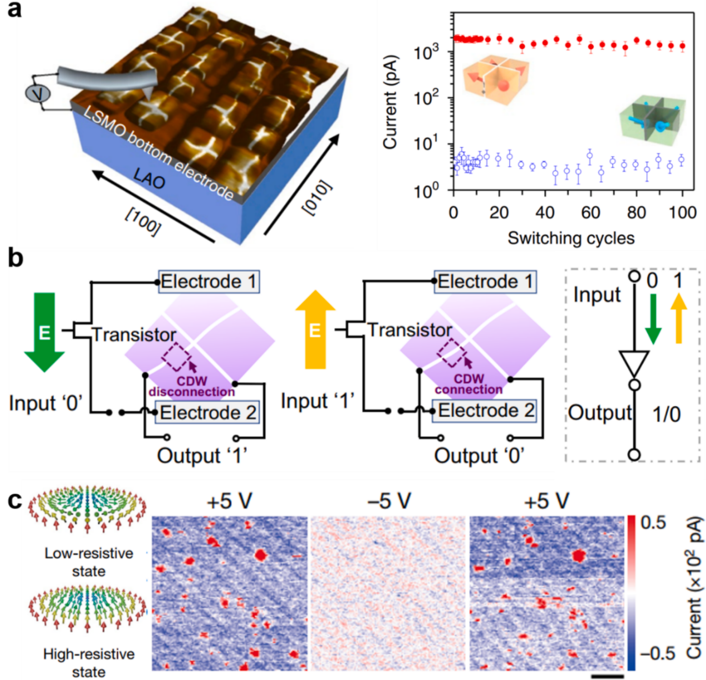
*   **来源**：[[../papers/hanPolarTopologicalMaterials2025]]
*   **图示描述**：(a) c-AFM 测试示意与电流分布图，显示 BFO 纳米岛十字形带电畴壁处的巨大电导；(b) 通过电场控制畴壁通断实现 NOT 等逻辑门；(c) 自支撑 PTO/STO 双层中类斯格明子畴在 ±5 V 下可逆阻变。
*   **关键特征**：中心发散态下"头对头"→"尾对尾"畴壁转变使电导提升约 3 个数量级；±3 V 循环可超 100 次；逻辑门能耗约 3.9 aJ、速度约 20 ns；类斯格明子存储密度 >200 Gbit/in²，3.2 nm 构型理论极限接近 60,000 Gbit/in²；图标尺 50 nm。

### 23. 图3 弯曲h-BN中的极化纹理：(a)31°扭结为Néel型畴壁（SP堆垛核心，极化面内旋转），(b)57°扭结为Ising型畴壁（AA堆垛核心，极化过零反向），(c)AB→SP→BA→AA→AB循环切换示意
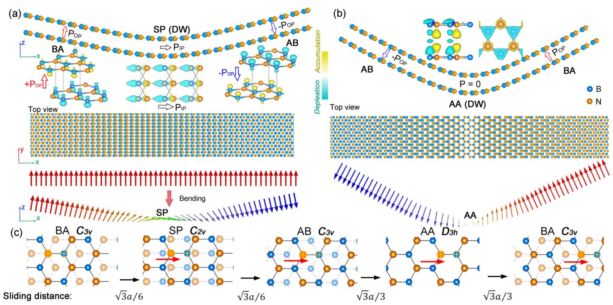
*   **来源**：[[../papers/heSwitchingTwodimensionalSliding2025]]
*   **图示描述**：图3在扭结原子结构上叠加极化矢量箭头，(a)(b) 分别给出 31° 和 57° 扭结的侧视/顶视图及极化分布，(c) 为 AB→SP→BA→AA→AB 循环堆垛切换的概念示意。
*   **关键特征**：31° 扭结以 SP 堆垛为核心，构成 Néel 型畴壁——极化大小基本不变、方向在面内平滑旋转 180°，畴壁中心极化完全位于面内；57° 扭结以 AA 堆垛为核心，构成 Ising 型畴壁——极化在中心降为零后再反向长出；两类畴壁均可把面外极化从向上翻为向下，且几乎不伴随离子垂直位移。

### 24. 图5 四种畴壁的原子结构与极化分布：0°布洛赫型、90°奈尔型，宽度9.7-40.7 nm
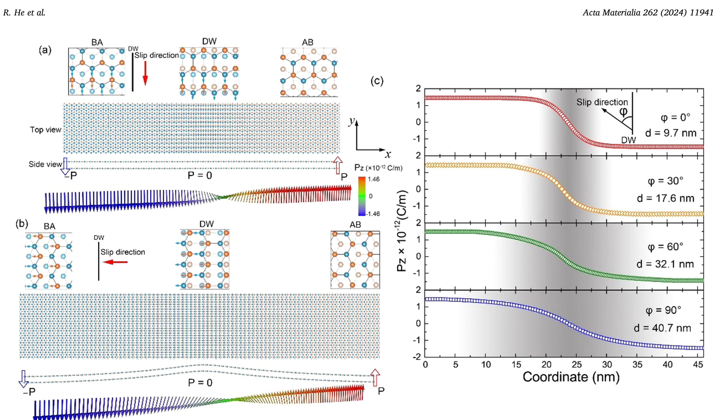
*   **来源**：[[../papers/heUltrafastSwitchingDynamics2024]]
*   **图示描述**：(a)0°畴壁与(b)90°畴壁的原子结构放大图；(c)四种畴壁(0°、30°、60°、90°)局域面外极化Pz沿垂直畴壁方向的分布剖面，灰色阴影标示极化梯度核心区。
*   **关键特征**：0°畴壁保持平面并呈布洛赫型纹理；90°畴壁出现明显面外屈曲(buckling)并呈奈尔型纹理；畴壁中心为纯面内极化1.38×10⁻¹² C/m，与单畴Pz相差<5%；宽度随夹角φ单调增加：9.7、17.6、32.1、40.7 nm，比钙钛矿铁电体(~0.7 nm)大约一个数量级。

### 25. 图6 300 K下畴壁运动动力学快照：9 ps内两畴壁湮灭实现翻转
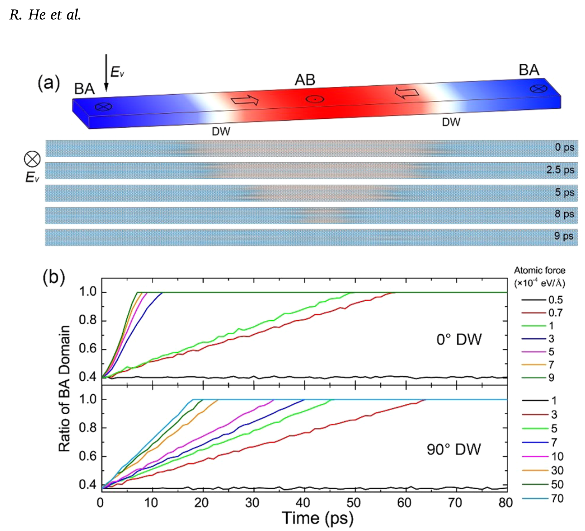
*   **来源**：[[../papers/heUltrafastSwitchingDynamics2024]]
*   **图示描述**：300 K下畴壁运动的时间分辨DPMD模拟。(a)t=0施加Fs=5×10⁻⁴ eV/Å(Ev≈0.18 V/nm)后两个0°畴壁在0、2.5、5、8、9 ps的铁电纹理快照；(b)不同剪切力下AB/BA畴尺寸随时间的演化(含0°与90°畴壁)。
*   **关键特征**：两畴壁以类孤子方式相向运动，约9 ps后湮灭为单畴；Fs<7×10⁻⁵ eV/Å时畴壁被内禀钉扎、不动；超过临界力后畴尺寸线性增长，对应0.18 V/nm下匀速~6000 m/s；0°与90°畴壁临界Fs分别为7×10⁻⁵、3×10⁻⁴ eV/Å(对应Ev=0.026、0.11 V/nm)。

### 26. 图8 氮空位对畴壁的钉扎能垒（约50 meV）
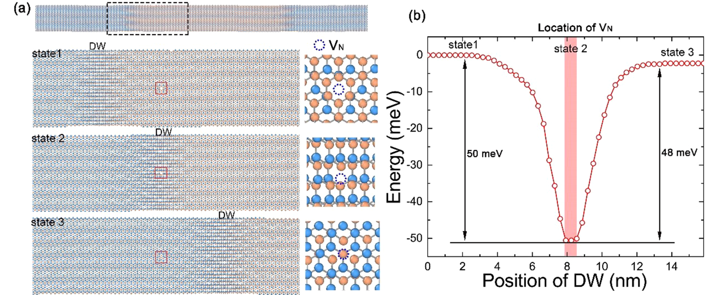
*   **来源**：[[../papers/heUltrafastSwitchingDynamics2024]]
*   **图示描述**：(a)含单个氮空位(VN)及不同位置0°畴壁的31,810原子超胞；(b)DP预测的0°畴壁接近并远离VN过程中的能量变化曲线。
*   **关键特征**：能量曲线在VN位置出现深约50 meV的捕获势阱；畴壁被空位捕获，需额外约50 meV能量才能脱钉；少量VN即可阻碍畴壁自由运动。

### 27. 图4 平面DF-TEM中Td极性畴、电子束操控畴壁、DFT势能面与低能垒翻转路径、群-子群关系
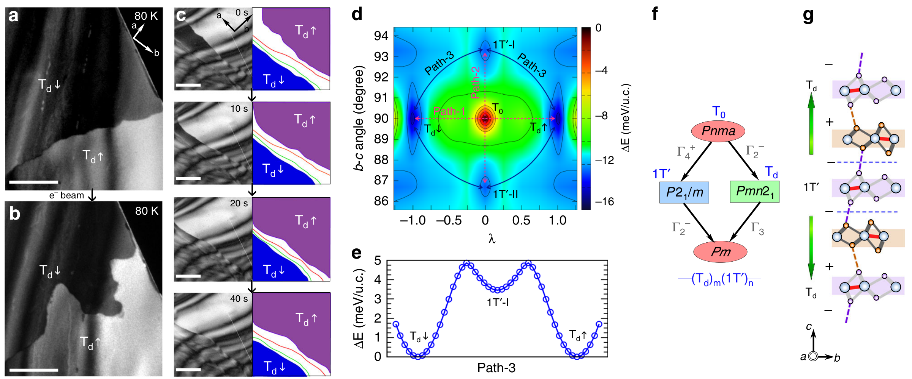
*   **来源**：[[../papers/huangPolarPhaseDomain2019]]
*   **图示描述**：(a–b) 80 K 平面 DF-TEM，电子束辐照前后明暗衬度对应 Td↑（亮）与 Td↓（暗）极性畴，辐照后暗畴缩小、畴壁移动；(c) 原位视频截图，彩色线条勾勒多条畴壁，紫/蓝阴影标示 Td↑/Td↓ 主导区，显示逐层滑移/相翻转过程；(d) DFT 势能面等高线，横轴为层间位移 λ、纵轴为 b–c 夹角，四个极小值对应 Td↑、Td↓、1T′-I、1T′-II，T₀ 为高能鞍点；(e) 沿 path-3 的能量剖面，Td↑→Td↓ 经 1T′ 中间态；(f) T₀、1T′、Td 的群-子群家谱，Pm 为共同子群；(g) Td↑/Td↓ 畴壁模型，桥接单元恰为一个 1T′ 单元。
*   **关键特征**：λ=±0.5 Å 双阱对应 Td↑/Td↓；b–c 角 86.4°/93.6° 双阱对应 1T′-I/II，与实验 93.5°–93.9° 吻合；直接 Td↑→Td↓（path-1）能垒 16.9 meV/u.c.、直接 1T′-I→1T′-II（path-2）13.5 meV/u.c.，而经 1T′ 中间态的 path-3 能垒仅约 5 meV/u.c.；散开聚焦束后畴壁形貌恢复，排除大量 Te 损失或 knock-on 损伤。

### 28. 图7

*   **来源**：[[../papers/huangTwodimensionalIn2Se3Rising2022]]
*   **图示描述**：(A–C) 室温下 β′（β0）相的低能电子显微镜（LEEM）图像与微区低能电子衍射（μ-LEED）斑点；(D–G) 升降温过程中单个 IP 铁电畴的实时 LEEM 演化。
*   **关键特征**：室温可见三种取向的面内铁电畴，衍射斑点出现约九倍于原胞周期的超结构亚点；升温时畴宽在约 195 °C 急剧收缩、约 204 °C 完全消失，对应 β′→β 顺电转变，即居里温度 Tc 约 200 °C；降温时畴在原位重新成核、畴壁重建，表现出记忆效应。

### 29. 图4 剪切应变ε_xy下三变体能量分化，可选择性切换O2/O3
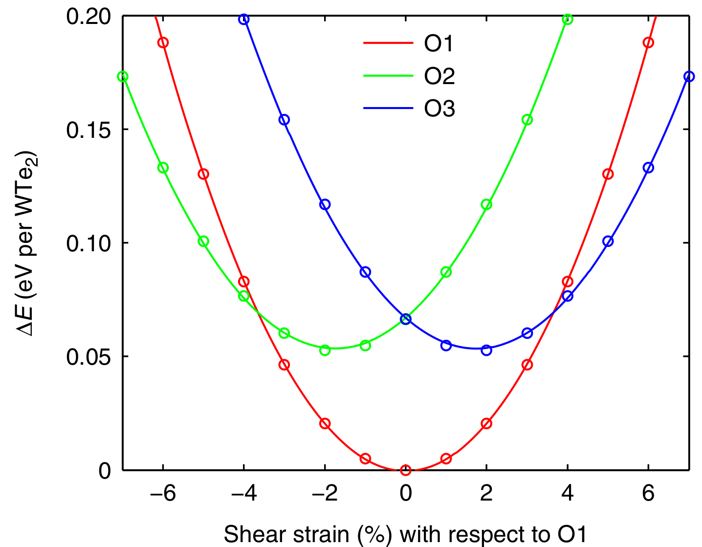
*   **来源**：[[../papers/liFerroelasticityDomainPhysics2016]]
*   **图示描述**：横轴为施加在 O1 参考超胞上的剪切应变 ε_xy（%），纵轴为相对于 O1 的能量差（eV/WTe₂），O1 能量为基准线，O2、O3 能量曲线分别随正、负剪切应变下降。
*   **关键特征**：约 ±3.5% 的剪切应变即可使 O3（正剪切）或 O2（负剪切）成为最低能变体，打破双轴应变下 O2/O3 的镜像简并；这为通过特定应力模式"畴工程"选择性地稳定某一变体提供了理论依据。

### 30. 图7 O1-O2/O1-O3/O2-O3三种DFT弛豫准一维铁弹畴壁原子结构
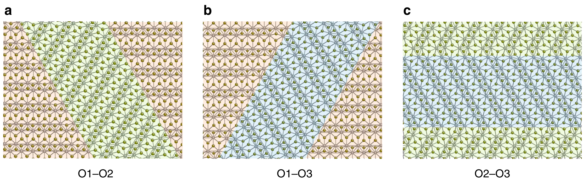
*   **来源**：[[../papers/liFerroelasticityDomainPhysics2016]]
*   **图示描述**：(a–c) 分别为零外应力下 O1–O2、O1–O3、O2–O3 三种共格孪晶界（畴壁）的 DFT 弛豫原子结构，不同变体区域用不同颜色阴影（橙、绿、蓝）叠加标识，畴壁处原子重排实现两相间的平滑过渡。
*   **关键特征**：三种畴壁由 120° 旋转对称相互联系、能量简并；在二维体系中畴壁是准一维线缺陷，而非三维体系中的二维界面；DFT 畴壁形成能为 MoS₂ 27、MoSe₂ 46、MoTe₂ 40、WS₂ 22、WSe₂ 51、WTe₂ 52 meV·Å⁻¹，远低于三维位错形成能（数百 meV/Å），保证畴壁在外力下可滑移。

### 31. Fig. 4 1T′-WTe2 铁弹取向变体与 SnTe 面内铁电
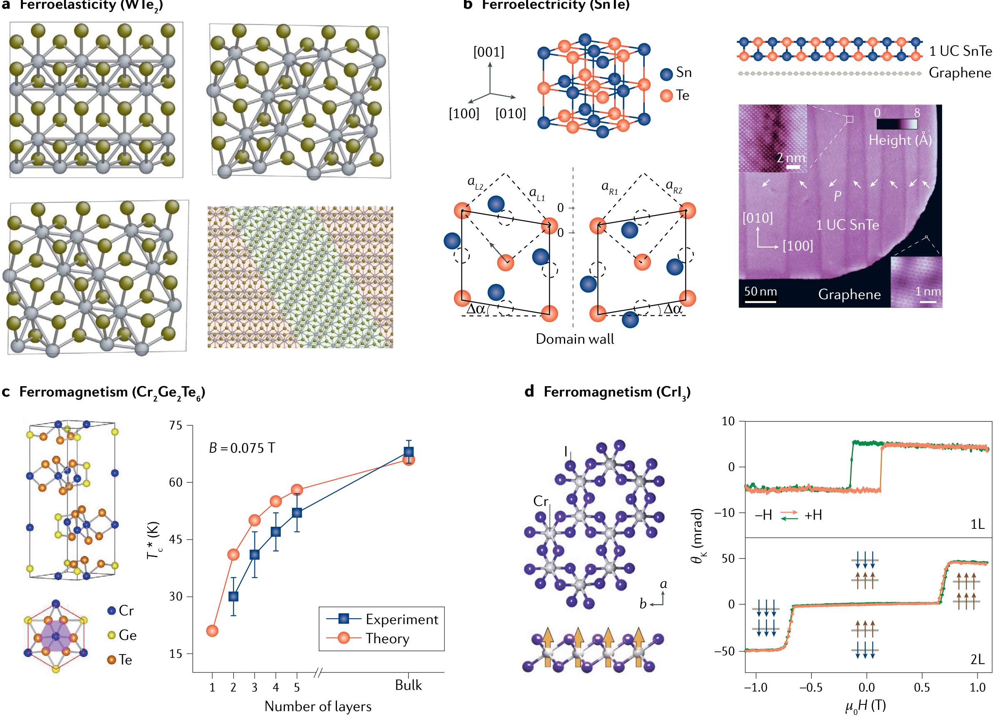
*   **来源**：[[../papers/liPhaseTransitions2D2021]]
*   **图示描述**：左面板（a）为单层 1T′-WTe2 的三个对称等价取向变体及其之间的畴界原子模型，右面板（b）为原子级厚度 SnTe 的晶体结构示意与 STM 图像，显示面内铁电畴（紫色区域）与清晰的畴壁。
*   **关键特征**：1T′-WTe2 的三个取向变体相对母相 1T 略有不同的自发应变，可通过外应力在变体间切换，切换应变达几个百分点；SnTe 在原子级厚度下仍保持鲁棒的面内极化，铁电转变温度约 270 K，证明二维极限下退极化场并未杀死铁电序；以面内极化和面内/面外极化互锁等方式逃逸维度限制。

### 32. 图3 热学性质：PbZr0.95Ti0.05O3电卡ΔT>12 K；热释电本征/外禀/次级贡献解耦；BaTiO3单晶直接vs间接电卡测量对比；PZT中电场可逆调控热导率~11%
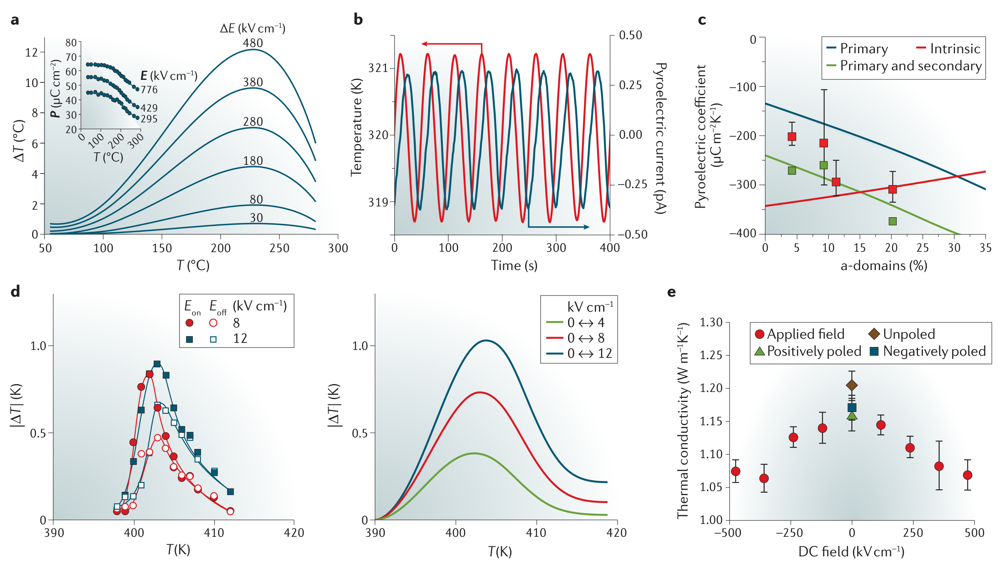
*   **来源**：[[../papers/martinThinfilmFerroelectricMaterials2016]]
*   **图示描述**：由 a–e 五个子图构成铁电薄膜热学响应的测量与机制分解。a 图为 PbZr₀.₉₅Ti₀.₀₅O₃ 薄膜的电卡温变 ΔT（K）随温度曲线，插图为不同电场下 P(T)（μC/cm² vs °C）；b、c 图为锁相法测得的热释电电流（pA）对调制温度（K）信号，并将热释电系数（μC·m⁻²·K⁻¹）分解为本征、外禀（畴壁）与次级贡献；d 图为 BaTiO₃ 单晶直接测量（左）与由 Maxwell 关系间接推算（右）的电卡 ΔT 对比；e 图为 PbZr₀.₃Ti₀.₇O₃ 热导率 κ（W·m⁻¹·K⁻¹）随直流电场 E_on（kV/cm）的变化。
*   **关键特征**：a 图中居里点附近 ΔT > 12 K，是固态制冷的代表性巨电卡响应；c 图定量区分了畴内本征极化、畴壁运动（外禀）和热膨胀经逆压电贡献（次级）三项，说明在薄膜中不能只计本征；d 图揭示直接与间接测量在块体中相近，但在受夹持薄膜中差异显著，间接法须谨慎处理弹性边界条件否则易高估；e 图中加电场移动畴壁使热导率可逆下降约 11%，源于畴壁作为声子散射中心的 Kapitza 热阻。

### 33. 图4 器件应用：BiFeO3中109°畴壁的c-AFM导电证据；负电容双阱势能与C=d²U/dQ²<0示意；DFT计算LiNbO3上石墨烯n/p型掺杂；拉曼G峰空间成像显示载流子调制
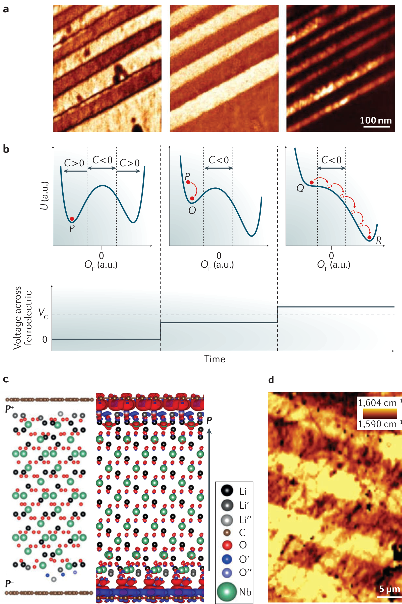
*   **来源**：[[../papers/martinThinfilmFerroelectricMaterials2016]]
*   **图示描述**：a 图并列 BiFeO₃ 的垂直 PFM 振幅、相位像与同一视场的导电 AFM（c-AFM）电流图；b 图为铁电自由能 U(Q) 双阱曲线，标出势垒顶部 C = d²U/dQ² < 0 的负电容区间及与常规介电层串联的稳定方案；c 图为石墨烯置于 LiNbO₃ 两种极化表面（P↑、P↓）上的 DFT 原子结构与电子结构计算；d 图为石墨烯/周期性极化 LiNbO₃ 异质结的拉曼 G 峰频率（cm⁻¹）空间扫描图。
*   **关键特征**：a 图中 c-AFM 电流严格沿 109° 畴壁分布而畴内绝缘，证明畴壁导电源于静电势台阶抬升载流子密度并使畴壁内带隙减小，且畴壁曲率可致电导率变化约 500%、多铁中导电畴壁磁电阻约 60%；b 图说明把铁电体接入 FET 栅极可在内部放大栅压，有望突破室温 60 mV/decade 的亚阈值摆幅极限，PbZr₀.₂Ti₀.₈O₃/SrTiO₃ 双层中复合电容大于 SrTiO₃ 电容及时域翻转分析已给出瞬态负电容证据；c、d 图中 P↑ 表面诱导石墨烯 n 型掺杂、P↓ 诱导 p 型掺杂，180° 畴壁处写入空间势台阶，在空气中实现周期性 p–i（可调 p–n）结阵列，铁电隧道结隧穿电阻变化 > 6×10⁵%。

### 34. 图1：8 nm 厚 BFO 薄膜在 10 K 下 71° 条带畴的局域软模 u_i 与 AFD 矢量 ξ_i 实空间快照，表面形成涡旋磁通闭合
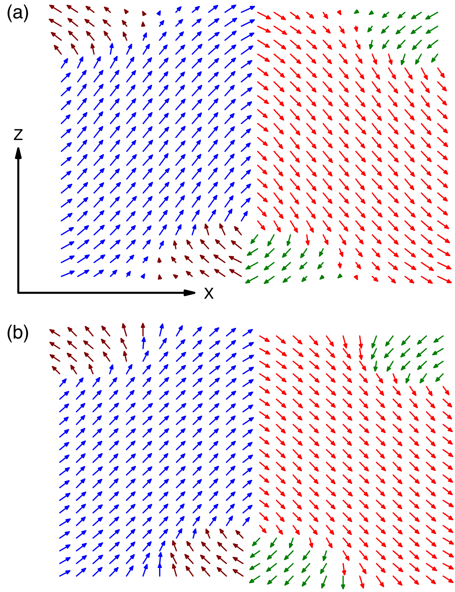
*   **来源**：[[../papers/prosandeevKittelLawInBiFeO3Ultrathin2010]]
*   **图示描述**：8 nm 厚、1.5% 压应变的 (001) BFO 超薄膜在 10 K 蒙特卡洛平衡态下的 (X,Z) 截面矢量图；(a) 箭头为局域软模 u_i（即局域铁电偶极方向与大小），(b) 箭头为反铁畸变矢量 ξ_i=ω_i e^{ik·r_i}（氧八面体倾斜轴与倾角）。
*   **关键特征**：沿 [100] 交替出现"上/下"71° 纳米条带畴；畴内（远离上下各 4 层 (001) B 层）u_i 与 ξ_i 共同沿 [uuv]（up，v>u）或 [uu-v̄]（down）取向，方向一致来自压应变；上下表面四层内 u_i 与 ξ_i 卷曲形成 flux-closure 涡旋，无净面外极化以消除退极化场；每个畴内除 G 型反铁磁外还存在约 0.03 μ_B 的弱铁磁矢量，方向在 up/down 畴间翻转（倾向垂直 ξ_i）。

### 35. 图2：(a) 总能-畴周期拟合 e_tot=e0+Aw+C/w；(b) AFD短程能 ∝1/w；(c) 电偶极与磁电耦合能 ∝w；(d) w_e²-h 线性关系；(e) 1/A∝h；(f) C≈常数
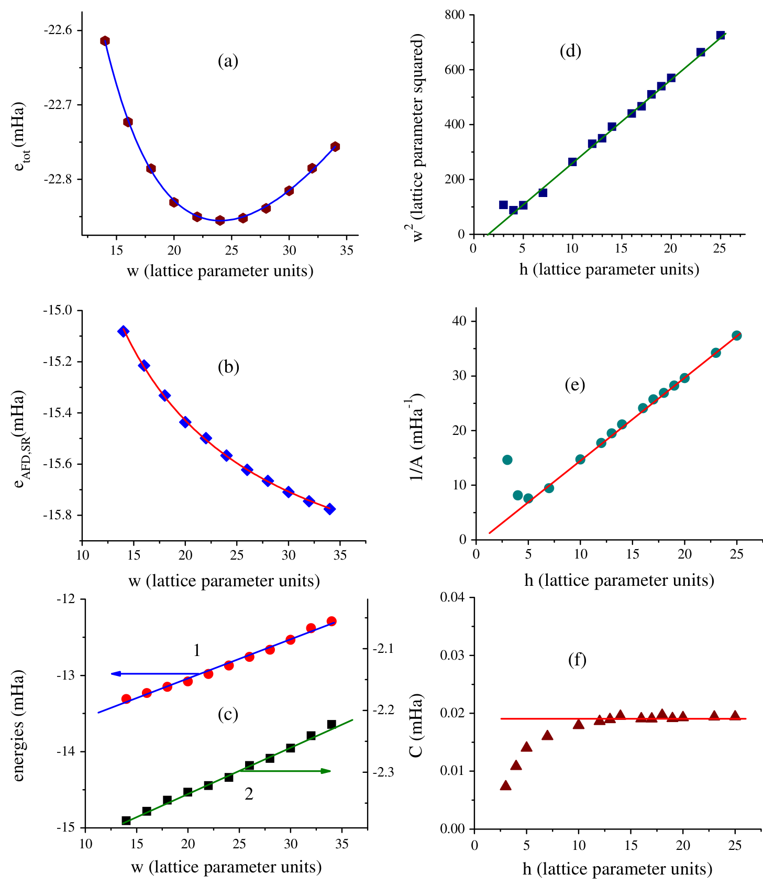
*   **来源**：[[../papers/prosandeevKittelLawInBiFeO3Ultrathin2010]]
*   **图示描述**：揭示 Kittel 定律及其微观起源的六联图；(a) h=20 薄膜每 5 原子胞总内能 e_tot（mHa）对畴周期 w（晶格常数）的散点与 e_tot=e0+Aw+C/w 拟合；(b)–(c) 分项能量密度对 w 的依赖；(d)–(f) 平衡畴周期及拟合系数对膜厚 h 的依赖。
*   **关键特征**：(a) 散点呈碗形且被公式(2)精确拟合，最低点即 w_e；(b) AFD 短程相互作用能密度 e_AFD,SR 随 1/w 下降，是 C/w 项主因（约为短程偶极能代价的两倍，短程偶极的正 1/w 贡献被电偶极局域自能的负 1/w 几乎抵消）；(c) 电偶极-偶极长程能与磁电耦合能（公式(1)含 E_ij 项）均随 w 线性增长，构成 Aw 项；(d) h>5（约 20 Å）时 w_e²∝h，斜率约 31（以 5 原子胞晶格常数为单位，PZT 对比值约 20），h<3 时条带畴消失、h=1 转为纯 AFD 态；(e) h>5 时 1/A∝h，即 A=A0/(h−h0)，h0≈1.5 晶格常数；(f) C≈C0 与厚度无关；由 w_e=√(C/A)=√(C0(h−h0)/A0) 给出 w_e∝√h，且 C0/A0≈31 与 (d) 斜率自洽。

### 36. 图3：h=20 薄膜平衡周期下关键能量的逐点实空间分布：(a) AFD短程能集中在畴壁；(b) 电偶极长程能集中在表面畴内部；(c) 磁电耦合能同样集中在表面远离畴壁处
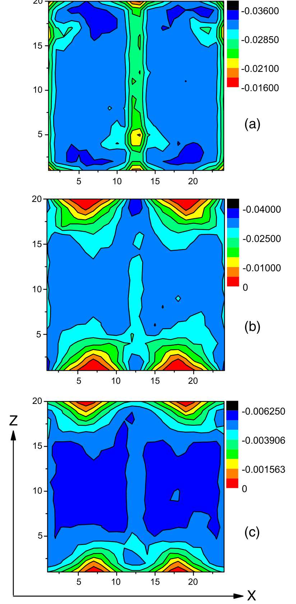
*   **来源**：[[../papers/prosandeevKittelLawInBiFeO3Ultrathin2010]]
*   **图示描述**：h=20 薄膜在平衡畴周期 w_e 下的 (X,Z) 截面逐点能量密度热图，亮色代表能量代价高；(a) AFD 短程相互作用能、(b) 电偶极-偶极长程相互作用能、(c) 磁电耦合相互作用能。
*   **关键特征**：(a) e_AFD,SR 高值贯穿整个膜厚、强烈局域在畴壁处，微观解释了其 1/w 依赖（畴壁密度 ∝1/w）；(b) 电偶极长程能高值集中在上下表面、远离畴壁的畴内部，对应 Kittel 模型的杂散场/退极化场；(c) 磁电耦合能同样集中在表面远离畴壁处，原因是表面局域电偶极幅度最小（见图1(a)），从而改变 E_ij 耦合代价。

### 37. 图2 PFM观测到的反平行铁电畴（20–50 nm），振幅暗线对应畴壁，相位差约180°
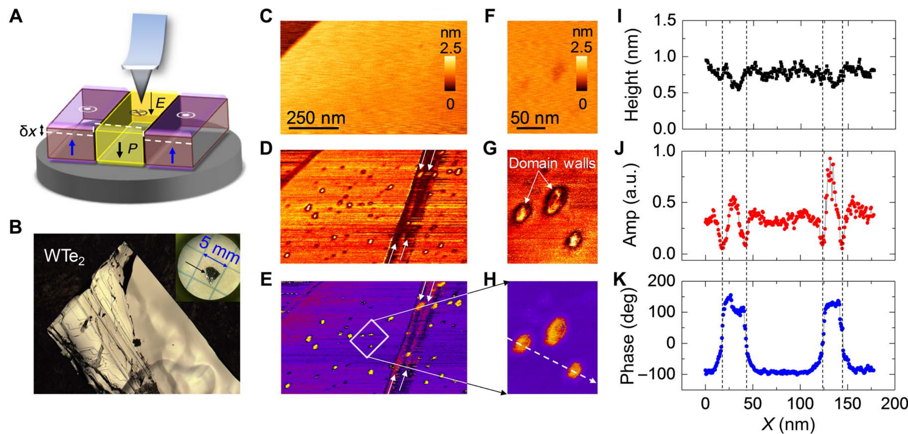
*   **来源**：[[../papers/sharmaRoomtemperatureFerroelectricSemimetal2019]]
*   **图示描述**：图2为PFM对新鲜解理块体WTe₂表面的畴成像：A为PFM原理示意（导电探针施加交流电压，通过逆压电效应探测局域形变）；C-H分别为形貌、PFM振幅与相位图（两组视野）；I-K为沿H中虚线的高度、振幅、相位截面轮廓，单位分别为nm、pm、°。
*   **关键特征**：形貌图显示表面原子级平整，RMS粗糙度约0.2 nm；振幅图中亮区为强压电响应、暗线为响应极弱的畴壁；相位图中相邻畴衬度接近180°，分别对应极化向上/向下的反平行畴；畴尺寸约20–50 nm，呈扭曲椭圆/条纹状；截面I-K量化了畴壁处振幅极小、相位突变~180°的教科书式铁电畴特征。

### 38. ED Fig.2 块体 NiI2 线性二色性与双折射偏振旋转
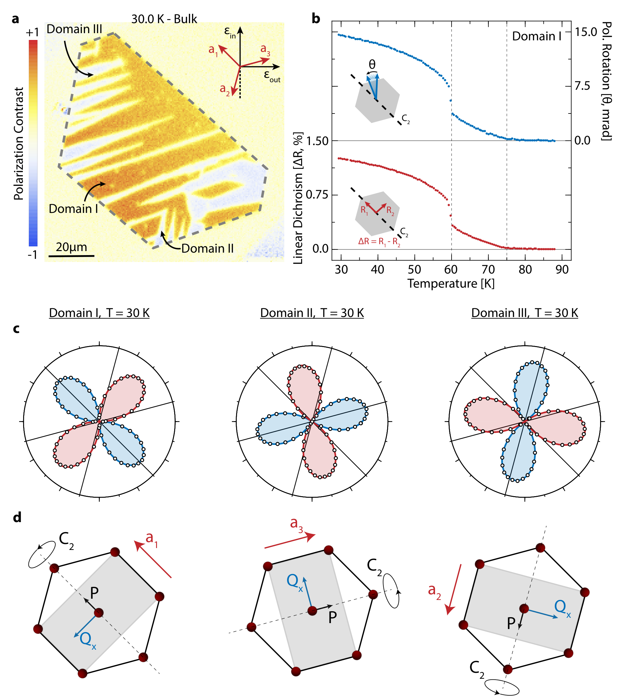
*   **来源**：[[../papers/songEvidenceSinglelayerVan2022]]
*   **图示描述**：三个子图分别为块材偏振显微照片（标注 Domain I–III）、Domain I 上双折射诱导偏振旋转角 θ(T)（上，单位 mrad）与线性二色性 ΔR(T)（下，单位 %）随温度（K）的对比、以及三个畴各自的角分辨 ΔR(θ) 极坐标曲线。
*   **关键特征**：θ(T) 与 ΔR(T) 在 T_N,1 ≈ 75 K 与 T_N,2 ≈ 59.5 K 两处出现协同突变，与磁化率 χmag 行为同步，说明旋转对称破缺由磁序驱动；三个畴的 ΔR(θ) 均呈二重（C₂）花瓣形，且 C₂ 轴方向彼此相差约 60°/120°，对应三种结构等价畴。

### 39. ED Fig.7 块体/1层/2层 NiI2 交叉偏振图像
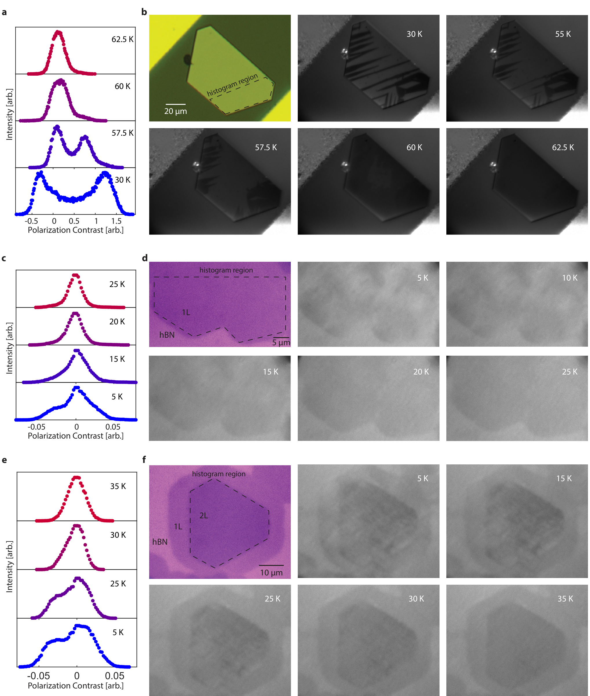
*   **来源**：[[../papers/songEvidenceSinglelayerVan2022]]
*   **图示描述**：交叉偏振构型下拍摄的块材、1 层（1L）、2 层（2L）NiI₂ 薄片在不同温度下的反射显微图像，右侧给出各厚度区域偏振对比度（亮暗差值）随温度的统计直方图。
*   **关键特征**：低温下各厚度区域均出现由双折射畴产生的明暗衬度；升温时 1L 区域畴衬度在约 15–25 K 区间消失、2L 区域在约 25–35 K 消失，块材在 ~60 K 附近消失；直方图中对比度峰随温度升高而塌缩，与偏振旋转 θ(T) 给出的 T_c 定量一致。

### 40. 图4 多铁畴壁功能：(a) BFO中109°畴壁原子结构；(b) 畴壁导电；(c) 忆阻I-V滞回；(d,e) ErMnO3带电畴壁极性依赖电导
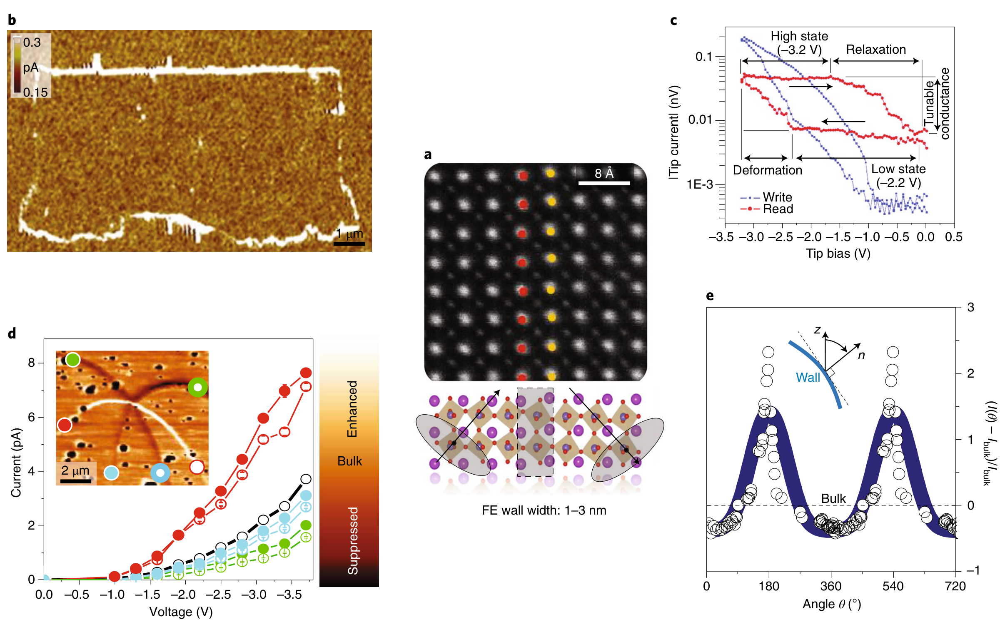
*   **来源**：[[../papers/spaldinAdvancesMagnetoelectricMultiferroics2019]]
*   **图示描述**：(a) BFO 中 109°铁电畴壁的原子分辨率电镜照片；(b) 同一畴壁的导电原子力显微镜电流图，显示畴壁处电流显著增强；(c) 畴壁的电流-电压曲线呈现滞回；(d,e) ErMnO₃ 中头对头/尾对尾带电畴壁的导电性随极性变化。
*   **关键特征**：①BFO 109°畴壁宽度仅约 1–3 nm，接近原子级尺度；②畴壁电导率远高于绝缘母体，可作为天然纳米导线，并可被电场写入、擦除、移动；③I-V 滞回表现出典型忆阻特征，可用于神经形态计算；④ErMnO₃ 中尾对尾带电畴壁因极化不连续导致电荷积累而电导增强；⑤低温（约 50 K 以下）畴壁电导增大并出现大磁电阻，暗示可能的金属性输运。

### 41. Fig.14 超快53-ns翻转与畴壁运动速度
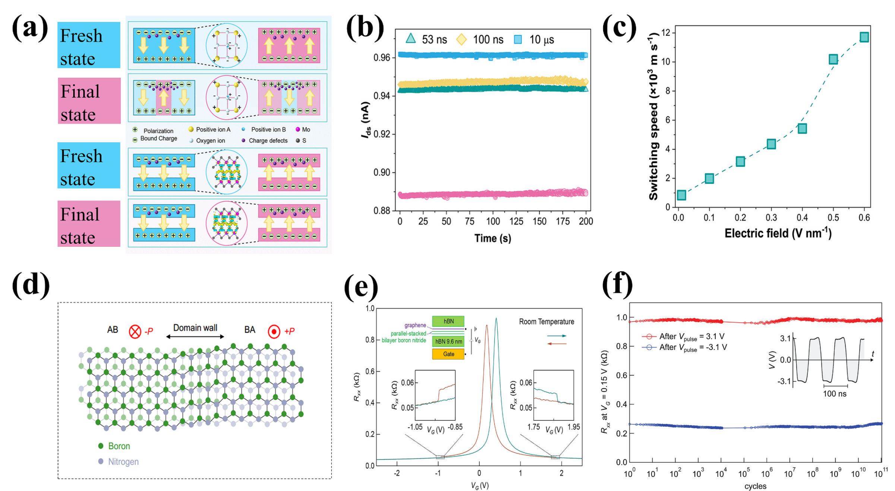
*   **来源**：[[../papers/sunSlidingFerroelectricityTwodimensional2025]]
*   **图示描述**：超快翻转性能：(a) 硫族材料本征铁电极化（上）与滑动铁电极化转移（下）对照；(b) 3R-MoS₂ 器件对 53 ns、100 ns、10 μs 写脉冲的漏极电流响应；(c) 不同电场下平均畴翻转速度随场强变化。
*   **关键特征**：写脉冲短至 53 ns 仍可稳定写入；畴壁运动速度最高约 300 μm/s；高电场下翻转速度显著提升；耐久性测试显示长循环下开关比稳定，支撑滑动 FE 的"超快+无疲劳"定位。

### 42. Fig.16 h-BN/3R-MoS2/MoS2-WS2 FTJ
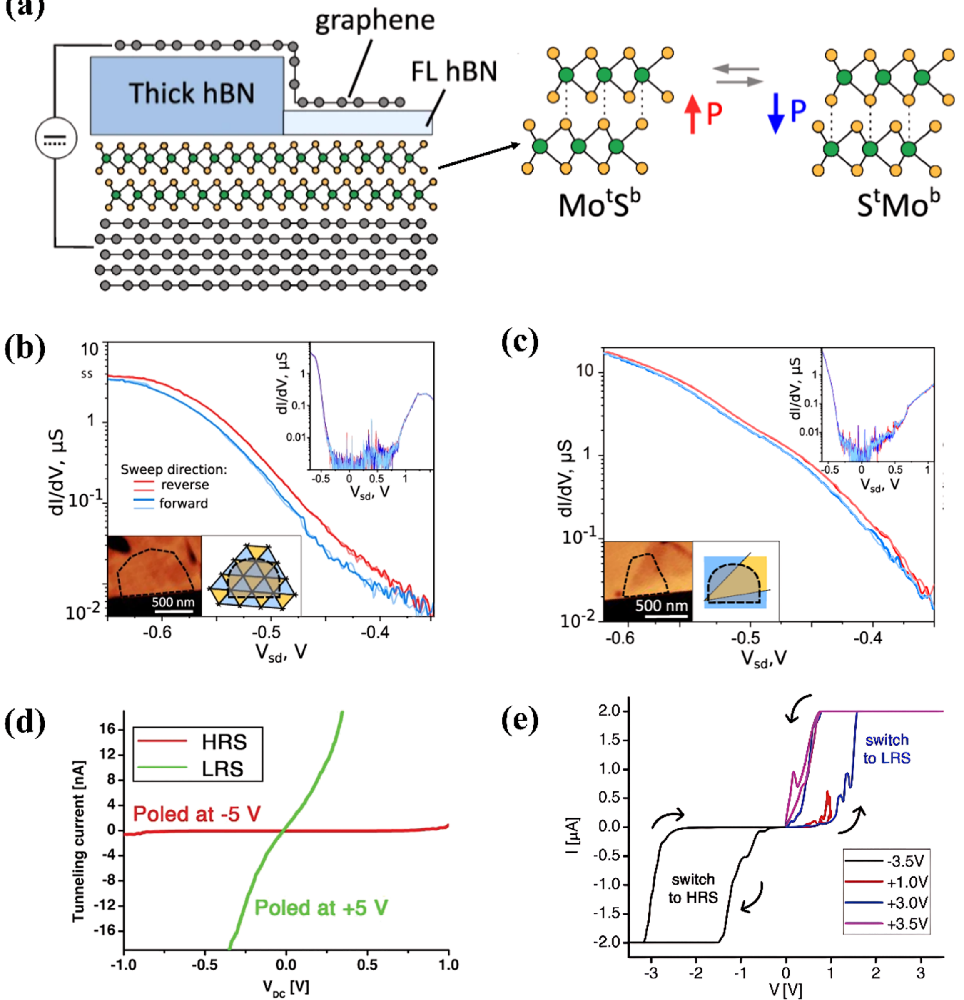
*   **来源**：[[../papers/sunSlidingFerroelectricityTwodimensional2025]]
*   **图示描述**：滑动铁电隧道结 FTJ：(a) 以少数层 h-BN 或双层 3R-MoS₂ 为隧穿层、石墨烯为电极的"三明治"结构；(b–c) 双层 h-BN 与 3R-MoS₂ 的隧穿电导 dI/dV，畴壁被钉扎在隧穿区边缘；(e–f) MoS₂/WS₂ 异质双层作隧穿层时的高/低阻态。
*   **关键特征**：极化方向改变隧穿势垒形状，产生高/低阻态；MoS₂/WS₂ 异质双层 FTJ 的 ON/OFF 比约 10³；畴壁钉扎决定阻态稳定性；原子级厚度隧穿层使 TER 效应在低电压下即可读出。

### 43. 图2 通过 DQM 对拓扑反铁磁织构分类：a-Bloch 反相畴壁、顺/逆时针 a-Bloch 半子、反半子、双半子的计算/实测 Bz 及重构 m_xy
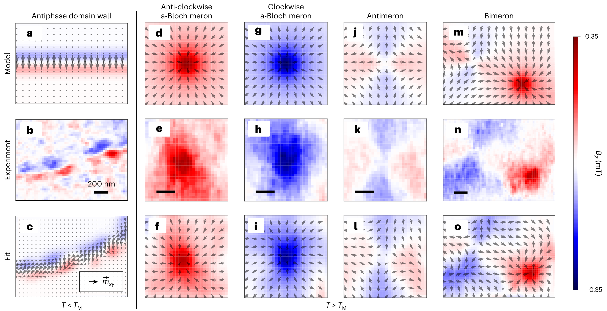
*   **来源**：[[../papers/tanRevealingEmergentMagnetic2024]]
*   **图示描述**：按五行三列排布（比例尺 200 nm，Bz 色标 ±0.35 mT），每行依次给出理论模型计算 Bz、实验实测 Bz、正则化重构的面内磁化 m_xy（箭头）；对象分别为 a-Bloch 反相畴壁（a–c）、逆时针 a-Bloch 半子（d–f）、顺时针 a-Bloch 半子（g–i）、反半子（j–l，绕数 N = −1）和双半子（m–o）。
*   **关键特征**：ADW 的 Bz 呈正弦状、中心过零，振幅由 sin(ξ_a) 调制，a-Néel 相（ξ_a = 0, π）因 ∇·m = 0 而无信号；a-Bloch 半子（N = +1）的 Bz 径向对称，顺/逆时针极性相反，重构 m_xy 显示反向涡旋；反半子 Bz 呈二重对称；双半子为半子–反半子束缚对的叠加信号。

### 44. 图3 电写磁读：PFM 在 ±6/±7/±8 V 下写入"盒中盒"铁电畴（a-d），同一区域 MFM 读出完全对应的磁畴图案（e-h），对比度随写入电压同步增强

*   **来源**：[[../papers/tianRoomtemperatureTwodimensionalMultiferroic2026]]
*   **图示描述**：同一微区的 PFM（a–d，写入与面外振幅/相位读出）与 MFM（e–h，磁畴读出）配对图像；(a)(e) 为未写入的初始态，(b)(f)、(c)(g)、(d)(h) 依次对应 ±6 V、±7 V、±8 V 直流偏压写入的"盒中盒"图案。
*   **关键特征**：初始态 MFM 呈现自然条纹磁畴；±6 V 写入后 MFM 出现与 PFM 写入图案边界完全重合的磁畴，直接证明电场翻转铁电极化即可重构磁序；±2 V 以下衬度可忽略（矫顽阈值，与 PFM 1–2 V 矫顽电压一致），反向偏压给出反向 PFM/MFM 衬度，证实可逆双向控制；写入电压由 ±6 V 增至 ±8 V 时 PFM 与 MFM 衬度同步增强；0 V 非磁性导电针尖在不同抬针高度下不产生类似 MFM 图案（补充图 5），排除静电力假象；大气暴露两周后该"电写磁读"仍有效，14 天 PFM/MFM 衬度保留约初始 30%，25 天趋于饱和。

### 45. 图4 磁场依赖的 PFM/MFM：0→1300 Oe 外磁场下写入畴的衬度逐步减弱直至均匀，反向证实磁电耦合的双向性

*   **来源**：[[../papers/tianRoomtemperatureTwodimensionalMultiferroic2026]]
*   **图示描述**：在已写入"盒中盒"图案的同一区域，依次施加 0、500、900、1300 Oe 外磁场后采集的 PFM 图像 (a–d) 与 MFM 图像 (e–h)。
*   **关键特征**：0 Oe 时 PFM 与 MFM 畴界锐利、衬度强；随磁场升至 500、900 Oe，PFM 与 MFM 衬度同步减弱、畴界逐渐模糊；1300 Oe 时图像近乎均匀；磁畴被外场趋同后通过磁电耦合反过来削弱铁电畴稳定性。

### 46. RMCD成像显示类双半子磁畴及非共线反铁磁磁滞回线
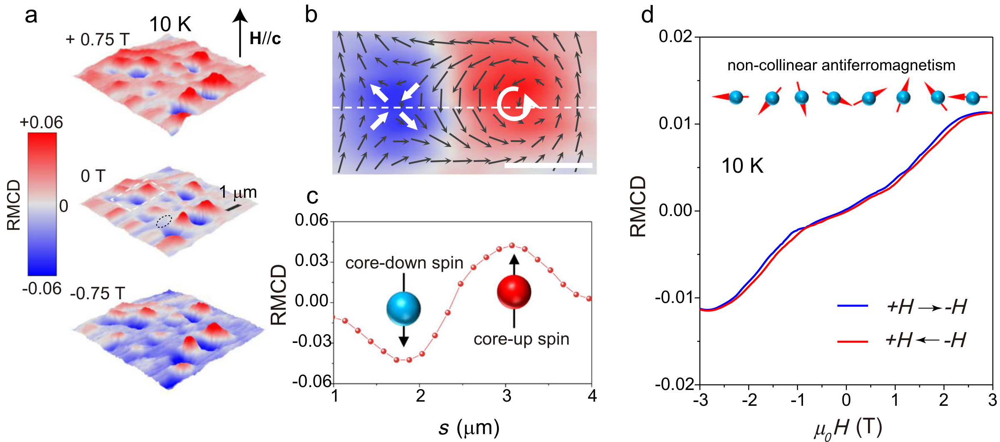
*   **来源**：[[../papers/wuCoexistenceFerroelectricityAntiferroelectricity2024]]
*   **图示描述**：图2用极向 RMCD 显微术成像三层 NiI₂ 的面外磁畴与磁滞行为：(a) 10 K 下 −0.75 T、0 T、+0.75 T 的 RMCD 扫描图；(b) 单个类"双半子（bimeron）"畴的放大 RMCD 图配自旋纹理示意（颜色表 Sz，箭头表面内自旋）；(c) 沿白线的 RMCD 截面线扫；(d) 在图 a 黑圈区域采集的 ±3 T RMCD 磁滞回线，红/蓝曲线分别对应升/降场。
*   **关键特征**：RMCD 强度正比于面外磁化 Mz，亮暗斑代表自旋向上/向下磁畴，且两者成对出现，尺度在微米级；核心区自旋向上或向下、向边缘逐渐归零，符合摆线基态中一对相反手性的 meron–antimeron（拓扑半子对）纹理；该织构在整个 −0.75 至 +0.75 T 扫描范围内稳定，作者归因于拓扑保护；磁滞回线在 0 T 附近信号被抑制至零（零剩磁），±1.2 至 ±2.6 T 区间缓慢上升，呈现典型 spin-flop 平台，说明层间反铁磁耦合下存在复杂的非共线自旋。

### 47. 不同频率下P-E/I-E电滞回线（FE→AFE演化）及螺旋磁序-极化模型与原子自旋模拟
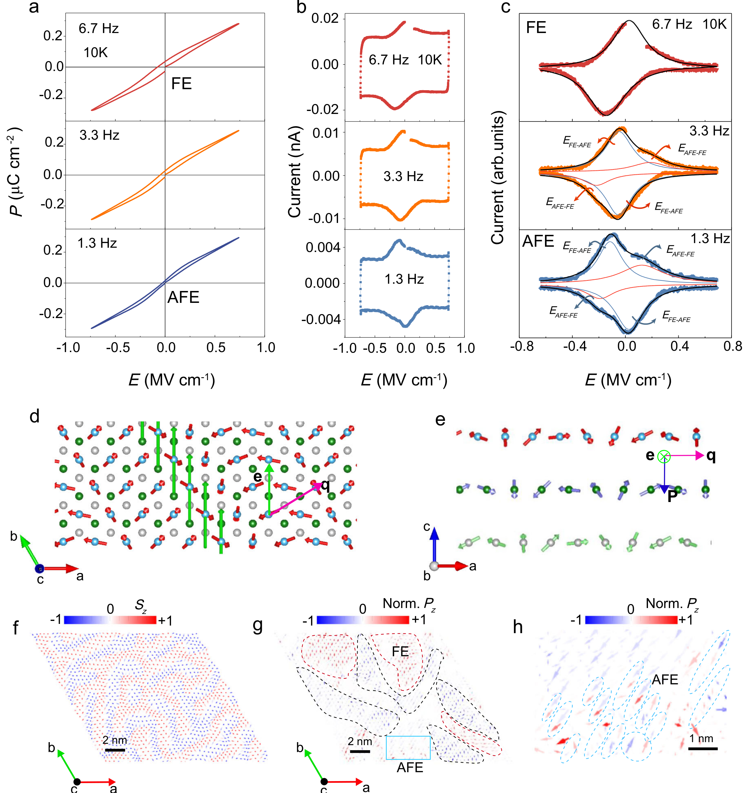
*   **来源**：[[../papers/wuCoexistenceFerroelectricityAntiferroelectricity2024]]
*   **图示描述**：图3是全文核心，把电学测量和理论模型并置：(a) 不同频率（6.7、3.3、1.3 Hz）下器件1的 P–E 电滞回线；(b) 对应 I–E 回线；(c) 扣除线性背景、经洛伦兹拟合后的 I–E 回线；(d)(e) DFT 给出的螺旋磁构型俯视与侧视，粉色箭头 q 为自旋传播矢量（面内沿 [210]，与 a 轴成 30°），绿色箭头 e 为自旋旋转轴（面内垂直 a 轴），展示层间 AFM 耦合与面外 P；(f)(g)(h) 原子级自旋模型得到的 Sz 条纹畴、对应的 Pz 铁电偶极纹理，以及反铁电畴放大图。
*   **关键特征**：6.7 Hz 时 P–E 为矩形铁电回线、I–E 出现一对尖锐翻转电流峰（FE 畴翻转）；1.3 Hz 时 P–E 演化为双电滞回线、I–E 出现两对峰，分别对应 AFE↔FE 场致相变；3.3 Hz 介于两者之间；按 KNB/逆 DM 关系 P = γ e × q，q 与 e 的几何产生沿 c 轴的面外极化，与实验一致；模拟中相反手性的螺旋磁畴产生相反 Pz 的铁电畴（红/黑虚线框），过渡区相反 Pz 偶极交错排列（图 h 浅蓝虚线圈），宏观净极化为零，即反铁电畴。

### 48. 图1 滑动铁电机理：BN双层AB→BA滑移路径、扭转BN莫尔铁电畴、3R体相、WTe2普适判据
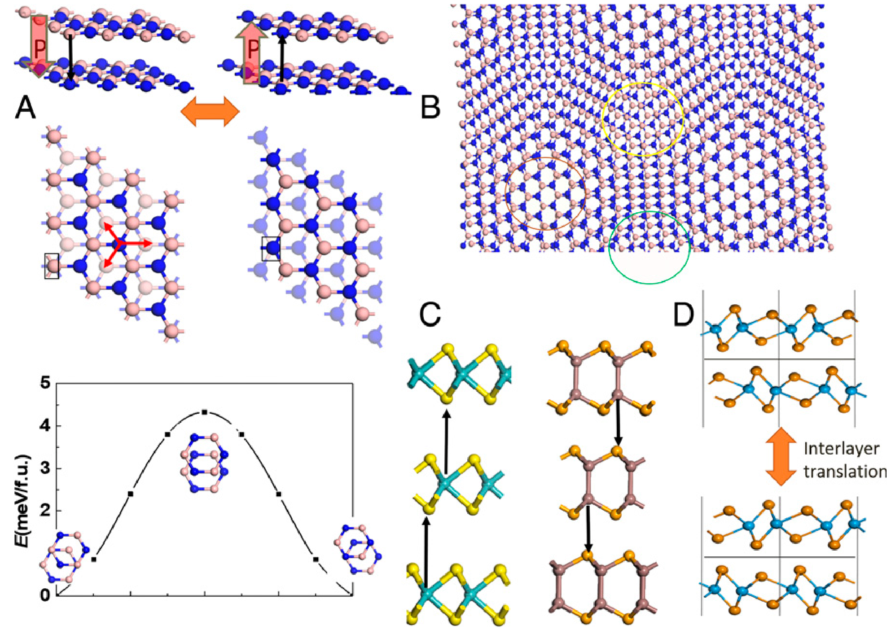
*   **来源**：[[../papers/wuSlidingFerroelectricity2D2021a]]
*   **图示描述**：四个子图共同阐述滑动铁电性的机制与普适判据。(A) AB 堆垛 BN 双层的原子结构，黑色箭头标出 B→N 的层间电荷转移，红色箭头指出沿三个等价方向滑移一个 B–N 键长即可实现 AB↔BA 翻转；(B) 小角度扭转 BN 双层形成的莫尔超晶格，红/黄/绿圈分别为 AA（无极化）、AB（极化向下）、BA（极化向上）畴；(C) 3R 相 MoS₂、InSe 等 ABC 堆垛体相；(D) WTe₂ 双层为例说明普适判据。
*   **关键特征**：BN 双层垂直极化为 2.08 pC/m（折合 0.68 μC/cm²）；单胞翻转面能垒约 9 meV/unit cell；蜂窝晶格体系有三个等效翻转态，WTe₂ 等为双稳态；判据要求体系非中心对称，且对中心水平面做 M_z 镜像所得的极化反转态能由层间面内平移 t_∥ 实现。

### 49. 图3 偏光显微镜下A/B/C三畴变体及角分辨透射强度
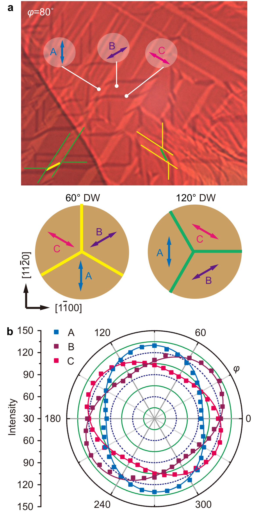
*   **来源**：[[../papers/xuTwodimensionalFerroelasticityVan2021]]
*   **图示描述**：(a) 起偏角 φ=80° 下的大视场透射偏光显微镜像，底部插图用彩色箭头标出 A/B/C 三畴拉伸方向及 60°/120° 畴壁网格；(b) A、B、C 三畴透射光强随起偏角 φ 变化的极坐标/直角坐标曲线。
*   **关键特征**：三畴在偏光下呈现三种不同灰度，长直畴壁相交形成正交网格；光强随 φ 呈余弦调制（线性二向色性），三个极大值夹角相差 60°/120°；当偏振方向平行于纳米条纹（拉伸方向）时透射最强。

### 50. 图4 ≤0.5%外应变驱动的铁弹畴切换序列及A畴面积分数-应变曲线
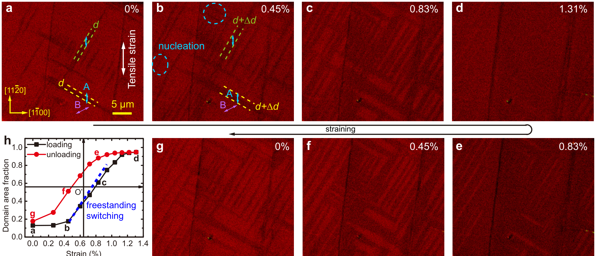
*   **来源**：[[../papers/xuTwodimensionalFerroelasticityVan2021]]
*   **图示描述**：(a–g) 单轴拉伸应变 0→1.31%→0 过程中同一 β'-In₂Se₃ 薄片的偏光显微序列（比例尺 5 μm），虚线标记畴壁传播位置，圆圈标记新畴成核位置；(h) A 畴面积分数随外加应变 ε 变化的加载/卸载曲线，并与"全部外加应变由畴切换协调"的蓝色虚线模型对比。
*   **关键特征**：≤0.5% 外应变即可触发 B→A 畴切换；0.5%≤ε≤1.1% 区间 A 畴面积分数近似线性增长，斜率约 1.35，与理想线性模型吻合，理论上可产生约 0.74% 的垂直伸长；切换通过畴壁传播与新畴成核两种机制并行；卸载后残留新生 A 畴，表现铁弹迟滞；低/高应变区的偏离归因于畴壁钉扎；AFM 纳米压痕测得屈服应变约 5.5%，远大于切换应变，保证切换不破坏材料；原位 Raman/SHG 排除了相变和挠曲铁电效应。

### 51. 图5 CVD生长~6.6 nm（约7五元层）超薄薄片中的二维铁弹性
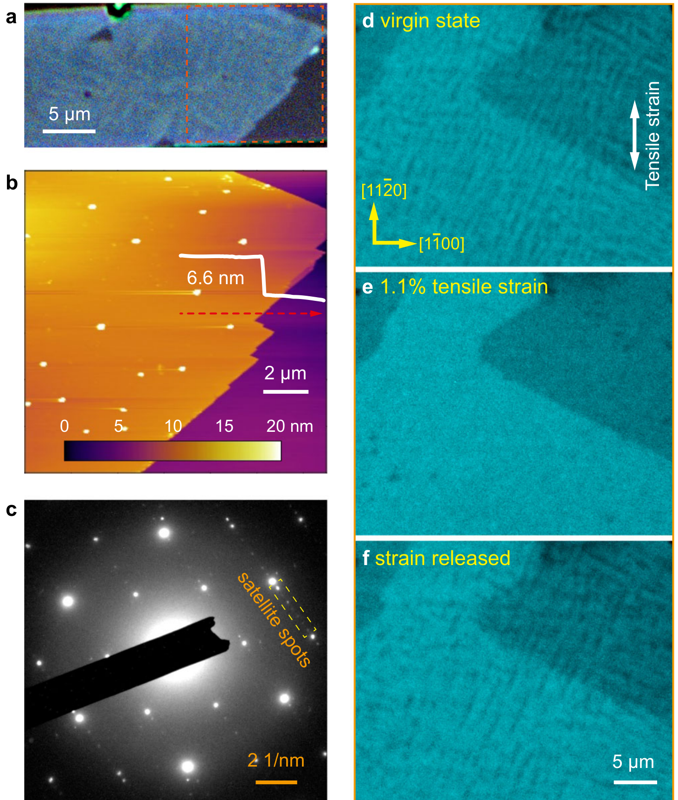
*   **来源**：[[../papers/xuTwodimensionalFerroelasticityVan2021]]
*   **图示描述**：(a) CVD 生长超薄 β'-In₂Se₃ 薄片的偏光畴图像；(b) 对应 AFM 形貌及高度轮廓；(c) 同一薄片的 SAED 花样；(d–f) 另一超薄薄片在外应变加载/卸载下的偏光畴切换序列。
*   **关键特征**：AFM 测得薄片厚度约 6.6 nm，对应约 7 个 Se-In-Se-In-Se 五元层；更薄约 5.7 nm 样品中亦见畴图案；SAED 仍显示位于 n/8 处的卫星衍射斑，证明纳米条纹反铁电超结构保留至少层极限；外应变下畴可类似图 4 那样发生可逆切换；第一性原理预测反铁电畸变可保持至单层。

### 52. 图6 3R堆垛中120°畴壁处的表面褶皱与面外剪切应变
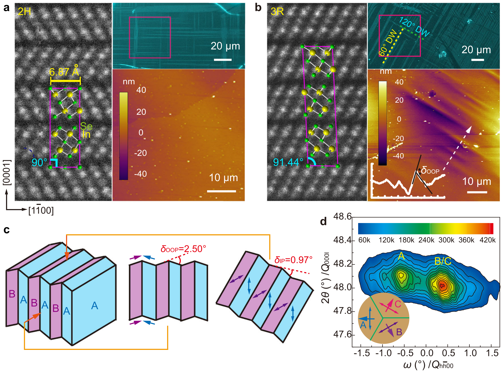
*   **来源**：[[../papers/xuTwodimensionalFerroelasticityVan2021]]
*   **图示描述**：(a)(b) 2H 与 3R 堆垛的截面对比：横截面 STEM、偏光畴像及 AFM 形貌三联图；(c) 褶皱形成机制示意图，画出 (0001) 面镶嵌倾斜；(d) 围绕 (0 0 0 15) 反射的二维倒易空间图（RSM）。
*   **关键特征**：2H 为正交晶系、AB'AB' 反向堆垛，自发应变纯面内，60°/120° 畴壁表面均平坦；3R 为单斜晶系，[0001] 与 [1-100] 夹角 91.44°，引入面外剪切 εxz≈−0.0126；3R 中 120° 畴壁两侧剪切分量反号，为维持共格发生约 2.5° 的 (0001) 面镶嵌倾斜并形成表面褶皱；RSM 上 (0 0 0 15) 反射分裂为两个峰，直接证实两侧晶面面外取向不同；3R 中 60° 畴壁两侧剪切同号，表面平坦但畴壁在三维中倾斜。

### 53. 图7 3R相中跨过270 nm台阶发生~480 nm水平偏移的倾斜60°畴壁
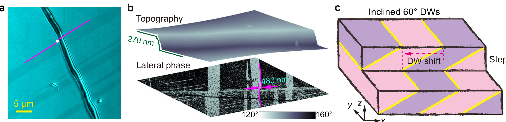
*   **来源**：[[../papers/xuTwodimensionalFerroelasticityVan2021]]
*   **图示描述**：(a) 3R-β'-In₂Se₃ 一台阶边缘的偏光显微像，显示 60° 畴壁在台阶上下的投影发生水平错位；(b) 同一区域的 AFM 形貌与侧向 PFM 相位图；(c) 三维示意图，把倾斜畴壁被台阶切断后形成水平偏移的几何关系画出。
*   **关键特征**：AFM 测得台阶高度约 270 nm；PFM 相位图中畴壁在台阶顶/底的水平偏移约 480 nm；侧向 PFM 畴衬度来自二阶电致伸缩效应，相位差小于 180°；该倾斜畴壁是 3R 相本征特征，在无剪切的 2H 相中不存在。

### 54. MLC MTJ 状态转换电流矩阵（Table 3）
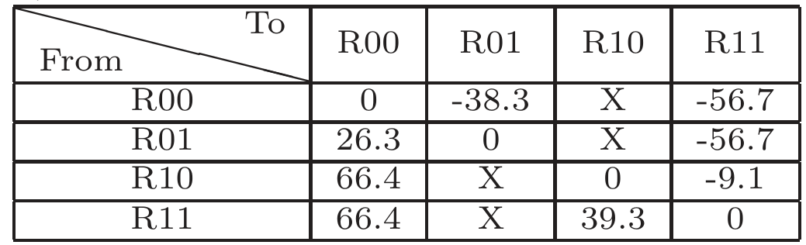
*   **来源**：[[../papers/xueEmergingNonvolatileMemories2011]]
*   **图示描述**：45 nm 节点、10 ns 写脉冲条件下，MLC MTJ 四个阻态 R00<R01<R10<R11 之间状态转换所需电流的 4×4 矩阵（单位 μA），"X"表示无法一步完成的转换。
*   **关键特征**：最大转换电流 66.4 μA，出现在 R11/R10→R00 的硬畴翻转；软畴翻转（如 R00→R01）只需约 38.3 μA，R11→R10 仅需 39.3 μA；R11→R01 等转换必须两步走（先 66.4 μA 到 R00，再 38.3 μA 到 R01）；正电流方向定义为自由层→参考层。

### 55. 图3 双轴应变调控波纹：曲率-应变曲线及压缩应变诱导高温条纹状铁电畴

*   **来源**：[[../papers/yangRipplingFerroicPhase2021]]
*   **图示描述**：图3a 为 350 K 下平均曲率 κ（Å⁻¹）随双轴应变（%，正拉伸/负压缩）的变化曲线；图3b-c 与图3d-e 分别对比无应变和施加 −0.2% 双轴压缩应变时的表面形貌与局域铁性序分布。
*   **关键特征**：拉伸应变抑制波纹（κ 减小），压缩应变增强波纹（κ 增大）；350 K 无应变样品整体无序，而 −0.2% 压缩下波纹显著增强并诱导出清晰条纹状铁电畴；这表明通过应变/衬底工程可在高于 Tc 的温度下主动写入并稳定铁性畴。

### 56. 图4 波纹对应力诱导畴翻转的影响：应力-应变曲线、微观畴演化、应力降PDF从幂律到高斯的转变

*   **来源**：[[../papers/yangRipplingFerroicPhase2021]]
*   **图示描述**：图4a 为 50 K 沿 x 拉伸时 NPT 平坦模型（蓝）与 NVT 波纹模型（红）的应力（GPa）-应变（%）曲线；图4b-q 依次给出两种模型在不同应变下的微观畴结构演化；图4r 为首次屈服后应力降幅度 A 的概率密度 P(A) 对比。
*   **关键特征**：无波纹曲线在 ε≈4%、9–11%、16% 出现三次突发应力降，对应初级孪晶 (ηx,−Px)、次级孪晶 (ηx,Px) 的形核与竞争生长，并出现初级畴"吞噬"次级畴的自催化级联；有波纹曲线在 ε>4% 后明显平滑，波纹通过改变曲率协调畸变，次级孪晶形核应变由 9.7% 推迟到 12.9%；无波纹 P(A) 服从截断幂律 P(A)~A^(−δ)（δ=1.3），为协同雪崩动力学标志，有波纹 P(A) 变为高斯分布，反映独立随机的局域翻转；补充材料 Fig. S12 证明 NPT/NVT 系综本身不改变该统计。
