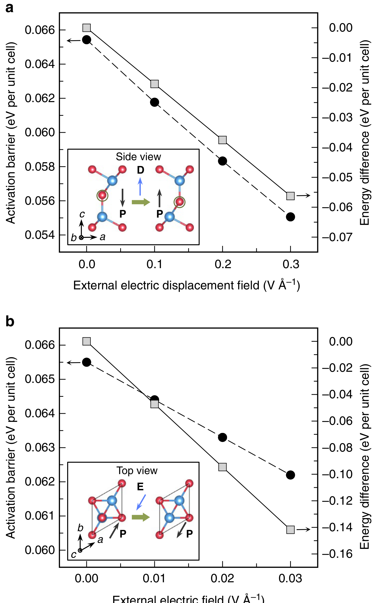
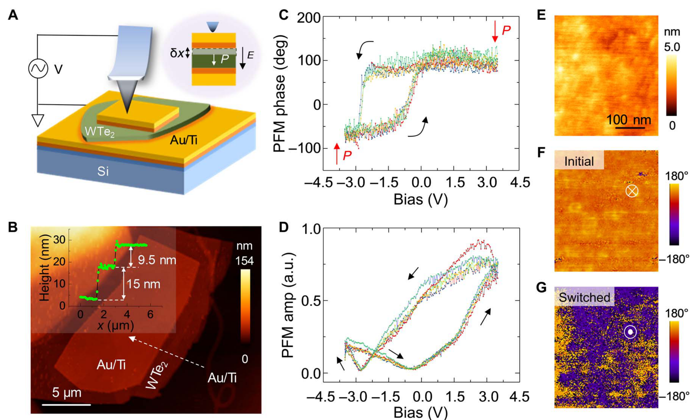
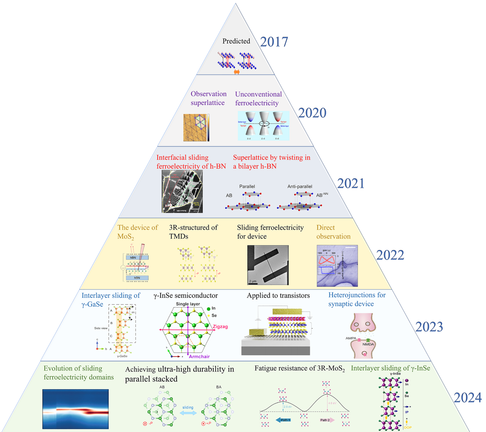
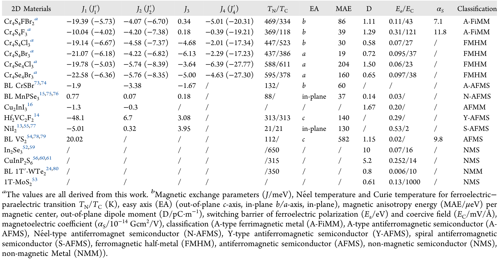

---
tags:
  - type/figure-collection
---

# 铁电畴与畴壁：极化翻转与铁电性能

> 属于 [[domain-walls|铁电畴与畴壁]]

## 条目

### 1. Fig.2 电学翻转的成核-分解-重组过程

*   **来源**：[[../papers/Chen2016electrical]]
*   **图示描述**：对图1蓝色方框内 P1–P2 条纹畴逐级施加 −1.8 V、−2 V、−2.3 V 针尖偏压后，OP/IP PFM 相位图的四列序列；标注 A–F 六个初始单畴区域及其子区域 A2–A4 等。
*   **关键特征**：−1.8 V 时新畴 B2、C2 等优先在原 P1–P2 畴壁处成核，畴界变模糊；−2 V 时 >94% 区域翻转向下，因多路径并发而分解为超出 PFM 分辨率的 nm 畴，在 IP 图中呈棕色（已排除仪器相位偏移）；−2.3 V（>Vc≈2.3 V，对应 Ec≈38 kV/mm）时纳米畴重组为 μm 级 P−3/P−4 畴。

### 2. Fig.3 力学翻转面积比随针尖力递增至100%

*   **来源**：[[../papers/Chen2016electrical]]
*   **图示描述**：(a,b) 3325 nN 力扫描前后 1×1 μm² 区域的表面形貌对比；(c–h) 用 30 nm 直径 PFM 针尖依次施加 140、700、1050、1400、1750、3325 nN 力后的 OP 相位图序列。
*   **关键特征**：向下畴面积比随力单调上升 0 → 8.9% → 41.4% → 82.2% → 95.9% → 100%；按接触面积 ~707 nm² 换算，700 nN ≈ 0.25 GPa、3325 nN ≈ 1.18 GPa，最大应力仍低于 BiFeO₃ 塑性损伤阈值；加压前后形貌均光滑，翻转态在大气中保持 2 天不退。

### 3. Fig.4 力学翻转与电学翻转相似的畴演化

*   **来源**：[[../papers/Chen2016electrical]]
*   **图示描述**：与图2平行的力学翻转 PFM 序列，对 G、H、I、J、K 五个初始单畴区域依次施加 875 nN、1050 nN、1330 nN 针尖力，给出 OP/IP 相位图。
*   **关键特征**：875 nN 时新畴在 μm 级畴壁处成核；1050 nN 时 μm 畴分解为超出 PFM 分辨率的 nm 畴（IP 棕色区）；1330 nN 时纳米畴重组为 μm 级向下畴，典型路径 G1(P1)→G2(P−2)→G4(P−3) 为 109°+71°，J1(P4)→J2(P−3)→J3(P−2) 同为两步翻转。

### 4. 图1 BFO晶胞、欧拉角定义及理论压电响应曲面 u1/u2/u3

*   **来源**：[[../papers/Jin2015studying]]
*   **图示描述**：(a) BFO 菱方相（R3c）伪立方晶胞及 Fe 离子排布，三重轴沿晶体坐标系 z₀；(b) 用欧拉角 (Φ, θ, Ψ) 定义晶粒坐标系 (x₀,y₀,z₀) 相对实验室坐标系 (x,y,z) 的旋转；(c) 由压电张量经欧拉旋转算出的面外压电位移 u₃ 随 (Φ, θ) 变化的响应曲面；(d) 在 Ψ = 0°/30°/60°/90° 四个取值下面内压电位移 u₁、u₂ 随 (Φ, θ) 的响应曲面。
*   **关键特征**：压电系数取自第一性原理，非零分量为 d₁₀₅ = 80 pC/N、d₂₀₂ = 27 pC/N、d₃₀₁ = 1.4 pC/N、d₃₀₃ = 23 pC/N；晶胞基矢 a₀ = [0, 5.59, 0] Å、b₀ = [−4.84, −2.79, 0.577] Å、c₀ = [0, 0, 13.9] Å；u₃ 的正负直接对应 θ < 90°/θ > 90°，即面外极化分量 Pz 的朝向；u₁/u₂ 同时依赖 Φ、θ、Ψ 三个欧拉角，关系比 u₃ 更复杂。

### 5. 图3 差分PFM图像、71/109/180度翻转实例及面积统计饼图

*   **来源**：[[../papers/Jin2015studying]]
*   **图示描述**：(a, b) 极化后减极化前的 VPFM、x-LPFM 差分图像，灰底上的紫色/白色区域表示信号发生变化的翻转畴，编号标记被统计的畴（带后缀 "a" 者为异常翻转畴）；(c) 三个典型畴分别被判定为 71°、109°、180° 翻转的实例，标出翻转前后极化矢量；(d) 按翻转角与初始面外极化 (OPP) 相对电场方向（平行/反平行）分类的面积占比统计图。
*   **关键特征**：总体 71° 翻转占约 42%，109° 与 180° 各占约 29%；约 85% 翻转为"正常"（ΔPz < 0，紫色），其余为 ΔPz > 0 的"异常"翻转（白色），异常翻转只通过 71°/109° 发生、无 180°；约 34% 的翻转面积发生在初始 OPP 平行于极化电场的区域（Pz′ < 0），是多晶膜特有现象；初始 OPP 反平行时 71° 与 180° 占比相近（27% vs 29%）、109° 仅 10%，初始 OPP 平行时无 180°、109°（19%）略多于 71°（15%）；差分 x-LPFM 中紫/白约各半，说明 −z 电场下面内翻转无 x 方向倾向性。

### 6. Initial permeability spectra

*   **来源**：[[../papers/Perugu2024morphology]]
*   **图示描述**：横轴为 log ω，纵轴为初始磁导率 μi，四条曲线对应 x=0.2–0.8，测试频段同样为 42 Hz–5 MHz。
*   **关键特征**：所有样品在 log ω=4.1 与 5.68 附近出现两个明显的弛豫/共振峰，作者将前者归因于铁电偶极子、后者归因于铁磁偶极子与外场共振；μi 在峰区出现高值；5 MHz 下 μi 从 5.24（x=0.2）降至 4.14（x=0.6），x=0.8 又回升至 4.96，这种非单调变化归因于 Fe³⁺/Fe²⁺ 间交换相互作用的改变。

### 7. 图1 铁磁/铁电/多铁体在时间反演与空间反演下的对称性

*   **来源**：[[../papers/RecentAdvancesGrowth2025]]
*   **图示描述**：四个子图系统展示三种初级铁性序（磁化 M、极化 P、应变 ε）与外场（磁场 H、电场 E、应力 σ）之间的交叉耦合关系，包括磁电耦合、压电效应、磁致伸缩，以及 I 型/II 型多铁在相变温度和序参量来源上的对比。
*   **关键特征**：I 型多铁的铁电与磁来源相互独立，耦合弱但极化大、转变温度高（分孤对电子、电荷有序、几何阻挫三亚类）；II 型多铁的铁电由螺旋磁序等特殊磁结构衍生（逆 DM 效应 P ∝ e×q 或自旋流机制），磁电耦合极强但极化小、T 低；磁–弹–电三角耦合清晰标注了 M、ε、P 三者的相互调控路径。

### 8. 物理机制图解

*   **来源**：[[../papers/chenHafniumBasedFerroelectricPostMoore2026]]
*   **图示描述**：机理解析组图，a解释铁电性起源，b–e展示相变与外部调控（掺杂、应变、氧空位），f–h展示极化翻转的微观路径。
*   **关键特征**：① 图5a的"平带声子"图像解释HfO₂铁电性不随尺寸减小而消失；② 图5b–e显示掺杂、>3%双轴拉伸应变、V_O²⁺浓度>2%等手段可降低Pca2₁相能量；③ (2;0)型畴壁路径能垒仅约73 meV，几何上类似t相，远低于(1;1)型路径的1.36 eV；0.4%拉伸应变可消除过渡势垒；④ 氧离子迁移分层内（Op原位反转偶极）与层间（Onp跨极性/非极性边界交换身份）两条路径。

### 9. 图2 磁致电铁体的高场可调性：TbMnO₃极化90°翻转、DyMnO₃巨磁介电(~500%)、TbMn₂O₅ 180°可逆翻转、DyMn₂O₅介电台阶

*   **来源**：[[../papers/cheongMultiferroicsMagneticTwist2007a]]
*   **图示描述**：(a) TbMnO₃ 的极化分量 P_c（红）与 P_a（蓝）随沿 b 轴磁场 H_b 的变化；(b) DyMnO₃ 在不同温度（2、4、9 K 等）下介电常数 ε_b 随 H_b 的变化；(c) TbMn₂O₅ 中沿 b 轴极化 P_b 随时间的变化，蓝/红阴影区为沿 a 轴的正/反向脉冲磁场；(d) DyMn₂O₅ 在不同恒定磁场（0–9 T）下 ε_b 随温度 T 的台阶式变化。
*   **关键特征**：(1) TbMnO₃ 在约 5 T 处发生自旋翻转相变，P_c 突然归零而 P_a 出现，极化矢量整体旋转 90°（polarization flop），极化幅值约 10⁻² μC/cm² 量级；(2) DyMnO₃ 在约 5 T 窄场窗内 ε_b 增长约 500%，即巨磁介电效应（colossal magnetodielectric effect）；(3) TbMn₂O₅ 中脉冲磁场可使 P_b 在约 ±40 nC/cm² 间高度可逆地 180° 翻转（+P_b↔−P_b），具备非易失存储特征；(4) DyMn₂O₅ 的 ε_b 在约 25 K 以下出现台阶，磁场从 0 T 增至 9 T 时台阶幅度显著增大，表明磁场增强了铁电序。

### 10. 图6 螺旋((Eu,Y)MnO₃)与非螺旋(YMn₂O₅交换伸缩)磁致电电性对比及P∥e₃×Q定则

*   **来源**：[[../papers/cheongMultiferroicsMagneticTwist2007a]]
*   **图示描述**：(a) 零场下 Eu₀.₇₅Y₀.₂₅MnO₃ 的螺旋磁结构，波矢 Q ∥ b，自旋在 a–b 面内旋转、旋转轴 e₃ ∥ c，由 P ∥ e₃×Q 给出 P ∥ a；(b) 沿 a 轴加场后自旋翻转至在 b–c 面内绕 H 旋转，e₃ ∥ a，P 随之转到 c 轴，实现 90° 极化翻转；(c) YMn₂O₅ 沿 c 轴俯视的 Mn 自旋排布，绿色虚线为沿 a 轴的反铁磁锯齿链，跨链 Mn³⁺–Mn⁴⁺ 对中蓝色虚椭圆为反平行、红色虚椭圆为平行，黑色空心箭头表示交换伸缩驱动的离子位移方向。
*   **关键特征**：(1) 面板 a、b 用非磁性稀土 Eu/Y 替代 Tb/Dy，排除稀土矩干扰，干净地验证了 P ∥ e₃×Q 定则；(2) 零场 Q ∥ b、e₃ ∥ c 给出 P ∥ a，H ∥ a 场致 flop 后 e₃ ∥ a 给出 P ∥ c，与图2a 的实验观测定量一致；(3) 面板 c 中 Mn 自旋构成五自旋环 Mn⁴⁺–Mn³⁺–Mn³⁺–Mn⁴⁺–Mn³⁺，奇数环导致阻挫；反平行对键缩短、平行对键拉长，非对称畸变模式破缺反演对称并沿 b 轴产生净 P；(4) 该机制由海森堡交换（而非弱 DM 相互作用）驱动，潜在极化更大。

### 11. 图3 铁电翻转：IP/OOP耦合模型，±电压写入方块后OOP与IP相位同步翻转，蝴蝶形振幅回线与180°相位突变

*   **来源**：[[../papers/cuiIntercorrelatedInplaneOutofplane2018a]]
*   **图示描述**：图3 展示转移到 Au/Si 衬底上 6 nm In2Se3 薄片的铁电翻转特性：(a) FE-ZB' 构型中中心 Se 原子层横向位移同时驱动 IP/OOP 极化耦合翻转的模型；(b,c) 用 −7 V 和 +6 V 针尖电压写入 2 μm 和 1 μm 两个方块后立即采集的 OOP 与 IP 相位图；(d,e) 分别为无顶电极和有 Au 顶电极（直径 2 μm、厚 20 nm）下的局部振幅-电压蝴蝶曲线与相位回线。
*   **关键特征**：−7 V 与 +6 V 写入方块在 OOP 和 IP 相位图中同时出现衬度反转，且反转区域完全重合，证明 OOP 翻转必然同步带动 IP 极化旋转。无顶电极时振幅呈蝴蝶形、相位发生 180° 突变；加 Au 顶电极后仍保留蝴蝶形振幅与尖锐相位回线，排除了表面静电、电荷注入或离子迁移等 PFM 伪像。有顶电极回线更不对称、矫顽场更大，归因于 Au 沉积引入的"死层"。写入畴相位衬度在空气中最长可识别约 10 h。

### 12. 图3 外电场与电位移场下In2Se3的极化翻转势垒及相能量差

*   **来源**：[[../papers/dingPredictionIntrinsicTwodimensional2017a]]
*   **图示描述**：(a) 电位移场D=0–0.3 V/Å下的激活势垒（黑圆）与两相能量差（灰方）；(b) 电场E=0–0.03 V/Å下的对应关系，插图给出极化翻转路径的侧视与俯视原子构型。
*   **关键特征**：零场激活势垒约0.0655 eV/单胞；D增至0.3 V/Å时势垒降至约0.055 eV、能量差降至-0.06 eV，电场下两者近似线性下降，说明外场可有效降低翻转壁垒并使目标相变为基态。

### 13. 图3 CINEB 最小能量路径：FE-PE-FE 翻转（a,b）与 FE-AFE 相变（c,d），势垒 0.34/0.31 eV 与 0.13/0.12 eV

*   **来源**：[[../papers/fengFerroelectricityMultiferroicityTwodimensional2020]]
*   **图示描述**：横轴为 CINEB 反应坐标，纵轴为每化学式单元的能量（eV/f.u.）；(a,b) FE→PE→FE 极化翻转路径，(c,d) FE↔AFE 相变路径。
*   **关键特征**：FE-PE-FE 翻转势垒 0.34 eV/f.u.（Sc₂P₂Se₆）与 0.31 eV/f.u.（ScCrP₂Se₆），远高于 α-In₂Se₃ 的 0.057 eV/f.u.；FE-AFE 势垒 0.13/0.12 eV/f.u.；AFE 相较 FE 相能量低 0.1–0.14 eV/f.u.，但势垒高于室温 k_BT≈0.026 eV，FE 是稳健亚稳态；FE/AFE 竞争由原子位移应变能与极化电场能（去极化场）共同决定。

### 14. 图1：CIPS（a-e，四重势阱/PFM盒中盒/电滞回线）与 α-In₂Se₃（f-h，偶极锁定/单层PFM/β′β″相）自发极化

*   **来源**：[[../papers/guoAdvancesTwodimensionalFerroelectric2025]]
*   **图示描述**：本图汇总两类经典离子位移型二维铁电体。(a-e) 为 CuInP₂S₆：层状硫族骨架、Cu⁺ 在 S 八面体笼中的四重势阱模型、LP→HP 切换时 Cu⁺/In³⁺ 协同位移、30 nm 薄片上 ±偏压写入的 PFM"盒中盒"相位图（比例尺 1 μm），以及相位 180°翻转+振幅蝴蝶型回线。(f-h) 为 α-In₂Se₃：Se-In-Se-In-Se 五层结构中央 Se 原子双稳态移动同步翻转面内/面外极化的"偶极锁定"、单层 PFM 形貌与压电回滞，以及 β′ 反铁电相/β″ 铁电相的层内极化方向对比。
*   **关键特征**：CIPS 的 Cu⁺ 在四个等效势阱（Cu1/Cu1′/Cu3 等）间跃迁，Tc≈315 K，4 nm 薄膜仍保持约 320 K 的室温铁电；PFM 相位 180°跳变与振幅蝴蝶曲线共同构成铁电性"金标准"指纹。α-In₂Se₃ 单层极限仍可被电场翻转，但其偶极锁定模型与 C3v 对称性矛盾，催生了"分数量子铁电性"解释。

### 15. 图3：hBN 滑移铁电实验验证（六种高对称堆叠/t-hBN的EFM三角畴/石墨烯-p-hBN器件/电阻相图/电滞回线/SP区面内极化拓扑网络）

*   **来源**：[[../papers/guoAdvancesTwodimensionalFerroelectric2025]]
*   **图示描述**：(a) hBN/hBN 六种高对称堆叠（AA′、AB、BA、AA、AB′、BA′）；(b) 转角 hBN 的 dc-EFM 相位图显示大面积周期性三角形电势调制；(c) 石墨烯/p(t)-hBN 场效应器件结构；(d) t-hBN 器件石墨烯电阻随顶栅/背栅变化的二维相图（双峰渐进）；(e) p-hBN 与 t-hBN 电阻-电压回滞对比；(f-h) AB/BA 畴壁过渡区（SP）的原子构型、第一性原理计算的面内极化强度矢量，以及形成的半子/反半子拓扑网络。
*   **关键特征**：hBN 带隙约 5.97 eV，仅 AB/BA 平行构型产生面外极化，AA′ 偶极反平行抵消；EFM/KPFM 测得 AB/BA 畴间电势差约 200 mV。p-hBN 呈陡峭矩形回线（单畴快速翻转，适合非易失存储），t-hBN 呈渐进双峰回线（畴壁迁移主导，适合低功耗可编程器件）。SP 区还存在周期性面内偶极子，可形成 meron/antimeron 拓扑极化网络。

### 16. 图4：WTe₂（a-e，层数依赖电滞回线/Hirshfeld电荷/拉曼剪切模消失）与 2H-TMDs（f-h，H/R堆叠/三角莫尔畴/单畴多畴回滞对比）

*   **来源**：[[../papers/guoAdvancesTwodimensionalFerroelectric2025]]
*   **图示描述**：(a-c) 三层、双层、单层 WTe₂ 器件电阻-栅压电滞回线；(d) Td-WTe₂ 层状结构并标注用于 Hirshfeld 电荷分析的四个近邻 Te 原子柱；(e) 5 层 WTe₂ 拉曼剪切模在垂直电压下的响应；(f) 2H-TMDs 的 H 堆叠与两种平行 R 堆叠原子结构；(g) 转角 2H-TMDs PFM 相位图显示 200 nm 周期三角形莫尔铁电畴；(h) 单畴主导与多畴共存 R 堆叠器件的极化回线对比。
*   **关键特征**：WTe₂ 单层无回线、双/三层出现显著回滞（相变温度约 350 K），直接证明铁电性来自层间效应；Hirshfeld 分析显示双层面外极化反转对应沿 b 轴 0.72 Å（能垒 0.6 meV/cell，Li 2018）或 0.493 Å（0.3 meV/cell，Ren 2019）的层间滑移。R 堆叠 TMDs 对石墨烯势场调制 2ΔV_P≈110 meV，约为 hBN 的一半；单畴呈陡峭单峰回线，多畴呈渐进双峰回线。

### 17. 铁电氧化物纳米结构中的极性拓扑：几何约束示意图；BFO纳米岛中心畴/涡旋畴的PFM矢量图与相场模拟；BFO纳米晶中的极性所罗门环

*   **来源**：[[../papers/hanPolarTopologicalMaterials2025]]
*   **图示描述**：(a) 不同几何形状铁电纳米结构在弹性/静电边界约束下的示意；(b) BFO 纳米岛中心畴与涡旋畴的 PFM 矢量图（上）与相场模拟（下）；(c) BFO 纳米晶中由两个缠绕涡旋构成的极性所罗门环相场模拟。
*   **关键特征**：BFO 纳米岛典型横向尺寸 200–600 nm、高度 10–40 nm，R3c 结构有 8 个极化变体；中心畴中大静电能释放导致涡旋状核心，涡旋畴则具导电的中心收敛核心；所罗门环由两个头尾相接、互相缠绕的涡旋组成。

### 18. 表1 已报道低维铁电材料汇总（极化值、方向、翻转势垒、Tc、理论/实验标注）

*   **来源**：[[../papers/huProgressProspectsLowdimensional2019]]
*   **图示描述**：汇总约 16 种理论预言或实验证实的二维铁电材料，列出化学式、极化值（pC/m 或 μC/cm²）、极化方向（面内/面外）、FE 翻转势垒（meV/f.u.）、居里温度 Tc（K）以及参考文献编号与 T/E（理论/实验）标注。
*   **关键特征**：IV 族单硫族化物 SnS/GeSe 等极化 151–506 pC/m、Tc 326–6400 K 表现最突出；WTe₂ 作为金属仍具 ~0.16 pC/m 面外极化、Tc ~350 K，颠覆铁电必为绝缘体的认知；1T-MoS₂ 面外 0.28 μC/cm²，羟基化石墨烯面内 6.6 μC/cm²、Tc ~700 K；SnTe 1-UC 实验 Tc 由块体 98 K 升至 270 K；表中 T 多于 E，显示该阶段理论先行。

### 19. 图2 甲基/羧基/酰胺等自组装单分子层共价功能化锗烯、锡烯、MoS₂诱导面内铁电

*   **来源**：[[../papers/huProgressProspectsLowdimensional2019]]
*   **图示描述**：示意在锗烯、锡烯、MoS₂ 等非极性二维材料表面共价接枝 -CH₃、-CH₂OCH₃、-COOH、-CONH₂ 等有机官能团（自组装单分子层），蓝色箭头标示极性基团的取向与由此产生的面内极化方向。
*   **关键特征**：官能团在表面的非对称排列打破空间反演对称，赋予本不具铁电性的高迁移率材料可翻转的面内极化；Ge/Si/SnSb/MoS₂-SAM 系列极化值约 31–117 pC/m，每个配体翻转势垒约 90 meV，Tc 在 350 K 以上；策略普适于多种二维衬底。

### 20. 图4 二维钙钛矿薄膜中 FE 100-S（表面效应）与 FE 110-IP（三线性耦合）两种越薄越强的反常铁电态

*   **来源**：[[../papers/huProgressProspectsLowdimensional2019]]
*   **图示描述**：对比三种钙钛矿氧化物薄膜面内铁电态随厚度的演化：FE 100-S（表面效应驱动，极化沿 [100]）、FE 110-IP（氧八面体旋转与 A 位位移三线性耦合的杂化非本征铁电，沿 [110]）、以及传统 FE 110-P（Ti 3d–O 2p 杂化驱动）。箭头和颜色标示极化方向及其厚度依赖。
*   **关键特征**：FE 100-S 与 FE 110-IP 的单位体极化均随膜厚减小而反常增强，FE 110-P 则随厚度减小而衰减；前两者不依赖 B 位空 d 轨道（在无空 d 轨道的 SrSiO₃、小容忍因子 CaSnO₃ 中仍可存在）；FE 110-IP 在奇数 CaO 层时获得净极化。

### 21. 图5

*   **来源**：[[../papers/huangTwodimensionalIn2Se3Rising2022]]
*   **图示描述**：(A–F) 室温下 α-In₂Se₃ 薄片的面外压电力显微镜（OOP-PFM）相位与振幅图；(G) PFM 振幅/相位随直流偏压变化的电滞—蝴蝶回线；(H) 用相反探针电压在样品上电写出的"盒中盒"畴图案。
*   **关键特征**：相位图上 180° 反差的两类区域对应 OOP 极化相反的铁电畴；蝴蝶形振幅曲线与方形相位回线共同证明极化可被外电场可逆翻转且双稳态；写入电压约 ±6 V，可在微区任意编程畴图案。

### 22. 图8

*   **来源**：[[../papers/huangTwodimensionalIn2Se3Rising2022]]
*   **图示描述**：(A) NEB 计算的单步直接翻转路径：中心 Se(m) 从一侧偏心位置直接跳到对侧；(B) 三步协同路径：上三层集体滑动形成 β′ 中间相 → Se(m) 旋转 60° → 上两层再集体滑动回到反向 α 相。
*   **关键特征**：单步法势垒高达约 0.85 eV/单位胞，室温下几乎不可发生；三步协同法势垒仅约 0.066 eV/单位胞，比单步法低一个数量级以上；中间经过 β′/β0 结构，说明铁电翻转本质上是有序-有序的结构相变而非简单离子位移。

### 23. 表1 各材料带隙、面外/面内极化 (pC/m)、翻转能垒 (meV) 汇总

*   **来源**：[[../papers/kaurRecentAdvancesTheoretical2025a]]
*   **图示描述**：汇总本综述讨论的各滑动铁电材料的带隙、面外与面内极化 (pC/m) 及翻转能垒 (meV)，是图28性能地图的数值来源。
*   **关键特征**：可直接横向比较 h-BN（P≈2.08 pC/m）、WTe2（0.37 pC/m，0.6 meV）、MoSi2N4（3.36 pC/m）、GeS2/CIPS（HP± 11.77 pC/m）、MnSe（2.7 pC/m）等代表性体系的性能；表中同时列出 Janus TMD、III–V/IV 族二元、磁性多铁材料的关键参数。

### 24. 图2 层间距/应变对 h-BN 极化、负泊松比与负压电性的影响

*   **来源**：[[../papers/kaurRecentAdvancesTheoretical2025a]]
*   **图示描述**：(a) 面外极化与电偶极矩随层间距的变化；(b) 电偶极矩对层间距与面内双轴应变的相图；(c)(d) 沿 x、y 方向单轴应变下的层间距变化 ΔZ。
*   **关键特征**：极化与层间距成反比；面内双轴应变经弛豫反而增大层间距（负面外泊松比）；AB 构型同时呈现负纵向压电系数 d33，揭示负压电性与负泊松比共存这一罕见组合。

### 25. 表2 各滑动铁电材料居里温度 (K) 汇总

*   **来源**：[[../papers/kaurRecentAdvancesTheoretical2025a]]
*   **图示描述**：列出各滑动铁电/多铁体系的居里温度 Tc (K)，并说明 Tc 应与"孤立势垒 Δ"按 Tc≈2Δ/3kB 关联，而非与集体翻转势垒关联。
*   **关键特征**：例如 h-BN 经 MLIP MD 修正后 Tc≈1500 K、WTe2 Tc≈350 K、β-ZrI2 Tc≈476 K；为评价材料在室温下铁电序稳健性提供参考。

### 26. 图5 THz 激光 3–4 ps 超快翻转、动态多铁性感生磁场 12 nT

*   **来源**：[[../papers/kaurRecentAdvancesTheoretical2025a]]
*   **图示描述**：(a) 全部堆垛构型的能量面；(b)(c) 能量和极化随 E(4) 模振幅 Q[E(4)] 的变化；(d) AB↔BA 间极化矢量摆线式旋转示意；(e) 高斯包络太赫兹电场脉冲；(f)(g) 脉冲下极化分量 Px,Py,Pz 与感生磁矩分量 Mx,My,Mz 的时间演化。
*   **关键特征**：目标声子模 E(4)/E(5) 位于 1.08 THz；AB 堆垛 Q[E(4)]=0，另一态为 5.1 Å (amu)^(−1/2)；y 偏振脉冲在 5 K 下 3–4 ps 完成翻转；感生 Mx≈2.7×10⁻⁸ μB、B≈12 nT，属动态多铁性 P×∂tP 机制。

### 27. 图14 跨层滑动铁电：h-BN/石墨烯/h-BN；苯分子层/石墨烯/h-BN 达 10⁴ Tbit/in²

*   **来源**：[[../papers/kaurRecentAdvancesTheoretical2025a]]
*   **图示描述**：(a) 两平行 h-BN 间插石墨烯形成的两种 FE 态几何；(b) 翻转能垒；(c) 两双极态的差分电荷密度；(d) 苯分子层/石墨烯/h-BN 中分子独立存储比特、实现超高密度滑动存储的示意。
*   **关键特征**：两态中 C 始终对 B，但等价性由 (AA,AB) 变为 (AB,AA)；P=0.48 pC/m，NEB 势垒 3 meV/u.c.，h-BN 加厚后 P 略升至 0.51 pC/m；用苯分子取代上层石墨烯后，每分子独立存 1 bit，预测面密度达 10⁴ Tbit/in²，是跨层滑动铁电 (ALSF) 的原型。

### 28. 图16 1-uc BaTiO3/SnS：二维/三维杂化稳定超薄铁电，Néel 点、Bloch 涡旋、联合扭转-滑动

*   **来源**：[[../papers/kaurRecentAdvancesTheoretical2025a]]
*   **图示描述**：(a)(b) BaO/TiO2 终止面的 1-uc 自支撑 BTO 与 SnS 单层；(c–f) BaO/TiO2 终止面 BTO/SnS 的极性结构、能垒与翻转路径，红/绿箭头分别表示 SnS/BTO 中的极化方向；(g–o) SnS 单/双/三层下能量景观与极性态分布；(p–s) 异质双/三层的联合扭转-滑动过程及转角 BTO 在单/双层 SnS 上的可调莫尔图案。
*   **关键特征**：BaO 终止面有四个极性态、TiO2 终止面有三个极性态；界面各向异性应变使极化在 x、y 间切换并伴随铁弹转变；类 Landau-Ising 模型给出大且正的层内 J；极性分布汇聚于绕数为 1 的 Néel 点，并出现顺/逆时针 Bloch 涡旋，随 BTO 滑动和 SnS 厚度可调。

### 29. 图21 CrI3、Cr2Ge2Te6、Fe3GeTe2 双层反平行/平行堆垛的滑动铁电与"压电多铁效应"

*   **来源**：[[../papers/kaurRecentAdvancesTheoretical2025a]]
*   **图示描述**：(a) 反平行 CrI3 双层、(b) 反平行 Cr2Ge2Te6 双层、(c) 平行 Fe3GeTe2 双层的双稳态 I/II 几何（红箭头为反向极化）；(d) 三种材料 FE 翻转的能垒对比。
*   **关键特征**：CrI3 为 FM，Cr2Ge2Te6、Fe3GeTe2 基态为 AFM；CrI3、Cr2Ge2Te6 仅反平行堆垛非中心对称，而 Fe3GeTe2 即使平行堆垛也非中心对称；PBE+U 显示 CrI3、Cr2Ge2Te6 为间接带隙、Fe3GeTe2 为金属；Fe3GeTe2 每胞净磁矩 0.01 μB 并随 FE 翻转；约 10% 压缩应变使极化与净磁化近乎翻倍，称为"压电多铁效应"。

### 30. 图23 VI2：自旋螺旋序诱导的非位移铁电、滑动-螺旋手性锁定、SOC 依赖

*   **来源**：[[../papers/kaurRecentAdvancesTheoretical2025a]]
*   **图示描述**：(a) VI2 单层俯/侧视图；(b)(c) 正/负自旋螺旋手性的非共线 120° Y-AFM 序；(d) 自旋螺旋序诱导电极化示意；(e) 单层中 ΔE_D→U 随外面电场变化；(f)(g) VI2 双层能量分布及 AB→AB′ 路径上极化与 ΔE_DD→UU；(h) 极化对 SOC 强度的依赖；(i) 极化与 ΔE_DD→UU 随层间距变化；(j–l) 三层能量分布与 ABB→AAB′ 路径上的极化和 ΔE_DDD→UUU。
*   **关键特征**：自旋螺旋序经反对称机制 P=M∑(S_i×S_j) 诱导非位移铁电，单层 P⊥=0.12 pC/m；AB/AB′ 为简并反极性态，P=1.33 pC/m；经 AC 翻转势垒 21.06 meV，显著低于经 AA 的 77.52 meV；AB/AB′ 在 Y-AFM 基态中螺旋手性沿内建场排列（ΔE_DD→UU=0.14 meV/胞），即"螺旋手性-滑动铁电锁定"；极化和 ΔE 均随 λSOC 线性增长，三层 ΔE_DDD→UUU=0.22 meV/胞。

### 31. 图25 SnS2/MnPSe3/SnS2：滑动打破 PT 对称诱导交变磁性，两条翻转路径与能垒

*   **来源**：[[../papers/kaurRecentAdvancesTheoretical2025a]]
*   **图示描述**：SnS2/MnPSe3/SnS2 三明治结构的堆垛滑动示意、能量景观与两条铁电翻转路径；差分电荷密度显示 Mn 周围电荷耗尽。
*   **关键特征**：层间滑移引入极化并破坏 PT 对称性，将普通 AFM 体材料诱导为交变磁体；图中给出两条翻转路径及其能垒；该图与图26共同支持"滑动铁电可在 AFM 中诱导交变磁性"的论断。（raw/note 未给出该图更细分子图的数值，仅作定性描述。）

### 32. 图28 全部滑动铁电双层的"极化–能垒"性能地图（理想区：右下，高极化低能垒），绿色为多铁材料

*   **来源**：[[../papers/kaurRecentAdvancesTheoretical2025a]]
*   **图示描述**：横轴为极化大小 (pC/m)，纵轴为翻转能垒 (meV)，每个点代表一种滑动铁电材料，绿色点标记多铁材料。
*   **关键特征**：理想存储材料位于图的右下角（高极化信号强、低能垒低功耗高速）；图中可见极化与能垒总体正相关，构成材料设计的核心权衡；该图是本综述的材料筛选"性能地图"，与表1、表2互为参照。

### 33. 图29 连续介质模型：P(T) 一级相变、临界场、电卡熵变 Δs(E)

*   **来源**：[[../papers/kaurRecentAdvancesTheoretical2025a]]
*   **图示描述**：(a) 极化 P 随温度 T 的变化显示 FE→PE 一级相变（P 在 Tc 不连续跳变）；(b) 临界翻转场随温度变化；(c) 电卡熵变 Δs 随电场 E 的变化。
*   **关键特征**：连续介质（横场 Ising 类）模型证实滑动铁电体为一级 FE–PE 相变，区别于常规二级铁电体；尽管翻转势垒极低，二维材料高面内刚度产生的弹性能代价抑制热涨落，保护长程铁电序，使其与 Mermin–Wagner 约束相容；电卡熵变预示固态制冷潜力。

### 34. 图4 铁弹翻转IS-MS-FS路径及NEB能垒(258 meV/atom)，易磁化轴随之旋转90°

*   **来源**：[[../papers/liMonolayerPuckeredPentagonal2022]]
*   **图示描述**：图4展示铁弹性翻转路径及其与磁性的耦合：(a)初始态IS、(b)中间态MS、(c)终态FS的原子结构，(e)为FS的另一侧视图；深蓝/浅青球分别为上/下子层V原子，其余为Te原子；红色箭头表示施加的压缩/拉伸应变，绿色箭头表示易磁化轴方向，蓝色箭头表示翻转步骤；(d)NEB计算所得总能量沿反应路径的变化。
*   **关键特征**：面内晶格a、b各向异性约1.8%；翻转时先沿x轴压缩、y轴拉伸（仅1.8%应变）使矩形晶胞变正方形，再旋转90°；MS中下层Te原子水平移动但保持五边形基元完整；NEB能垒258 meV/atom，与黑磷烯等二维非磁铁弹材料相当；翻转后易磁化轴同步旋转90°。

### 35. 螺旋诱导极化 P ∝ q × e_3

*   **来源**：[[../papers/mostovoyMultiferroicsDifferentRoutes2024]]
*   **图示描述**：将式 (4) 螺旋构型代入式 (5) 后得到的宏观极化方向，由螺旋波矢 q 与螺旋面法向 e₃ 的叉乘决定。
*   **关键特征**：摆线型螺旋（e₃⊥q）给出垂直于 q 与 e₃ 的极化，适用于任何晶体对称性；DyMnO₃、TbMnO₃ 等螺旋反铁磁体中测得的螺旋诱导极化最大值约 0.3 μC/cm²；低对称晶体中螺旋型（e₃∥q）可由额外耦合给出 P∥q。

### 36. 图1 顺电/弛豫体/反铁电/铁电四种极性有序度示意

*   **来源**：[[../papers/neumayerCompetingPolarPhases2025]]
*   **图示描述**：概念示意图，按偶极子排列的有序程度依次展示顺电体（PE，偶极子随机分布、净极化为零）、弛豫体/偶极玻璃（局部纳米极性区、无长程序）、反铁电体（AFE，相邻偶极子反平行、净极化为零，电场下可转为极性态）和铁电体（FE，偶极子同向集体排列、具有可翻转自发极化）四类材料。
*   **关键特征**：无坐标轴与物理单位，横轴可理解为"极性有序度"由弱到强；AFE 与 FE 均具长程序但净极化方向相反；弛豫体介于 PE 与 AFE/FE 之间，只有短程极性纳米区；强调 AFE、弛豫体在电场下可被诱导出极性响应，为后续多相转换提供分类基础。

### 37. 图4 CIPS不同FE相间转换机制：温度依赖、电场诱导复杂翻转、Cu离子电导激活的宏观P-E回线变化

*   **来源**：[[../papers/neumayerCompetingPolarPhases2025]]
*   **图示描述**：三联图。(a) 升温序列的 PFM 压电响应图（上）与示意相图（下），温度轴 °C；(b) 不同位置测得的 PFM 压电滞回线，横轴偏压 V、纵轴压电响应 pm/V；(c) 直流脉冲前后宏观 P–E 滞回线，横轴电压/电场、纵轴极化 μC/cm²。
*   **关键特征**：(a) 加热时约 60 °C 的 LP 畴先消失、65 °C 仅剩 HP 畴、70 °C（居里温度）以上转为零压电响应的 PE 相；(b) 同一样品不同位置可出现 +HP↔−LP、+LP↔−HP、+HP↔−HP、+LP↔−LP 等多种翻转路径，远超二进制；(c) 负 DC 脉冲（>200 ms）激活 Cu⁺ 离子电流后，矫顽电压偏移、可切换极化增大，甚至出现极化逆外电场排列；更长/更强脉冲可使 FE 切换消失（Cu 亚晶格无序成 PE 态或回线移出窗口），施加正 DC 电压后可完全恢复。

### 38. 图8 均匀双轴应变加载技术：热膨胀失配法与压电衬底（PMN-PT）法

*   **来源**：[[../papers/pengStrainEngineering2D2020]]
*   **图示描述**：左列为热膨胀系数（CTE）失配法——将二维材料转移到聚合物或玻璃等衬底上，通过升降温利用 CTE 差异在面内两个方向同时产生压缩或拉伸应变；右列为压电衬底法——将材料置于 PMN-PT 等压电晶体上，通过外加电压诱导衬底双轴形变。
*   **关键特征**：热膨胀法简单易行、可大面积施加，但应变与温度耦合、应变幅度较小；PMN-PT 压电法可通过电压电信号快速、可逆地切换拉伸/压缩双轴应变，典型应变量在 ~0.2% 量级，便于动态调制实验。

### 39. 图3 电容器结构中的极化翻转：电滞回线、蝴蝶曲线及电压脉冲写入畴

*   **来源**：[[../papers/sharmaRoomtemperatureFerroelectricSemimetal2019]]
*   **图示描述**：图3为极化翻转的动态证据：A为金属/天然氧化层/WTe₂电容器结构示意（WTe₂薄片厚约15 nm，Ti/Au顶电极约9.5 nm，中间约2.5 nm非晶自然氧化层作为绝缘层）；B为器件形貌与厚度；C-D为相位-电压与振幅-电压迟滞回线；E-G为施加-2.5 V脉冲前后的PFM相位图，横轴偏压单位为V，纵轴分别为相位（°）与振幅（pm）。
*   **关键特征**：C中相位随偏压呈现约180°的矩形电滞回线；D中振幅呈典型"蝴蝶曲线"，在矫顽电压附近出现极小值，二者共同构成铁电翻转的"指纹"；G相对F在-2.5 V脉冲后相位衬度由亮变暗，证明可在微米尺度可逆写入/擦除极化态；天然氧化层阻断直流电流、又允许电场穿透，是克服金属高电导短路难题的关键实验设计。

### 40. 图6 八层BP厚板表面层位移诱导极化、上下表面12 meV真空静电势差及49 meV翻转能垒

*   **来源**：[[../papers/shenEmergenceMultipleFerroelectric2025]]
*   **图示描述**：(a) 八层 BP 厚板以 ABABABAB 为基态，将顶层（灰色虚线框）平移约 (±0.28, 0.5) 得到 ABABABAE/AF，蓝色箭头标极化方向；(b) 沿 c 轴的平面平均静电势，比较上下表面真空能级；(c) 表面层滑移实现极化翻转的 CI-NEB 路径。
*   **关键特征**：仅位移顶层即可诱发 0.12 pC/m 面外极化和 1.53 pC/m 面内极化；ABABABAE 与 ABABABAF 上下表面真空能级相差 12 meV，是面外极化的直接静电学证据；翻转势垒约 49 meV；位移多层可同时改变极化方向与大小，而单移顶层时面外方向保持不变；为用导电 STM/AFM 针尖电场写入/读取小铁电畴提供可操作路径，桥接理论预测与实验观测。

### 41. 图1 多铁性家族树：d0/孤对电子铁电根与d/f电子磁性根组合形成各材料分支

*   **来源**：[[../papers/spaldinAdvancesMagnetoelectricMultiferroics2019]]
*   **图示描述**：以树状分类图呈现，四个根系分别为铁电性的 d0 机制（如 BaTiO₃ 中 Ti⁴⁺）和孤对电子立体化学活性（如 BiFeO₃ 中 Bi³⁺ 6s²），以及磁性的局域 f 电子（稀土）与部分填充 d 电子（过渡金属）；根系组合后形成复合、单相及新型铁电性等多条树枝。
*   **关键特征**：①按物理机制而非化学成分分类，直观揭示"组合即创新"的设计理念；②"孤对+d 电子"分支对应旗舰体系 BiFeO₃；③"d0+f 电子"分支对应 (Eu,Ba)TiO₃、应变 EuTiO₃；④"新型铁电性+d 电子"分支包含几何（YMnO₃）、电荷有序（Fe₃O₄）、自旋螺旋（TbMnO₃、YBaCuFeO₅）和规避 d0（应变 SrMnO₃）等途径；⑤"新型铁电性+f 电子磁性"等空白枝被明确标出，提示新材料搜索方向。

### 42. Fig.2 滑动铁电发展时间线

*   **来源**：[[../papers/sunSlidingFerroelectricityTwodimensional2025]]
*   **图示描述**：以时间轴形式标出 2017 年理论预测、2020 年 h-BN/石墨烯结构观测、2021 年 h-BN 表面极化、随后 3R-MoS₂、γ-InSe 等体系的实验验证与器件探索等关键节点。
*   **关键特征**：直观呈现该领域从"理论预测"到"实验遍地开花"的爆发式发展；2022–2024 年节点密集，标志着进入材料谱系与器件性能同步推进阶段；为读者提供宏观历史视野。

### 43. Fig.10 h-BN/r-BN堆叠、电学与PFM表征

*   **来源**：[[../papers/sunSlidingFerroelectricityTwodimensional2025]]
*   **图示描述**：h-BN/r-BN 体系的堆叠—电学—PFM 综合表征：(a) 多种堆叠类型；(b) 各类型在高/低偏压态的 I–V 曲线；(c–d) 外场下畴演化；(e) 层间差分电荷密度；(f) r-BN 沿 z 轴的极化分布；(g) 不同温度下的 PFM 信号指示居里温度；(h) 不同偏压下 PFM 振幅/相位回线。
*   **关键特征**：极化源于层间未补偿电荷的转移，而非离子位移；不同堆叠类型对应不同阻态与铁电/反铁电倾向；温度依赖 PFM 可识别居里温度；偏压驱动的振幅/相位回线证实 h-BN/r-BN 中可翻转的面外极化。

### 44. Table 1 四类铁电材料优缺点对比

*   **来源**：[[../papers/sunSlidingFerroelectricityTwodimensional2025]]
*   **图示描述**：四类铁电材料横向对比表，列目包括钙钛矿铁电、铪基铁电、典型二维本征铁电和滑动铁电，比较维度涵盖退极化场、抗疲劳性、CMOS 兼容性、极化值与厚度可缩性等。
*   **关键特征**：钙钛矿极化大但纳米尺寸效应严重；铪基 CMOS 兼容但疲劳/均匀性受限；二维本征铁电厚度小但材料选择有限；滑动 FE 原子级厚度、抗疲劳、退极化场被有效屏蔽，但极化值普遍偏低；该表锚定滑动 FE 在铁电家族中的差异化定位。

### 45. 磁场调控剩余极化、矫顽场与KAI模型翻转时间

*   **来源**：[[../papers/wuCoexistenceFerroelectricityAntiferroelectricity2024]]
*   **图示描述**：图4量化磁电耦合：(a–c) 16.4、24.5、36.6 Hz 三个频率下面外磁场 H‖c 中剩余极化 Pr 随 μ₀H 的变化（误差棒为均值标准误差）；(d) 磁控率 (Pr−Pr₀)/Pr₀ 在频率-磁场平面的二维相图；(e) 不同磁场下的 I–E 回线显示翻转电流峰漂移；(f)(g) 用 KAI（Kolmogorov–Avrami–Ishibashi）模型对 −ln(1−ΔP(t)/2Pr) 与时间关系的拟合；(h) 归一化翻转时间 (τ−τ₀)/τ₀ 随磁场的变化。
*   **关键特征**：Pr 在所有频率下随 |H| 单调下降；24.5 Hz、7 T 时磁控率达到约 −7%，呈现第二类多铁的典型特征；电流峰随磁场减弱并向更高电场漂移，即矫顽电场增大、翻转更"困难"；KAI 拟合给出翻转时间 τ 随 |H| 增加而增加，在 −7 T 时最大增幅约 20%，且对 H 呈偶对称；微观上 H‖c 使自旋从横向螺旋（e‖b, P‖c）转为横向锥形（e‖H‖c），P 由 ‖c 重取向至 ‖b，从而压低面外 Pr；补充数据还显示面内磁场沿不同方位角可分别减小或增大 Pr，对应 e 与 q 夹角的减小/增大。

### 46. 图3 WTe2与BN薄层铁电性实验探测：PFM畴、双栅石墨烯器件滞回、KPFM表面电势畴

*   **来源**：[[../papers/wuSlidingFerroelectricity2D2021a]]
*   **图示描述**：三组里程碑实验的器件结构与表征结果。(A) 约 15 nm 厚 WTe₂ 薄片的 PFM 振幅/相位成像及偏压驱动的压电响应回线；(B) 双栅 vdW 异质结（Au/Cr 顶栅/hBN/石墨烯/0°平行双层 BN/hBN/PdAu 底栅）中石墨烯电阻 R_xx 对顶栅和底栅电压的响应；(C) 两片 3 nm 厚、微扭转 h-BN 的开尔文探针力显微镜表面电势图。
*   **关键特征**：WTe₂ 中可见 20–50 nm 扭曲圆形反平行铁电畴，畴壁在振幅图中呈暗线；石墨烯探测器 20 K 测得 WTe₂ 极化约 0.16 pC/m（DFT 约 0.38 pC/m），居里温度约 350 K，单层无双稳态；BN 双层的底栅扫描显示电阻滞回与载流子密度 n_H 突跳，且几乎不依赖温度、维持至室温；KPFM 观测到数 μm² 反向极化畴，带电探针扫描可移动畴壁。

### 47. 图5 低翻转势垒与高热稳定性统一：WTe2集体vs孤立势垒、MoS2中ripplocation、光驱动BN堆垛转变

*   **来源**：[[../papers/wuSlidingFerroelectricity2D2021a]]
*   **图示描述**：解释滑动铁电如何同时做到低写入能耗与高热稳定性。(A) WTe₂ 双层中铁电翻转（低"集体"势垒）与铁电-反铁电转变（高"孤立"势垒）的能量路径对比；(B) MoS₂ 双层中作为畴壁的 ripplocation（兼具面内位错与面外屈曲波纹）原子结构；(C) BN 双层中由光机械飞秒脉冲驱动的 AA'→AB' 堆垛转变示意。
*   **关键特征**：BN 集体翻转势垒仅 4.5 meV/f.u.、WTe₂ 仅 0.15 meV/f.u.，远低于所有室温铁电体（BiFeO₃ 为 0.43 eV/f.u.，常规门槛 >27 meV/f.u.）；非易失条件为 Q(0)≫50 k_BT，可写条件为可读场（<10 MV/cm）下 Q<5 k_BT（对应 ns–ps 翻转）；vdW 层中 Frank 定律（核心能 ∝|b|²）因长程面内弹性能被屈曲波纹弛豫而失效，Peierls 势垒极低；光驱动路径可实现皮秒级写入并用非线性 Edelstein 效应读出。

### 48. 表1 Cr4S4FBr2 家族（Cr4S4F3、Cr4S4Cl3/Br3、Cr4Se4Cl3/Br3）与 BL CrSBr、NiI2、In2Se3、BL 1T′-WTe2 等标杆材料的 J、TN/TC、MAE、D、Ea/EC、αS 与分类（A-FiMM / FMHM 等）汇总

*   **来源**：[[../papers/yuFerroelectricControlMagnetism2026]]
*   **图示描述**：表格行分为两块——上半部为本文设计的 CSFB 家族（Cr₄S₄FBr₂、Cr₄S₄F₃、Cr₄S₄Cl₃、Cr₄S₄Br₃、Cr₄Se₄Cl₃、Cr₄Se₄Br₃），下半部为 BL CrSBr、BL MnPSe₃、Cu₂InI₃、Hf₂VC₂F₂、NiI₂、BL VS₂、In₂Se₃、CuInP₂S₆、BL 1T′-WTe₂、1T-MoS₂ 等已报道二维磁/铁电/多铁标杆；列依次给出 J₁/J₁′、J₂/J₂′、J₃、J₄/J₄′（meV）、T_N/T_C（K）、易轴 EA、MAE（μeV/Cr）、面外偶极矩 D（pC/m）、翻转势垒/矫顽场 E_a/E_C（eV 与 mV/Å）、α_S（10⁻¹⁴ G·cm²/V）以及分类（A-FiMM、FMHM、A-AFMS、N-AFMS、AFMM、Y-AFMS、S-AFMS、NMS、NMM 等）。
*   **关键特征**：CSFB 本体 T_N/T_C=469/334 K、MAE=86 μeV/Cr、D=1.11 pC/m、E_a/E_C=0.11 eV / 43 mV/Å、α_S=7.1，分类为 A 型完全补偿亚铁磁金属（A-FiMM）；Cr₄S₄F₃ 保持 A-FiMM 且 α_S 升至 11.8、非相对论自旋劈裂 1.55 eV；Cr₄S₄Cl₃/Br₃ 与 Cr₄Se₄Cl₃/Br₃ 转为铁磁半金属（FMHM），T_N/T_C 多数在室温以上；与标杆相比，CSFB 在转变温度、翻转势垒、磁电系数三项指标上同时具有综合优势。

### 49. 图3

*   **来源**：[[../papers/zahraCriticalAnalysisFerroelectric2025]]
*   **图示描述**：(a) 铁电体在外电场 E 下偶极矩 P 翻转形成的 P-E 电滞回线，同时示意传统 3D 铁电薄膜的死层与退极化场；(b) 铁磁体在外磁场 H 下磁矩 M 翻转形成的 M-H 磁滞回线。
*   **关键特征**：两条回线均呈"翻转—滞后"特征，是 FE/FM 的身份证；铁电源于电荷有序，铁磁源于自旋有序；3D 铁电薄膜在减薄时受死层、退极化场、屏蔽场共同作用，面外极化难以稳定。

### 50. 图5

*   **来源**：[[../papers/zahraCriticalAnalysisFerroelectric2025]]
*   **图示描述**：α 相（类 α-In2Se3 六方相）MXene（Nb2CF2、Mo2CO2、Ta2CF2、W2CF2、Mo2CF2）的原子结构及极化上/下两态，附表给出各材料极化值（eÅ）与极化翻转能量势垒（eV）。
*   **关键特征**：这一族 α-MXene 被 DFT 预测为罕见的"铁电金属"；势垒过低则极化易受热扰动丢失，过高则翻转电压过大，图中数值为筛选存储材料提供依据；基于此类材料的 FTJ 隧穿电阻比 TER 极高。

### 51. 磁学参数表

*   **来源**：[[../papers/zhangNonvolatileControlTopological2025]]
*   **图示描述**：汇总本征单层 CrInTe2、CrInTe2/In2Se3(P↑)、CrInTe2/In2Se3(P↓) 三种状态下的海森堡交换 J、各向异性常数 K、面内 DMI 系数 d∥ 等磁学参数。
*   **关键特征**：J 由本征 12.60 meV 降至 P↑ 的 11.69 meV，再降至 P↓ 的 9.85 meV（P↑→P↓ 再降约 16%）；K 由本征 0.73 meV/Cr 提升至 P↑ 的 2.44、P↓ 的 1.96 meV/Cr，即极化翻转使 MAE 抑制约 20%；d∥ 由 P↑ 的 1.87 meV 增至 P↓ 的 1.98 meV，增强约 6%，超过其他 Cr 基 vdW 磁体报道值。

### 52. 表1：19 种非磁铁电体带隙、极化与翻转势垒

*   **来源**：[[../papers/zhaoRealization2DMultiferroic2024]]
*   **图示描述**：表格汇总从 40 种稳定铁电体中分出的 19 种非磁（半导体/金属）铁电体，列出 GGA+U 带隙、磁基态、面外极化 P_out 与铁电翻转势垒 E_B。
*   **关键特征**：4 种半导体铁电体同时具有面内 P_in（Berry phase，最高约 306.45 pC/m）和面外 P_out（偶极修正，最高约 15.22 pC/m），量级与 In₂Se₃ 相当；其余金属铁电体 P_out 分布在约 0.43–9.61 pC/m，普遍大于实验测得的 WTe₂ 双层（0.42 pC/m）；势垒整体控制在 200 meV/f.u. 阈值以下。

### 53. T-CoZr2S4 极化翻转路径上磁基态 FM-AFM-FM 与 MAE 变化

*   **来源**：[[../papers/zhaoRealization2DMultiferroic2024]]
*   **图示描述**：横轴为 CI-NEB 得到的铁电翻转路径（FE1 → PE → FE2），多条彩色曲线表示不同 AFM 构型相对 FM 态的能量差 ΔE，黑色曲线表示磁各向异性能 MAE 沿路径的变化。
*   **关键特征**：FE1、FE2 两端 ΔE_AFM−FM > 0，磁基态为 FM；接近 PE 相处 ΔE 变负，磁基态转为 AFM，整体经历 FM→AFM→FM 可逆转变；PE 相处 MAE 骤变为约 −13.34 meV/Co，易磁化轴由面外翻为面内；代表材料 T-CoZr₂S₄ 的 T_C ≈ 70 K，FE 在 300 K 仍稳定。
