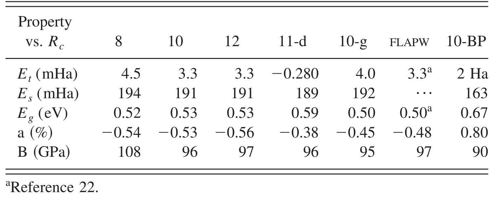

---
tags:
  - type/figure-collection
---

# 电子结构与输运：能带结构与带隙

> 属于 [[electronic-bands|电子结构与输运]]

## 条目

### 1. 图1 第一性原理能带结构（黑点），叠加 d_z²（黑圈）与 d_xy/d_x²-y²（蓝圈）轨道权重；绿线为低能 WF 拟合，红虚线为二维"嵌套"最小模型

*   **来源**：[[../papers/Barnett2006coexistence]]
*   **图示描述**：沿高对称路径 Γ-M-K-Γ-A-H-L 的能带色散，纵轴为能量（eV，E_F=0）；叠加显示 Ta 5d_z²（黑圈）与 5d_xy/d_x²-y²（蓝圈）轨道权重，并对比 DFT 结果、低能瓦尼尔拟合（绿实线）和二维"嵌套"最小模型（红虚线）。
*   **关键特征**：费米能级附近两条金属带由 Ta 5d_z² 主导；−0.7 eV 以下以 Se p 带为主；K/H 点附近 d_z² 与 d_xy/d_x²-y² 显著杂化；绿线精确复现黑点、红线在低能区定性吻合，验证瓦尼尔基组与最小模型的合理性。

### 2. 式5 总能量 E_tot(u,φ)=∫^μ ερ(ε)dε+E_el(u)

*   **来源**：[[../papers/Barnett2006coexistence]]
*   **图示描述**：CDW 态总能量，积分项为电子能带能量（ρ 为态密度，积分到化学势 μ），E_el(u) 为弹性能。
*   **关键特征**：E_el 与 φ 无关，故 φ 只需极小化导带能量；k 积分用三角晶格不可约布里渊区的精细 Monkhorst–Pack 网格；固定 N 与固定 μ=0 两种极端均在 φ=π/2 取极小，真实双层情形介于二者之间。

### 3. 表2 不同电压下的光学带隙

*   **来源**：[[../papers/Blessing2026optical]]
*   **图示描述**：横轴为波长 200–1000 nm，纵轴为吸光度 A (a.u.)，四条曲线分别对应 10 V、11 V、12 V、13 V 沉积的 SnTe 薄膜。所有样品均在紫外区出现峰值，随后随波长向可见-近红外延伸而逐渐下降。
*   **关键特征**：11 V 样品在 321 nm 处吸光度最高（A=1.2077 a.u.），12 V 次之（350 nm, A=1.1071 a.u.），10 V（340 nm, A=0.9707 a.u.）与 13 V（330 nm, A=0.9651 a.u.）接近；电压-吸光度呈非单调关系，提示 11 V 附近存在薄膜光密度"甜点"。

### 4. 图5 光学带隙随沉积电压变化(V形)

*   **来源**：[[../papers/Blessing2026optical]]
*   **图示描述**：横轴为波长 200–1000 nm，纵轴为吸光度 A (a.u.)，四条曲线分别对应 10 V、11 V、12 V、13 V 沉积的 SnTe 薄膜。所有样品均在紫外区出现峰值，随后随波长向可见-近红外延伸而逐渐下降。
*   **关键特征**：11 V 样品在 321 nm 处吸光度最高（A=1.2077 a.u.），12 V 次之（350 nm, A=1.1071 a.u.），10 V（340 nm, A=0.9707 a.u.）与 13 V（330 nm, A=0.9651 a.u.）接近；电压-吸光度呈非单调关系，提示 11 V 附近存在薄膜光密度"甜点"。

### 5. 石墨能带结构与态密度，K–H线简并显示半金属特性

*   **来源**：[[../papers/Delley2000]]
*   **图示描述**：左半为石墨沿 Γ–M–K–H 高对称路径的能带色散（纵轴能量，eV，以费米能级 E_F 为零），右半为对应的态密度 DOS（states/eV，能量轴与左侧对齐）；采用 BP 泛函、未平移 12×12×4 k 网格及实验几何（a = 246 pm，c = 680 pm）。
*   **关键特征**：在 K–H 线上价带顶与导带底简并并恰好穿过 E_F，带隙为零；E_F 处 DOS 非零但极小，形成经典"V 形"伪隙，印证石墨为**半金属**；DOS 中的峰对应能带中较平坦、电子态富集的区段；PWC 给出 c/a = 2.694（偏小），GGA/PBE/B88PW91 分别高估 c/a 约 13.8%、14.5%、25%，但 c 轴膨胀对应的总能变化仅约 1 mHa/原子。

### 6. 表I 不同截断半径Rc下分子/固体结构性质的基准测试

*   **来源**：[[../papers/Delley2000]]
*   **图示描述**：对比数值原子轨道基组的不同截断半径（Rc=8、10、12、11-d、10-g）与FLAPW、10-BP方法所得的总能误差Et与Es、带隙Eg、晶格常数相对误差a及体模量B。
*   **关键特征**：Rc=8时Et=4.5 mHa、B=108 GPa；Rc增至10/12后Et降到3.3 mHa，与FLAPW参考值（Et=3.3 mHa、B=97 GPa）一致，说明Rc=10已足够收敛；10-BP给出带隙0.67 eV、体模量90 GPa。

### 7. 式2 α模型双能隙加权叠加：σ_sc(T)/σ_sc(0)=ωσ_1+(1-ω)σ_2

*   **来源**：[[../papers/Islam2025enhancement]]
*   **图示描述**：经验 α 模型下双能隙超导体归一化超流密度的加权叠加公式，Δ₀,₁、Δ₀,₂ 为两个能隙在 T=0 的值，ω 与 1−ω 为其对 σ_sc 的相对贡献权重。
*   **关键特征**：模型假设不同能带上的超导能隙彼此独立但共享同一 T_c；拟合得到 4H-NbSe₂ 与 2H-NbS₂ 的权重 ω≈0.54 与 0.52，且在 0–2 GPa 范围内几乎不随压力变化；提取出的 Δ₁、Δ₂ 也基本压力无关（SM 图 S3）。

### 8. 图3 常压下σ_sc与λ_eff^-2的温度依赖及抗磁位移；(s+s)-波双能隙拟合

*   **来源**：[[../papers/Islam2025enhancement]]
*   **图示描述**：常压 TF-μSR（μ₀H=30 mT）结果：(a) 4H-NbSe₂ 与 2H-NbS₂ 的超导弛豫率 σ_sc(T)（左轴，单位 μs⁻¹）及由其换算的伦敦穿透深度倒数平方 λ_eff⁻²(T)（右轴，单位 μm⁻²）；(b) 抗磁位移 B_dia(T)。
*   **关键特征**：σ_sc 在 T_c 以下由零渐升、低温（T≲2 K）趋饱和，是无节点（nodeless）超导的典型特征；黑色实线 (s+s)-波双能隙 α 模型显著优于红色虚线单 s 波模型；两能隙分别对应四个 Nb 4d 圆柱面费米片层上的大能隙与 Γ 点附近 Se 4p"煎饼"小口袋上的小能隙；B_dia 在 T_c 以下强负值，证明超导是体效应而非场致磁性。

### 9. 图1 理想 1D Peierls 模型中 χ′(q) 在 q=2k_F 的对数发散被温度、散射 γ、几何偏差 δk 急剧削弱为弱峰

*   **来源**：[[../papers/Johannes2008fermi]]
*   **图示描述**：对比理想半满一维自由电子气与引入温度、Drude 弛豫率 γ、几何不完全嵌套 δk 三种非理想条件后实部极化率 χ′(q) 随波矢 q 的变化曲线；横轴以 k_F 为单位，纵轴为 χ′(q)（任意单位）。
*   **关键特征**：理想情形下 χ′(q) 在 q=±2k_F 处呈对数发散；引入 γ~0.1–0.2 eV 后峰高仅为 χ′(0) 的 2–2.5 倍；T=10 K 时增强约 4 倍；5% 几何偏差（δk/k_F=0.05）时增强仅约 3 倍；第三维方向 δk 量级色散同样破坏嵌套。

### 10. 图2 2H-TaSe2的电子能带结构

*   **来源**：[[../papers/Laverock2005fermi]]
*   **图示描述**：沿高对称路径Γ-X-N-Z-Γ-Y-M-R-P-Y-R-N-Γ的能带图，能量范围约-6至4 eV，费米能级置零。
*   **关键特征**：多条Ta 5d能带穿越费米能级，其鞍点与平带段构成费米面嵌套的来源，为后续χ(q)计算中CDW不稳定性提供能带基础。

### 11. 图4 LuTe3电子能带结构，双Te层耦合导致双层劈裂

*   **来源**：[[../papers/Laverock2005fermi]]
*   **图示描述**：与图 2 相同高对称路径下，LMTO 计算的 LuTe₃ 电子能带结构；纵轴仍为 E − E_F（eV），图中放大部分突出穿过 EF 能带的细微劈裂。
*   **关键特征**：与 LuTe₂ 相比，穿过 EF 的 Te 5p 能带因两个不等价正方 Te 平面之间的耦合而发生双层劈裂（bilayer splitting）；沿 [010] 仍保持弱色散，准二维性不变；该劈裂在 CeTe₃、SmTe₃ 的 ARPES 实验中已被报道。

### 12. 图1：实验布局、能级图与四能带结构（第三能带白色等高线为同心方圆形费米面）

*   **来源**：[[../papers/Makogon2012wave]]
*   **图示描述**：本图分三个子图，给出从实验方案到单粒子物理的完整链条。(a) 为实验布局：两束频率差 δω 的相向传播激光在 xˆ–yˆ 平面内线性偏振形成光晶格，沿 zˆ 的射频磁场 B_rf cos(δωt+φ) 与沿 xˆ 的偏置场 B_0 共同操控原子自旋；(b) 为原子能级图，展示两个塞曼 m_F 子能级如何被光场与射频磁场耦合（双光子拉曼过程）；(c) 为 Ω_R=2t、Ω_rf=4t、φ=π/4 下计算的四能带色散，横轴为 k_+、k_-（以 π/k_r 为单位），纵轴为能量 E/t，白色等高线标出填充至第三能带时的费米面，并附 k_+k_- 平面投影。
*   **关键特征**：第三能带呈"变形墨西哥帽"形状，费米面由两个同心的方圆形（squircle）构成，介于方形与圆形之间；沿对角方向内外两圈近似平直的边可以通过波矢 Q=(π/4,π/4) 实现"不完全嵌套"（ε^(3)_{p+Q}≈ε^(3)_p），白色箭头即标注该嵌套矢量；这种非圆形、非完美嵌套的几何是后续 SCDW 失稳的根源；波矢以 π/k_r 为单位，能量以跳跃能 t 为单位。

### 13. 图1 能级图

*   **来源**：[[../papers/Nakanishi2009full]]
*   **图示描述**：两个子图分别给出本文讨论的两类原子跃迁能级结构。(a) 二能级原子从基态 |g〉吸收一个频率为 Ω 的光子跃迁至激发态 |e〉，对应一阶微扰过程；(b) 三能级阶梯型原子，光子1（频率 ω₁，对应跃迁频率 Ω_a）诱导 |g〉→|a〉，光子2（频率 ω₂，对应 Ω_b）再诱导 |a〉→|b〉，中间态失谐为 Δ。
*   **关键特征**：(a) 中 P₁ 由单光子波函数在 Ω 处的谱强 |Ψ(Ω)|² 决定；(b) 中必须按时间顺序先吸收光子1再吸收光子2，因此引入阶跃函数 θ(t₂−t₁)，是后续"时序双光子波函数"和 P₂ 公式的物理出发点；Δ 为中间态失谐量，定义为 Δ ≡ (Ω_a−Ω_b)/2 − ω̄₋。

### 14. 能量与电子性质

*   **来源**：[[../papers/Wei2021]]
*   **图示描述**：四个子图均随手性指数 n 变化：(a) 纯 CNT 每原子本征能；(b) N-CNT 每原子本征能（eV/atom）；(c) 能隙（eV）；(d) 零化学势（eV）。
*   **关键特征**：N-CNT 本征能约 11.6–12.3 eV/atom，显著高于纯 CNT 的约 5.4–6.8 eV/atom，n=3→5 快速上升后振荡缓增，作者归因于 N 多一个价电子、更易形成 sp³ 键合；(5,0) 纯 CNT 能隙 0.38 eV 与文献值 0.37 eV 吻合，验证方法可靠性；N-CNT 在 n=3、6、8 能隙极小（金属性），n=4、5、7 能隙较宽，n>10 后整体转为金属性，n=5–10 区间奇数 n 能隙高于偶数 n；N-CNT 化学势约 −4.0 至 −2.5 eV，明显高于纯 CNT 约 −5.5 至 −4.5 eV，n>9 后快速下降并趋于平稳，小管径变化尤为剧烈。

### 15. 各构型HOMO、LUMO能级及能隙EGap对比

*   **来源**：[[../papers/Wu2021]]
*   **图示描述**：图(a)列出22个稳定构型的HOMO与LUMO能级（单位eV），图(b)以柱状图直接比较各构型能隙EGap=ELUMO−EHOMO。
*   **关键特征**：EGap跨度0.082 eV（C2, DPTS平行顶位）至0.536 eV（A2, DVTS垂直顶位），总调控幅度0.454 eV；垂直吸附时顶位A2的EGap（0.536 eV）远大于桥位A3（0.234 eV），平行吸附时趋势相反——顶位C2（0.082 eV）远小于桥位B6（0.351 eV）；顶位下改变倾角可使EGap变化0.454 eV，桥位仅变化0.117 eV；Ge单原子吸附B1（0.525 eV）与Ge二聚体顶位A2（0.536 eV）EGap相近。

### 16. 图2 STM表征与FFT

*   **来源**：[[../papers/aminiAtomicscaleVisualizationMultiferroicity2024]]
*   **图示描述**：(a) 370 × 400 nm² 大范围 STM 形貌（V = 1.2 V, I = 4 pA）显示 HOPG 上平整的单层 NiI₂ 岛；(b) dI/dV 谱显示价带顶 −1.9 V、导带底 0.4 V；(c,d) 为同一区域在 0.3 V（带隙内）与 0.9 V（导带内）的小尺寸 STM 图；(e,f) 为 6.5 × 6.5 nm² 原子分辨图及其 FFT；(g,h) 为非共线 DFT 模拟 STM 图及其 FFT。
*   **关键特征**：带隙约 2.3 eV，高偏压负微分电导归因于二维层内共振隧穿；带隙内仅见 HOPG/NiI₂ 晶格失配造成的六角莫尔纹，导带内出现清晰条纹并可见两个不同条纹取向的多铁畴；FFT 中红圈对应晶格峰（a = 3.85 Å），绿圈对应条纹峰，测得条纹周期 L_S = 17.8 Å ≈ 4.6a，对应自旋螺旋周期 9.2a，提取 q = (0.069, 0.041, 0)（倒格矢单位），相对 ΓK 线倾斜约 4.6°，投影为 0.173ΓK。

### 17. 图3 能带弯曲与极化估算

*   **来源**：[[../papers/aminiAtomicscaleVisualizationMultiferroicity2024]]
*   **图示描述**：(a) 单畴 STM 图，绿色箭头标出沿 q 方向的线谱路径，蓝/红点分别为极化最大/最小位置，黑箭头示意局域极化方向；(b,e) 实验与 DFT 模拟的 dI/dV 线谱（偏压-位置图）显示导带底随位置周期性摆动；(c,f) 为最大/最小极化处的单点 dI/dV 谱对比；(d,g) 追踪导带底微分电导峰位随位置的变化并作余弦拟合。
*   **关键特征**：导带底在条纹上表现为余弦式能带弯曲，拟合形式 E = E₀ + E_P sin(2πx/L_S + φ)；实验 E_P = 16.8 meV，DFT(LDA) E_P = 5.0 meV，定性一致、定量差异源于 LDA 对带隙与弛豫的已知低估；以 SnSe/SnTe 声子驱动铁电体的 STM 能带弯曲（数百 meV、P ≈ 10⁻¹⁰ C m⁻¹）为标尺，按 1–2 个数量级差异外推，得单层 NiI₂ 局域最大极化 P ≈ 10⁻¹² C m⁻¹，跨条纹空间平均 P̄ ≃ 5 × 10⁻¹³ C m⁻¹，与体材料输运换算的每层 P̄_bulk = 10⁻¹³ C m⁻¹ 数量级一致。

### 18. Mn 原子散射性质

*   **来源**：[[../papers/blochlProjectorAugmentedwaveMethod1994b]]
*   **图示描述**：单图三条曲线，横轴为能量 ε（eV），纵轴为在 r=3a₀ 处计算的对数导数 D_l(ε)=r·∂rP_l(r,ε)/P_l(r,ε)，分别对应 s、p、d 角动量；三角、圆、方符号为精确解，实线为每 l 用两个分波的 PAW（表 I 中 Mn2 设置），虚线为仅用一个分波的 PAW。
*   **关键特征**：价带区（约 −10–0 eV）两种设置均与精确解吻合；能量高于约 5 eV 后单分波结果明显偏离，s 通道偏差最大；增加第二个分波后散射性质在占据态以上约 1.5 Ry（约 20 eV）范围内仍保持精确。

### 19. 图5 单轴应变调控电荷转移、静电势与带隙闭合

*   **来源**：[[../papers/chen3dLevelSymmetry2025]]
*   **图示描述**：沿 y 方向对 Mn2NOF 施加 −5% 至 +10% 单轴应变，(a) MnF 与 MnO 上 Bader 负电荷随应变的变化，(b) 不同应变下的面外静电势曲线，(c) GGA+U 与 SOC 两套方案下自旋多数带隙随应变的变化，(d) +10% 拉伸应变时 MnF/MnO 的 3d 投影能带。
*   **关键特征**：拉伸应变增大时 MnF 负电荷减少、MnO 负电荷增加，电子由高自旋 MnF(d5) 转向低自旋 MnO(d3)，两侧 Mn-N 静电势趋于对称；压缩应变效应相反，电荷差与电势差进一步增大、带隙变宽；GGA+U 下临界应变约 +3%、SOC 下约 +7% 时带隙闭合，Mn2NOOH 的对应临界应变更小（约 +2%/+5%）；+10% 拉伸下 MnO-eI（CBM，电子口袋）与 MnF-eI（VBM，空穴口袋）在 Γ–X 同时跨过 EF，两侧 eI 均部分填充。

### 20. 图2 低频磁静波色散

*   **来源**：[[../papers/deSousa2008electrical]]
*   **图示描述**：本文核心数值结果。横轴为波矢 k（单位 10⁵ cm⁻¹），纵轴为角频率 ω（单位 10¹⁰ rad/s）；子图 (a) 给出磁静近似下 θ=0°、10°、30°、60°、90° 五条色散曲线，子图 (b) 在极长波 k<ω/c 区域叠加光子色散 ω=ck 显示反交叉。
*   **关键特征**：θ=0°（k 沿 P、垂直于 L）曲线自原点出发线性增长，**无能隙**，群速度约 10⁵ cm/s；θ=90°（k 沿 L）在 k→0 时频率不趋于零，出现**磁静波能隙** Δω≈√(4π/J)·dP₀，群速度为零；10°/30°/60° 曲线给出能隙随角度连续张开的过渡；(b) 中磁振子支与光子支反交叉形成**电磁振子**，能隙失去取向依赖，但仅在厘米级畴中可观测，纳米/微米器件仍以 (a) 的磁静各向异性为主。

### 21. 图5 In2Se3基异质结电子结构：(a)单层In2Se3间接带隙1.46 eV(HSE06)；(b-e)In2Se3/石墨烯中肖特基势垒随极化翻转可调；(f-i)In2Se3/WSe2中极化翻转导致显著带隙减小

*   **来源**：[[../papers/dingPredictionIntrinsicTwodimensional2017a]]
*   **图示描述**：所有能带图费米能级设为零；(a)为单层 FE-ZB' In2Se3 的 HSE06 能带，插图为含 Γ、M、K 高对称点的第一布里渊区；(b-e)为 In2Se3/石墨烯异质结的侧视图与 GGA-PBE 能带（In2Se3 能带红色、石墨烯能带黄色、绿圈标狄拉克点）；(f-i)为 In2Se3/WSe2 异质结（In2Se3 红色、WSe2 蓝色）。
*   **关键特征**：单层 In2Se3 为间接带隙半导体，HSE06 带隙 1.46 eV（PBE 为 0.78 eV），QL 两侧真空能级差高达 1.37 eV（HSE06），源自面外极化内建电场；In2Se3/石墨烯中翻转极化使石墨烯狄拉克点相对费米能级显著移动，实现肖特基势垒高度的非易失性调控，两种极化构型系统偶极矩分别为 0.11 和 0.03 eÅ/In2Se3 单胞；In2Se3/WSe2 中极化翻转导致整体带隙显著减小，两构型偶极矩为 0.10 和 0.06 eÅ/单胞，偶极矩减小源于层间电荷转移的屏蔽效应（图 e、i）。

### 22. 表1 理论预测的二维铁电材料池（含年份、IP/OOP、极化值、厚度、Tc、机制、参考文献）

*   **来源**：[[../papers/guanRecentProgressTwoDimensional2020]]
*   **图示描述**：(a) 对比中心对称 c1T 与畸变 d1T-MoS₂ 的原子结构、能带结构及电荷密度差；(b) 展示 MX₂（M=Mo,W；X=S,Se,Te）从中心对称相到三聚化相的畸变模式与锯齿链。
*   **关键特征**：电荷密度差图直观显示 Mo 原子面内位移打破反演对称，是二维铁电性的必要条件；三聚化形成“之”字形金属链，是自发极化的结构起源；对应 Shirodkar & Waghmare PRL 2014 提出的电子-声子耦合驱动的不正铁电性。

### 23. 图1 理论上的二维铁电材料：中心对称与畸变1T-MoS2原子结构、能带及电荷密度；MX2三聚化畸变模式与锯齿链

*   **来源**：[[../papers/guanRecentProgressTwoDimensional2020]]

### 24. 图2 a)蜂窝AB二元单层在谷处的价带（含/不含SOC）；b)In2Se3三维晶体结构与FE-ZB0/FE-WZ0中自发极化方向；c)AgBiP2Se6单层结构、两种畸变相侧视图与铁电/顺电相声子谱

*   **来源**：[[../papers/guanRecentProgressTwoDimensional2020]]
*   **图示描述**：(a) 对比中心对称 c1T 与畸变 d1T-MoS₂ 的原子结构、能带结构及电荷密度差；(b) 展示 MX₂（M=Mo,W；X=S,Se,Te）从中心对称相到三聚化相的畸变模式与锯齿链。
*   **关键特征**：电荷密度差图直观显示 Mo 原子面内位移打破反演对称，是二维铁电性的必要条件；三聚化形成“之”字形金属链，是自发极化的结构起源；对应 Shirodkar & Waghmare PRL 2014 提出的电子-声子耦合驱动的不正铁电性。

### 25. 表2 实验证实的二维铁电材料（截至2019年仅六种：CuInP2S6、α-In2Se3、SnTe、WTe2、d1T-MoTe2、BA2PbCl4）

*   **来源**：[[../papers/guanRecentProgressTwoDimensional2020]]
*   **图示描述**：(a) 对比中心对称 c1T 与畸变 d1T-MoS₂ 的原子结构、能带结构及电荷密度差；(b) 展示 MX₂（M=Mo,W；X=S,Se,Te）从中心对称相到三聚化相的畸变模式与锯齿链。
*   **关键特征**：电荷密度差图直观显示 Mo 原子面内位移打破反演对称，是二维铁电性的必要条件；三聚化形成“之”字形金属链，是自发极化的结构起源；对应 Shirodkar & Waghmare PRL 2014 提出的电子-声子耦合驱动的不正铁电性。

### 26. 图4 a)甲基封端germanene/stanene、Sn(P,As,Sb)–CH2OCH3、–SH/–Cl钝化硅(111)、–OH/–F功能化石墨烯纳米带等非范德华二维铁电体；b)SnS/SnSe单层铁电翻转路径（90°铁弹-铁电耦合）

*   **来源**：[[../papers/guanRecentProgressTwoDimensional2020]]
*   **图示描述**：(a) 对比中心对称 c1T 与畸变 d1T-MoS₂ 的原子结构、能带结构及电荷密度差；(b) 展示 MX₂（M=Mo,W；X=S,Se,Te）从中心对称相到三聚化相的畸变模式与锯齿链。
*   **关键特征**：电荷密度差图直观显示 Mo 原子面内位移打破反演对称，是二维铁电性的必要条件；三聚化形成“之”字形金属链，是自发极化的结构起源；对应 Shirodkar & Waghmare PRL 2014 提出的电子-声子耦合驱动的不正铁电性。

### 27. 图7 a)PFM极化图案与SHG映射验证In2Se3偶极锁定；b)5 nm In2Se3畴、迟滞回线与极化翻转；c)β′-In2Se3的OOP/IP PFM图像

*   **来源**：[[../papers/guanRecentProgressTwoDimensional2020]]
*   **图示描述**：(a) 对比中心对称 c1T 与畸变 d1T-MoS₂ 的原子结构、能带结构及电荷密度差；(b) 展示 MX₂（M=Mo,W；X=S,Se,Te）从中心对称相到三聚化相的畸变模式与锯齿链。
*   **关键特征**：电荷密度差图直观显示 Mo 原子面内位移打破反演对称，是二维铁电性的必要条件；三聚化形成“之”字形金属链，是自发极化的结构起源；对应 Shirodkar & Waghmare PRL 2014 提出的电子-声子耦合驱动的不正铁电性。

### 28. 图8 a)MBE生长6 nm In2Se3的PFM振幅/相位与蝴蝶/迟滞回线；b)DC偏压写入前后OOP/IP PFM振幅相位

*   **来源**：[[../papers/guanRecentProgressTwoDimensional2020]]
*   **图示描述**：(a) 对比中心对称 c1T 与畸变 d1T-MoS₂ 的原子结构、能带结构及电荷密度差；(b) 展示 MX₂（M=Mo,W；X=S,Se,Te）从中心对称相到三聚化相的畸变模式与锯齿链。
*   **关键特征**：电荷密度差图直观显示 Mo 原子面内位移打破反演对称，是二维铁电性的必要条件；三聚化形成“之”字形金属链，是自发极化的结构起源；对应 Shirodkar & Waghmare PRL 2014 提出的电子-声子耦合驱动的不正铁电性。

### 29. 图9 1 u.c. SnTe薄膜：a)条纹畴STM像；b)跨畴边界傅里叶变换；c)4.7 K dI/dV谱；d)单畴岛STM；e)沿上下方向空间分辨dI/dV谱（能带弯曲）

*   **来源**：[[../papers/guanRecentProgressTwoDimensional2020]]
*   **图示描述**：(a) 对比中心对称 c1T 与畸变 d1T-MoS₂ 的原子结构、能带结构及电荷密度差；(b) 展示 MX₂（M=Mo,W；X=S,Se,Te）从中心对称相到三聚化相的畸变模式与锯齿链。
*   **关键特征**：电荷密度差图直观显示 Mo 原子面内位移打破反演对称，是二维铁电性的必要条件；三聚化形成“之”字形金属链，是自发极化的结构起源；对应 Shirodkar & Waghmare PRL 2014 提出的电子-声子耦合驱动的不正铁电性。

### 30. 图10 WTe2铁电金属：a)1T′结构、器件几何与未掺杂三层T1/双层B1器件电导G双稳态；b)系列温度下石墨烯电导显示两种OOP极化态（Tc≈350 K）

*   **来源**：[[../papers/guanRecentProgressTwoDimensional2020]]
*   **图示描述**：(a) 对比中心对称 c1T 与畸变 d1T-MoS₂ 的原子结构、能带结构及电荷密度差；(b) 展示 MX₂（M=Mo,W；X=S,Se,Te）从中心对称相到三聚化相的畸变模式与锯齿链。
*   **关键特征**：电荷密度差图直观显示 Mo 原子面内位移打破反演对称，是二维铁电性的必要条件；三聚化形成“之”字形金属链，是自发极化的结构起源；对应 Shirodkar & Waghmare PRL 2014 提出的电子-声子耦合驱动的不正铁电性。

### 31. 图11 单层 d1T-MoTe2：a)实验与计算拉曼；b,c)2H与d1T'的HRTEM；d)±8 V极化后的PFM相位；e,f)俯视图与原子结构；g)PFM相位迟滞与蝴蝶曲线；h)1T与d1T电荷密度差；i)Pt上I-V曲线

*   **来源**：[[../papers/guanRecentProgressTwoDimensional2020]]
*   **图示描述**：(a) 对比中心对称 c1T 与畸变 d1T-MoS₂ 的原子结构、能带结构及电荷密度差；(b) 展示 MX₂（M=Mo,W；X=S,Se,Te）从中心对称相到三聚化相的畸变模式与锯齿链。
*   **关键特征**：电荷密度差图直观显示 Mo 原子面内位移打破反演对称，是二维铁电性的必要条件；三聚化形成“之”字形金属链，是自发极化的结构起源；对应 Shirodkar & Waghmare PRL 2014 提出的电子-声子耦合驱动的不正铁电性。

### 32. 图12 BA2PbCl4：a)表面形貌与不同方位角的角分辨PFM（蓝箭头标识极化矢量）；b)50 nm薄片用共面电极、40 nm薄片用扫描探针的侧向PFM

*   **来源**：[[../papers/guanRecentProgressTwoDimensional2020]]
*   **图示描述**：(a) 对比中心对称 c1T 与畸变 d1T-MoS₂ 的原子结构、能带结构及电荷密度差；(b) 展示 MX₂（M=Mo,W；X=S,Se,Te）从中心对称相到三聚化相的畸变模式与锯齿链。
*   **关键特征**：电荷密度差图直观显示 Mo 原子面内位移打破反演对称，是二维铁电性的必要条件；三聚化形成“之”字形金属链，是自发极化的结构起源；对应 Shirodkar & Waghmare PRL 2014 提出的电子-声子耦合驱动的不正铁电性。

### 33. 图13 二维铁电机制总览：a)离子位移与电子极化；b)共价键断裂/形成的偶极锁定；c)BN双层几何与铁电翻转路径（层间平移）

*   **来源**：[[../papers/guanRecentProgressTwoDimensional2020]]
*   **图示描述**：(a) 对比中心对称 c1T 与畸变 d1T-MoS₂ 的原子结构、能带结构及电荷密度差；(b) 展示 MX₂（M=Mo,W；X=S,Se,Te）从中心对称相到三聚化相的畸变模式与锯齿链。
*   **关键特征**：电荷密度差图直观显示 Mo 原子面内位移打破反演对称，是二维铁电性的必要条件；三聚化形成“之”字形金属链，是自发极化的结构起源；对应 Shirodkar & Waghmare PRL 2014 提出的电子-声子耦合驱动的不正铁电性。

### 34. 图14 二维铁电器件：a)锗烯铁电结/IP异质结/羟基化硅表面铁电PN结；b)In2Se3/graphene与In2Se3/WSe2异质结；c)2D-FTJ（p-MX/MX/n-MX）与In:SnSe/SnSe/Sb:SnSe同质结构的k||分辨透射

*   **来源**：[[../papers/guanRecentProgressTwoDimensional2020]]
*   **图示描述**：(a) 对比中心对称 c1T 与畸变 d1T-MoS₂ 的原子结构、能带结构及电荷密度差；(b) 展示 MX₂（M=Mo,W；X=S,Se,Te）从中心对称相到三聚化相的畸变模式与锯齿链。
*   **关键特征**：电荷密度差图直观显示 Mo 原子面内位移打破反演对称，是二维铁电性的必要条件；三聚化形成“之”字形金属链，是自发极化的结构起源；对应 Shirodkar & Waghmare PRL 2014 提出的电子-声子耦合驱动的不正铁电性。

### 35. 图16 a)graphene-BTO-SRO与b)MoS2-BTO-SRO隧道结中铁电极化翻转

*   **来源**：[[../papers/guanRecentProgressTwoDimensional2020]]
*   **图示描述**：(a) 对比中心对称 c1T 与畸变 d1T-MoS₂ 的原子结构、能带结构及电荷密度差；(b) 展示 MX₂（M=Mo,W；X=S,Se,Te）从中心对称相到三聚化相的畸变模式与锯齿链。
*   **关键特征**：电荷密度差图直观显示 Mo 原子面内位移打破反演对称，是二维铁电性的必要条件；三聚化形成“之”字形金属链，是自发极化的结构起源；对应 Shirodkar & Waghmare PRL 2014 提出的电子-声子耦合驱动的不正铁电性。

### 36. 图18 a)铁电相GeSe单层Px/Py态能带（谷极化）；b)正/负铁电位移下的Rashba分裂能带；c)LiNbO3铁电衬底对MoS2生长与输运的调控

*   **来源**：[[../papers/guanRecentProgressTwoDimensional2020]]
*   **图示描述**：(a) 对比中心对称 c1T 与畸变 d1T-MoS₂ 的原子结构、能带结构及电荷密度差；(b) 展示 MX₂（M=Mo,W；X=S,Se,Te）从中心对称相到三聚化相的畸变模式与锯齿链。
*   **关键特征**：电荷密度差图直观显示 Mo 原子面内位移打破反演对称，是二维铁电性的必要条件；三聚化形成“之”字形金属链，是自发极化的结构起源；对应 Shirodkar & Waghmare PRL 2014 提出的电子-声子耦合驱动的不正铁电性。

### 37. 表1 紧束缚参数（BiMnO3/LaMnO3/YMnO3）

*   **来源**：[[../papers/hillWhyAreThere2000a]]
*   **图示描述**：表格列出对 Γ→X 方向从头算能带做非线性最小二乘拟合得到的紧束缚参数，E 为轨道能、V 为最近邻（下标 2 为次近邻）原子间转移积分，单位 eV，对照 BiMnO3、LaMnO3、YMnO3 三种体系。
*   **关键特征**：仅用 Mn 3d + O 2s/2p 基组即可拟合 LaMnO3 与 YMnO3，RMS 偏差均约 0.20 eV，说明其物理由 Mn–O 杂化主导；BiMnO3 须加入 Bi 6s/6p 轨道才能把 RMS 从 0.25 eV 降到 0.12 eV，其中 σ 型 Bi 6p–O 2p 转移积分比 Bi 6s–O 2p 还大约 30%；YMnO3 因晶格常数 3.84 Å 小于 LaMnO3 的 3.95 Å，Mn–O 重叠增大约 10%，除此之外与 LaMnO3 几乎一致。

### 38. 图8 立方顺磁LaMnO3与BiMnO3的能带结构对比

*   **来源**：[[../papers/hillWhyAreThere2000a]]
*   **图示描述**：上下两幅能带图分别为立方顺磁相LaMnO3和BiMnO3，能量范围约-12~4 eV，高对称路径为Γ-X-M-Γ-X-M-R-X；右侧标注主要轨道成分La 5d/Mn 3d/O 2p与Bi 6p/Mn 3d/O 2p/Bi 6s。
*   **关键特征**：BiMnO3在-12~-10 eV出现孤立的Bi 6s占据带，Bi 6p带位于O 2p之上并与Mn 3d存在较强杂化，为A位孤对电子驱动铁电性提供了电子结构证据。

### 39. 图9 Γ-X方向能带（标注对称性）

*   **来源**：[[../papers/hillWhyAreThere2000a]]
*   **图示描述**：沿简单立方布里渊区 Γ→X 方向的能带放大图，以实线标出 Δ1 对称性能带、虚线为其余能带，并在 Γ、X 点旁标注 X1、X'4 等不可约表示，能量轴向下延伸以纳入低能 O 2s 与 La 5p 半芯态。
*   **关键特征**：LaMnO3 中两条 O 2p Δ1 带从 Γ 到 X 单调下降、Mn 3d Δ1 带单调上升，可用仅含 Mn 3d/O 2p 的基组良好拟合；BiMnO3 中强色散的 Bi 6p Δ1 带穿越 Mn 3d Δ1 带并在 X 附近落入费米能级以下，使 X 点电荷密度出现明显 Bi 分量，正是紧束缚拟合必须引入 Bi 6s/6p 轨道的原因。

### 40. 图10 LaMnO3与BiMnO3的Δ1能带及紧束缚拟合（有限基组）

*   **来源**：[[../papers/hillWhyAreThere2000a]]
*   **图示描述**：左右两幅Δ1对称性能带图对比LaMnO3与BiMnO3，黑色圆点为从头算结果，实线为紧束缚拟合；拟合基组仅含Mn 3d与O 2s/2p。
*   **关键特征**：LaMnO3的Δ1能带可被Mn-O基组较好复现，RMS约0.20 eV；BiMnO3的拟合明显偏离，RMS约0.25 eV，说明仅用Mn-O杂化无法描述其能带，必须引入Bi轨道。

### 41. 图11 含Bi 6s/6p的BiMnO3 Δ1能带紧束缚拟合

*   **来源**：[[../papers/hillWhyAreThere2000a]]
*   **图示描述**：BiMnO3沿Γ-Δ-X的Δ1对称性能带，黑点为从头算结果，实线为加入Bi 6s/6p轨道后的紧束缚拟合。
*   **关键特征**：引入Bi轨道后拟合质量显著提高，RMS降至约0.12 eV；Bi 6p Δ1带被压低并与Mn 3d带交叉，显示Bi-O强共价杂化是BiMnO3电子结构的关键。

### 42. 图13 立方铁磁LaMnO3与BiMnO3的自旋分辨能带结构

*   **来源**：[[../papers/hillWhyAreThere2000a]]
*   **图示描述**：四幅能带图展示立方铁磁LaMnO3与BiMnO3的少数自旋（上排）和多数自旋（下排）能带沿Γ-X-M-Γ-X-M-R-X的色散。
*   **关键特征**：自旋极化后两种材料仍保持与顺磁计算类似的差异；BiMnO3少数自旋导带具有Bi 6p成分，为文中讨论的电子铁电性可能提供了能带结构线索。

### 43. 图16 立方顺磁YMnO3的能带结构

*   **来源**：[[../papers/hillWhyAreThere2000a]]
*   **图示描述**：立方顺磁YMnO3的能带结构，能量范围约-10~4 eV，高对称路径为Γ-X-M-Γ-X-M-R-X；右侧标注Y 3d、Mn 3d、O 2p主要成分。
*   **关键特征**：与LaMnO3类似，费米能级切入Mn 3d带，Y 3d位于高能区且与O 2p杂化弱，表明Y-O键以离子性为主；其电子结构与LaMnO3高度相似，预示铁电性并非来自电子机制。

### 44. 图17 YMnO3沿Γ-Δ-X的Δ1能带及紧束缚拟合

*   **来源**：[[../papers/hillWhyAreThere2000a]]
*   **图示描述**：YMnO3沿Γ-Δ-X的Δ1对称性能带，包含从头算数据与紧束缚拟合曲线；图中标注了各能带的对称性编号与轨道成分。
*   **关键特征**：紧束缚参数与LaMnO3接近，仅因晶格常数较小导致Mn-O重叠增大约10%；该图说明立方相YMnO3的成键由Mn-O杂化主导，支持其铁电性源自六方结构而非A位共价性。

### 45. 图18 立方铁磁YMnO3的自旋分辨能带结构

*   **来源**：[[../papers/hillWhyAreThere2000a]]
*   **图示描述**：两幅能带图展示立方铁磁YMnO3的少数自旋与多数自旋能带沿Γ-X-M-Γ-X-M-R-X的色散。
*   **关键特征**：自旋极化后YMnO3能带与LaMnO3铁磁能带类似，无Bi 6s/6p导致的额外低能带；进一步证明Y³⁺离子半径效应通过稳定六方相而非改变电子结构来实现多铁性。

### 46. 图18 ZrI2：T0/1T′/Td 相、声子虚频、双阱、六逻辑态多铁、头对头畴壁金属性与 0.24 eV 势差

*   **来源**：[[../papers/kaurRecentAdvancesTheoretical2025a]]
*   **图示描述**：(a) 1T′(α)、T0、Td(β) 三相晶体结构（M/P 为顺/逆时针 ZrI6 八面体，±为 I-I 键位移方向）；(b) T0 相声子谱；(c)(d) Td 相经 T0 的 FE 极化、双阱能量与极化；(e)(f) β-ZrI2 双层 FE 态与 NEB 能垒；(g) 1×1×8 超胞内 Td/Td 头对头 (HH) 与尾对尾 (TT) 畴壁；(h)(i) VBM/CBM 能带、电荷密度及跨超胞电势与平面平均电荷密度。
*   **关键特征**：T0 相有 Γ2⁻ 光学模和 Γ4⁺ 线性声子模两个虚频，分别驱动至 Td/1T′ 相；块体 Td 相 P=0.24 μC/m²、势垒 5 meV；β-ZrI2 双层同时有面外 (2.1×10⁻⁴ C/m²) 与面内 (9.4×10⁻⁴ C/m²) 极化，面外翻转势垒 1.6 meV/f.u.、孤立势垒 0.06 meV/f.u.，对应 Tc≈476 K；三态铁弹×双态铁电给出六逻辑态多铁；HH 畴壁束缚电荷使价带/导带抵达费米能级，电势差 0.24 eV，形成能 E_DW≈1 mJ/m²。

### 47. 图26 SnS2/MnPSe3/SnS2：Mn 周围电荷耗尽、交变磁体能带劈裂

*   **来源**：[[../papers/kaurRecentAdvancesTheoretical2025a]]
*   **图示描述**：SnS2/MnPSe3/SnS2 极性态的电荷密度差与能带结构，重点展示 Mn 位周围电荷耗尽以及交变磁相的自旋劈裂能带。
*   **关键特征**：能带结构呈现交变磁性特有的自旋劈裂特征（无净磁矩但能带自旋分裂）；与图25共同构成 PT 破缺诱导交变磁性的完整证据，可由晶体霍尔效应等信号非易失读取。（raw/note 未给出更细分子图数值，仅作定性描述。）

### 48. 图2 单层VTe₂与VS₂的ARPES能带对比及DFT计算

*   **来源**：[[../papers/kawakamiChargedensityWaveAssociated2023]]
*   **图示描述**：图2在T=40 K下沿六角布里渊区K–Γ–M截线比较单层VTe₂与VS₂的价带ARPES强度图（a–d），并与自由站立单层1T-VS₂的DFT能带计算（e）对照；c、d为E_F附近V 3d带的放大图。
*   **关键特征**：硫化后空穴型Te 5p带整体下移，在E_B=2.5–3.0 eV出现较平坦的S 3p特征，源于S 3p轨道能级低于Te 5p；V 3d带沿ΓM方向带宽增加（晶格收缩使V–V跃迁积分增大）；实验V 3d带宽约0.5 eV，窄于DFT的0.75 eV，归因于V 3d电子关联导致的质量重整化；Γ点S 3p能级位置与计算吻合，说明石墨烯衬底电荷转移可忽略、界面为弱范德华耦合；40 K下未见V 3d铁磁分裂。

### 49. 图4 STM条纹CDW超结构与CDW相能带计算-实验对比

*   **来源**：[[../papers/kawakamiChargedensityWaveAssociated2023]]
*   **图示描述**：图4在T=4.8 K给出高分辨STM形貌（a）及其FFT（b），结构优化后的CDW超晶胞原子模型（d），CDW超结构折叠回1×1 BZ的计算谱重（e），并在M–K–M（f、g）和K–Γ–M（h、i）截线上将CDW相计算与ARPES实验对比。
*   **关键特征**：STM显示条纹状CDW，FFT给出周期为√21×√3 R10.9°（倒格矢g₁=(2/9)b₁−(1/9)b₂、g₂=−(1/9)b₁+(5/9)b₂），不同于块体3√3×3√3 R30°及VSe₂/VTe₂单层的4×4等周期；CDW相中M–K之间V 3d带穿E_F处谱重被抑制，与ARPES一致；Γ点下方V 3d带在CDW相计算中位于E_F以下并出现折叠带，被实验复现，而未畸变1T相（白色虚线）预言该带在E_F以上，被明确排除。

### 50. 图9 Ti2CO2和Sc2C(OH)2的塞贝克系数随化学势变化

*   **来源**：[[../papers/khazaeiNovelElectronicMagnetic2013]]
*   **图示描述**：基于 BoltzTrap 计算的单层 Ti₂CO₂（a）和 Sc₂C(OH)₂（b）塞贝克系数 S 随电子化学势 μ 的变化曲线，不同曲线对应不同温度；Ti₂CO₂ 价带/导带边位于 −0.12 和 +0.12 eV，Sc₂C(OH)₂ 位于 −0.225 和 +0.225 eV。
*   **关键特征**：在约 100 K 低温下，Ti₂CO₂ 塞贝克系数峰值约 1140 μV/K；带隙更大的 Sc₂C(OH)₂（0.45 eV）在相同温度下峰值更高。巨大 S 值源于带边附近态密度的剧烈反差（导带底 DOS 极高、价带顶 DOS 极低）。作为对比，SrTiO₃ 在 90 K 的巨塞贝克系数约为 850 μV/K，商用 Bi₂Te₃ 仅约 ±200 μV/K。

### 51. 图16 室温下能隙附近单电子能级随时间涨落，显示缺陷态动态生成/湮灭

*   **来源**：[[../papers/kresseInitiomoleculardynamicsSimulationLiquidmetalamorphoussemiconductor1994]]
*   **图示描述**：300 K 退火非晶态下，费米能级附近若干单电子本征值 ε_i(t) 随模拟时间（ps）的涨落轨迹，其中波动最大的几条线对应能隙中的缺陷态。
*   **关键特征**：价带/导带扩展态本征值随时间仅小幅集体漂移；能隙内 1–2 条局域态本征值出现大幅、非平稳涨落，并间歇性进出能隙；这些涨落与弱键键长和局部键角的热摆动相关，时间尺度在亚皮秒量级。

### 52. 图2 三倍超胞折叠能带；DFT+U后SDW/CDW打开~0.26 eV间接带隙及对应DoS

*   **来源**：[[../papers/krishnamurthiSpinChargeDensity2020]]
*   **图示描述**：三联图展示引入电子关联前后的能带对比。(a) 将图1(b) 的能带折叠到沿 MTB 方向三倍化（3×）的超胞中，原 1/3 填充的红色 dxz 能带被折成三条子带，最低支填满、上面两支全空；绿色 dxy/dz² 能带折成三支且全部位于 E_F 之上，此时体系仍为金属。(b) 为在 Dudarev DFT+U（U−J=3 eV）下重新自洽优化电子结构后的能带，未做任何原子位移。(c) 为与(b) 对应的态密度。
*   **关键特征**：电子关联在红色 dxz 带内打开约 0.47 eV 的直接带隙；X 点占据的 dxz 态与 Γ 点未占据的 dxy/dz² 态之间形成约 0.26 eV 的整体间接带隙；DoS 在 E_F 处出现清晰能隙，两侧仍由尖锐的一维范霍夫奇点标记；每个 3× 超胞总能量降低约 67 meV（MoS₂ 对应间接带隙 0.10 eV、能损 27 meV/3×胞）。

### 53. 图4 带隙、总能量降低、最大磁矩随Hubbard U-J的变化；阈值约0.5 eV

*   **来源**：[[../papers/krishnamurthiSpinChargeDensity2020]]
*   **图示描述**：以 Hubbard U−J（横轴，0–3 eV）为自变量的参数扫描结果，分为上下两个子图。上图红色曲线对应左轴带隙（eV），黑色曲线对应右轴每个 3× 超胞的总能量（meV/3× cell）；下图蓝色曲线为 MTB 上 Mo 原子的最大磁矩（μB）。
*   **关键特征**：带隙与最大磁矩均随 U−J 单调增加，在 U−J=3 eV 时分别约为 0.26–0.27 eV 和 0.4 μB；每 3× 胞总能量随 U−J 单调下降，在 U−J=3 eV 时得益约 67–70 meV；只有当 U−J≲0.5 eV 时 SDW/CDW 才不能形成；以实验观测的 ~0.1 eV 能隙反推，有效 U−J 落在约 1–1.5 eV 区间，对 Mo 4d 电子属合理值。

### 54. 图2 PP-VTe2声子色散、子层滑移能量、能带结构(0.33 eV带隙)、带隙随层厚演化及剥离能

*   **来源**：[[../papers/liMonolayerPuckeredPentagonal2022]]
*   **图示描述**：图2用四个子图给出PP-VTe2的稳定性证据和电子性质：(a)单层PP-VTe2的声子色散谱（纵轴频率，单位THz）；(b)两子层不同相对滑移量下的相对总能量；(c)含/不含SOC的PP-VTe2能带结构；(d)带隙随板坯子层数（2至8）的演化，粉色/浅绿色背景分别标记间接/直接带隙区，插图为剥离能。
*   **关键特征**：声子谱全布里渊区无虚频，证实动力学稳定；弹性常数C11=49.66、C22=72.92、C12=6.976、C44=24.59 N/m满足Born-Huang判据（C11C22−C12²>0, C44>0）；滑移能量在(0,0)处全局最低；PP-VTe2为间接带隙0.33 eV的铁磁半导体，随子层由2增至8带隙从0.33 eV单调降至0.11 eV，并发生间接→直接带隙转变；剥离能72.46 meV/Ų。

### 55. 图5 Andreev 反射谱：两组次谐波能隙结构直接证实双能隙 s 波

*   **来源**：[[../papers/majumdarInterplayChargeDensity2020]]
*   **图示描述**：(a)(d) NbS₂ 与 NbSe₂ 的 S-c-S 断裂结归一化动态电导 dI/dV vs V/m，灰色条带标注次谐波能隙结构（SGS）；(b)(e) 不同温度下谱的演化；(c)(f) 提取的 Δ(T) 与 BCS 拟合。
*   **关键特征**：两体系均出现两组等间距凹陷峰，NbS₂ 位于 ±1.70–1.85 mV 与 ±0.75–0.96 mV，NbSe₂ 位于 ±2.28–2.44 mV 与 ±1.15–1.40 mV；随升温峰位向低偏压移动并在 Tc 附近消失；BCS 比值 Δ_L/k_BTc 分别为 2.01±0.23（NbS₂）和 2.1±0.2（NbSe₂），均超过弱耦合 1.76；小能隙比值 1.15±0.24、1.25±0.2 低于弱耦合值；凹陷对称形状指示 s 波。

### 56. 图8 伦敦穿透深度：双 s 波模型（实线）拟合远优于 d 波（虚线），证实无节点能隙

*   **来源**：[[../papers/majumdarInterplayChargeDensity2020]]
*   **图示描述**：(a)(b) NbSe₂ 与 NbS₂ 在 2 K 的等温 M(H) 曲线；(c) 以捕获磁矩平方根 √M_t 对最大外加场 H_m 线性外推确定 Hc1；(d)(e) 由此推出的 λ_ab⁻²(T)，散点为实验，虚线为 d 波拟合、实线为双 s 波拟合（NbSe₂ 11 GPa、NbS₂ 15 GPa）。
*   **关键特征**：M(H) 关于 M=0 对称，表强体钉扎；双 s 波参数 NbSe₂：Δ_L/k_BTc=2.78±0.3、Δ_S/k_BTc=1.19±0.3、权重 r=0.25±0.08；NbS₂：Δ_L/k_BTc=2.45±0.15、Δ_S/k_BTc=1.35±0.2、r=0.22±0.2；d 波 g(φ)=|cos2φ| 系统偏离数据。

### 57. 图9 Uemura 图：NbSe₂/NbS₂ 显著偏离 T_c–n_s/m* 普适线性关系

*   **来源**：[[../papers/majumdarInterplayChargeDensity2020]]
*   **图示描述**：以 Tc 为纵轴、λ_ab⁻²(0)（正比于 n_s/m*）为横轴的 Uemura 图，数据点含 NbSe₂/NbS₂ 的常压与高压数据，并叠加铜氧化物、铁基（1111/122）、MgB₂ 等参照体系。
*   **关键特征**：NbSe₂ 与 NbS₂ 的数据点显著落在由非常规超导体定义的普适直线之外；常压与高压数据一致偏离，并非压力诱导；说明 Tc 主要由大能隙带内强耦合决定，而非超流密度。

### 58. 图5 功能化MXene表面T基团的三种构型I/II/III（侧视与顶视）

*   **来源**：[[../papers/naguib25thAnniversaryArticle2013a]]
*   **图示描述**：以 Ti₃C₂(OH)₂ 为代表，给出裸 Ti₃C₂ 及三种表面官能团构型的侧视/顶视：构型 I 中 T 位于三个相邻 C 原子之间的空心位上方并正对 Ti(2)，构型 II 中 T 位于 C 原子正上方，构型 III 上下两侧分别为 I 与 II 的混合。
*   **关键特征**：① DFT 能量稳定性顺序为 I > III > II，F 和 OH 都倾向构型 I；② 构型 II 因 T 与底层 C 的空间位阻排斥最不稳定；③ T 的位置决定 M–T 键杂化方式，进而调控带隙、磁性与表面反应性；④ 该图是后续电子结构（图8）与表面化学讨论的结构基础。

### 59. 图3 同一区域120°畴界与1T′/1H边界的能量依赖dI/dV mapping，揭示平庸畴界态的色散与能量依赖衰减长度

*   **来源**：[[../papers/pedramraziManipulatingTopologicalDomain2019]]
*   **图示描述**：(a)同一区域STM形貌像，虚线椭圆标出120° 1T′/1T′畴界，垂直虚线标出1T′/1H边界（右侧为1T′）；(b-e)为Vs=−400、−120、−60、+150 mV四个偏压下的dI/dV实空间mapping（f=613.7 Hz，V_ac=4 mV，I=100 pA，T=4.5 K），可在同一视野下直接对比"平庸"与"拓扑"界面。
*   **关键特征**：−400 mV（价带深处）高LDOS仅局域在120°畴界、1T′/1H界面低；−120 mV（体能隙内）两者均亮，1T′/1H侧亮度来自拓扑边缘态；−60 mV（接近导带底）1T′/1H仍亮而120°畴界已变暗；+150 mV（深入导带）两者均无高LDOS；120°畴界态主要分布在−400 mV<Vs<−60 mV，其衰减长度比1T′/1H拓扑边缘态更强地依赖能量且低能端更弥散。

### 60. 图1 未应变 TMDCs 的晶体结构、激子、自旋轨道劈裂、DFT 能带及 MoS2 吸收/PL 光谱

*   **来源**：[[../papers/pengStrainEngineering2D2020]]
*   **图示描述**：综述的 TMDCs 基线图，由 (a) MX₂ 三角棱柱晶体结构、(b) 激子电子-空穴库仑束缚示意图、(c) K/K′ 谷自旋-轨道劈裂产生的 A/B 亮激子与暗激子、(d) DFT 计算的单层 MoS₂ 能带（直接带隙位于 K 点）以及 (e) 单层/双层 MoS₂ 的吸收与 PL 光谱五部分组成。
*   **关键特征**：单层 MoS₂ 的 A 激子约 1.85 eV、B 激子约 2.0 eV，对应 ~1.9 eV 的光学带隙；双层 MoS₂ 因转为间接带隙，PL 强度骤降并出现标记为 I 的间接峰；重金属原子 d 轨道的强自旋-轨道耦合导致价带劈裂，是后续 PL 应变位移讨论的基准线。

### 61. 图2 应变下 TMDCs 能带演化、PL/吸收峰线性红移、双层 WSe2 间接-直接带隙转变

*   **来源**：[[../papers/pengStrainEngineering2D2020]]
*   **图示描述**：核心证据图，(a) DFT 给出 0–3% 拉伸应变下单层 MoS₂ 能带在 K 点带隙单调减小、Γ 点价带顶上移；(b–d) 单层/双层 MoS₂ 在单轴拉伸下吸收与 PL 峰的线性红移及位移率拟合；(e) 压电衬底上三层 MoS₂ 压缩双轴应变下的蓝移；(f) 双层 WSe₂ 在 0.73% 单轴拉伸下 PL 强度急剧增强。
*   **关键特征**：单层 MoS₂ 吸收 A 激子 −64±5 meV/%、B 激子 −68±5 meV/%；PL A 激子 −45±7 meV/%；WSe₂ 吸收 A/B 为 −54±2/−50±3 meV/%；双层 MoS₂ 间接峰位移率约 −129±20 meV/%，远大于直接峰；双层 WSe₂ 在 0.73% 应变即发生间接→直接转变。

### 62. 图4 DFT能带结构、平面平均电荷密度及极化翻转能垒（0.29 eV/f.u.）

*   **来源**：[[../papers/sharmaRoomtemperatureFerroelectricSemimetal2019]]
*   **图示描述**：图4为第一性原理DFT结果：A为含SOC的Td-WTe₂能带结构（能量以eV为单位，费米能级E_F=0）；B为沿[001]方向平面平均的电子/空穴口袋电荷密度；C示意Td相三种等效晶格畸变矢量；D为不同翻转路径的能量-反应坐标曲线，纵轴单位为eV/f.u.。
*   **关键特征**：A中导带底与价带顶沿Γ-X方向穿过E_F形成电子和空穴口袋，证实半金属性，Γ-Z方向能带平坦暗示c轴电荷分布不均匀；B中空穴口袋贡献偶极小（<0.01 μC/cm²），总极化P≈0.19 μC/cm²主要来自离子实与价带电子；D中直接反演路径能垒高达0.70 eV/f.u.，而跨畸变矢量路径P_up1→P_down2能垒仅0.29 eV/f.u.，可比拟BiFeO₃的约0.43 eV/f.u.，从理论上支持室温翻转。

### 63. 图1 单层BP的褶皱蜂窝结构、ELF孤对电子及GGA/HSE06能带（直接带隙1.61 eV）

*   **来源**：[[../papers/shenEmergenceMultipleFerroelectric2025]]
*   **图示描述**：三联图展示单层黑磷的原子结构与电子性质。(a) 褶皱蜂窝晶格，标注两种 P–P 键长（2.23 Å、2.27 Å）和键角（96°、103°）；(b) 电子局域函数（ELF，等值面 0.85 eÅ⁻³）的俯视与侧视，突出层外孤对电子；(c) GGA-PBE（红虚线）与 HSE06（黑实线）沿高对称路径的能带，费米能级以水平虚线标出。
*   **关键特征**：晶格常数 a=4.58 Å、b=3.32 Å，空间群 Pmna 保持中心对称；单层 BP 为 Γ 点直接带隙半导体，GGA-PBE 给出 0.91 eV、HSE06 给出 1.61 eV；孤对电子伸向层间，是后续层间电荷转移与耦合的结构基础；该图确认单层 BP 本身无铁电性，是全文的"零态"起点。

### 64. 图5 块体 b-P 与 b-AsP 的 DFT 能带结构

*   **来源**：[[../papers/shuTwoDimensionalBlackArsenic2020]]
*   **图示描述**：(a) 块体黑磷（b-P）的能带结构；(b–d) 块体 b-AsP 沿 z、x、y 三个方向取五个原胞构造超胞后的能带结构，均采用 PBE 泛函（HSE 因严重高估带隙而未采用）。
*   **关键特征**：块体 b-AsP 的 PBE 带隙仅 0.0915 eV，远小于块体 b-P 的 0.2737 eV；带隙越小，激子结合能越低、电子-空穴对越不易复合，对应更低的饱和强度；三个方向超胞结果一致，表明结论对建模方向不敏感。

### 65. 图6 VBM/CBM 部分电荷密度分布

*   **来源**：[[../papers/shuTwoDimensionalBlackArsenic2020]]
*   **图示描述**：(a, b) 块体 b-AsP（1 1 5 超胞）在价带顶 VBM 与导带底 CBM 处的部分电荷密度等值面；(c, d) 同样视角下块体 b-P 的 VBM 与 CBM 电荷密度作为对照。
*   **关键特征**：b-AsP 中 VBM（空穴）与 CBM（电子）的电荷云在实空间落在不同原子位点/区域，呈明显空间分离；b-P 中 VBM 与 CBM 电荷分布高度重叠；As 掺杂同时打破结构对称，可能诱导内建电场进一步阻碍复合。

### 66. 图4 斯托纳理论：左侧 T<Tc 约化磁化强度、右侧 T>Tc 约化 1/χ，不同曲线对应 kθ'/ε0；∞ 极限回归 S=1/2 外斯曲线

*   **来源**：[[../papers/vanvleckSurveyTheoryFerromagnetism1945]]
*   **图示描述**：同一图板分左右两部分，共享约化温度 T/Tc 横轴：左侧画 T<Tc 时约化饱和磁化强度 I/I0，右侧画 T>Tc 时正比于 1/χ 的量；不同曲线对应斯托纳模型的无量纲参数 kθ'/ε0（交换能与费米能带展宽能之比）。
*   **关键特征**：kθ'/ε0→∞ 极限下左右两侧曲线分别与图3中 S=1/2 布里渊外斯曲线完全重合，实现巡游模型向定域模型的退化；随 kθ'/ε0 减小，左侧 T=0 饱和磁化强度可小于 1，右侧 1/χ 曲线出现明显弯曲而非直线；参数临界值为 2/3，低于此值不出现铁磁序。

### 67. Hf2MnC2O2 单层结构、自旋密度、直接/超交换示意与自旋极化能带（图1）

*   **来源**：[[../papers/wuNonvolatileSwitchableHalfmetallicity2024]]
*   **图示描述**：(a,b) 给出 Hf₂MnC₂O₂ 七层 O–Hf–C–Mn–C–Hf–O 三角反棱柱（D3d）晶格的俯视与侧视；(c,d) 比较 FM 与 AFM 态的自旋电荷密度；(e,f) 示意 Mn–Mn 直接交换与 Mn–C–Mn 超交换；(g,h) 为自旋向上/向下通道的能带。
*   **关键特征**：a=b=3.24 Å，O–Hf、C–Hf、Mn–C 键长分别为 2.11、2.32、2.20 Å；Mn 磁矩 3.54 μB，C/O/Hf 分别贡献 0.173/0.003/0.055 μB；FM 比 AFM 低 81.75 meV/cell，J₁=6.38 meV；Mn–C–Mn 键角 95.22° 按 Goodenough–Kanamori–Anderson 规则超交换压倒直接交换；VBM 在 Γ 点自旋向上（C p），CBM 在 M 点自旋向下（Mn d），间接带隙 0.26 eV，属双极磁性半导体。

### 68. 孤立单层与 Pk/Pm 异质结的自旋极化能带结构（图5）

*   **来源**：[[../papers/wuNonvolatileSwitchableHalfmetallicity2024]]
*   **图示描述**：(a) 孤立 Hf₂MnC₂O₂、(b) 孤立 Sc₂CO₂ 的能带；(c,d) Pk 异质结；(e,f) Pm 异质结。绿/红线为 Hf₂MnC₂O₂ 的自旋向上/向下，黑线为 Sc₂CO₂ 贡献。
*   **关键特征**：Pk 态下 Hf₂MnC₂O₂ 保持双极磁性半导体，与 Sc₂CO₂ 能带互不干扰；Pm 态下 Hf₂MnC₂O₂ 自旋向下通道整体下移并穿过 E_F，自旋向上通道仍有带隙，构成半金属，可提供 100% 自旋极化电流；同时 Pm 态下 Sc₂CO₂ 自身转为极性金属；该转变经 optPBE-vdW 与 DFT-D2 重复验证。

### 69. Sc2CO2/Hf2MnC2O2/Sc2CO2 三明治四种极化态构型与能带（图8）

*   **来源**：[[../papers/wuNonvolatileSwitchableHalfmetallicity2024]]
*   **图示描述**：(a–d) P1（Pm/Pk）、P2（Pk/Pk）、P3（Pm/Pm）、P4（Pk/Pm）四种上下极化组合的优化结构；(e–l) 对应自旋分辨能带，绿/红为 Hf₂MnC₂O₂ 上/下自旋，黑为 Sc₂CO₂。
*   **关键特征**：P1 双界面电荷转移均可忽略，保持半导体（J₁=6.72 meV）；P2 与 P3 镜像对称，J₁=9.76 meV、半金属；P4 两侧同时发生选择性电荷转移，J₁=11.57 meV，C1、C2 磁矩均降至 0.15 μB，半金属性最显著。

### 70. 图3 单层 TiSe₂（激子凝聚）与 TiTe₂（半金属屏蔽）能带结构对比，排除激子机制

*   **来源**：[[../papers/yanagizawaSwitchingChargedensityWave2023]]
*   **图示描述**：(a)、(c) 分别为单层 TiSe₂ 与 TiTe₂ 在 CDW 相沿 Γ–M 的 ARPES 强度图；(b)、(d) 为两者整体能带结构示意图，对比半导体性零带隙与半金属负带隙。
*   **关键特征**：TiSe₂ 在 M 点显示高强度折叠带，对应间接零带隙半导体中电子-空穴强库仑作用形成的激子凝聚，激子能隙约 0.2 eV；TiTe₂ 的 M 点折叠带强度明显更弱，且其半金属本性提供大量自由载流子，对库仑作用产生强屏蔽，使激子无法稳定。

### 71. 图3 含 SOC 能带（c 轴磁化在 X/Y 点开 3、11 meV 隙）、P↑/P↓ 贝里曲率（C=−2 与 +2）及第 93 带面外自旋纹理的完全反转

*   **来源**：[[../papers/yuFerroelectricControlMagnetism2026]]
*   **图示描述**：上排 (a)(b)(c) 对应 P↑ 态、下排 (d)(e)(f) 对应 P↓ 态。(a)(d) 为磁矩沿 c 轴、含自旋轨道耦合的能带结构；(b)(e) 为第一至第 93（最高占据）能带在整个二维布里渊区上累加的贝里曲率等高图；(c)(f) 为第 93 带在价带顶附近的面外自旋纹理。
*   **关键特征**：c 轴磁化时 SOC 在 X、Y 点分别打开 3 meV 与 11 meV 的小隙；P↑ 与 P↓ 两态贝里曲率在 k 空间呈互补反号分布，积分陈数分别为 C=−2 和 C=+2，即电场翻转铁电极化即可翻转"能隙陈数"；面外自旋纹理在两态之间完全镜像反转，从自旋织构层面独立验证磁电耦合；体系仍为金属、无全局带隙，因此不期待受拓扑保护的无耗散边缘态。

### 72. 图1 ABO₃单层高通量筛选框架、SrOsO₃剥离能曲线、35种候选材料的剥离能-带隙散点图

*   **来源**：[[../papers/zhongHighthroughputExfoliationMultiferroic2025]]
*   **图示描述**：由三幅子图构成——(a) 从 831 种 ABO₃ 出发、经"低键密度晶面识别→剥离→稳定性验证→铁性分析→相锁定调控"的研究框架流程图；(b) SrOsO₃ 单层剥离能随拉伸步数变化的曲线，横轴为剥离步数、纵轴为 E_exf（eV/Ų）；(c) 35 种候选单层在剥离能–带隙平面上的散点图，并标注已实验剥离的 2D Fe₂O₃、TiFeO₃ 作为基准。
*   **关键特征**：SrOsO₃ 剥离能峰值为 0.134 eV/Ų；NaZnO₃ 低至 0.049 eV/Ų，与石墨烯（0.013）、MoS₂（0.019）、h-BN（0.032 eV/Ų）同量级；候选带隙覆盖 0–3.758 eV；筛选阈值为 ρ ≤ 0.3 bonds/Ų 且 ξ⊥ < ξ∥、E_exf ≤ 0.13 eV/Ų。

### 73. 图3 SrOsO₃与SrIrO₃相锁定能带（HSE06+SOC）、Rashba自旋纹理、各候选材料VBM/CBM自旋劈裂能统计

*   **来源**：[[../papers/zhongHighthroughputExfoliationMultiferroic2025]]
*   **图示描述**：(a) SrOsO₃ P4mm↔P4bm 与 SrIrO₃ Pc↔P4bm 的 HSE06+SOC 能带（红/蓝分别为自旋上/下，横轴 k-path，纵轴 E−E_F，单位 eV）；(b) SrOsO₃ 在 Γ 附近二维布里渊区的 Rashba 型自旋纹理箭头场；(c) 各候选单层 VBM/CBM 处自旋劈裂能的柱状对比（单位 eV）。
*   **关键特征**：SrOsO₃ P4mm 相 VBM/CBM 劈裂达 0.606/0.411 eV，为目前已知二维 AFM 氧化物最高值；ZnPbO₃ 次之 0.293 eV；1% 面内双轴压缩使 VBM 劈裂降至 0.309 eV（杂化率 0.65→0.35）；SrIrO₃ Pc 相自旋上/下带隙 1.14/1.35 eV，转入 P4bm 后自旋下通道金属化、自旋上带隙扩至 3.58 eV，形成 100% 自旋极化半金属。
