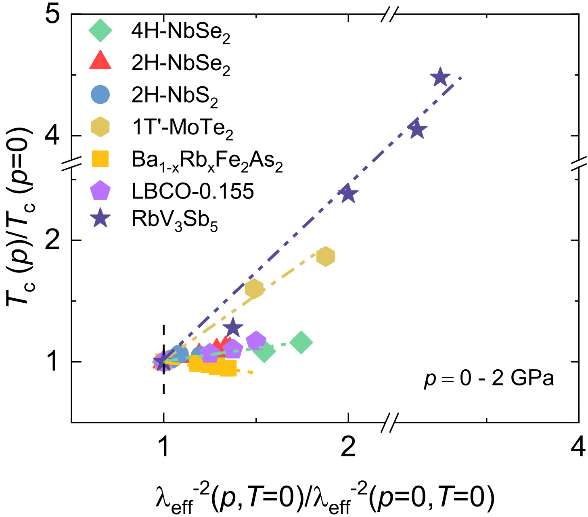
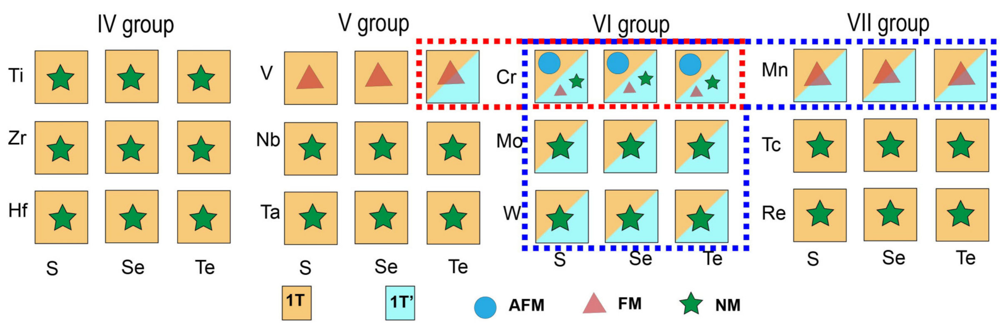

---
tags:
  - type/figure-collection
---

# 电子结构与输运：CDW与输运性质

> 属于 [[electronic-bands|电子结构与输运]]

## 条目

### 1. 式2 Σ1 对称原子位移 δR=Σ_Q u cos(Q·R+φ) Q̂

*   **来源**：[[../papers/Barnett2006coexistence]]
*   **图示描述**：中子衍射确定的 Σ1 对称三倍周期 CDW 原子位移，Q 取 b₁/3、b₂/3、−(b₁+b₂)/3 三个波矢，u 为振幅、φ 为整体相位。
*   **关键特征**：位移大小与 φ 无关，故弹性能不依赖相位；对任意 φ，总有一套子格位移为零；基态相位由导带能量极小唯一确定。

### 2. eq_1

*   **来源**：[[../papers/CastroNeto2001charge]]
*   **图示描述**：以上 11 个公式图片按论文推导顺序排列，构成从 f 波 CDW 微观模型到狄拉克电子、压电耦合、边缘费米液体自能、声子配对、量子临界点与 KT 超导转变的完整方程链；公式 (10) 为有限温序参量表达式，原始笔记未截图。
*   **关键特征**：(1) ImΣ = τ₀⁻¹ + αT + γ|ω|（τ₀⁻¹=27 meV, α=2.14, γ=0.212）在 |ω|<60 meV 成立；(2) 紧束缚矩阵元 g_λ(k,q) 证明 g(k,Q₁) 沿节线为零；(4) H_D = v_F k_⊥ σ_z + v_0 k_∥ σ_x 给出各向异性狄拉克色散 ε=±√(v_F²k_⊥²+v_0²k_∥²)；(6) H_C = κ∫Φ ΣΨ†Ψ 描述压电耦合；(11) |Δ_s(0,g)| = 4πv_F v_0(1/g_c − 1/g) 仅当 g>g_c=4π^{3/2}√(v_F v_0)/Λ 时非零，定义 QCP；(12) T_KT = πσ_s/(2m*) 中 σ_s ∝ |Δ_s(0,g)|² 给出 KT 转变。

### 3. eq_2

*   **来源**：[[../papers/CastroNeto2001charge]]
*   **图示描述**：以上 11 个公式图片按论文推导顺序排列，构成从 f 波 CDW 微观模型到狄拉克电子、压电耦合、边缘费米液体自能、声子配对、量子临界点与 KT 超导转变的完整方程链；公式 (10) 为有限温序参量表达式，原始笔记未截图。
*   **关键特征**：(1) ImΣ = τ₀⁻¹ + αT + γ|ω|（τ₀⁻¹=27 meV, α=2.14, γ=0.212）在 |ω|<60 meV 成立；(2) 紧束缚矩阵元 g_λ(k,q) 证明 g(k,Q₁) 沿节线为零；(4) H_D = v_F k_⊥ σ_z + v_0 k_∥ σ_x 给出各向异性狄拉克色散 ε=±√(v_F²k_⊥²+v_0²k_∥²)；(6) H_C = κ∫Φ ΣΨ†Ψ 描述压电耦合；(11) |Δ_s(0,g)| = 4πv_F v_0(1/g_c − 1/g) 仅当 g>g_c=4π^{3/2}√(v_F v_0)/Λ 时非零，定义 QCP；(12) T_KT = πσ_s/(2m*) 中 σ_s ∝ |Δ_s(0,g)|² 给出 KT 转变。

### 4. eq_3

*   **来源**：[[../papers/CastroNeto2001charge]]
*   **图示描述**：以上 11 个公式图片按论文推导顺序排列，构成从 f 波 CDW 微观模型到狄拉克电子、压电耦合、边缘费米液体自能、声子配对、量子临界点与 KT 超导转变的完整方程链；公式 (10) 为有限温序参量表达式，原始笔记未截图。
*   **关键特征**：(1) ImΣ = τ₀⁻¹ + αT + γ|ω|（τ₀⁻¹=27 meV, α=2.14, γ=0.212）在 |ω|<60 meV 成立；(2) 紧束缚矩阵元 g_λ(k,q) 证明 g(k,Q₁) 沿节线为零；(4) H_D = v_F k_⊥ σ_z + v_0 k_∥ σ_x 给出各向异性狄拉克色散 ε=±√(v_F²k_⊥²+v_0²k_∥²)；(6) H_C = κ∫Φ ΣΨ†Ψ 描述压电耦合；(11) |Δ_s(0,g)| = 4πv_F v_0(1/g_c − 1/g) 仅当 g>g_c=4π^{3/2}√(v_F v_0)/Λ 时非零，定义 QCP；(12) T_KT = πσ_s/(2m*) 中 σ_s ∝ |Δ_s(0,g)|² 给出 KT 转变。

### 5. eq_4

*   **来源**：[[../papers/CastroNeto2001charge]]
*   **图示描述**：以上 11 个公式图片按论文推导顺序排列，构成从 f 波 CDW 微观模型到狄拉克电子、压电耦合、边缘费米液体自能、声子配对、量子临界点与 KT 超导转变的完整方程链；公式 (10) 为有限温序参量表达式，原始笔记未截图。
*   **关键特征**：(1) ImΣ = τ₀⁻¹ + αT + γ|ω|（τ₀⁻¹=27 meV, α=2.14, γ=0.212）在 |ω|<60 meV 成立；(2) 紧束缚矩阵元 g_λ(k,q) 证明 g(k,Q₁) 沿节线为零；(4) H_D = v_F k_⊥ σ_z + v_0 k_∥ σ_x 给出各向异性狄拉克色散 ε=±√(v_F²k_⊥²+v_0²k_∥²)；(6) H_C = κ∫Φ ΣΨ†Ψ 描述压电耦合；(11) |Δ_s(0,g)| = 4πv_F v_0(1/g_c − 1/g) 仅当 g>g_c=4π^{3/2}√(v_F v_0)/Λ 时非零，定义 QCP；(12) T_KT = πσ_s/(2m*) 中 σ_s ∝ |Δ_s(0,g)|² 给出 KT 转变。

### 6. eq_5

*   **来源**：[[../papers/CastroNeto2001charge]]
*   **图示描述**：以上 11 个公式图片按论文推导顺序排列，构成从 f 波 CDW 微观模型到狄拉克电子、压电耦合、边缘费米液体自能、声子配对、量子临界点与 KT 超导转变的完整方程链；公式 (10) 为有限温序参量表达式，原始笔记未截图。
*   **关键特征**：(1) ImΣ = τ₀⁻¹ + αT + γ|ω|（τ₀⁻¹=27 meV, α=2.14, γ=0.212）在 |ω|<60 meV 成立；(2) 紧束缚矩阵元 g_λ(k,q) 证明 g(k,Q₁) 沿节线为零；(4) H_D = v_F k_⊥ σ_z + v_0 k_∥ σ_x 给出各向异性狄拉克色散 ε=±√(v_F²k_⊥²+v_0²k_∥²)；(6) H_C = κ∫Φ ΣΨ†Ψ 描述压电耦合；(11) |Δ_s(0,g)| = 4πv_F v_0(1/g_c − 1/g) 仅当 g>g_c=4π^{3/2}√(v_F v_0)/Λ 时非零，定义 QCP；(12) T_KT = πσ_s/(2m*) 中 σ_s ∝ |Δ_s(0,g)|² 给出 KT 转变。

### 7. eq_6

*   **来源**：[[../papers/CastroNeto2001charge]]
*   **图示描述**：以上 11 个公式图片按论文推导顺序排列，构成从 f 波 CDW 微观模型到狄拉克电子、压电耦合、边缘费米液体自能、声子配对、量子临界点与 KT 超导转变的完整方程链；公式 (10) 为有限温序参量表达式，原始笔记未截图。
*   **关键特征**：(1) ImΣ = τ₀⁻¹ + αT + γ|ω|（τ₀⁻¹=27 meV, α=2.14, γ=0.212）在 |ω|<60 meV 成立；(2) 紧束缚矩阵元 g_λ(k,q) 证明 g(k,Q₁) 沿节线为零；(4) H_D = v_F k_⊥ σ_z + v_0 k_∥ σ_x 给出各向异性狄拉克色散 ε=±√(v_F²k_⊥²+v_0²k_∥²)；(6) H_C = κ∫Φ ΣΨ†Ψ 描述压电耦合；(11) |Δ_s(0,g)| = 4πv_F v_0(1/g_c − 1/g) 仅当 g>g_c=4π^{3/2}√(v_F v_0)/Λ 时非零，定义 QCP；(12) T_KT = πσ_s/(2m*) 中 σ_s ∝ |Δ_s(0,g)|² 给出 KT 转变。

### 8. eq_7

*   **来源**：[[../papers/CastroNeto2001charge]]
*   **图示描述**：以上 11 个公式图片按论文推导顺序排列，构成从 f 波 CDW 微观模型到狄拉克电子、压电耦合、边缘费米液体自能、声子配对、量子临界点与 KT 超导转变的完整方程链；公式 (10) 为有限温序参量表达式，原始笔记未截图。
*   **关键特征**：(1) ImΣ = τ₀⁻¹ + αT + γ|ω|（τ₀⁻¹=27 meV, α=2.14, γ=0.212）在 |ω|<60 meV 成立；(2) 紧束缚矩阵元 g_λ(k,q) 证明 g(k,Q₁) 沿节线为零；(4) H_D = v_F k_⊥ σ_z + v_0 k_∥ σ_x 给出各向异性狄拉克色散 ε=±√(v_F²k_⊥²+v_0²k_∥²)；(6) H_C = κ∫Φ ΣΨ†Ψ 描述压电耦合；(11) |Δ_s(0,g)| = 4πv_F v_0(1/g_c − 1/g) 仅当 g>g_c=4π^{3/2}√(v_F v_0)/Λ 时非零，定义 QCP；(12) T_KT = πσ_s/(2m*) 中 σ_s ∝ |Δ_s(0,g)|² 给出 KT 转变。

### 9. eq_8

*   **来源**：[[../papers/CastroNeto2001charge]]
*   **图示描述**：以上 11 个公式图片按论文推导顺序排列，构成从 f 波 CDW 微观模型到狄拉克电子、压电耦合、边缘费米液体自能、声子配对、量子临界点与 KT 超导转变的完整方程链；公式 (10) 为有限温序参量表达式，原始笔记未截图。
*   **关键特征**：(1) ImΣ = τ₀⁻¹ + αT + γ|ω|（τ₀⁻¹=27 meV, α=2.14, γ=0.212）在 |ω|<60 meV 成立；(2) 紧束缚矩阵元 g_λ(k,q) 证明 g(k,Q₁) 沿节线为零；(4) H_D = v_F k_⊥ σ_z + v_0 k_∥ σ_x 给出各向异性狄拉克色散 ε=±√(v_F²k_⊥²+v_0²k_∥²)；(6) H_C = κ∫Φ ΣΨ†Ψ 描述压电耦合；(11) |Δ_s(0,g)| = 4πv_F v_0(1/g_c − 1/g) 仅当 g>g_c=4π^{3/2}√(v_F v_0)/Λ 时非零，定义 QCP；(12) T_KT = πσ_s/(2m*) 中 σ_s ∝ |Δ_s(0,g)|² 给出 KT 转变。

### 10. eq_9

*   **来源**：[[../papers/CastroNeto2001charge]]
*   **图示描述**：以上 11 个公式图片按论文推导顺序排列，构成从 f 波 CDW 微观模型到狄拉克电子、压电耦合、边缘费米液体自能、声子配对、量子临界点与 KT 超导转变的完整方程链；公式 (10) 为有限温序参量表达式，原始笔记未截图。
*   **关键特征**：(1) ImΣ = τ₀⁻¹ + αT + γ|ω|（τ₀⁻¹=27 meV, α=2.14, γ=0.212）在 |ω|<60 meV 成立；(2) 紧束缚矩阵元 g_λ(k,q) 证明 g(k,Q₁) 沿节线为零；(4) H_D = v_F k_⊥ σ_z + v_0 k_∥ σ_x 给出各向异性狄拉克色散 ε=±√(v_F²k_⊥²+v_0²k_∥²)；(6) H_C = κ∫Φ ΣΨ†Ψ 描述压电耦合；(11) |Δ_s(0,g)| = 4πv_F v_0(1/g_c − 1/g) 仅当 g>g_c=4π^{3/2}√(v_F v_0)/Λ 时非零，定义 QCP；(12) T_KT = πσ_s/(2m*) 中 σ_s ∝ |Δ_s(0,g)|² 给出 KT 转变。

### 11. eq_11

*   **来源**：[[../papers/CastroNeto2001charge]]
*   **图示描述**：以上 11 个公式图片按论文推导顺序排列，构成从 f 波 CDW 微观模型到狄拉克电子、压电耦合、边缘费米液体自能、声子配对、量子临界点与 KT 超导转变的完整方程链；公式 (10) 为有限温序参量表达式，原始笔记未截图。
*   **关键特征**：(1) ImΣ = τ₀⁻¹ + αT + γ|ω|（τ₀⁻¹=27 meV, α=2.14, γ=0.212）在 |ω|<60 meV 成立；(2) 紧束缚矩阵元 g_λ(k,q) 证明 g(k,Q₁) 沿节线为零；(4) H_D = v_F k_⊥ σ_z + v_0 k_∥ σ_x 给出各向异性狄拉克色散 ε=±√(v_F²k_⊥²+v_0²k_∥²)；(6) H_C = κ∫Φ ΣΨ†Ψ 描述压电耦合；(11) |Δ_s(0,g)| = 4πv_F v_0(1/g_c − 1/g) 仅当 g>g_c=4π^{3/2}√(v_F v_0)/Λ 时非零，定义 QCP；(12) T_KT = πσ_s/(2m*) 中 σ_s ∝ |Δ_s(0,g)|² 给出 KT 转变。

### 12. eq_12

*   **来源**：[[../papers/CastroNeto2001charge]]
*   **图示描述**：以上 11 个公式图片按论文推导顺序排列，构成从 f 波 CDW 微观模型到狄拉克电子、压电耦合、边缘费米液体自能、声子配对、量子临界点与 KT 超导转变的完整方程链；公式 (10) 为有限温序参量表达式，原始笔记未截图。
*   **关键特征**：(1) ImΣ = τ₀⁻¹ + αT + γ|ω|（τ₀⁻¹=27 meV, α=2.14, γ=0.212）在 |ω|<60 meV 成立；(2) 紧束缚矩阵元 g_λ(k,q) 证明 g(k,Q₁) 沿节线为零；(4) H_D = v_F k_⊥ σ_z + v_0 k_∥ σ_x 给出各向异性狄拉克色散 ε=±√(v_F²k_⊥²+v_0²k_∥²)；(6) H_C = κ∫Φ ΣΨ†Ψ 描述压电耦合；(11) |Δ_s(0,g)| = 4πv_F v_0(1/g_c − 1/g) 仅当 g>g_c=4π^{3/2}√(v_F v_0)/Λ 时非零，定义 QCP；(12) T_KT = πσ_s/(2m*) 中 σ_s ∝ |Δ_s(0,g)|² 给出 KT 转变。

### 13. 图2 近公度相实空间结构：(a) δρ(r) 与黄色虚线标出的 Kagome DC 网络；(b,c) 相位 π 滑移与振幅在 DC 处下降>30%；(d,e) Φ(r) 局域于 DC，Kagome 顶点处峰值约为单条 DC 上的两倍

*   **来源**：[[../papers/Chen2019superconductivity]]
*   **图示描述**：在 E=2.2, t=−1.7（图1星号点，靠近 C-CDW 边界）给出 NC 相实空间纹理：(a) 电荷密度调制 δρ(r) 二维彩图，(b,c) 沿白色竖直截线的序参量 ψ_j=φ_j e^{iθ_j} 相位与振幅，(d,e) 同一区域内超导序参量 Φ(r) 的二维分布与线扫。
*   **关键特征**：黄色虚线标出 DC（畴壁）构成叠加于 C-CDW 上的二维 Kagome 超晶格，周期 L=√3a/(ηδ)；相位 θ_j 呈阶梯状周期性滑移 π（对应 ν=1/2 公度条件），振幅 φ_j 在每条 DC 处下降超过 30%；Φ(r) 完全跟随 DC 网络，C 畴内 X1 点 Φ=0，单条 DC 上 X2 点出现峰值，两条 DC 相交的 Kagome 顶点 X3 点 Φ(X3)≈2Φ(X2)。

### 14. 式1 σ_sc∝λ^-2=(4πn_s e²/m*c²)/(1+ξ/l)

*   **来源**：[[../papers/Islam2025enhancement]]
*   **图示描述**：μSR 弛豫率 σ_sc 与伦敦穿透深度 λ_eff、超流密度 n_s/m* 之间的核心关系式，其中 ξ 为超导相干长度、l 为正常态平均自由程。
*   **关键特征**：清洁极限 ξ/l→0 下分母趋于 1，σ_sc∝λ⁻²∝n_s/m*；作者由 G-L 关系 ξ=√(Φ₀/2πH_c2) 与已知 H_c2 估算 ξ≈3.5 nm（4H-NbSe₂）、ξ∥ab≈3.8 nm（2H-NbS₂），并基于范德华层状各向异性论证压力主要压缩层间距、面内 l 近似不变，故体系在研究压力范围内始终接近清洁极限。

### 15. 图2 4H-NbSe2压力-温度相图：纵向电阻、霍尔符号反转、磁阻、Tc/T_CDW/T*汇总

*   **来源**：[[../papers/Islam2025enhancement]]
*   **图示描述**：四面板磁输运结果——(a) 0–2.1 GPa 下纵向电阻 R(T)、(b) 霍尔电阻 ρ_H(T)、(c) 9 T 下磁阻 MR(T)、(d) 汇总出的 T-p 相图，并叠加 2H-NbSe₂ 数据作对比。
*   **关键特征**：(a) 中 T_c 随压力从 6.3 K 缓升至 7.3 K（约 +15%）；(b) 中常压下霍尔信号在 T*≈55 K 由负（电子型）转正（空穴型），是 CDW 诱导费米面重构、出现空穴口袋的标志；(c) 中磁阻在 T_CDW≈55 K 以下上升，独立佐证 CDW 转变；(d) 中 T_CDW/T* 在 2.1 GPa 内仅下降约 20%（55→45 K），与 2H-NbSe₂ 的压制幅度相近。

### 16. 图4 不同压力下归一化超流密度；λ_eff^-2(0)增幅4H=75%/2H=32%/NbS2=20%，Tc仅温和上升

*   **来源**：[[../papers/Islam2025enhancement]]
*   **图示描述**：全文核心结果图。(a)(b) 分别为 4H-NbSe₂ 与 2H-NbS₂ 在多个压力下归一化到零压零温值的 σ_sc(T)/σ_sc(0)；(c) 归一化零温超流密度 λ_eff⁻²(0) 随压力变化，叠加 2H-NbSe₂；(d) 三种材料 T_c 随压力变化。
*   **关键特征**：在 2.05 GPa 下 4H-NbSe₂ 的 n_s/m* 增加 75%，2H-NbSe₂ 在 2.2 GPa 增加 32%，无 CDW 的 2H-NbS₂ 在 1.8 GPa 仍增加 20%；双能隙权重几乎不随压力变化（ω≈0.54/0.52），(s+s)-波模型可拟合全部压力数据；T_c 增幅分别仅为 0.94 K（16%）、0.76 K（11%）、0.28 K（5%），与 n_s/m* 剧变严重失配；两个超导能隙 Δ₁、Δ₂ 在整个压力范围基本不变（见 SM 图 S3）。

### 17. 图5 RbV3Sb5与各类超导体的Uemura标度对比

*   **来源**：[[../papers/Islam2025enhancement]]
*   **图示描述**：横轴为归一化的有效穿透深度平方倒数λ_eff⁻²，纵轴为归一化临界温度Tc，展示RbV3Sb5在0–2 GPa加压下相对Bose-Einstein凝聚线与Uemura线性标度的偏离。
*   **关键特征**：RbV3Sb5（紫色星号）在高压下Tc/Tc(p=0)升至约4.5、λ_eff⁻²归一化值达3–4，明显脱离常规与非常规超导体聚集的(1,1)附近区域，表明加压同时增强了超流密度与配对强度。

### 18. 图4 TaSe₂ 的 χ′′(q)（嵌套峰位于错误波矢）与 χ′(q)（弱峰位于正确 q_CDW）对比

*   **来源**：[[../papers/Johannes2008fermi]]
*   **图示描述**：TaSe₂ 在 q_x–q_y 平面上的二维彩色图，左为虚部极化率 χ′′(q)（即嵌套函数），右为实部极化率 χ′(q)；亮度代表强度。
*   **关键特征**：χ′′ 的最强嵌套峰位于远离 q_CDW=(1/3,0,0) 的波矢（与 NbSe₂ 类似，约在 (1/3,1/3,0)）；χ′ 在 q_CDW 处出现弱峰，但该峰来自有限能量电子跃迁而非费米面几何；χ′′ 与 χ′ 的峰位置解耦。

### 19. 图7 CeTe₃ 的 χ′′(q) 最强峰在 q_nest 而 χ′(q) 最强峰在 q_CDW，二者解耦

*   **来源**：[[../papers/Johannes2008fermi]]
*   **图示描述**：CeTe₃ 在 q_x–q_y 平面上的 χ′′(q)（上图）与 χ′(q)（下图）彩色图；箭头分别标出 q_nest（来自图6b 的完美几何嵌套）与 q_CDW 的位置。
*   **关键特征**：χ′′ 最强峰位于 q_nest，而同一位置在 χ′ 中完全消失；q_CDW 处 χ′′ 几乎无特征，χ′ 却出现清晰峰；χ′ 峰高的主要贡献来自远离 E_F 的有限能量跃迁，而非费米面嵌套。

### 20. 图4 轨道成分导致C4对称性破缺的费曼图

*   **来源**：[[../papers/Kang2012dimer]]
*   **图示描述**：在 PoDW 与 SDW 序参量取等的前提下，给出贡献磁化率差 δχ = χ(q⃗_a+M⃗_2) − χ(q⃗_b+M⃗_1) 的主要费曼图，上排两张图贡献 χ(q⃗_a)、下排两张图贡献 χ(q⃗_b)，并标出顶点处的轨道重叠因子。
*   **关键特征**：ey 主要为 d_xz 轨道、ex 主要为 d_yz 轨道，h1/h2 含角度依赖的轨道混合，使两方向散射顶点分别携带 cos²θ 与 sin²θ 因子；即使两种密度波几何对称、Δ_PoDW = Δ_SDW，顶点差异仍导致 χ(q_a) ≠ χ(q_b)，从而自发打破 C4 对称。

### 21. 图5 PoDW与SDW共存时的电荷磁化率

*   **来源**：[[../papers/Kang2012dimer]]
*   **图示描述**：三轨道模型在 Δ_PoDW = 20 meV、Δ_SDW = 15 meV 共存条件下计算得到的 χ_c(k⃗) 二维分布图，模拟更接近低温母体的状态。
*   **关键特征**：(0, ±π) 和 (±π, 0) 处的传统嵌套峰均被抑制；在 (±0.4π, ±π) 附近出现两个小峰，且两者强度明显不对称，χ(q⃗_a+M⃗_2) 强于 χ(q⃗_b+M⃗_1)，再次打破 C4 对称；这种不对称直接把倒空间磁化率翻译成实空间二聚体沿 a 轴排列的取向。

### 22. 图1 BdG 中无序/CDW/超导配对振幅的实空间分布，团簇与随机构型对比

*   **来源**：[[../papers/Koley2020charge]]
*   **图示描述**：在 41×41 二维正方晶格上，按行对比四种无序构型下三列物理量的空间分布——第一列无序势 V_i、第二列 CDW 序（以载流子密度调制 ξ_i 表示）、第三列超导配对振幅 Δ_SC；所有能量以跃迁能 t 为单位。
*   **关键特征**：V_d=0 时 CDW 呈强棋盘状、SC 几乎为零；团簇无序 V_d=6 将 CDW 撕裂为碎块，并在无序区涌现出明显的"超导岛"；同强度随机无序（浓度 10%）下 SC 岛小而分散，即使浓度提到 40%，促进 SC 的效果仍弱于团簇无序；岛的尺寸即为超导相干长度的量度。

### 23. 图2 Δ_CDW 与 Δ_SC 随无序强度 Vd 的演化（团簇 vs 随机）

*   **来源**：[[../papers/Koley2020charge]]
*   **图示描述**：横轴为无序强度 V_d（单位 t），纵轴为构型平均后的序参量幅值；(a) 团簇无序、(b) 随机无序，红/蓝曲线分别为 Δ_CDW 与 Δ_SC。
*   **关键特征**：两种构型下 Δ_CDW 均随 V_d 单调下降、Δ_SC 单调上升，在 V_d≈7 附近交叉共存；团簇无序中 Δ_SC 上升更快、高强度下超过 Δ_CDW，随机无序中 Δ_SC 上升明显更平缓。

### 24. 图3 不同 Q 矢下载流子密度调制 ξi 的 CDW 空间图案

*   **来源**：[[../papers/Koley2020charge]]
*   **图示描述**：四个子图 (a)–(d) 分别展示 CDW 波矢 (Q_x,Q_y)=(1,1)、(0.75,0.75)、(0.5,0.5)、(0.25,0.25)（单位 π/a）下，载流子密度调制 ξ_i 在 41×41 晶格上的空间图案。
*   **关键特征**：(1,1) 为短波棋盘状、密度起伏最剧烈；随 Q 减小周期增大、图案趋于平缓；短波 CDW 强烈压制 SC，长波 CDW 在无无序时几乎不抑制 SC。

### 25. 图6 DMFT 电阻率随温度变化（x=0 与 x=1）及 TaSeS 超导序参量的 BCS 拟合

*   **来源**：[[../papers/Koley2020charge]]
*   **图示描述**：(a) 主图为 DMFT 归一化电阻率随温度 T（K）的变化，蓝/红曲线对应 x=0（2H-TaSe₂）与 x=1（TaSeS），上下插图分别放大 120 K 与 5 K 附近；(b) 为 TaSeS 的超导序参量 Δ_SC 随温度变化，绿点为计算值、红线为 (1−T/T_c)^(1/2) 拟合。
*   **关键特征**：x=0 在约 120 K 出现电阻率斜率变化（非公度 CDW 起始），90 K 公度 CDW 在电阻率上无异常；x=1 无 CDW 特征、高温呈线性电阻、约 5 K 电阻率陡降；Δ_SC 在约 4.5 K 趋于零并符合 BCS 平均场行为。

### 26. 图6 2H-TaSe2的广义磁化率χ(q)

*   **来源**：[[../papers/Laverock2005fermi]]
*   **图示描述**：倒空间波矢q自0至1 a*的广义电子磁化率χ(q)曲线，q=0处的发散已作截断处理。
*   **关键特征**：χ(q)在q≈0.22–0.25 a*出现显著峰（约0.5任意单位），与实验观测的2×2 CDW波矢一致，说明该CDW可由费米面嵌套驱动的电子磁化率峰解释。

### 27. 图2：(a)静态磁化率最大特征值在Q=(π/4,π/4)处主峰；(b-d)动态磁化率迹虚部随U增大在Q点软化

*   **来源**：[[../papers/Makogon2012wave]]
*   **图示描述**：本图分四个子图，给出多体相互作用导致的静态失稳与动态软模证据。(a) 为矩阵 ηχ_k(0) 最大特征值 λ_k 在整个布里渊区（k_+, k_- 平面）上的三维分布图，计算参数 φ=π/4、Ω_R=2t、Ω_rf=4t、μ=t、k_BT=10⁻³t，网格 240×240；(b)–(d) 为 k_x=0（即 k_+=−k_-）截面上动态磁化率迹的虚部 Tr[Im χ^RPA_k(ω)] 在 k_y–ω 平面上的对数标度图，解析延拓取 κ=10⁻²，三图分别对应 U=0、U/t=2.60(3)、U/t=2.89(3)。
*   **关键特征**：(a) 中最高主峰位于 Q=(π/4,π/4)，λ_Q=0.345(3)，由 Stoner 型判据 U_c⁻¹=max_k λ_k 得临界相互作用 U_c/t=2.89(3)，该峰对应特征向量 V_Q 兼具反铁磁特征且为 SDW 与 CDW 的混合，即 SCDW；周围衍射图案般的次级峰是方圆形费米面其他近似嵌套通道的反映；对比计算显示若只计入自旋通道则 U_c/t=2.13(3)（明显偏低），只计入电荷通道在排斥 U>0 下根本无失稳，说明自旋-电荷耦合不可缺。(b) U=0 时仅见从原点出发的线性色散朗道零声；(c) U/t=2.60(3) 时在 πk_y/k_r=π/4（即 Q 点）从零能萌发出第二支线性色散模式；(d) U/t=2.89(3) 时该模式在 ω=0 处谱权重急剧增大、能量软化至零，成为软模，标志二级相变发生；ω 以 t 为单位，谱权重为对数刻度。

### 28. M-H loops of BLFO nanoparticles

*   **来源**：[[../papers/Perugu2024morphology]]
*   **图示描述**：(a) 为室温下磁化强度 M（emu/g）随外加磁场 H（Oe）的完整磁滞回线，(b) 为低场区 LAS 放大图，用于读出剩磁 Mr 和矫顽力 Hc，四条曲线对应 x=0.2–0.8。
*   **关键特征**：所有回线狭窄、未完全线性，表现为弱铁磁性而非纯反铁磁；饱和磁化强度 Ms 由 13.2 emu/g（x=0.2）单调升至 21.5 emu/g（x=0.8）；矩形比 Mr/Ms 在 0.261–0.494 之间，全部 <0.5，判定为多畴磁性纳米颗粒；Hc 在 439.3–758.4 Oe 之间无系统变化；各向异性常数 K1=Hc·Ms/0.96 介于 6845–12640 erg/cm³，磁矩 nB=M.W.·Ms/5585 由 3.41 降至 2.55 μ_B/f.u.（因分子量下降）。

### 29. 图2 (BEDT-TTF)₁.₅CuCl₂ 磁化率随温度变化，4–50 K 服从居里-外斯定律，50 K 以上偏离

*   **来源**：[[../papers/Unknown2003charge]]
*   **图示描述**：横轴为温度 T（K，约 4–300 K），纵轴为摩尔磁化率 χ（emu/mol），曲线展示样品从低温到室温的顺磁响应及居里-外斯拟合区间。
*   **关键特征**：4–50 K 出现典型"居里尾巴"，χ 随降温急剧上升，符合 χ = C/(T−θ)；Cl 化物拟合得 C = 0.39、θ = −0.9 K，Br 化物 C = 0.53、θ = +0.9 K（见原文表 1），C 值更大定量印证 Br 化物含更多局域 Cu(II) 磁矩；50 K 以上偏离居里-外斯行为，作者以 χ(T) = χ_Cu(II) + χ_TTF⁺ + δ(T) 描述，δ(T) 代表 BEDT-TTF⁺ 间交换/反铁磁相互作用；室温 μeff = 1.26 BM（Cl）、1.22 BM（Br），均低于单未配对电子纯自旋值 1.73 BM。

### 30. 图2 极性金属研究时间线（1965 Anderson-Blount → 2013 LiOsO₃ → 2018 WTe₂）及奇异性质概览

*   **来源**：[[../papers/bhowalPolarMetalsPrinciples2023b]]
*   **图示描述**：左侧时间线标注自 1965 年 Anderson & Blount 理论预言到 2013 年 LiOsO₃、2018 年 WTe₂ 实验突破的关键节点；右侧以图标形式枚举极性金属承载的奇异物性。
*   **关键特征**：列举的物性包括 kx–ky 动量空间中带自旋纹理的 Rashba 耦合、Weyl 节点能带拓扑、温差驱动电流 J 的热电效应、电流 I 感应磁化 M 的磁电效应、电场 E/磁场 B 交叉控制 P/M 的多铁性，以及非常规超导；时间线跨度约半世纪，呈现长期沉寂后近十年的"爆发式"发展。

### 31. 图9 LiOsO₃ 极性相 Dirac 点→节线环演化、贝里曲率偶极子/NHE 机制、SrTiO₃ 铁电超导相图

*   **来源**：[[../papers/bhowalPolarMetalsPrinciples2023b]]
*   **图示描述**：四个子图展示极性金属平台的拓扑与量子物性：(a,b) LiOsO₃ 非极性相与极性相在 L 点附近的能带对比，(c) 贝里曲率偶极子导致非线性霍尔效应的费米面示意，(d) SrTiO₃ 中铁电与超导共存的示意相图。
*   **关键特征**：非极性 LiOsO₃ 在 T 点由非简单滑移镜面保护线性/立方 Dirac 点；进入极性 R3c 相后反演破缺使 L 处 Dirac 点退化为包围 L 的节线环；图 (c) 平衡时 ±k 处贝里曲率 Ω(k) = −Ω(−k) 相消，加电场 E 后费米面位移 a_s 导致净贝里曲率与二倍频霍尔电流 j_a^{2ω}；图 (d) 中 Ca 掺杂/同位素替代/应变调节 SrTiO₃ 的铁电量子临界点，超导 T_c 在该临界点附近被增强。

### 32. Mn 的分波与投影函数

*   **来源**：[[../papers/blochlProjectorAugmentedwaveMethod1994b]]
*   **图示描述**：采用 2×3 子图布局，左列 (a)-(c) 对比 Mn 原子 s、p、d 三个角动量通道的全电子（AE，实线）与赝（PS，虚线/点划线）分波，右列 (d)-(f) 给出对应通道的第一、第二投影函数；横轴为到核距离 r（单位 a₀），纵轴为函数值。
*   **关键特征**：AE 分波在核附近剧烈振荡，体现全电子波函数的节点结构；PS 分波在增强区域外与 AE 完全重合、在核附近被平滑化；投影函数严格局域在增强区域内，其形状与对应 PS 分波相关联；Mn 的 3s、3p 被当作价态（半芯态）显式处理。

### 33. Mn 原子波函数精度

*   **来源**：[[../papers/blochlProjectorAugmentedwaveMethod1994b]]
*   **图示描述**：2×3 子图，上排 (a)-(c) 对应价带能量 ε=−8.16 eV、下排 (d)-(f) 对应高能 ε=+13.61 eV，每图给出 PAW 重构的 AE 波函数（实线）、径向薛定谔方程精确解（圆点）、差值放大 10 倍（点划线）及 PS 波函数（虚线）；横轴 r（a₀），s、p、d 通道分列。
*   **关键特征**：价带能区 PAW 重构波函数与精确解几乎完全重合，相对误差 <1%；高能区 s 通道在核附近低估极大值、偏差约 15%，而 p、d 通道仍保持高精度；PS 波函数在核附近显著平滑、在增强区外与 AE 一致。

### 34. 图3 3d能级分离、静电势、ELF与半金属/半导体机制示意

*   **来源**：[[../papers/chen3dLevelSymmetry2025]]
*   **图示描述**：(a)–(c) Mn2NO2、Mn2NOF、Mn2NOCl 的 Mn 3d 自旋多数投影能带（PBAND），颜色编码轨道贡献；(d)–(f) 对应的面外平均静电势曲线叠加电子局域函数（ELF）切片，黑圈标出 Mn-F/Mn-Cl 键区；(g)、(h) 为半金属 Mn2NO2 与半导体 Mn2NOF 的离子-轨道填充示意图，红箭头表示 Mn 给出的电子。
*   **关键特征**：Mn2NO2 的 eI 在 Γ、S 点形成电子口袋、eII 穿越 EF，两侧 Mn 均为 Mn3.5+（d3.5，磁矩约 3.5 μB），最高 eI 被 0.5 个电子部分填充；Mn2NOF 中 MnO-eI 上移为空的 CBM、MnF-eI 下移为满的 VBM，费米能级卡在两者之间打开带隙，对应 Mn4+ 低自旋 d3（MnO，3.624 μB）与 Mn2+ 高自旋 d5（MnF，4.480 μB）；Mn2NOF 的静电势显著不对称、Mn-F 与 F 侧 Mn-N 键区 ELF 降低，而 Mn2NOCl 电势近对称、两侧 Mn-N 的 ELF 相近；Mn2NOOH 因 OH⁻ 吸电子能力弱于 F⁻，能级分离较小故带隙更小。

### 35. 图4 电子/空穴掺杂诱导Mn2NOF半导体→半金属转变的PBAND

*   **来源**：[[../papers/chen3dLevelSymmetry2025]]
*   **图示描述**：(a) 电子掺杂 0.02 e⁻/atom 与 (b) 空穴掺杂 0.02 h⁺/atom 下 Mn2NOF 中 O 侧 Mn（MnO）与 F 侧 Mn（MnF）的自旋多数投影能带，(b)、(c) 位置分别插入电子（蓝箭头）填入 MnO-eI、空穴（橙箭头）清空 MnF-eI 的轨道示意图。
*   **关键特征**：电子掺杂把额外电子填入原本空的 MnO-eI（Γ–X 之间的电子口袋），CBM 下移穿过 EF，MnO 双重态 eI(dyz+dxz) 变为部分填充；空穴掺杂则清空原本全满的 MnF-eI，VBM 上移穿过 EF；两种掺杂都不引起两侧 Mn 之间的电荷再分配，只是在最高 eI 能级上加减电子；极小掺杂浓度（0.02 carrier/atom）即可闭合带隙。

### 36. 图5 第IV–VII族TMDs中1T′ FM/NM CDW相及其形成机制（二聚化 vs 超交换）全景图，CrX₂位于两类机制交叉点

*   **来源**：[[../papers/chenFerromagneticNonmagnetic1T2022]]
*   **图示描述**：以过渡金属族（IV–VII）与硫族元素排列的周期表式总图，汇总已报道的1T′ NM-CDW与FM-CDW相，并用半透明色块标注两类FM-CDW形成机制对应的材料区域。
*   **关键特征**：NM-CDW主要集中于第VI族（价电子数最易触发Peierls畸变）；FM-CDW出现在含3d磁性金属V、Cr、Mn的第一行；半透明蓝框对应M-M二聚化机制（MnX₂），绿框对应直接交换→超交换机制（CrX₂、VTe₂）；CrX₂家族恰好落在两类机制区域的交叉点。

### 37. 表II 1T与1T′相中各原子磁矩，证实FM相中硫族原子出现反平行诱导磁矩（超交换特征）

*   **来源**：[[../papers/chenFerromagneticNonmagnetic1T2022]]
*   **图示描述**：表格列出CrX₂、VTe₂、MnX₂等体系在1T与1T′相中金属原子与硫族原子各自的磁矩（μB），用于对比直接交换与超交换/二聚化机制下磁矩的再分配。
*   **关键特征**：1T-AFM相中硫族原子磁矩接近零（直接交换特征）；1T′ FM相中CrX₂的Cr与X磁矩同时增大但方向相反（如CrS₂：Cr约2.189 μB，S约−0.135 μB），VTe₂中V由约1.102 μB升至1.315 μB、Te由0升至约0.08 μB，均为超交换指纹；MnX₂中Mn磁矩由1T相约2.9 μB降至1T′相约1.1 μB，硫族原子磁矩变化较小，符合二聚化机制。

### 38. 图2 CDW模频率温度依赖性

*   **来源**：[[../papers/chowdhuryReviewTheoreticalComputational]]
*   **图示描述**：横轴温度（K）、纵轴拉曼频移（cm⁻¹），对比 2H-TaS₂ 79 cm⁻¹ CDW 模频率随温度的变化，红点为实验、蓝三角为沿 c 轴施加 −0.3% 压缩应变以模拟 IC-CDW 的 DFT 结果。
*   **关键特征**：CDW 模随温度升高发生红移（软化）；施加微小应力的 DFT 模型在 3×3×1 超胞内近似非公度结构，近乎完美复现实验曲线；未施加应力的模型与实验偏差大。

### 39. 图7 维度依赖CDW统一相图

*   **来源**：[[../papers/chowdhuryReviewTheoreticalComputational]]
*   **图示描述**：(a) 多种 2H-TMDs 的 CDW 转变温度随厚度（层数）变化的实验数据；(b) DFT 计算的单层 2H-MX₂ 电子-声子耦合常数 λ（无量纲）；(c) 以离子电荷转移 ΔQ_I、电子-声子耦合 λ、电子波函数空间扩展 1/⟨r²⟩ 为三轴的统一相图。
*   **关键特征**：当 ΔQ_I 与 λ 较低、而波函数空间扩展较大时，系统落入"深渊"区域允许 CDW 稳定存在；曲面之上 CDW 被禁。

### 40. 图4 ： -> [[../figures/mathematical-models-formulas|光学、输运与其他解析公式]]
 -> [[../figures/mathematical-models-formulas|光学、输运与其他解析公式]]](../../raw/figures/cossuStackingChargedensityWaves2024/fig_4_Q3DQNIFN.png)
*   **来源**：[[../papers/cossuStackingChargedensityWaves2024]]
*   **图示描述**：在 3×3 超胞上以颜色编码面内 Se-Se 键长（Å）的相对长短，依次展示图1(f)–(l) 中 HC-HC 与 HC-CC 各位移构型的"斑块"图案。
*   **关键特征**：每一类 blend 中能量最低的构型——HC-HC_(S3) 与 HC-CC_(S4)——其上下两层 Se-Se 斑块互不重叠；能量较高的位移则斑块重叠更多。作者据此推测层间 p_z 轨道相干性最大化是稳定机制。

### 41. 图1 自旋波模式示意图

*   **来源**：[[../papers/deSousa2008electrical]]
*   **图示描述**：示意双子晶格倾斜反铁磁体中两类自旋波本征模对应的磁矩运动图像，并给出后续推导所用的局部坐标系（z 轴沿铁电极化 P，y 轴沿奈尔矢量 L，M₁、M₂ 位于 x–y 平面内）。
*   **关键特征**：(a) 低频（软）模中 M₁ 与 M₂ **同相进动**，倾斜角 β 保持不变，整个磁结构作刚性旋转，净磁矩涨落 δM 沿 y 方向，是本文电控开关的主角；(b) 高频模中 M₁ 与 M₂ **反相进动**，β 被周期性调制，需克服 DM 相互作用能，频率能隙约 ω≈dP₀≈5×10¹⁰ rad/s 且近似各向同性；(c) 坐标系把 P 锁定在 z 轴、L 锁定在 y 轴，为公式 (1)–(7) 中各分量下标提供物理参照。

### 42. 图2 不同机制单相多铁材料最大极化值对比（对数轴，BiFeO3~100、LuFe2O4~25、h-YMnO3~5.6、自旋驱动<1 μC/cm²）

*   **来源**：[[../papers/fiebigEvolutionMultiferroics2016]]
*   **图示描述**：纵轴为最大自发极化值Ps（对数刻度，单位μC/cm²），按四大机制分组比较代表性单相多铁材料的极化强度。
*   **关键特征**：孤对电子BiFeO₃约100 μC/cm²居首；电荷有序LuFe₂O₄约25 μC/cm²但标注争议；几何h-YMnO₃约5.6 μC/cm²；自旋驱动类普遍<1 μC/cm²，其中共线交换伸缩约1 μC/cm²、CaMn₇O₁₂约0.3 μC/cm²、逆DM螺旋相约0.1 μC/cm²。

### 43. 图6 回旋自旋结构中的电磁振子：不同自旋激发模式对应不同极化振荡

*   **来源**：[[../papers/fiebigEvolutionMultiferroics2016]]
*   **图示描述**：灰色箭头为易平面内的回旋自旋静态结构（由逆DM产生z方向极化P），四个子图分别展示不同磁振子激发模式：(a) 平面内摆动但P不变；(b) 同时调制对称与反对称交换导致P振幅空间调制；(c)(d) 易平面绕y或z轴旋转引起P方向或振幅变化。
*   **关键特征**：仅(b)(d)类激发伴随电极化振荡，才是真正的电磁振子；最早在o-TbMnO₃/o-GdMnO₃中报道，且o-GdMnO₃中可在多铁相之外出现；GaFeO₃中相关NDD达Δα/α≈1.6×10⁻³，Ba₂CoGe₂O₇太赫兹段达Δα/α≈1。

### 44. 公式2 声子自能 Π_{qαβ}=(2/N)Σ g (f_{k+q,m}−f_{k,n})/(ε_{k+q,m}−ε_{k,n}) g*

*   **来源**：[[../papers/hallEnvironmentalControlCharge]]
*   **图示描述**：公式(2) 是理论计算的核心——波矢 q、分支 αβ 的声子自能 Π_{qαβ} = (2/N) Σ_{knm} g̃_{qα,knm} [(f(ε_{k+q,m}) − f(ε_{kn}))/(ε_{k+q,m} − ε_{kn})] g*_{qβ,knm}；裸动力学矩阵 D 来自约束 DFPT（排除低能电子子空间屏蔽），实验可观测声子由重整化矩阵 D̃ = D + Π 给出。
*   **关键特征**：分子 f(ε_{k+q,m}) − f(ε_{kn}) 是费米面嵌套敏感项，掺杂通过刚性能带移动改变它，从而移动主导失稳波矢；杂化把 T=0 阶跃占据换成 f(ε) = 1/2 − (1/π)arctan(ε/Γ)，因 arctan 多项式衰减而能让远离 E_F 的态也参与、显著压制 Π；电子-声子耦合 g 来自 DFPT/约束 DFPT，k 网格经 Wannier90/EPW 插值到 216×216 收敛。

### 45. 图1 顺磁/铁磁/反铁磁磁偶极子排列

*   **来源**：[[../papers/hillWhyAreThere2000a]]
*   **图示描述**：示意三种基本磁结构中原子磁偶极矩（小箭头）的排列方式，(a) 顺磁态方向随机，(b) 铁磁态全部平行排列，(c) 反铁磁态相邻偶极矩反向平行。
*   **关键特征**：顺磁态高温下热运动主导，宏观磁矩为零；铁磁态产生非零净磁化并可被外场翻转；反铁磁态虽微观有序但宏观磁矩相消。该图为讨论"磁性要求部分填充 d 轨道并发生自旋有序"提供直观定义。

### 46. 表2 BiMnO3含Bi 6s/6p的紧束缚参数

*   **来源**：[[../papers/hillWhyAreThere2000a]]
*   **图示描述**：表2列出对BiMnO3含Bi 6s/6p基组的紧束缚拟合参数，包括轨道能量E（如E_Bi6s≈-10.31 eV）与原子间转移积分V（如Bi 6p-O 2p σ≈-1.06 eV），单位eV。
*   **关键特征**：Bi 6p-O 2p σ转移积分强度比Bi 6s-O 2p大约30%，Bi 6p-Bi 6p σ作用也很大；这些参数将Δ1能带拟合RMS降至0.12 eV，量化了Bi-O共价杂化对BiMnO3能带的决定性作用。

### 47. 图4 考虑交换劈裂后的自旋分辨3d/4s态密度

*   **来源**：[[../papers/hillWhyAreThere2000a]]
*   **图示描述**：纵轴为能量，左右横轴分别为自旋向上与自旋向下的态密度，展示引入交换作用后3d带与4s带的自旋劈裂；多数自旋与少数自旋能带发生相对刚性位移。
*   **关键特征**：交换劈裂使上下自旋能带占据数不等，从而产生净磁矩；Ni处多数自旋3d带填满而少数自旋未填满，解释了非整数原子磁矩，也表明磁性要求d轨道部分占据。

### 48. 表2 已报道低维多铁材料汇总（含磁矩一列）

*   **来源**：[[../papers/huProgressProspectsLowdimensional2019]]
*   **图示描述**：在表1基础上增加磁矩一列，汇总约 11 种理论设计的低维多铁材料，列出极化值、方向、FE 势垒、Tc、磁矩（μB）及来源文献，并以 T/E 标注。
*   **关键特征**：卤素修饰磷烯磁矩整齐为 1.0 μB/卤素，(CrBr₃)₂Li 磁矩较大（3.0、4.0 μB）；极化强度与磁矩因设计策略不同而差异显著；许多条目 Tc 等关键参数缺失，且绝大多数标注为 T（理论预言）。

### 49. 图5 化学功能化诱导的低维多铁：卤素修饰磷烯双层、CH₂OCH₃锗烯、准一维有机金属纳米线、C₆N₈H有机网络

*   **来源**：[[../papers/huProgressProspectsLowdimensional2019]]
*   **图示描述**：四个子图给出化学功能化实现 Type-I 多铁的设计：(a) 卤素插层磷烯双层及其多铁隧道结阵列；(b) CH₂OCH₃ 配体功能化锗烯，配体旋转翻转面内偶极；(c) 准一维过渡金属-分子三明治纳米线的单侧卤素修饰；(d) C₆N₈H 有机网络中协同质子转移翻转面内极化。
*   **关键特征**：(a) 卤素同时贡献约 1.0 μB 磁矩与 11 pC/m 垂直极化，Tc ~572 K，电场翻转极化可开关自旋选择通道，实现电写磁读；(b) 配体旋转势垒约 0.1 eV，未功能化 Ge 的 p_z 轨道提供 1 μB/原子磁性；(d) H 悬挂键室温铁磁约 1 μB/H，多模式质子转移给出 10.2 μC/cm² 面内极化，氧分子辅助长程转移。

### 50. 图7 Hf₂VC₂F₂ MXene 中 120° Y 型自旋序打破反演对称产生垂直极化（Type-II 多铁）

*   **来源**：[[../papers/huProgressProspectsLowdimensional2019]]
*   **图示描述**：Hf₂VC₂F₂ MXene 单层中 V 原子构成的非共线 120° Y 型自旋螺旋，自旋矢量两两夹角 120°；该磁结构打破空间反演对称，在垂直于螺旋平面方向诱导出电极化 P。
*   **关键特征**：Type-II 多铁典型作动机制，极化完全由磁序驱动、本征强磁电耦合；极化值约 2.9×10⁻⁷ μC/m（极弱但耦合强）；预计奈尔温度约 313 K（高于室温）。

### 51. 图9 层极化自旋霍尔效应 (LP-SHE)、Berry 曲率、MoTe2/MoS2 应变调控

*   **来源**：[[../papers/kaurRecentAdvancesTheoretical2025a]]
*   **图示描述**：(a) 空穴/电子掺杂极性双层的层极化自旋霍尔效应示意；(b)(c) AB/BA 堆垛 MoTe2 的层分辨能带；(d) MoTe2 VBM 附近沿高对称线的 Berry 曲率；(f) E1 能量处自旋 Berry 曲率投影能带与 k 分辨自旋 Berry 曲率；(g)(h) 自旋霍尔电导随费米能变化及 VBM 附近放大；(i) MoS2 在外加应变下的能带变化；(j) −3% 应变下 MoS2 的 SHC。
*   **关键特征**：层间极化的内建场使上下层能带相对偏移，自旋霍尔效应仅在一层发生，翻转极化即切换发生层；−3% 应变使 MoS2 的 VBM 从 Γ 谷移至 K 谷，从而在面内电场下实现 LP-SHE，提供"层"自由度的电写磁读机制。

### 52. 表3 Cr2C/Cr2N功能化体系的磁矩与铁磁-非磁能量差

*   **来源**：[[../papers/khazaeiNovelElectronicMagnetic2013]]
*   **图示描述**：自旋极化 GGA/PBE 计算得到的 Cr₂C、Cr₂N 经 F、OH、O 官能化后的磁基态、每个 Cr 原子的磁矩（μB/Cr）以及铁磁态相对非磁态的能量差 ΔE（eV/Cr）。
*   **关键特征**：Cr₂CF₂ 磁矩 2.71 μB/Cr、ΔE = −0.12 eV/Cr；Cr₂C(OH)₂ 磁矩 2.24 μB/Cr、ΔE = −0.08 eV/Cr；Cr₂CO₂ 磁矩为 0、非磁。Cr₂NF₂ 磁矩 3.23 μB/Cr、ΔE = −0.35 eV/Cr；Cr₂N(OH)₂ 磁矩 3.01 μB/Cr、ΔE = −0.26 eV/Cr；Cr₂NO₂ 磁矩 2.50 μB/Cr、ΔE = −0.49 eV/Cr。磁性均来源于 Cr 的 d 轨道，ΔE 数值较大，预示铁磁序可能维持到近室温。

### 53. Fe/Co/Ni 块体晶格常数、体模量、磁矩对比（表V）

*   **来源**：[[../papers/kresseUltrasoftPseudopotentialsProjector1999c]]
*   **图示描述**：对铁磁 bcc Fe、hcp Co、fcc Ni 三种块体，列出 FLAPW、PAW、US-PP 给出的平衡晶格常数 a（Å）、体弹模量 B（Mbar）和局域磁矩 M₀（μ_B）；括号外为 LDA、括号内为 GGA(PBE) 结果。表 IV/VI 还分别给出原子磁化能 ΔE_m 和以 NM hcp Fe 为零点的相能差。
*   **关键特征**：(1) 原子磁化能 Fe: PAW 2.61 eV ≈ AE 2.60 eV，US-PP 高估至 2.75 eV；(2) GGA 下 bcc FM Fe 的磁矩 US-PP = 2.32 μ_B，PAW/FLAPW = 2.20 μ_B；体模量 US-PP = 1.51 Mbar，PAW/FLAPW = 1.74 Mbar；(3) 以 NM hcp Fe 为零点，bcc FM Fe 相对能量 PAW = FLAPW = −273 meV，US-PP 仅 −191 meV，偏差 80–120 meV（约 60 meV/μ_B）；(4) 把 US-PP 增强电荷截断半径收紧到 0.5 a.u.（US-AE）可复现 PAW，证明误差完全来自增强电荷伪化；Co、Ni 上 US-PP 偏差明显小于 Fe，说明误差与磁矩/电荷重构幅度相关；(5) GGA 对核区波函数形状比 LDA 更敏感，因而放大 US-PP 误差。

### 54. 图3 面内磁各向异性能极坐标图、铁磁/倾斜铁磁磁构型、MC模拟磁矩-温度曲线(Tc~110 K)及磁化率/比热

*   **来源**：[[../papers/liMonolayerPuckeredPentagonal2022]]
*   **图示描述**：图3表征PP-VTe2的磁学性质：(a)在x-y面内旋转自旋取向所得的磁各向异性能极坐标图（蓝三角为计算点，Ma[100]能量设为零）；(b)能量最优的面内FM磁构型；(c)磁矩沿V-Te键方向的倾斜FM亚稳态；(d)蒙特卡洛模拟的平均磁矩随温度变化曲线，插图为自旋密度等值面（0.17 e/ų）；(e)磁化率χ和比热CV随温度的变化。
*   **关键特征**：易磁化轴沿面内[100]方向（与PP-VTe2唯一螺旋轴重合），与[010]、[110]方向能量差分别为0.45、1.83 meV/单胞，与面外[001]方向差1.23 meV/单胞；倾斜FM态能量比面内FM态高0.15 meV；最近邻交换耦合J0=3.68 meV，每个V有8个最近邻磁性原子（同子层4个、另一子层4个）；MC在100×100网格上进行5,000,000步、温度步长5 K，磁矩、χ、CV共同给出Tc≈110 K。

### 55. 图1 磁性工程策略

*   **来源**：[[../papers/liuSpintronicsTwoDimensionalMaterials2020b]]
*   **图示描述**：汇总在非磁性二维材料中引入磁矩的四条路径——缺陷工程、能带工程与邻近效应；子图 (a–c) 为氢化/空位/锯齿纳米带的局域磁矩示意，(d) 为偏压下双层石墨烯的三维能带色散（横轴 kx/ky，纵轴能量 E，单位 eV），(e) 为石墨烯/YIG 邻近效应器件与顶栅 VTG。
*   **关键特征**：氢化石墨烯每个 H 原子移除一个 PZ 轨道、贡献约 1 μB 局域磁矩；单空位移除四个电子并产生自旋极化局域密度；双层石墨烯"墨西哥帽"能带在低能区 DOS 发散，可触发 Stoner 失稳形成巡回铁磁性；YIG 衬底通过交换场在石墨烯中诱导自旋进动，顶栅可调控该效应。

### 56. 图2 电注入发展

*   **来源**：[[../papers/liuSpintronicsTwoDimensionalMaterials2020b]]
*   **图示描述**：散点图统计 2007 年以来石墨烯自旋注入极化率 Pinj 随实验温度 T（横轴）的进展，按势垒材料 Al2O3、MgO、hBN 等分类，数字标注对应参考文献编号。
*   **关键特征**：早期氧化物势垒（Al2O3、MgO）极化率多在低百分比区间且集中在低温；引入 hBN 后注入极化率显著提升并向室温扩展；hBN 因原子级平整、与石墨烯晶格失配仅约 1.8%，成为最优隧道势垒。

### 57. 图4 光注入与SOC注入

*   **来源**：[[../papers/liuSpintronicsTwoDimensionalMaterials2020b]]
*   **图示描述**：(a) WSe2 圆偏光激发谷极化载流子扩散入石墨烯产生 ΔVNL，右图横轴时间（s）、纵轴非局域电压 ΔVNL（μV）；(b) 飞秒激光将 Co 中多数自旋电子注入 MoS2 的能带原理图；(c) Bi2Te2Se 拓扑绝缘体表面态向石墨烯注入自旋及非局域信号；(d) MoS2/石墨烯室温自旋霍尔效应；(e) 三层石墨烯/Pt 横向异质结的 SHE/ISHE 自旋-电荷互转换。
*   **关键特征**：飞秒光注入 Co→MoS2 的自旋电流密度高达 10^6–10^8 A cm^-2；只有能量高于 MoS2 导带底的多数自旋电子能越过界面，形成天然自旋过滤；Bi2Te2Se 利用螺旋表面态提供无磁自旋注入；Pt 端通过 ISHE 将纯自旋流转换为可测电荷电压。

### 58. 图9 器件应用

*   **来源**：[[../papers/liuSpintronicsTwoDimensionalMaterials2020b]]
*   **图示描述**：(a) 多层 MoS2 磁性隧道结结构；(b) Fe3GeTe2/hBN/Fe3GeTe2 全二维 MTJ 的霍尔电阻 RHall（Ω）随磁场 B（T）的隧穿磁阻曲线；(c) Co/Ni 费米面与石墨烯晶格匹配产生自旋滤波的示意；(d) 五个铁磁电极石墨烯磁逻辑门，通过 I_w/I_r 自旋扭矩管理磁化方向实现 OR{ A,D } 与 NAND{ A,D }。
*   **关键特征**：全二维 Fe3GeTe2/hBN/Fe3GeTe2 MTJ 低温 TMR≈160%；以 CrI3 作势垒的 vdW MTJ 因磁振子辅助隧穿 TMR 可达 10^6%；石墨烯因与 Co/Ni 晶格匹配产生自旋滤波，低温 MR≈12%、室温≈5%；磁逻辑门输出 M 由五电极磁化构型直接决定。

### 59. 图2 电阻率巨热滞回线（>400 K）及CDW波矢在整个温区内不变

*   **来源**：[[../papers/lvUnconventionalHystereticTransition2022]]
*   **图示描述**：(a)沿a轴测量的电阻率–温度曲线，黑箭头指示升/降温方向，在80–400 K范围内形成巨大滞回环，标注T1–T5为后续定点测量位置；插图为30 K和300 K的电子衍射图。(b)在滞回线上T2、T4、T5三点测的沿Γ̄–X̄方向ARPES能带强度。(c)由X射线衍射得到的CDW波矢随温度变化，误差棒来自两个独立卫星峰反推q_CDW的差值。
*   **关键特征**：滞回环温度宽度 > 400 K，是已知晶体固体中的最大纪录；插图中30 K与300 K电子衍射均存在CDW卫星斑点，证明滞回完全位于CDW相内部（是major loop内的minor loop，major loop上沿>500 K）；三个温度点的ARPES能带除热展宽与整体刚性能量移动外无重整化或新折叠；q_CDW在整个温区实验误差内不变，直接排除非公度–公度转变机制。

### 60. 图3 CDW能隙Eg和一级衍射峰积分强度I_CDW的滞回行为，证明滞回源于序参量振幅变化

*   **来源**：[[../papers/lvUnconventionalHystereticTransition2022]]
*   **图示描述**：(a)在同一晶粒上连续完成两个50 K→400 K→50 K热循环，ARPES在E1动量点测得的最大前沿能隙Eg随温度演化；插图为180 K两个连续升温分支的能量分布曲线。(b)一级CDW衍射峰积分强度I_CDW（按400 K→42 K→400 K→300 K序列末尾300 K值归一化）随温度的变化，对应布拉格峰本身无滞回。
*   **关键特征**：Eg在两个热循环中均呈现与电阻率一致的滞回，且循环间几乎完全重合，排除高温放气污染表面；约120 K处的转折被解释为化学势移动；I_CDW ∝ Δ²（序参量振幅平方），其同样表现滞回而布拉格峰不滞回，定量说明前沿能隙的滞回主要来自CDW能隙本身而非化学势；整体现象学为"升温分支平均CDW振幅更强 → 能隙更大 → 电阻率更高"。

### 61. 图2 电阻率与霍尔效应：NbSe₂ 在 33 K 的 CDW 异常及 27.9 K 载流子符号反转

*   **来源**：[[../papers/majumdarInterplayChargeDensity2020]]
*   **图示描述**：(a) 0.4–300 K 面内电阻率 ρ(T)，插图放大低温区；(b) 霍尔迁移率 μ(T)；(c) 载流子浓度 n,p(T)，对比 NbSe₂ 与 NbS₂。
*   **关键特征**：NbSe₂ 在 ~33 K 出现 CDW 鼓包，NbS₂ 无此异常；NbSe₂ 于 27.9 K 发生霍尔系数符号反转（p→n），空穴浓度先升至 p=1.71×10²³ cm⁻³，反转后电子浓度 n=2.4×10²³ cm⁻³；电子迁移率在 ~10 K 达 30 cm²V⁻¹s⁻¹；NbS₂ 始终 p 型，6.3 K 时空穴迁移率仅 9.9 cm²V⁻¹s⁻¹。

### 62. 图3 比热与高压电阻率：CDW 被压力单调抑制；常压电阻曲线 kink 在 7 GPa 消失

*   **来源**：[[../papers/majumdarInterplayChargeDensity2020]]
*   **图示描述**：(a) 常压比热 Cp(T)，插图为 0–6 T 平行 c 轴磁场下的超导跳变；(b) 不同压力下 CDW 转变附近的 ρ(T)；(c)(d) 常压和 7 GPa 下、不同磁场中的 ρ(T)（低至 300 mK）。
*   **关键特征**：33 K 处 CDW 鼓包与 Tc=7.2 K 的尖锐超导跳变并存；压力至 7.0 GPa 时 CDW 电阻异常单调消失；Tc 由 7.2 K 升至 ~8.5 K；常压磁场曲线出现 kink（疑为涡旋物质有序-无序相变），7 GPa 下 CDW 被抑制后 kink 完全消失。

### 63. 图4 温度-压力相图：NbSe₂ 中 T_CDW 在 ~5 GPa 消失、T_c 穹顶状上升；NbS₂ 的 T_c 缓慢线性增长

*   **来源**：[[../papers/majumdarInterplayChargeDensity2020]]
*   **图示描述**：(a)(b) 不同压力下交流磁化率（3.86 Oe）随温度的变化；(c)(d) 由此构建的 NbSe₂ 与 NbS₂ 的 P-T 相图，(c) 左轴 T_CDW（黑）、右轴 Tc（蓝）。
*   **关键特征**：NbSe₂ 中 T_CDW 随压力单调下降，约 4.8–5 GPa 完全消失；0–7 GPa 区间 Tc 由 7.2 K 急剧升至 ~8.5 K，CDW 消失后上升变缓并在 ~10 GPa 后呈穹顶状；NbS₂ 无 CDW，Tc 随压力至 25 GPa 仅缓慢线性增长；两体系在 25 GPa 仍保持超导。

### 64. 图7 高压上临界场：NbS₂ 低温饱和（WHH+泡利顺磁，1.8 T）；NbSe₂ 上翘（Gurevich 双带，7.2 T）

*   **来源**：[[../papers/majumdarInterplayChargeDensity2020]]
*   **图示描述**：主图为 NbSe₂、插图为 NbS₂ 在 7 GPa 下 μ₀Hc₂(T) 曲线（低至 300 mK），数据点叠加 WHH 与 Gurevich 双带模型拟合。
*   **关键特征**：NbS₂ 的 Hc₂ 在低温趋于饱和，WHH 模型取自旋顺磁项 α=0.75、自旋轨道散射 λ_so≈0 时拟合得 μ₀Hc₂(0)=1.8 T，无顺磁项的传统 WHH 失效；NbSe₂ 的 Hc₂ 无上饱和地向上弯曲，Gurevich 双带模型（D₁=4.73、η=0.34）描述得 μ₀Hc₂(0)=7.2 T。

### 65. E 相 ↑↑↓↓ 耦合 f_me = g_a E_a(L_1^2 - L_2^2)

*   **来源**：[[../papers/mostovoyMultiferroicsDifferentRoutes2024]]
*   **图示描述**：正交 RMnO₃ 的 E 相 Mn 自旋有 ↑↑↓↓ 与 ↓↑↑↓ 两种等价态，由二维序参量 (L₁,L₂) 描述；该式给出电场 E_a 与 L₁²−L₂² 的耦合项。
*   **关键特征**：反演下 L₁↔L₂，因此 L₁²−L₂² 为反演奇函数而时间反演下为偶，允许磁电耦合；沿 a 轴诱导电极化 P_a = g_a(L₁²−L₂²)；属于非本征铁电体的典型形式；代表材料如 HoMnO₃ 等正交稀土锰氧化物。

### 66. 螺旋自旋结构 S(x)=A_1 e_1 cos(q·x)+A_2 e_2 sin(q·x)

*   **来源**：[[../papers/mostovoyMultiferroicsDifferentRoutes2024]]
*   **图示描述**：自旋矢量沿波矢 q 方向在 e₁–e₂ 平面内周期旋转，cos(q·x) 项在空间反演下为偶、sin(q·x) 项为奇，自然混合宇称。
*   **关键特征**：低温下 A₁≈A₂≈S，所有格点有序自旋长度近似相等；e₃=e₁×e₂ 为螺旋面法向；摆线型（e₃⊥q）在任意对称性晶体中可诱导极化；螺旋型（e₃∥q）仅在低对称晶体中允许 P∥q。

### 67. 弱铁磁矩耦合 f_wfm = λ Δ_1 L H

*   **来源**：[[../papers/mostovoyMultiferroicsDifferentRoutes2024]]
*   **图示描述**：倾斜序参量 Δ₁、G 型反铁磁 Néel 矢量 L 与磁场 H 耦合，自由能项 f_wfm = λ Δ₁ L H。
*   **关键特征**：铁电态中金属-配体-金属键畸变改变 DM 相互作用使自旋倾斜，产生弱铁磁矩 M = λ Δ₁ L；外加电场翻转 Δ₁ 即同时翻转 P 与 M；Ca₃Mn₂O₇ 等材料主要受高电导率困扰而难以电翻转。

### 68. 电磁振子替代 S_i^a S_j^b → ⟨S_i^a⟩δS_j^b+δS_i^a⟨S_j^b⟩

*   **来源**：[[../papers/mostovoyMultiferroicsDifferentRoutes2024]]
*   **图示描述**：将式 (9) 中静态自旋乘积 S_i^a S_j^b 替换为平均自旋与振荡分量的交叉项 ⟨S_i^a⟩δS_j^b(t) + δS_i^a(t)⟨S_j^b⟩，描述以光频 ω 振荡的磁振子诱导的电偶极。
*   **关键特征**：因 δS_i(t)⊥⟨S_i⟩，对称交换伸缩机制仅在非共线自旋态下非零（共线时两内积抵消）；最低能电磁振子是螺旋面集体旋转（逆 DM）；更强峰来自光学磁振子通过对称交换伸缩振荡偶极；RMn₂O₅ 中其谱重经 Kramers–Kronig 导致螺旋转变处静态介电常数台阶式巨增；THz 脉冲可在 TbMnO₃ 中驱动螺旋面小角度旋转。

### 69. 图1 PAW加性缀加示意：(a)全空间平面波赝量，(b)减赝单中心项，(c)加全电子单中心项

*   **来源**：[[../papers/shishkinImplementationPerformanceFrequencydependentGWmethod2006]]
*   **图示描述**：图1用(a)(b)(c)三个子图直观说明PAW方法的核心思想——加性缀加（additive augmentation）。(a)在整个空间的规则平面波网格上定义平滑的赝波函数和赝电荷密度；(b)在原子球内重构赝波函数并计算赝单中心能量项，随后将其从总能量中**减去**；(c)在球内重构全电子（AE）波函数并计算AE单中心能量项，再将其**加回**。
*   **关键特征**：平面波部分处理平滑的价电子区域，描述质量与模守恒赝势相当；原子球内通过"先减后加"的补丁式修正恢复全电子波函数的快速振荡；该加性缀加也是本文把球内GW自能近似为Hartree-Fock、并在HF水平处理芯-价相互作用的形式前提。

### 70. 图2 Si原子s/p/d轨道对数导数随能量变化：左TM赝势在>1 Ry偏离AE，右PAW势在整个能量范围与AE重合

*   **来源**：[[../papers/shishkinImplementationPerformanceFrequencydependentGWmethod2006]]
*   **图示描述**：图2以Si原子为例，画出s、p、d三个角动量通道的径向波函数对数导数（纵轴，无量纲，衡量散射相位）随能量（横轴，单位Ry，零点为真空能级）的变化，对比全电子（实线）、Troullier-Martins赝势（左图虚线）和本文专门构造的PAW势（右图虚线）；圆圈标出构造投影子时选用的线性化参考能量。
*   **关键特征**：TM赝势在0–1 Ry内与AE吻合，但1 Ry以上、尤其是s通道明显偏离AE；PAW势在至少到2 Ry的整个能量范围内与AE几乎完全重合；为GW构造的PAW势对角动量s/p/d各使用两个分波/投影子（一个位于价带内、一个约在真空能级以上6 Ry），常规VASP标准PAW势不具备这种高能精度。

### 71. 图5 磁电多极子：单极子（左）、环形矩（中）、四极子（右），对应磁电张量不同分量

*   **来源**：[[../papers/spaldinAdvancesMagnetoelectricMultiferroics2019]]
*   **图示描述**：用磁化密度矢量分布示意三种磁电多极子——单极子（各向同性"源/汇"型）、环形矩（toroidal moment，环形电流或自旋涡旋型）和四极子（更高级、无迹的各向异性分布），分别对应磁电张量的各向同性对角、反对称非对角和无迹对称分量。
*   **关键特征**：①三者都要求同时打破空间反演和时间反演对称性；②它们比传统电极化/磁化更本质地刻画磁电耦合响应；③为计算和分类复杂多铁体系（如含涡旋、拓扑磁结构）的序参量提供统一语言。

### 72. 图3 反（正）磁场线三维可视化与向下延拓得到的 σm：单极、反单极、偶极、四极磁荷分布

*   **来源**：[[../papers/tanRevealingEmergentMagnetic2024]]
*   **图示描述**：上排（a–d）为样品表面向上延拓的三维磁场线（流管粗细/颜色分别编码 |B| 与 Bz），下排（e–h）为对 Bz 做传递函数反卷积并向下延拓得到的面磁荷密度 σ_m = −t(∇·m_xy) 图，比例尺 200 nm；四列依次对应逆时针 a-Bloch 半子、顺时针 a-Bloch 半子、ADW、反半子。
*   **关键特征**：逆时针半子的场线向外发散、σ_m 为正源（单极子）；顺时针半子场线向内汇聚、σ_m 为负汇（反单极子）；ADW 呈现正负相邻的 σ_m（偶极子）；反半子呈四瓣正负交替（四极子）；该重构仅依赖薄膜近似下 Bz ∝ ∇·m_xy 的对偶关系 σ_m/t = −∇·m_xy = Δ(ẑ·V⃗)，不依赖半子模型假设。

### 73. 图1 居里点以上磁化率倒数 1/χ 对温度的线性关系（Fe、Ni），验证居里-外斯定律

*   **来源**：[[../papers/vanvleckSurveyTheoryFerromagnetism1945]]
*   **图示描述**：横轴为温度（°C），纵轴为居里点以上磁化率倒数 1/χ，绘制铁（Fe）和镍（Ni）两条实验曲线，高温段均近似为直线，是外斯分子场导出的居里-外斯定律 χ=C/(T-Tc) 的直接图像。
*   **关键特征**：Fe、Ni 的高温数据点都落在一条直线上，外推到 1/χ=0 给出"顺磁居里点" Tc；铁的曲线在约 900 °C 处因 α↔γ 多晶型相变出现明显的不连续弯折；图中近直线的高线性度后来被范弗莱克视为理论上的"神秘"之处，因为更精细的级数修正反而会引入弯曲。

### 74. 图3 约化饱和磁化强度 I/I0 对约化温度 T/Tc：经典 S=∞ 与量子 S=1/2、1 等布里渊曲线对比，Ni、Co 数据支持量子曲线

*   **来源**：[[../papers/vanvleckSurveyTheoryFerromagnetism1945]]
*   **图示描述**：横轴为约化温度 τ=T/Tc，纵轴为约化饱和磁化强度 i=I/I0（与绝对零度值之比），把经典朗之万外斯曲线（S=∞）与不同自旋量子数 S 的布里渊函数量子曲线（S=1/2, 1, 3/2…）画在同一"对应态"坐标中，并叠加 Ni、Co 实验点。
*   **关键特征**：所有曲线都从 (0,1) 单调下降到 (1,0)；S=∞ 经典曲线在低温段下降最慢，S=1/2 量子曲线最陡；Ni、Co 的实验数据明显偏向有限 S 的量子曲线而非经典曲线，证明自旋量子化在磁化行为中可被直接观测。

### 75. 图5 T=0 时约化饱和磁矩 ζ0 随 kθ'/ε0 变化；2/3<kθ'/ε0<2^(-1/3) 区间 ζ0<1，解释非整数玻尔磁子数

*   **来源**：[[../papers/vanvleckSurveyTheoryFerromagnetism1945]]
*   **图示描述**：横轴为斯托纳参数 kθ'/ε0（交换能/费米能，无量纲），纵轴为绝对零度下的约化饱和磁矩 ζ0，即实际饱和磁矩与所有电子自旋完全平行时磁矩之比。
*   **关键特征**：当 kθ'/ε0 ≤ 2/3 时 ζ0=0，不出现铁磁序；当 2/3 < kθ'/ε0 < 2^(-1/3)≈0.79 时 ζ0 取 0 到 1 之间的非整数值，意味着即使在 T=0 自旋上、下子带也未完全劈裂，每个原子贡献分数个玻尔磁子；当 kθ'/ε0 ≥ 2^(-1/3) 后 ζ0=1，达到完全极化。

### 76. 图2 原子分辨 SOC 能量差、零场/1T 下自旋织构、±P 态斯格明子手性相反

*   **来源**：[[../papers/wangTunableD0Topological2025b]]
*   **图示描述**：三面板图。(a) 为 In、N、O 三种原子的 SOC 能量差 ΔE_SOC 柱状图（meV）；(b) 为 0 T 与 1 T 垂直磁场 B_z 下的二维自旋织构，颜色编码面外分量 S_z、箭头表示面内分量；(c) 为 -P / +P 态下单个斯格明子自旋排布放大图及 DMI 方向示意。
*   **关键特征**：N、O 虽轻、SOC 弱，但较重的 In 原子贡献了主要 ΔE_SOC，是体系强 DMI 的物理来源；零场为宽大磁畴，B_z = 1 T 时磁畴收缩为离散斯格明子；+P / -P 态下 d_k = +0.9367 / -0.9367 meV，符号相反，使斯格明子手性相反。

### 77. 图3 垂直/水平磁场下斯格明子与双半子的磁场及温度演化（0–150 K / 0–120 K）

*   **来源**：[[../papers/wangTunableD0Topological2025b]]
*   **图示描述**：四面板图。(a) 0 K 下垂直磁场 B_z 从 0 到 5.5 T 的自旋织构快照；(b) B_z = 2 T 下拓扑电荷 Q 随温度（K）变化；(c) 0 K 下面内磁场 B_x 演化；(d) B_x = 2 T 下双半子 Q 随温度变化。Q 用于计数斯格明子/双半子数目。
*   **关键特征**：B_z = 1 T 出现纯斯格明子相（Q = 2），B_z = 2 T 时 Q 达峰值 8，B_z = 5 T 时斯格明子直径约 9.6 nm，B_z = 5.5 T 进入平庸铁磁相；斯格明子 Q 在 0–150 K 内仅小幅波动、150 K 以上消失；B_x = 1.5–3 T 形成双半子，0–120 K 稳定、130 K 进入无序相。

### 78. P1–P4 磁矩与 J1 汇总（表1）

*   **来源**：[[../papers/wuNonvolatileSwitchableHalfmetallicity2024]]
*   **图示描述**：列出三明治四种极化态 P1–P4 的 Mn、C1、C2 磁矩（μB）与最近邻交换参数 J₁（meV）。
*   **关键特征**：P1 为 M_Mn=3.53、M_C1=M_C2=0.17 μB、J₁=6.72 meV；P2/P3 镜像对称，J₁=9.76 meV，仅被 Pm 接触一侧的 C 磁矩降至 0.15 μB；P4 双 Pm 协同，M_Mn=3.44、M_C1=M_C2=0.15 μB、J₁=11.57 meV，为四态中最强铁磁耦合。

### 79. 磁矩与交换参数 J1 随界面距离 d_O-Sc 的变化（图3）

*   **来源**：[[../papers/wuNonvolatileSwitchableHalfmetallicity2024]]
*   **图示描述**：(a,b) Pk 与 Pm 态下 Mn、C 原子磁矩随 d_O–Sc（Å）变化；(c) 两态 J₁（meV）随 d_O–Sc 的变化，红/蓝虚线标出 Pk/Pm 平衡位置。
*   **关键特征**：Pk 态下 Mn、C 磁矩和 J₁ 几乎不随 d_O–Sc 变化；Pm 态下 Mn、C1 磁矩随 d_O–Sc 减小显著下降，C2 基本不变；Pm 平衡位置 J₁≈9.67–9.97 meV，远超 Pk 的 6.72 meV 与孤立单层 6.38 meV。

### 80. Mn 与 Hf 的轨道分辨磁各向异性能（图9）

*   **来源**：[[../papers/wuNonvolatileSwitchableHalfmetallicity2024]]
*   **图示描述**：(a–f) 孤立单层、Pk、Pm 三种情况下 Mn 与 Hf 原子按能量分辨的 MAE 贡献，横轴为能量（eV），正/负值分别倾向面外/面内。
*   **关键特征**：孤立单层 MAE≈−122 μeV/cell，Pk 态 −93 μeV/cell，易轴均在面内；Pm 态 MAE 翻为 +47 μeV/cell，易轴变为面外；Pm 态费米能级附近出现新的正贡献峰，来源于自旋向下通道能带下移后 |mz=0,±1⟩ 经 Lx 的自旋翻转项增强，超过 |±2⟩ 经 Lz 的负贡献。

### 81. 图6 滑动铁电性机遇示意图：连接莫尔物理、多铁、自旋电子学、谷电子学、拓扑、超导、非线性霍尔、存储应用

*   **来源**：[[../papers/wuSlidingFerroelectricity2D2021a]]
*   **图示描述**：以滑动铁电性为中心向外辐射的概览图，把它与莫尔物理、金属铁电性、多铁耦合、自旋-轨道电子学、谷电子学、非平庸能带拓扑、超导电性、铁电非线性反常霍尔效应、负压电性以及非易失存储器/低功耗器件等方向连接起来。
*   **关键特征**：图中分支涵盖：①反铁磁耦合铁磁双层（Cr₂NO₂/VS₂/MoN₂）可切换磁化 0.008/0.016/0.09 μB/f.u. 的"电写磁读"；②少层 WTe₂ 中极化翻转同步翻转 Berry 曲率偶极子，奇层非线性霍尔反向、偶层不变；③非磁性强 SOC 铁电双层（如 WSe₂）的动量锁定自旋纹理；④BN、ZrI₂ 双层的负压电性；⑤与莫尔平带、关联绝缘态、超导的潜在耦合。

### 82. 图1 滑移多铁机制示意图：AA(AFM,无极化)→AB/BA(FM,反向铁电与谷极化)

*   **来源**：[[../papers/xunCoexistingMagnetismFerroelectric2024]]
*   **图示描述**：概念机制图，用三列对比 AA、AB、BA 三种双层堆垛的磁序、能带（橙/浅绿锥体分别表示自旋向上/向下能带）与铁电极化 P（深灰色箭头）。
*   **关键特征**：AA 堆垛层间磁矩反平行（AFM），K/K' 能带简并，无谷极化亦无铁电极化；滑移至 AB 后磁矩转为平行（FM），K/K' 谷发生劈裂并产生 +z 方向的自发极化 P；BA 与 AB 同为 FM，但 P 反转为 −z，谷极化同步翻转。

### 83. 图2 单层GdI₂晶体结构、ELF、声子谱及SOC能带（谷劈裂155.5 meV）

*   **来源**：[[../papers/xunCoexistingMagnetismFerroelectric2024]]
*   **图示描述**：由七个子图构成，分别给出单层 GdI₂ 的俯视图/侧视图晶体结构（a）、电子局域函数 ELF（b）、声子色散谱（c）、无 SOC 自旋极化能带（d）、含 SOC 的轨道分辨能带（e），以及磁矩沿 +z（f）和 −z（g）方向时的 SOC 能带。
*   **关键特征**：面内晶格常数 4.17 Å，Gd 位于 I 三角棱柱中心，反演对称性破缺；ELF 显示电子集中在原子周围，Gd–I 为典型离子键；声子谱无虚频且形成能 −11.140 eV，证明动力学稳定；FM-AFM 能量差 ΔE=−266 meV，MAE=0.777 meV/cell（易轴沿面内 x，需约 3.58 T 磁场才转到面外）；VBM 主要由 Gd d_xy、d_x²−y² 轨道贡献，开启 SOC 后 K/K' 谷劈裂达 155.5 meV（大于 VSe₂ 约 90 meV、VSiXN₄ 约 70 meV、MoTe₂/EuO 约 20 meV）；磁矩由 +z 翻到 −z 时谷极化符号反转。

### 84. 图5 AA/AB/BA堆垛的自旋分辨能带与贝里曲率（谷极化翻转）

*   **来源**：[[../papers/xunCoexistingMagnetismFerroelectric2024]]
*   **图示描述**：考虑 SOC 效应下 AA、AB、BA 三种堆垛的自旋分辨能带（a,c,e）与动量空间贝里曲率分布（b,d,f）对比。
*   **关键特征**：AA 为 AFM 态，K/K' 处自旋向上、向下能带在能量上仍简并，无净谷极化，贝里曲率在 K 与 K' 大小相等、符号相反（+26.2 与 −26.2 Ų），无净谷霍尔响应；滑移到 AB 后磁基态变 FM，VBM 出现 158 meV 的谷极化，K/K' 贝里曲率不对称（+25.0 与 −28.8 Ų），产生净谷霍尔效应；继续滑移到 BA 时谷极化符号反转，贝里曲率分布对调（+28.8 与 −25.0 Ų），谷霍尔电压方向随之翻转。

### 85. 图4 CSFB/CrSBr/CSFB 多铁隧道结 PC/APC 构型、偏压依赖 I–V 与 MR（0.04 V 时 MR=4.8×10³%，IPC=13.8 nA、IAPC=0.27 nA）及自旋分辨透射谱

*   **来源**：[[../papers/yuFerroelectricControlMagnetism2026]]
*   **图示描述**：(a) CSFB/CrSBr/CSFB"金属-绝缘-金属"三明治多铁隧道结的侧视示意，两侧金属性 CSFB 作自旋注入电极、中间绝缘 CrSBr 作隧穿势垒；PC（上下 CSFB 磁化平行）与 APC（反平行）构型仅通过翻转两端 CSFB 的电极化即可互相切换。(b) 左轴为 PC/APC 的电流-电压曲线（单位 nA），右轴为对应磁阻 MR 随偏压的变化。(c) 0.04 V 偏压下 PC 与 APC 的自旋分辨透射系数谱。
*   **关键特征**：0.04 V 低偏压下 I_PC=13.8 nA、I_APC=0.27 nA，相差近两个数量级；MR=(G_PC−G_APC)/G_APC×100% 峰值达 4.8×10³%；PC 构型电流自旋极化率约 +97%、APC 约 −60%，铁电翻转使两端电极的自旋滤波方向同步反转；偏压升至 0.10 V 时 MR 降至约 10²%，另一反平行构型 APC2 在 0.02 V 给出 MR=4.4×10³%。

### 86. 表3

*   **来源**：[[../papers/zahraCriticalAnalysisFerroelectric2025]]
*   **图示描述**：列出 -O、-F、-OH、-Cl、-S、-Br、-NH2、N 端等官能团对应的电子结构、磁性/铁电倾向及典型应用（电池、TENG、催化、自旋电子等）。
*   **关键特征**：-O/-OH 为电子受体使 MXene 呈 p 型，-F 倾向电子给体；端基不对称是诱导铁电的关键；在 TENG 中 -NH2 端为摩擦正、N 端为摩擦负，开路电压可达 250 V。

### 87. 原子-轨道分辨 SOC 能量分析

*   **来源**：[[../papers/zhangNonvolatileControlTopological2025]]
*   **图示描述**：(a) 各原子（Cr、Te1、Te2、In 等）对 MAE 的 SOC 能量贡献柱状图，对比本征 CrInTe2、P↑ 与 P↓ 三态；(b, c) Te2 原子 p 轨道分辨的 MAE 贡献（p_x–p_y、p_z–p_x、p_z–p_y 等杂化通道）；(d) 原子层分辨的 DMI 相关 SOC 能量 ΔE_SOC-DMI；(e, f) Te1 原子 p 轨道分辨的 MAE 贡献。所有能量单位为 meV。
*   **关键特征**：Te 原子主导 MAE，P↑ 态 ΔE_SOC-MAE = 4.47 meV、P↓ 态 4.03 meV（本征仅 1.22 meV）；DMI 主要由 Te2 贡献，极化翻转使 Te1 对 DMI 的贡献由 −8.81 meV 反转为 +3.20 meV，是 DMI 净增强的直接微观来源；Te2 的 p_x–p_y 杂化对 MAE 负贡献、p_z–p_x/p_y 正贡献，P↓ 态下负贡献更负。

### 88. 斯格明子与双半子电流驱动动力学

*   **来源**：[[../papers/zhangNonvolatileControlTopological2025]]
*   **图示描述**：(a, b) u = 0.6 μeV 下 Néel 型斯格明子与双半子在 0、3、6 ns 的运动快照，白色虚线为轨迹；(c) 纵向速度 v_x（m/s）随自旋转移矩 u（μeV）的变化；(d) 横向速度 v_y（m/s）随 u 的变化。
*   **关键特征**：相同电流密度下斯格明子 v_x = 3.25 m/s、v_y = 0.67 m/s，霍尔角 11.68°；双半子 v_x = 2.71 m/s、v_y = 0.12 m/s，霍尔角 2.44°，减小约 80%；物理上斯格明子耗散张量各向同性（d_xx = d_yy = d，tan θ = G/(αd)），双半子耗散张量各向异性（d_xx ≠ d_yy，tan θ = G/(αd_xx)），横向漂移被抑制；随 u 增大，v_x 斯格明子约为双半子 1.2 倍，v_y 差异可达 5.5 倍。
