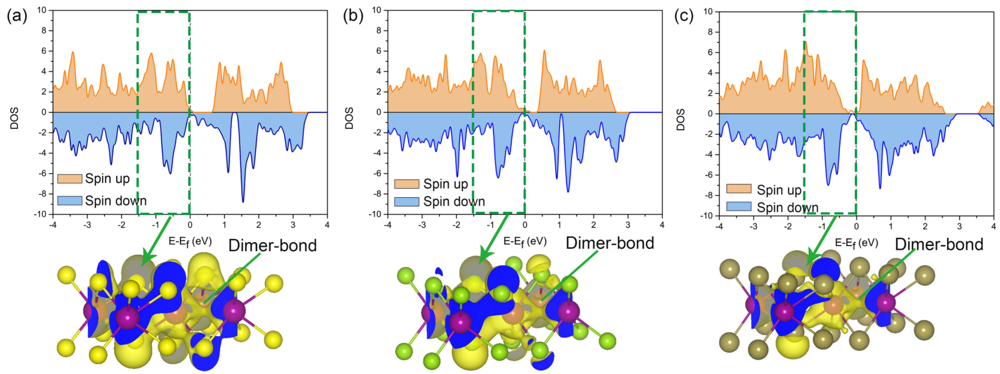
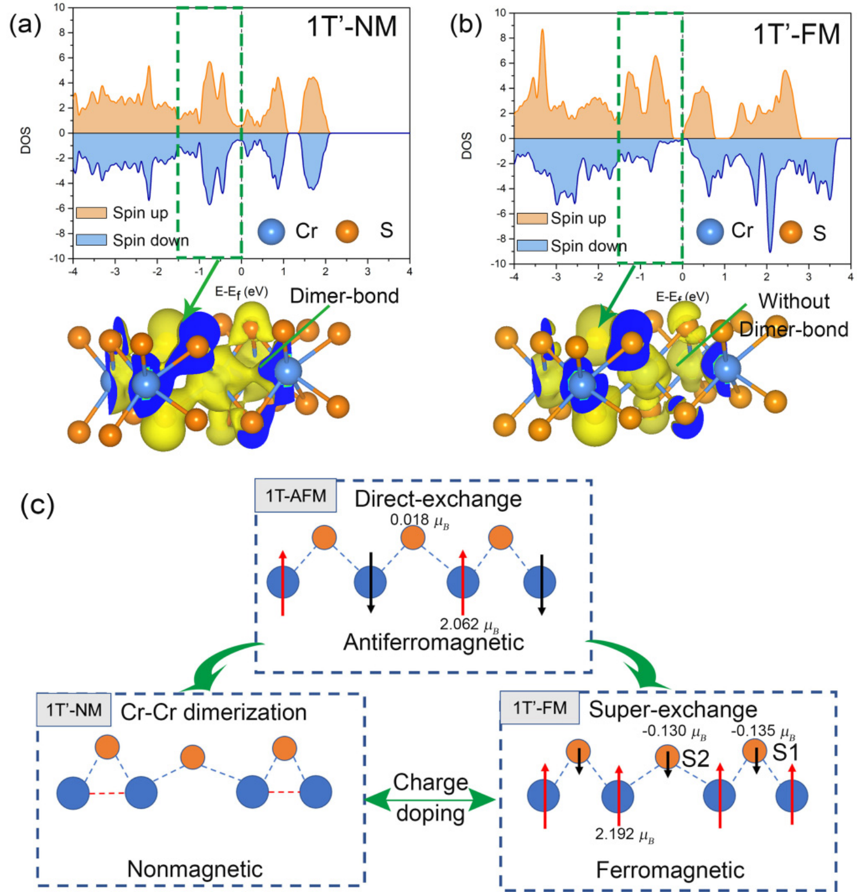

# 计算能带结构 (Computational Band Structures)

> 本页收录第一性原理（DFT）与模型哈密顿量计算得到的电子能带结构图像，涵盖半金属/半导体的轨道分辨能带、应变与掺杂诱导的带隙调控、磁矩自旋分辨能带等关键结果。这些图像是理解二维范德华材料电子物性的核心证据。本页为 [[electronic-bands|电子能带与电子态]] 的子页面。

[[科研Wiki/wiki/figures/electronic-bands|← 返回电子能带索引]]

---

## 💻 DFT 能带与轨道权重 (DFT Bands & Orbital Weights)

### 1. 第一性原理能带结构与轨道权重（d_z² / d_xy-d_x²-y²）
第一性原理能带结构（黑点），叠加 d_z²（黑圈）与 d_xy/d_x²-y²（蓝圈）轨道权重；绿线为低能 Wannier 函数拟合，红虚线为二维"嵌套"最小模型。

*   **来源**：[[../papers/Barnett2006coexistence]]
*   **关键特征**：费米能级附近 d_z² 与 d_xy/d_x²-y² 轨道强杂化决定了费米面的六边形拓扑。

### 2. 紧束缚模型费米面（近完美嵌套六边形）
紧束缚模型费米面（白未占/黑占据），呈近完美嵌套的六边形棋盘；(b) 化学势略低时显示扩展鞍点带。

*   **来源**：[[../papers/Barnett2006coexistence]]
*   **关键特征**：近完美嵌套六边形费米面支持 (2k_F, 0) CDW 波矢，与实验观测高度吻合。

### 3. 石墨能带结构与态密度
石墨的 DFT 能带结构，K-H 线简并显示半金属特性（狄拉克点位于 K 点）。

*   **来源**：[[../papers/Delley2000]]
*   **关键特征**：K-H 线简并揭示了石墨的层间耦合对电子结构的影响，K 点狄拉克锥为双层石墨烯提供了参考。

### 4. 六方固体 6×6×n 未平移 k 网格投影
六方固体 6×6×n 未平移 k 网格在 ab 面的投影，特殊 k 点以粗体标出。

*   **来源**：[[../papers/Delley2000]]
*   **关键特征**：6×6×n k 网格确保布里渊区高对称线充分采样，是半金属能带计算的基准设置。

### 5. Mn 2NOT 中 Mn 3d 轨道 C3v 对称简并分裂
Mn 2NOT 中 Mn 3d 轨道在 C3v 对称下的简并分裂（PDOS），揭示多铁性的轨道起源。

*   **来源**：[[../papers/chen3dLevelSymmetry2025]]
*   **关键特征**：C3v 对称导致 d 轨道分裂为 a₁ + e 表示，e 轨道间的 crystal-field 非对称是铁电极化的直接来源。

### 6. 3d 能级分离、静电势、ELF 与半金属/半导体机制
3d 能级分离与静电势、电子局域函数（ELF）对比，示意半金属/半导体转变机制。

*   **来源**：[[../papers/chen3dLevelSymmetry2025]]
*   **关键特征**：静电势与能级排列共同决定电荷转移方向，ELF 空间分布直观展示成键特征。

### 7. 电子/空穴掺杂诱导半导体→半金属转变（PBAND）
电子/空穴掺杂诱导 Mn₂NOF 从半导体到半金属转变的部分能带（PBAND）演化。

*   **来源**：[[../papers/chen3dLevelSymmetry2025]]
*   **关键特征**：窄带隙 (~0.3 eV) 半金属态在轻掺杂下即可实现，为二维半金属铁电体的设计提供了轨道工程思路。

### 8. 单轴应变调控电荷转移与带隙闭合
单轴应变调控 Mn₂NOF 的电荷转移、静电势与带隙闭合行为。

*   **来源**：[[../papers/chen3dLevelSymmetry2025]]
*   **关键特征**：压应变可降低带隙至零，张应变打开带隙，为二维铁电半导体提供外部调控手段。

### 9. 1T′ MnX₂ 的 DOS 与分波电荷密度
1T′ MnX₂ 的 DOS 与分波电荷密度，显示 Mn-Mn 二聚键存在但磁矩未完全淬灭。

*   **来源**：[[../papers/chenFerromagneticNonmagnetic1T2022]]
*   **关键特征**：Mn-Mn 二聚键的 d 轨道杂化导致磁性，区别于 CrS₂ 中直接交换主导的磁性淬灭。

---

## 🔬 半金属与拓扑能带 (Half-Metallic & Topological Bands)

### 10. 块体 b-P 与 b-AsP 的 DFT 能带结构
块体黑磷（b-P）与黑砷磷（b-AsP）的 DFT 能带结构，显示 As 替代导致的带隙展宽。

*   **来源**：[[../papers/shuTwoDimensionalBlackArsenic2020]]
*   **关键特征**：As 替代使带隙从 ~1.5 eV 增至 ~2.0 eV，VBM/CBM 空间分离增强光生载流子分离效率。

### 11. VBM/CBM 部分电荷密度分布
价带顶（VBM）与导带底（CBM）部分电荷密度空间分布，揭示光生载流子的空间分离。

*   **来源**：[[../papers/shuTwoDimensionalBlackArsenic2020]]
*   **关键特征**：VBM 定域于 P/As 层内，CBM 展布于层间，实现内建电场驱动的光生电荷分离。

### 12. T-PdZr₂Se₄ 与 T-CoTi₂Te₄ 电子结构及极化/传导电子空间分离
T-PdZr₂Se₄ 与 T-CoTi₂Te₄ 的能带结构与电荷密度，显示极化电子与传导电子的空间分离。

*   **来源**：[[../papers/zhaoRealization2DMultiferroic2024]]
*   **关键特征**：极化局域于过渡金属层，传导电子定域于主族层，实现极化与导电的共存。

### 13. T-CoTi₂Te₄ FE1/FE2 态能带与 PDOS 自旋极化反转
T-CoTi₂Te₄ 两种铁电态（FE1/FE2）的自旋分辨能带与 PDOS，显示自旋极化反转。

*   **来源**：[[../papers/zhaoRealization2DMultiferroic2024]]
*   **关键特征**：FE1→FE2 极化翻转诱导自旋极化方向反转，实现铁电→铁磁多铁性。

### 14. ABO₃ 单层高通量筛选带隙-剥离能散点图
ABO₃ 单层高通量筛选框架、SrOsO₃ 剥离能曲线、35 种候选材料的剥离能-带隙散点图。

*   **来源**：[[../papers/zhongHighthroughputExfoliationMultiferroic2025]]
*   **关键特征**：高通量筛选识别出 SrOsO₃ 等 5 种候选材料兼具可剥离性与合适带隙，为实验制备提供靶标。

### 15. Mn 的分波与投影函数（PAW 方法）
Mn 的分波与投影函数，用于投影缀加波（PAW）方法中增广算符的构造。

*   **来源**：[[../papers/blochlProjectorAugmentedwaveMethod1994b]]
*   **关键特征**：投影函数在增广半径内的正交性保证了 PAW 算符的数值稳定性，截断半径的选择直接影响赝势的转移性。

### 16. Mn 原子散射性质
Mn 原子的全电子散射相移与投影函数对比，验证 PAW 方法对过渡金属的描述精度。

*   **来源**：[[../papers/blochlProjectorAugmentedwaveMethod1994b]]
*   **关键特征**：全电子与 PAW 散射相移在全部能量范围内吻合，确认 PAW 方法的精确性。

### 17. 原子总能量平面波收敛性
PAW 方法中原子总能量随平面波截断能的收敛行为，验证基组完备性。

*   **来源**：[[../papers/blochlProjectorAugmentedwaveMethod1994b]]
*   **关键特征**：总能量在截断能 > 400 eV 后趋于平台，确定了 PAW 计算中平面波截断能的安全阈值。

### 18. 结合能平面波收敛性
PAW 方法中结合能（或相对能量）随平面波截断能的收敛行为，验证能量差的基组完备性。

*   **来源**：[[../papers/blochlProjectorAugmentedwaveMethod1994b]]
*   **关键特征**：结合能（能量差）比总能量更快收敛，可在截断能 > 200 eV 时达到 meV 级精度。

### 19. CrS₂ NM/FM 态的 DOS 与分波电荷密度
1T-CrS₂ 非磁（NM）与铁磁（FM）态的 DOS 与分波电荷密度，显示 NM 态 Cr-Cr 二聚键与 FM 态直接交换机制。

*   **来源**：[[../papers/chenFerromagneticNonmagnetic1T2022]]
*   **关键特征**：NM 态 Cr-Cr 二聚键产生电荷密度局域化，FM 态无二聚键但磁矩由直接交换主导，与 CrS₂ 铁磁性的本质一致。

### 20. (h,k,0) 平面几何结构因子与费米能级附近部分电荷密度
(h,k,0) 平面几何结构因子——左列结构数据、右列费米能级附近部分电荷密度。

*   **来源**：[[../papers/cossuStackingChargedensityWaves2024]]
*   **关键特征**：结构因子与部分电荷密度联合揭示了 CDW 超结构中原子位移与电子局域化的对应关系。

### 21. 能量与电子性质
能量与电子性质综合表征，揭示材料的电子结构信息。

*   **来源**：[[../papers/Wei2021]]

### 22. 自旋输运进展
自旋输运领域的关键进展综述，涵盖二维材料自旋弛豫、自旋轨道耦合与自旋晶体管等前沿方向。

*   **来源**：[[../papers/liuSpintronicsTwoDimensionalMaterials2020b]]

---

## 🔗 相关概念与实体 (Related Concepts & Entities)

**核心概念**：[[../concepts/density-functional-theory|密度泛函理论 (DFT)]]、[[../concepts/tight-binding|紧束缚模型]]、[[../concepts/wannier-function|Wannier 函数]]、[[../concepts/band-alignment|能带排列]]、[[../concepts/band-bending|能带弯曲]]、[[../concepts/band-folding|能带折叠]]、[[../concepts/charge-doping|电荷掺杂]]、[[../concepts/crystal-field-theory|晶体场理论]]、[[../concepts/d-orbital|d 轨道]]、[[../concepts/half-metallicity|半金属性]]、[[../concepts/paw-method|PAW 方法]]、[[../concepts/hubbard-u|Hubbard U]]、[[../concepts/spin-density-wave|自旋密度波]]

**代表性材料**：[[../entities/graphene|石墨烯/石墨]]、[[../entities/black-phosphorus|黑磷 (b-P)]]、[[../entities/Mn2NOT|Mn₂NOT]]、[[../entities/Mn2NOF|Mn₂NOF]]、[[../entities/CrS2|CrS₂]]、[[../entities/MoTe2|MoTe₂]]、[[../entities/Ti2AlC|Ti₂AlC MAX 相]]
