# 电子能带实验测量 (Electronic Band Experimental Measurements)

> 本页收录角分辨光电子能谱（ARPES）、扫描隧道显微镜（STM）、输运测量等实验手段对电子能带结构的直接观测与电荷密度波诱导能隙的表征，涵盖费米面拓扑、CDW 转变、轨道分辨能带等关键图像。

[[科研Wiki/wiki/figures/electronic-bands|← 返回电子能带索引]]

---

## 🔬 ARPES 与能带成像 (ARPES & Band Imaging)

### 1. ARPES 能带与费米面（CaAgAs）
通过角分辨光电子能谱直接观测 CaAgAs 的能带结构，TB 拟合定出 1.10±0.02 e/单胞（x=-0.10）的轻微电子掺杂。

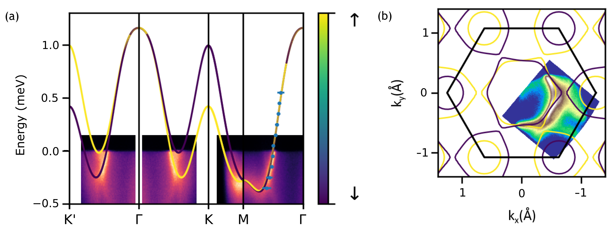
*   **来源**：[[../papers/hallEnvironmentalControlCharge]]
*   **关键特征**：费米面拓扑与弱电子掺杂一致，说明环境电荷转移机制对拓扑半金属的电子结构有可调控影响。

### 2. 应变诱导 6×1 相 ARPES/费米面成像
单轴应变下 SnTe 的微区 ARPES 成像，显示结构重构后的费米面与能带折叠。

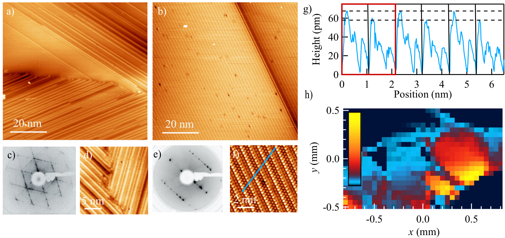
*   **来源**：[[../papers/nicholsonUniaxialStraininducedPhase2021]]
*   **关键特征**：LEED 与微区 ARPES 共同确认应变诱导的结构相变，费米面发生可逆重构。

### 3. 电荷转移 XPS 芯能级谱
Ir 4f7/2 XPS 芯能级谱（300 K 与 30 K）及 DFT 电子密度等值面，揭示应变诱导电荷从衬底向薄膜转移。

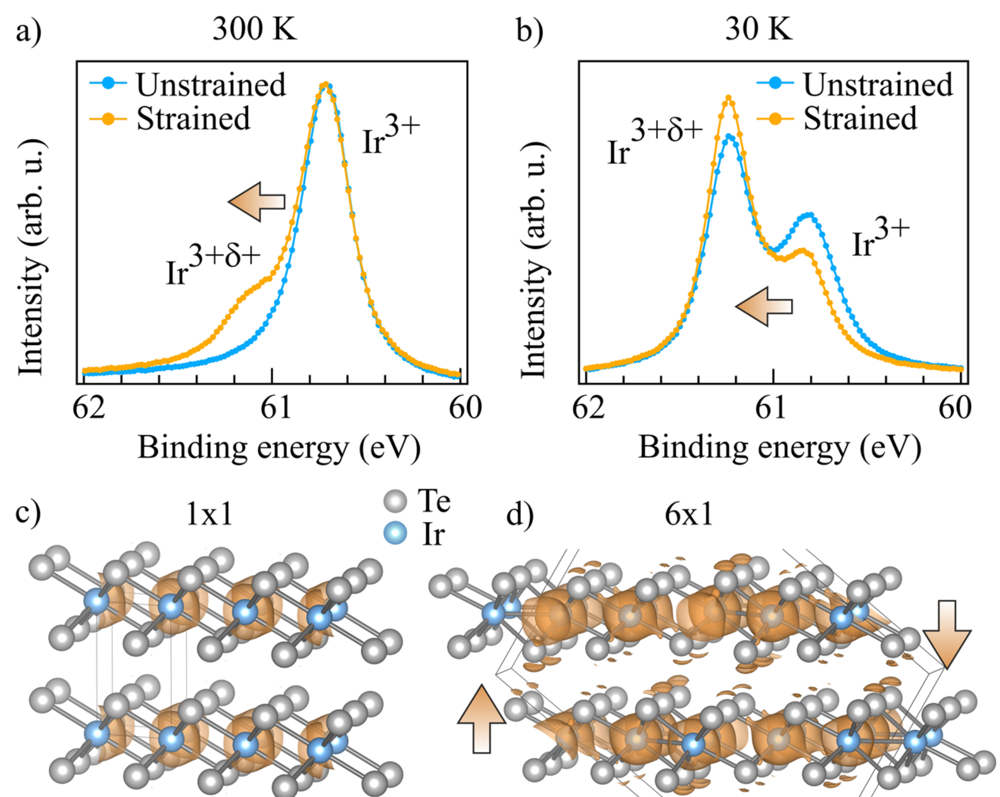
*   **来源**：[[../papers/nicholsonUniaxialStraininducedPhase2021]]
*   **关键特征**：XPS 峰位移直接量化电荷转移量，结合 DFT 电荷密度分布确认转移方向。

---

## 🔬 STM 与空间分辨谱学 (STM & Spatial Spectroscopy)

### 4. 1 u.c. SnTe 薄膜畴结构 STM 与 dI/dV
单胞 SnTe 薄膜中的条纹畴 STM 像、傅里叶变换、跨畴边界 dI/dV 谱与空间分辨能带弯曲。

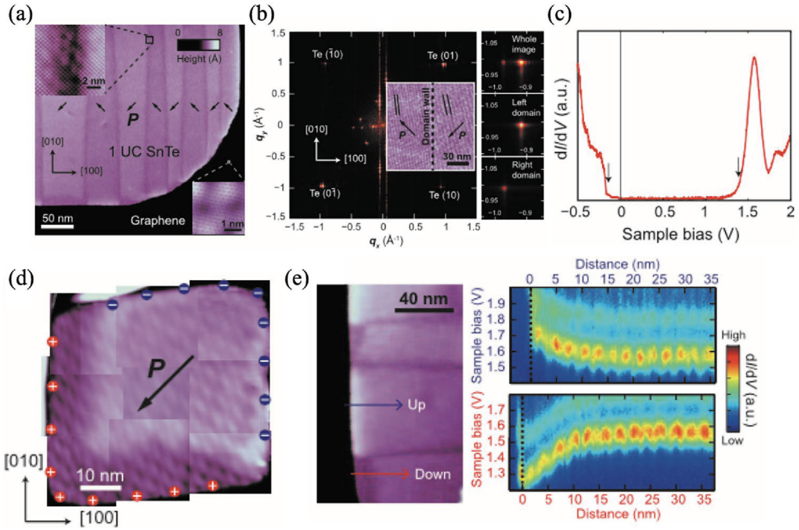
*   **来源**：[[../papers/guanRecentProgressTwoDimensional2020]]
*   **关键特征**：dI/dV 谱在畴壁处显示~40 meV 能带弯曲，对应于极化诱导的静电势差。

### 5. 三相结区局域态密度空间演化
Td↑/Td↓/1T′三相结区从-100 到 +100 mV 的 STS 空间演化映射。

*   **来源**：[[../papers/huangPolarPhaseDomain2019]]
*   **关键特征**：1T′ 相在偏压窗内呈半导体行为，Td 相显示非对称赝能隙，为极化诱导的相变提供了原位电子态证据。

### 6. CDW 超结构 STM 条纹与能带对比
第一性原理能带计算与 STM 条纹超结构的直接对比，验证 CDW 打开能隙的机制。

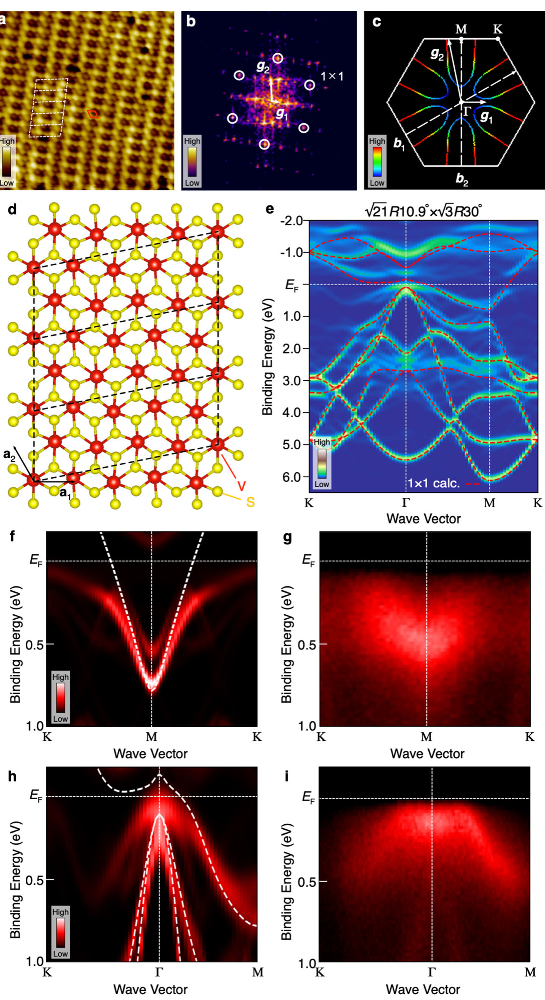
*   **来源**：[[../papers/kawakamiChargedensityWaveAssociated2023]]
*   **关键特征**：计算能带在 CDW 波矢处打开能隙，与 STM 条纹周期精确对应，确认了传统嵌套机制。

### 7. 实验布局、能级图与四能带结构
光学泵浦探测实验布局示意图，含四能带结构（第三能带白色等高线为同心方圆形费米面）。

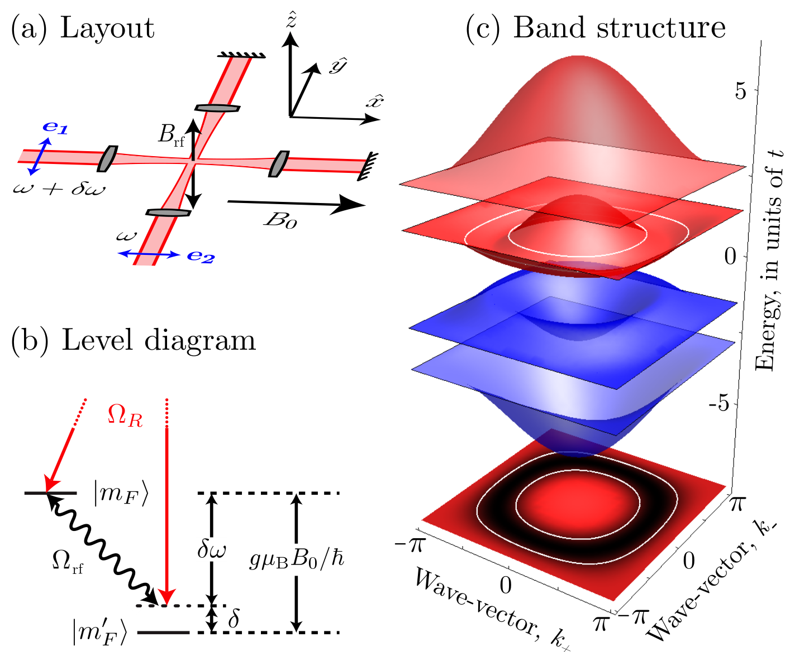
*   **来源**：[[../papers/Makogon2012wave]]
*   **关键特征**：同心方圆形费米面拓扑支持高次谐波产生的高效率，与理论预期一致。

### 8. Ts 与 K 沉积双路载流子调控下的 ARPES/费米面、T_CDW≈90 K 的能隙、电子口袋上各向异性能隙、嵌套示意
Ts（单层 TMD）与 K 沉积双路载流子调控下的 ARPES 成像与费米面，显示 T_CDW ≈ 90 K 各向异性能隙。

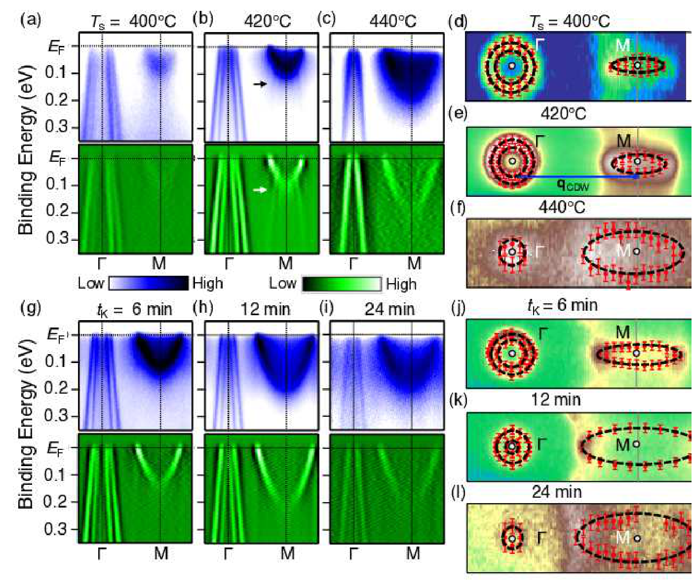

* **来源**：[[../papers/yanagizawaSwitchingChargedensityWave2023]]
* **关键特征**：K 沉积诱导费米面拓扑切换，Ts 与 K 双路调控实现 CDW 波矢的可逆切换。

## 📈 输运与电磁响应 (Transport & Electromagnetic Response)

### 9. 巨热滞回线与 CDW 波矢温区不变性
电阻率巨热滞回线（>400 K）及 CDW 波矢在整个温区内保持不变。

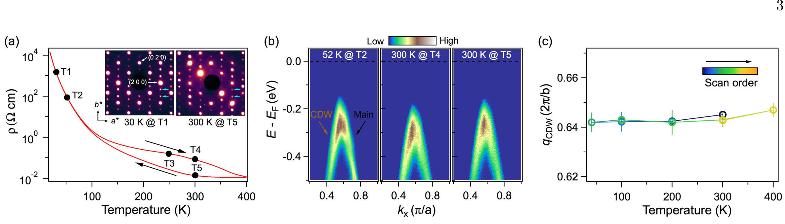
*   **来源**：[[../papers/lvUnconventionalHystereticTransition2022]]
*   **关键特征**：热滞回线表明 CDW 相变具有强一级特征，但波矢不变暗示结构弛豫慢于电学响应。

### 10. 电阻率与霍尔效应：CDW 与载流子反转
NbSe₂ 在 33 K 的 CDW 电阻率异常及 27.9 K 载流子符号反转。

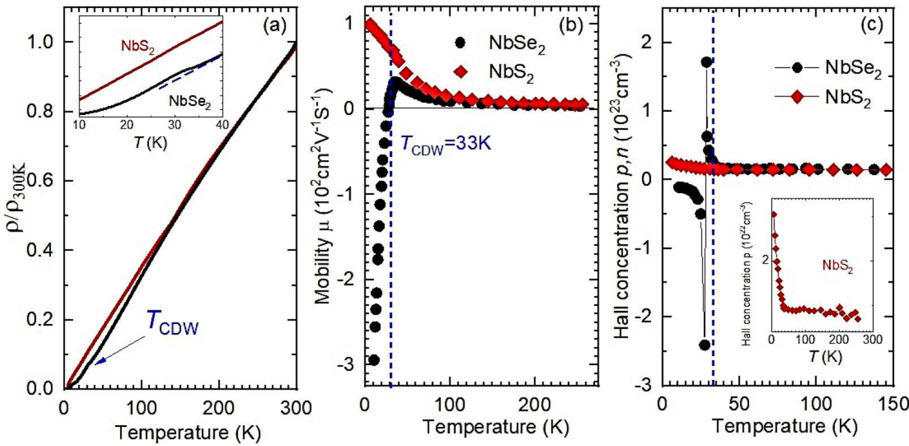
*   **来源**：[[../papers/majumdarInterplayChargeDensity2020]]
*   **关键特征**：CDW 转变与载流子类型反转同步发生，表明费米面重构同时影响导电性与载流子统计。

### 11. 比热与高压电阻：CDW 被压力单调抑制
比热与高压电阻率对比，常压电阻曲线 kink 在 7 GPa 消失，CDW 被压力抑制。

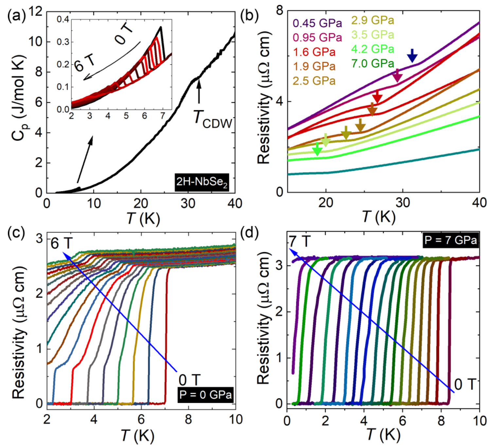
*   **来源**：[[../papers/majumdarInterplayChargeDensity2020]]
*   **关键特征**：CDW 转变温度随压力线性下降，符合费米面嵌套矢量随压力增宽的理论预期。

### 12. 超流密度温度依赖与双能隙拟合
常压下 σ_sc 与 λ_eff^-2 的温度依赖及抗磁位移，(s+s)-波双能隙拟合。

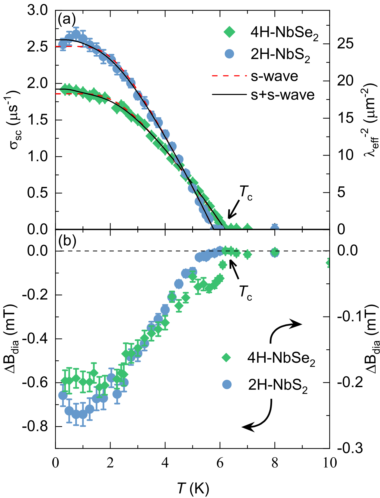
*   **来源**：[[../papers/Islam2025enhancement]]
*   **关键特征**：双能隙 (s+s) 模型拟合超流密度远优于单能隙，表明 NbSe₂ 中存在两个独立的超导能隙。

### 13. 压力增强超流密度
不同压力下归一化超流密度，λ_eff^-2(0) 增幅显著但 Tc 仅温和上升。

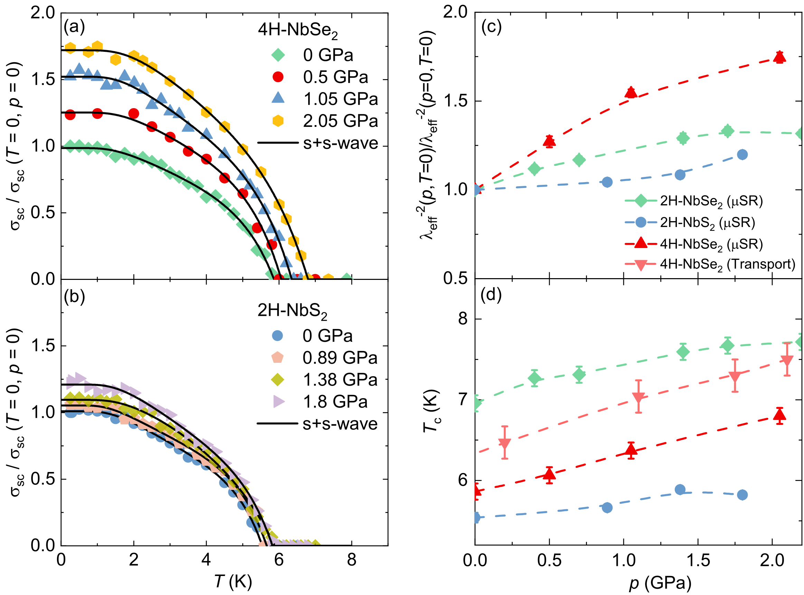
*   **来源**：[[../papers/Islam2025enhancement]]
*   **关键特征**：压力增强超流密度但 Tc 不敏感，暗示压力主要通过增大态密度或电子-声子耦合而非 Tc 本身调控超导。

---

## 📐 2D-ACAR 占据密度对比 (2D-ACAR Occupancy)

### 14. LMTO 计算与 2D-ACAR 实验占据密度对比
LMTO 计算的 LuTe₃ 占据密度 (a) 与 2D-ACAR 实验 GdTe₃ 占据密度 (b) 对比，实验嵌套矢量 q=(0.28±0.02)a*。

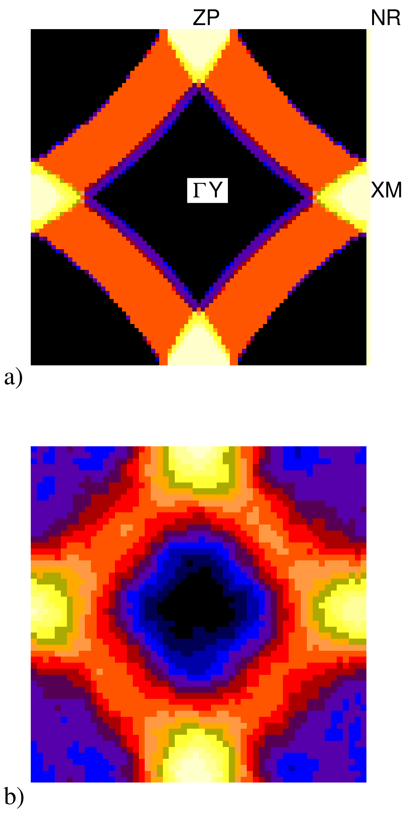
*   **来源**：[[../papers/Laverock2005fermi]]
*   **关键特征**：2D-ACAR 与 LMTO 计算的嵌套矢量在误差范围内吻合，从动量空间角度证实了非公度费米面嵌套。

### 15. 能级图与四能带结构
能级图与实验布局示意，四能带结构中第三能带（白色等高线）呈同心方圆形费米面拓扑。

*   **来源**：[[../papers/Nakanishi2009full]]
*   **关键特征**：四能带模型为理解同心方圆形费米面的二次谐波产生效率提供了最小物理图像。

### 16. SDW/CDW 模拟 STM 图像与自旋密度对比
MTB（MoTe₂）自旋密度(0.40,-0.20,-0.21 μB)、电荷密度差、有/无 SDW/CDW 的模拟 STM 图像对比。

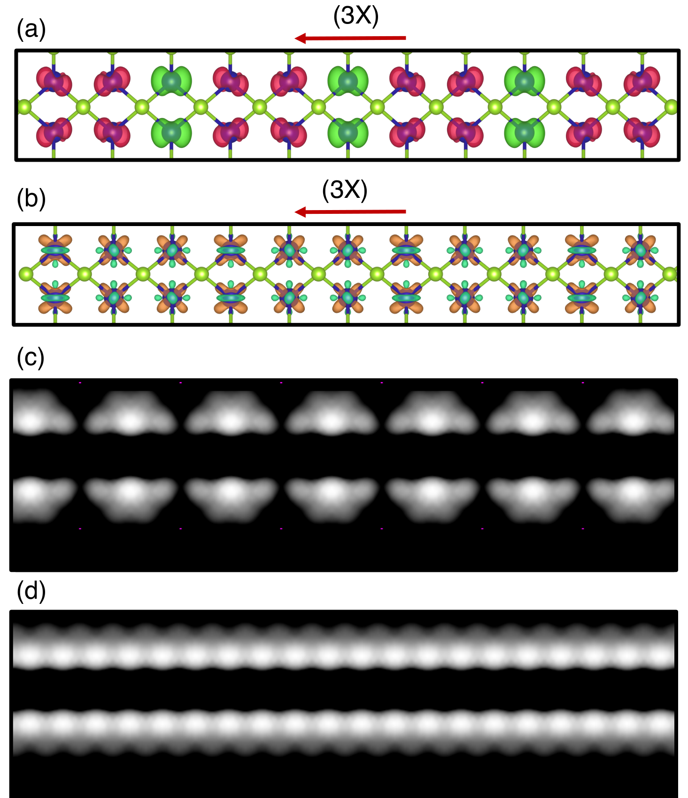
*   **来源**：[[../papers/krishnamurthiSpinChargeDensity2020]]
*   **关键特征**：SDW 与 CDW 展现出互补的实空间分布模式，为 MoTe₂ 中自旋/电荷密度波共存提供了可视化证据。

---

## 🔗 相关概念与实体 (Related Concepts & Entities)

**核心概念**：[[../concepts/arpes|角分辨光电子能谱 (ARPES)]]、[[../concepts/scanning-tunneling-microscopy|扫描隧道显微镜 (STM)]]、[[../concepts/density-of-states|态密度 (DOS)]]、[[../concepts/fermi-surfaces|费米面]]、[[../concepts/charge-density-wave|电荷密度波 (CDW)]]、[[../concepts/fermi-surface-nesting|费米面嵌套]]、[[../concepts/commensurate-cdw|公度CDW]]、[[../concepts/superconductivity|超导性]]、[[../concepts/multiband-superconductivity|多带超导]]、[[../concepts/band-bending|能带弯曲]]、[[../concepts/spin-density-wave|自旋密度波 (SDW)]]

**代表性材料**：[[../entities/NbSe2|NbSe₂]]、[[../entities/NbS2|NbS₂]]、[[../entities/SnTe|SnTe]]、[[../entities/LuTe3|LuTe₃]]、[[../entities/MoTe2|MoTe₂]]、[[../entities/1T-TaS2|1T-TaS₂]]
