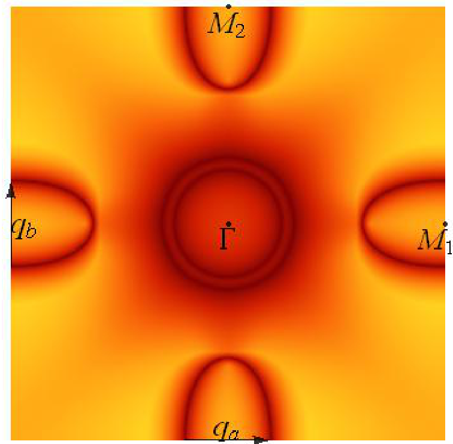
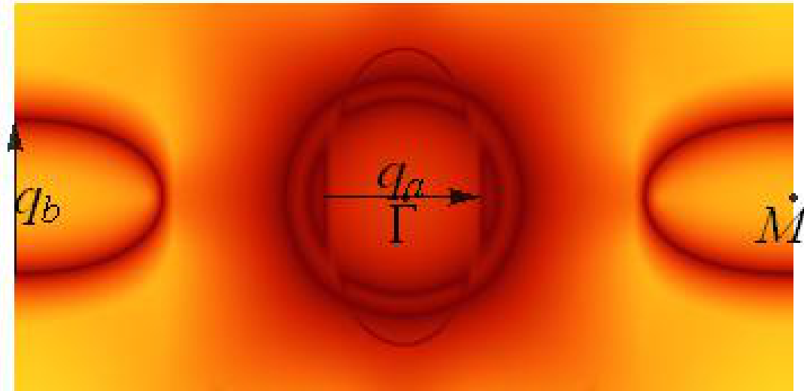
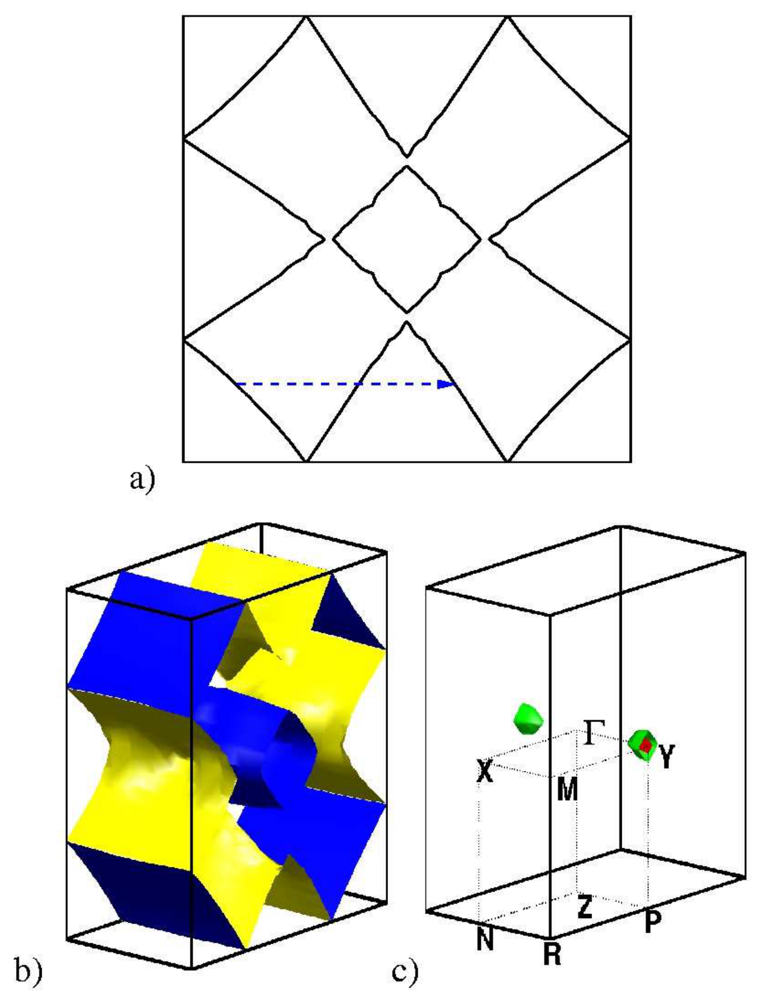
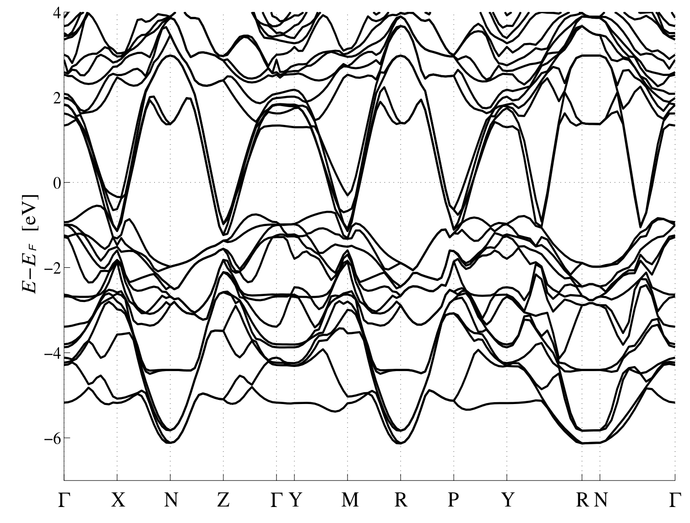
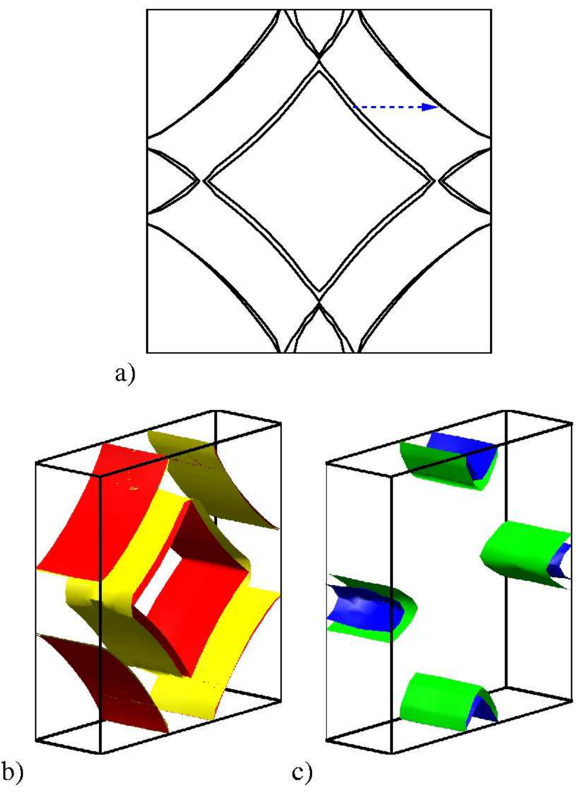
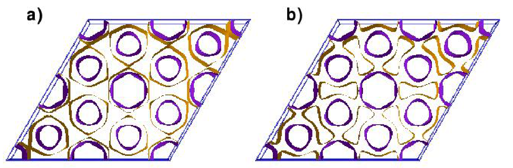
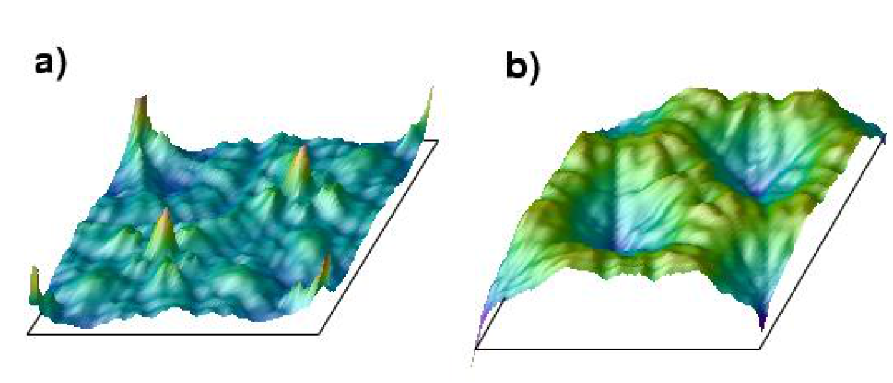
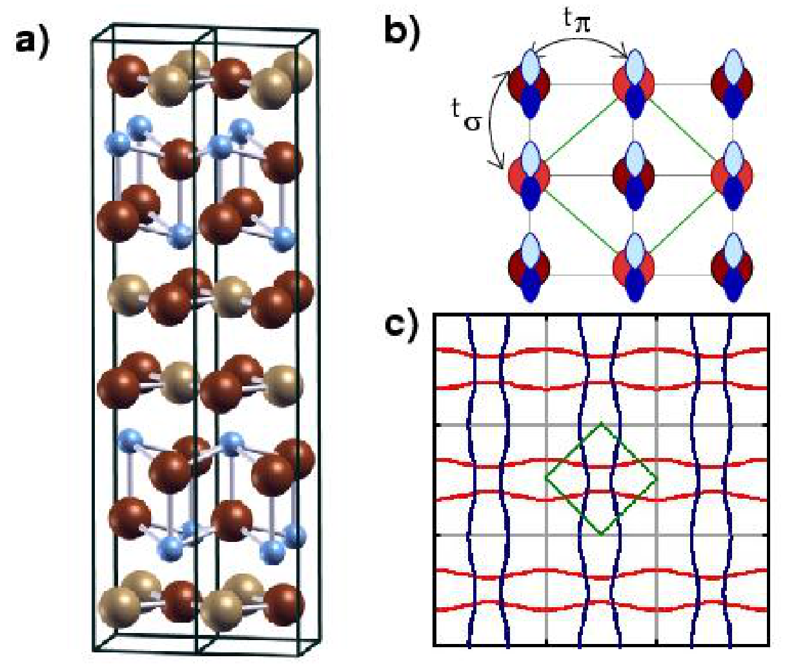
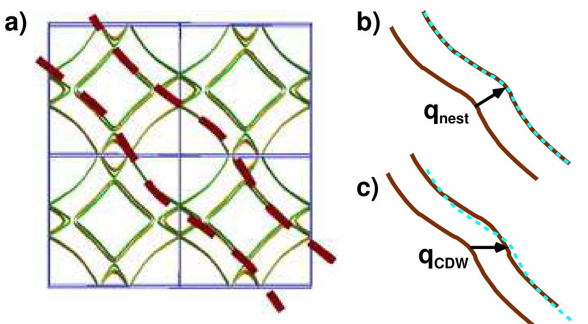
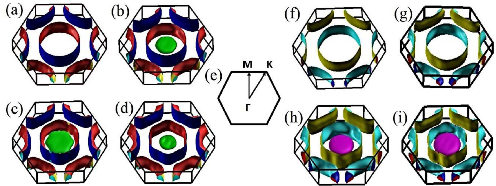

# 费米面、嵌套与电荷密度波 (Fermi Surfaces, Nesting & CDW)

> 本页收录费米面拓扑、嵌套矢量、电荷密度波（CDW）波矢及近公度有序相关的关键图表。核心物理图像包括费米面嵌套导致 CDW 不稳定性、嵌套矢量 q_CDW 与费米面拓扑的定量关联、以及非公度嵌套对 CDW 波矢的调控。

[[科研Wiki/wiki/figures/electronic-bands|← 返回电子能带索引]]

---

## 🌊 费米面拓扑与嵌套 (Fermi Surface Topology & Nesting)

### 1. 展开布里渊区中的四个费米口袋及波矢 q_a
展开布里渊区中的四个费米口袋及 PoDW（极性二聚有序波）序对应的波矢 q_a。

*   **来源**：[[../papers/Kang2012dimer]]
*   **关键特征**：四个费米口袋由 PoDW 序打开能隙后重构，嵌套矢量 q_a 决定 CDW 波矢的选择。

### 2. PoDW 序建立后费米面重构产生重构嵌套
PoDW 序建立后费米面重构，产生新的嵌套矢量与能隙。

*   **来源**：[[../papers/Kang2012dimer]]
*   **关键特征**：PoDW 序诱导费米面重构，嵌套增强是 CDW 转变的热力学驱动力。

### 3. LuTe₂ 计算费米面：菱形嵌套片与公度嵌套矢量
LuTe₂ 计算费米面，菱形嵌套片与公度嵌套矢量 q=(1/2)a* 及 Y 点空穴口袋。

*   **来源**：[[../papers/Laverock2005fermi]]
*   **关键特征**：公度嵌套矢量 q=(1/2)a* 与实验观测的 CDW 波矢一致，支持嵌套驱动的 CDW 不稳定性。

### 4. LuTe₃ 电子能带结构：双层劈裂
LuTe₃ 电子能带结构，双 Te 层耦合导致双层劈裂，沿 c 轴方向能带展宽。

*   **来源**：[[../papers/Laverock2005fermi]]
*   **关键特征**：双 Te 层耦合产生 ~0.3 eV 双层劈裂，解释了 LuTe₃ 中非公度 CDW 的层间相互作用。

### 5. LuTe₃ 计算费米面：非公度嵌套
LuTe₃ 计算费米面，内外菱形片间非公度嵌套 q~(2/7)a* 及 X 点电子口袋。

*   **来源**：[[../papers/Laverock2005fermi]]
*   **关键特征**：非公度嵌套矢量 q~(2/7)a* 与实验 2D-ACAR 测得的 q=(0.28±0.02)a* 高度吻合。

---

## 🌐 CDW 费米面嵌套与波矢 (CDW Fermi Nesting & Wavevectors)

### 6. CDW 打开能隙后的能量增益 δE_k
CDW 打开能隙 2V 后的能量增益 δE_k：主导项来自费米能级以下所有占据态而非费米面附近。

*   **来源**：[[../papers/Johannes2008fermi]]
*   **关键特征**：能量增益在占据侧全布里渊区贡献，嵌套非局域性导致 CDW 波矢选择的复杂化。

### 7. TaSe₂ 费米面：E_F 下移 40 meV 后拓扑改变
TaSe₂ 费米面，E_F 下移 40 meV 后拓扑显著改变，但 χ'/χ'' 几乎不变。

*   **来源**：[[../papers/Johannes2008fermi]]
*   **关键特征**：E_F 微扰导致费米面拓扑突变，但响应函数几乎不变，说明 CDW 稳定性对费米面细节不敏感。

### 8. TaSe₂ 的 χ''(q) 与 χ'(q) 对比
TaSe₂ 的 χ''(q)（嵌套峰位于错误波矢）与 χ'(q)（弱峰位于正确 q_CDW）对比。

*   **来源**：[[../papers/Johannes2008fermi]]
*   **关键特征**：常规 χ''(q) 嵌套峰位于错误波矢，而 χ'(q) 在正确 q_CDW 处出现弱峰，暗示 CDW 驱动机制的复杂性。

### 9. CeTe₃ 层状结构与纯 Te 层 p_x/p_y 紧束缚模型
CeTe₃ 层状结构与纯 Te 层中 p_x/p_y 紧束缚模型及准一维费米面。

*   **来源**：[[../papers/Johannes2008fermi]]
*   **关键特征**：准一维费米面嵌套解释了 CeTe₃ 中 4a₀ 周期 CDW 的结构起源。

### 10. CeTe₃ 完整 DFT 费米面与 CDW 波矢悖论
CeTe₃ 完整 DFT 费米面；沿 (110) 的 q_nest 完美嵌套但与 CDW 无关，q_CDW 处嵌套差却出现 χ' 峰。

*   **来源**：[[../papers/Johannes2008fermi]]
*   **关键特征**：完美嵌套波矢 q_nest 与实验 CDW 波矢 q_CDW 不一致，挑战了传统嵌套驱动 CDW 的理论框架。

### 11. 常规 q 与高阶 2q 费米面嵌套协同覆盖整个电子口袋
常规 q 与高阶 2q 费米面嵌套协同覆盖整个电子口袋，解释高阶 CDW 超结构的起源。

*   **来源**：[[../papers/kawakamiChargedensityWaveAssociated2023]]
*   **关键特征**：高阶 2q 嵌套与常规 q 嵌套协同作用，解释了实验中观测到的 CDW 超结构周期。

### 12. 第一性原理费米面：1-10 GPa 下拓扑不变性
NbSe₂ 第一性原理费米面：1–10 GPa 下拓扑几乎不变，Γ 点 2 GPa 出现 Se/S 衍生薄饼状电子口袋。

*   **来源**：[[../papers/majumdarInterplayChargeDensity2020]]
*   **关键特征**：高压下费米面拓扑稳定性解释了 CDW 转变温度随压力线性下降而非突变消失。

---

## 🔗 相关概念与实体 (Related Concepts & Entities)

**核心概念**：[[../concepts/fermi-surfaces|费米面]]、[[../concepts/fermi-surface-nesting|费米面嵌套]]、[[../concepts/charge-density-wave|电荷密度波 (CDW)]]、[[../concepts/commensurate-cdw|公度 CDW]]、[[../concepts/incommensurate-cdw|非公度 CDW]]、[[../concepts/peierls-distortion|Peierls 畸变]]、[[../concepts/discommensuration|错相子]]、[[../concepts/tight-binding|紧束缚模型]]、[[../concepts/electronic-phase-transition|电子相变]]、[[../concepts/crystallographic-structure-factor|结构因子]]

**代表性材料**：[[../entities/NbSe2|NbSe₂]]、[[../entities/NbS2|NbS₂]]、[[../entities/TaSe2|TaSe₂]]、[[../entities/CeTe3|CeTe₃]]、[[../entities/LuTe3|LuTe₃]]、[[../entities/1T-TaS2|1T-TaS₂]]
