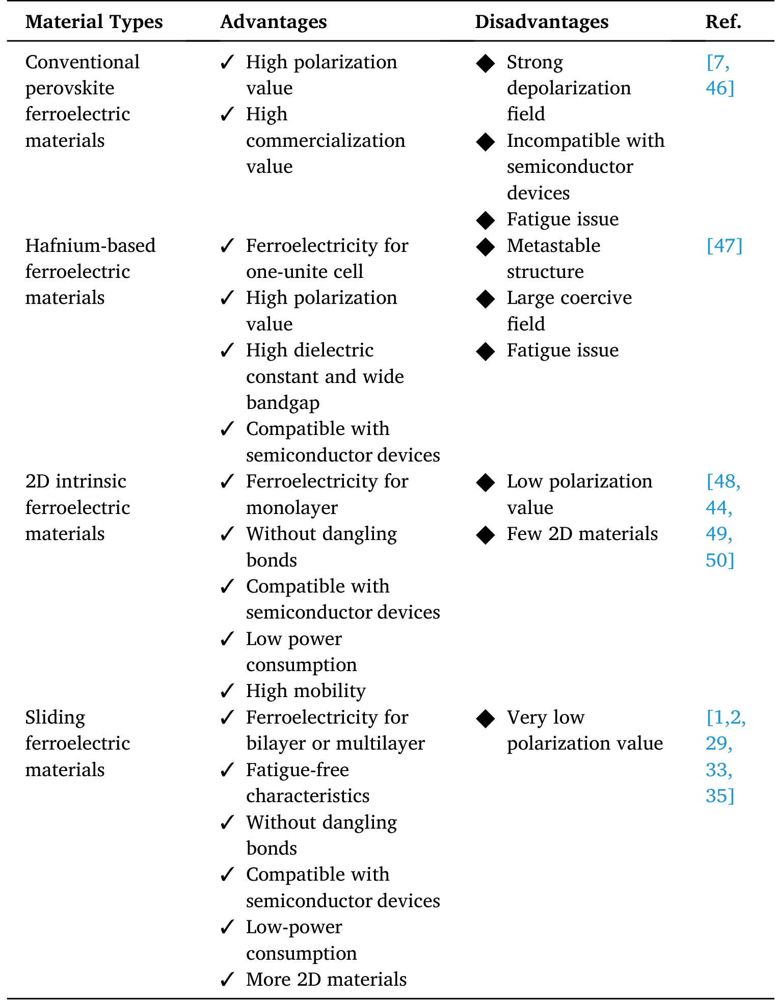

# 器件制备流程与架构 (Device Fabrication & Architectures)

> 收录器件工艺流程、存储器件架构（FeFET/FTJ/FeRAM/STT-RAM）、二维材料异质结堆叠与微纳加工图表。本页为 [[experimental-setups|实验测试与测量装置]] 的子页面。

[[科研Wiki/wiki/figures/experimental-setups|← 返回实验装置索引]]

---

## 🔧 器件制备流程与架构 (Device Fabrication & Architectures)

### 1. 少层 NiI₂ 霍尔棒的制备流程
通过薄片拾取-转移、hBN/石墨烯/NiI₂/hBN 堆叠、图形化与刻蚀等步骤制备 NiI₂ 霍尔棒器件。

*   **来源**：[[../papers/RecentAdvancesGrowth2025]]
*   **关键特征**：全范德华拾取转移工艺避免界面污染与光刻损伤。

### 2. 反铁电 HZO 器件的工艺流程图
给出 ALD 沉积 HZO、电极淀积、光刻图形化与退火结晶的反铁电 HZO 基器件完整工艺流程。

*   **来源**：[[../papers/chenHafniumBasedFerroelectricPostMoore2026]]

### 3. 铪基铁电器件结构纵览
对比 MFS FeFET、MFMIS FeFET 与 Pt/SiO₂/HZO/TiN 铁电隧道结（FTJ）的层状堆叠结构。

*   **来源**：[[../papers/chenHafniumBasedFerroelectricPostMoore2026]]

### 4. 铪基铁电器件性能指标
对比 FeFET、FTJ 与 FeRAM 三类铪基铁电器件的材料堆叠、切换速度、保持时间、耐久度与功耗。

| Device type | Structure | FE material | Switching speed | Retention | Endurance | Power consumption |
| :-- | :-- | :-- | :-- | :-- | :-- | :-- |
| FeFET | MFS | HZO (10 nm) | N/A | > 10⁴ s | > 10⁶ cycles | pA/μm leakage |
| FTJ | Pt/SiO/HZO/TiN | HZO (2 nm) | 500 ps | > 10⁵ s | > 10⁷ cycles | 0.12 fJ/bit |
| FeRAM | TiN/HZO/TiN | HZO (4 nm) | N/A | > 10 years | > 10¹² cycles | 1.2 V low V |

*   **来源**：[[../papers/chenHafniumBasedFerroelectricPostMoore2026]]

### 5. 多铁材料的应用分类
按非易失存储、自旋电子、传感器、制动器、能量收集、微波/RF 与相移器等类别归纳磁电耦合的应用方向。

<table><thead><tr><th>应用类别</th><th>依托效应</th><th>关键指标/器件</th></tr></thead><tbody><tr><td>非易失存储</td><td>铁电极化+自旋的磁电耦合</td><td>四态隧道效应、磁性切换</td></tr><tr><td>自旋电子</td><td>磁电耦合</td><td>自旋场效应晶体管、多铁隧道结</td></tr><tr><td>传感器</td><td>磁电效应</td><td>磁场感知探测器</td></tr><tr><td>制动器</td><td>压电/磁致伸缩</td><td>低功耗柔性致动</td></tr><tr><td>能量收集</td><td>磁电耦合</td><td>复合电压压电/磁致伸缩材料</td></tr><tr><td>微波/RF</td><td>磁电效应</td><td>可调滤波器、天线、FMR 调谐</td></tr><tr><td>相移器</td><td>电磁耦合</td><td>微波相控阵雷达、通讯</td></tr></tbody></table>

*   **来源**：[[../papers/RecentAdvancesGrowth2025]]
*   **另见**：同表的 markdown 版本收录于 [[electronic-devices#🔌 器件应用与分类 (Device Applications & Categories)|电子与突触器件]]。

### 6. 铁性材料的对称性分类
按照是否破坏空间反演与时间反演对称性，区分铁电、铁磁、铁弹、铁涡与铁谷五类铁性序。

<table><thead><tr><th>铁性类别</th><th>英文名称</th><th style="text-align:center">破坏空间反演对称性</th><th style="text-align:center">破坏时间反演对称性</th></tr></thead><tbody><tr><td>铁电性</td><td>Ferroelectricity (FE)</td><td style="text-align:center">✓</td><td style="text-align:center">✗</td></tr><tr><td>铁磁性</td><td>Ferromagnetism (FM)</td><td style="text-align:center">✗</td><td style="text-align:center">✓</td></tr><tr><td>铁弹性</td><td>Ferroelasticity</td><td style="text-align:center">✗</td><td style="text-align:center">✗</td></tr><tr><td>铁涡性</td><td>Ferrotoroidicity</td><td style="text-align:center">✓</td><td style="text-align:center">✓</td></tr><tr><td>铁谷性</td><td>Ferrovalley</td><td style="text-align:center">—</td><td style="text-align:center">—</td></tr></tbody></table>

*   **来源**：[[../papers/RecentAdvancesGrowth2025]]
*   **另见**：本表为五类铁性序完整版；三类（铁电/铁磁/铁弹）精简版收录于 [[vibrational-spectra#🧲 二维多铁材料体系综述 (2D Multiferroic Systems Overview)|振动能谱与声子谱]]。

---

### 7. 图2 制造DOE的2.5倍光学显微镜俯视图，可见相位图样及缺陷小孔

制造DOE的2.5倍光学显微镜俯视图，可见相位图样及缺陷小孔

*   **来源**：[[../papers/Unknown2025diffractive]]

### 8. 图3 DOE中心45度倾角SEM图像（1000倍），可见阶梯效应和表面粗糙度

DOE中心45度倾角SEM图像（1000倍），可见阶梯效应和表面粗糙度

*   **来源**：[[../papers/Unknown2025diffractive]]

### 9. 表1 2PP工艺参数：功率25mW、扫速10mm/s、层厚0.1μm、填充0.3μm、材料FemtoBond

表1 2PP工艺参数：功率25mW、扫速10mm/s、层厚0.1μm、填充0.3μm、材料FemtoBond

*   **来源**：[[../papers/Unknown2025diffractive]]

### 10. 图物理机制图解

*   **来源**：[[../papers/chenHafniumBasedFerroelectricPostMoore2026]]

### 11. 图性能表征图集

*   **来源**：[[../papers/chenHafniumBasedFerroelectricPostMoore2026]]

### 12. 掺杂HfO2性能对比表

掺杂HfO2性能对比表

*   **来源**：[[../papers/chenHafniumBasedFerroelectricPostMoore2026]]

### 13. 图Fig.6 CVD制备与UV胶带转移

CVD制备与UV胶带转移

*   **来源**：[[../papers/sunSlidingFerroelectricityTwodimensional2025]]

### 14. Table 1 四类铁电材料优缺点对比

Table 1 四类铁电材料优缺点对比

*   **来源**：[[../papers/sunSlidingFerroelectricityTwodimensional2025]]

### 15. 图MLC STT-RAM 缓存写能耗-编码方案对比（Figure 10）

STT-RAM 缓存写能耗-编码方案对比（Figure 10）

*   **来源**：[[../papers/xueEmergingNonvolatileMemories2011]]

### 16. 图SLC/MLC STT-RAM vs SRAM 缓存性能与能耗归一化（Figure 11）

STT-RAM vs SRAM 缓存性能与能耗归一化（Figure 11）

*   **来源**：[[../papers/xueEmergingNonvolatileMemories2011]]

### 17. SRAM vs STT-RAM 面积/延迟/能耗对比（Table 1）

SRAM vs STT-RAM 面积/延迟/能耗对比（Table 1）

*   **来源**：[[../papers/xueEmergingNonvolatileMemories2011]]

### 18. 表1 六种应变诱导方法在各二维材料体系中的应变范围与类型对比

表1 六种应变诱导方法在各二维材料体系中的应变范围与类型对比

*   **来源**：[[../papers/yangStrainEngineeringTwodimensional2021]]

---

## 🔗 相关概念与实体 (Related Concepts & Entities)

**核心概念**：[[../concepts/nonvolatile-memory|非易失存储]]、[[../concepts/in-memory-computing|存内计算]]、[[../concepts/synaptic-plasticity|突触可塑性]]、[[../concepts/microfabrication|微纳加工]]、[[../concepts/cmos-compatibility|CMOS 兼容性]]

**相关材料/实体**：[[../entities/FeFET|FeFET]]、[[../entities/FeRAM|FeRAM]]、[[../entities/FTJ|铁电隧道结]]、[[../entities/HZO|HZO (铪锆氧)]]、[[../entities/CrI3|CrI₃]]、[[../entities/MoS2|MoS₂]]、[[../entities/Ti3C2Tx|Ti₃C₂Tₓ]]
