---
tags:
  - type/figure-collection
---

# 实验装置与表征方法

> 实验装置、测量系统、制备工艺、表征方法

## 条目

### 1. 图1 测量系统框图：输入-过程-输出

*   **来源**：[[../papers/2019optical]]
*   **图示描述**：通用测量系统的三段式流程框图，从左到右依次为"输入（Input）→ 过程（Process）→ 输出（Output）"，对应传感器元件、信号处理单元与显示终端。
*   **关键特征**：输入即光纤传感探头，将湿度这一物理量转换为光强变化；过程为 Arduino Uno 微控制器及其内置 ADC，完成模拟电压到数字量的换算；输出为 LCD 或 PC 上显示的相对湿度数值。

### 2. 表1 自制仪器与标准湿度计5点对比，平均误差2.78%

*   **来源**：[[../papers/2019optical]]
*   **图示描述**：自制光纤湿度计与标准湿度计在 5 个测试点上的读数对比表，三列分别为自制仪器读数（%）、标准湿度计读数（%）和单点误差（%）。
*   **关键特征**：自制仪器读数范围 88.8%–97.42% RH，标准湿度计对应 90.73%–99.7% RH；单点误差介于 1.7%–4.1% 之间，平均误差 2.78%；误差主要来自光纤与光电二极管的手动对准重复性差，以及光纤微弯/宏弯引入的光功率波动。

### 3. 图3 湿度测量系统总体框图（激光源-TiO2-SiO2光纤-湿度腔-光电二极管-Arduino-LCD/PC）

*   **来源**：[[../papers/2019optical]]
*   **图示描述**：本研究实际搭建的湿度测量系统总体框图，链路为"激光二极管光源 → TiO2-SiO2 替代包层的聚合物光纤（置于湿度腔内）→ 光电二极管探测器 → Arduino Uno → LCD/PC 显示"。
*   **关键特征**：光源为 638 nm 红色二极管激光器；光纤总长 21 cm（Autonics FD-620-10），中段包层被剥离并浸涂 TiO2-SiO2；传感段置于可控湿度腔中，水蒸气直接作用于涂层；光电二极管输出电压经 Arduino Uno（ATmega328，10 bit ADC，0–5 V 映射 0–1023）采样，并可通过以太网扩展板上传。

### 4. 图7 2 cm剥离长度下湿度-ADC值校准曲线 y=0.131x−22.58，R²=0.984

*   **来源**：[[../papers/2019optical]]
*   **图示描述**：在最优 2 cm 剥离长度下，Arduino ADC 读数（横轴，无量纲，0–1023）与标准湿度计测得的相对湿度（纵轴，% RH）之间的散点及线性拟合。
*   **关键特征**：拟合得到传递函数 y=0.131x−22.58，其中 x 为 ADC 值、y 为湿度（% RH）；斜率 0.131 为 ADC 转换系数，截距 −22.58 为系统偏移；判定系数 R²=0.984，线性度优良；该方程被写入 Arduino Uno 程序，实现实时湿度换算。

### 5. 图1 湿度光学传感器装置示意图：1500 mL 玻璃腔、白光LED、相机、玻碳探针、IR光源、参考湿度计
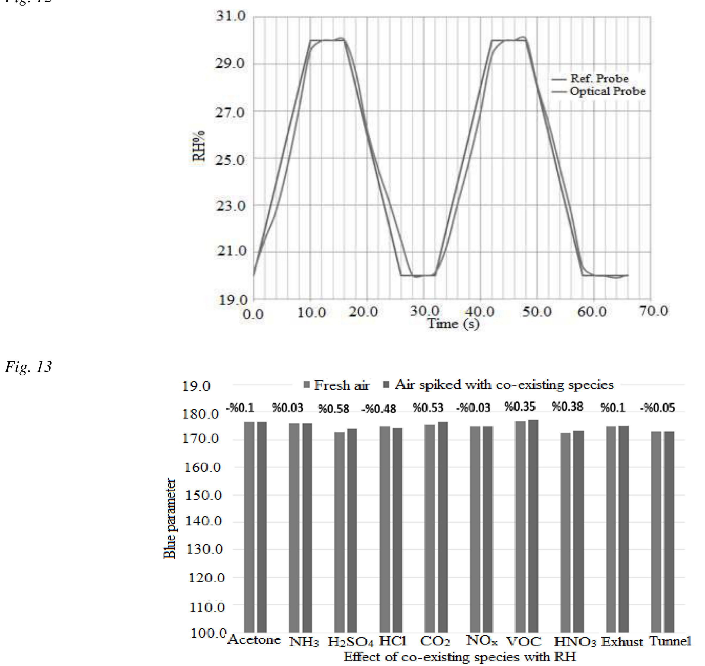
*   **来源**：[[../papers/Doroodmand2017conjugated]]
*   **图示描述**：一个 10×10×15 cm、容积约 1500 mL 的黑色玻璃密闭腔，将镀有共轭 Salen 聚合物薄膜的玻碳电极从一侧插入；另一侧以 10–20° 非镜面夹角布置白光 LED 与数码相机（AGPtek，X800），IR 光源（HG-IR1XYJ-F-1W）紧贴电极用于加热除湿，腔内还集成参考湿度计（Lutron GCH-2018）、温度计、小风扇、N₂ 进气口与超声加湿器。
*   **关键特征**：①玻碳电极同时承担 CV 电合成的工作电极与光学检测的反射镜，是整套设计的核心整合点；②相机/光源相对镜面取 10–20° 偏角，避开镜面反射、采集经聚合物滤光后的漫反射颜色信号；③腔体外壁涂黑并置于暗室，消除杂散光；④每次测试前用 IR 照射约 0.5 min、再以 2 L/min 的 N₂ 吹扫约 1 min，消除水分子残留造成的记忆效应与迟滞。

### 6. 图2 跨 TN 多个温度下的 XRD 实验谱与 FullProf 精修结果（R3c）
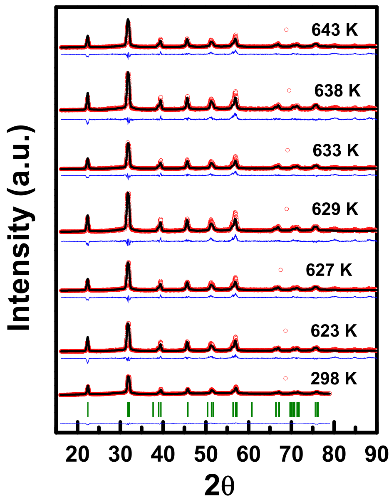
*   **来源**：[[../papers/Goswami2011multiferroic]]
*   **图示描述**：横轴为衍射角 2θ，纵向堆叠多个温度的谱图；红色空心圆为实验数据，黑色实线为 FullProf 计算谱，蓝色实线为残差，绿色竖线为布拉格峰位。
*   **关键特征**：298 K 至 643 K 全部谱线均可用 R3c 空间群（六方坐标）指标化，跨 TN (~635 K) 无结构相变；含约 5% Bi2Fe4O9 杂质峰并已指认；精修考虑了晶粒尺寸与微应变展宽，χ² 约 2.2–2.7，为后续提取晶格常数、原子坐标与离子位移提供基础。

### 7. 图3 室温 0 T 与 5 T 下的中子衍射实验谱与精修结果（λ=2.41 Å）
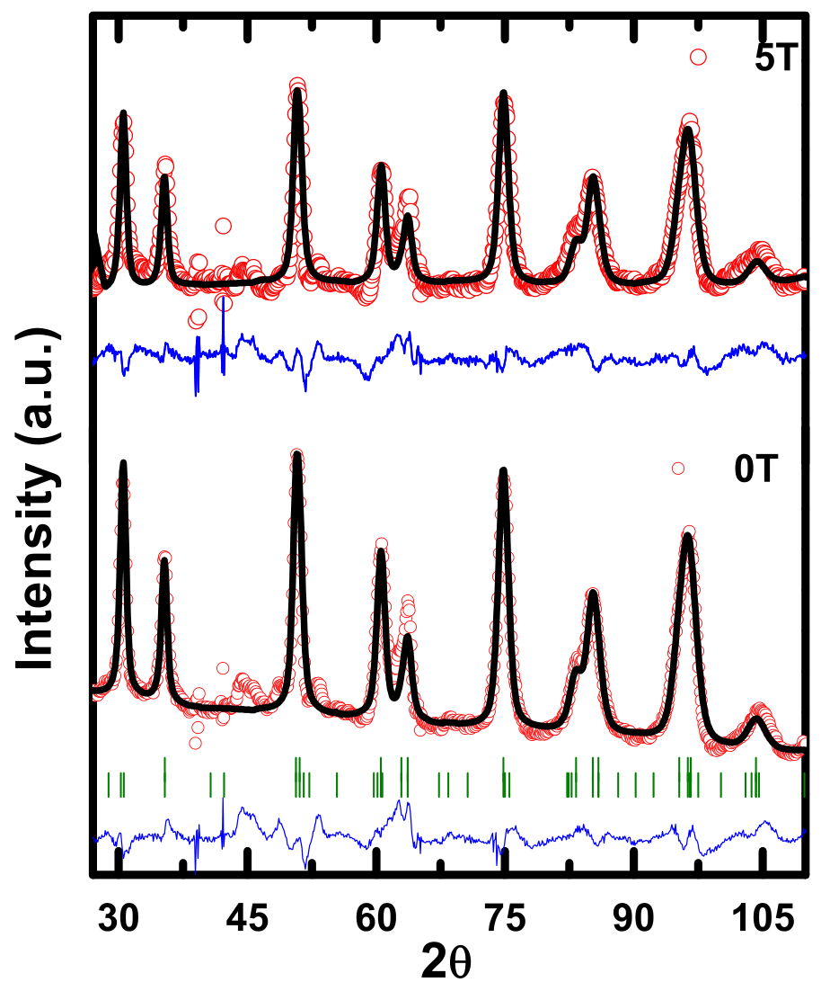
*   **来源**：[[../papers/Goswami2011multiferroic]]
*   **图示描述**：与图2类似的实验/计算/残差/布拉格峰布局，但绿色竖线同时标出晶体学与磁性晶格的布拉格位置；上下两条谱分别对应零场和 5 T。
*   **关键特征**：磁传播矢量 k = (0,0,0)，为公度磁晶格；Fe3+ 有序磁矩约 3.22 μB；对比 0 T/5 T 精修，Bi 的 z 坐标由 0.4524 变为 0.4486，净离子位移 δ 减小约 0.06 Å，对应极化被抑制约 7%；未观察到极化方向翻转；χ² 分别为 30.3 与 16.1，磁结构精修可接受。

### 8. 图2 PFM实验装置示意、表面形貌及极化前后VPFM/x-LPFM图像

*   **来源**：[[../papers/Jin2015studying]]
*   **图示描述**：(a) 二维 PFM 探测装置示意，导电探针作顶电极、Pt 底电极，同时采集垂直 (VPFM/OP) 与水平 (x-LPFM/IPx) 锁相信号；(b) 多晶 BFO 薄膜表面形貌；(c, d) 极化前同区域的 VPFM 与 x-LPFM 图像；(e, f) 在中心 1 μm × 1 μm 白色虚框内施加 +12 V（电场沿 −z）极化后再扫描的 VPFM 与 x-LPFM 图像，整幅扫描范围为 2 μm × 2 μm。
*   **关键特征**：薄膜厚约 300 nm、平均晶粒尺寸约 130 nm（MOD 法生长于 Pt/Ti/SiO₂/Si）；形貌图在极化前后无变化，排除了形貌/损伤假象；虚框内 VPFM、x-LPFM 衬度在极化后显著改变，直接显示发生了压电响应（即极化）翻转；探针 AC 激励约 2 V、21 kHz，扫描速率约 1 Hz，+12 V 极化对探针安全且足以驱动翻转。

### 9. 图2 亚纳秒双光子激光直写系统光路示意与实物照片
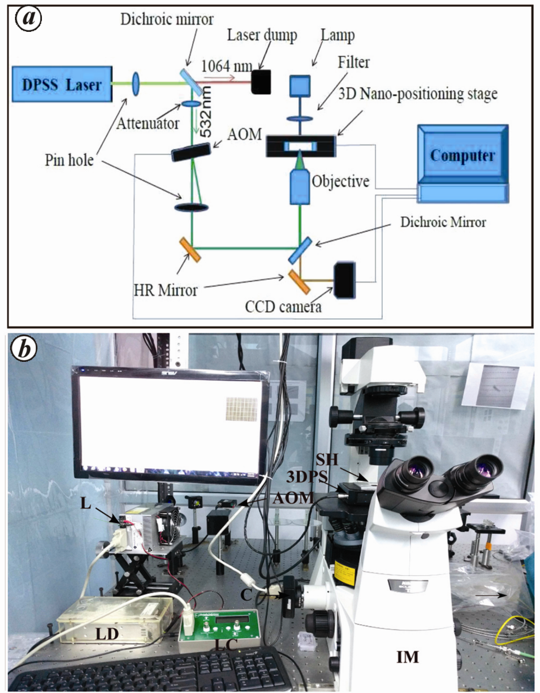
*   **来源**：[[../papers/Kumar2017microstructuring]]
*   **图示描述**：(a) 自研亚纳秒激光直写系统光路与控制流程示意图；(b) 系统实物照片。光路自激光器 (L) 经声光调制器 (AOM)、高反镜、二向色镜进入倒置显微镜物镜，聚焦到由 3D 压电台 (3DPS) 承载的样品 (SH)，CCD (C) 经二向色镜实时监控，全部由 LabVIEW 协同控制。

### 10. 图3 SU-8/AR-N 4340 中制备的 2D 光栅、微盘、IIT Kanpur 校徽、6 μm 3D 微柱阵列
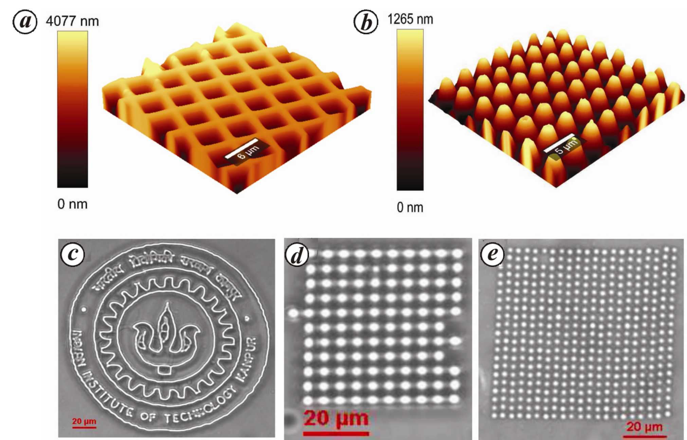
*   **来源**：[[../papers/Kumar2017microstructuring]]
*   **图示描述**：五联结构展示图。(a) (b) 为 SU-8 中二维光栅和二维微盘阵列的 AFM 三维形貌；(c) 为 IIT Kanpur 校徽的光学显微镜照片；(d) 为 SU-8 中三维微柱阵列的光学显微镜照片；(e) 为在 AR-N 4340 中制备的二维微盘阵列。统一工艺参数：平均功率 1.2 mW、写入速度 100 μm/s、重复频率 10 kHz、NA = 0.8 物镜。

### 11. 图4 1.3 NA 油浸物镜获得的高分辨光栅 AFM 形貌，线轮廓 FWHM ≈ 500 nm
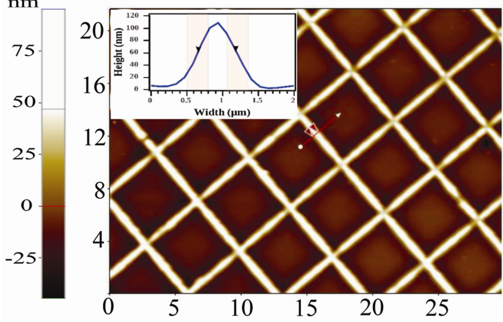
*   **来源**：[[../papers/Kumar2017microstructuring]]
*   **图示描述**：使用 100×、NA = 1.3 油浸物镜在 SU-8 中写出的二维光栅 AFM 形貌图，插图为沿选定线条测得的高度剖面（横轴位置 μm，纵轴高度 nm）。工艺参数：平均功率 1.0 mW、写入速度 200 μm/s、重复频率 10 kHz。

### 12. 图5 不同峰值强度（2.5–5.7 GW/cm²）与写入速度（300–1600 μm/s）下微线条的 AFM 形貌与高度剖面
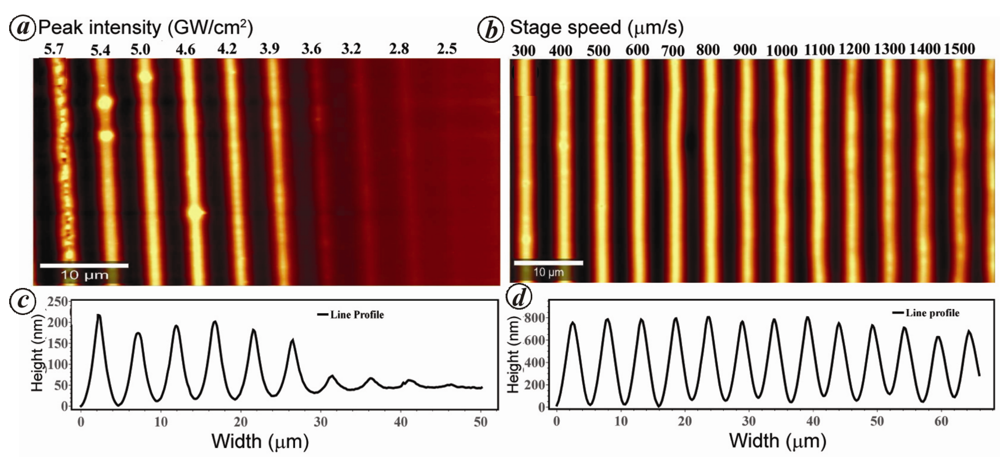
*   **来源**：[[../papers/Kumar2017microstructuring]]
*   **图示描述**：工艺参数扫描结果。(a) 为不同激光峰值强度下写出的微线条阵列 AFM 形貌，从左至右峰值强度由 5.7 递减至 2.5 GW/cm²；(b) 为不同写入速度下的微线条 AFM 形貌，从左至右速度由 300 增至 1600 μm/s；(c) (d) 分别为 (a) (b) 对应线条的高度剖面。

### 13. 图2 沿扶手椅(a)和锯齿(b)方向的应力–应变曲线，实线WX2、虚线MoX2

*   **来源**：[[../papers/Li2013bonding]]
*   **图示描述**：图2为六种单层 MX₂ 的拉伸应力 σ（GPa）对单轴应变 ε（无量纲）曲线，(a) 沿扶手椅方向、(b) 沿锯齿方向；实线为 WX₂、虚线为 MoX₂，横向允许弛豫以计入泊松收缩，超胞应力经 Z/h 因子重整化为二维等效应力。
*   **关键特征**：小应变 ε<4% 区间六条曲线几乎重合且线性，两方向杨氏模量一致（六方对称→面内弹性各向同性），MoS₂ 的 E≈220 GPa 与 AFM 实验 270±100 GPa 吻合；ε>4% 后曲线分叉并出现明显峰值即极限强度 σ*，组分趋势 WS₂>WSe₂>MoS₂>WTe₂>MoSe₂>MoTe₂；扶手椅 σ* 为锯齿方向的 1.5–2.2 倍（与石墨烯相反，石墨烯扶手椅方向峰值低约 9%）；扶手椅极限应变 ε*≈0.28–0.32，远大于锯齿方向 0.14–0.19。

### 14. G/GO多模态表征
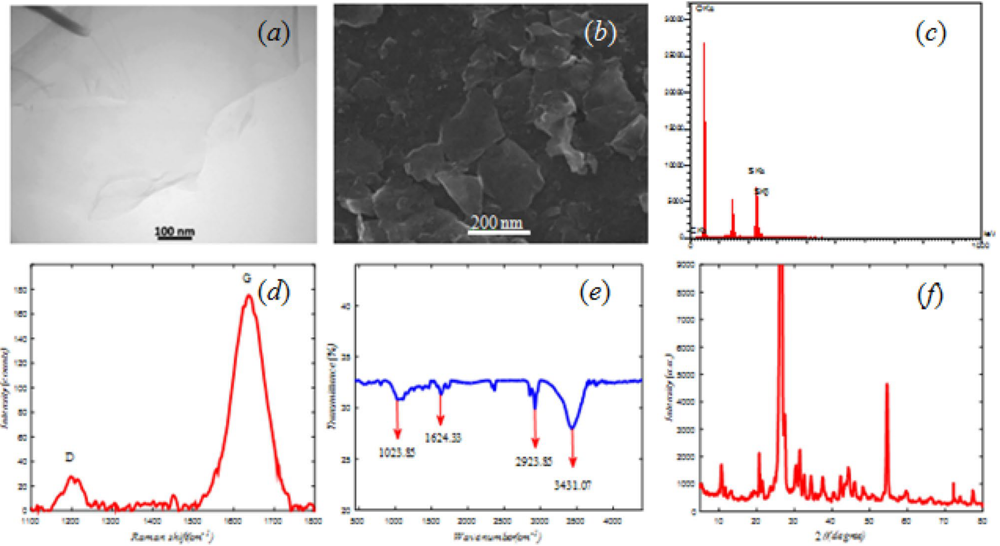
*   **来源**：[[../papers/Owji20212d]]
*   **图示描述**：六联面板，(a)(b) 为 TEM 与 SEM 形貌，(c) EDX 元素能谱，(d) Raman，(e) FTIR，(f) XRD，用于确认 Hummers 法+液相剥离得到的 G/GO 少层产物的结构与化学组成。
*   **关键特征**：TEM/SEM 显示薄纱状片层；EDX 给出高 O/C 比，证实含大量含氧官能团；Raman 出现 D 峰 ~1197 cm⁻¹ 与 G 峰 ~1634 cm⁻¹，D 峰显著表明缺陷与官能团化；FTIR 检出 C–O(1020 cm⁻¹)、C=O(1624 cm⁻¹)、C–H(2923 cm⁻¹) 及酚羟基 C–OH 在 ~3430 cm⁻¹ 的宽峰；XRD 在 2θ=10° 给出 d₀₀₁=0.83 nm，远大于石墨 0.34 nm，证实氧化插层成功。

### 15. MoSe2多模态表征
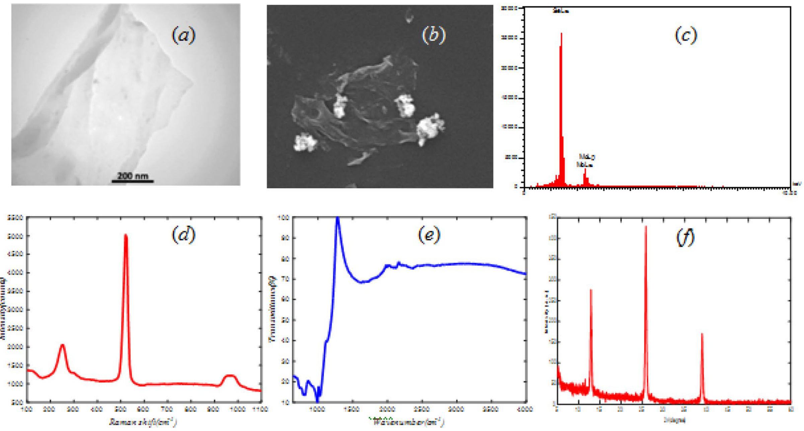
*   **来源**：[[../papers/Owji20212d]]
*   **图示描述**：与图1同样的六联表征面板，样品为溶剂热法（Se 粉 + Na₂MoO₄ + 水合肼，120 °C 保温 1 h，pH=12）合成的 MoSe₂ 纳米片。
*   **关键特征**：TEM/SEM 显示典型层状纳米片；EDX 确认 Mo、Se 两相；Raman 在 ~240 cm⁻¹ 与 ~290 cm⁻¹ 分别为面外 A₁g 与面内 E₂g 模；FTIR 仅出现 Mo–O(813 cm⁻¹)、Mo=O(992 cm⁻¹)、Se–O(1137 cm⁻¹)，无羟基峰，表面以 Mo 氧化物终端为主；XRD 在 2θ=13.3°、25.82°、39.1° 对应六方相 (002)/(004)/(103) 晶面。

### 16. MoS2多模态表征
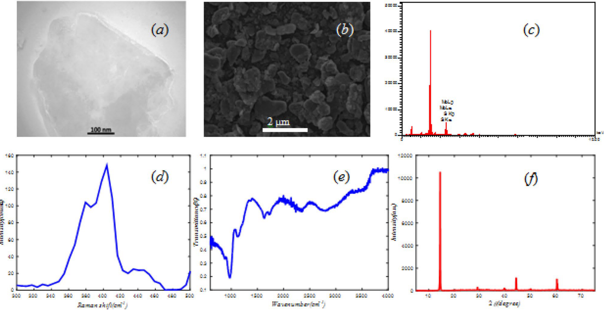
*   **来源**：[[../papers/Owji20212d]]
*   **图示描述**：六联表征面板，样品为乙醇/水（45:55 v/v）中 40 Hz 超声 12 h 化学剥离得到的 MoS₂ 片。
*   **关键特征**：SEM/TEM 显示大面积薄片；EDX 证实高纯度 MoS₂；Raman E₂g ~381 cm⁻¹ 与 A₁g ~405 cm⁻¹ 峰差约 24 cm⁻¹，是少层 MoS₂ 的判据；FTIR 同时出现 Mo–S(600 cm⁻¹)、Mo–O(1639 cm⁻¹) 和 –OH 在 3287 cm⁻¹ 的宽峰；XRD 在 2θ=14° 给出 (002) 峰，对应层间距 6.3 Å。

### 17. ESMF及涂层SEM
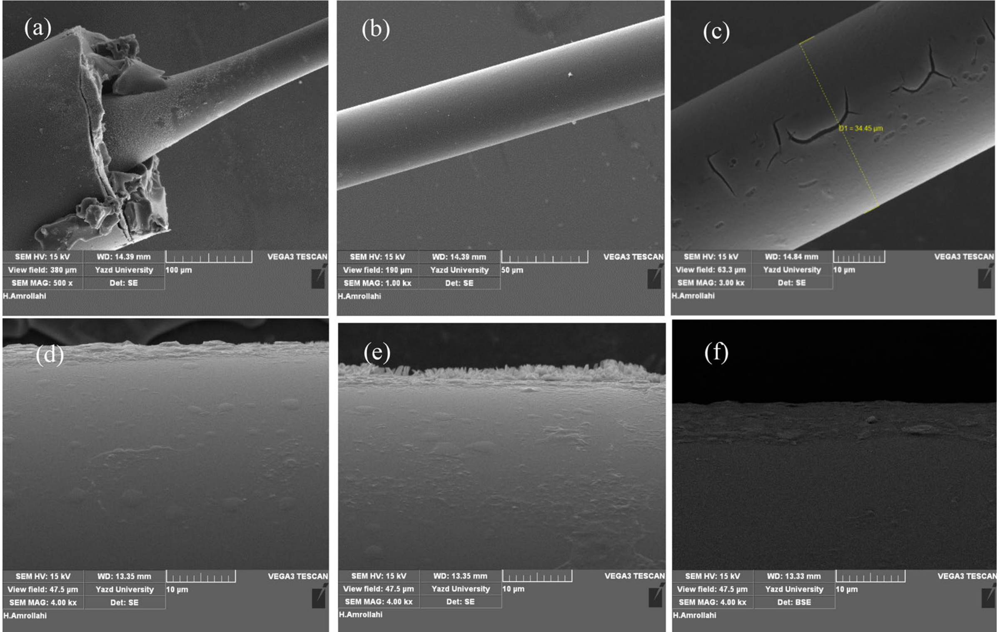
*   **来源**：[[../papers/Owji20212d]]
*   **图示描述**：SEM 拼版图，(a–c) 为 HF 蚀刻后的裸 ESMF，(d–f) 分别为浸涂 G/GO、MoSe₂、MoS₂ 后的 ESMF 表面形貌。
*   **关键特征**：HF 蚀刻 60 min 后包层直径由 125 μm 减薄至 34.45 μm，表面略粗糙，使倏逝场能够渗透到外侧介质；三张涂覆图均可见二维纳米片连续附着于光纤圆柱面，证明浸涂工艺在三种材料上都形成了敏感层。

### 18. 制备与测试装置示意
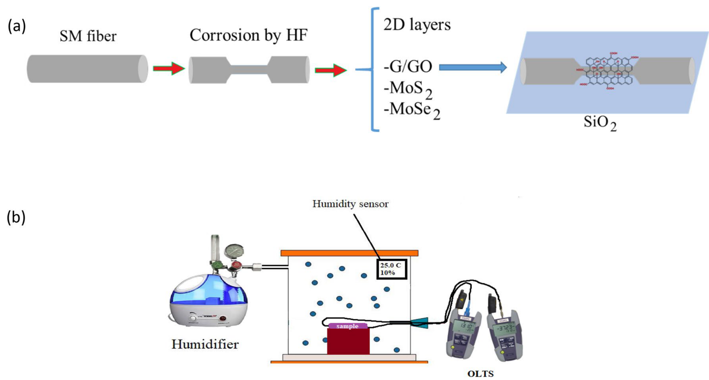
*   **来源**：[[../papers/Owji20212d]]
*   **图示描述**：流程示意图，左侧为传感器制备链路（剥除 3 cm 保护层 → HF 蚀刻 60 min → 在 5 mg/10 cc 的二维材料分散液中浸涂），右侧为温湿度可控云室中的 OLTS 测量光路。
*   **关键特征**：测量系统由 OPS 光源（1310 nm 或 1550 nm）、被测 ESMF、OPM 光功率计组成；云室内含加湿器、湿度控制盒、温度控制器和标准湿度传感器，在 25 °C 恒温下提供 20–90% RH；定义 RDA = |ΔA|/A₀ 作为输出量。

### 19. FESEM images of BLFO nanoparticles
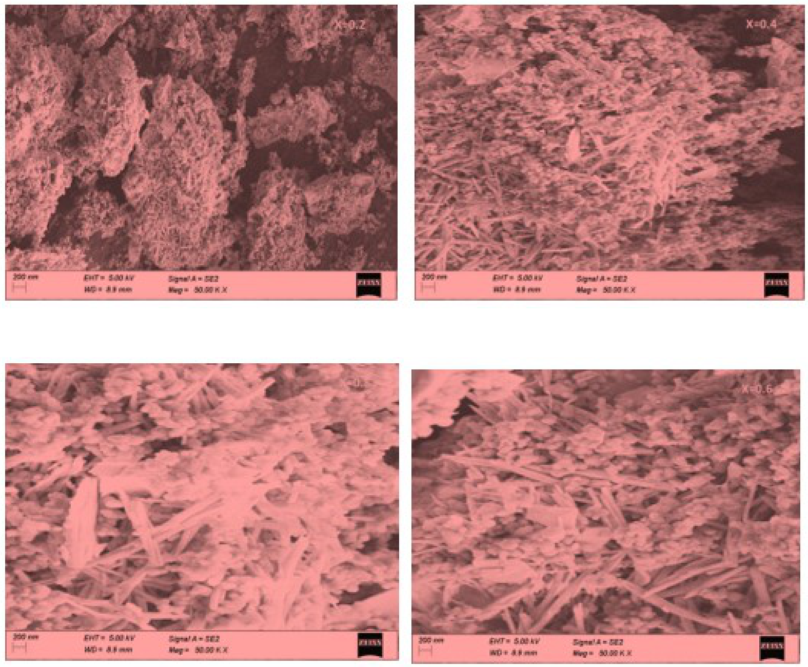
*   **来源**：[[../papers/Perugu2024morphology]]
*   **图示描述**：四幅场发射扫描电镜照片按 x=0.2、0.4、0.6、0.8 排列，展示同一放大倍数下颗粒形貌与堆积方式的演变。
*   **关键特征**：低掺杂以类球形颗粒为主，随 x 增加纳米棒数量与长径比显著增大，高 La 样品中纳米棒成为主导形貌；仍可见少量纳米球共存；线性截距法给出 Gavg 从 96.4 nm（x=0.2）单调增至 168.3 nm（x=0.8），作者归因于内部微应变下降。

### 20. TEM images of BLFO nanoparticles
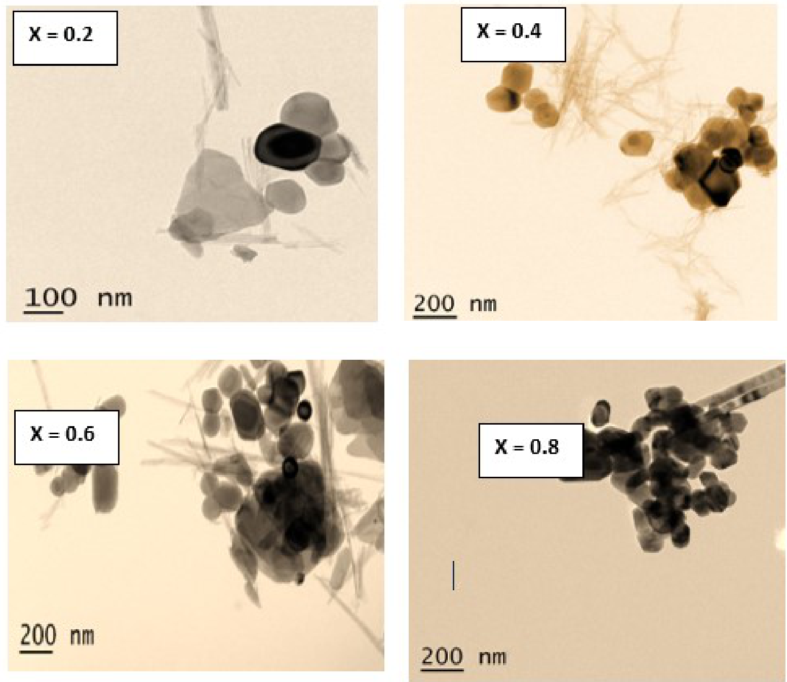
*   **来源**：[[../papers/Perugu2024morphology]]
*   **图示描述**：四幅透射电镜（HRTEM）图像按 x=0.2–0.8 排列，用于核实在 FESEM 中看到的纳米棒形貌并统计颗粒尺寸。
*   **关键特征**：TEM 下同样观察到纳米棒与纳米球共存，且棒状颗粒比例随 x 增加而上升；颗粒尺寸 Pavg 由 74.8 nm（x=0.2）增至 127.4 nm（x=0.8），与 XRD 的 Davg 和 FESEM 的 Gavg 趋势一致；三种独立尺寸测量互相印证了 La 促进晶粒/颗粒长大的结论。

### 21. 图3 机械/液相剥离（离子插层、离子交换、超声辅助）机制
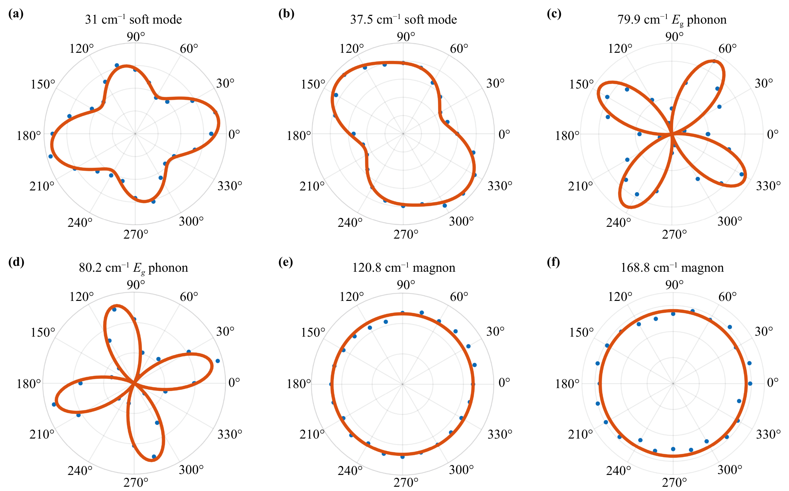
*   **来源**：[[../papers/RecentAdvancesGrowth2025]]
*   **图示描述**：四幅示意图对比四种"自下而上"气相沉积技术的装置与原理：(a) CVD（固体/气体前驱体在管式炉中反应沉积）、(b) PVD（直接蒸发块体源在低温区衬底沉积）、(c) MBE（超高真空下分子束逐层外延）、(d) ALD（交替脉冲前驱体的自限制逐层生长）。
*   **关键特征**：CVD/CVT 工艺参数多但可制备大面积、高质量、工业兼容薄膜，是 NiI₂、Cr₂S₃、CuCrSe₂ 等里程碑材料的主流路线；PVD 工艺简单、适合直接沉积；MBE 原子级精度、纯度最高但设备昂贵、生长慢；ALD 具有单原子层厚度控制和极佳保形性，特别适合空气敏感材料封装与异质结制备。

### 22. 图4 四种气相沉积方法对比：CVD、PVD、MBE、ALD
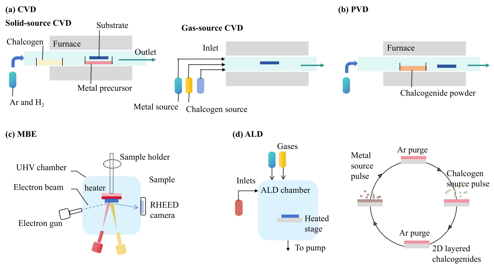
*   **来源**：[[../papers/RecentAdvancesGrowth2025]]
*   **图示描述**：以光学/AFM 图像为主，展示通过 CVD 界面调制策略在工业兼容 c 面蓝宝石上生长的一英寸晶圆级、单一取向的单胞（one-unit-cell）Cr₂S₃ 薄膜，AFM 测得单层厚度约 1.8 nm。
*   **关键特征**：界面相互作用诱导自插层 Cr 原子层内滑移、破坏空间反演对称性，从而产生室温铁电与高剩余极化；铁磁 T_C = 200 K，约为块体的两倍；样品同时具备宏观厘米级横向尺寸与单胞级厚度。

### 23. 图5 CVD界面调制生长晶圆级单胞Cr₂S₃（AFM单层厚1.8 nm）
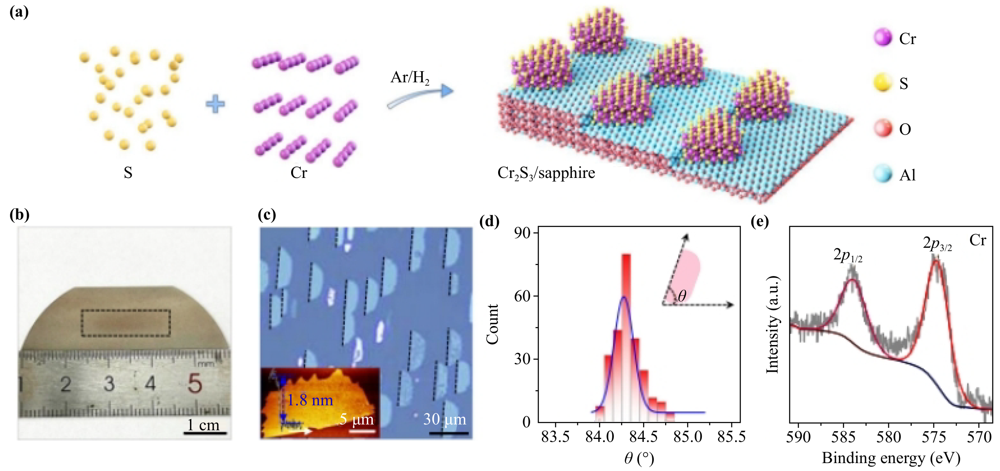
*   **来源**：[[../papers/RecentAdvancesGrowth2025]]
*   **图示描述**：CVT 生长的单层/少层 NiI₂ 的偏振显微镜图像与角分辨线性二色性测量结果，呈现随温度变化的光学各向异性图案及其随偏振角的周期性响应。
*   **关键特征**：进入多铁相后出现显著双折射，是低对称铁电/多铁序存在的直接光学证据；角分辨线二色性定量证实单层旋转对称由 C₃_z 降为 C₂；多铁畴结构可在偏振光学下直接成像。

### 24. 图13 CVT-NiI₂的XRD谱（Cu Kα，室温晶胞 a=3.91 Å, c=19.93 Å）
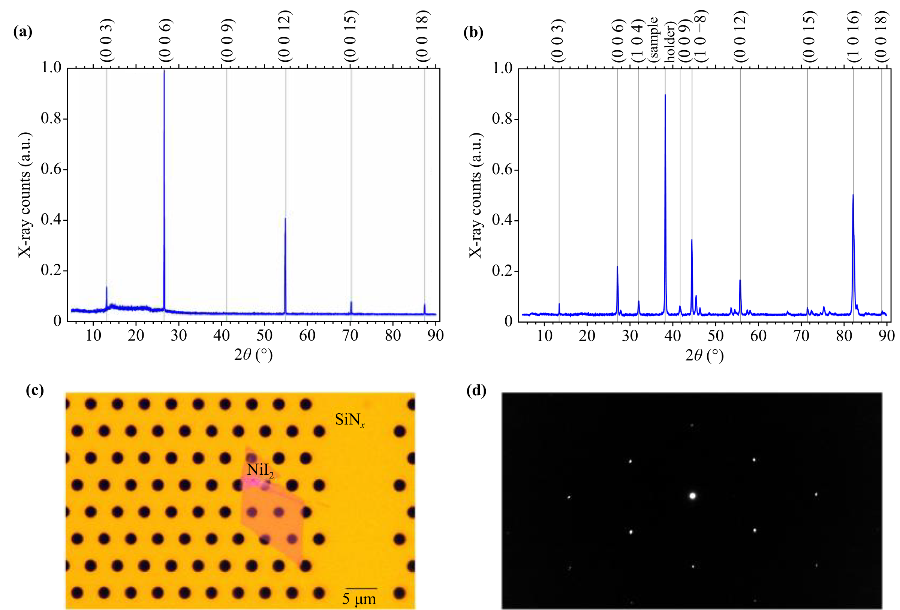
*   **来源**：[[../papers/RecentAdvancesGrowth2025]]
*   **图示描述**：少层 NiI₂ 薄片的 AFM 形貌图及沿指定线段的高度剖面曲线，纵轴单位为 nm。
*   **关键特征**：高度剖面给出薄片相对于衬底的台阶高度；单层 NiI₂ 厚度对应其晶胞 c 轴层间距量级，是判定样品层数（单层/少层/块体）的"金标准"；结合形貌可同时评估表面粗糙度、均匀性和横向尺寸。

### 25. 图14 少层NiI₂的AFM形貌与厚度剖面（层数判定金标准）

*   **来源**：[[../papers/RecentAdvancesGrowth2025]]
*   **图示描述**：以 M（磁化）、P（极化）、ε（应变）三种内部序参量为核心，外圈对应 H（磁场）、E（电场）、σ（应力）三种外激励，再外环映射到磁电、压电、磁弹三类耦合效应及其六大器件应用（非易失存储、自旋电子、传感器/执行器、能量收集、微波/RF、移相器）。
*   **关键特征**：清晰呈现"内序参量—外场—交叉耦合—器件功能"四层对应关系；MERAM 用电场写入磁化、MFTJ 通过极化翻转切换自旋极化电流实现四态存储；磁电传感器低频灵敏度可达 pT–fT/√Hz，可替代 SQUID 用于脑磁图等生物磁探测；应变介导的磁电耦合可用于电控 FMR 频率。

### 26. 图1 G/GO纳米片FESEM形貌、EDX能谱与C/O元素mapping

*   **来源**：[[../papers/Tobeiha2025optical]]
*   **图示描述**：三联图，(a) FESEM场发射扫描电镜下G/GO纳米片的微观形貌，(b) EDX能谱，(c) C与O元素面分布mapping。
*   **关键特征**：FESEM中可见典型二维片层的平坦区与褶皱，是薄层纳米片成功剥离的标志；EDX仅检出C、O两元素，无杂质，C/O重量比约2.34，表明氧化程度介于纯石墨烯与纯氧化石墨烯之间；C、O mapping在所选区域内均匀分布，说明氧化过程均匀。

### 27. 图3 DOE中心45度倾角SEM图像（1000倍），可见阶梯效应和表面粗糙度

*   **来源**：[[../papers/Unknown2025diffractive]]
*   **图示描述**：DOE 中心区域 45° 倾角、1000 倍 SEM 图像，展示由不同像素高度形成的三维表面浮雕。
*   **关键特征**：单个像素的高度台阶清晰可见，总调制深度 4.4 μm；表面呈现明显阶梯效应（staircase effect）与较高粗糙度；根源在于选用 NA=0.8 的 20× 物镜以换取 500 μm 大视场，其分辨率低于高 NA 物镜；最小像素高度保留 2 μm 基底作为误差容限。

### 28. 图2 飞秒激光TPP平台与偶相位板（m=2,q=12）设计/SEM/实测高度，误差~0.2μm
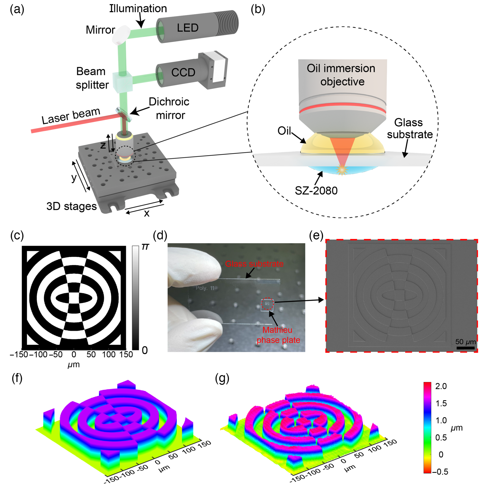
*   **来源**：[[../papers/Wang2023ultracompact]]
*   **图示描述**：(a)(b) 飞秒激光 TPP 制造平台光路示意，(c) 偶 MPP(m=2,q=12)的二元(0/π)相位设计，(d) 玻璃基底上多枚 MPP 阵列的显微照片，(e) 单枚 MPP 的 SEM 图，(f)(g) 设计与实测三维高度分布对比（高度放大 20× 显示）。
*   **关键特征**：光源为 PHAROS 飞秒激光器（515 nm、340 fs、200 kHz），经 Zeiss 63×/NA1.4 油镜聚焦于 SZ-2080 光刻胶；预烘 100 °C/30 min，显影甲基异丁基酮 10 min + 异丙醇 5 min；设计波长 λ=1.55 μm、n_p=1.5，由 h=λφ/[2π(n_p−1)] 得 0/π 对应 0/1.55 μm；器件尺寸 300 μm×300 μm；实测与设计高度吻合，表面高度误差约 0.2 μm。

### 29. 图3 螺旋相位板（m=3,q=2）设计相位、SEM与逐层台阶状实测高度
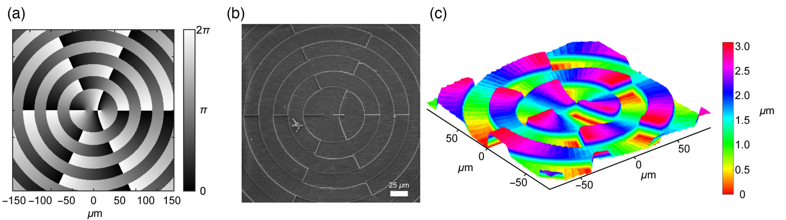
*   **来源**：[[../papers/Wang2023ultracompact]]
*   **图示描述**：(a) 螺旋 MPP(m=3,q=2)的连续相位设计，呈现多同心环与螺旋波前拓扑；(b) 制造后螺旋 MPP 的 SEM 图像；(c) 激光共聚焦显微镜实测的三维高度分布（高度放大 5× 显示）。
*   **关键特征**：螺旋相位非二元、沿角向连续卷绕，对应涡旋波前与轨道角动量；实测形貌清晰可见 TPP 逐层扫描留下的台阶状结构（离散化误差来源）；结构比偶 MPP 更复杂，但整体环带轮廓仍与设计一致。

### 30. 图5 4-f系统实验表征光路（BE→MPP→L1→RS→L2→RAP→CCD）
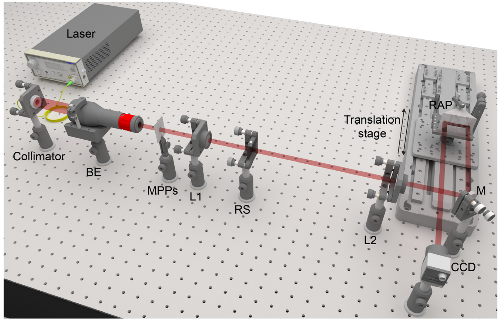
*   **来源**：[[../papers/Wang2023ultracompact]]
*   **图示描述**：MG 光束产生与表征的 4-f 实验光路：准直激光经扩束器(BE)照射 MPP，L1(f=30 mm)后焦面放环形狭缝(RS)做空间滤波，L2(f=300 mm)重构并放大光束至 CCD 靶面；平移台上的直角棱镜(RAP)作光学延迟线以扫描轴向强度。
*   **关键特征**：L1 与 L2 焦距比 1:10，将 300 μm 相位板图案放大到 CCD 可分辨尺寸；RAP 沿轴向移动等效改变传播距离 Z，是图8/图10 轴向强度测量的硬件实现；光路元件顺序即论文所有光学表征（图6–10）的统一装置。

### 31. 传感头与测量系统示意图，SLF对、泵浦/探测光路、滤光片与锁相检测

*   **来源**：[[../papers/Yarai2005optical]]
*   **图示描述**：图1包含(a)(b)两个子图与右侧系统框图，展示由两根端面相对的球透镜光纤（SLF，球面半径 R=10 μm）构成的传感头，以及泵浦激光、探测光、光纤耦合器、干涉滤光片、Si 光电二极管和锁相放大器组成的完整测量链路；(a)为泵浦关断时探测光在两光纤间正常耦合的光路，(b)为泵浦开启后水汽吸收形成热透镜、探测光发散偏离光纤 B 的光路。
*   **关键特征**：两根 SLF 端面间距 <50 μm（实测约 30 μm），预先调整到约 2 倍焦距 f₀ 后固定，中间填充待测空气；标注了干空气折射率 n₁、热透镜引起的折射率变化 Δn（Δn<0，等效凹透镜）、焦距 f₀ 和纤芯直径 d_c；泵浦源为 1.48 μm 多模激光二极管（光纤输出 100 mW，位于水近红外吸收第二峰），探测源为 850 nm SLD（FWHM 40 nm、0.1 mW），PD 前用 852 nm/FWHM 30 nm 干涉滤光片阻挡泵浦光；泵浦光以 f_m=10 Hz 调制，局域温升不超过 10⁻² K，对空气实际无加热。

### 32. 掺杂HfO2性能对比表

*   **来源**：[[../papers/chenHafniumBasedFerroelectricPostMoore2026]]
*   **图示描述**：横向对比不同掺杂元素（Si、Zr、La、Al、Y、Ce等）HfO₂铁电薄膜的关键性能参数表。
*   **关键特征**：① 列出掺杂浓度（mol%）、薄膜厚度（nm）、堆叠结构、2Pr（μC cm⁻²）、Ec（MV cm⁻¹）、热稳定性及参考文献；② Zr掺杂HZO工艺窗口最宽（400–600 °C结晶、50%浓度）；③ La掺杂稳定效应最强，2Pr可达约55 μC cm⁻²（800 °C退火）并抑制氧空位；④ Al掺杂通过压应变稳定超薄膜铁电相，La-Al共掺杂实现协同调控。

### 33. 图7 ：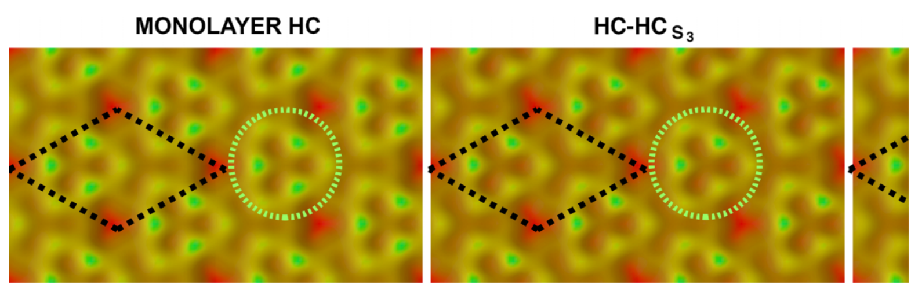 -> [[../figures/experimental-setups|实验装置与测量系统]]
 -> [[../figures/experimental-setups|实验装置与测量系统]]](../../raw/figures/cossuStackingChargedensityWaves2024/fig_7_DY75UYF5.png)
*   **来源**：[[../papers/cossuStackingChargedensityWaves2024]]
*   **图示描述**：与图5相同偏压与等高线设置，但改用纯 GGA（无 vdW 修正）的电子结构作 STM 模拟。
*   **关键特征**：整体图案与图5（GGA+DF）定性一致，仍能区分 HC-HC_(S3)、HC-HC_(S1)、HC-CC_(S4)；对比度略弱，但绿斑位置这一关键指纹不随 vdW 方案改变。

### 34. 图8 ：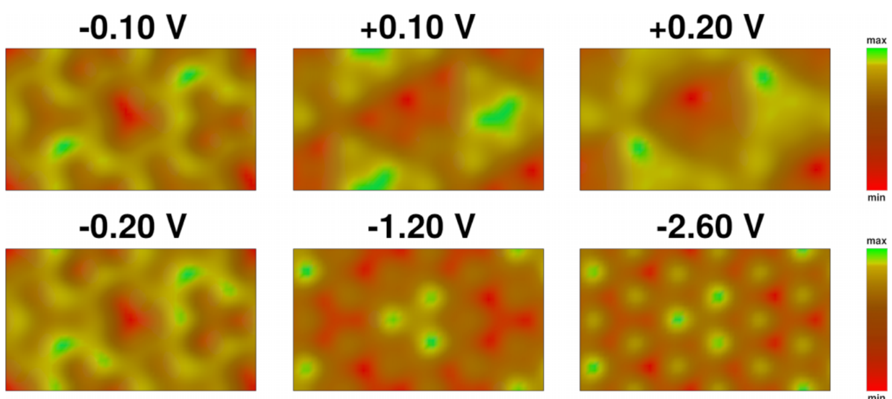 -> [[../figures/experimental-setups|实验装置与测量系统]]
 -> [[../figures/experimental-setups|实验装置与测量系统]]](../../raw/figures/cossuStackingChargedensityWaves2024/fig_8_U6BTPHHS.png)
*   **来源**：[[../papers/cossuStackingChargedensityWaves2024]]
*   **图示描述**：对基态 HC-HC_(S3) 在多个正负偏压下重复恒流 STM 模拟，考察图像随能量窗口的变化。
*   **关键特征**：在低偏压（含图5所用 −0.2 V）下三叶状不对称图案稳定；只有在较大负偏压下图案才发生明显变化，说明 −0.2 V 处的指纹具有代表性而非偶然。

### 35. 图9 ：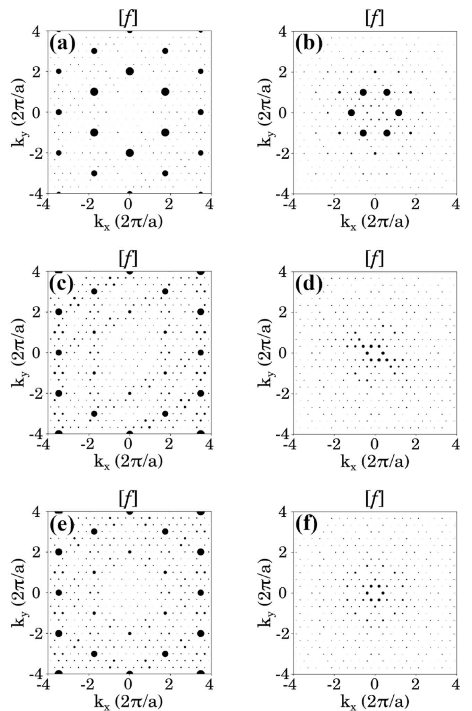 -> [[../figures/experimental-setups|实验装置与测量系统]]
 -> [[../figures/experimental-setups|实验装置与测量系统]]](../../raw/figures/cossuStackingChargedensityWaves2024/fig_9_TJ7WPXTW.png)
*   **来源**：[[../papers/cossuStackingChargedensityWaves2024]]
*   **图示描述**：附录 B 给出的图6结构因子未经插值/后处理的原始 (h,k) 网格散点数据。
*   **关键特征**：原始点已能看出布拉格峰位置与 CDW 卫星点的六重分布；与图6彩色插值图一一对应，便于核查后处理未引入伪影。

### 36. 图1 合成与结构表征：CVD生长、AFM、Raman、SAED、单层α-In2Se3原子分辨STEM，确认FE-ZB'构型
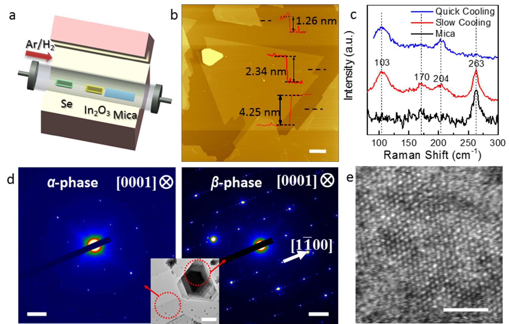
*   **来源**：[[../papers/cuiIntercorrelatedInplaneOutofplane2018a]]
*   **图示描述**：图1 综合展示二维 In2Se3 的CVD生长与结构确认：(a) 以 Se 和 In2O3 为前驱体在云母衬底上生长的示意图；(b) AFM 形貌及高度剖面，薄片厚度 1.3–4.3 nm；(c) 532 nm 激发下慢冷/快冷样品与云母的 Raman 光谱；(d) 单层（α 相）与 12 nm 厚（β 相）区域的 SAED 花样；(e) 单层 α-In2Se3 的原子分辨 STEM 图像。
*   **关键特征**：厚度 >2 nm 的薄片形状规则、边缘平直，结晶性好；<1.3 nm 为形状不规则的种子层。慢冷（0.1 °C/min）样品在 ~170 cm⁻¹ 处 A1(TO) 峰显著强于快冷样品，说明 α 相比例随慢冷显著增加。单层 SAED 对应 α-In2Se3 的 [0001] 带轴；12 nm 厚区域出现额外衍射点，归属于 β 相超结构。原子分辨 STEM 结合运动学衍射模拟，确认单层为理论预测的 FE-ZB' 铁电构型。

### 37. 图2 PFM研究：1–6层面内相位奇偶振荡，STEM-HAADF及SED投影电场显示2L到3L电场反转

*   **来源**：[[../papers/cuiIntercorrelatedInplaneOutofplane2018a]]
*   **图示描述**：图2 用 PFM 和 SED 揭示云母上 α-In2Se3 薄片的本征铁电性与层数依赖：(a) 2–6 nm 三角形薄片 AFM 形貌；(b,c) 对应的面内 PFM 振幅与相位图；(d) 1L–6L 面内相位统计；(e) 同一 2L→3L 区域的 STEM-HAADF 图像；(f) 沿 Y 方向的 HAADF 强度剖面；(g) 投影电场矢量图；(h) Ex、Ey 电场分量线剖面。
*   **关键特征**：每个台阶内自然形成单一铁电畴，存在两种相反 IP 极化方向。2 nm（约 2L）相位 ~120°，3 nm（约 3L）相位 ~−60°，4 nm（约 4L）回到 ~120°，1L–6L 呈明显奇偶振荡。SED 矢量图中电场从 2L 区的 [12̄10] 方向翻到 3L 区的 [101̄0] 方向；Ex 分量在边界处明显反转、Ey 小幅反转，直接可视化层间反平行极化。OOP 极化虽比 IP 小数十倍，但 OOP 相位也呈现同样的奇偶行为。

### 38. 图2 不同转角tBLG拉曼光谱、金纳米盘SEM/AFM形貌、光电流-电压/功率曲线、实时开关与空间光电流成像
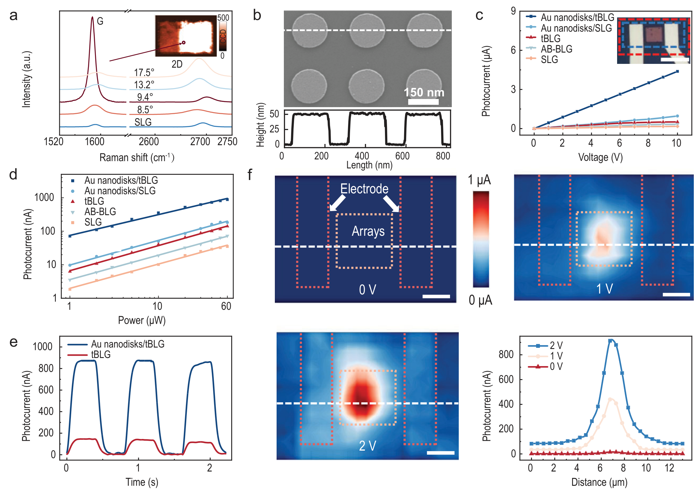
*   **来源**：[[../papers/duUltrasensitiveOptoelectronicBiosensor2025]]
*   **图示描述**：(a) SLG 与 8.5°、9.4°、13.2°、17.5° tBLG 的 633 nm 拉曼光谱及 G 带空间映射；(b) 金纳米盘的 SEM 周期阵列与 AFM 高度轮廓；(c)(d) 对比 SLG、AB-BLG、Au/SLG、tBLG、Au/tBLG 五种结构的光电流-偏压与光电流-入射功率曲线；(e) 多周期 660 nm 光照下的实时开关响应；(f) 0、1、2 V 偏压下的空间分辨光电流成像及线扫描。
*   **关键特征**：9.4° tBLG 的 G 带最强，I_G/I_2D 比 SLG 高约 28.11 倍；金纳米盘周期 274 nm、厚约 50 nm、异质结面积 7 μm × 7 μm；60 μW 低光照下 Au/tBLG 光响应度 14.64 mA/W，是纯 tBLG（2.34 mA/W）的 6.27 倍，EQE 达 27.51%；多周期开关衰减 <5%；2 V 偏压下光电流中心峰高斯分布，FWHM ≈ 1.5 μm，与等离激元限域尺度吻合。

### 39. 图5 DNA折纸组装、PAGE验证、TEM三角形结构、AFM高度分布、浓度依赖光电流与检测限标准曲线
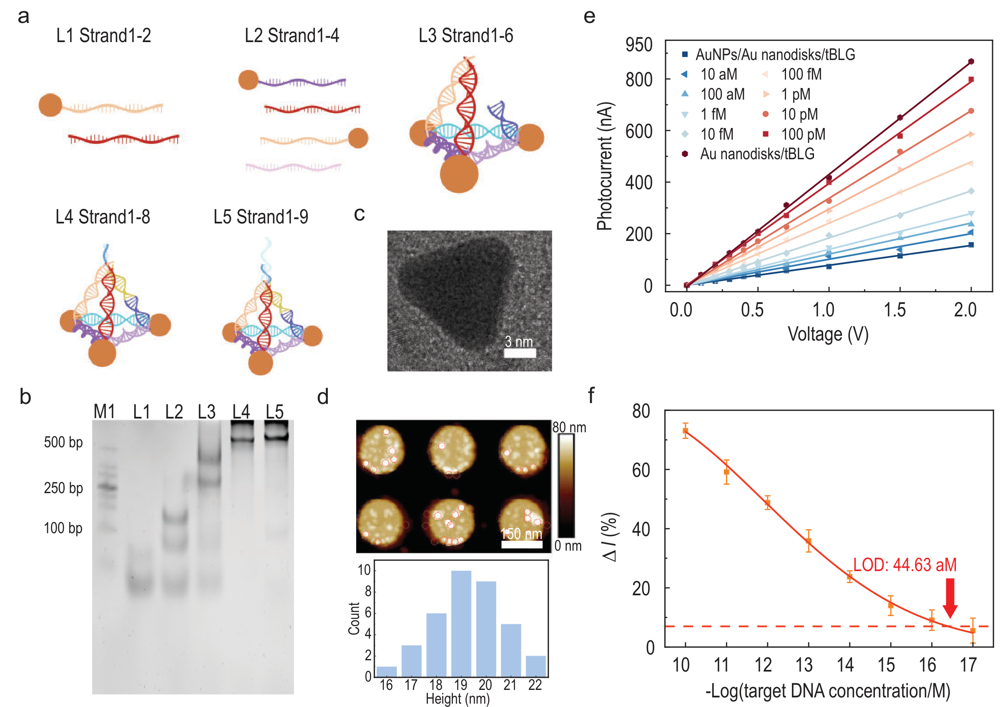
*   **来源**：[[../papers/duUltrasensitiveOptoelectronicBiosensor2025]]
*   **图示描述**：(a) 9 条 DNA 单链逐步折叠成四面体 DNA 折纸并经链 9 连接 AuNP 的示意图；(b) L1–L5 泳道的 PAGE 凝胶电泳；(c) 三角形 DNA 折纸的 TEM 图像；(d) AuNP/DNA 折纸/Au 纳米盘/tBLG 探针的 AFM 形貌与高度直方图；(e) 不同靶标浓度下的光电流-偏压曲线；(f) 信号变化率 ΔI% 对靶标浓度负对数的标准曲线。
*   **关键特征**：TEM 下可见清晰三角形折纸结构；AFM 探针高度集中在 18–21 nm，均一性高，是 FDTD 精确建模的基础；浓度梯度 10 aM–100 pM 跨 7 个数量级；信号变化率 ΔI = (I2−I1)/I0 × 100%（I0 基线、I1 AuNP 固定后、I2 反式切割后）；按 IUPAC 3σ 标准、阈值 6.45% 计算 LOD = 44.63 aM；检测时间 <1 小时，可区分单核苷酸错配。

### 40. 图4 (a) FE/AFE 相下 FM、AFM1/2/3 相对能量；(b) (110) 面内角度依赖磁各向异性能
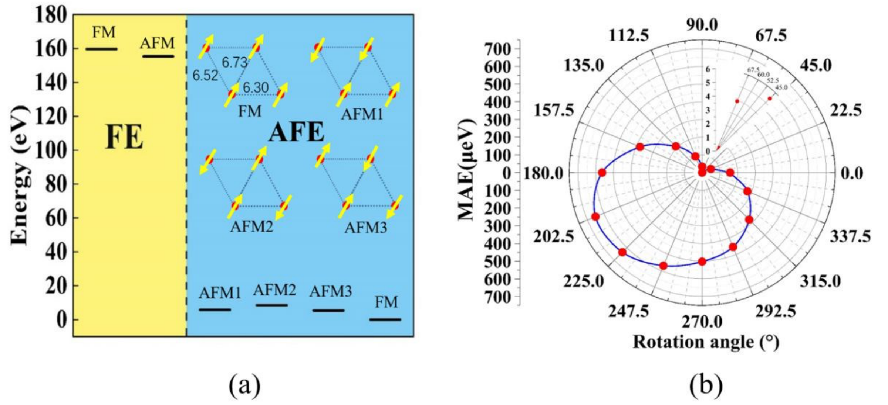
*   **来源**：[[../papers/fengFerroelectricityMultiferroicityTwodimensional2020]]
*   **图示描述**：(a) 2×1 超胞中 FM、AFM1、AFM2、AFM3 四种磁序在 FE 与 AFE 相下的相对能量柱状图（插图标注 Cr 离子距离，单位 Å）；(b) ScCrP₂Se₆ 在 (110) 面内磁各向异性能（μeV/Cr）随磁化方向角度的变化曲线。
*   **关键特征**：FE 相磁基态为 AFM，EAFM−EFM≈−4.3 meV/f.u.（弱 AFM）；AFE 相磁基态翻转为 FM；MAE 范围 7.2–195.7 μeV/Cr，大于立方 Fe/Ni 的 0.4–5 μeV；FE-AFM 易轴沿 [010]（垂直极化方向），AFE-FM 易轴沿 [111]；高 MAE 足以抵抗 Mermin–Wagner 限制、支撑二维长程磁序。

### 41. 图6 α-In2Se3：a)薄片AFM/PFM相位振幅；b)mica上2-6 nm厚In2Se3的IP PFM相位及翻转后图像

*   **来源**：[[../papers/guanRecentProgressTwoDimensional2020]]
*   **图示描述**：(a) 对比中心对称 c1T 与畸变 d1T-MoS₂ 的原子结构、能带结构及电荷密度差；(b) 展示 MX₂（M=Mo,W；X=S,Se,Te）从中心对称相到三聚化相的畸变模式与锯齿链。
*   **关键特征**：电荷密度差图直观显示 Mo 原子面内位移打破反演对称，是二维铁电性的必要条件；三聚化形成“之”字形金属链，是自发极化的结构起源；对应 Shirodkar & Waghmare PRL 2014 提出的电子-声子耦合驱动的不正铁电性。

### 42. 扫描探针在铁电氧化物薄膜中写入极性拓扑：SPM装置、面内拖尾电场分布、BFO薄膜中的闭合畴与中心型象限畴
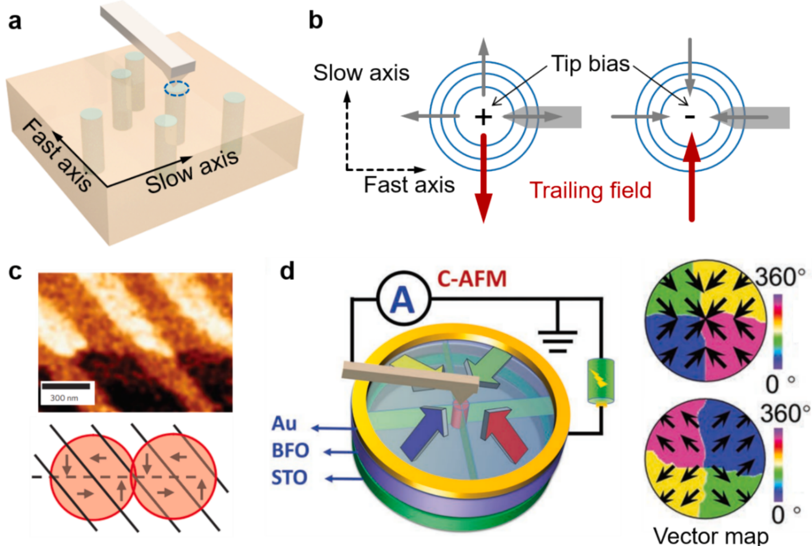
*   **来源**：[[../papers/hanPolarTopologicalMaterials2025]]
*   **图示描述**：(a) 扫描探针显微镜（SPM）写入装置示意；(b) 正/负偏压下中心发散/会聚电场及面内拖尾场分布；(c,d) BFO 薄膜中由探针电场写入的通量闭合畴与中心型象限畴 PFM 图像。
*   **关键特征**：探针偏压不仅产生垂直电场，其面内拖尾场可驱动极化旋转；BFO 薄膜中可电场写入闭合畴和四象限中心畴；这是外场调控极性拓扑的典型范例。

### 43. 图3 多种MXene的SEM/XRD/TEM/HRTEM/SAED/光学显微形貌表征

*   **来源**：[[../papers/naguib25thAnniversaryArticle2013a]]
*   **图示描述**：八面板子图组合：(a) Ti₃AlC₂ HF 处理后的 SEM；(b) Nb₂AlC 刻蚀前后 XRD；(c) Ta₄AlC₃ 长时间 HF 后的 TEM；(d,e) Ti₃C₂ 的低倍与截面 HRTEM；(f) OH 封端 Ti₃C₂ 原子模型；(g) (Ti₀.₅,Nb₀.₅)₂C 的 HRTEM 及 SAED 插图；(h) Ti₃CNTₓ 的光学透射显微图。
*   **关键特征**：① SEM 中颗粒呈典型"手风琴状"张开分层；② XRD 刻蚀后非 (000l) 峰消失，(000l) 峰宽化并向低 2θ 角偏移，定量表明 c 轴增大、长程有序减弱；③ Ta₄AlC₃ 长时间刻蚀出现孔洞，警示过度刻蚀；④ SAED 沿 [0001] 保持母体六方对称斑点，证实面内晶格遗传；⑤ Ti₃CNTₓ 薄片对可见光透明，证明已达少层厚度。

### 44. 图1 空气 vs 惰性环境下 WTe2 单层的光学与 STEM 对比

*   **来源**：[[../papers/niuDirectVisualizationLargeScale2021]]
*   **图示描述**：a–d 为光学显微照片对比 1T'-WTe2 在空气（a 刚取出、b 暴露 5 min）和手套箱惰性气氛（c 刚生长、d 保存 48 h）下的衬度变化；e、f 为空气中制备与全流程惰性气氛保护制备样品的大面积 HAADF-STEM 原子像对比。
*   **关键特征**：空气中暴露 5 min 光学衬度即由紫色褪色为淡紫色，STEM 像表面被氧化纳米颗粒和污染物覆盖、晶格周期性破坏；惰性气氛下 48 h 光学衬度无明显变化，STEM 像呈现大面积、干净、完整的 1T' 链状原子晶格。

### 45. 图2 褶皱的原子尺度识别：畸变 W-Te 四边形单元与 3D 重构

*   **来源**：[[../papers/niuDirectVisualizationLargeScale2021]]
*   **图示描述**：a 为单层 WTe2 大面积 HAADF-STEM 像，橙/蓝阴影标出褶皱上升沿和下降沿；b–g 为上弯/下弯区域的俯视、侧视原子模型与对应 STEM 模拟像；h–k 为垂直于 (100) 与 (110) 晶面的两个不同薄片的原子像及畸变 W–Te 四边形单元空间分布图。
*   **关键特征**：弯曲使 Te/W 柱构成的投影四边形单元（红色菱形）沿弯曲方向被压扁，压扁方向判明上弯或下弯；畸变单元沿平直条带排列、其截断边界严格平行于 (100)、(110) 或 (1−10) 晶面；由四边形间距重构三维起伏，弯曲斜率约 0.2，机械剥离样品中同样存在。

### 46. 图7 均匀单轴应变加载技术：两点弯曲、悬臂弯曲、卷曲、MEMS 拉伸
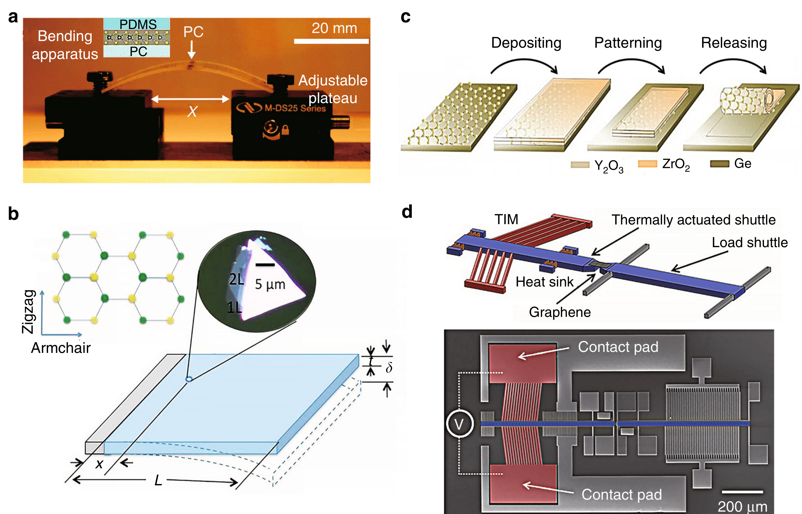
*   **来源**：[[../papers/pengStrainEngineering2D2020]]
*   **图示描述**：四种典型均匀单轴应变加载装置：两点/三点弯曲柔性衬底、悬臂梁弯曲、将二维材料卷绕成圆柱/卷曲结构，以及 MEMS 热致或压电致动拉伸台对悬浮薄膜的单轴拉伸。
*   **关键特征**：弯曲法装置简单、应变可由梁厚与曲率半径估算，通常 <4%；MEMS 拉伸可对悬浮样品施加高达 ~10–25% 的极端均匀应变，便于验证大应变下的带隙打开与相变；卷曲法能在三维曲面上引入可控单轴应变但分布受几何限制。

### 47. 图9 非均匀局部应变技术：激光照射、预拉伸释放起皱、纳米柱/粗糙金属表面支撑
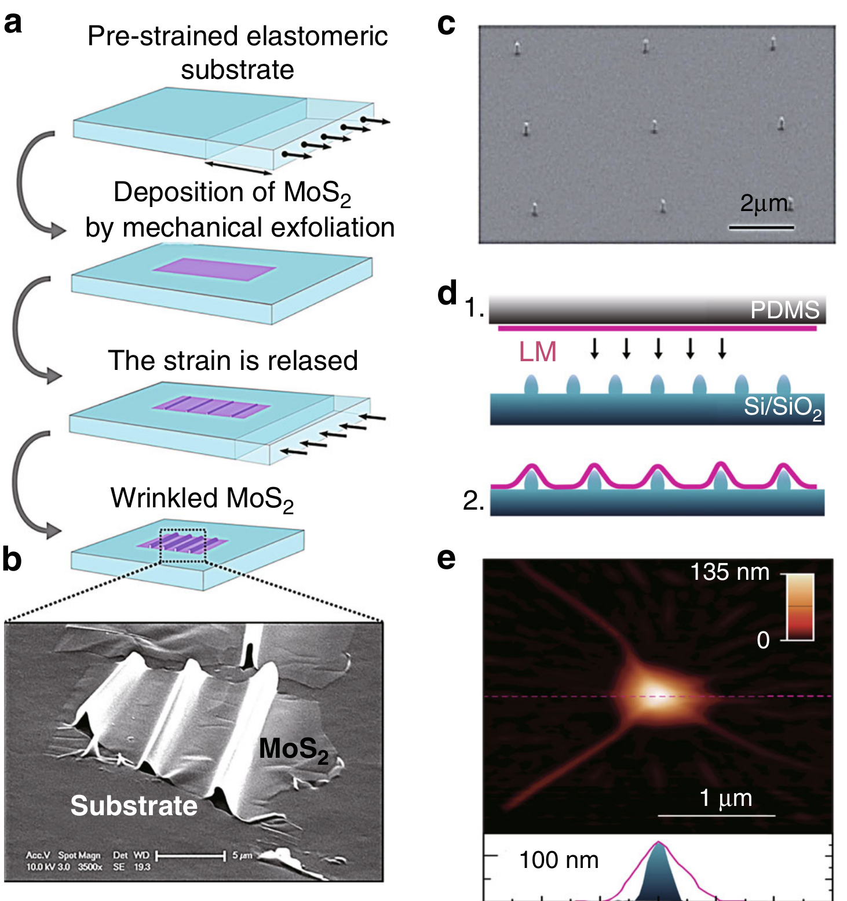
*   **来源**：[[../papers/pengStrainEngineering2D2020]]
*   **图示描述**：三类局部非均匀应变技术：(a) 激光辐照在样品上引入局部热膨胀/冲击应变；(b) 将二维材料转移到预拉伸弹性体后释放预应变形成周期性褶皱；(c–d) 将材料转移到刻蚀有纳米柱阵列或具有粗糙 Ag/Au 表面的衬底上，使其在尖端、边角处形成高度局域化的应变场。
*   **关键特征**：预拉伸释放法可在褶皱顶部产生大幅局部拉伸应变，是激子漏斗效应的物理载体；纳米柱/粗糙金属支撑可把应变局域到几十纳米尺度，是制备确定性单光子发射体的主流路线；激光法可实现远程、动态写入但应变场分布复杂、需精细表征。

### 48. 图2 SEM/TEM/HRTEM/SAED/AFM/Raman 形貌与结构表征
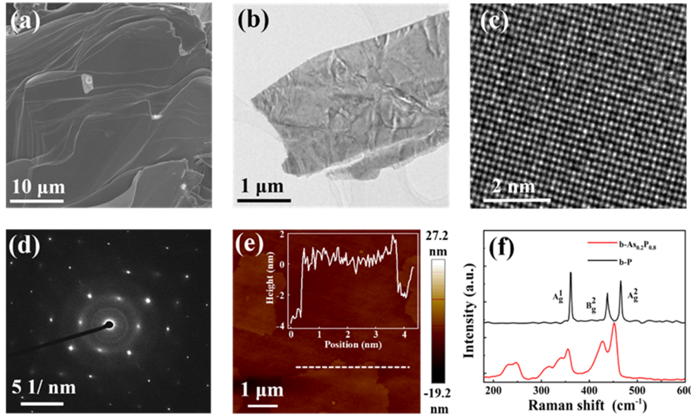
*   **来源**：[[../papers/shuTwoDimensionalBlackArsenic2020]]
*   **图示描述**：六联面板表征 LPE 制备的 b-AsP 纳米片：(a) SEM 显示块体层状形貌；(b) TEM 显示半透明薄片状纳米片；(c) HRTEM 给出清晰晶格条纹；(d) SAED 呈规则单晶衍射斑；(e) AFM 形貌及高度剖面；(f) Raman 光谱标出 Ag¹、B₂g、Ag² 三个特征峰。
*   **关键特征**：AFM 插图测得纳米片平均厚度约 5 nm；Raman 低频区 200–300 cm⁻¹ 弱峰归因为 As 振动（As 含量低故峰弱），高频区 300–500 cm⁻¹ 归因为 P–P / As–P / P–As 多种键合；HRTEM 与 SAED 共同证实高结晶度与单晶性质。

### 49. 表3 不同 NLO 材料 2 μm 锁模光纤激光器性能对比
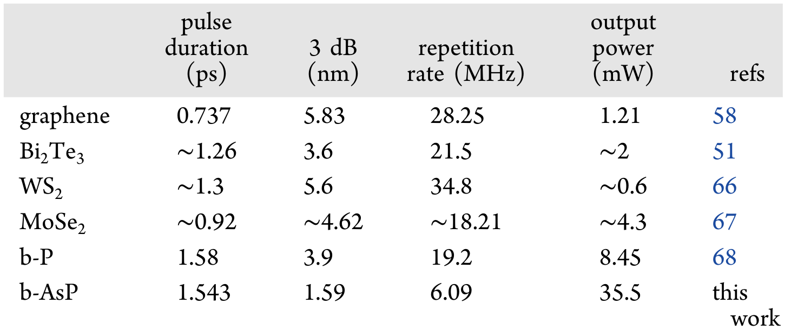
*   **来源**：[[../papers/shuTwoDimensionalBlackArsenic2020]]
*   **图示描述**：对比石墨烯、Bi₂Te₃、WS₂、MoSe₂、黑磷与 b-AsP 作为 SA 在 2 μm 锁模光纤激光器中的脉宽、3 dB 带宽、重复频率与输出功率。
*   **关键特征**：b-AsP 输出功率 35.5 mW、脉宽 1.543 ps（正文图 9 自相关拟合值为 2.49 ps，表中所列数值取自不同拟合/工作点）、3 dB 带宽 1.59 nm、重频 6.09 MHz；石墨烯仅 1.21 mW，Bi₂Te₃ 约 2 mW，WS₂ 约 0.6 mW，MoSe₂ 约 4.3 mW，黑磷 8.45 mW；b-AsP 输出功率是黑磷的 4 倍以上。

### 50. 图7 EDF/TDF 光纤激光器环形腔装置示意图
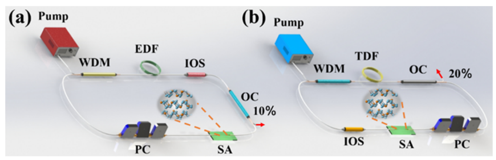
*   **来源**：[[../papers/shuTwoDimensionalBlackArsenic2020]]
*   **图示描述**：(a) 掺铒光纤激光器（EDF，1.5 μm 波段）与 (b) 掺铥光纤激光器（TDF，2 μm 波段）的环形腔结构示意图，b-AsP 纳米片与一段微纳光纤耦合构成可饱和吸收器件接入腔内。
*   **关键特征**：腔内典型元件包括 WDM 波分复用器（耦合泵浦光）、隔离器（保证单向传输）、偏振控制器（调节腔内偏振态以启动锁模）、输出耦合器；b-AsP-SA 以微纳光纤倏逝场集成方式接入，光-物质作用距离长、散热好。

### 51. ED Fig.10 少层 NiI2 AFM 与额外偏振旋转测量

*   **来源**：[[../papers/songEvidenceSinglelayerVan2022]]
*   **图示描述**：少层 NiI₂ 薄片的宽场光学照片、对应的 AFM 形貌/高度图（单层台阶约 0.62–0.65 nm，用于层数标定），以及在 1L–4L 区域不同畴上分别测得的 θ(T) 曲线。
*   **关键特征**：AFM 高度与光学对比度共同可靠地区分 1L–4L；各层数上多个畴的 θ(T) 给出可重复的 T_c：1L ≈ 21 K、2L ≈ 30 K、3L ≈ 39 K、4L ≈ 41 K，随层数单调上升并向块材 59.5 K 趋近；不同畴仅在 θ 幅值与方向上有差别，转变温度一致。

### 52. Fig.7 WTe2与3R-MoS2 PFM/电学表征
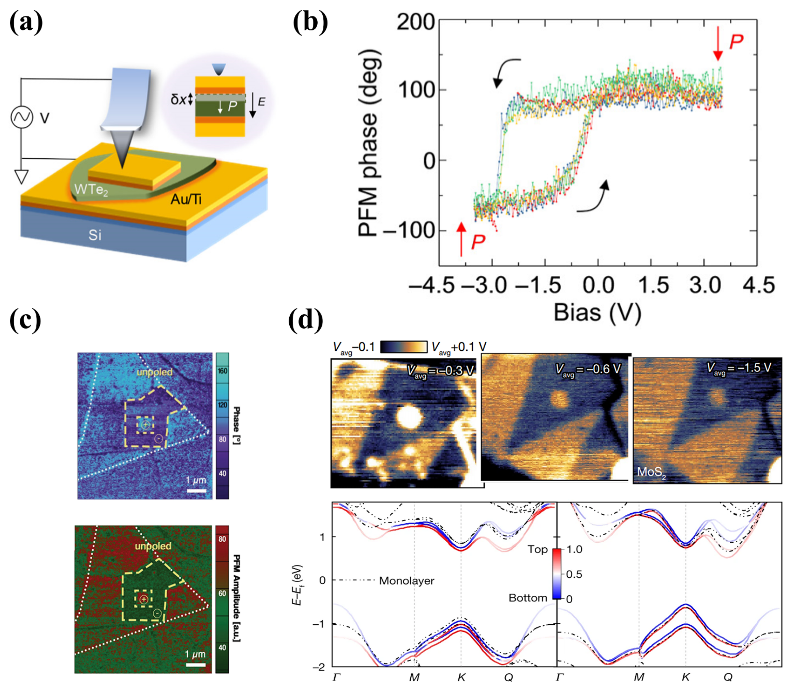
*   **来源**：[[../papers/sunSlidingFerroelectricityTwodimensional2025]]
*   **图示描述**：PFM 与电学表征组合图：(a) PFM 测试 WTe₂ 的装置示意；(b) 压电响应相位图显示 180° 翻转；(c) 双层异质结振幅回线；(d) 不同栅压下双层 3R-MoS₂ 的表面电势图与能带结构。
*   **关键特征**：PFM 的 180° 相位翻转是铁电畴翻转的直接证据；振幅滞回线证实可切换极化；栅压调控 K 谷在层间的分配，从而调制极化；把宏观铁电响应与微观轨道杂化、电荷重分布联系起来。

### 53. 图3 近网法修正向量机制：累积离格轨迹偏差并在分量超半格时触发修正步
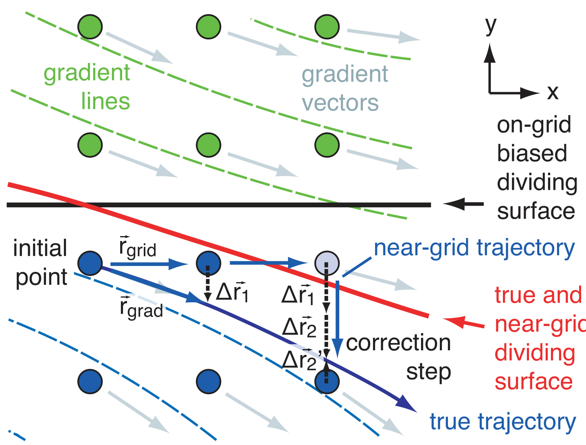
*   **来源**：[[../papers/tangGridbasedBaderAnalysis2009]]
*   **图示描述**：近网法（near-grid）单条上升轨迹的"跳跃—修正"细节：从某格点出发，先按中心有限差分算出真实梯度并沿其走到离格点 r_grad，再跳到最近格点 r_grid，二者之差作为修正向量 r 累积；当 r 的某个分量超过半个网格间距时触发一次额外修正步（图中为 −y 方向），并从 r 中扣除该步长。
*   **关键特征**：修正向量 r 始终从当前格点指向真实的离格轨迹；触发阈值是"半个网格间距"，保证任意方向上格点路径与真实轨迹偏差不超过半格；新增终止条件——到达一个自身及邻居都已分配给同一区域的点即可停止；初分配后还需对边界点做一次边缘精修。

### 54. 图4 三高斯二维模型上在网法/近网法/边缘精修后分割面对比
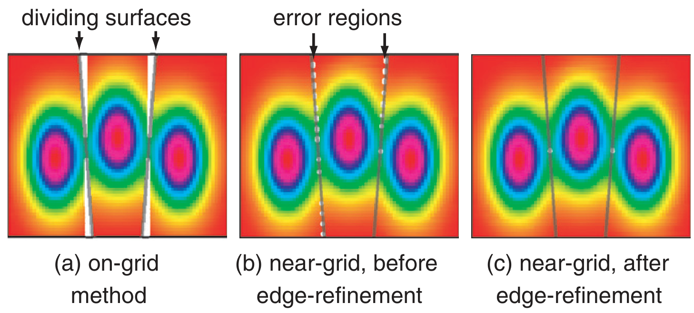
*   **来源**：[[../papers/tangGridbasedBaderAnalysis2009]]
*   **图示描述**：在三个高斯函数人为构造、真实分割面与网格成小角度的二维电荷密度上，对比三种处理结果：(a) 在网法，(b) 近网法单次迭代，(c) 近网法再做一次边缘精修；灰色斜线为真实分割面，白色区域为错误分配区。
*   **关键特征**：(a) 在网法给出与网格对齐的垂直分割面，错误区沿真实斜线大片连续分布；(b) 近网法一次迭代后错误区被压缩到真实分割面附近一两个格点宽度内；(c) 再做一次精修后除两个低分辨率误配点外全部修正；网格加密后近网法可收敛到精确 Bader 体积。

### 55. 图1 实验装置与不同位置表面褶皱的STM图像

*   **来源**：[[../papers/wangFormationMechanismTwin2019]]
*   **图示描述**：(a) 为样品堆叠示意图，自下而上为 Si 衬底、固化铟胶、WTe₂ 单晶，加热器位于衬底下方；(b) 为四个不同位置的表面褶皱 STM 形貌图，标尺 50 nm。
*   **关键特征**：加热熔化铟再冷却固化时，铟与 WTe₂ 热膨胀系数不匹配及固化非均匀形变会向 WTe₂ 引入大的局部应变；上两幅褶皱窄而不对称（类似自折叠 ripplocation），下两幅宽而对称，所有褶皱高度在 100–200 pm 范围，证明应变场高度不均匀；表面观察到的褶皱中只有不到 10% 是孪晶畴界。

### 56. 图1 反铁电耦合的自发应变：纳米条纹超结构、SAED卫星斑、原位XRD温变曲线
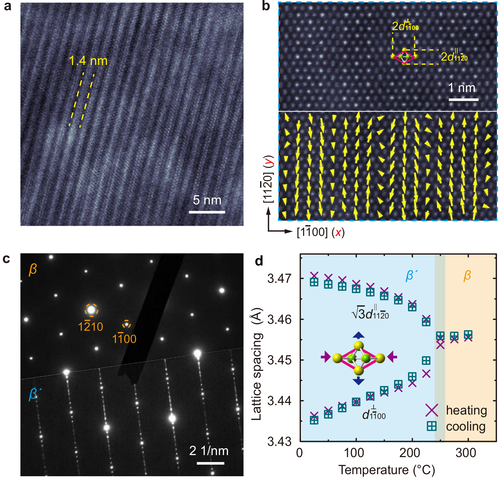
*   **来源**：[[../papers/xuTwodimensionalFerroelasticityVan2021]]
*   **图示描述**：四连图展示 β'-In₂Se₃ 反铁电超结构及其引起的二维自发应变。(a) TEM 明场像呈现周期约 1.4 nm 的纳米条纹；(b) 原子分辨 ADF-STEM 叠加原子位移矢量，标出 d⊥1100 与 d∥1120 两个测量方向；(c) β 相（上）与 β' 相（下）的 SAED 花样对比；(d) 原位变温 XRD 给出 √3d∥1120 与 d⊥1100 随温度（0–300 °C）的变化及加热/冷却回线。
*   **关键特征**：β' 相 SAED 在 n/8 {1-100} 处出现卫星斑，对应纳米条纹周期；β→β' 转变温度约 250 °C；降温时 √3d∥1120 增大、d⊥1100 减小，给出沿条纹方向拉伸、垂直方向压缩的各向异性自发应变 ε≈±0.49%；加热曲线与冷却曲线重合，转变完全可逆；相邻条纹间 Se 原子反平行位移，证明其二维反铁电本质。

### 57. SRAM vs STT-RAM 面积/延迟/能耗对比（Table 1）

*   **来源**：[[../papers/xueEmergingNonvolatileMemories2011]]
*   **图示描述**：65 nm 工艺下，1 MB SRAM 缓存体与 4 MB STT-RAM 缓存体在面积、读/写延迟、读/写能量、待机功耗上的对比表（含 ECC 开销）。
*   **关键特征**：两者面积几乎相同（SRAM 36.2 mm² vs STT-RAM 36.0 mm²），但 STT-RAM 容量为 4×；读延迟 2.318 ns 与 SRAM 2.252 ns 相近，写延迟 6.181 ns 约为 SRAM 2.244 ns 的 2.8×；读能略低（0.858 vs 1.074 nJ），写能更高（2.997 vs 0.956 nJ）；待机功耗 STT-RAM 仅 0.125 W，约为 SRAM 1.04 W 的 1/8。

### 58. 图1 柔性基底应变引入法：预拉伸褶皱、热失配、热收缩、弯曲装置
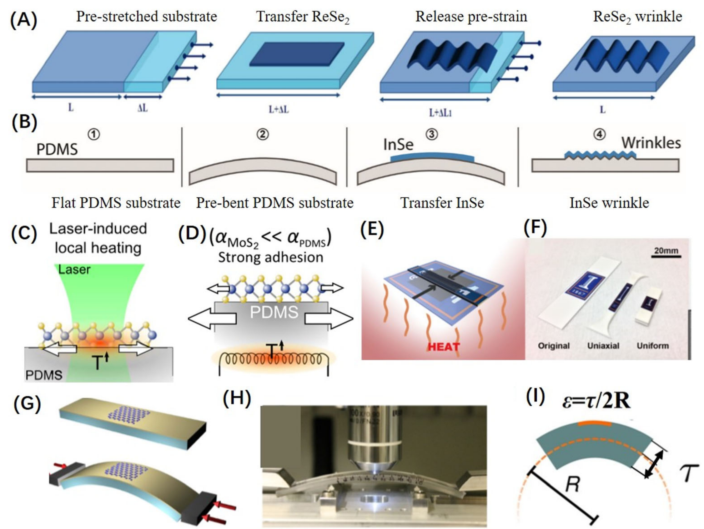
*   **来源**：[[../papers/yangStrainEngineeringTwodimensional2021]]
*   **图示描述**：方法学示意组图，展示四类基于柔性衬底向二维材料施加应变的路径。(A)(B) 为预拉伸/预弯曲 PDMS 释放后形成的周期性褶皱；(C)(D) 为激光局部加热 PDMS 衬底通过热膨胀失配向 MoS₂ 传应变；(E)(F) 为加热 PS 热收缩衬底对石墨烯施加可控压缩；(G)–(I) 为两点/四点弯曲装置及弯曲截面示意。
*   **关键特征**：预拉伸褶皱顶部最大局域非均匀应变约 1–2%；激光加热 PDMS/MoS₂ 在 150 °C 实现 0.23% 双轴均匀拉伸应变；PC 衬底 −200–100 °C 温区可实现 −1.48%–0.48% 连续应变，传递效率 >80%；弯曲法应变 ε=τ/(2R)，单轴、均匀、可逆、重复性好，但低模量 PDMS 易滑移。

### 59. 表1 六种应变诱导方法在各二维材料体系中的应变范围与类型对比
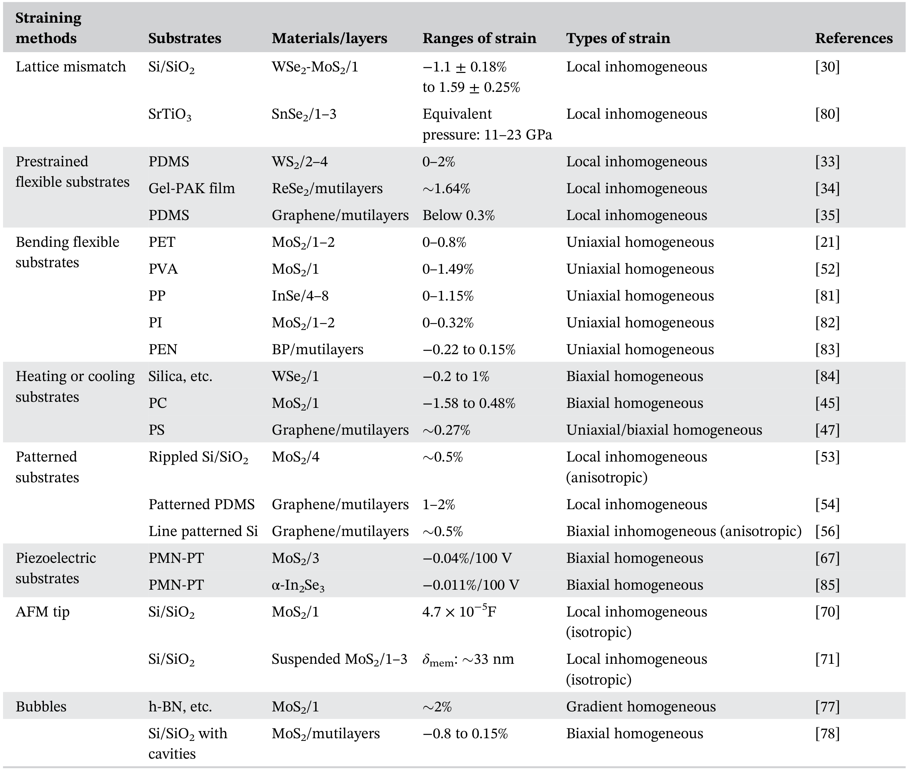
*   **来源**：[[../papers/yangStrainEngineeringTwodimensional2021]]
*   **图示描述**：六列速查表，按"应变方法 / 衬底 / 材料-层数 / 应变范围 / 应变类型 / 参考文献"汇总全文引用的代表性体系，行覆盖晶格失配、预拉伸柔性衬底、弯曲柔性衬底、图案化衬底、压电衬底、AFM 针尖、气泡等六大类方法。
*   **关键特征**：晶格失配以 WSe₂–MoS₂ 面内异质结为例，应变范围 −1.1±0.18%–1.59±0.25%，局域非均匀；预拉伸 PDMS/WS₂ 为 0–2% 局域非均匀；弯曲 PET/MoS₂ 0–0.8%、PVA/MoS₂ 0–1.49%、PEN/BP −0.22–0.15% 均为单轴均匀；SrTiO₃/SnSe₂ 体系以等效压力 11–23 GPa 表征；应变类型列直接区分单轴/双轴、均匀/非均匀，便于按需求选型。

### 60. 图2 图案化基底（波纹SiO₂、倒置漏斗Si、ZnO纳米棒）与PMN-PT压电基底
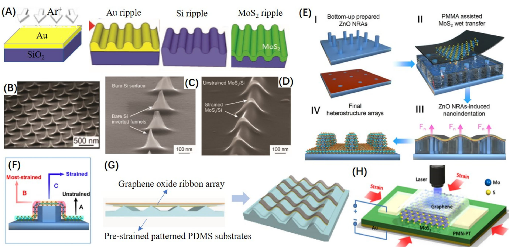
*   **来源**：[[../papers/yangStrainEngineeringTwodimensional2021]]
*   **图示描述**：(A) 离子束刻蚀波纹 SiO₂/Si 衬底再转移 MoS₂ 的工艺流程；(B)–(D) 倒置漏斗形 Si 阵列 SEM 及 MoS₂ 共形贴合；(E)(F) ZnO 纳米棒阵列上 MoS₂ 的周期性悬空/褶皱与应变分区；(G) 图案化柔性衬底制备波浪形石墨烯超级电容器电极；(H) PMN-PT 压电衬底通过逆压电效应向三层 MoS₂ 传应变的机理示意。
*   **关键特征**：倒置漏斗 Si 阵列上单片 MoS₂ 拉伸应变达 3.46–3.65%；ZnO 纳米棒阵列引入周期性局域双轴应变，分为未应变/应变/最大应变三区；PMNT-PT 在 500 V 偏压下经石墨烯顶电极向三层 MoS₂ 传递 0.2% 双轴均匀压缩应变；图案化柔性超级电容器在 100% 应变、5000 次循环下仍稳定。

### 61. 图3 AFM针尖压缩/拉伸加载、界面自发气泡与压力差鼓泡装置
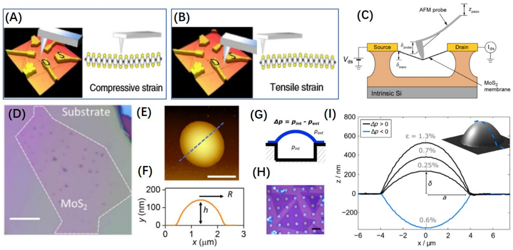
*   **来源**：[[../papers/yangStrainEngineeringTwodimensional2021]]
*   **图示描述**：(A)(B) AFM 针尖压在单层 MoS₂ 中心产生压缩应变、压在边缘产生拉伸应变的示意；(C) 针尖按压悬浮 MoS₂ 膜并原位测电学性能的装置；(D)–(F) MoS₂/h-BN 界面自发气泡的光学、AFM 形貌及截面（半径 R、高度 h）；(G)–(I) 圆柱微腔上悬浮 MoS₂ 膜，通过充入 N₂ 调节内外压差使其鼓/凹。
*   **关键特征**：刚性 Si 衬底上针尖最大力约 25 nN，变形小；悬浮 MoS₂ 膜在针尖下中心挠度可达 33 nm；TERS 空间分辨率在单层 MoS₂ 上达约 2.3 nm；MoS₂/h-BN 自发气泡引入约 2% 平滑梯度应变，气泡高宽比 h/R 仅取决于粘附能 γ 与杨氏模量 Y，局部应变 ε∝(h/R)²；压力鼓泡法中心应变 ε=σ(ν)(δ/a)²，可连续可逆调节。

### 62. 表1
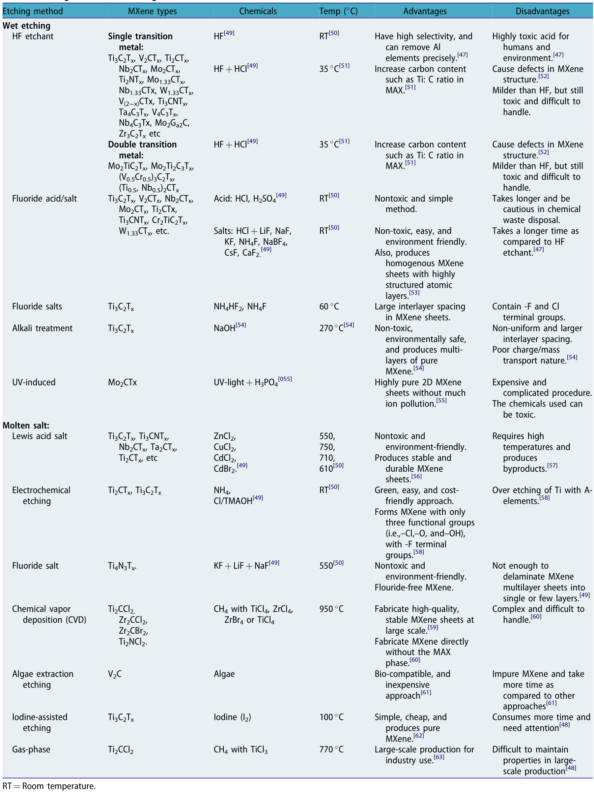
*   **来源**：[[../papers/zahraCriticalAnalysisFerroelectric2025]]
*   **图示描述**：系统列出湿法 HF 刻蚀、氟盐/强酸、NH4HF2、无氟熔盐、电化学刻蚀、CVD 等方法的试剂、条件、所得端基及优缺点。
*   **关键特征**：刻蚀方法直接决定端基 T_x（-O/-OH/-F/-Cl/-S/-Br/-NH2 等），是性能调控第一旋钮；HF 法成熟但有毒，熔盐/电化学/CVD 代表绿色、规模化方向。

### 63. 图8
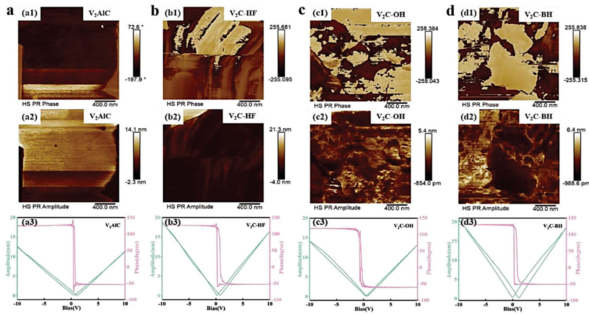
*   **来源**：[[../papers/zahraCriticalAnalysisFerroelectric2025]]
*   **图示描述**：压电力显微镜（PFM）对三种不同刻蚀/还原条件 V2CTx（V2C-HF、V2C-OH、V2C-BH）测得的形貌、振幅、相位图，以及振幅-电压蝴蝶曲线和相位-电压回滞曲线。
*   **关键特征**：振幅蝴蝶曲线对应压电形变，相位曲线呈现 ~180° 翻转，是铁电极化可被电场可逆翻转的直接指纹；三种样品的翻转电场不同，证明刻蚀/还原条件（即端基）可直接调控 V2C 的铁电性能。

### 64. 表2：21 种多铁体磁基态、T_C/T_N、MAE、极化与势垒

*   **来源**：[[../papers/zhaoRealization2DMultiferroic2024]]
*   **图示描述**：表格列出全部 21 种多铁 AM₂X₄ 的磁基态（FM/AFM/FiM）、居里/奈尔温度 T_C/T_N、磁各向异性能 MAE、面外极化 P_out 与翻转势垒 E_B，并按 type-a/b/c 分组。
*   **关键特征**：type-a 旗舰 T-CdCr₂Te₄ 的 T_C ≈ 260 K、FE 转变温度 >300 K、P_out ≈ 2.77 pC/m、E_B ≈ 66 meV/f.u.；type-b 代表 T-CoZr₂S₄ 的 T_C ≈ 70 K 但 FE 在室温稳定；type-c 代表 T-CoTi₂Te₄ 净磁矩约 0.21 μB/f.u.、E_B ≈ 79 meV/f.u.；同属 type-a 的 T-AgMn₂Se₄ T_C 高达约 525 K。
