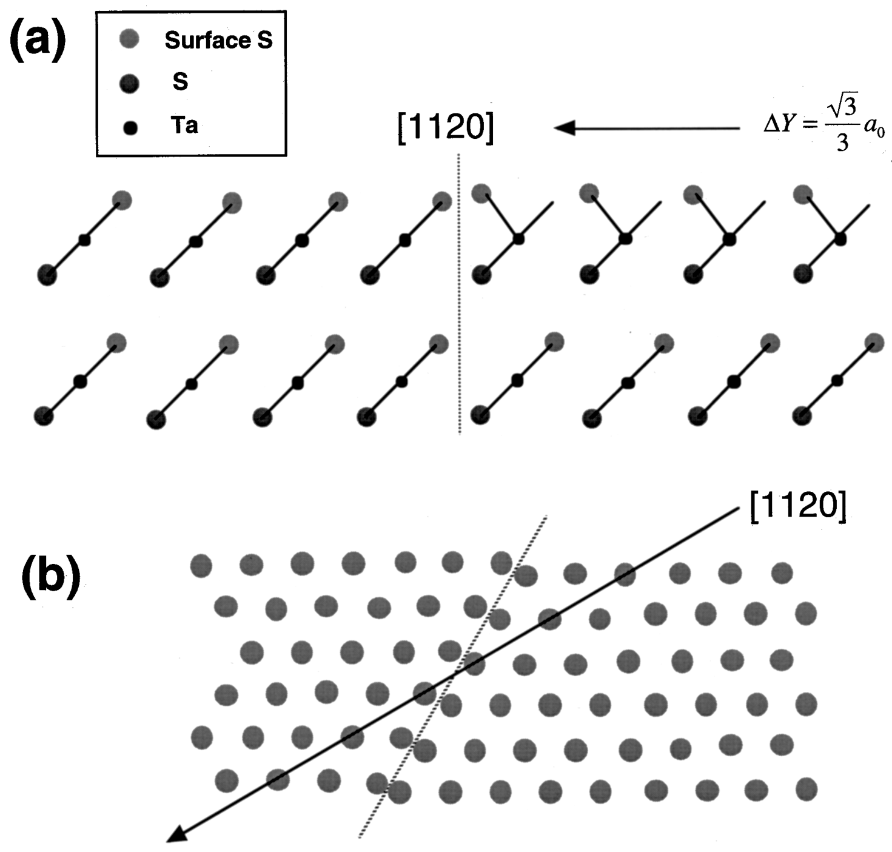

# 铁弹畴、畴壁、In₂Se₃ 与器件应用 (Domains, Domain Walls, In₂Se₃ & Devices)

> 收录铁弹畴与畴壁的大尺度可视化、In₂Se₃ 互锁极化、孪晶形成机制、光电器件与铁电存储应用相关图表。本页横跨第一性原理预测、原子尺度电镜表征到器件级演示，呈现二维范德华铁弹/铁电体系从结构物理到功能应用的完整链条。

[[科研Wiki/wiki/figures/_index|← 返回总索引]]

---

## 🖼️ 畴结构、相变与器件 (Domains, Phase Transitions & Devices)

### 1. 表：单层 Cr₂S₃ 的 AFM/XRD/XPS 表征汇总
汇总原子力显微镜、X 射线衍射与 X 射线光电子能谱对单层 Cr₂S₃ 的高度、晶向与化学态测量结果。

<table><thead><tr><th>表征手段</th><th>特征参数</th><th>结果</th></tr></thead><tbody><tr><td>AFM</td><td>高度轮廓</td><td>证实为单一单元层（1.8 nm）</td></tr><tr><td>XRD</td><td>θ摇摆曲线</td><td>局限在半极宽度84.0°–85.5°</td></tr><tr><td>XPS</td><td>化学态</td><td>形成Cr₂S₃及Al-S键（连接单层或基底）</td></tr></tbody></table>

*   **来源**：[[../papers/RecentAdvancesGrowth2025]]
*   **关键特征**：AFM 测得单层厚度约 1.8 nm，证实为单元层 Cr₂S₃。

### 2. Mn₂N 表面钝化与 Janus 结构电子性质
单层 Mn₂N 经 O、F、OH、Cl 不同原子/基团钝化后，形成对称或非对称（Janus）结构，其态密度呈现半金属与绝缘的差异。

*   **来源**：[[../papers/chen3dLevelSymmetry2025]]
*   **关键特征**：O 与 Cl 钝化的 Mn₂N 表现为半金属，F 与 OH 钝化则打开带隙。

### 3. 金纳米盘对扭转双层石墨烯的选择性增强
不同扭转角（8.5°–17.5°）的扭转双层石墨烯（tBLG）在金纳米盘等离激元结构下的拉曼光谱、SEM 形貌与光电流-偏压特性。

*   **来源**：[[../papers/duUltrasensitiveOptoelectronicBiosensor2025]]

### 4. 不同扭转角下光电流与调制深度
金纳米盘/tBLG 异质结在 8.5°、9.4°、13.2°、17.5° 扭转角下的光电流谱、响应度及调制深度随入射光子能量的变化。

*   **来源**：[[../papers/duUltrasensitiveOptoelectronicBiosensor2025]]

### 5. 基于金纳米盘/tBLG 的 miRNA 光电生物检测
利用 DNA 折纸组装金纳米颗粒，结合金纳米盘/tBLG 异质结实现从 100 pM 到 1 fM 浓度范围的 miRNA 光电流检测。

*   **来源**：[[../papers/duUltrasensitiveOptoelectronicBiosensor2025]]
*   **关键特征**：检测下限达 1 fM，展示了 tBLG 等离激元异质结在超灵敏生物传感中的应用。

### 6. 铁电斯格明子的拓扑数与形成机制
相场模拟给出 PTO/STO 界面处极化分布与拓扑密度，并展示拓扑数 NQ 随 PTO 层厚的变化及 (103) 衍射斑附近的倒易空间图。

*   **来源**：[[../papers/gongAbsenceCriticalThickness2023]]

### 7. 铁电畴操控与莫尔畴壁合并
背栅调控下 R-MoSe₂ 器件的侧向 PFM 振幅图、高应变区莫尔畴壁合并现象，以及四种畴壁构型的电回滞特性。

*   **来源**：[[../papers/guoAdvancesTwodimensionalFerroelectric2025]]

### 8. 柔性 MoTe₂ 的 P/M 八面体形变层
单层 MoTe₂ 中 Te 八面体的 P（逆时针）与 M（顺时针）形变示意，以及双层 P−M、P+M 构型与 Mo–Mo 之字链结构。

*   **来源**：[[../papers/huangPolarPhaseDomain2019]]

### 9. 二维 In₂Se₃ 的 α/β/β′ 相结构
第一性原理计算给出单层 In₂Se₃ 的顶视结构，以及铁电 α 相（不同极化方向）、顺电 β 相与畸变 β′ 相的侧视与顶视。

*   **来源**：[[../papers/huangTwodimensionalIn2Se3Rising2022]]

### 10. 剪切声子驱动 In₂Se₃ 铁电-顺电转变
750 K 下 4 ps 分子动力学模拟展示 α 相 In₂Se₃ 在剪切声子模式驱动下向顺电相的转变，及各层原子位移在 12 支光学声子模上的投影。

*   **来源**：[[../papers/huangTwodimensionalIn2Se3Rising2022]]
*   **关键特征**：750 K 下 4 ps 内完成相变，剪切声子模是触发 α 相转变的主导模式。

### 11. TMD 中 T 相与 H 相的相界结构
沿 ⟨112̄0⟩ 截面的 T/H 相界晶体结构示意，表层 S 原子层沿 ⟨112̄0⟩ 方向相干滑动约 1 Å 后形成相界。

*   **来源**：[[../papers/kimObservationPhaseTransition1997]]
*   **关键特征**：T/H 相界面存在约 √3/6 晶格常数（~1 Å）的错配，可通过集体运动实现 T→H 转变。

### 12. 1T 与 1T′-WTe₂ 单层原子结构
1T 与 1T′ 相 WTe₂ 单层的二维原胞与侧视图，1T′ 可由 1T 相结构畸变导出，且该特征为第 VI 族 MX₂ 所共有。

*   **来源**：[[../papers/liFerroelasticityDomainPhysics2016]]
*   **关键特征**：1T′ 原胞对应 1T 相的 1×√3 超胞。

### 13. 1T′-MX₂ 的三种取向变体
1T 结构中三个对称性等价的畸变方向对应 1T′ 相的三种取向变体（O1/O2/O3），及其弛豫后的原子结构。

*   **来源**：[[../papers/liFerroelasticityDomainPhysics2016]]

### 14. 剪切应变下三种变体的势能
以 O1 变体平衡超胞为参考，1T′-WTe₂ 三种取向变体的势能随剪切应变的变化，正负百分之几的应变即可使 O2/O3 更稳定。

*   **来源**：[[../papers/liFerroelasticityDomainPhysics2016]]
*   **关键特征**：仅需几个百分点的剪切应变即可使 O2 或 O3 变体能量低于 O1，是铁弹翻转的热力学基础。

### 15. 取向翻转的 NEB 能垒与路径
以 O1 基态为初态、同尺寸应变 O2 为末态的 NEB 计算，给出每化学式单元的能量随反应坐标变化及翻转路径上的原子结构。

*   **来源**：[[../papers/liFerroelasticityDomainPhysics2016]]

### 16. 铁弹畴壁的原子结构
DFT 弛豫得到的 1T′-WTe₂ 中 O1–O2、O1–O3、O2–O3 变体之间铁弹畴壁的原子结构，不同变体以颜色区分。

*   **来源**：[[../papers/liFerroelasticityDomainPhysics2016]]

### 17. EuTe₄ 中的非公度电荷密度波
EuTe₄ 晶体结构（含 Te 双层与单层基元）、室温 X 射线衍射、沿 (0,K,10) 的高分辨强度切峰以及费米面，揭示非公度 CDW。

*   **来源**：[[../papers/lvUnconventionalHystereticTransition2022]]

### 18. 钙钛矿超晶格中的薄膜应变效应
CaTiO₃/SrTiO₃/BaTiO₃ 三色超晶格截面 Z 衬度原子像、结构示意及广角 X 射线衍射，展示锐利界面与长程周期性。

*   **来源**：[[../papers/martinThinfilmFerroelectricMaterials2016]]

### 19. 肼插层 OH 端基 Ti₃C₂ 的 MD 模拟
分子动力学模拟肼（N₂H₄）分子插层 OH 端基 Ti₃C₂ MXene 的过程，层间距 c 随插层分子数的增加先形成单层再向第二层过渡。

*   **来源**：[[../papers/naguib25thAnniversaryArticle2013a]]
*   **关键特征**：N/C≈0.4 时形成单层肼（c≈25–26 Å），继续插层开始形成第二层。

### 20. CIPS 中三种反铁电相结构
CuInP₂S₆（CIPS）中层间与层内反铁电有序的三种 AFE 相原子结构，及其相对铁电相的能量比较。

*   **来源**：[[../papers/neumayerCompetingPolarPhases2025]]

### 21. CIPS 截面的层错与应变映射
CIPS 薄片 FIB 截面的 HAADF STEM 像显示利用 ⟨002⟩ 反射成像后可见的层堆叠缺陷，以及几何相位分析得到的 εyy 应变分量图。

*   **来源**：[[../papers/neumayerCompetingPolarPhases2025]]

### 22. 空气敏感 WTe₂ 单层的光学与 STEM 成像
对比空气中与手套箱中放置不同时间的 1T′-WTe₂ 光学照片，并给出大气与惰性环境下制备的大尺度 HAADF STEM 像。

*   **来源**：[[../papers/niuDirectVisualizationLargeScale2021]]
*   **关键特征**：空气中 5 min 即出现明显对比度变暗，而手套箱中 48 h 无明显变化。

### 23. 连续 WTe₂ 单层的集体畸变晶格
大尺度 WTe₂ 单层的 HAADF-STEM 像显示由上升、下降段组成的褶皱结构，(110) 晶面为褶皱边界，并配有对应原子模型。

*   **来源**：[[../papers/niuDirectVisualizationLargeScale2021]]

### 24. WTe₂ 连续褶皱的各向异性
褶皱沿垂直于 (110) 晶面方向传播，畸变四边形单元的空间分布决定"Bend up"与"Bend down"弯曲方向。

*   **来源**：[[../papers/niuDirectVisualizationLargeScale2021]]

### 25. 褶皱调制的本征 Te 空位各向异性分布
WTe₂ 单层中四种不同 Te 空位位置的 HAADF-STEM 像与原子结构，侧视图显示弯曲区上下部对称划分及空位的择优分布。

*   **来源**：[[../papers/niuDirectVisualizationLargeScale2021]]

### 26. 褶皱对晶向与部分氧化的各向异性响应
晶界附近 WTe₂ 褶皱的 STEM 像，显示来自晶界的可能应变方向，以及部分氧化情形下细阶梯状褶皱的原子尺度像。

*   **来源**：[[../papers/niuDirectVisualizationLargeScale2021]]

### 27. 少层 NiI₂ 异质结器件制备流程
示意大而厚薄片的去除、少层 NiI₂ 电器件制备，以及 hBN/石墨烯/NiI₂/hBN 堆叠的 Hall bar 器件拾取、转移、图形化与刻蚀流程。

*   **来源**：[[../papers/RecentAdvancesGrowth2025]]

### 28. WTe₂ 孪晶实验装置与表面褶皱
以铟为胶将 WTe₂ 粘于 Si 衬底，利用加热/冷却产生应变的样品堆叠示意，以及不同位置 STM 观测到的表面褶皱。

*   **来源**：[[../papers/wangFormationMechanismTwin2019]]
*   **关键特征**：比例尺为 50 nm 的 STM 像显示多个位置的表面褶皱，是孪晶形成的实验特征。

### 29. 正常区与孪晶区的应变映射
600 μm × 800 μm 大样品中正常区与孪晶区的应变映射（比例尺 2 nm）、白色框内的剪切应变线轮廓，以及多点应变测量。

*   **来源**：[[../papers/wangFormationMechanismTwin2019]]

### 30. 广义层错能与孪晶形成机制
将完整 1T′-WTe₂ 上半部分沿 x 方向刚性滑动得到孪晶的六帧结构（I–VI），及对应的广义层错能（GSFE）曲线与各能量定义。

![图：1T′-WTe₂ 沿 [110] 滑动形成孪晶的过程及 GSFE 曲线](../../raw/figures/wangFormationMechanismTwin2019/fig_4_HM29HPEF.png)
*   **来源**：[[../papers/wangFormationMechanismTwin2019]]
*   **关键特征**：定义了不稳定层错能 γusf、层错能 γsf、不稳定孪晶能 γutf 等关键参数。

### 31. 非易失存储单元面积的电路仿真
从电路设计者视角比较不同存储接口，在 65 nm 工艺下对各类非易失存储单元面积的仿真结果（图注截断，仅余片段）。

*   **来源**：[[../papers/xueEmergingNonvolatileMemories2011]]

### 32. 3R β′-In₂Se₃ 中 120° 畴壁的表面褶皱
2H 与 3R β′-In₂Se₃ 的截面 STEM 叠加结构模型、偏光显微镜多畴图及 AFM 形貌，3R 相以 60° 畴壁为主、少量 120° 畴壁并伴生表面褶皱。

*   **来源**：[[../papers/xuTwodimensionalFerroelasticityVan2021]]

### 33. 3R β′-In₂Se₃ 中倾斜 60° 畴壁
偏光显微镜显示台阶边缘处顶面畴壁位移，AFM 与侧向 PFM 相位像及示意给出 3D 堆叠导致的倾斜 60° 畴壁几何。

*   **来源**：[[../papers/xuTwodimensionalFerroelasticityVan2021]]
*   **关键特征**：台阶高度变化约 270 nm，顶面对应畴壁位移约 480 nm，证实畴壁在体内倾斜。

### 34. 层间滑移多铁性的构筑与四态
根据单层对称性选择 A/A 或 A/B 堆叠模式以构筑层间滑移多铁性，并展示 P↑N↑、P↑N↓、P↓N↓、P↓N↑ 四个多铁态及其互联对称性。

*   **来源**：[[../papers/zhaoOpticalFingerprintsTwodimensional2024]]

### 35. 双层 VSe₂ 四态的光电导与 SHG
计算得到的双层 VSe₂ 在四种多铁态下的反常光电导 σ^A_xy 与二次谐波（SHG）系数，各态光学指纹相互区分。

*   **来源**：[[../papers/zhaoOpticalFingerprintsTwodimensional2024]]
*   **关键特征**：不同多铁态的 SHG 与 Kerr 系数差异显著，可作为非易失光学读出指纹。

---

## 🔗 相关概念与实体 (Related Concepts & Entities)

**核心概念**：[[../concepts/ferroelasticity|铁弹性 (ferroelasticity)]]、[[../concepts/ferroelectricity|铁电性 (ferroelectricity)]]、[[../concepts/sliding-ferroelectricity|滑移铁电性 (sliding ferroelectricity)]]、[[../concepts/moire-ferroelectricity|莫尔铁电性 (moiré ferroelectricity)]]、[[../concepts/multiferroicity|多铁性 (multiferroicity)]]、[[../concepts/charge-density-wave|电荷密度波 (CDW)]]、[[../concepts/strain-engineering|应变工程 (strain engineering)]]、[[../concepts/topological-defects|拓扑缺陷 (topological defects)]]、[[../concepts/generalized-stacking-fault-energy|广义层错能 (GSFE)]]、[[../concepts/twin-domain-boundary|孪晶畴界 (twin domain boundary)]]

**相关材料/实体**：[[../entities/In2Se3|In₂Se₃]]、[[../entities/WTe2|WTe₂]]、[[../entities/MoTe2|MoTe₂]]、[[../entities/TMDs|过渡金属硫族化合物 (TMDs)]]、[[../entities/twisted-bilayer-graphene|扭转双层石墨烯 (tBLG)]]、[[../entities/NiI2|NiI₂]]、[[../entities/CuInP2S6|CuInP₂S₆ (CIPS)]]、[[../entities/Cr2S3|Cr₂S₃]]、[[../entities/VSe2|VSe₂]]、[[../entities/h-BN|h-BN]]
